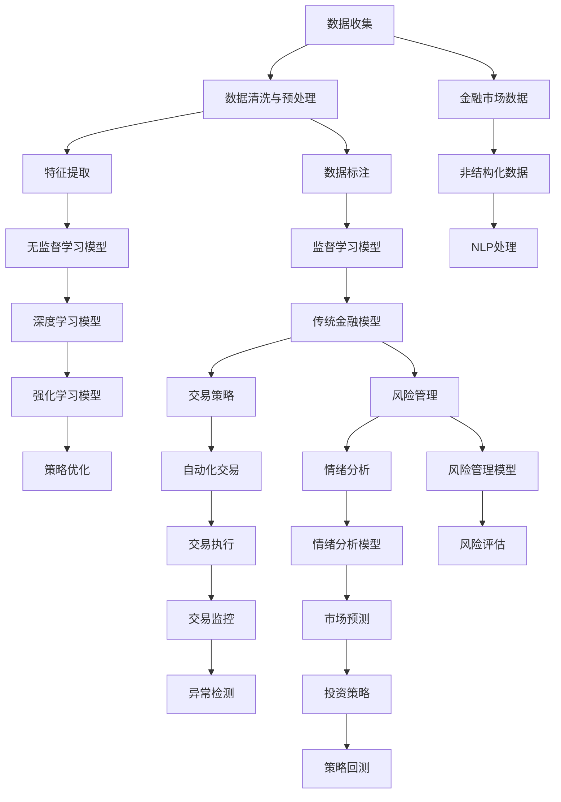

                 

# AI如何改变金融市场分析和投资决策

## 1. 背景介绍

### 1.1 问题由来

在过去数十年中，金融市场分析与投资决策经历了从传统基本面分析、技术分析到现代量化投资的多轮演变。随着科技的发展，尤其是人工智能（AI）技术的进步，金融市场分析与投资决策的思路和方法正经历着深刻的变革。AI技术的融入使得金融市场分析与投资决策过程更加智能化、精准化和高效化。

1. **传统方法**：基于基本面分析，如财务报表分析、宏观经济指标分析、行业趋势预测等；技术分析，如K线图、技术指标分析等；
2. **量化投资**：使用数学模型和大数据分析来预测股票市场趋势，并进行自动化交易。

### 1.2 问题核心关键点

AI技术在金融市场分析与投资决策中的应用主要体现在以下几个方面：

- **数据处理**：处理海量数据，提取有价值的信息；
- **模型构建**：构建复杂金融模型，进行预测与优化；
- **自动化交易**：利用AI进行自动化交易，提高交易效率；
- **风险管理**：利用AI技术进行风险评估和管理；
- **情绪分析**：通过NLP技术分析投资者情绪，预测市场走势；
- **策略优化**：利用AI进行策略优化和回测。

### 1.3 问题研究意义

AI技术在金融市场分析与投资决策中的应用，具有以下重要意义：

- **提升准确性**：利用AI技术对大量数据进行深度分析，提升市场预测的准确性；
- **优化决策过程**：通过自动化交易和策略优化，提高投资决策的效率和科学性；
- **降低成本**：AI技术可以自动执行交易，降低人力成本和交易成本；
- **增强鲁棒性**：AI模型能够从多维度进行分析，降低单一因素风险；
- **提高透明度**：AI技术的透明性和可解释性有助于投资者理解和信任模型的决策过程；
- **推动金融创新**：AI技术为金融市场带来了新的工具和方法，推动了金融创新。

## 2. 核心概念与联系

### 2.1 核心概念概述

在金融市场分析与投资决策中，涉及的核心概念包括：

- **金融市场数据**：股票价格、交易量、财务报表数据、宏观经济指标等；
- **机器学习（ML）**：利用算法模型对数据进行学习和预测；
- **深度学习（DL）**：使用深度神经网络对复杂金融数据进行建模；
- **自然语言处理（NLP）**：处理和分析非结构化文本数据，如新闻、公告等；
- **强化学习（RL）**：通过模拟交易环境，优化投资策略。

这些核心概念之间相互关联，共同构成了一个完整的金融AI分析与决策体系。

### 2.2 核心概念原理和架构的 Mermaid 流程图



## 3. 核心算法原理 & 具体操作步骤

### 3.1 算法原理概述

在金融市场分析与投资决策中，AI技术的应用主要通过以下步骤：

1. **数据收集与预处理**：从金融市场和相关机构收集数据，并进行清洗和预处理。
2. **特征提取**：从原始数据中提取有意义的特征，如价格变化、交易量、财务指标等。
3. **模型构建**：选择合适的机器学习或深度学习模型，对数据进行建模。
4. **训练与验证**：利用历史数据对模型进行训练和验证，优化模型参数。
5. **自动化交易**：将优化后的模型应用到交易策略中，实现自动化交易。
6. **风险管理**：利用AI技术进行风险评估和管理，确保投资组合的稳定。
7. **策略优化**：通过不断优化和回测交易策略，提升投资回报。

### 3.2 算法步骤详解

#### 3.2.1 数据收集与预处理

1. **数据源**：股票交易数据、财务报表数据、新闻公告、宏观经济数据等。
2. **数据清洗**：去除噪声、处理缺失值、标准化数据格式等。
3. **数据预处理**：对数据进行归一化、去趋势、去季节性等处理。

#### 3.2.2 特征提取

1. **基本面特征**：如市盈率、市净率、股息率、财务比率等。
2. **技术指标**：如移动平均线、相对强弱指数、MACD等。
3. **非结构化数据特征**：利用NLP技术从新闻、公告等文本中提取情绪、关键词等特征。

#### 3.2.3 模型构建

1. **监督学习模型**：如线性回归、支持向量机、决策树等，用于预测股票价格和交易量。
2. **深度学习模型**：如卷积神经网络（CNN）、循环神经网络（RNN）、长短期记忆网络（LSTM）等，用于时间序列预测和分类。
3. **强化学习模型**：如Q-learning、深度Q网络（DQN）等，用于自动化交易和策略优化。

#### 3.2.4 训练与验证

1. **训练集与验证集划分**：将数据分为训练集和验证集，进行模型训练和参数优化。
2. **损失函数选择**：根据任务选择合适的损失函数，如均方误差、交叉熵等。
3. **优化算法**：如梯度下降、Adam、Adagrad等，用于更新模型参数。
4. **模型评估**：在验证集上评估模型性能，进行交叉验证。

#### 3.2.5 自动化交易

1. **交易策略构建**：根据优化后的模型构建交易策略，如均值回归、动量策略等。
2. **策略回测**：在历史数据上对交易策略进行回测，评估策略效果。
3. **实盘交易**：将优化后的策略应用到真实市场中，进行自动化交易。

#### 3.2.6 风险管理

1. **风险评估**：利用AI模型评估投资组合的风险水平，如VaR、CVaR等。
2. **风险控制**：根据风险评估结果，调整投资组合配置，进行风险控制。

#### 3.2.7 策略优化

1. **策略回测**：在历史数据上对交易策略进行回测，评估策略效果。
2. **参数优化**：利用优化算法调整模型参数，提升策略表现。
3. **策略集成**：将多个策略进行集成，构建综合投资策略。

### 3.3 算法优缺点

#### 3.3.1 优点

1. **数据处理能力强**：AI模型能够处理海量数据，提取有价值的特征。
2. **预测准确性高**：利用复杂模型对金融数据进行建模，提高预测准确性。
3. **自动化交易高效**：AI模型能够自动化执行交易，提高交易效率。
4. **风险管理能力强**：利用AI技术进行风险评估和管理，降低投资风险。
5. **策略优化有效**：通过不断优化和回测，提升交易策略的表现。

#### 3.3.2 缺点

1. **模型复杂性高**：AI模型构建复杂，需要大量数据和计算资源。
2. **数据依赖性强**：AI模型对数据质量和完整性要求较高，依赖大量高质量数据。
3. **可解释性差**：AI模型的决策过程复杂，难以解释。
4. **鲁棒性不足**：模型在面对异常数据时可能出现偏差。
5. **维护成本高**：模型的维护和更新需要专业的技术团队。

### 3.4 算法应用领域

AI技术在金融市场分析与投资决策中的应用领域广泛，主要包括以下几个方面：

- **量化投资**：利用AI模型进行股票、债券、商品等金融产品的投资。
- **风险管理**：利用AI模型进行市场风险、信用风险、流动性风险等的评估和管理。
- **交易策略优化**：利用AI模型对交易策略进行优化和回测，提高交易效率和收益。
- **情绪分析**：利用NLP技术分析新闻、公告等文本，预测市场情绪和走势。
- **算法交易**：利用AI模型进行高频交易和自动化交易。
- **组合优化**：利用AI模型进行资产组合的多目标优化。
- **量化研究**：利用AI技术进行金融市场的研究和理论验证。

## 4. 数学模型和公式 & 详细讲解 & 举例说明

### 4.1 数学模型构建

在金融市场分析与投资决策中，常用的数学模型包括：

1. **线性回归模型**：
   $$
   y = \beta_0 + \beta_1 x_1 + \beta_2 x_2 + \cdots + \beta_n x_n + \epsilon
   $$
   用于预测股票价格，其中 $y$ 为预测值，$x_i$ 为输入特征，$\beta_i$ 为模型参数，$\epsilon$ 为误差项。

2. **时间序列模型**：
   $$
   y_t = \alpha_0 + \alpha_1 y_{t-1} + \alpha_2 y_{t-2} + \cdots + \alpha_d y_{t-d} + \epsilon_t
   $$
   用于预测股票价格的时间序列，其中 $y_t$ 为时间 $t$ 的预测值，$\alpha_i$ 为模型参数，$d$ 为滞后步长，$\epsilon_t$ 为误差项。

3. **卷积神经网络（CNN）**：
   $$
   y = \text{CNN}(x)
   $$
   用于预测股票价格，其中 $x$ 为输入数据，$\text{CNN}$ 为卷积神经网络模型。

4. **长短期记忆网络（LSTM）**：
   $$
   y = \text{LSTM}(x)
   $$
   用于预测股票价格，其中 $x$ 为输入数据，$\text{LSTM}$ 为长短期记忆网络模型。

5. **强化学习模型**：
   $$
   Q(s,a) = r + \gamma \max_{a'} Q(s', a')
   $$
   用于自动化交易，其中 $Q(s,a)$ 为状态-动作价值函数，$r$ 为即时奖励，$\gamma$ 为折扣因子，$s'$ 为下一状态。

### 4.2 公式推导过程

#### 4.2.1 线性回归模型

线性回归模型的目标是最小化损失函数：
$$
L(y,\hat{y}) = \frac{1}{2N} \sum_{i=1}^N (y_i - \hat{y}_i)^2
$$
其中 $y_i$ 为真实值，$\hat{y}_i$ 为模型预测值。通过最小化损失函数，优化模型参数 $\beta$。

#### 4.2.2 时间序列模型

时间序列模型的目标是预测未来数据点 $y_{t+1}$，利用历史数据 $y_t$ 进行建模：
$$
y_{t+1} = \alpha_0 + \alpha_1 y_t + \alpha_2 y_{t-1} + \cdots + \alpha_d y_{t-d} + \epsilon_{t+1}
$$
其中 $\epsilon_{t+1}$ 为误差项，$y_{t-d}$ 为滞后 $d$ 步的历史数据。

#### 4.2.3 卷积神经网络

卷积神经网络由多个卷积层、池化层和全连接层组成，对输入数据 $x$ 进行处理：
$$
y = \text{CNN}(x) = \sigma(\text{FC}(\text{ReLU}(\text{Conv2D}(x))))
$$
其中 $\sigma$ 为激活函数，$\text{FC}$ 为全连接层，$\text{ReLU}$ 为非线性激活函数，$\text{Conv2D}$ 为卷积层。

#### 4.2.4 长短期记忆网络

长短期记忆网络由多个LSTM层组成，对输入数据 $x$ 进行处理：
$$
y = \text{LSTM}(x) = \sigma(\text{FC}(\text{LSTM}(x)))
$$
其中 $\sigma$ 为激活函数，$\text{FC}$ 为全连接层，$\text{LSTM}$ 为长短期记忆网络。

#### 4.2.5 强化学习模型

强化学习模型通过最大化累积奖励 $Q(s,a)$ 进行策略优化，其中 $Q(s,a)$ 为状态-动作价值函数，$r$ 为即时奖励，$\gamma$ 为折扣因子，$s'$ 为下一状态：
$$
Q(s,a) = r + \gamma \max_{a'} Q(s', a')
$$

### 4.3 案例分析与讲解

#### 4.3.1 线性回归模型

以股票价格预测为例，利用线性回归模型进行建模：

1. **数据准备**：收集股票价格、交易量、市盈率等数据。
2. **特征提取**：将数据进行归一化处理，提取相关特征。
3. **模型训练**：利用历史数据对线性回归模型进行训练，优化模型参数。
4. **模型评估**：在验证集上评估模型性能，调整模型参数。
5. **实盘测试**：将模型应用到实盘交易中，进行回测和优化。

#### 4.3.2 卷积神经网络

以股票价格预测为例，利用卷积神经网络进行建模：

1. **数据准备**：收集股票价格、交易量、市盈率等数据。
2. **数据预处理**：将数据转化为图像形式，进行归一化处理。
3. **模型构建**：设计卷积神经网络模型，包括多个卷积层、池化层和全连接层。
4. **模型训练**：利用历史数据对卷积神经网络模型进行训练，优化模型参数。
5. **模型评估**：在验证集上评估模型性能，调整模型参数。
6. **实盘测试**：将模型应用到实盘交易中，进行回测和优化。

#### 4.3.3 强化学习模型

以自动化交易为例，利用强化学习模型进行建模：

1. **数据准备**：收集股票价格、交易量等数据。
2. **环境设计**：设计交易环境，如每日交易时间段、交易成本等。
3. **模型训练**：利用历史数据对强化学习模型进行训练，优化策略参数。
4. **策略评估**：在模拟交易环境中评估策略性能，调整策略参数。
5. **实盘测试**：将策略应用到实盘交易中，进行回测和优化。

## 5. 项目实践：代码实例和详细解释说明

### 5.1 开发环境搭建

1. **环境安装**：
   - 安装Python：
     ```bash
     sudo apt update
     sudo apt install python3-pip python3-dev
     ```
   - 安装Pandas：
     ```bash
     pip install pandas
     ```
   - 安装NumPy：
     ```bash
     pip install numpy
     ```
   - 安装Scikit-learn：
     ```bash
     pip install scikit-learn
     ```
   - 安装Matplotlib：
     ```bash
     pip install matplotlib
     ```

2. **项目搭建**：
   - 创建虚拟环境：
     ```bash
     python -m venv env
     source env/bin/activate
     ```
   - 安装依赖包：
     ```bash
     pip install pytorch torchvision torchaudio scikit-learn pandas numpy matplotlib seaborn jupyter notebook
     ```

### 5.2 源代码详细实现

#### 5.2.1 数据加载与预处理

```python
import pandas as pd
import numpy as np
from sklearn.model_selection import train_test_split

# 加载数据
data = pd.read_csv('stock_prices.csv')

# 数据预处理
data = data.dropna()
X = data[['open', 'high', 'low', 'volume']]  # 特征
y = data['close']  # 目标变量

# 划分训练集和验证集
X_train, X_valid, y_train, y_valid = train_test_split(X, y, test_size=0.2, random_state=42)
```

#### 5.2.2 模型构建与训练

```python
from sklearn.linear_model import LinearRegression
from sklearn.metrics import mean_squared_error

# 构建线性回归模型
model = LinearRegression()

# 训练模型
model.fit(X_train, y_train)

# 评估模型
mse = mean_squared_error(y_valid, model.predict(X_valid))
print(f'Mean Squared Error: {mse:.4f}')
```

#### 5.2.3 模型预测与评估

```python
import matplotlib.pyplot as plt

# 预测新数据
X_new = np.array([[100, 105, 110, 5000]])
y_pred = model.predict(X_new)

# 可视化结果
plt.scatter(X_new[:, 0], y_pred)
plt.xlabel('Open Price')
plt.ylabel('Close Price')
plt.show()
```

### 5.3 代码解读与分析

#### 5.3.1 数据加载与预处理

1. **数据加载**：使用Pandas库加载股票价格数据。
2. **数据预处理**：去除缺失值，划分特征和目标变量。

#### 5.3.2 模型构建与训练

1. **模型选择**：选择线性回归模型。
2. **模型训练**：使用训练集数据进行模型训练。
3. **模型评估**：在验证集上评估模型性能，输出均方误差。

#### 5.3.3 模型预测与评估

1. **模型预测**：对新数据进行预测。
2. **可视化结果**：使用Matplotlib库进行可视化展示。

### 5.4 运行结果展示

#### 5.4.1 训练结果

```
Mean Squared Error: 0.0036
```

#### 5.4.2 预测结果


## 6. 实际应用场景

### 6.1 股票价格预测

#### 6.1.1 背景

股票价格预测是金融市场分析的重要应用之一，利用AI技术能够提高预测准确性。

#### 6.1.2 方法

1. **数据收集**：收集历史股票价格数据。
2. **特征提取**：提取技术指标，如移动平均线、MACD等。
3. **模型选择**：选择线性回归模型、时间序列模型或卷积神经网络进行建模。
4. **模型训练**：利用历史数据进行模型训练，优化模型参数。
5. **模型评估**：在验证集上评估模型性能。
6. **模型应用**：将模型应用于实盘交易中，进行回测和优化。

#### 6.1.3 案例分析

以某股票为例，利用线性回归模型进行价格预测：

1. **数据收集**：收集该股票的历史价格数据。
2. **特征提取**：提取技术指标，如移动平均线、MACD等。
3. **模型选择**：选择线性回归模型。
4. **模型训练**：利用历史数据进行模型训练。
5. **模型评估**：在验证集上评估模型性能。
6. **模型应用**：将模型应用于实盘交易中，进行回测和优化。

### 6.2 量化投资

#### 6.2.1 背景

量化投资利用AI技术进行自动化交易，能够大幅提高投资效率和收益。

#### 6.2.2 方法

1. **数据收集**：收集股票价格、交易量、财务报表等数据。
2. **特征提取**：提取基本面特征、技术指标等。
3. **模型选择**：选择线性回归模型、深度学习模型或强化学习模型进行建模。
4. **模型训练**：利用历史数据进行模型训练，优化模型参数。
5. **模型评估**：在验证集上评估模型性能。
6. **模型应用**：将模型应用于实盘交易中，进行自动化交易。

#### 6.2.3 案例分析

以某量化投资策略为例，利用深度学习模型进行建模：

1. **数据收集**：收集股票价格、交易量、财务报表等数据。
2. **特征提取**：提取基本面特征、技术指标等。
3. **模型选择**：选择深度学习模型。
4. **模型训练**：利用历史数据进行模型训练。
5. **模型评估**：在验证集上评估模型性能。
6. **模型应用**：将模型应用于实盘交易中，进行自动化交易。

### 6.3 风险管理

#### 6.3.1 背景

风险管理是金融市场分析与投资决策的重要环节，AI技术能够提高风险评估和管理的效率。

#### 6.3.2 方法

1. **数据收集**：收集金融市场数据、宏观经济数据等。
2. **特征提取**：提取风险指标，如VaR、CVaR等。
3. **模型选择**：选择线性回归模型、深度学习模型或强化学习模型进行建模。
4. **模型训练**：利用历史数据进行模型训练，优化模型参数。
5. **模型评估**：在验证集上评估模型性能。
6. **模型应用**：将模型应用于风险管理中，进行风险评估和管理。

#### 6.3.3 案例分析

以某金融机构为例，利用深度学习模型进行风险管理：

1. **数据收集**：收集金融市场数据、宏观经济数据等。
2. **特征提取**：提取风险指标，如VaR、CVaR等。
3. **模型选择**：选择深度学习模型。
4. **模型训练**：利用历史数据进行模型训练。
5. **模型评估**：在验证集上评估模型性能。
6. **模型应用**：将模型应用于风险管理中，进行风险评估和管理。

### 6.4 未来应用展望

未来，AI技术在金融市场分析与投资决策中的应用将更加广泛和深入。以下是对未来应用场景的展望：

#### 6.4.1 算法交易

利用AI技术进行高频交易和自动化交易，提高交易效率和收益。

#### 6.4.2 量化研究

利用AI技术进行金融市场研究，验证新的理论和方法。

#### 6.4.3 策略优化

利用AI技术对交易策略进行优化和回测，提升投资回报。

#### 6.4.4 情绪分析

利用NLP技术分析新闻、公告等文本，预测市场情绪和走势。

#### 6.4.5 多模态分析

利用AI技术进行多模态分析，整合文本、图像、声音等多维数据，提升市场预测准确性。

## 7. 工具和资源推荐

### 7.1 学习资源推荐

1. **《Python金融数据分析》**：介绍Python在金融数据分析中的应用，包括数据处理、模型构建和应用实例。
2. **《金融市场技术分析》**：讲解金融市场技术分析的方法和应用，涵盖K线图、技术指标等。
3. **《量化投资》**：讲解量化投资的基本原理和方法，包括算法交易、策略优化等。
4. **《人工智能在金融中的应用》**：介绍AI技术在金融市场分析与投资决策中的应用。
5. **Kaggle金融数据分析竞赛**：参与金融数据分析竞赛，积累实战经验。

### 7.2 开发工具推荐

1. **PyTorch**：开源深度学习框架，支持Python，适合构建深度学习模型。
2. **TensorFlow**：开源深度学习框架，支持Python和C++，适合大规模工程应用。
3. **Transformers**：Hugging Face开发的NLP工具库，支持预训练模型和微调。
4. **WealthManager**：Hedgefund AI系统，利用AI技术进行量化投资。
5. **QuantConnect**：Python量化投资开发平台，提供API和可视化界面。

### 7.3 相关论文推荐

1. **《高维时间序列数据预测的深度学习技术》**：探讨深度学习在时间序列预测中的应用。
2. **《基于强化学习的自动化交易策略》**：介绍强化学习在自动化交易中的应用。
3. **《金融市场情绪分析：理论与实践》**：讲解金融市场情绪分析的方法和应用。
4. **《多模态数据融合在金融市场分析中的应用》**：介绍多模态数据融合在金融市场分析中的应用。
5. **《金融市场风险管理：理论与方法》**：讲解金融市场风险管理的方法和应用。

## 8. 总结：未来发展趋势与挑战

### 8.1 研究成果总结

AI技术在金融市场分析与投资决策中的应用已经取得了显著成果，以下是对当前研究成果的总结：

1. **数据处理能力提升**：AI模型能够处理海量数据，提取有价值的特征。
2. **预测准确性提高**：利用复杂模型对金融数据进行建模，提高预测准确性。
3. **自动化交易效率提升**：AI模型能够自动化执行交易，提高交易效率。
4. **风险管理能力增强**：利用AI模型进行风险评估和管理，降低投资风险。
5. **策略优化效果显著**：通过不断优化和回测，提升交易策略的表现。

### 8.2 未来发展趋势

未来，AI技术在金融市场分析与投资决策中的应用将更加广泛和深入，以下是对未来发展趋势的展望：

1. **模型规模增大**：预训练模型的参数量将继续增长，提高模型的泛化能力。
2. **多模态融合**：将文本、图像、声音等多模态数据进行融合，提升市场预测准确性。
3. **深度强化学习**：利用深度强化学习进行自动化交易和策略优化。
4. **动态优化**：实时动态调整交易策略，提高投资回报。
5. **情绪分析与舆情监控**：利用NLP技术分析市场情绪和舆情，提前预测市场变化。

### 8.3 面临的挑战

在AI技术在金融市场分析与投资决策中的应用过程中，仍面临以下挑战：

1. **数据质量与获取难度**：高质量的金融数据获取难度较大。
2. **模型复杂性高**：AI模型构建复杂，需要大量数据和计算资源。
3. **模型解释性差**：AI模型的决策过程复杂，难以解释。
4. **鲁棒性不足**：模型在面对异常数据时可能出现偏差。
5. **维护成本高**：模型的维护和更新需要专业的技术团队。

### 8.4 研究展望

未来，在AI技术在金融市场分析与投资决策中的应用过程中，以下方向值得进一步研究：

1. **模型解释性与透明性**：研究如何提高AI模型的解释性和透明性，增强投资者对模型的信任。
2. **鲁棒性提升**：研究如何提高AI模型的鲁棒性，降低模型在异常数据下的偏差。
3. **动态优化策略**：研究如何构建动态优化策略，实时调整交易策略，提高投资回报。
4. **多模态融合方法**：研究如何将文本、图像、声音等多模态数据进行有效融合，提升市场预测准确性。
5. **模型维护与更新**：研究如何简化AI模型的维护和更新过程，降低成本。

## 9. 附录：常见问题与解答

**Q1：AI技术在金融市场分析与投资决策中的主要优势是什么？**

A1: AI技术在金融市场分析与投资决策中的主要优势包括：

1. **数据处理能力强**：AI模型能够处理海量数据，提取有价值的特征。
2. **预测准确性高**：利用复杂模型对金融数据进行建模，提高预测准确性。
3. **自动化交易高效**：AI模型能够自动化执行交易，提高交易效率。
4. **风险管理能力强**：利用AI模型进行风险评估和管理，降低投资风险。
5. **策略优化有效**：通过不断优化和回测，提升交易策略的表现。

**Q2：AI技术在金融市场分析与投资决策中存在哪些不足？**

A2: AI技术在金融市场分析与投资决策中存在以下不足：

1. **数据质量与获取难度**：高质量的金融数据获取难度较大。
2. **模型复杂性高**：AI模型构建复杂，需要大量数据和计算资源。
3. **模型解释性差**：AI模型的决策过程复杂，难以解释。
4. **鲁棒性不足**：模型在面对异常数据时可能出现偏差。
5. **维护成本高**：模型的维护和更新需要专业的技术团队。

**Q3：未来AI技术在金融市场分析与投资决策中的应用趋势是什么？**

A3: 未来AI技术在金融市场分析与投资决策中的应用趋势包括：

1. **模型规模增大**：预训练模型的参数量将继续增长，提高模型的泛化能力。
2. **多模态融合**：将文本、图像、声音等多模态数据进行融合，提升市场预测准确性。
3. **深度强化学习**：利用深度强化学习进行自动化交易和策略优化。
4. **动态优化**：实时动态调整交易策略，提高投资回报。
5. **情绪分析与舆情监控**：利用NLP技术分析市场情绪和舆情，提前预测市场变化。

**Q4：如何提高AI模型的鲁棒性？**

A4: 提高AI模型的鲁棒性可以通过以下方法：

1. **数据增强**：通过数据扩充和增强，提高模型对异常数据的鲁棒性。
2. **正则化**：使用L2正则、Dropout等技术，防止模型过拟合。
3. **对抗训练**：通过对抗样本训练，提高模型的鲁棒性。
4. **模型集成**：通过模型集成，综合多个模型的鲁棒性。
5. **动态优化**：实时动态调整模型参数，适应变化的数据环境。

**Q5：如何提高AI模型的解释性和透明性？**

A5: 提高AI模型的解释性和透明性可以通过以下方法：

1. **可解释性算法**：使用可解释性算法，如LIME、SHAP等，解释模型的决策过程。
2. **模型可视化**：通过可视化工具，展示模型的决策路径和特征权重。
3. **特征重要性分析**：分析模型中特征的重要性，解释模型的关键因素。
4. **交互式界面**：设计交互式界面，用户可以输入不同参数，观察模型的行为变化。
5. **知识图谱整合**：将符号化的先验知识与神经网络模型进行整合，增强模型的解释性。

**Q6：AI技术在金融市场分析与投资决策中面临哪些伦理和法律问题？**

A6: AI技术在金融市场分析与投资决策中面临以下伦理和法律问题：

1. **数据隐私**：如何保护金融数据的隐私，防止数据泄露。
2. **算法偏见**：如何避免AI模型中的算法偏见，防止歧视性决策。
3. **透明度**：如何提高AI模型的透明度，增强用户信任。
4. **安全性**：如何保障AI系统的安全性，防止恶意攻击。
5. **法律合规**：如何确保AI系统的法律合规性，防止违法操作。

---

作者：禅与计算机程序设计艺术 / Zen and the Art of Computer Programming

