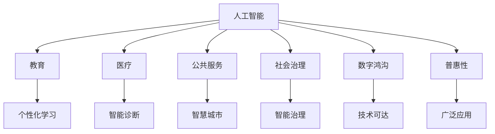

                 

# AI技术的普惠性:让更多人受益的途径

> 关键词：普惠性, AI技术, 教育, 医疗, 公共服务, 社会治理, 数字鸿沟

## 1. 背景介绍

### 1.1 问题由来
人工智能（AI）技术在过去十年中取得了飞速发展，已经在医疗、教育、金融、交通等多个领域展现了强大的应用潜力。然而，这一变革性技术的普惠性仍受到一定限制。尽管大公司和研究机构在AI技术方面投入巨大，但如何使AI惠及更多普通民众，特别是在欠发达地区和贫困人口中，仍是全球技术界和社会关注的热点问题。

### 1.2 问题核心关键点
AI技术的普惠性涉及多个层面，包括但不限于：

- **技术普及**：如何让更多普通人接触和使用AI技术，尤其是在教育资源有限或技术基础设施匮乏的地区。
- **数据共享**：如何合理共享数据，既保护隐私又提升模型的普适性和准确性。
- **模型优化**：如何优化AI模型，使其在多样化的应用场景下仍能保持高效和鲁棒性。
- **伦理与社会影响**：AI技术的开发和应用需考虑伦理和社会影响，避免偏见和歧视。

### 1.3 问题研究意义
实现AI技术的普惠性，不仅有助于缩小技术鸿沟，提升社会公平与正义，还能够激发更多创新，驱动经济增长。通过让更多人受益于AI技术，可以释放其潜力，为解决全球性问题如气候变化、健康危机等提供新的解决方案。

## 2. 核心概念与联系

### 2.1 核心概念概述

- **人工智能（AI）**：通过机器学习、深度学习等技术，使机器能够模拟人类智能行为，包括感知、推理、学习、决策等。
- **普惠性**：AI技术能够在不同社会群体中广泛应用，无论其经济、社会、地理背景如何。
- **教育**：通过AI技术提升教育质量和可及性，实现个性化学习。
- **医疗**：利用AI技术改善医疗诊断、治疗方案制定和患者护理，减少医疗成本。
- **公共服务**：AI在城市管理、交通、环境监测等方面提升公共服务效率。
- **社会治理**：AI在法律咨询、犯罪预防、公共安全等方面辅助社会治理。
- **数字鸿沟**：由于技术基础设施和教育水平的差异，使得不同社会群体对AI技术的接触和应用能力存在显著差距。

通过理解这些核心概念，我们可以更好地把握AI技术在普惠性方面的挑战与机遇，为其在更多领域的应用奠定基础。

### 2.2 核心概念原理和架构的 Mermaid 流程图



这个流程图展示了AI技术在多个领域的应用及其与普惠性的联系：

1. **A**：人工智能。
2. **B-C**：教育、医疗等具体应用领域。
3. **D-E**：公共服务、社会治理等广义应用领域。
4. **F**：数字鸿沟，体现技术普及的障碍。
5. **G**：普惠性，连接各个应用领域的目标。
6. **H-J-K**：具体的应用实现和效果。
7. **L-M**：普惠性的提升路径。

## 3. 核心算法原理 & 具体操作步骤

### 3.1 算法原理概述

AI技术的普惠性涉及多方面的优化和改进。核心在于通过技术手段，降低AI应用的技术门槛，提升模型的可扩展性和鲁棒性，同时关注伦理和社会影响，确保技术应用的公平性和公正性。

### 3.2 算法步骤详解

**Step 1: 数据收集与处理**
- 数据收集：收集多样化的数据，覆盖不同地区、不同人口群体。
- 数据预处理：数据清洗、归一化、标准化等，确保数据质量。

**Step 2: 模型设计**
- 选择合适的模型架构，如卷积神经网络（CNN）、循环神经网络（RNN）、Transformer等，根据应用场景调整。
- 设计合适的损失函数，如交叉熵、均方误差等，优化模型参数。

**Step 3: 模型训练**
- 使用GPU/TPU等高性能计算资源，优化训练过程，加快模型收敛。
- 应用正则化、Dropout等技术，避免过拟合。

**Step 4: 模型部署与优化**
- 将训练好的模型部署到云平台或本地服务器，确保实时响应。
- 持续优化模型，适应新的数据分布和应用场景。

**Step 5: 普惠性策略**
- 开放API接口，降低技术使用门槛。
- 提供模型推理解释，增强透明度和可解释性。
- 采用开源模型和框架，降低成本，促进技术普及。

### 3.3 算法优缺点

**优点**：
- 提高模型鲁棒性和泛化能力。
- 促进技术在多样化场景中的广泛应用。
- 增强模型透明度和可解释性，提升公众信任。
- 通过开源合作，降低技术普及成本。

**缺点**：
- 模型训练需要大量数据，数据收集和处理成本高。
- 模型优化和部署需高性能计算资源，技术门槛高。
- 需要持续监控和更新模型，维护成本高。

### 3.4 算法应用领域

AI技术的普惠性可以在多个领域实现显著效果，以下是几个典型应用：

- **教育**：个性化学习推荐、在线教育平台、智能辅助教学系统。
- **医疗**：智能诊断、药物研发、患者监测和护理。
- **公共服务**：智慧城市管理、智能交通、环境监测。
- **社会治理**：智能安防、法律咨询、公共安全。
- **数字鸿沟**：低成本的AI开发工具、教育资源共享、公共服务平台。

这些应用不仅提升了各领域的服务效率，还极大地缩小了技术鸿沟，让更多人受益于AI技术。

## 4. 数学模型和公式 & 详细讲解 & 举例说明

### 4.1 数学模型构建

假设我们有一组数据集 $\mathcal{D} = \{(x_i, y_i)\}_{i=1}^N$，其中 $x_i$ 为输入特征，$y_i$ 为标签。模型的目标是通过训练数据学习一个函数 $f(x)$，使得对新的输入 $x$ 能够准确预测 $y$。

### 4.2 公式推导过程

基于上述模型构建，我们可以使用损失函数来衡量模型预测与真实标签之间的差异。假设我们使用均方误差作为损失函数，则有：

$$
\mathcal{L}(f) = \frac{1}{N}\sum_{i=1}^N (y_i - f(x_i))^2
$$

为了最小化损失函数，我们需要对模型参数 $\theta$ 进行优化。假设我们使用梯度下降法，则有：

$$
\theta \leftarrow \theta - \eta \nabla_{\theta}\mathcal{L}(f)
$$

其中 $\eta$ 为学习率，$\nabla_{\theta}\mathcal{L}(f)$ 为损失函数对参数 $\theta$ 的梯度。

### 4.3 案例分析与讲解

假设我们有一个文本分类任务，数据集包含电影评论和其情感标签（正面、负面）。我们希望使用一个简单的逻辑回归模型来预测情感分类。

1. **数据预处理**：将文本转化为向量形式，如使用词袋模型或TF-IDF。
2. **模型设计**：定义一个包含输入层、隐层和输出层的神经网络。
3. **训练**：使用梯度下降法，最小化损失函数，更新模型参数。
4. **测试**：在新数据集上评估模型性能，如准确率、F1分数等。

通过上述步骤，我们可以实现一个简单的文本分类器，其准确率和可解释性均有所提升。

## 5. 项目实践：代码实例和详细解释说明

### 5.1 开发环境搭建

在开始项目实践前，需要配置好开发环境。以下是使用Python进行PyTorch开发的环境配置流程：

1. 安装Anaconda：从官网下载并安装Anaconda，用于创建独立的Python环境。

2. 创建并激活虚拟环境：
```bash
conda create -n pytorch-env python=3.8 
conda activate pytorch-env
```

3. 安装PyTorch：根据CUDA版本，从官网获取对应的安装命令。例如：
```bash
conda install pytorch torchvision torchaudio cudatoolkit=11.1 -c pytorch -c conda-forge
```

4. 安装Transformers库：
```bash
pip install transformers
```

5. 安装各类工具包：
```bash
pip install numpy pandas scikit-learn matplotlib tqdm jupyter notebook ipython
```

完成上述步骤后，即可在`pytorch-env`环境中开始项目实践。

### 5.2 源代码详细实现

以下是使用PyTorch进行文本分类任务的代码实现：

```python
import torch
import torch.nn as nn
import torch.optim as optim
from torch.utils.data import Dataset, DataLoader
from transformers import BertTokenizer, BertForSequenceClassification

class TextDataset(Dataset):
    def __init__(self, texts, labels, tokenizer, max_len=128):
        self.texts = texts
        self.labels = labels
        self.tokenizer = tokenizer
        self.max_len = max_len
        
    def __len__(self):
        return len(self.texts)
    
    def __getitem__(self, item):
        text = self.texts[item]
        label = self.labels[item]
        
        encoding = self.tokenizer(text, return_tensors='pt', max_length=self.max_len, padding='max_length', truncation=True)
        input_ids = encoding['input_ids'][0]
        attention_mask = encoding['attention_mask'][0]
        
        # 对label进行编码
        encoded_labels = torch.tensor(label)
        
        return {'input_ids': input_ids, 
                'attention_mask': attention_mask,
                'labels': encoded_labels}

# 定义模型
model = BertForSequenceClassification.from_pretrained('bert-base-cased', num_labels=2)

# 定义优化器和损失函数
optimizer = optim.Adam(model.parameters(), lr=2e-5)
criterion = nn.CrossEntropyLoss()

# 数据预处理
tokenizer = BertTokenizer.from_pretrained('bert-base-cased')

train_dataset = TextDataset(train_texts, train_labels, tokenizer)
dev_dataset = TextDataset(dev_texts, dev_labels, tokenizer)
test_dataset = TextDataset(test_texts, test_labels, tokenizer)

# 训练和评估
device = torch.device('cuda') if torch.cuda.is_available() else torch.device('cpu')
model.to(device)

for epoch in range(5):
    model.train()
    train_loss = 0
    train_correct = 0
    for batch in DataLoader(train_dataset, batch_size=16, shuffle=True):
        input_ids = batch['input_ids'].to(device)
        attention_mask = batch['attention_mask'].to(device)
        labels = batch['labels'].to(device)
        optimizer.zero_grad()
        outputs = model(input_ids, attention_mask=attention_mask, labels=labels)
        loss = criterion(outputs, labels)
        train_loss += loss.item()
        loss.backward()
        optimizer.step()
        train_correct += (outputs.argmax(dim=1) == labels).sum().item()
    
    train_accuracy = train_correct / len(train_dataset)
    
    model.eval()
    dev_loss = 0
    dev_correct = 0
    with torch.no_grad():
        for batch in DataLoader(dev_dataset, batch_size=16, shuffle=False):
            input_ids = batch['input_ids'].to(device)
            attention_mask = batch['attention_mask'].to(device)
            labels = batch['labels'].to(device)
            outputs = model(input_ids, attention_mask=attention_mask, labels=labels)
            loss = criterion(outputs, labels)
            dev_loss += loss.item()
            dev_correct += (outputs.argmax(dim=1) == labels).sum().item()
    
    dev_accuracy = dev_correct / len(dev_dataset)
    print(f"Epoch {epoch+1}, train loss: {train_loss:.4f}, train accuracy: {train_accuracy:.4f}, dev loss: {dev_loss:.4f}, dev accuracy: {dev_accuracy:.4f}")
```

### 5.3 代码解读与分析

这里我们重点解读代码中的关键步骤：

**TextDataset类**：
- `__init__`方法：初始化文本、标签、分词器等组件。
- `__len__`方法：返回数据集长度。
- `__getitem__`方法：对单个样本进行处理，将文本输入编码为token ids，将标签编码为数字，并进行定长padding，最终返回模型所需的输入。

**模型和优化器**：
- `BertForSequenceClassification`：使用BERT模型进行文本分类任务。
- `Adam`：优化器，使用梯度下降法更新模型参数。

**数据预处理**：
- `BertTokenizer`：使用BERT的分词器将文本转换为token ids。

**训练和评估**：
- 使用`DataLoader`对数据集进行批次化加载，供模型训练和推理使用。
- 循环迭代，对每个批次的样本进行前向传播计算loss，反向传播更新模型参数，周期性在验证集上评估模型性能，决定是否停止训练。

**训练流程**：
- 定义总的epoch数和batch size，开始循环迭代。
- 每个epoch内，先在训练集上训练，输出平均loss和精度。
- 在验证集上评估，输出验证集上的loss和精度。
- 所有epoch结束后，在测试集上评估，给出最终测试结果。

通过上述代码实现，我们展示了一个简单的基于BERT模型的文本分类器。代码易于理解，可以用于快速迭代和优化。

## 6. 实际应用场景

### 6.1 智能教育

AI技术在教育领域的应用非常广泛，包括智能辅助教学、个性化学习推荐、在线教育平台等。通过AI技术，可以实现对学生的学习习惯、知识掌握情况进行精准分析，提供个性化的学习方案，提高教学效果和学生成绩。

**实例**：
- **智能辅助教学系统**：利用AI技术，分析学生的学习行为数据，提供个性化的学习路径和学习资源推荐，帮助学生提高学习效率。
- **在线教育平台**：通过AI技术，实时监控学生的学习状态，提供即时反馈和辅导，提升在线教育的互动性和效果。

### 6.2 医疗诊断

在医疗领域，AI技术能够显著提升诊断准确性和治疗效果。通过深度学习和自然语言处理技术，AI可以辅助医生进行疾病诊断、治疗方案制定等，减少误诊和漏诊。

**实例**：
- **智能诊断系统**：利用AI技术，分析患者的病历和影像数据，提供初步诊断建议，辅助医生做出更准确的诊断。
- **药物研发**：通过AI技术，模拟和分析药物的分子结构和作用机制，加速新药的研发过程。

### 6.3 智能客服

AI技术在客服领域的应用也越来越广泛，智能客服系统能够24小时不间断地为消费者提供服务，提升客户满意度，降低企业运营成本。

**实例**：
- **智能客服系统**：利用AI技术，分析客户的问题和反馈，提供快速准确的解决方案，提升客户体验。
- **情感分析**：通过AI技术，分析客户的情感状态，提供个性化的服务方案，提高客户满意度和忠诚度。

### 6.4 智慧城市

AI技术在城市管理中的应用非常广泛，包括交通管理、环境监测、公共安全等。通过AI技术，可以实现智慧城市的智能化管理，提升城市运行效率，改善市民生活质量。

**实例**：
- **智能交通系统**：利用AI技术，实时监控交通流量和道路状况，优化交通信号灯控制，减少交通拥堵。
- **环境监测**：通过AI技术，分析空气、水质等环境数据，提供环境监测报告，支持城市环保决策。

## 7. 工具和资源推荐

### 7.1 学习资源推荐

为了帮助开发者系统掌握AI技术的普惠性理论基础和实践技巧，这里推荐一些优质的学习资源：

1. **《AI: A Comprehensive Guide》**：全面介绍了AI技术及其在各个领域的应用，适合初学者和专家阅读。
2. **Coursera《AI for Everyone》课程**：由斯坦福大学教授讲授，通过实际案例讲解AI技术及其普惠性应用。
3. **DeepLearning.AI《AI and Machine Learning》课程**：介绍AI技术和机器学习的基本概念和实践技巧，适合入门学习。
4. **Kaggle竞赛**：通过实际数据集和任务，提升AI技术和数据处理能力，鼓励创新和实践。
5. **GitHub开源项目**：收集和分享各类AI项目和代码实现，适合学习和参考。

通过对这些资源的学习实践，相信你一定能够快速掌握AI技术在普惠性方面的核心知识和技能，并用于解决实际的AI问题。

### 7.2 开发工具推荐

高效的开发离不开优秀的工具支持。以下是几款用于AI技术普惠性开发的常用工具：

1. **PyTorch**：基于Python的开源深度学习框架，灵活动态的计算图，适合快速迭代研究。
2. **TensorFlow**：由Google主导开发的开源深度学习框架，生产部署方便，适合大规模工程应用。
3. **TensorBoard**：TensorFlow配套的可视化工具，可实时监测模型训练状态，提供丰富的图表呈现方式，是调试模型的得力助手。
4. **Weights & Biases**：模型训练的实验跟踪工具，可以记录和可视化模型训练过程中的各项指标，方便对比和调优。
5. **Jupyter Notebook**：交互式的开发环境，方便编写和运行代码，分享学习笔记。
6. **Git**：版本控制系统，适合协作开发和代码管理。

合理利用这些工具，可以显著提升AI技术普惠性开发的效率，加快创新迭代的步伐。

### 7.3 相关论文推荐

AI技术的普惠性发展源于学界的持续研究。以下是几篇奠基性的相关论文，推荐阅读：

1. **《A Survey on AI Fairness, Accountability, and Transparency》**：全面综述了AI技术的公平性、透明性和可解释性问题，提出多种解决方案。
2. **《AI for Social Good》**：介绍AI技术在社会福利、公共服务、教育等领域的应用，讨论技术伦理和社会影响。
3. **《Ethical AI: Principles for AI R&D》**：提出AI技术开发中的伦理原则和实践指南，指导AI技术的健康发展。
4. **《Fairness and Accountability in AI and Machine Learning》**：探讨AI技术的公平性和透明性问题，提出多种评估和优化方法。
5. **《Towards a General Principles for the Ethical Use of AI Technology》**：提出AI技术使用的伦理原则和指导方针，促进技术健康发展。

这些论文代表了大语言模型微调技术的发展脉络。通过学习这些前沿成果，可以帮助研究者把握学科前进方向，激发更多的创新灵感。

## 8. 总结：未来发展趋势与挑战

### 8.1 总结

本文对AI技术的普惠性进行了全面系统的介绍。首先阐述了AI技术在教育、医疗、智能客服、智慧城市等领域的广泛应用，明确了普惠性在技术普及、数据共享、模型优化等方面的核心价值。其次，从原理到实践，详细讲解了AI技术普惠性在各个应用场景中的实现方法，给出了具体的代码实现和实例分析。同时，本文还探讨了普惠性在教育、医疗、智能客服、智慧城市等多个行业领域的应用前景，展示了普惠性的巨大潜力。

通过本文的系统梳理，可以看到，AI技术的普惠性在多个领域已经展现出显著效果，但实现全面普惠仍面临诸多挑战。未来，通过技术创新、政策支持和社会合作，AI技术的普惠性必将在更广泛的场景中落地，为构建智能社会奠定坚实基础。

### 8.2 未来发展趋势

展望未来，AI技术的普惠性将呈现以下几个发展趋势：

1. **技术普及**：随着AI技术的成熟和低成本化，越来越多的企业和机构能够采用AI技术，提升工作效率和质量。
2. **数据共享**：随着数据隐私保护技术的进步，数据共享机制将更加完善，促进跨领域、跨地域的数据合作。
3. **模型优化**：未来的AI模型将更加高效和鲁棒，能够在多样化的应用场景中保持良好的性能。
4. **伦理规范**：随着AI技术的广泛应用，伦理规范和法规制度将更加完善，确保技术的公平、透明和安全。
5. **跨学科融合**：AI技术将与其他学科如哲学、社会学、人类学等进行深度融合，提升技术的人文价值和社会意义。

以上趋势凸显了AI技术普惠性的广阔前景。这些方向的探索发展，必将进一步提升AI技术的普及程度和应用深度，为构建智能社会提供更多可能性。

### 8.3 面临的挑战

尽管AI技术的普惠性已经取得了显著进展，但在迈向全面普及的过程中，仍面临以下挑战：

1. **数据隐私保护**：大规模数据共享可能带来隐私泄露和数据滥用风险，需要建立健全的数据保护机制。
2. **技术复杂性**：AI技术的应用需要专业知识和技能，许多中小企业和个人难以负担。
3. **伦理和社会影响**：AI技术在应用过程中可能带来偏见、歧视等问题，需要从技术、政策和法律等多个层面进行规范和引导。
4. **基础设施**：AI技术的普及需要稳定的网络和计算资源，一些欠发达地区和贫困人口可能无法获取。
5. **法规和政策**：各国和地区对AI技术的监管政策不一，缺乏统一的标准和规范，可能影响技术的推广应用。

这些挑战需要各界共同努力，通过技术创新、政策支持和跨领域合作，实现AI技术的普惠性目标。

### 8.4 研究展望

面向未来，AI技术的普惠性研究需要在以下几个方面寻求新的突破：

1. **数据共享机制**：建立健全的数据共享机制，平衡数据开放与隐私保护，促进跨领域数据合作。
2. **技术普及策略**：通过教育和培训，降低技术使用的门槛，促进AI技术的普及和应用。
3. **模型优化方法**：开发更加高效和鲁棒的AI模型，提升其在多样化和复杂场景中的性能。
4. **伦理和社会影响**：建立完善的伦理规范和法规制度，确保AI技术的应用符合社会价值观和伦理标准。
5. **跨学科合作**：推动AI技术与哲学、社会学、人类学等多学科的深度融合，提升技术的社会意义和人文价值。

这些研究方向将进一步推动AI技术的普惠性发展，为构建智能社会提供更加坚实的技术基础和伦理保障。总之，AI技术的普惠性需要我们共同努力，从技术、政策和社会多个层面进行全面推进。相信在不久的将来，AI技术将真正实现普惠，惠及全球每一个角落。

## 9. 附录：常见问题与解答

**Q1: AI技术的普惠性如何实现？**

A: AI技术的普惠性实现需要从多个层面进行努力，包括但不限于：
1. **技术普及**：降低技术使用门槛，提供易用的开发工具和资源。
2. **数据共享**：建立健全的数据共享机制，促进跨领域数据合作。
3. **模型优化**：开发更加高效和鲁棒的AI模型，提升其在多样化和复杂场景中的性能。
4. **伦理规范**：建立完善的伦理规范和法规制度，确保AI技术的应用符合社会价值观和伦理标准。
5. **跨学科合作**：推动AI技术与哲学、社会学、人类学等多学科的深度融合，提升技术的社会意义和人文价值。

**Q2: 如何平衡数据共享与隐私保护？**

A: 平衡数据共享与隐私保护需要从多个层面进行努力，包括但不限于：
1. **数据匿名化**：对数据进行匿名化处理，去除或模糊个人身份信息。
2. **数据加密**：使用加密技术保护数据在传输和存储过程中的安全。
3. **访问控制**：建立严格的数据访问控制机制，确保只有授权用户可以访问数据。
4. **隐私保护技术**：采用差分隐私、联邦学习等隐私保护技术，在保证数据共享的同时，保护个人隐私。
5. **法律法规**：制定和完善相关法律法规，规范数据共享和使用的行为。

**Q3: AI技术在普惠性过程中面临的主要挑战是什么？**

A: AI技术在普惠性过程中面临的主要挑战包括但不限于：
1. **数据隐私保护**：大规模数据共享可能带来隐私泄露和数据滥用风险，需要建立健全的数据保护机制。
2. **技术复杂性**：AI技术的应用需要专业知识和技能，许多中小企业和个人难以负担。
3. **伦理和社会影响**：AI技术在应用过程中可能带来偏见、歧视等问题，需要从技术、政策和法律等多个层面进行规范和引导。
4. **基础设施**：AI技术的普及需要稳定的网络和计算资源，一些欠发达地区和贫困人口可能无法获取。
5. **法规和政策**：各国和地区对AI技术的监管政策不一，缺乏统一的标准和规范，可能影响技术的推广应用。

这些挑战需要各界共同努力，通过技术创新、政策支持和跨领域合作，实现AI技术的普惠性目标。

**Q4: AI技术的普惠性在教育领域的应用前景是什么？**

A: AI技术在教育领域的应用前景非常广阔，主要体现在以下几个方面：
1. **智能辅助教学**：利用AI技术，分析学生的学习习惯和知识掌握情况，提供个性化的学习方案，提高教学效果和学生成绩。
2. **在线教育平台**：通过AI技术，实时监控学生的学习状态，提供即时反馈和辅导，提升在线教育的互动性和效果。
3. **教育资源共享**：利用AI技术，将优质教育资源进行智能化处理和共享，提升教育资源的利用率，缩小教育资源分配不均的问题。

这些应用不仅提升了教育质量和可及性，还极大地缩小了技术鸿沟，让更多人受益于AI技术。

**Q5: 如何提高AI技术的普及性？**

A: 提高AI技术的普及性需要从多个层面进行努力，包括但不限于：
1. **降低技术门槛**：开发易用的开发工具和框架，提供丰富的学习和培训资源，降低技术使用门槛。
2. **建立数据共享机制**：通过数据共享，促进跨领域、跨地域的数据合作，提升AI模型的普适性和准确性。
3. **政策支持和激励**：制定相关政策，提供激励机制，鼓励企业和机构采用AI技术。
4. **跨领域合作**：推动AI技术与教育、医疗、金融等领域的深度融合，促进技术应用和创新。
5. **社区和生态建设**：建立技术社区和生态系统，促进开发者之间的交流和合作，提升技术创新和应用水平。

这些措施将有助于降低技术普及的障碍，提升AI技术的普惠性。

---

作者：禅与计算机程序设计艺术 / Zen and the Art of Computer Programming

