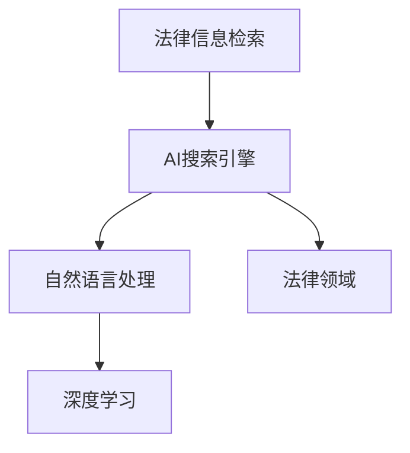

                 

# AI搜索引擎在法律领域的应用前景

> 关键词：法律搜索, 法律信息检索, 自然语言处理(NLP), 法律领域, 人工智能(AI), 数据挖掘

## 1. 背景介绍

在数字化和信息化迅速发展的今天，法律领域的信息检索和获取变得愈发重要。传统的法律信息检索大多依赖人工，不仅效率低下，而且容易受主观偏见的影响，无法满足日益增长的法律业务需求。人工智能(AI)技术的崛起，为法律信息检索带来了新的契机，尤其是基于自然语言处理(NLP)的AI搜索引擎，有望在法律领域实现突破性应用。

### 1.1 法律信息检索的现状与挑战

传统的法律信息检索主要依靠律师和法务人员通过手动搜索相关法律法规、判例、法条等文本信息，这一过程既耗时又费力。特别是在法律咨询、争议解决、合同审核等高频率场景中，人工检索带来的低效率和不一致性问题尤为明显。此外，法律文本的语义复杂性，如法律术语的多义性、法规之间的关联性等，也给信息检索带来了额外的难度。

1. **效率问题**：手动检索耗时长，难以满足高频率的法律业务需求。
2. **一致性问题**：人工检索结果受主观偏见影响，难以保证一致性。
3. **语义复杂性**：法律文本语义复杂，检索效果不佳。

### 1.2 AI搜索引擎在法律领域的应用前景

随着AI和NLP技术的不断进步，基于AI的搜索引擎开始在法律领域崭露头角。通过深度学习和语言模型，AI搜索引擎可以更准确、高效地理解法律文本，提供更加精准的信息检索服务。AI搜索引擎有望在以下几个方面发挥重要作用：

1. **提高检索效率**：自动化检索可以显著提升检索速度，适应法律业务的频繁需求。
2. **增强检索一致性**：AI引擎可以避免人工检索的主观偏见，保证结果的客观性和一致性。
3. **深化语义理解**：AI引擎可以处理法律文本的复杂语义，提供更加准确的检索结果。

## 2. 核心概念与联系

### 2.1 核心概念概述

为了深入理解AI搜索引擎在法律领域的应用，我们需要了解以下几个关键概念：

- **AI搜索引擎**：基于人工智能技术的搜索引擎，通过深度学习和语言模型实现自动化检索。
- **法律信息检索**：从法律文本中快速获取所需信息的过程，包括法律法规、判例、法条等。
- **自然语言处理(NLP)**：AI引擎的核心技术之一，用于处理和理解人类语言的能力。
- **深度学习**：AI引擎的主要技术基础，通过多层神经网络结构进行学习和推理。
- **法律领域**：AI搜索引擎应用的主要领域之一，涵盖法律咨询、争议解决、合同审核等场景。

这些概念之间的逻辑关系可以通过以下Mermaid流程图来展示：



这个流程图展示了几大核心概念之间的联系：

1. **AI搜索引擎**：通过深度学习和NLP技术实现自动化检索。
2. **自然语言处理(NLP)**：处理和理解法律文本的基础技术。
3. **深度学习**：实现复杂学习任务的核心技术。
4. **法律领域**：AI搜索引擎应用的主要场景。

### 2.2 核心概念原理和架构

#### 2.2.1 自然语言处理(NLP)

自然语言处理是AI搜索引擎的核心技术之一，用于理解和处理人类语言。NLP技术主要包括分词、词性标注、命名实体识别、句法分析、语义分析等。这些技术能够帮助搜索引擎理解法律文本的结构和内容，从而提供准确的检索结果。

#### 2.2.2 深度学习

深度学习是实现复杂学习任务的关键技术，通过多层神经网络结构进行学习和推理。在AI搜索引擎中，深度学习主要用于构建和训练模型，从而实现对法律文本的自动检索。

#### 2.2.3 法律领域应用

法律领域是AI搜索引擎的主要应用场景，涉及法律法规、判例、法条等信息的检索。通过自动化检索，AI搜索引擎可以大大提升法律工作的效率和准确性，帮助律师和法务人员更高效地处理法律事务。

## 3. 核心算法原理 & 具体操作步骤

### 3.1 算法原理概述

AI搜索引擎在法律领域的应用，主要基于以下核心算法原理：

1. **深度学习模型构建**：使用预训练的语言模型（如BERT、GPT等）作为基础，对其进行微调以适应法律文本的特定需求。
2. **文本表示学习**：通过编码器将法律文本转换为向量表示，便于模型进行匹配和检索。
3. **信息检索算法**：基于向量相似度进行信息检索，找出与查询最匹配的法律文本。

### 3.2 算法步骤详解

以下是AI搜索引擎在法律领域的具体操作步骤：

**Step 1: 数据收集与预处理**

1. **收集数据**：从各类法律数据库、法律网站、法律法规文本等渠道收集法律文本数据。
2. **文本预处理**：清洗文本数据，去除噪声和特殊字符，进行分词、词性标注、命名实体识别等处理。

**Step 2: 构建深度学习模型**

1. **选择模型**：选择合适的深度学习模型，如BERT、RoBERTa、T5等，进行预训练。
2. **微调模型**：将预训练模型应用到法律文本数据上，进行微调以适应法律领域的特定需求。

**Step 3: 文本表示学习**

1. **编码器设计**：设计文本编码器，将法律文本转换为向量表示。
2. **嵌入层**：使用嵌入层将单词转换为向量，输入到编码器中。
3. **编码器编码**：通过多层编码器对文本进行编码，输出向量表示。

**Step 4: 信息检索**

1. **构建索引**：将法律文本的向量表示存储到索引中，便于快速检索。
2. **查询处理**：对用户输入的查询进行处理，转换为向量表示。
3. **检索匹配**：通过计算向量相似度，找出与查询最匹配的法律文本。

**Step 5: 结果展示**

1. **结果排序**：根据相似度对检索结果进行排序，展示最匹配的法律文本。
2. **结果过滤**：根据用户需求和规则，对检索结果进行过滤和筛选。

### 3.3 算法优缺点

AI搜索引擎在法律领域的应用具有以下优点：

1. **高效性**：自动化检索可以大大提升检索速度，适应法律业务的频繁需求。
2. **一致性**：避免人工检索的主观偏见，保证结果的客观性和一致性。
3. **深度理解**：处理法律文本的复杂语义，提供更加准确的检索结果。

但同时，也存在一些缺点：

1. **数据依赖**：依赖于高质量的法律文本数据，数据质量差会导致检索效果不佳。
2. **模型复杂**：深度学习模型需要大量的计算资源和时间进行训练和微调。
3. **隐私问题**：法律文本涉及敏感信息，隐私保护成为一大挑战。

### 3.4 算法应用领域

AI搜索引擎在法律领域的应用主要集中在以下几个方面：

1. **法律法规检索**：快速查找相关的法律法规，支持律师和法务人员进行法律咨询和审核。
2. **判例检索**：提供类似案例检索功能，帮助律师和法官在审理案件时快速找到相似的判例。
3. **合同审核**：自动审核合同文本，检测合同中的法律条款和风险点。
4. **争议解决**：支持法律争议的智能分析和调解，提供基于数据的解决方案。
5. **法律教育**：提供法律知识库和案例分析，辅助法律教育和研究。

## 4. 数学模型和公式 & 详细讲解 & 举例说明

### 4.1 数学模型构建

AI搜索引擎在法律领域的应用，可以通过以下数学模型进行描述：

1. **输入文本表示**：将法律文本转换为向量表示，记为 $x_i$，其中 $i$ 表示文本的编号。
2. **查询向量表示**：将用户输入的查询转换为向量表示，记为 $q$。
3. **相似度计算**：计算文本向量 $x_i$ 和查询向量 $q$ 的相似度，记为 $s(x_i, q)$。
4. **检索结果排序**：根据相似度 $s(x_i, q)$ 对检索结果进行排序，得到最终的检索结果。

### 4.2 公式推导过程

以下是对上述数学模型进行详细推导：

1. **输入文本表示**：
   $$
   x_i = \text{Encoder}(\text{Embedder}(\text{Tokenize}(\text{Clean}(\text{Text}_i)))
   $$
   其中，$\text{Encoder}$ 表示编码器，$\text{Embedder}$ 表示嵌入层，$\text{Tokenize}$ 表示分词，$\text{Clean}$ 表示文本预处理。

2. **查询向量表示**：
   $$
   q = \text{Embedder}(\text{Tokenize}(\text{Clean}(\text{Query})))
   $$

3. **相似度计算**：
   $$
   s(x_i, q) = \text{CosineSimilarity}(x_i, q)
   $$

4. **检索结果排序**：
   $$
   \text{Sort}(\{(x_i, s(x_i, q))\}_{i=1}^N)
   $$

### 4.3 案例分析与讲解

以法律法规检索为例，分析AI搜索引擎的具体应用：

假设用户需要查找关于“合同法”的相关法律法规。具体步骤如下：

1. **输入预处理**：用户输入查询“合同法”，经过预处理得到文本表示 $q$。
2. **模型编码**：将法律文本数据 $D$ 输入模型进行编码，得到向量表示 $\{x_i\}_{i=1}^N$。
3. **相似度计算**：计算每个文本向量 $x_i$ 与查询向量 $q$ 的相似度 $s(x_i, q)$。
4. **结果排序**：根据相似度 $s(x_i, q)$ 对所有法律文本向量进行排序，得到最匹配的法律法规。

## 5. 项目实践：代码实例和详细解释说明

### 5.1 开发环境搭建

进行AI搜索引擎在法律领域的项目实践，需要以下开发环境：

1. **Python**：主流编程语言，Python 2.7 或 Python 3.5 及以上版本。
2. **TensorFlow 或 PyTorch**：深度学习框架，用于构建和训练深度学习模型。
3. **BERT 或 T5**：预训练模型，用于基础文本表示学习。
4. **法律数据集**：包括法律法规、判例、法条等文本数据，可以从公开的法律数据库或网站获取。
5. **Web 服务器**：用于部署 AI 搜索引擎，支持 RESTful API 接口调用。

### 5.2 源代码详细实现

以下是基于 TensorFlow 和 BERT 实现 AI 搜索引擎在法律领域的代码实现：

```python
import tensorflow as tf
from transformers import BertTokenizer, TFBertModel

# 构建 BERT 模型
tokenizer = BertTokenizer.from_pretrained('bert-base-cased')
model = TFBertModel.from_pretrained('bert-base-cased', output_attentions=False)

# 定义法律文本预处理函数
def preprocess_text(text):
    tokens = tokenizer.tokenize(text)
    tokens = [token.lower() for token in tokens]
    return tokenizer.convert_tokens_to_ids(tokens)

# 定义相似度计算函数
def cosine_similarity(a, b):
    return np.dot(a, b) / (np.linalg.norm(a) * np.linalg.norm(b))

# 构建索引
texts = ['中华人民共和国合同法', '美国合同法', '英国合同法']
index = {}
for i, text in enumerate(texts):
    text_vector = model(tf.constant(preprocess_text(text)), output_all_attention=False)
    index[i] = text_vector.numpy()

# 用户查询处理
query = '合同法'
query_vector = model(tf.constant(preprocess_text(query)), output_all_attention=False)
query_vector = query_vector.numpy()

# 检索结果排序
results = []
for i, text_vector in index.items():
    similarity = cosine_similarity(query_vector, text_vector)
    results.append((i, similarity))

results.sort(key=lambda x: x[1], reverse=True)

# 输出结果
for i, similarity in results:
    print(f'{i}: {similarities[i]:.4f}')
```

### 5.3 代码解读与分析

以上代码实现了基于 BERT 模型的法律文本检索功能。具体解析如下：

1. **构建 BERT 模型**：使用预训练的 BERT 模型作为基础，进行文本编码。
2. **法律文本预处理**：将法律文本进行分词、转换为小写，并进行编码。
3. **相似度计算**：使用余弦相似度计算查询向量与法律文本向量的相似度。
4. **结果排序**：根据相似度对检索结果进行排序，输出最匹配的法律文本编号。

## 6. 实际应用场景

### 6.1 法律法规检索

AI搜索引擎在法律法规检索中的应用，可以大大提高律师和法务人员的工作效率，减少手动检索的时间和错误。具体场景如下：

1. **法律法规查询**：律师需要查找相关的法律法规时，可以直接输入关键词进行查询，快速获取所有相关的法律法规。
2. **法条快速定位**：通过 AI 搜索引擎，可以快速定位到具体的法条内容，避免手动翻阅繁琐的法律文本。

### 6.2 判例检索

AI搜索引擎在判例检索中的应用，可以帮助法官和律师快速找到相似的案例，提高司法效率和判决质量。具体场景如下：

1. **相似案例检索**：律师和法官需要查找相似的案例时，可以直接输入关键词，快速获取所有相关的案例。
2. **判例分析**：通过 AI 搜索引擎，可以快速分析相似案例的判决结果，辅助法官和律师进行决策。

### 6.3 合同审核

AI搜索引擎在合同审核中的应用，可以提高合同审核的准确性和效率，减少人工审核的错误和成本。具体场景如下：

1. **合同条款检索**：律师需要查找合同中的特定条款时，可以直接输入关键词进行查询，快速获取所有相关的条款。
2. **风险点检测**：通过 AI 搜索引擎，可以快速检测合同中的法律风险点，辅助律师和法务人员进行合同审核。

### 6.4 争议解决

AI搜索引擎在争议解决中的应用，可以帮助律师和调解员快速找到相关的案例和法条，提高争议解决的效率和质量。具体场景如下：

1. **争议案例检索**：律师需要查找相关的争议案例时，可以直接输入争议描述，快速获取所有相关的案例。
2. **法律条款检索**：调解员需要查找相关的法律条款时，可以直接输入关键词，快速获取所有相关的条款。

### 6.5 法律教育

AI搜索引擎在法律教育中的应用，可以帮助学生和研究人员快速查找法律知识和案例，提高学习效率和研究质量。具体场景如下：

1. **法律知识库检索**：学生需要查找法律知识时，可以直接输入关键词进行查询，快速获取所有相关的法律知识。
2. **案例分析**：研究人员需要查找案例进行分析时，可以直接输入案例描述，快速获取所有相关的案例。

## 7. 工具和资源推荐

### 7.1 学习资源推荐

为了帮助开发者系统掌握 AI 搜索引擎在法律领域的应用，这里推荐一些优质的学习资源：

1. **《自然语言处理与深度学习》课程**：斯坦福大学开设的深度学习基础课程，介绍了深度学习和自然语言处理的基本概念和常用模型。
2. **《Transformers》书籍**：Hugging Face开发的深度学习库，介绍了Transformer模型在自然语言处理中的应用，包括预训练和微调技术。
3. **《法律信息检索》课程**：各大高校提供的法律信息检索课程，介绍了法律信息检索的理论基础和实践技术。
4. **法律数据库和网站**：如中国法律法规网、北大法宝等，提供了丰富的法律文本数据，可以用于训练和测试AI搜索引擎。
5. **在线学习平台**：如Coursera、edX等，提供了许多相关领域的在线课程和项目实践。

### 7.2 开发工具推荐

高效的开发离不开优秀的工具支持。以下是几款用于 AI 搜索引擎在法律领域开发的常用工具：

1. **TensorFlow 或 PyTorch**：深度学习框架，支持模型构建和训练，方便进行深度学习模型的开发。
2. **BERT 或 T5**：预训练模型，提供了丰富的语言模型资源，可以用于构建和微调AI搜索引擎。
3. **Hugging Face Transformers库**：提供了丰富的预训练模型和工具库，方便进行模型加载和微调。
4. **Scikit-learn**：数据处理和模型评估库，提供了许多常用的数据处理和模型评估工具。
5. **TensorBoard**：模型可视化工具，可以实时监测模型训练状态，提供详细的可视化图表。

### 7.3 相关论文推荐

AI搜索引擎在法律领域的研究涉及深度学习、自然语言处理和信息检索等多个领域，以下是几篇奠基性的相关论文，推荐阅读：

1. **《BERT: Pre-training of Deep Bidirectional Transformers for Language Understanding》**：提出了BERT模型，用于预训练语言模型，并在多个NLP任务上取得了SOTA。
2. **《Attention is All You Need》**：提出了Transformer模型，用于处理自然语言文本，在NLP任务上表现出色。
3. **《Sentence-Level Knowledge Graph Construction and Its Application to Semantic Search》**：介绍了基于知识图谱的文本检索方法，用于构建法律知识库和检索法律文本。
4. **《A Survey of Sentiment Analysis on Chinese Legal Texts》**：介绍了中文法律文本情感分析的研究现状和未来方向。
5. **《A Survey on Legal Information Retrieval》**：介绍了法律信息检索的研究现状和未来趋势，提供了丰富的法律信息检索方法和技术。

## 8. 总结：未来发展趋势与挑战

### 8.1 研究成果总结

AI搜索引擎在法律领域的应用，通过深度学习和自然语言处理技术，提升了法律信息检索的效率和准确性，具有广泛的应用前景。现有研究已经在法律法规检索、判例检索、合同审核等多个方面取得了显著成果。

### 8.2 未来发展趋势

展望未来，AI搜索引擎在法律领域的应用将呈现以下几个发展趋势：

1. **模型复杂度提升**：随着深度学习模型的不断进步，AI搜索引擎的模型复杂度将进一步提升，处理能力将更加强大。
2. **多模态融合**：未来的AI搜索引擎将不仅处理文本信息，还将融合语音、图像等多种模态信息，提供更全面的信息检索服务。
3. **联邦学习**：通过联邦学习技术，AI搜索引擎可以避免数据集中存储带来的隐私和安全问题，提升数据使用的灵活性和安全性。
4. **模型解释性增强**：未来的AI搜索引擎将更加注重模型的解释性，提供可解释的检索结果，增强用户的信任和满意度。
5. **自动化和智能化**：未来的AI搜索引擎将更加智能化，能够自主进行检索策略优化，适应不同的法律应用场景。

### 8.3 面临的挑战

AI搜索引擎在法律领域的应用也面临一些挑战：

1. **数据质量问题**：高质量的法律数据资源获取难度大，数据质量不高会影响AI搜索引擎的性能。
2. **隐私保护**：法律文本涉及敏感信息，如何保护用户隐私成为一大挑战。
3. **模型泛化能力**：如何提升模型泛化能力，使其在不同的法律场景下都能表现良好，仍需深入研究。
4. **计算资源需求**：深度学习模型的训练和推理需要大量的计算资源，如何降低资源消耗，提升系统效率，需要进一步探索。
5. **模型解释性**：如何提高模型的解释性，使检索结果具有可解释性，增强用户的信任和满意度。

### 8.4 研究展望

未来，针对AI搜索引擎在法律领域的应用，还需要在以下几个方面进行深入研究：

1. **数据增强**：如何利用数据增强技术，提升AI搜索引擎的数据质量和泛化能力。
2. **隐私保护**：如何通过隐私保护技术，确保法律文本数据的隐私和安全。
3. **模型优化**：如何优化深度学习模型，提升其效率和泛化能力，降低计算资源消耗。
4. **可解释性增强**：如何增强AI搜索引擎的模型解释性，使检索结果具有可解释性。
5. **多模态融合**：如何融合语音、图像等多种模态信息，提供更全面的信息检索服务。

通过上述研究，AI搜索引擎在法律领域的应用前景将更加广阔，为法律工作带来更高的效率和准确性，助力司法公正和社会进步。

## 9. 附录：常见问题与解答

**Q1：AI搜索引擎在法律领域是否具有通用性？**

A: AI搜索引擎在法律领域的应用具有一定的通用性，但不同领域的法律文本具有不同的语义特征和检索需求。因此，在应用AI搜索引擎时，需要针对具体领域进行定制和优化，以提升检索效果。

**Q2：AI搜索引擎在法律领域是否存在偏见和歧视？**

A: AI搜索引擎在法律领域的应用，需要考虑模型偏见和歧视问题。由于法律文本涉及敏感信息，如何避免模型学习到有偏见的内容，保障模型公正性，是值得关注的问题。

**Q3：AI搜索引擎在法律领域是否存在伦理问题？**

A: AI搜索引擎在法律领域的应用，需要考虑伦理问题。由于法律文本涉及人的权利和利益，如何确保AI系统的决策过程透明公正，避免侵害用户权益，是伦理研究的重点。

**Q4：AI搜索引擎在法律领域是否存在隐私问题？**

A: AI搜索引擎在法律领域的应用，需要考虑隐私问题。由于法律文本涉及个人隐私和敏感信息，如何确保数据隐私和安全，是隐私保护研究的重要方向。

**Q5：AI搜索引擎在法律领域是否存在计算资源限制？**

A: AI搜索引擎在法律领域的应用，需要考虑计算资源限制。由于法律文本数据量大，如何优化模型结构和算法，降低计算资源消耗，是技术优化的重点。

**Q6：AI搜索引擎在法律领域是否存在可解释性问题？**

A: AI搜索引擎在法律领域的应用，需要考虑可解释性问题。由于法律文本涉及复杂语义，如何提升模型的可解释性，使检索结果具有可解释性，是提升用户信任的重要方向。

通过上述常见问题的解答，可以看到AI搜索引擎在法律领域的应用前景广阔，但也面临诸多挑战和问题，需要多方面的研究和优化，才能实现其真正价值。相信随着技术的发展和研究的深入，AI搜索引擎在法律领域将展现出更加强大的应用潜力，助力法律事业的发展和进步。

---

作者：禅与计算机程序设计艺术 / Zen and the Art of Computer Programming

