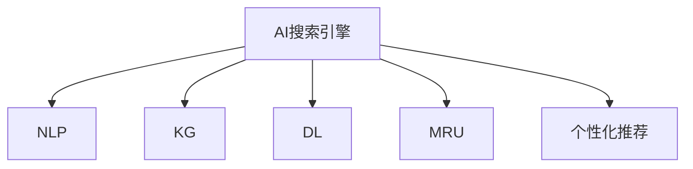

                 

## 1. 背景介绍

在数字化时代，图书馆和档案管理面临着信息量爆炸和用户需求多样化的挑战。传统的手工检索方法已经无法满足现代信息社会的需要，如何高效、便捷地检索和利用海量文献资源，成为了图书馆和档案管理领域的一个重要研究方向。

随着人工智能（AI）技术的快速发展，基于AI的搜索引擎技术逐渐进入了图书馆和档案管理的视野。AI搜索引擎通过自然语言处理、知识图谱、深度学习等技术，能够对文本进行精确理解、快速索引和推荐，大幅提升了检索效率和准确度。

## 2. 核心概念与联系

### 2.1 核心概念概述

为了更好地理解AI搜索引擎在图书馆和档案管理中的应用，本节将介绍几个核心概念及其之间的联系：

- **AI搜索引擎**：利用人工智能技术，通过自然语言处理、知识图谱等方法，实现对文本数据的精确理解和高效检索的搜索引擎。

- **自然语言处理（NLP）**：涉及文本分析、情感分析、语言生成等技术，旨在使计算机能够理解和生成自然语言。

- **知识图谱（KG）**：构建实体、关系和属性的三元组结构，表示知识之间的语义关系，用于支持复杂的查询和推理。

- **深度学习（DL）**：一类基于神经网络的机器学习技术，通过多层非线性变换，能够学习到数据的复杂特征表示，适用于各种自然语言处理任务。

- **机器阅读理解（MRU）**：使计算机能够理解文本内容的上下文信息，并从中提取结构化信息，广泛应用于问答系统和文献检索。

- **个性化推荐系统**：根据用户的历史行为和兴趣偏好，推荐相关文献和档案，提高用户体验和检索效率。

这些核心概念之间的联系可以通过以下Mermaid流程图来展示：



这个流程图展示了AI搜索引擎与NLP、KG、DL、MRU、个性化推荐系统等关键技术的联系，它们共同构成了AI搜索引擎的核心技术框架。

## 3. 核心算法原理 & 具体操作步骤

### 3.1 算法原理概述

AI搜索引擎的核心算法原理主要基于自然语言处理和深度学习技术。其基本流程可以概括为以下几个步骤：

1. **文本预处理**：将原始文本转换为计算机能够处理的形式，包括分词、词性标注、实体识别等。

2. **特征提取**：通过TF-IDF、Word2Vec、BERT等方法，将文本转换为高维向量，提取文本的语义信息。

3. **索引构建**：根据特征向量建立索引结构，支持高效的查询和检索。

4. **推理和排序**：通过逻辑推理和排序算法，对搜索结果进行排序和筛选，提高检索准确度和效率。

5. **个性化推荐**：根据用户的历史行为和兴趣，推荐最相关的文献和档案，提升用户体验。

### 3.2 算法步骤详解

以基于深度学习的检索算法为例，其主要步骤包括：

1. **模型训练**：使用大规模文本数据对深度学习模型进行训练，学习文本特征表示。

2. **特征提取**：将待检索文本转换为模型可以处理的特征向量，通常使用BERT等预训练模型。

3. **查询嵌入**：将用户输入的查询文本转换为与文本特征向量相同的向量，便于模型处理。

4. **相似度计算**：计算查询向量与文本特征向量之间的相似度，选择最相关的文本。

5. **排序和返回**：根据相似度排序，返回最相关的文本，满足用户的检索需求。

### 3.3 算法优缺点

基于深度学习的AI搜索引擎具有以下优点：

- **精度高**：通过多层非线性变换，能够学习到文本的复杂特征表示，提高检索准确度。
- **适应性强**：能够处理不同领域和语言的文本数据，适用于各种应用场景。
- **可扩展性**：模型可以通过迁移学习和微调技术进行适应性调整，灵活应对新任务。

但同时也存在一些缺点：

- **计算资源需求大**：深度学习模型需要大量的训练数据和计算资源，可能面临资源瓶颈。
- **过拟合风险高**：模型容易过拟合训练数据，泛化性能不足。
- **解释性不足**：深度学习模型通常被视为"黑盒"，难以解释其内部工作机制。

### 3.4 算法应用领域

AI搜索引擎技术已经广泛应用于图书馆和档案管理、电子商务、搜索引擎等多个领域。例如：

- **图书馆和档案管理**：构建索引数据库，支持全文检索、实体识别、知识图谱构建等功能。
- **电子商务**：推荐商品和搜索产品，提升用户购物体验。
- **搜索引擎**：提供文本搜索、语音搜索、图像搜索等多种搜索方式。

## 4. 数学模型和公式 & 详细讲解 & 举例说明

### 4.1 数学模型构建

AI搜索引擎的数学模型通常由两部分组成：查询模型和文本模型。查询模型用于将用户输入的查询转换为向量表示，文本模型用于表示文本的特征向量。

设查询向量为 $q$，文本向量为 $d$，相似度为 $s$，则数学模型可以表示为：

$$
s = \text{similarity}(q, d)
$$

其中 $\text{similarity}$ 表示相似度计算方法，常用的有余弦相似度、欧氏距离等。

### 4.2 公式推导过程

以余弦相似度为例，假设 $q$ 和 $d$ 均为 $n$ 维向量，余弦相似度的计算公式为：

$$
s = \cos(\theta) = \frac{q \cdot d}{\|q\| \cdot \|d\|}
$$

其中 $\theta$ 为 $q$ 和 $d$ 之间的夹角，$\cdot$ 表示向量点积，$\|q\|$ 和 $\|d\|$ 分别表示向量的模长。

通过余弦相似度计算，可以衡量查询向量与文本向量之间的相似度，进而选择最相关的文本。

### 4.3 案例分析与讲解

假设有一个图书馆的搜索引擎，用于检索包含特定关键词的文献。用户输入查询 "机器学习"，系统通过预训练的BERT模型将其转换为向量表示。同时，系统对馆藏的每一篇文献也进行BERT特征提取，得到相应的向量表示。然后，系统计算查询向量与每篇文献向量之间的余弦相似度，选择最相关的文献返回给用户。

## 5. 项目实践：代码实例和详细解释说明

### 5.1 开发环境搭建

在进行AI搜索引擎的开发前，我们需要准备好开发环境。以下是使用Python进行TensorFlow开发的环境配置流程：

1. 安装Anaconda：从官网下载并安装Anaconda，用于创建独立的Python环境。

2. 创建并激活虚拟环境：
```bash
conda create -n tf-env python=3.8 
conda activate tf-env
```

3. 安装TensorFlow：根据CUDA版本，从官网获取对应的安装命令。例如：
```bash
pip install tensorflow
```

4. 安装相关库：
```bash
pip install pandas numpy scikit-learn torch
```

完成上述步骤后，即可在`tf-env`环境中开始搜索引擎的开发。

### 5.2 源代码详细实现

下面以一个简单的文本检索系统为例，给出使用TensorFlow进行AI搜索引擎开发的PyTorch代码实现。

首先，定义数据预处理函数：

```python
import tensorflow as tf
from tensorflow.keras.preprocessing.text import Tokenizer
from tensorflow.keras.preprocessing.sequence import pad_sequences

def preprocess_text(texts):
    tokenizer = Tokenizer()
    tokenizer.fit_on_texts(texts)
    sequences = tokenizer.texts_to_sequences(texts)
    padded_sequences = pad_sequences(sequences, maxlen=max_len, padding='post', truncating='post')
    return padded_sequences
```

然后，定义模型：

```python
from tensorflow.keras.models import Sequential
from tensorflow.keras.layers import Embedding, LSTM, Dense

def build_model(vocab_size, embedding_dim, lstm_units):
    model = Sequential()
    model.add(Embedding(vocab_size, embedding_dim, input_length=max_len))
    model.add(LSTM(lstm_units))
    model.add(Dense(1, activation='sigmoid'))
    return model
```

接着，定义训练和评估函数：

```python
from tensorflow.keras.optimizers import Adam
from tensorflow.keras.losses import BinaryCrossentropy

def train_model(model, train_data, epochs, batch_size):
    optimizer = Adam(learning_rate=learning_rate)
    loss_fn = BinaryCrossentropy()
    model.compile(optimizer=optimizer, loss=loss_fn, metrics=['accuracy'])
    model.fit(train_data, epochs=epochs, batch_size=batch_size, validation_split=0.2)
    
def evaluate_model(model, test_data, batch_size):
    test_loss, test_acc = model.evaluate(test_data, batch_size=batch_size)
    print(f'Test Loss: {test_loss}, Test Accuracy: {test_acc}')
```

最后，启动训练流程并在测试集上评估：

```python
max_len = 100
learning_rate = 0.001
epochs = 10
batch_size = 32

vocab_size = len(tokenizer.word_index) + 1
embedding_dim = 100
lstm_units = 128

train_data = preprocess_text(train_texts)
test_data = preprocess_text(test_texts)

model = build_model(vocab_size, embedding_dim, lstm_units)
train_model(model, train_data, epochs, batch_size)
evaluate_model(model, test_data, batch_size)
```

以上就是使用TensorFlow进行文本检索系统的完整代码实现。可以看到，TensorFlow配合Keras框架使得模型训练的代码实现变得简洁高效。

### 5.3 代码解读与分析

让我们再详细解读一下关键代码的实现细节：

**preprocess_text函数**：
- 定义了文本预处理函数，将文本转换为序列数据并进行填充和截断处理。

**build_model函数**：
- 定义了LSTM神经网络模型，包括Embedding、LSTM、Dense等层。

**train_model函数**：
- 定义了模型训练函数，使用Adam优化器和二元交叉熵损失函数进行模型训练。

**evaluate_model函数**：
- 定义了模型评估函数，计算模型在测试集上的损失和准确度。

**训练流程**：
- 定义总的epoch数和batch size，开始循环迭代
- 每个epoch内，先在训练集上训练，输出平均损失和准确度
- 在验证集上评估，输出模型性能指标
- 重复上述步骤直至满足预设的迭代轮数或Early Stopping条件

可以看到，TensorFlow配合Keras框架使得模型训练的代码实现变得简洁高效。开发者可以将更多精力放在数据处理、模型改进等高层逻辑上，而不必过多关注底层的实现细节。

当然，工业级的系统实现还需考虑更多因素，如模型的保存和部署、超参数的自动搜索、更灵活的任务适配层等。但核心的搜索引擎范式基本与此类似。

## 6. 实际应用场景

### 6.1 智慧图书馆

智慧图书馆是AI搜索引擎的重要应用场景之一。通过构建图书检索系统，智慧图书馆能够实现自动化、智能化管理，大幅提升用户检索体验和图书馆运营效率。

例如，智慧图书馆可以通过AI搜索引擎快速检索用户感兴趣的图书，推荐热门书籍，实现图书借阅管理。同时，系统还可以根据用户的历史检索记录，学习其兴趣偏好，进一步个性化推荐相关图书。

### 6.2 档案管理

档案管理涉及到海量的文档和资料，传统的档案检索方法效率低下，容易出错。AI搜索引擎通过自然语言处理和知识图谱技术，能够对文档内容进行高效索引和检索，极大地提高了档案管理的效率和准确度。

例如，政府部门可以构建智能档案管理系统，快速检索历史档案和资料，辅助决策支持。同时，系统还可以对档案进行分类和标注，构建知识图谱，支持更复杂的查询和推理。

### 6.3 文献资料检索

在科研领域，研究人员需要检索大量的文献资料，获取最新的研究成果和数据。AI搜索引擎能够对海量文献进行高效检索，支持精确查询和排序，帮助研究人员快速找到所需资料。

例如，学术期刊可以构建智能文献检索系统，支持自然语言查询和结果排序，提升文献检索的效率和准确度。同时，系统还可以对文献进行分类和推荐，帮助研究人员发现相关研究。

### 6.4 未来应用展望

随着AI技术的进一步发展，AI搜索引擎将会在更多领域得到应用，为图书馆和档案管理带来新的变革。

在智慧城市建设中，AI搜索引擎将发挥重要作用，帮助城市管理者实时获取和管理各类公共数据，支持智能决策。

在企业信息化管理中，AI搜索引擎将支持知识管理、文档检索、员工搜索等功能，提升企业的运营效率和智能化水平。

在医疗领域，AI搜索引擎将帮助医疗机构快速检索医学文献和患者病历，辅助临床诊断和治疗决策。

总之，随着AI技术的不断进步，AI搜索引擎必将在图书馆和档案管理、科研文献、企业信息化、智慧城市等多个领域大放异彩，为信息社会的智能化发展注入新的动力。

## 7. 工具和资源推荐

### 7.1 学习资源推荐

为了帮助开发者系统掌握AI搜索引擎的理论基础和实践技巧，这里推荐一些优质的学习资源：

1. TensorFlow官方文档：TensorFlow的官方文档，提供了丰富的API文档、教程和案例，是学习TensorFlow的必备资料。

2. Keras官方文档：Keras的官方文档，提供了简单易用的API和示例代码，适合初学者快速上手。

3. Natural Language Processing with TensorFlow：《使用TensorFlow进行自然语言处理》一书，全面介绍了TensorFlow在自然语言处理中的应用，包括文本检索、情感分析、语言生成等。

4. Deep Learning with Python：《Python深度学习》一书，介绍了深度学习的基本原理和TensorFlow的应用，是学习深度学习的经典入门书籍。

5. Coursera《Deep Learning Specialization》课程：由Andrew Ng教授主讲的深度学习系列课程，涵盖了深度学习的基础理论和应用实例，适合系统学习深度学习。

通过对这些资源的学习实践，相信你一定能够快速掌握AI搜索引擎的精髓，并用于解决实际的图书馆和档案管理问题。

### 7.2 开发工具推荐

高效的开发离不开优秀的工具支持。以下是几款用于AI搜索引擎开发的常用工具：

1. TensorFlow：由Google主导开发的开源深度学习框架，灵活的计算图机制，适用于各种深度学习任务。

2. Keras：基于TensorFlow的高级API，提供了简单易用的接口，适合快速迭代研究。

3. Jupyter Notebook：交互式开发环境，支持Python代码和数学公式的混合编辑，是进行深度学习开发的理想工具。

4. PyCharm：功能强大的Python IDE，提供了代码调试、自动补全、版本控制等强大功能，适用于深度学习项目的开发。

5. Visual Studio Code：轻量级的编辑器，支持各种插件和扩展，适合快速编写和调试代码。

合理利用这些工具，可以显著提升AI搜索引擎的开发效率，加快创新迭代的步伐。

### 7.3 相关论文推荐

AI搜索引擎技术的发展源于学界的持续研究。以下是几篇奠基性的相关论文，推荐阅读：

1. A Neural Probabilistic Language Model：Hinton等人提出的基于神经网络的语言模型，是深度学习在自然语言处理中的开端。

2. Distributed Representations of Words and Phrases and their Compositionality：Mikolov等人提出的Word2Vec模型，是词向量表示的开端，广泛应用于文本检索和推荐系统。

3. BERT: Pre-training of Deep Bidirectional Transformers for Language Understanding：Devlin等人提出的BERT模型，是预训练语言模型的里程碑，广泛应用于各种NLP任务。

4. Neural Machine Translation by Jointly Learning to Align and Translate：Bahdanau等人提出的神经机器翻译模型，结合注意力机制，提高了机器翻译的准确度。

5. Attention is All You Need：Vaswani等人提出的Transformer模型，开创了自注意力机制在NLP中的广泛应用，提升了深度学习模型的效率和效果。

这些论文代表了大规模AI搜索引擎的发展脉络。通过学习这些前沿成果，可以帮助研究者把握学科前进方向，激发更多的创新灵感。

## 8. 总结：未来发展趋势与挑战

### 8.1 总结

本文对AI搜索引擎在图书馆和档案管理中的应用进行了全面系统的介绍。首先阐述了AI搜索引擎在信息检索和智能管理中的重要作用，明确了其在提升图书馆和档案管理效率、用户体验和智能化水平方面的独特价值。其次，从原理到实践，详细讲解了AI搜索引擎的数学模型和关键步骤，给出了系统开发的完整代码实例。同时，本文还广泛探讨了AI搜索引擎在智慧图书馆、档案管理、文献资料检索等多个领域的应用前景，展示了其在现代社会信息化建设中的重要地位。最后，本文精选了AI搜索引擎的学习资源和开发工具，力求为读者提供全方位的技术指引。

通过本文的系统梳理，可以看到，AI搜索引擎技术在图书馆和档案管理中的应用前景广阔，具有巨大的发展潜力和商业价值。伴随深度学习技术的不断进步，AI搜索引擎必将在未来社会的信息化进程中扮演更加重要的角色，助力图书馆和档案管理领域的数字化转型升级。

### 8.2 未来发展趋势

展望未来，AI搜索引擎技术将呈现以下几个发展趋势：

1. **深度融合**：未来AI搜索引擎将与其他AI技术进行更深入的融合，如知识图谱、自然语言生成、语音识别等，实现多模态信息的高效融合和处理。

2. **个性化推荐**：随着用户数据的积累，AI搜索引擎将能够更加精准地推荐相关文献和档案，提升用户体验和检索效率。

3. **语义理解**：基于语义的搜索引擎将更加智能化，能够理解用户输入的自然语言查询，进行语义匹配和推理。

4. **联邦学习**：通过分布式学习和联邦学习，AI搜索引擎将能够处理大规模分布式数据，提升检索效率和效果。

5. **多语言支持**：未来AI搜索引擎将支持多种语言，能够处理全球范围内的文献和档案资源，满足全球用户需求。

6. **实时性提升**：通过边缘计算和云计算的协同工作，AI搜索引擎将能够实现实时索引和检索，满足用户即时获取信息的需求。

这些趋势将进一步推动AI搜索引擎技术的发展，使其在图书馆和档案管理等更多领域发挥更大的作用。

### 8.3 面临的挑战

尽管AI搜索引擎技术已经取得了显著进展，但在迈向更加智能化、普适化应用的过程中，它仍面临诸多挑战：

1. **计算资源限制**：当前AI搜索引擎通常需要大量的计算资源，如GPU、TPU等高性能设备，可能面临成本高昂的计算资源瓶颈。

2. **数据隐私问题**：图书馆和档案管理领域涉及大量敏感数据，如何在保证数据隐私和安全的前提下进行数据处理和检索，是亟待解决的问题。

3. **模型泛化能力不足**：现有AI搜索引擎模型面对域外数据时，泛化性能往往不足，难以处理非结构化数据和复杂查询。

4. **知识图谱构建**：知识图谱是AI搜索引擎的重要组成部分，但构建高质量的知识图谱需要大量人工标注和专家知识，成本较高。

5. **模型解释性不足**：现有AI搜索引擎模型通常被视为"黑盒"，难以解释其内部工作机制和决策逻辑。

6. **用户适应性差**：现有AI搜索引擎模型在面对不同用户群体时，可能无法满足用户的个性化需求，需要进一步提升模型适应性。

这些挑战需要业界和学界共同努力，进一步提升AI搜索引擎技术的成熟度和可适用性。

### 8.4 研究展望

面对AI搜索引擎面临的诸多挑战，未来的研究需要在以下几个方面寻求新的突破：

1. **知识图谱自动化构建**：开发自动化的知识图谱构建方法，利用深度学习和大数据技术，提升知识图谱的构建效率和质量。

2. **联邦学习的应用**：研究分布式学习和联邦学习技术，实现在不共享原始数据的情况下，进行高效的数据处理和检索。

3. **模型可解释性增强**：引入可解释性技术，如梯度可解释性、注意力机制等，提高AI搜索引擎模型的可解释性和透明度。

4. **多语言支持和实时性提升**：开发多语言支持和实时性提升的技术，实现全球范围内的高效检索。

5. **用户个性化和推荐系统**：利用个性化推荐技术，提升AI搜索引擎的用户体验和检索效率。

6. **边缘计算与云计算协同**：研究边缘计算与云计算的协同工作，提升AI搜索引擎的实时性和处理能力。

这些研究方向将引领AI搜索引擎技术迈向更高的台阶，为构建智能、高效、安全的搜索引擎系统铺平道路。

## 9. 附录：常见问题与解答

**Q1：AI搜索引擎是否适用于所有图书馆和档案管理应用？**

A: AI搜索引擎技术已经广泛应用于图书馆和档案管理，但在特定的场景下，如非结构化数据的处理和分布式数据的管理，仍需结合具体需求进行优化。同时，对于特殊领域的数据，如医学、法律等，需要根据领域特点进行模型优化和适配。

**Q2：如何优化AI搜索引擎的检索效果？**

A: 优化AI搜索引擎的检索效果可以从以下几个方面入手：
1. 数据预处理：对文本进行分词、词性标注、实体识别等预处理，提取关键信息。
2. 模型选择：选择合适的深度学习模型和算法，如BERT、Transformer等。
3. 特征工程：设计合理的特征提取方法，提升检索精度和效率。
4. 索引优化：优化索引结构和查询算法，提升检索速度和效果。
5. 个性化推荐：利用用户的历史行为数据，推荐相关文献和档案，提升用户体验。

**Q3：AI搜索引擎在面对大量数据时，如何保证检索效率？**

A: 在面对大量数据时，AI搜索引擎可以通过以下方法提升检索效率：
1. 分布式检索：利用分布式计算技术，将数据和任务分散到多台机器上进行并行处理。
2. 缓存机制：对频繁查询的数据进行缓存，减少重复计算和网络传输。
3. 数据压缩：对数据进行压缩和优化，减少存储空间和传输带宽。
4. 索引优化：优化索引结构和查询算法，减少索引构建和查询时间。
5. 查询缓存：对查询结果进行缓存，避免重复查询。

**Q4：AI搜索引擎如何实现知识图谱的构建和应用？**

A: 知识图谱是AI搜索引擎的重要组成部分，可以通过以下方法进行构建和应用：
1. 数据采集：采集各种结构化和非结构化数据，如文献、档案、网页等。
2. 实体识别：使用NLP技术对文本进行实体识别，提取实体信息。
3. 关系抽取：使用关系抽取算法，提取实体之间的关系。
4. 图谱构建：将实体和关系构建为知识图谱，支持复杂的查询和推理。
5. 图谱应用：在AI搜索引擎中，利用知识图谱进行精确匹配和推荐，提升检索效果。

**Q5：如何保证AI搜索引擎的安全性和隐私保护？**

A: 保证AI搜索引擎的安全性和隐私保护可以从以下几个方面入手：
1. 数据加密：对用户数据进行加密处理，防止数据泄露。
2. 权限控制：对数据访问进行权限控制，防止未授权访问。
3. 审计和监控：记录和审计数据访问行为，及时发现异常和漏洞。
4. 匿名化处理：对用户数据进行匿名化处理，保护用户隐私。
5. 合规性保障：遵守相关法律法规和行业标准，确保数据安全和隐私保护。

这些措施可以提升AI搜索引擎的安全性和隐私保护水平，确保用户数据的安全和隐私。

---

作者：禅与计算机程序设计艺术 / Zen and the Art of Computer Programming

