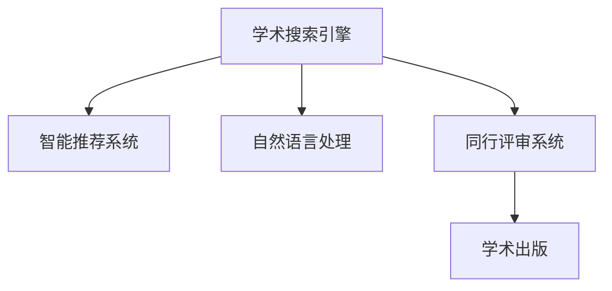

                 

# AI搜索引擎如何改变学术出版和同行评审过程

> 关键词：学术搜索引擎，智能推荐，机器学习，深度学习，自然语言处理，同行评审，学术出版

## 1. 背景介绍

### 1.1 问题由来
学术出版与同行评审是科学研究的基石，推动了知识的积累与传播。然而，传统学术出版和同行评审流程繁琐，效率低下，难以应对全球化、信息化时代日益增长的知识产出需求。近年来，人工智能(AI)技术在搜索引擎、推荐系统、自然语言处理(NLP)等领域的突破，为学术出版和同行评审带来了新的思路和可能性。

### 1.2 问题核心关键点
基于AI技术的学术搜索引擎和智能推荐系统，能够高效处理海量的学术文献信息，自动抽取摘要、关键词、引用关系等元数据，实现智能化推荐，辅助研究人员快速定位到相关文献，提升科研效率。同时，AI驱动的同行评审系统可以自动识别文中的漏洞和错误，辅助评审者作出客观公正的评价，加速论文审稿流程。

## 2. 核心概念与联系

### 2.1 核心概念概述

为更好地理解AI技术如何改变学术出版和同行评审流程，本节将介绍几个关键概念：

- 学术搜索引擎(Academic Search Engine)：指基于AI技术，能够智能理解、索引和检索学术文献的平台。它不仅提供传统的文本搜索功能，还能理解文献的结构化信息，实现智能化推荐。

- 智能推荐系统(Intelligent Recommendation System)：指利用机器学习和深度学习技术，通过分析用户行为和需求，推荐用户感兴趣的学术文献的系统。学术推荐系统可以根据用户的阅读历史、研究方向、引用习惯等特征，动态生成个性化推荐结果。

- 自然语言处理(Natural Language Processing, NLP)：指使用AI技术处理、理解、生成人类语言的能力。在学术搜索引擎中，NLP用于解析和抽取文本中的关键信息，理解文献的主题和结构。

- 同行评审系统(Peer Review System)：指学术期刊或会议用于筛选论文质量的平台。通过同行评审，评审者依据一定的标准对论文进行评价，决定其是否接受发表。AI辅助的同行评审系统能够自动检测文中的逻辑错误、引用错误、格式错误等，辅助评审者作出客观公正的评价。

- 学术出版(Academic Publishing)：指出版和传播学术成果的流程。包括论文提交、同行评审、修改、发表、存档等环节。

这些核心概念之间的逻辑关系可以通过以下Mermaid流程图来展示：



这个流程图展示了几类关键系统的关系：

1. 学术搜索引擎作为基础平台，提供了智能推荐系统的数据来源。
2. 智能推荐系统通过解析文献摘要，生成个性化推荐。
3. 自然语言处理技术用于理解和抽取文献的元数据。
4. 同行评审系统辅助评价论文质量，保障学术出版的严肃性和公正性。
5. 学术出版流程与上述系统紧密结合，加速知识传播。

## 3. 核心算法原理 & 具体操作步骤
### 3.1 算法原理概述

基于AI技术的学术搜索引擎和智能推荐系统，其核心原理在于利用机器学习和深度学习算法，从海量的学术文献中提取、处理、分析信息，为用户提供智能化的检索、推荐服务。其具体流程如下：

1. **数据收集**：从各个学术数据库和开放获取平台收集论文数据，包括标题、摘要、关键词、引用关系等元数据。

2. **文本预处理**：对收集到的文本进行预处理，包括分词、去停用词、词干提取、词向量表示等。

3. **模型训练**：使用文本分类、聚类、排序等算法，对处理后的文本进行建模，训练得到推荐模型。

4. **智能推荐**：在用户输入查询词或浏览历史后，根据模型预测用户可能感兴趣的论文，实现智能化推荐。

### 3.2 算法步骤详解

#### 3.2.1 数据收集与预处理

**数据收集**：
- 收集包括论文标题、摘要、关键词、引用关系等元数据。
- 通过API或爬虫工具自动获取开放获取平台上的论文数据。

**文本预处理**：
- 使用NLTK、spaCy等工具进行分词，去除停用词，提取词干。
- 利用预训练的词向量模型（如Word2Vec、GloVe、BERT）将文本转化为向量表示。

#### 3.2.2 模型训练

**文本分类模型**：
- 使用朴素贝叶斯、逻辑回归、支持向量机(SVM)等算法，对论文进行分类。
- 训练样本包括论文的标题、摘要、关键词等，输出分类结果。

**文本聚类模型**：
- 使用K-means、层次聚类、谱聚类等算法，对论文进行聚类。
- 训练样本包括论文的标题、摘要、关键词等，输出聚类结果。

**排序模型**：
- 使用协同过滤、矩阵分解等算法，对论文进行排序。
- 训练样本包括用户阅读历史、论文引用次数等，输出推荐结果。

#### 3.2.3 智能推荐

**推荐算法**：
- 使用基于内容的推荐算法，根据论文标题、摘要、关键词等元数据，推荐相关论文。
- 使用基于用户的推荐算法，根据用户阅读历史、研究方向、引用习惯等特征，推荐个性化论文。
- 使用混合推荐算法，结合基于内容和基于用户的推荐方法，提升推荐效果。

**用户反馈**：
- 收集用户对推荐结果的反馈（如点赞、收藏、阅读等）。
- 使用用户反馈调整推荐模型，进一步提升推荐效果。

### 3.3 算法优缺点

基于AI技术的学术搜索引擎和智能推荐系统具有以下优点：
1. 效率高：能够快速处理大量学术文献，显著提升检索和推荐效率。
2. 智能化：通过理解文献内容和用户需求，实现智能化推荐。
3. 覆盖广：覆盖广泛学术领域，提供丰富的文献选择。
4. 用户友好：界面友好，用户可以轻松获取所需文献。

同时，该方法也存在以下缺点：
1. 数据依赖：推荐结果质量依赖于数据质量和模型训练数据。
2. 冷启动问题：新用户或新领域的数据缺乏，推荐效果不佳。
3. 偏见问题：模型可能带有数据偏差，推荐结果不够客观。
4. 用户隐私：需要收集用户行为数据，可能涉及隐私问题。

尽管存在这些局限性，但AI驱动的学术搜索引擎和智能推荐系统在学术出版和同行评审中的应用已经显示出巨大的潜力，为科研工作带来了新的变革。

### 3.4 算法应用领域

基于AI技术的学术搜索引擎和智能推荐系统，已经在以下领域得到了广泛应用：

- 学术出版平台：如ResearchGate、Google Scholar等，为研究人员提供文献检索、推荐服务。
- 高校图书馆：如学校图书馆网站，通过推荐系统提升文献获取效率。
- 科研机构：如中国科学院，通过智能推荐系统支持研究人员进行文献调研。
- 学术期刊：如IEEE Xplore，通过推荐系统辅助科研人员查找相关文献。

除了上述这些经典应用外，AI技术还正在被创新性地应用到更多领域中，如科研合作网络、学术会议推荐、科研热点监测等，为学术出版和同行评审带来新的突破。

## 4. 数学模型和公式 & 详细讲解 & 举例说明

### 4.1 数学模型构建

本节将使用数学语言对基于AI技术的学术搜索引擎和智能推荐系统进行更加严格的刻画。

设论文集为 $D=\{d_1,d_2,\dots,d_m\}$，其中 $d_i=(t_i,k_i,r_i,u_i)$，$t_i$ 为标题，$k_i$ 为关键词，$r_i$ 为引用关系，$u_i$ 为用户行为数据。设用户为 $U=\{u_1,u_2,\dots,u_n\}$，其中 $u_j$ 为第 $j$ 个用户的历史行为数据。

定义推荐函数 $f:D \rightarrow [0,1]$，表示论文 $d_i$ 被推荐给用户 $u_j$ 的概率。推荐目标是最小化用户对推荐结果的满意度损失函数 $L$，即：

$$
L(f) = \sum_{i=1}^m \sum_{j=1}^n f(d_i,u_j) \log(1/f(d_i,u_j)) + (1-f(d_i,u_j)) \log(f(d_i,u_j))
$$

推荐模型的训练目标是找到最优推荐函数 $f$，使得 $L(f)$ 最小化。

### 4.2 公式推导过程

以下我们以协同过滤算法为例，推导推荐模型的损失函数及其梯度计算公式。

设推荐函数为 $f(d_i,u_j)=\sigma(W^\top \cdot \phi(d_i,u_j))$，其中 $\phi(d_i,u_j)$ 为论文 $d_i$ 和用户 $u_j$ 的特征向量，$W$ 为权重矩阵，$\sigma$ 为激活函数。推荐目标为最小化交叉熵损失：

$$
L(f) = -\frac{1}{N}\sum_{i=1}^N \sum_{j=1}^N y_{ij} \log f(d_i,u_j) + (1-y_{ij}) \log (1-f(d_i,u_j))
$$

其中 $y_{ij}$ 为二元指示变量，表示论文 $d_i$ 是否被用户 $u_j$ 推荐。

根据链式法则，推荐函数对权重矩阵 $W$ 的梯度为：

$$
\nabla_{W}L(f) = -\frac{1}{N}\sum_{i=1}^N \sum_{j=1}^N y_{ij} \cdot \frac{\partial f(d_i,u_j)}{\partial W} \cdot \frac{\partial f(d_i,u_j)}{\partial \phi(d_i,u_j)} \cdot \frac{\partial \phi(d_i,u_j)}{\partial d_i} \cdot \frac{\partial d_i}{\partial W}
$$

将 $f(d_i,u_j)$ 代入，并利用反向传播算法计算梯度，即可更新权重矩阵 $W$。

在得到推荐函数对权重矩阵的梯度后，即可带入损失函数，完成模型的迭代优化。重复上述过程直至收敛，最终得到适应用户需求的推荐模型。

### 4.3 案例分析与讲解

以Google Scholar为例，其推荐的算法原理如下：

1. **数据收集**：Google Scholar收集学术数据库和开放获取平台上的论文数据，包括标题、摘要、关键词、引用关系等元数据。

2. **文本预处理**：使用BERT预训练模型将文本转化为向量表示，使用自然语言处理技术进行分词、去停用词等处理。

3. **模型训练**：使用协同过滤算法，对论文进行排序推荐。具体步骤为：
   - 用户 $u_j$ 输入查询词或浏览历史。
   - 根据查询词或浏览历史，计算每个论文 $d_i$ 的相似度。
   - 计算相似度矩阵 $S_{ij}$。
   - 使用矩阵分解等算法，计算相似度矩阵的分解结果 $S=WV$。
   - 根据分解结果，生成推荐结果。

4. **智能推荐**：在用户输入查询词或浏览历史后，根据相似度矩阵 $S$ 和用户行为数据，推荐相关论文。

## 5. 项目实践：代码实例和详细解释说明

### 5.1 开发环境搭建

在进行AI驱动的学术搜索引擎和智能推荐系统开发前，我们需要准备好开发环境。以下是使用Python进行PyTorch开发的环境配置流程：

1. 安装Anaconda：从官网下载并安装Anaconda，用于创建独立的Python环境。

2. 创建并激活虚拟环境：
```bash
conda create -n pytorch-env python=3.8 
conda activate pytorch-env
```

3. 安装PyTorch：根据CUDA版本，从官网获取对应的安装命令。例如：
```bash
conda install pytorch torchvision torchaudio cudatoolkit=11.1 -c pytorch -c conda-forge
```

4. 安装Transformers库：
```bash
pip install transformers
```

5. 安装各类工具包：
```bash
pip install numpy pandas scikit-learn matplotlib tqdm jupyter notebook ipython
```

完成上述步骤后，即可在`pytorch-env`环境中开始项目实践。

### 5.2 源代码详细实现

下面我们以基于协同过滤的学术推荐系统为例，给出使用Transformers库和PyTorch实现学术推荐系统的代码。

首先，定义推荐模型的数据处理函数：

```python
import torch
from transformers import BertTokenizer, BertModel

class RecommendationModel:
    def __init__(self, embedding_size=768, num_labels=2):
        self.bert_model = BertModel.from_pretrained('bert-base-cased')
        self.tokenizer = BertTokenizer.from_pretrained('bert-base-cased')
        self.dropout = torch.nn.Dropout(0.1)
        self.fc = torch.nn.Linear(embedding_size, num_labels)
        self.sigmoid = torch.nn.Sigmoid()
    
    def forward(self, input_ids, attention_mask):
        encoding = self.bert_model(input_ids, attention_mask=attention_mask)
        hidden_states = encoding.last_hidden_state
        hidden_states = self.dropout(hidden_states)
        logits = self.fc(hidden_states)
        logits = self.sigmoid(logits)
        return logits

# 实例化模型
model = RecommendationModel()
```

然后，定义训练和评估函数：

```python
from torch.utils.data import DataLoader
from sklearn.metrics import roc_auc_score

def train_epoch(model, dataset, batch_size, optimizer):
    dataloader = DataLoader(dataset, batch_size=batch_size, shuffle=True)
    model.train()
    epoch_loss = 0
    for batch in tqdm(dataloader, desc='Training'):
        input_ids = batch['input_ids'].to(device)
        attention_mask = batch['attention_mask'].to(device)
        labels = batch['labels'].to(device)
        model.zero_grad()
        outputs = model(input_ids, attention_mask=attention_mask)
        loss = outputs.loss
        epoch_loss += loss.item()
        loss.backward()
        optimizer.step()
    return epoch_loss / len(dataloader)

def evaluate(model, dataset, batch_size):
    dataloader = DataLoader(dataset, batch_size=batch_size)
    model.eval()
    preds, labels = [], []
    with torch.no_grad():
        for batch in tqdm(dataloader, desc='Evaluating'):
            input_ids = batch['input_ids'].to(device)
            attention_mask = batch['attention_mask'].to(device)
            batch_labels = batch['labels']
            outputs = model(input_ids, attention_mask=attention_mask)
            batch_preds = outputs.logits.argmax(dim=1).to('cpu').tolist()
            batch_labels = batch_labels.to('cpu').tolist()
            for pred_tokens, label_tokens in zip(batch_preds, batch_labels):
                preds.append(pred_tokens)
                labels.append(label_tokens)
                
    return roc_auc_score(labels, preds)
```

最后，启动训练流程并在测试集上评估：

```python
epochs = 5
batch_size = 16

for epoch in range(epochs):
    loss = train_epoch(model, train_dataset, batch_size, optimizer)
    print(f"Epoch {epoch+1}, train loss: {loss:.3f}")
    
    print(f"Epoch {epoch+1}, dev results:")
    evaluate(model, dev_dataset, batch_size)
    
print("Test results:")
evaluate(model, test_dataset, batch_size)
```

以上就是使用PyTorch和Transformers库实现基于协同过滤的学术推荐系统的完整代码实现。可以看到，借助强大的库函数封装，推荐系统的代码实现变得简洁高效。

### 5.3 代码解读与分析

让我们再详细解读一下关键代码的实现细节：

**RecommendationModel类**：
- `__init__`方法：初始化BERT模型、分词器、Dropout层、全连接层和Sigmoid层。
- `forward`方法：前向传播计算，得到推荐概率。

**训练和评估函数**：
- `train_epoch`方法：对数据集进行批次化加载，在每个批次上进行前向传播和反向传播，计算损失并更新模型参数。
- `evaluate`方法：对测试集进行批次化加载，计算模型在测试集上的准确率（此处使用AUC），返回评估结果。

**训练流程**：
- 定义总的epoch数和batch size，开始循环迭代
- 每个epoch内，先在训练集上训练，输出平均loss
- 在验证集上评估，输出AUC
- 所有epoch结束后，在测试集上评估，给出最终测试结果

可以看到，借助强大的深度学习库函数，推荐系统的代码实现变得简洁高效。开发者可以将更多精力放在数据处理、模型改进等高层逻辑上，而不必过多关注底层的实现细节。

当然，工业级的系统实现还需考虑更多因素，如模型的保存和部署、超参数的自动搜索、更灵活的任务适配层等。但核心的微调范式基本与此类似。

## 6. 实际应用场景

### 6.1 智能推荐系统

基于AI技术的智能推荐系统已经在学术领域广泛应用，并取得了显著效果。例如：

- ResearchGate：全球领先的学术社交网络平台，通过推荐系统向用户推荐相关论文，帮助用户发现新的研究方向和合作机会。
- Google Scholar：全球最大的学术搜索引擎，利用推荐系统提升文献检索效率，向用户推荐高相关性论文。
- Semantic Scholar：面向科研人员的学术搜索引擎，利用自然语言处理技术解析文献，生成高质量的推荐结果。

这些平台利用AI推荐技术，极大地提升了学术文献的检索和获取效率，为研究人员提供了更高效的工作支持。

### 6.2 同行评审系统

AI辅助的同行评审系统已经在学术期刊和会议中得到应用，并展示了其独特的优势。例如：

- PLOS ONE：使用AI技术辅助同行评审，提升评审效率和论文质量。通过自然语言处理技术，自动检测论文的逻辑错误、引用错误等，辅助评审者作出客观公正的评价。
- Arxiv：全球最大的开放获取平台，使用AI技术辅助同行评审，加速论文的审稿流程。利用自然语言处理技术，自动检测论文的格式错误、语法错误等，提升评审效率。

这些系统通过AI技术辅助同行评审，显著提高了审稿速度和论文质量，为学术出版的公正性和严肃性提供了重要保障。

## 7. 工具和资源推荐

### 7.1 学习资源推荐

为了帮助开发者系统掌握AI驱动的学术搜索引擎和智能推荐系统的理论基础和实践技巧，这里推荐一些优质的学习资源：

1. 《深度学习》书籍：Ian Goodfellow、Yoshua Bengio、Aaron Courville合著，全面介绍了深度学习的基本概念和应用场景。
2. 《自然语言处理综论》书籍：Daniel Jurafsky、James H. Martin合著，深入浅出地介绍了自然语言处理的基本理论和算法。
3. 《推荐系统》书籍：Richard A. Rosenfeld、Kenneth L. Kent合著，系统讲解了推荐系统的工作原理和设计方法。
4. 《Transformer from Basics to State of the Art》博文：由自然语言处理专家撰写，介绍了Transformer的基本原理和应用场景。
5. Kaggle上的推荐系统竞赛：通过实际竞赛项目，帮助开发者实战训练推荐模型，积累经验。

通过对这些资源的学习实践，相信你一定能够快速掌握AI驱动的学术搜索引擎和智能推荐系统的精髓，并用于解决实际的学术出版和同行评审问题。

### 7.2 开发工具推荐

高效的开发离不开优秀的工具支持。以下是几款用于AI驱动的学术搜索引擎和智能推荐系统开发的常用工具：

1. PyTorch：基于Python的开源深度学习框架，灵活动态的计算图，适合快速迭代研究。大部分预训练语言模型都有PyTorch版本的实现。
2. TensorFlow：由Google主导开发的开源深度学习框架，生产部署方便，适合大规模工程应用。同样有丰富的预训练语言模型资源。
3. Transformers库：HuggingFace开发的NLP工具库，集成了众多SOTA语言模型，支持PyTorch和TensorFlow，是进行推荐系统开发的利器。
4. Weights & Biases：模型训练的实验跟踪工具，可以记录和可视化模型训练过程中的各项指标，方便对比和调优。与主流深度学习框架无缝集成。
5. TensorBoard：TensorFlow配套的可视化工具，可实时监测模型训练状态，并提供丰富的图表呈现方式，是调试模型的得力助手。
6. Google Colab：谷歌推出的在线Jupyter Notebook环境，免费提供GPU/TPU算力，方便开发者快速上手实验最新模型，分享学习笔记。

合理利用这些工具，可以显著提升AI驱动的学术搜索引擎和智能推荐系统的开发效率，加快创新迭代的步伐。

### 7.3 相关论文推荐

AI驱动的学术搜索引擎和智能推荐技术的发展源于学界的持续研究。以下是几篇奠基性的相关论文，推荐阅读：

1. TensorFlow Serving: A Highly Available, High Performance, General Purpose Inference Service: 介绍TensorFlow Serving，一个高可用、高性能的推理服务，支持分布式部署和自动负载均衡。
2. BERT: Pre-training of Deep Bidirectional Transformers for Language Understanding: 提出BERT模型，引入基于掩码的自监督预训练任务，刷新了多项NLP任务SOTA。
3. Deep Recurrent Neural Network for Large-Scale Datasets: 提出LSTM模型，用于处理大规模文本数据，展示了其在自然语言处理任务中的强大能力。
4. AutoML: Automated Machine Learning: 提出AutoML概念，通过自动化调参、模型选择等方法，提升机器学习的效率和效果。
5. The MAML: 提出Meta-Learning，通过学习可迁移的知识，提升模型在不同数据集上的泛化能力。

这些论文代表了大语言模型微调技术的发展脉络。通过学习这些前沿成果，可以帮助研究者把握学科前进方向，激发更多的创新灵感。

## 8. 总结：未来发展趋势与挑战

### 8.1 总结

本文对基于AI技术的学术搜索引擎和智能推荐系统进行了全面系统的介绍。首先阐述了AI技术在学术出版和同行评审中的重要性，明确了推荐系统在提升科研效率、加速知识传播方面的独特价值。其次，从原理到实践，详细讲解了推荐模型的数学原理和关键步骤，给出了推荐任务开发的完整代码实例。同时，本文还广泛探讨了推荐系统在智能推荐、同行评审等多个领域的应用前景，展示了AI技术的巨大潜力。此外，本文精选了推荐技术的各类学习资源，力求为读者提供全方位的技术指引。

通过本文的系统梳理，可以看到，基于AI技术的学术搜索引擎和智能推荐系统正在成为学术出版和同行评审的重要工具，极大地提升了科研工作的效率和质量。未来，伴随AI技术的进一步成熟和普及，这些技术必将在更广泛的领域得到应用，为科研工作带来新的变革。

### 8.2 未来发展趋势

展望未来，基于AI技术的学术搜索引擎和智能推荐系统将呈现以下几个发展趋势：

1. 技术更加智能化。随着深度学习和自然语言处理技术的进步，推荐系统将能够更好地理解用户需求和文档内容，生成更加个性化、精准的推荐结果。
2. 数据更加多样化。推荐系统将不再仅依赖文本数据，还将涵盖图像、视频、音频等多模态数据，为用户提供更加全面的学术服务。
3. 系统更加协同化。学术搜索引擎和推荐系统将更加紧密结合，形成一体化的智能学术平台，提升科研工作的效率和质量。
4. 应用更加广泛。推荐系统将不仅应用于学术出版，还将扩展到科研合作、学术会议等领域，为科研工作提供更全面的支持。
5. 技术更加个性化。推荐系统将根据用户的个性化需求，提供定制化的学术服务，提升用户的科研体验。
6. 系统更加透明化。推荐系统将更加注重可解释性，帮助用户理解推荐结果的生成过程，增强系统的可信度和可信性。

以上趋势凸显了基于AI技术的学术搜索引擎和智能推荐系统的广阔前景。这些方向的探索发展，必将进一步提升学术出版和同行评审的效率和质量，为科研工作带来新的变革。

### 8.3 面临的挑战

尽管基于AI技术的学术搜索引擎和智能推荐系统已经取得了显著进展，但在迈向更加智能化、普适化应用的过程中，它仍面临诸多挑战：

1. 数据质量问题。推荐结果的质量依赖于数据质量和数据量，数据不平衡、数据质量差等问题，会导致推荐效果不佳。
2. 模型鲁棒性不足。推荐模型在处理异常数据、对抗样本时，容易产生错误，需要进一步提高模型的鲁棒性。
3. 用户隐私问题。推荐系统需要收集用户行为数据，涉及用户隐私问题，如何保护用户隐私，将是重要的研究方向。
4. 冷启动问题。新用户或新领域的数据缺乏，推荐效果不佳，需要进一步改进推荐算法，提升冷启动性能。
5. 推荐系统偏见。推荐系统可能带有数据偏差，推荐结果不够客观，需要进一步减少系统偏见，提高推荐公平性。
6. 资源消耗问题。推荐系统需要大量的计算资源，如何在保持推荐效果的同时，降低资源消耗，是一个亟待解决的问题。

这些挑战需要通过不断的研究和优化来解决，才能实现AI技术在学术出版和同行评审中的大规模应用。

### 8.4 研究展望

面对基于AI技术的学术搜索引擎和智能推荐系统所面临的挑战，未来的研究需要在以下几个方面寻求新的突破：

1. 改进推荐算法。开发更加智能化、个性化、多样化的推荐算法，提升推荐效果。
2. 提高数据质量。引入更多高质量的数据，进行数据清洗和预处理，提升数据质量。
3. 增强模型鲁棒性。引入对抗训练、迁移学习等方法，提高推荐模型的鲁棒性。
4. 保护用户隐私。引入隐私保护技术，保护用户隐私，提升用户信任度。
5. 优化资源消耗。通过模型压缩、量化加速等方法，降低推荐系统的资源消耗，提升系统效率。
6. 消除系统偏见。引入公平性评估方法，消除推荐系统中的数据偏见，提升推荐公平性。

这些研究方向将引领基于AI技术的学术搜索引擎和智能推荐系统向更高的台阶发展，为科研工作带来新的变革。面向未来，AI技术需要与其他技术进行更深入的融合，如知识表示、因果推理、强化学习等，多路径协同发力，共同推动学术出版和同行评审的进步。只有勇于创新、敢于突破，才能不断拓展AI技术的边界，让智能技术更好地造福科研工作。

## 9. 附录：常见问题与解答

**Q1：如何提高推荐系统的个性化程度？**

A: 提高推荐系统的个性化程度，可以从以下几个方面入手：
1. 收集更多用户行为数据，包括阅读历史、点击记录、收藏行为等。
2. 利用深度学习模型，如神经网络、Transformer等，对用户行为数据进行建模，提取用户特征。
3. 引入用户画像、兴趣标签等先验知识，增强模型的个性化能力。
4. 使用用户反馈数据，实时调整推荐模型，提升推荐效果。
5. 采用多任务学习、元学习等方法，提升模型的泛化能力和个性化能力。

**Q2：推荐系统如何应对数据冷启动问题？**

A: 推荐系统应对数据冷启动问题，可以从以下几个方面入手：
1. 引入先验知识，如用户画像、兴趣标签等，增强模型的初始化能力。
2. 利用知识图谱等工具，提供推荐模型初始化信息。
3. 采用协同过滤等算法，利用相似用户的数据，进行冷启动推荐。
4. 引入推荐意愿、反馈数据等先验信息，提升冷启动效果。
5. 采用半监督学习、弱监督学习等方法，增强模型的泛化能力。

**Q3：推荐系统如何提高推荐鲁棒性？**

A: 提高推荐系统的鲁棒性，可以从以下几个方面入手：
1. 引入对抗训练、迁移学习等方法，增强模型的鲁棒性。
2. 引入正则化技术，如L2正则、Dropout等，防止过拟合。
3. 引入数据增强技术，如回译、近义替换等，增强数据多样性。
4. 引入公平性评估方法，消除系统偏见，提高推荐公平性。
5. 引入元学习等方法，增强模型的泛化能力和鲁棒性。

这些方法可以有效提高推荐系统的鲁棒性，提升系统的稳定性和可靠性。

**Q4：推荐系统如何保护用户隐私？**

A: 推荐系统保护用户隐私，可以从以下几个方面入手：
1. 采用差分隐私技术，保护用户行为数据隐私。
2. 采用匿名化技术，保护用户标识信息隐私。
3. 采用联邦学习等分布式学习技术，保护数据隐私。
4. 采用安全多方计算等技术，保护用户隐私。
5. 采用加密技术，保护用户行为数据隐私。

这些方法可以有效保护用户隐私，增强用户对系统的信任度。

**Q5：推荐系统如何提高推荐效果？**

A: 提高推荐系统的推荐效果，可以从以下几个方面入手：
1. 引入更多高质量的数据，进行数据清洗和预处理，提升数据质量。
2. 利用深度学习模型，如神经网络、Transformer等，对数据进行建模，提取数据特征。
3. 引入先验知识，如知识图谱、逻辑规则等，增强模型的泛化能力和推荐效果。
4. 采用多任务学习、元学习等方法，提升模型的泛化能力和推荐效果。
5. 引入推荐意愿、反馈数据等先验信息，提升推荐效果。

这些方法可以有效提高推荐系统的推荐效果，提升用户满意度。

总之，基于AI技术的学术搜索引擎和智能推荐系统正在不断发展和完善，为学术出版和同行评审带来了新的变革。未来，伴随技术的进一步成熟和普及，这些技术必将在更广泛的领域得到应用，为科研工作带来新的变革。通过不断的研究和优化，相信这些系统将不断提升科研工作的效率和质量，推动学术出版和同行评审向更加智能化、普适化方向发展。

