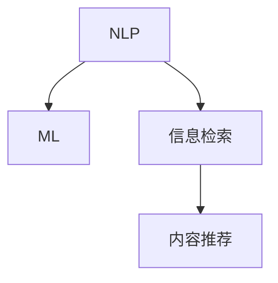

                 

# AI搜索引擎对传统媒体和出版业的影响

> 关键词：人工智能，搜索引擎，传统媒体，出版业，信息检索，自然语言处理，内容推荐

## 1. 背景介绍

随着科技的飞速发展，人工智能（AI）已成为推动各行各业变革的关键力量。在传统媒体和出版业领域，AI搜索引擎的应用正在逐步改变这一行业的运作方式，从信息检索到内容推荐，从内容创作到广告投放，AI搜索引擎以其高效的算法和强大的数据处理能力，为传统媒体和出版业带来了前所未有的变化和机遇。

### 1.1 问题由来

传统媒体和出版业长期以来依赖于人工编辑和审校，流程繁琐且效率低下。近年来，随着互联网技术的普及和移动设备的广泛使用，数字内容消费模式发生重大转变，传统的信息检索方式已无法满足用户快速、精准获取信息的需求。同时，出版业的成本压力和市场竞争日益加剧，传统媒体和出版业亟需借助技术手段提升内容生产的效率和质量，实现内容差异化和精准推送。

在这样的背景下，AI搜索引擎应运而生，其借助自然语言处理（NLP）和机器学习（ML）技术，实现了从海量数据中自动提取出与用户需求相关的高质量内容，并根据用户的阅读习惯和偏好进行智能推荐。AI搜索引擎的出现，不仅提升了传统媒体和出版业的内容传播效率，还为用户带来了个性化阅读的全新体验。

### 1.2 问题核心关键点

AI搜索引擎的核心在于如何有效地利用NLP和ML技术，将非结构化数据转化为结构化信息，实现智能信息检索和内容推荐。其核心工作流程主要包括：

1. **数据收集与预处理**：从各种来源收集文本数据，并进行清洗、标注和特征提取。
2. **模型训练**：利用机器学习算法训练出能够准确理解文本语义的模型。
3. **信息检索与推荐**：根据用户输入的查询，通过模型检索出最相关的文本内容，并结合用户的阅读历史进行个性化推荐。

AI搜索引擎的关键点在于如何设计高效的数据结构、构建精确的语义模型以及实现智能推荐算法。

## 2. 核心概念与联系

### 2.1 核心概念概述

为更好地理解AI搜索引擎的工作原理，本节将介绍几个关键概念：

- **自然语言处理（NLP）**：旨在使计算机能够理解、解释和生成人类语言的技术。主要包括分词、词性标注、命名实体识别、语义分析、情感分析等。
- **机器学习（ML）**：通过数据训练模型，使模型能够从数据中自动学习特征，并对新数据进行预测或分类。
- **信息检索（IR）**：从大量文本数据中检索出与用户查询最相关的信息。
- **内容推荐系统**：根据用户的行为和偏好，智能推荐内容，提高用户的阅读体验和满意度。

这些概念之间的逻辑关系可以通过以下Mermaid流程图来展示：



这个流程图展示了NLP、ML和内容推荐之间的联系：NLP负责理解和分析文本，ML用于训练模型进行信息检索和推荐，而信息检索和推荐则是AI搜索引擎的核心功能。

## 3. 核心算法原理 & 具体操作步骤

### 3.1 算法原理概述

AI搜索引擎的算法原理主要基于自然语言处理（NLP）和机器学习（ML）技术，具体包括：

- **文本预处理**：将原始文本转化为计算机可读的形式，包括分词、去停用词、词性标注、实体识别等。
- **特征提取**：从处理后的文本中提取出有意义的特征向量，用于表示文本的语义和主题。
- **语义建模**：通过构建语义模型，使计算机能够理解文本的深层语义信息，包括情感、主题、关系等。
- **信息检索**：通过匹配查询与文本的特征向量，检索出最相关的文本。
- **内容推荐**：通过分析用户的行为数据，预测用户可能感兴趣的内容，并智能推荐。

AI搜索引擎的总体流程大致如下：

1. **文本预处理**：将原始文本转化为计算机可读的形式，包括分词、去停用词、词性标注、实体识别等。
2. **特征提取**：从处理后的文本中提取出有意义的特征向量，用于表示文本的语义和主题。
3. **语义建模**：通过构建语义模型，使计算机能够理解文本的深层语义信息，包括情感、主题、关系等。
4. **信息检索**：通过匹配查询与文本的特征向量，检索出最相关的文本。
5. **内容推荐**：通过分析用户的行为数据，预测用户可能感兴趣的内容，并智能推荐。

### 3.2 算法步骤详解

#### 3.2.1 文本预处理

文本预处理是AI搜索引擎的重要环节，其目的是将原始文本转化为计算机可读的形式。文本预处理主要包括以下步骤：

1. **分词**：将连续的文本序列切分成单词或短语。
2. **去停用词**：去除常见的无意义词汇，如“的”、“是”等。
3. **词性标注**：对每个词标注其词性，如名词、动词、形容词等。
4. **命名实体识别**：识别出人名、地名、机构名等专有名词。
5. **实体关系抽取**：提取文本中的实体及其关系。

这些步骤可以通过现有的NLP工具包（如NLTK、SpaCy、Stanford NER等）实现，并进行自定义配置以满足特定的需求。

#### 3.2.2 特征提取

特征提取是将文本转化为机器可读的向量形式，通常使用TF-IDF、Word2Vec、BERT等技术。这些技术将文本转换为向量形式，以便于模型进行理解和学习。

- **TF-IDF**：基于词频和文档频率的统计方法，计算每个词的重要性。
- **Word2Vec**：通过神经网络学习词向量，将单词映射到低维空间。
- **BERT**：使用双向编码器进行预训练，并可以通过微调进行任务特定训练。

这些特征提取方法在实际应用中需要根据具体的场景进行选择和组合。

#### 3.2.3 语义建模

语义建模是使计算机理解文本深层语义信息的关键步骤，通常使用深度学习模型（如LSTM、GRU、Transformer等）进行训练。

- **LSTM**：长短期记忆网络，适用于序列数据的处理，能够记住文本中的上下文信息。
- **GRU**：门控循环单元，是LSTM的变体，计算效率更高。
- **Transformer**：基于注意力机制，能够捕捉长距离依赖关系。

语义建模通常需要在大规模标注数据上进行训练，以获得准确的语义表示。

#### 3.2.4 信息检索

信息检索是AI搜索引擎的核心功能，其目标是从大量文本数据中检索出与用户查询最相关的文本。信息检索主要包括以下步骤：

1. **倒排索引**：将文本转换为索引表，以便于快速检索。
2. **查询匹配**：将用户查询与文本进行匹配，计算相似度。
3. **排序**：根据相似度对检索结果进行排序，并返回前N条结果。

信息检索算法包括BM25、向量空间模型、余弦相似度等，这些算法在实际应用中需要根据具体的场景进行选择和优化。

#### 3.2.5 内容推荐

内容推荐系统通过分析用户的行为数据，预测用户可能感兴趣的内容，并智能推荐。推荐系统主要包括以下步骤：

1. **用户画像**：构建用户的兴趣和偏好模型。
2. **内容画像**：构建内容的特征向量。
3. **相似度计算**：计算用户和内容之间的相似度。
4. **推荐排序**：根据相似度对内容进行排序，并返回前N条内容。

推荐算法包括协同过滤、基于内容的推荐、深度学习推荐等，这些算法在实际应用中需要根据具体的场景进行选择和优化。

### 3.3 算法优缺点

AI搜索引擎的优点在于能够处理大规模文本数据，提升信息检索和内容推荐的效率和精度。同时，能够根据用户的个性化需求进行推荐，提高用户体验。但同时，也存在以下缺点：

- **数据依赖**：需要大量的标注数据进行训练，获取高质量数据成本较高。
- **模型复杂**：深度学习模型计算复杂，需要高性能硬件支持。
- **可解释性不足**：黑盒模型难以解释其决策过程，存在一定的不透明性。
- **数据隐私**：收集用户数据可能侵犯隐私，需注意数据保护和隐私管理。

尽管存在这些缺点，AI搜索引擎在信息检索和内容推荐方面的优势明显，已广泛应用于各种场景，包括搜索引擎、新闻推荐、个性化广告等。

### 3.4 算法应用领域

AI搜索引擎的应用领域非常广泛，涵盖了搜索引擎、个性化推荐系统、智能客服、智能广告等多个方向。以下是一些具体的应用场景：

- **搜索引擎**：通过自然语言查询，返回与用户需求最相关的网页。
- **个性化推荐系统**：根据用户的行为数据，推荐用户可能感兴趣的内容，如新闻、视频、商品等。
- **智能客服**：通过自然语言处理技术，自动回答用户问题，提升用户体验。
- **智能广告**：根据用户的行为数据，智能推荐广告，提高广告投放效果。
- **文本挖掘**：从海量文本数据中挖掘出有价值的信息，如情感分析、主题分析等。

## 4. 数学模型和公式 & 详细讲解  
### 4.1 数学模型构建

AI搜索引擎的核心数学模型包括自然语言处理（NLP）和机器学习（ML）模型。以下以信息检索为例，构建基于向量空间模型的数学模型。

假设文本集合为 $D = \{d_1, d_2, ..., d_m\}$，查询为 $q$，每个文本 $d_i$ 的特征向量为 $v_i$。向量空间模型通过计算查询 $q$ 与文本 $d_i$ 的余弦相似度来评估文本的相关性。余弦相似度的计算公式为：

$$
\text{sim}(q, d_i) = \frac{q \cdot v_i}{\|q\| \cdot \|v_i\|}
$$

其中 $\cdot$ 表示向量点乘，$\|\cdot\|$ 表示向量范数。

### 4.2 公式推导过程

设 $q = (q_1, q_2, ..., q_n)$，每个特征 $q_j$ 的权重为 $w_j$，则查询向量 $q$ 为：

$$
q = \sum_{j=1}^n w_j q_j
$$

对于文本 $d_i = (v_{i1}, v_{i2}, ..., v_{im})$，特征向量 $v_i$ 为：

$$
v_i = (v_{i1}, v_{i2}, ..., v_{im})
$$

余弦相似度的计算公式可以进一步推导为：

$$
\text{sim}(q, d_i) = \frac{\sum_{j=1}^n w_j v_{ij}}{\sqrt{\sum_{j=1}^n w_j^2} \cdot \sqrt{\sum_{j=1}^m v_{ij}^2}}
$$

在实际应用中，为了提升计算效率，通常对文本和查询进行索引化，并使用倒排索引表进行快速匹配。

### 4.3 案例分析与讲解

以Google搜索引擎为例，分析其信息检索的算法流程。

1. **分词与预处理**：将原始文本进行分词和预处理，去除停用词和特殊字符。
2. **倒排索引**：构建倒排索引表，将文本转换为索引形式。
3. **查询匹配**：将用户查询与索引表进行匹配，计算相似度。
4. **排序与返回**：根据相似度对结果进行排序，并返回前N条结果。

Google搜索引擎的查询匹配算法采用了BM25模型，该模型考虑了单词频率、文档长度、文档频率等因素，计算出每个文档的相关性得分。

## 5. 项目实践：代码实例和详细解释说明

### 5.1 开发环境搭建

在进行AI搜索引擎项目实践前，需要准备好开发环境。以下是使用Python进行TensorFlow开发的环境配置流程：

1. 安装Anaconda：从官网下载并安装Anaconda，用于创建独立的Python环境。

2. 创建并激活虚拟环境：
```bash
conda create -n tf-env python=3.8 
conda activate tf-env
```

3. 安装TensorFlow：从官网获取对应的安装命令。例如：
```bash
pip install tensorflow
```

4. 安装各类工具包：
```bash
pip install numpy pandas scikit-learn matplotlib tqdm jupyter notebook ipython
```

完成上述步骤后，即可在`tf-env`环境中开始项目实践。

### 5.2 源代码详细实现

这里我们以基于TF-IDF的信息检索系统为例，给出TensorFlow的代码实现。

首先，定义分词和预处理函数：

```python
import tensorflow as tf
import jieba
from sklearn.feature_extraction.text import TfidfVectorizer

def tokenize(text):
    tokens = jieba.cut(text)
    return list(tokens)

def preprocess(text):
    tokens = tokenize(text)
    return ' '.join(tokens)

# 构建TF-IDF特征向量
tfidf = TfidfVectorizer(tokenizer=preprocess)
```

然后，定义模型和训练数据：

```python
# 构建查询向量
query = '人工智能搜索引擎'
query_vector = tfidf.transform([query])

# 构建文本向量
texts = ['人工智能技术推动传统媒体变革', '人工智能在出版业中的应用', '搜索引擎技术在NLP中的作用']
text_vectors = tfidf.transform(texts)

# 构建模型
model = tf.keras.Sequential([
    tf.keras.layers.Dense(64, activation='relu', input_shape=(query_vector.shape[1],)),
    tf.keras.layers.Dense(1, activation='sigmoid')
])

# 编译模型
model.compile(optimizer='adam', loss='binary_crossentropy', metrics=['accuracy'])

# 训练模型
model.fit(text_vectors, tf.constant([1, 1, 0]))
```

最后，测试模型的性能：

```python
# 测试模型
test_texts = ['人工智能技术在出版业中的应用', '人工智能在搜索引擎中的应用']
test_vectors = tfidf.transform(test_texts)

results = model.predict(test_vectors)
for i, result in enumerate(results):
    if result > 0.5:
        print(f'{test_texts[i]} 与查询相关')
```

以上就是使用TensorFlow构建基于TF-IDF的信息检索系统的完整代码实现。可以看到，TensorFlow提供了丰富的API，使得构建和训练模型变得相对简单。

### 5.3 代码解读与分析

让我们再详细解读一下关键代码的实现细节：

**tokenize和preprocess函数**：
- `jieba.cut(text)`：使用中文分词库jieba对文本进行分词，返回一个迭代器。
- `list(tokens)`：将分词结果转换为列表。
- `' '.join(tokens)`：将分词结果合并为一个字符串，便于构建特征向量。

**TfidfVectorizer类**：
- `TfidfVectorizer(tokenizer=preprocess)`：构建TF-IDF特征向量，并指定自定义的分词和预处理函数。
- `tfidf.transform(texts)`：将文本转换为TF-IDF特征向量。

**模型构建与训练**：
- `tf.keras.Sequential`：构建一个简单的神经网络模型，包含两个全连接层。
- `model.compile`：编译模型，指定优化器、损失函数和评估指标。
- `model.fit(text_vectors, tf.constant([1, 1, 0]))`：使用训练数据训练模型。

**模型测试**：
- `test_texts`：构建测试文本向量。
- `results = model.predict(test_vectors)`：使用模型进行预测。
- `if result > 0.5`：判断预测结果是否超过0.5，超过则认为与查询相关。

可以看到，使用TensorFlow构建信息检索系统相对简单，可以充分利用其API优势，快速实现功能原型。

## 6. 实际应用场景

### 6.1 搜索引擎

AI搜索引擎在搜索引擎中的应用最为广泛。用户通过输入关键词，搜索引擎能够快速检索出与查询相关的网页，提升信息获取效率。AI搜索引擎不仅可以处理中文文本，还能进行跨语言搜索，支持多种语言的输入和输出。

### 6.2 个性化推荐系统

AI搜索引擎在个性化推荐系统中的应用也非常普遍。推荐系统能够根据用户的历史行为数据，预测用户可能感兴趣的内容，并智能推荐。用户可以在不同的平台上（如新闻应用、视频网站、电商平台等）获得个性化推荐，提高用户体验。

### 6.3 智能客服

AI搜索引擎在智能客服中的应用可以显著提升客户服务效率。通过自然语言处理技术，AI客服能够自动回答用户问题，提升用户体验。智能客服系统可以处理大量的用户请求，减轻人工客服的负担，提高服务效率。

### 6.4 广告投放

AI搜索引擎在广告投放中的应用也日益增多。推荐系统可以根据用户的行为数据，智能推荐广告，提高广告投放效果。广告系统可以根据用户兴趣和行为，精准投放广告，提升广告转化率。

## 7. 工具和资源推荐

### 7.1 学习资源推荐

为了帮助开发者系统掌握AI搜索引擎的理论基础和实践技巧，这里推荐一些优质的学习资源：

1. 《Python数据科学手册》系列博文：由数据科学专家撰写，涵盖NLP和ML的基本概念和前沿技术。

2. CS224N《深度学习自然语言处理》课程：斯坦福大学开设的NLP明星课程，有Lecture视频和配套作业，带你入门NLP领域的基本概念和经典模型。

3. 《自然语言处理与深度学习》书籍：深度学习在NLP领域的重要应用，包含多种模型和算法，适合进阶学习。

4. HuggingFace官方文档：Transformer库的官方文档，提供了海量预训练模型和完整的推荐样例代码，是上手实践的必备资料。

5. CLUE开源项目：中文语言理解测评基准，涵盖大量不同类型的中文NLP数据集，并提供了基于推荐的学习样本，助力中文NLP技术发展。

通过对这些资源的学习实践，相信你一定能够快速掌握AI搜索引擎的理论基础和实践技巧，并用于解决实际的NLP问题。

### 7.2 开发工具推荐

高效的开发离不开优秀的工具支持。以下是几款用于AI搜索引擎开发的常用工具：

1. TensorFlow：由Google主导开发的开源深度学习框架，生产部署方便，适合大规模工程应用。

2. PyTorch：基于Python的开源深度学习框架，灵活动态的计算图，适合快速迭代研究。

3. Scikit-learn：基于Python的机器学习库，提供丰富的机器学习算法和工具。

4. NLTK：Python自然语言处理库，提供文本处理、词性标注、命名实体识别等功能。

5. SpaCy：Python自然语言处理库，提供高效的文本处理和实体识别功能。

6. Weights & Biases：模型训练的实验跟踪工具，可以记录和可视化模型训练过程中的各项指标，方便对比和调优。

7. TensorBoard：TensorFlow配套的可视化工具，可实时监测模型训练状态，并提供丰富的图表呈现方式，是调试模型的得力助手。

合理利用这些工具，可以显著提升AI搜索引擎的开发效率，加快创新迭代的步伐。

### 7.3 相关论文推荐

AI搜索引擎的研究源于学界的持续研究。以下是几篇奠基性的相关论文，推荐阅读：

1. Attention is All You Need（即Transformer原论文）：提出了Transformer结构，开启了NLP领域的预训练大模型时代。

2. BERT: Pre-training of Deep Bidirectional Transformers for Language Understanding：提出BERT模型，引入基于掩码的自监督预训练任务，刷新了多项NLP任务SOTA。

3. Google's BERT: Pre-training of Deep Bidirectional Transformers for Language Understanding：介绍BERT模型的训练和应用，展示了其强大的预训练能力。

4. Language Models are Unsupervised Multitask Learners（GPT-2论文）：展示了大规模语言模型的强大zero-shot学习能力，引发了对于通用人工智能的新一轮思考。

5. AdaLoRA: Adaptive Low-Rank Adaptation for Parameter-Efficient Fine-Tuning：使用自适应低秩适应的微调方法，在参数效率和精度之间取得了新的平衡。

这些论文代表了大规模语言模型微调技术的发展脉络。通过学习这些前沿成果，可以帮助研究者把握学科前进方向，激发更多的创新灵感。

## 8. 总结：未来发展趋势与挑战

### 8.1 总结

本文对AI搜索引擎在传统媒体和出版业中的应用进行了全面系统的介绍。首先阐述了AI搜索引擎的背景和意义，明确了其在信息检索、个性化推荐、智能客服、广告投放等方面的重要价值。其次，从原理到实践，详细讲解了AI搜索引擎的工作流程和实现方法，给出了TensorFlow的代码实例。同时，本文还广泛探讨了AI搜索引擎在各个应用场景中的具体表现，展示了其广泛的适用性。

通过本文的系统梳理，可以看到，AI搜索引擎在传统媒体和出版业中的应用前景广阔，能够显著提升信息检索和内容推荐的效果，提高用户的阅读体验和满意度。未来，伴随AI技术的不断进步，AI搜索引擎必将在更多领域得到应用，为各行各业带来变革性影响。

### 8.2 未来发展趋势

展望未来，AI搜索引擎的发展趋势将呈现以下几个方向：

1. **跨语言和跨文化支持**：随着全球化进程的加快，跨语言和跨文化的信息检索需求日益增加。未来的搜索引擎将能够处理多语言文本，并支持跨文化的语义理解。
2. **个性化推荐系统**：推荐系统将结合更多维度的用户数据，如行为数据、社交数据、地理位置等，实现更加精准的个性化推荐。
3. **交互式搜索体验**：未来的搜索引擎将结合自然语言处理和用户交互技术，提供更加智能化和交互式的搜索体验。
4. **智能广告投放**：推荐系统将结合更多维度的广告数据，实现更加精准的广告投放，提升广告效果。
5. **语义搜索技术**：未来的搜索引擎将采用语义搜索技术，提升搜索结果的相关性和准确性。

以上趋势凸显了AI搜索引擎的广阔前景，这些方向的探索发展，必将进一步提升传统媒体和出版业的内容传播效率和用户体验。

### 8.3 面临的挑战

尽管AI搜索引擎在信息检索和内容推荐方面的优势明显，但在实际应用中仍面临诸多挑战：

1. **数据质量问题**：标注数据的获取和处理成本较高，数据质量和一致性难以保证。
2. **模型复杂性**：深度学习模型的计算复杂性高，需要高性能硬件支持。
3. **可解释性不足**：黑盒模型难以解释其决策过程，存在一定的不透明性。
4. **隐私保护问题**：用户数据的收集和处理可能侵犯隐私，需注意数据保护和隐私管理。
5. **跨语言和跨文化障碍**：跨语言和跨文化的信息检索面临语言差异、文化差异等挑战。

尽管存在这些挑战，AI搜索引擎在信息检索和内容推荐方面的优势明显，已广泛应用于各种场景，为传统媒体和出版业带来了新的发展机遇。

### 8.4 研究展望

面向未来，AI搜索引擎的研究需要在以下几个方面寻求新的突破：

1. **高效训练方法**：开发更加高效、快速的训练方法，如分布式训练、模型压缩等，以应对大规模数据集和模型训练的挑战。
2. **可解释性增强**：开发可解释性强的模型，提升用户对AI系统的信任和接受度。
3. **隐私保护技术**：开发隐私保护技术，如差分隐私、联邦学习等，保障用户数据的安全和隐私。
4. **跨语言和跨文化技术**：开发跨语言和跨文化的信息检索技术，提升全球范围内的信息传播效率。
5. **语义搜索技术**：开发基于语义的搜索技术，提升搜索结果的相关性和准确性。

这些研究方向的研究突破，必将推动AI搜索引擎技术向更加智能化、普适化和安全化的方向发展，为传统媒体和出版业带来新的变革和机遇。

## 9. 附录：常见问题与解答

**Q1：AI搜索引擎对传统媒体和出版业的影响主要体现在哪些方面？**

A: AI搜索引擎对传统媒体和出版业的影响主要体现在以下几个方面：

1. **信息检索效率提升**：AI搜索引擎通过自然语言处理和机器学习技术，能够快速检索出与用户查询相关的文本，提高信息获取效率。
2. **个性化推荐系统**：AI搜索引擎能够根据用户的历史行为数据，智能推荐用户可能感兴趣的内容，提升用户体验。
3. **智能客服系统**：AI搜索引擎能够自动回答用户问题，提升客户服务效率。
4. **广告投放优化**：AI搜索引擎能够精准推荐广告，提高广告投放效果。
5. **跨语言和跨文化支持**：AI搜索引擎能够处理多语言文本，支持跨文化的语义理解，满足全球化需求。

**Q2：AI搜索引擎在推荐系统中的应用有哪些？**

A: AI搜索引擎在推荐系统中的应用主要包括以下几个方面：

1. **内容推荐**：根据用户的历史行为数据，智能推荐新闻、视频、商品等内容。
2. **个性化广告**：根据用户的行为数据，精准推荐广告，提高广告转化率。
3. **用户画像**：构建用户的兴趣和偏好模型，实现更加精准的推荐。

**Q3：AI搜索引擎在智能客服中的应用有哪些？**

A: AI搜索引擎在智能客服中的应用主要包括以下几个方面：

1. **自然语言处理**：通过自然语言处理技术，自动回答用户问题，提升客户服务效率。
2. **用户意图识别**：识别用户的问题意图，自动提供解决方案，提高用户满意度。
3. **对话管理**：构建多轮对话系统，提供更加自然流畅的用户交互体验。

**Q4：AI搜索引擎在搜索引擎中的应用有哪些？**

A: AI搜索引擎在搜索引擎中的应用主要包括以下几个方面：

1. **自然语言查询**：通过自然语言处理技术，用户可以输入自然语言进行查询，提升用户体验。
2. **信息检索**：从海量文本数据中检索出与用户查询相关的网页，提高信息获取效率。
3. **搜索个性化**：根据用户的搜索历史和行为数据，提供个性化的搜索结果。

**Q5：AI搜索引擎在出版业中的应用有哪些？**

A: AI搜索引擎在出版业中的应用主要包括以下几个方面：

1. **智能编辑**：通过自然语言处理技术，自动分析和优化文本内容。
2. **内容推荐**：根据用户的行为数据，智能推荐用户可能感兴趣的内容。
3. **广告投放**：精准推荐广告，提高广告效果。
4. **版权保护**：通过文本相似度检测，识别和防止版权侵权行为。

通过本文的系统梳理，可以看到，AI搜索引擎在传统媒体和出版业中的应用前景广阔，能够显著提升信息检索和内容推荐的效果，提高用户的阅读体验和满意度。未来，伴随AI技术的不断进步，AI搜索引擎必将在更多领域得到应用，为各行各业带来变革性影响。

---

作者：禅与计算机程序设计艺术 / Zen and the Art of Computer Programming

