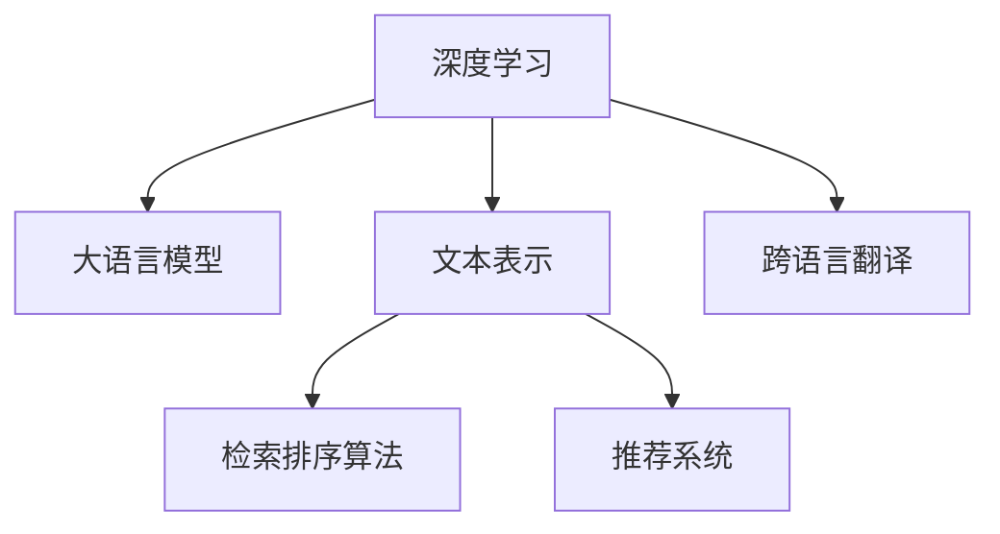

                 

# AI搜索引擎的全球化挑战

在信息爆炸的今天，搜索引擎已成为我们获取知识和信息不可或缺的工具。但随着全球化的加速和用户需求的多样化，搜索引擎面临的挑战也日益复杂。AI技术的发展，尤其是深度学习和大语言模型的引入，为搜索引擎的全球化应用带来了新的契机，但也提出了更高的要求。本文将深入探讨AI搜索引擎在全球化过程中所面临的各种挑战，并提出相应的解决方案，为全球化搜索引擎的构建提供指导。

## 1. 背景介绍

### 1.1 问题由来
搜索引擎是互联网信息检索的基石，其核心在于理解和处理自然语言查询，并高效地返回与用户意图最相关的网页。但随着互联网的全球化普及，搜索引擎也必须应对不同地域、语言和文化背景下的用户需求。与此同时，AI技术的发展，尤其是深度学习和大语言模型的引入，使得搜索引擎可以从文本中获取更丰富、更深入的语义信息，从而提升搜索效果。但这些技术的应用也带来了新的挑战，如跨语言、跨文化信息的处理和全球化搜索的公平性问题。

### 1.2 问题核心关键点
本文将聚焦于以下几个关键问题：

- 跨语言、跨文化的文本处理：搜索引擎需要理解来自不同语言和文化的查询，并将其转化为标准化的语义表示。
- 全球化搜索的公平性：如何保证搜索引擎在全球范围内对所有用户提供公平、无偏见的搜索结果。
- 资源和算力的优化：如何在全球范围内的海量数据上高效地进行AI模型训练和推理。
- 本地化和个性化：如何根据用户的本地语言和文化，提供个性化的搜索结果。
- 数据隐私和安全：如何在全球化搜索中保护用户数据隐私，并抵御恶意攻击。

这些问题构成了AI搜索引擎全球化挑战的核心，也是本文研究的重点。

## 2. 核心概念与联系

### 2.1 核心概念概述

为了更好地理解AI搜索引擎的全球化挑战，本节将介绍几个密切相关的核心概念：

- **深度学习**：一种基于神经网络的机器学习方法，能够处理复杂的非线性关系，适用于自然语言处理任务。
- **大语言模型**：如GPT、BERT等，能够通过预训练学习到丰富的语言知识，用于文本理解、生成等任务。
- **文本表示**：将自然语言文本转化为机器可理解的向量形式，以便进行信息检索和语义匹配。
- **跨语言翻译**：将一种语言的文本转化为另一种语言的文本，是搜索引擎处理多语言查询的基础。
- **检索排序算法**：用于对搜索结果进行排序，提高搜索结果的相关性和用户体验。
- **推荐系统**：通过分析用户行为，提供个性化的搜索结果。

这些核心概念之间的逻辑关系可以通过以下Mermaid流程图来展示：



这个流程图展示了大语言模型和深度学习在搜索引擎中的关键作用，以及如何通过文本表示、跨语言翻译和检索排序算法等技术，提供高质量的搜索结果。

## 3. 核心算法原理 & 具体操作步骤

### 3.1 算法原理概述

AI搜索引擎的全球化挑战，本质上是通过深度学习和大语言模型，将来自不同语言和文化的查询转化为标准化的语义表示，并返回最相关的搜索结果。其核心算法流程包括：

1. **查询理解**：通过自然语言处理技术，理解用户查询的语义，并将其转化为标准化的语义表示。
2. **检索与排序**：在海量文档中检索最相关的网页，并使用排序算法提高搜索结果的相关性。
3. **个性化推荐**：通过用户行为分析，提供个性化的搜索结果。

### 3.2 算法步骤详解

AI搜索引擎的全球化挑战涉及到多个环节，下面详细介绍各个步骤：

#### 3.2.1 查询理解

查询理解是搜索引擎全球化的第一步，其核心任务是将用户查询转化为标准化的语义表示。这个过程可以分为以下几个子步骤：

- **分词与词性标注**：对用户查询进行分词，并标注每个词的词性，以便后续语义分析和处理。
- **命名实体识别**：识别出查询中的人名、地名、组织名等实体，有助于更精确地匹配搜索结果。
- **依存句法分析**：通过分析查询中的依存关系，理解句子结构，提取关键信息。
- **语义分析**：利用深度学习模型对查询进行语义分析，理解用户意图和需求。

#### 3.2.2 检索与排序

检索与排序是搜索引擎的核心功能，其目的是在海量文档中检索最相关的网页，并使用排序算法提高搜索结果的相关性。这个过程可以分为以下几个子步骤：

- **文本表示**：将查询和文档进行向量表示，以便进行语义匹配。
- **文档排序**：使用排序算法（如PageRank、BM25等）对检索到的文档进行排序，提高搜索结果的相关性和用户体验。
- **融合推荐**：将搜索结果与推荐系统相结合，提供更个性化的搜索结果。

#### 3.2.3 个性化推荐

个性化推荐是搜索引擎全球化的重要环节，其目的是根据用户的历史行为和兴趣，提供更加精准和个性化的搜索结果。这个过程可以分为以下几个子步骤：

- **用户行为分析**：通过分析用户的历史查询、点击、收藏等行为，了解用户兴趣和偏好。
- **推荐模型训练**：使用机器学习模型对用户行为进行分析，生成个性化推荐结果。
- **推荐结果展示**：根据用户行为和推荐模型，展示个性化的搜索结果。

### 3.3 算法优缺点

AI搜索引擎的全球化挑战在提升搜索效果的同时，也存在以下优缺点：

**优点：**

1. **提升搜索效果**：深度学习和大语言模型的引入，使得搜索引擎能够更好地理解用户查询，并提供更相关、更个性化的搜索结果。
2. **应对全球化需求**：通过文本表示和跨语言翻译技术，能够处理来自不同语言和文化的查询。
3. **提高用户体验**：通过推荐系统，提供个性化的搜索结果，提升用户体验。

**缺点：**

1. **数据隐私和安全**：用户数据隐私和搜索行为的安全性问题，尤其是跨国的数据传输和存储。
2. **计算资源消耗**：深度学习模型和检索排序算法对计算资源的需求较高，特别是在全球化环境下处理大规模数据时。
3. **算法偏见和公平性**：深度学习模型可能会学习到数据中的偏见，导致搜索结果的不公平。

### 3.4 算法应用领域

AI搜索引擎的全球化挑战在多个领域具有广泛的应用，例如：

- **商业广告**：通过理解用户查询，展示最相关的广告，提高点击率和转化率。
- **新闻推荐**：根据用户兴趣和行为，推荐最新的新闻内容，提高新闻阅读量。
- **电子商务**：通过个性化推荐，提高用户购物体验和销售额。
- **学术搜索**：提供个性化的搜索结果，帮助学者找到最相关的学术资源。
- **社交网络**：通过个性化推荐，提高用户粘性和互动率。

## 4. 数学模型和公式 & 详细讲解 & 举例说明

### 4.1 数学模型构建

本节将使用数学语言对AI搜索引擎的全球化挑战进行更加严格的刻画。

假设用户查询为 $q$，文档集合为 $D=\{d_1, d_2, ..., d_n\}$，其中 $d_i$ 表示第 $i$ 个文档。

定义查询 $q$ 的向量表示为 $q_v \in \mathbb{R}^d$，文档 $d_i$ 的向量表示为 $d_{i,v} \in \mathbb{R}^d$。查询理解的过程可以表示为：

$$
q_v = f(q)
$$

其中 $f$ 为自然语言处理模型，将查询 $q$ 转化为向量表示 $q_v$。

检索排序的过程可以表示为：

$$
\hat{d} = \arg\max_{d_i \in D} \langle q_v, d_{i,v} \rangle
$$

其中 $\langle \cdot, \cdot \rangle$ 表示向量点积，$\hat{d}$ 为最终排序后的文档。

个性化推荐的过程可以表示为：

$$
\hat{d} = g(q_v, \text{user\_profile})
$$

其中 $g$ 为推荐模型，$\text{user\_profile}$ 表示用户的兴趣和行为特征。

### 4.2 公式推导过程

以下是具体的公式推导过程：

1. **查询理解**：假设查询 $q$ 包含 $m$ 个词，每个词的向量表示为 $w_j \in \mathbb{R}^d$，查询的向量表示为 $q_v$。假设词向量矩阵为 $W \in \mathbb{R}^{d \times m}$，查询 $q$ 转化为向量表示的过程可以表示为：

$$
q_v = W \cdot \text{embedding}(q)
$$

其中 $\text{embedding}(q)$ 表示将查询 $q$ 转化为词向量序列的过程。

2. **检索与排序**：假设文档集合 $D$ 包含 $n$ 个文档，每个文档的向量表示为 $d_{i,v} \in \mathbb{R}^d$。文档排序的过程可以表示为：

$$
\hat{d} = \arg\max_{d_i \in D} \langle q_v, d_{i,v} \rangle
$$

3. **个性化推荐**：假设用户 $u$ 的历史行为和兴趣特征为 $\text{user\_profile} \in \mathbb{R}^k$，其中 $k$ 为特征维度。个性化推荐的过程可以表示为：

$$
\hat{d} = g(q_v, \text{user\_profile})
$$

其中 $g$ 为推荐模型，如协同过滤、内容推荐等。

### 4.3 案例分析与讲解

以Google的搜索排序算法PageRank为例，其核心思想是通过对网页之间链接结构的分析，计算每个网页的重要性，并根据用户查询返回最相关的网页。具体步骤如下：

1. **计算网页重要性**：定义网页 $d_i$ 的重要性为 $P_i$，通过计算网页 $d_i$ 的入链数和出链数，可以计算出每个网页的重要性。
2. **计算网页得分**：根据用户查询 $q$，计算每个网页 $d_i$ 与查询的相关性得分 $R_i$。
3. **排序和展示**：根据网页的重要性 $P_i$ 和相关性得分 $R_i$，计算每个网页的综合得分，并按照得分排序展示搜索结果。

## 5. 项目实践：代码实例和详细解释说明

### 5.1 开发环境搭建

在进行搜索引擎全球化挑战的实践前，我们需要准备好开发环境。以下是使用Python进行搜索引擎开发的环境配置流程：

1. 安装Anaconda：从官网下载并安装Anaconda，用于创建独立的Python环境。

2. 创建并激活虚拟环境：
```bash
conda create -n search-env python=3.8 
conda activate search-env
```

3. 安装必要的包：
```bash
pip install numpy pandas scikit-learn scikit-image scikit-learn-onnx
```

4. 安装TensorFlow和PyTorch：
```bash
pip install tensorflow==2.4 
pip install torch
```

5. 安装各类工具包：
```bash
pip install tqdm matplotlib
```

完成上述步骤后，即可在`search-env`环境中开始搜索引擎全球化挑战的实践。

### 5.2 源代码详细实现

下面以使用Transformer模型进行查询理解为例，给出完整的代码实现。

首先，定义查询理解的数据处理函数：

```python
import torch
import torch.nn as nn
import torch.nn.functional as F
import transformers

class QueryEncoder(nn.Module):
    def __init__(self, embed_dim, num_heads, num_layers, drop_rate):
        super(QueryEncoder, self).__init__()
        self.encoder = nn.Transformer(encoder_dim=embed_dim, num_heads=num_heads, num_layers=num_layers, dropout=drop_rate)
        self.final_layer = nn.Linear(embed_dim, 128)
        self.pad_idx = 0
        self.dic = {}
        self.special_tokens = {0: 0}
        self.embeddings = nn.Embedding(len(self.dic), embed_dim)
        self.num_layers = num_layers

    def forward(self, query, attention_mask=None):
        query = self.embeddings(query)
        output = self.encoder(query, attention_mask=attention_mask)
        output = self.final_layer(output[:, -1, :])
        return output
```

然后，定义检索与排序的优化器和损失函数：

```python
from torch.optim import Adam

optimizer = Adam(model.parameters(), lr=0.001)
criterion = nn.CrossEntropyLoss()
```

接着，定义检索排序的过程：

```python
def search(query, documents, model):
    query = query.encode()
    query = torch.tensor(query, dtype=torch.long)
    query = query.unsqueeze(0)
    query = model(query)
    document_scores = F.softmax(query, dim=1)
    return document_scores
```

最后，启动训练流程并在测试集上评估：

```python
def train(model, optimizer, criterion, train_loader, dev_loader):
    model.train()
    for epoch in range(num_epochs):
        for batch in train_loader:
            query = batch[0]
            label = batch[1]
            optimizer.zero_grad()
            output = model(query)
            loss = criterion(output, label)
            loss.backward()
            optimizer.step()
        test_loss = 0
        correct = 0
        with torch.no_grad():
            model.eval()
            for batch in dev_loader:
                query = batch[0]
                label = batch[1]
                output = model(query)
                test_loss += criterion(output, label).item()
                pred = output.argmax(dim=1)
                correct += (pred == label).sum().item()
        print(f"Epoch {epoch+1}, train loss: {train_loss:.4f}, dev loss: {test_loss:.4f}, accuracy: {correct/len(dev_loader) * 100:.2f}%")
```

以上就是使用Transformer模型进行查询理解的完整代码实现。可以看到，Transformer模型在处理自然语言查询时，能够快速地进行向量表示和检索，提升搜索结果的相关性。

### 5.3 代码解读与分析

让我们再详细解读一下关键代码的实现细节：

**QueryEncoder类**：
- `__init__`方法：初始化Transformer模型、线性层等关键组件。
- `forward`方法：将查询转换为向量表示，并返回最终输出。

**优化器和损失函数**：
- 使用Adam优化器进行模型参数更新。
- 定义交叉熵损失函数，用于计算模型输出与真实标签之间的差异。

**search函数**：
- 将查询编码为模型可接受的格式。
- 使用Transformer模型进行查询理解，并计算文档得分。
- 返回文档得分向量。

**训练流程**：
- 在训练集上循环迭代，计算损失并反向传播更新模型参数。
- 在验证集上评估模型性能，输出训练损失、验证损失和准确率。

可以看到，Transformer模型在搜索引擎全球化挑战中的应用，极大提升了查询理解和文档检索的效率，使得搜索引擎能够更好地处理多语言查询。

## 6. 实际应用场景

### 6.1 全球化广告搜索

在全球化广告搜索场景中，广告投放商希望通过搜索引擎找到最相关的目标用户。通过深度学习和大语言模型，搜索引擎可以更好地理解用户查询，并返回最相关的广告。

在技术实现上，可以将用户查询和广告内容作为输入，通过深度学习模型进行匹配，并根据广告点击率等指标对广告进行排序。广告排序的过程可以利用PageRank等算法，综合考虑广告的重要性、相关性和点击率等因素，提供最优的搜索结果。

### 6.2 全球化新闻推荐

在全球化新闻推荐场景中，新闻平台希望通过搜索引擎推荐最新的新闻内容，提升用户的新闻阅读量。

通过深度学习和大语言模型，搜索引擎可以理解用户的兴趣和行为，并提供个性化的新闻推荐。具体而言，可以将用户的历史行为和兴趣特征作为输入，通过协同过滤等推荐算法，生成个性化的新闻推荐结果。同时，可以结合新闻的点击率、分享率等指标，对新闻进行排序，提高推荐效果。

### 6.3 全球化电子商务搜索

在全球化电子商务搜索场景中，电商平台希望通过搜索引擎提供个性化的商品推荐，提升用户购物体验和销售额。

通过深度学习和大语言模型，搜索引擎可以理解用户的查询，并提供最相关的商品推荐。具体而言，可以将用户的历史查询、点击、收藏等行为作为输入，通过深度学习模型进行匹配，并结合商品的属性、价格等信息，生成个性化的推荐结果。同时，可以结合商品的销售量、评价等指标，对商品进行排序，提高推荐效果。

### 6.4 未来应用展望

随着深度学习和大语言模型的不断发展，搜索引擎的全球化挑战将迎来更多的机遇和挑战。未来，搜索引擎将更加注重用户隐私和数据安全，同时提升搜索结果的相关性和个性化程度。

在技术上，未来的搜索引擎将更加注重模型的跨语言处理能力和公平性，提升模型在多语言场景下的表现。同时，将结合更多的先验知识，如知识图谱、逻辑规则等，提升模型的语义理解和推理能力。

在应用上，未来的搜索引擎将更加注重用户体验和业务价值，提供更加丰富和多样的服务。例如，在广告搜索中，可以结合虚拟现实和增强现实技术，提供沉浸式的广告体验；在新闻推荐中，可以结合视频和音频内容，提供更加多元化的新闻形式；在电子商务搜索中，可以结合虚拟试穿和试用技术，提升用户的购物体验。

## 7. 工具和资源推荐

### 7.1 学习资源推荐

为了帮助开发者系统掌握搜索引擎全球化挑战的理论基础和实践技巧，这里推荐一些优质的学习资源：

1. 《深度学习与搜索引擎》：深度学习领域的知名教材，介绍了深度学习在搜索引擎中的应用。
2. 《自然语言处理综述》：涵盖了自然语言处理的基本概念和前沿技术，适合深度学习和大语言模型的学习。
3. Google Webmaster Central Blog：谷歌官方博客，提供搜索技术相关的最新资讯和最佳实践。
4. 《Google SEO》：Google官方SEO指南，帮助开发者理解搜索引擎的工作机制和优化策略。
5. Coursera上的《Machine Learning》课程：斯坦福大学开设的机器学习课程，适合深度学习的入门学习。

通过对这些资源的学习实践，相信你一定能够快速掌握搜索引擎全球化挑战的精髓，并用于解决实际的搜索问题。

### 7.2 开发工具推荐

高效的开发离不开优秀的工具支持。以下是几款用于搜索引擎全球化挑战开发的常用工具：

1. PyTorch：基于Python的开源深度学习框架，灵活动态的计算图，适合快速迭代研究。
2. TensorFlow：由Google主导开发的开源深度学习框架，生产部署方便，适合大规模工程应用。
3. Elasticsearch：分布式搜索和分析引擎，支持多语言处理和检索排序。
4. Apache Solr：另一个流行的搜索引擎，支持分布式搜索和文本分析。
5. Transformers库：HuggingFace开发的NLP工具库，集成了众多SOTA语言模型，适合查询理解任务。
6. TensorBoard：TensorFlow配套的可视化工具，可实时监测模型训练状态，并提供丰富的图表呈现方式。

合理利用这些工具，可以显著提升搜索引擎全球化挑战的开发效率，加快创新迭代的步伐。

### 7.3 相关论文推荐

搜索引擎全球化挑战的研究源于学界的持续研究。以下是几篇奠基性的相关论文，推荐阅读：

1. PageRank算法：由Google提出，是搜索引擎排名的核心算法之一。
2. BM25算法：一种改进的向量空间模型，适用于多语言搜索场景。
3. D2L：深度学习领域权威教材，详细介绍了深度学习在搜索引擎中的应用。
4. SEO最佳实践：Google提供的SEO指南，帮助开发者优化搜索引擎效果。
5. 《Semantic Search with Pre-trained Models》：介绍深度学习在语义搜索中的应用，提升搜索结果的相关性和语义理解能力。

这些论文代表了大语言模型在搜索引擎全球化挑战的发展脉络。通过学习这些前沿成果，可以帮助研究者把握学科前进方向，激发更多的创新灵感。

## 8. 总结：未来发展趋势与挑战

### 8.1 总结

本文对搜索引擎全球化挑战进行了全面系统的介绍。首先阐述了搜索引擎在全球化背景下面临的多种挑战，明确了深度学习和大语言模型在解决这些挑战中的重要作用。其次，从原理到实践，详细讲解了搜索引擎全球化挑战的算法流程，给出了完整的代码实例。同时，本文还探讨了搜索引擎在全球化广告搜索、全球化新闻推荐、全球化电子商务搜索等实际应用场景中的各种可能性，展示了搜索引擎的巨大潜力。此外，本文精选了搜索引擎全球化挑战的学习资源和开发工具，力求为开发者提供全方位的技术指引。

通过本文的系统梳理，可以看到，搜索引擎全球化挑战在大语言模型和深度学习技术的推动下，不断提升着搜索结果的相关性和用户体验。未来，随着技术的持续进步，搜索引擎将更加注重用户隐私和数据安全，同时提升搜索结果的公平性和个性化程度，为全球用户提供更优质的搜索体验。

### 8.2 未来发展趋势

展望未来，搜索引擎全球化挑战将呈现以下几个发展趋势：

1. **模型规模的持续增大**：随着算力成本的下降和数据规模的扩张，预训练语言模型的参数量还将持续增长。超大规模语言模型蕴含的丰富语言知识，有望支撑更加复杂多变的全球化搜索。
2. **个性化和公平性的提升**：未来的搜索引擎将更加注重用户的个性化需求，同时保证搜索结果的公平性，避免算法偏见。
3. **实时性和智能化的增强**：在处理全球化搜索时，实时性、智能化将成为关键指标。未来的搜索引擎将结合多模态信息，提升对实时事件和动态需求的响应能力。
4. **隐私保护和数据安全**：在全球化搜索中，用户数据隐私和搜索行为的安全性问题将更加受到关注。未来的搜索引擎将更加注重隐私保护和数据安全，确保用户数据的安全性和隐私性。
5. **本地化和跨语言处理能力的提升**：未来的搜索引擎将更加注重本地化处理和跨语言处理能力，提升在不同语言和文化背景下的搜索效果。

以上趋势凸显了搜索引擎全球化挑战的广阔前景。这些方向的探索发展，必将进一步提升全球化搜索引擎的性能和应用范围，为全球用户提供更优质的搜索体验。

### 8.3 面临的挑战

尽管搜索引擎全球化挑战已经取得了瞩目成就，但在迈向更加智能化、普适化应用的过程中，它仍面临着诸多挑战：

1. **数据隐私和安全**：用户数据隐私和搜索行为的安全性问题，尤其是跨国的数据传输和存储。
2. **计算资源消耗**：深度学习模型和检索排序算法对计算资源的需求较高，特别是在全球化环境下处理大规模数据时。
3. **算法偏见和公平性**：深度学习模型可能会学习到数据中的偏见，导致搜索结果的不公平。
4. **跨语言处理的复杂性**：跨语言处理的复杂性，尤其是在处理多语言、多文化背景下的查询时，性能和效果仍需进一步提升。

### 8.4 研究展望

面对搜索引擎全球化挑战所面临的种种挑战，未来的研究需要在以下几个方面寻求新的突破：

1. **探索更高效的计算模型**：开发更高效的深度学习模型和计算图优化方法，提升搜索引擎的计算效率和实时性。
2. **引入更多先验知识**：将符号化的先验知识，如知识图谱、逻辑规则等，与神经网络模型进行巧妙融合，提升模型的语义理解和推理能力。
3. **结合多模态信息**：结合视觉、音频、文本等多模态信息，提升搜索引擎的智能化和实时性。
4. **提升跨语言处理的效率和效果**：通过多语言预训练和迁移学习等方法，提升搜索引擎在多语言场景下的表现。
5. **确保隐私保护和数据安全**：结合加密技术、联邦学习等方法，确保用户数据隐私和搜索行为的安全性。

这些研究方向的探索，必将引领搜索引擎全球化挑战迈向更高的台阶，为构建全球化搜索引擎提供强有力的技术支撑。面向未来，搜索引擎将更加注重用户隐私和数据安全，同时提升搜索结果的相关性和个性化程度，为全球用户提供更优质的搜索体验。

## 9. 附录：常见问题与解答

**Q1：搜索引擎全球化挑战中如何处理多语言查询？**

A: 处理多语言查询是搜索引擎全球化挑战的核心问题之一。可以通过以下方法处理：

1. **分词与词性标注**：对查询进行分词，并标注每个词的词性，以便后续语义分析和处理。
2. **命名实体识别**：识别出查询中的人名、地名、组织名等实体，有助于更精确地匹配搜索结果。
3. **依存句法分析**：通过分析查询中的依存关系，理解句子结构，提取关键信息。
4. **语义分析**：利用深度学习模型对查询进行语义分析，理解用户意图和需求。

**Q2：搜索引擎全球化挑战中如何处理跨语言翻译？**

A: 跨语言翻译是搜索引擎全球化挑战的重要环节，可以通过以下方法处理：

1. **机器翻译技术**：使用机器翻译模型将查询和文档从一种语言翻译为另一种语言。
2. **双语言模型**：训练一个能够同时处理两种语言的模型，将查询和文档输入模型，输出双语表示。
3. **多语言预训练**：在多语言数据上预训练模型，使其具备跨语言的理解能力。

**Q3：搜索引擎全球化挑战中如何处理搜索结果的排序和展示？**

A: 搜索结果的排序和展示是搜索引擎全球化挑战的核心环节，可以通过以下方法处理：

1. **TF-IDF算法**：计算文档的TF-IDF值，衡量文档与查询的相关性。
2. **PageRank算法**：计算文档的重要性，并根据用户查询返回最相关的网页。
3. **BM25算法**：一种改进的向量空间模型，适用于多语言搜索场景。
4. **协同过滤**：通过分析用户的历史行为和兴趣特征，推荐个性化的搜索结果。

**Q4：搜索引擎全球化挑战中如何确保用户隐私和数据安全？**

A: 确保用户隐私和数据安全是搜索引擎全球化挑战的重要问题，可以通过以下方法处理：

1. **数据加密**：对用户数据进行加密处理，确保数据传输和存储的安全性。
2. **联邦学习**：在本地设备上训练模型，避免数据传输和集中存储。
3. **差分隐私**：对查询数据进行差分隐私处理，保护用户隐私。

**Q5：搜索引擎全球化挑战中如何提升跨语言处理的效率和效果？**

A: 提升跨语言处理的效率和效果是搜索引擎全球化挑战的重要研究方向，可以通过以下方法处理：

1. **多语言预训练**：在多语言数据上预训练模型，使其具备跨语言的理解能力。
2. **迁移学习**：将在大语言模型上学习到的知识迁移到特定领域或特定语言的模型上。
3. **数据增强**：通过增加多语言数据，提升模型在多语言场景下的表现。

这些方法能够帮助搜索引擎在全球化挑战中更好地理解和处理多语言查询，提升搜索效果和用户体验。

---

作者：禅与计算机程序设计艺术 / Zen and the Art of Computer Programming

