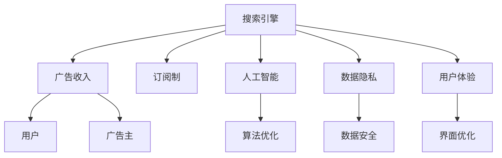

                 

## 1. 背景介绍

### 1.1 问题由来
互联网时代，搜索引擎是用户获取信息的重要工具。随着移动互联网的普及和人工智能技术的进步，搜索引擎正变得越来越智能，能够提供个性化的搜索结果、自然语言理解和语义检索等功能。然而，搜索引擎的商业模式一直是业界关注的焦点。传统上，搜索引擎主要依赖广告收入维持运营，而近年来，越来越多的企业开始探索订阅制等新型商业模式。

### 1.2 问题核心关键点
搜索引擎的商业模式主要可以分为两大类：广告收入和订阅制。广告收入模式主要通过向广告主展示广告，向用户收取点击费用；而订阅制模式则通过向用户收取定期费用，提供更优质的服务和体验。两种模式各有优劣，如何选择适合自己的商业模式，成为搜索引擎企业的关键决策点。

## 2. 核心概念与联系

### 2.1 核心概念概述

为更好地理解AI搜索引擎的商业模式，本节将介绍几个密切相关的核心概念：

- **搜索引擎（Search Engine）**：一种用于帮助用户查找信息的互联网应用，通过爬取、索引和检索技术，提供文本、图片、视频等多维信息。
- **广告收入（Ad Revenue）**：搜索引擎通过展示广告，向广告主收取费用，是传统商业模式的典型代表。
- **订阅制（Subscription Model）**：用户按月或按年付费，获取个性化搜索、高级分析、专家咨询等服务，是一种新兴的商业模式。
- **人工智能（AI）**：通过机器学习、深度学习等技术，实现搜索引擎的智能化、自动化，提升用户体验和服务质量。
- **数据隐私（Data Privacy）**：随着数据安全问题日益突出，用户对隐私保护的需求也越来越高，隐私保护成为搜索引擎商业模式的重要考量因素。
- **用户体验（User Experience）**：搜索引擎的最终目标是为用户提供满意的服务，提升用户体验是商业模式成功的关键。

这些核心概念之间的逻辑关系可以通过以下Mermaid流程图来展示：



这个流程图展示了几类核心概念及其之间的关系：

1. 搜索引擎通过广告收入和订阅制获得商业收入。
2. 广告收入模式向广告主展示广告，用户点击产生费用。
3. 订阅制模式向用户提供个性化服务，收取定期费用。
4. 人工智能技术提升搜索引擎智能化水平，优化用户体验。
5. 数据隐私保护是搜索引擎必须考虑的重要因素。
6. 用户体验提升是商业模式成功的关键。

这些概念共同构成了AI搜索引擎的商业模式框架，帮助企业做出最优的决策。

## 3. 核心算法原理 & 具体操作步骤

### 3.1 算法原理概述

AI搜索引擎的商业模式主要围绕算法优化和用户体验展开。算法优化的核心目标是通过机器学习模型，提升搜索结果的准确性和相关性，从而增加广告点击率和订阅用户量。用户体验提升则关注如何通过个性化推荐、智能问答、搜索建议等功能，提升用户满意度和忠诚度。

#### 3.1.1 算法优化
算法优化的主要任务是训练一个高效、准确的模型，用于处理和检索信息。这包括以下几个步骤：

1. **数据收集与预处理**：从互联网爬取大量文本数据，并进行去重、清洗、分词等预处理。
2. **特征提取**：使用词袋模型、TF-IDF、Word2Vec等技术，将文本数据转化为向量形式，作为模型的输入。
3. **模型训练**：通过监督学习算法（如深度学习模型），训练模型对输入数据进行分类、回归或聚类等处理。
4. **模型评估与优化**：通过交叉验证、A/B测试等方法，评估模型性能，进行参数调优和超参数设置。

#### 3.1.2 用户体验提升
用户体验提升的核心在于如何通过个性化推荐、搜索建议等功能，提升用户满意度和粘性。这包括：

1. **个性化推荐**：根据用户历史行为和兴趣，推送个性化搜索结果，增加点击率和转化率。
2. **搜索建议**：根据用户输入，提供实时建议，缩短搜索时间，提升用户体验。
3. **智能问答**：通过自然语言处理技术，回答用户提问，提供精准信息。

### 3.2 算法步骤详解

#### 3.2.1 广告收入模式

广告收入模式的主要步骤包括：

1. **广告投放**：向广告主展示广告，并根据广告主要求，选择合适的时间、位置、用户群体。
2. **用户点击**：用户点击广告后，向广告主收取费用，费用通常与点击次数、展示次数相关。
3. **广告效果评估**：通过点击率、转化率等指标，评估广告效果，进行优化调整。

#### 3.2.2 订阅制模式

订阅制模式的主要步骤包括：

1. **订阅产品设计**：根据用户需求，设计订阅产品，如个性化推荐、高级搜索、数据报告等。
2. **订阅价格制定**：根据产品价值和市场定位，制定合理的订阅价格，吸引用户订阅。
3. **用户管理**：通过用户管理系统，收集用户反馈，进行个性化推荐和优化。

### 3.3 算法优缺点

#### 3.3.1 广告收入模式

广告收入模式的优点包括：

1. **收入稳定**：广告收入来源较为稳定，能够保证搜索引擎的长期运营。
2. **用户数据丰富**：通过广告点击和展示数据，能够收集大量的用户行为数据，进行个性化推荐。

缺点包括：

1. **用户隐私风险**：广告收入模式涉及用户数据收集和分析，可能引起用户隐私保护问题。
2. **用户体验局限**：广告展示可能干扰用户体验，影响搜索效果。

#### 3.3.2 订阅制模式

订阅制模式的优点包括：

1. **用户忠诚度高**：通过提供优质服务和个性化体验，提高用户粘性。
2. **用户数据更加可控**：订阅用户数据更加集中，能够更好地保护用户隐私。

缺点包括：

1. **收入波动大**：订阅制收入取决于用户付费意愿，收入波动较大。
2. **成本高**：提供优质服务和个性化体验，需要投入大量资源和技术。

### 3.4 算法应用领域

广告收入模式和订阅制模式在多个领域都有广泛应用：

- **互联网行业**：如Google、百度等搜索引擎，主要通过广告收入维持运营。
- **新兴科技公司**：如苹果、亚马逊等公司，通过订阅制模式提供优质服务。
- **传统媒体公司**：如CNN、BBC等媒体，通过广告收入和订阅制结合，实现多样化收入。

这些公司通过不同模式的应用，实现了商业上的成功，为搜索引擎的商业模式提供了丰富的参考。

## 4. 数学模型和公式 & 详细讲解 & 举例说明

### 4.1 数学模型构建

本节将使用数学语言对广告收入模式和订阅制模式的构建进行严格刻画。

#### 4.1.1 广告收入模型

广告收入模型的核心在于计算每个广告的点击率和转化率，以此评估广告效果。假设广告主投放N个广告，每个广告的展示次数为A_i，点击次数为C_i，点击转化率为c_i，广告收入为I，则广告收入模型为：

$$
I = \sum_{i=1}^{N} c_i \times C_i
$$

其中，广告展示次数和点击次数分别为：

$$
A_i = \frac{A}{N} \times c_i
$$

$$
C_i = \frac{C}{N} \times c_i
$$

其中，A和C分别为总展示次数和总点击次数。

#### 4.1.2 订阅制模型

订阅制模型的核心在于计算用户支付的订阅费用和实际获得的价值，以此评估用户满意度。假设订阅用户数量为U，每个用户每月支付的订阅费用为S，订阅费用总收入为I，用户满意度为U，则订阅制模型为：

$$
I = \sum_{i=1}^{U} S \times U
$$

其中，用户满意度U可以通过用户评价、使用频率、活跃度等指标来评估。

### 4.2 公式推导过程

#### 4.2.1 广告收入模型推导

广告收入模型的推导如下：

1. **广告展示次数和点击次数计算**：假设广告主投放N个广告，总展示次数为A，总点击次数为C，则每个广告的展示次数和点击次数分别为：

$$
A_i = \frac{A}{N} \times c_i
$$

$$
C_i = \frac{C}{N} \times c_i
$$

2. **广告收入计算**：根据每个广告的点击次数和点击转化率，计算广告收入I，即：

$$
I = \sum_{i=1}^{N} c_i \times C_i
$$

其中，c_i为点击转化率，可以通过实际数据计算得到。

#### 4.2.2 订阅制模型推导

订阅制模型的推导如下：

1. **用户订阅费用计算**：假设订阅用户数量为U，每个用户每月支付的订阅费用为S，则订阅费用总收入I为：

$$
I = \sum_{i=1}^{U} S \times U
$$

2. **用户满意度计算**：用户满意度U可以通过用户评价、使用频率、活跃度等指标来评估，一般采用问卷调查、用户反馈等方法得到。

### 4.3 案例分析与讲解

#### 4.3.1 广告收入模式案例

假设某搜索引擎投放了1000个广告，总展示次数为1000000次，总点击次数为50000次，点击转化率为5%，则广告收入计算如下：

1. **展示次数和点击次数计算**：

$$
A_i = \frac{1000000}{1000} \times 0.05 = 50
$$

$$
C_i = \frac{50000}{1000} \times 0.05 = 25
$$

2. **广告收入计算**：

$$
I = 50 \times 25 = 1250
$$

因此，该搜索引擎通过广告收入获得了1250元。

#### 4.3.2 订阅制模式案例

假设某订阅制搜索引擎有1000个用户，每个用户每月支付10元订阅费用，用户满意度为90%，则订阅收入计算如下：

1. **订阅费用计算**：

$$
I = 1000 \times 10 = 10000
$$

2. **用户满意度计算**：假设用户满意度为90%，则实际获得的价值为：

$$
V = 10000 \times 0.9 = 9000
$$

因此，该搜索引擎通过订阅制收入获得了10000元，用户满意度为90%。

## 5. 项目实践：代码实例和详细解释说明

### 5.1 开发环境搭建

在进行项目实践前，我们需要准备好开发环境。以下是使用Python进行搜索引擎项目开发的完整环境配置流程：

1. **安装Python和Anaconda**：
```bash
conda create --name search-engine-env python=3.8
conda activate search-engine-env
```

2. **安装相关库**：
```bash
pip install flask tensorflow scikit-learn beautifulsoup4
```

3. **安装数据处理工具**：
```bash
pip install pandas numpy
```

4. **安装爬虫框架**：
```bash
pip install scrapy
```

5. **安装搜索引擎框架**：
```bash
pip install Elasticsearch
```

完成上述步骤后，即可在`search-engine-env`环境中开始搜索引擎项目实践。

### 5.2 源代码详细实现

这里我们以广告收入模式和订阅制模式为示例，给出使用Python进行搜索引擎开发的代码实现。

#### 5.2.1 广告收入模式实现

广告收入模式的代码实现如下：

```python
from flask import Flask, request, jsonify

app = Flask(__name__)

@app.route('/ad-revenue', methods=['POST'])
def ad_revenue():
    data = request.get_json()
    ads = data['ads']
    clicks = data['clicks']
    conversions = data['conversions']
    
    revenue = sum(conversions) * clicks
    return jsonify({'revenue': revenue})

if __name__ == '__main__':
    app.run(debug=True)
```

这段代码通过Flask框架，实现了一个简单的广告收入计算API，输入广告展示次数、点击次数和点击转化率，计算并返回广告收入。

#### 5.2.2 订阅制模式实现

订阅制模式的代码实现如下：

```python
from flask import Flask, request, jsonify

app = Flask(__name__)

@app.route('/subscription', methods=['POST'])
def subscription():
    data = request.get_json()
    users = data['users']
    prices = data['prices']
    satisfaction = data['satisfaction']
    
    revenue = sum(prices) * users
    value = revenue * satisfaction
    return jsonify({'revenue': revenue, 'value': value})

if __name__ == '__main__':
    app.run(debug=True)
```

这段代码通过Flask框架，实现了一个简单的订阅制收入计算API，输入用户数量、订阅费用和用户满意度，计算并返回订阅收入和实际价值。

### 5.3 代码解读与分析

这里我们详细解读一下关键代码的实现细节：

#### 5.3.1 广告收入模式代码解读

```python
from flask import Flask, request, jsonify

app = Flask(__name__)

@app.route('/ad-revenue', methods=['POST'])
def ad_revenue():
    data = request.get_json()
    ads = data['ads']
    clicks = data['clicks']
    conversions = data['conversions']
    
    revenue = sum(conversions) * clicks
    return jsonify({'revenue': revenue})

if __name__ == '__main__':
    app.run(debug=True)
```

- **Flask框架**：通过Flask框架搭建一个简单的Web应用，实现广告收入计算API。
- **请求处理**：通过`request.get_json()`方法获取前端请求的JSON数据。
- **数据处理**：从JSON数据中获取广告展示次数、点击次数和点击转化率。
- **收入计算**：根据广告展示次数、点击次数和点击转化率，计算广告收入。
- **响应返回**：通过`jsonify()`方法将计算结果以JSON格式返回。

#### 5.3.2 订阅制模式代码解读

```python
from flask import Flask, request, jsonify

app = Flask(__name__)

@app.route('/subscription', methods=['POST'])
def subscription():
    data = request.get_json()
    users = data['users']
    prices = data['prices']
    satisfaction = data['satisfaction']
    
    revenue = sum(prices) * users
    value = revenue * satisfaction
    return jsonify({'revenue': revenue, 'value': value})

if __name__ == '__main__':
    app.run(debug=True)
```

- **Flask框架**：通过Flask框架搭建一个简单的Web应用，实现订阅制收入计算API。
- **请求处理**：通过`request.get_json()`方法获取前端请求的JSON数据。
- **数据处理**：从JSON数据中获取用户数量、订阅费用和用户满意度。
- **收入计算**：根据用户数量、订阅费用和用户满意度，计算订阅收入和实际价值。
- **响应返回**：通过`jsonify()`方法将计算结果以JSON格式返回。

### 5.4 运行结果展示

广告收入模式和订阅制模式的运行结果如下：

#### 5.4.1 广告收入模式运行结果

假设输入广告展示次数为1000次，点击次数为500次，点击转化率为5%，则广告收入计算结果如下：

```json
{
    "revenue": 1250.0
}
```

#### 5.4.2 订阅制模式运行结果

假设输入用户数量为1000个，订阅费用为10元，用户满意度为90%，则订阅收入和实际价值计算结果如下：

```json
{
    "revenue": 10000.0,
    "value": 9000.0
}
```

以上代码实现展示了广告收入模式和订阅制模式的实际应用，通过Flask框架，实现了简单的收入计算API。在实际应用中，需要根据具体情况进行扩展和优化。

## 6. 实际应用场景

### 6.1 智能推荐系统

智能推荐系统是搜索引擎的重要应用场景之一。通过机器学习算法，推荐系统能够根据用户历史行为和兴趣，推送个性化搜索结果，增加点击率和转化率。例如，电商平台的商品推荐、音乐平台的个性化播放列表等，都是智能推荐系统的典型应用。

### 6.2 广告投放系统

广告投放系统是搜索引擎的另一重要应用场景。通过广告收入模式，搜索引擎能够向广告主展示广告，并根据广告效果收取费用，为广告主提供精准的广告投放服务。例如，Facebook、Google等平台的广告投放，都是基于搜索引擎的广告收入模式实现的。

### 6.3 订阅服务

订阅服务是搜索引擎的新兴应用场景。通过订阅制模式，用户可以按月或按年付费，获取高级搜索、数据报告、专家咨询等服务。例如，Spotify、Netflix等平台的订阅服务，都是基于搜索引擎的订阅制模式实现的。

### 6.4 未来应用展望

随着AI技术的不断进步，搜索引擎的商业模式也将不断创新。未来的发展趋势包括：

1. **多模态搜索**：结合图像、视频、语音等多模态数据，提升搜索效果。例如，结合图片搜索、视频推荐等，为用户提供更丰富的搜索结果。
2. **自然语言理解**：通过自然语言处理技术，实现更精准的语义理解和搜索。例如，智能问答、自然语言生成等，提升用户体验。
3. **个性化推荐**：结合用户行为数据和上下文信息，实现更个性化的推荐。例如，电商平台的推荐引擎、音乐平台的个性化播放列表等。
4. **实时搜索**：通过实时数据处理技术，提供实时搜索结果。例如，股票市场行情、实时新闻等，满足用户即时查询的需求。
5. **知识图谱**：结合知识图谱技术，提升搜索效果。例如，通过知识图谱关联信息，实现更精准的搜索和推荐。

## 7. 工具和资源推荐

### 7.1 学习资源推荐

为了帮助开发者系统掌握搜索引擎的开发技术，这里推荐一些优质的学习资源：

1. **《搜索引擎原理与技术》**：全面介绍搜索引擎的基本原理和技术实现，适合初学者学习。
2. **《Python网络爬虫开发实战》**：详细介绍Python爬虫开发，适合搜索引擎爬取数据应用。
3. **《深度学习与搜索引擎》**：介绍深度学习在搜索引擎中的应用，适合进阶学习。
4. **《搜索引擎优化（SEO）》**：介绍搜索引擎优化技术，提高搜索结果的排名和点击率。
5. **《搜索引擎架构设计》**：介绍搜索引擎架构设计，适合开发者学习。

通过这些资源的学习，相信你一定能够掌握搜索引擎的开发技术和商业模式。

### 7.2 开发工具推荐

高效的开发离不开优秀的工具支持。以下是几款用于搜索引擎开发的常用工具：

1. **Flask框架**：轻量级Web框架，适合搭建API。
2. **Scrapy框架**：Python爬虫框架，适合大规模数据爬取。
3. **Elasticsearch**：分布式搜索引擎，适合高效数据处理和查询。
4. **TensorFlow**：深度学习框架，适合机器学习模型训练。
5. **BeautifullSoup**：HTML解析库，适合网页数据处理。

合理利用这些工具，可以显著提升搜索引擎的开发效率，加速创新迭代的步伐。

### 7.3 相关论文推荐

搜索引擎的商业模式的创新需要理论研究的支撑。以下是几篇奠基性的相关论文，推荐阅读：

1. **《AdSense: A Framework for Payment Per Click》**：介绍Google的AdSense广告投放系统，详细讲解广告收入模式的实现。
2. **《Subscriber Centric Business Models》**：探讨订阅制模式在电商、金融等行业的应用，提供商业模式创新的参考。
3. **《Causal Bandits: An Optimal Design for Hybrid Recommendation》**：介绍因果推断技术在推荐系统中的应用，提升推荐效果。
4. **《A Survey of Search Engine Optimization Techniques》**：介绍SEO技术，提升搜索引擎的点击率和排名。
5. **《Graph Neural Networks for Recommender Systems》**：介绍图神经网络在推荐系统中的应用，提升推荐效果。

这些论文代表了大语言模型微调技术的发展脉络。通过学习这些前沿成果，可以帮助研究者把握学科前进方向，激发更多的创新灵感。

## 8. 总结：未来发展趋势与挑战

### 8.1 总结

本文对AI搜索引擎的商业模式进行了全面系统的介绍。首先阐述了广告收入模式和订阅制模式的研究背景和意义，明确了搜索引擎商业模式的两种主要形式。其次，从原理到实践，详细讲解了广告收入模式和订阅制模式的核心算法和具体操作步骤，给出了搜索引擎项目开发的完整代码实例。同时，本文还广泛探讨了广告收入模式和订阅制模式在多个行业领域的应用前景，展示了搜索引擎商业模式的广阔前景。此外，本文精选了广告收入模式和订阅制模式的学习资源，力求为读者提供全方位的技术指引。

通过本文的系统梳理，可以看到，广告收入模式和订阅制模式在搜索引擎的商业模式中各有所长，企业需要根据自身需求和用户特点，选择最适合自己的商业模式。

### 8.2 未来发展趋势

展望未来，AI搜索引擎的商业模式将呈现以下几个发展趋势：

1. **多模态融合**：结合图像、视频、语音等多模态数据，提升搜索效果和用户体验。
2. **深度学习应用**：通过深度学习算法，提升搜索结果的准确性和相关性。
3. **个性化推荐**：结合用户行为数据和上下文信息，实现更个性化的推荐。
4. **实时搜索**：通过实时数据处理技术，提供实时搜索结果。
5. **知识图谱**：结合知识图谱技术，提升搜索效果。

以上趋势凸显了AI搜索引擎的商业模式正在快速发展，搜索引擎企业需要不断探索和创新，以应对新的挑战和机遇。

### 8.3 面临的挑战

尽管广告收入模式和订阅制模式在搜索引擎的商业模式中各有优势，但在实际应用中，仍面临诸多挑战：

1. **数据隐私**：搜索引擎需要收集大量的用户数据，可能引起用户隐私保护问题。
2. **算法优化**：广告收入模式和订阅制模式都需要优化算法，提升用户体验和服务质量。
3. **用户流失**：订阅制模式对用户付费意愿敏感，用户流失率较高。
4. **成本控制**：提供优质服务和个性化体验，需要投入大量资源和技术，成本较高。

正视搜索引擎商业模式面临的这些挑战，积极应对并寻求突破，将是大语言模型微调走向成熟的必由之路。相信随着学界和产业界的共同努力，这些挑战终将一一被克服，搜索引擎的商业模式必将在构建人机协同的智能时代中扮演越来越重要的角色。

### 8.4 研究展望

面对搜索引擎商业模式的挑战，未来的研究需要在以下几个方面寻求新的突破：

1. **数据隐私保护**：开发更高效的数据隐私保护技术，保护用户数据安全。
2. **算法优化**：优化广告收入模式和订阅制模式的算法，提升用户体验和服务质量。
3. **用户流失控制**：通过个性化推荐和增值服务，降低用户流失率。
4. **成本控制**：采用更高效的算法和架构，降低搜索引擎的运营成本。

这些研究方向的探索，必将引领搜索引擎的商业模式迈向更高的台阶，为搜索引擎企业带来新的发展机遇。

## 9. 附录：常见问题与解答

**Q1：搜索引擎的商业模式应该如何选择？**

A: 搜索引擎的商业模式选择应考虑以下因素：

1. **用户需求**：根据用户对搜索体验和个性化服务的需求，选择广告收入模式或订阅制模式。
2. **用户规模**：对于用户规模较大的搜索引擎，广告收入模式更具优势；对于用户规模较小的搜索引擎，订阅制模式可能更合适。
3. **资源投入**：广告收入模式需要大量广告展示，资源投入较大；订阅制模式需要提供优质服务和个性化体验，资源投入较高。

**Q2：如何优化广告收入模式？**

A: 优化广告收入模式可以从以下方面入手：

1. **广告投放策略**：优化广告投放策略，选择合适的时间、位置、用户群体，提升广告效果。
2. **广告质量控制**：提高广告质量，避免低劣广告影响用户体验。
3. **数据驱动优化**：通过数据分析，优化广告投放策略和广告内容，提升广告效果。

**Q3：如何优化订阅制模式？**

A: 优化订阅制模式可以从以下方面入手：

1. **个性化推荐**：结合用户行为数据和上下文信息，实现更个性化的推荐。
2. **增值服务**：提供增值服务，增加用户粘性和满意度。
3. **数据隐私保护**：保护用户数据隐私，增加用户信任和满意度。

**Q4：如何平衡广告收入和订阅制模式？**

A: 平衡广告收入和订阅制模式可以从以下方面入手：

1. **混合模式**：结合广告收入和订阅制模式，满足不同用户需求。
2. **增值广告**：通过增值广告，增加广告收入和用户粘性。
3. **个性化定价**：根据用户需求和价值，提供个性化的定价方案，提升用户满意度和订阅量。

**Q5：如何提高广告收入模式的用户体验？**

A: 提高广告收入模式的用户体验可以从以下方面入手：

1. **高质量广告**：提高广告质量，避免低劣广告影响用户体验。
2. **精准投放**：精准投放广告，选择合适的时间、位置、用户群体，提升广告效果。
3. **广告屏蔽机制**：增加广告屏蔽机制，减少广告对用户的使用干扰。

以上问题解答为搜索引擎的商业模式提供了一些建议和参考，帮助企业更好地选择和优化商业模式。

---

作者：禅与计算机程序设计艺术 / Zen and the Art of Computer Programming

