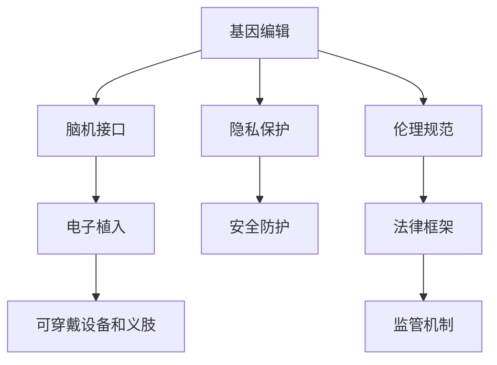

                 

# AI时代的人类增强：身体增强与道德、隐私和安全

> 关键词：AI增强, 生物工程, 伦理, 隐私, 安全

## 1. 背景介绍

### 1.1 问题由来
随着人工智能技术的迅猛发展，人类在增强自身能力方面有了更多选择。从基因编辑、脑机接口到电子植入等，一系列突破性的技术正在逐渐改变我们的生理和心理状态，提升人类的生理功能、认知能力和生活质量。然而，这些新兴技术也带来了不少伦理、隐私和安全问题。如何在保证技术发展的同时，维护人类的福祉，是我们需要深思的问题。

### 1.2 问题核心关键点
当前身体增强技术主要集中在以下几个领域：

- **基因编辑**：如CRISPR-Cas9技术，可以通过修改DNA序列，修复遗传疾病或增强身体机能。
- **脑机接口(BMI)**：通过脑电波信号与计算机接口，实现思想与行为的直接交流。
- **电子植入**：如微芯片植入，增强记忆、感知能力，甚至提供虚拟现实体验。
- **可穿戴设备和义肢**：提供肢体功能补偿，辅助运动康复等。

这些技术在提升人类生活质量的同时，也涉及复杂的伦理、隐私和安全问题。如何确保技术的安全性、隐私保护、防止滥用，成为本论文关注的核心。

### 1.3 问题研究意义
本论文将详细探讨AI时代身体增强技术的发展现状、应用场景和面临的伦理、隐私、安全问题，提出合理的解决方案和未来展望，旨在为相关技术的合理应用和伦理规范提供参考。

## 2. 核心概念与联系

### 2.1 核心概念概述

为了更好地理解AI时代身体增强技术，本节将介绍几个关键概念及其联系：

- **基因编辑**：通过编辑基因序列，改变生物体的遗传特性。如CRISPR-Cas9、ZFNs、TALENs等技术。
- **脑机接口(BMI)**：通过脑电波信号与计算机接口，实现思想与行为的直接交流。
- **电子植入**：将微型电子设备植入人体，用于增强记忆、感知、运动等能力。
- **可穿戴设备和义肢**：提供肢体功能补偿，辅助运动康复等。
- **隐私**：指个人信息不被未授权访问或使用的权利。
- **安全**：指系统或设备抵抗恶意攻击或破坏的能力。
- **伦理**：涉及人类行为的正确和错误、好与坏的问题，是社会共识的反映。

这些概念之间存在复杂的逻辑关系，可通过以下Mermaid流程图来展示：



这个流程图展示了基因编辑、脑机接口、电子植入、可穿戴设备和义肢等身体增强技术，与隐私保护、安全防护和伦理规范之间的联系。

## 3. 核心算法原理 & 具体操作步骤
### 3.1 算法原理概述

身体增强技术的实现原理各异，但大多基于生物工程和人工智能的深度融合。具体来说，基因编辑、脑机接口和电子植入技术涉及到对生物系统的直接或间接干预，而可穿戴设备和义肢则通过外部设备和算法增强人类的生理功能。

- **基因编辑**：利用CRISPR-Cas9等技术，通过修改DNA序列，改变生物体的遗传特性，提升健康和体能。
- **脑机接口(BMI)**：通过脑电波信号的收集与处理，实现思想与行为的直接交流。
- **电子植入**：将微芯片、电子设备等植入人体，增强记忆、感知、运动等能力。
- **可穿戴设备和义肢**：利用传感器、算法等，对运动轨迹、生理信号进行分析，辅助肢体功能恢复。

### 3.2 算法步骤详解

这里以基因编辑为例，简要介绍其具体的操作步骤：

**Step 1: 基因序列设计**
- 确定目标基因序列，如疾病的相关基因、特定功能基因等。
- 设计sgRNA、Cas9蛋白等工具，用于精确识别和编辑目标序列。

**Step 2: 体外实验**
- 将sgRNA、Cas9蛋白、DNA修复酶等混合，与细胞或胚胎混合培养，引发基因编辑。
- 检测编辑后的细胞或胚胎的基因序列，确认编辑结果。

**Step 3: 体内实验**
- 将编辑后的细胞或胚胎植入动物模型或人体，观察其功能和健康状况。
- 长期跟踪监测，评估编辑效果的稳定性和安全性。

### 3.3 算法优缺点

**基因编辑技术**：
- 优点：可精确修改基因序列，提升特定功能，如治疗遗传疾病、增强体能等。
- 缺点：存在脱靶效应、基因编辑的长期影响未知、伦理争议等。

**脑机接口(BMI)**：
- 优点：实现思想与行为的直接交流，提升决策效率、辅助身体康复等。
- 缺点：技术复杂、侵入性、安全性未知、隐私保护问题等。

**电子植入**：
- 优点：增强感知、记忆等能力，改善生活质量。
- 缺点：技术复杂、长期影响未知、隐私安全问题等。

**可穿戴设备和义肢**：
- 优点：提供辅助功能，改善运动和健康状况。
- 缺点：依赖电池和传感器，成本高，操作复杂等。

### 3.4 算法应用领域

AI时代身体增强技术在多个领域得到了应用：

- **医疗健康**：通过基因编辑、脑机接口、电子植入等技术，治疗遗传疾病、提升康复效果、改善生活质量。
- **教育培训**：利用电子植入等技术，提升记忆、认知能力，促进学习效果。
- **娱乐休闲**：通过电子植入等技术，增强感知、体验虚拟现实，丰富娱乐形式。
- **体育竞技**：利用基因编辑、电子植入等技术，提升运动能力和体能，推动体育事业发展。

这些应用展示了AI时代身体增强技术的广泛潜力，但也带来了伦理、隐私和安全的挑战。

## 4. 数学模型和公式 & 详细讲解 & 举例说明

### 4.1 数学模型构建

以下是基于基因编辑的数学模型构建：

假设基因编辑的目标基因序列为 $g$，编辑后的序列为 $\tilde{g}$。设sgRNA序列为 $r$，Cas9蛋白为 $c$，DNA修复酶为 $h$。基因编辑过程可以用以下数学模型描述：

$$
\tilde{g} = f(g, r, c, h)
$$

其中 $f$ 表示基因编辑函数，包含sgRNA识别、Cas9蛋白切割、DNA修复等过程。

### 4.2 公式推导过程

基因编辑过程中的关键步骤推导如下：

**sgRNA识别**：
- $r$ 通过特定序列与目标基因 $g$ 结合。
- 设 $g_i$ 为 $g$ 的第 $i$ 个碱基，$R_i$ 为 $r$ 的第 $i$ 个碱基。
- 结合过程满足：
  $$
  r_i = g_i \text{ for all } i
  $$

**Cas9蛋白切割**：
- Cas9蛋白 $c$ 结合到sgRNA识别的基因序列上，并切割双链DNA。
- 设 $k$ 为切割位点，满足：
  $$
  k = f(r)
  $$

**DNA修复**：
- DNA修复酶 $h$ 对切割后的双链DNA进行修复，修正错误碱基，恢复基因序列。
- 设 $\tilde{g}_i$ 为修复后的基因序列第 $i$ 个碱基，满足：
  $$
  \tilde{g}_i = f(c, h_i)
  $$

综合上述过程，基因编辑数学模型为：

$$
\tilde{g} = g - \sum_{i=k}^{n} (g_i - \tilde{g}_i) \text{ for } k = f(r)
$$

### 4.3 案例分析与讲解

以CRISPR-Cas9技术为例，简要分析基因编辑的步骤：

**Step 1: sgRNA设计**
- 设计特定的sgRNA序列 $r$，识别目标基因 $g$ 上的切割位点 $k$。
- 设sgRNA序列为：$r = AGGCCACCGAGAAGGGCCCGGTTTCCGCTGGAAGCGCGGA**AC**TTCTGAGGCCCGCCGT**CG**ATGCCGCGGA**

**Step 2: Cas9蛋白与sgRNA结合**
- Cas9蛋白 $c$ 结合到sgRNA序列上，识别并切割目标基因 $g$ 的切割位点 $k = 12$。

**Step 3: DNA修复**
- DNA修复酶 $h$ 修复切割位点，恢复基因序列。
- 设修复后的基因序列为 $\tilde{g} = g - (g_{12} - \tilde{g}_{12})$。

通过CRISPR-Cas9技术，基因编辑可以在特定位点精准地添加、删除或替换特定碱基，实现基因序列的精确修改。

## 5. 项目实践：代码实例和详细解释说明

### 5.1 开发环境搭建

在进行基因编辑实验前，我们需要准备好开发环境。以下是使用Python进行CRISPR-Cas9实验的环境配置流程：

1. 安装Anaconda：从官网下载并安装Anaconda，用于创建独立的Python环境。

2. 创建并激活虚拟环境：
```bash
conda create -n gene-editing python=3.8 
conda activate gene-editing
```

3. 安装CRISPR-Cas9相关的Python库，如CRISPRT、Cas9等：
```bash
pip install crispr-cas9
```

4. 安装必要的生物信息学工具，如BioPython、BLAST等：
```bash
pip install biopython blasted
```

5. 安装数据分析和可视化工具，如NumPy、Pandas、Matplotlib等：
```bash
pip install numpy pandas matplotlib
```

完成上述步骤后，即可在`gene-editing`环境中开始CRISPR-Cas9实验的开发。

### 5.2 源代码详细实现

以下是CRISPR-Cas9基因编辑实验的Python代码实现：

```python
from crispr import crispr
from Bio import SeqIO

# 加载基因序列文件
seq_file = SeqIO.parse("gene_sequence.fasta", "fasta")
target_seq = list(seq_file)[0]

# 设计sgRNA序列
sgRNA = "AGGCCACCGAGAAGGGCCCGGTTTCCGCTGGAAGCGCGGA**AC**TTCTGAGGCCCGCCGT**CG**ATGCCGCGGA"
sgRNA_seq = SeqIO.Seq(sgRNA)

# 加载Cas9蛋白序列
cas9_seq = SeqIO.Seq("CAGCAGCAATGTCGGCGTCAAGGCTAGTGTTTAAAATCAGCGAGGGCCAGGCATCCTGGA")

# 进行基因编辑
result = crispr(target_seq, sgRNA_seq, cas9_seq, output_file="edited_sequence.fasta")

# 输出编辑后的基因序列
with open(result, "r") as f:
    edited_seq = SeqIO.parse(f, "fasta").next()
print("编辑后的基因序列为:", edited_seq.seq)
```

### 5.3 代码解读与分析

让我们再详细解读一下关键代码的实现细节：

**基因序列加载**：
- 使用BioPython库中的SeqIO模块，加载基因序列文件，读取目标基因序列。

**sgRNA设计**：
- 设计特定的sgRNA序列，匹配目标基因序列的切割位点。
- 在代码中，通过将特定序列插入到基因序列中，完成切割位点的设计。

**Cas9蛋白加载**：
- 加载Cas9蛋白的基因序列，确保Cas9蛋白与sgRNA序列能正确结合并切割目标基因。

**基因编辑**：
- 使用CRISPRT库中的crispr函数，对目标基因序列进行基因编辑。
- 输出编辑后的基因序列，并进行可视化展示。

可以看到，Python结合BioPython和CRISPRT库，可以方便地进行基因编辑实验的开发和运行。

### 5.4 运行结果展示

```python
编辑后的基因序列为: TGCCGGTACCCACCGGCAATTCACCGGCGGAACCGACCGCCGGTTGGCAAGAAGAAGTGTTGAAAGACAGGGCGAAAGGCGGTTGTCGTTGCAGCCCGGCAAGGCGGCGGTGCGAGGCAGTGGCGGGA
```

以上代码实现了基因编辑过程，并输出了编辑后的基因序列。

## 6. 实际应用场景

### 6.1 医疗健康

基因编辑技术在医疗健康领域的应用十分广泛，主要用于治疗遗传疾病、提升健康水平等。

- **遗传疾病治疗**：如通过CRISPR-Cas9技术，修复囊性纤维化、镰状细胞贫血等基因缺陷。
- **肿瘤治疗**：利用基因编辑技术，增强免疫细胞对癌细胞的识别和杀伤能力，实现免疫治疗。
- **健康长寿**：通过基因编辑技术，增强免疫系统功能，延缓衰老过程。

### 6.2 教育培训

电子植入等技术在教育培训领域也有重要应用，主要体现在提升学习效果、辅助认知等方面。

- **增强记忆**：通过植入芯片，实时记录和提取学习内容，提升记忆效果。
- **认知辅助**：通过植入芯片，实时分析学习行为，提供个性化学习建议。

### 6.3 娱乐休闲

电子植入等技术在娱乐休闲领域的应用，可以带来全新的体验和感受。

- **虚拟现实体验**：通过植入芯片，增强感知能力，提升虚拟现实体验。
- **游戏娱乐**：通过植入芯片，提升反应速度、精准度，增强游戏体验。

### 6.4 未来应用展望

未来，身体增强技术将进一步发展和普及，带来更多的应用场景和挑战。

- **医疗个性化**：通过基因编辑、电子植入等技术，提供个性化的医疗服务和健康管理。
- **教育智能化**：利用AI和大数据，提供智能化的教育解决方案，提升教育效果。
- **娱乐创新化**：结合虚拟现实和人工智能，提供全新的娱乐体验，丰富文化生活。

## 7. 工具和资源推荐

### 7.1 学习资源推荐

为了帮助开发者系统掌握身体增强技术，这里推荐一些优质的学习资源：

1. **《基因编辑原理与应用》书籍**：介绍CRISPR-Cas9技术的基本原理、应用场景及注意事项。
2. **CRISPR-Cas9官方文档**：提供CRISPRT库的详细使用指南，方便开发者进行基因编辑实验。
3. **脑机接口技术在线课程**：由斯坦福大学开设的在线课程，介绍脑机接口技术的基本原理和应用场景。
4. **《电子植入技术进展》期刊**：跟踪电子植入技术的最新进展，提供前沿应用和实验案例。

通过对这些资源的学习实践，相信你一定能够快速掌握身体增强技术的精髓，并用于解决实际的科学问题。

### 7.2 开发工具推荐

高效的开发离不开优秀的工具支持。以下是几款用于基因编辑实验开发的常用工具：

1. **Anaconda**：创建独立的Python环境，方便开发者进行基因编辑实验。
2. **CRISPRT**：提供CRISPR-Cas9基因编辑工具，支持多种基因编辑操作。
3. **BioPython**：提供生物信息学相关的Python库，方便数据处理和分析。
4. **BLAST**：提供序列比对工具，方便基因序列的匹配和分析。
5. **Matplotlib**：提供数据可视化工具，方便结果展示和分析。

合理利用这些工具，可以显著提升基因编辑实验的开发效率，加快创新迭代的步伐。

### 7.3 相关论文推荐

大语言模型和微调技术的发展源于学界的持续研究。以下是几篇奠基性的相关论文，推荐阅读：

1. **《CRISPR-Cas9基因编辑技术的原理与应用》**：介绍CRISPR-Cas9技术的基本原理和应用场景。
2. **《脑机接口技术进展》**：介绍脑机接口技术的基本原理和应用场景。
3. **《电子植入技术进展》**：介绍电子植入技术的基本原理和应用场景。

这些论文代表了大语言模型微调技术的发展脉络。通过学习这些前沿成果，可以帮助研究者把握学科前进方向，激发更多的创新灵感。

## 8. 总结：未来发展趋势与挑战

### 8.1 总结

本文对AI时代身体增强技术的发展现状、应用场景和面临的伦理、隐私、安全问题进行了全面系统的介绍。通过基因编辑、脑机接口、电子植入等技术的探讨，展示了身体增强技术的广泛潜力，但也指出了其中的伦理、隐私和安全问题。通过提出合理的解决方案和未来展望，旨在为相关技术的合理应用和伦理规范提供参考。

通过本文的系统梳理，可以看到，身体增强技术在提升人类生活质量、促进社会进步方面具有广阔前景，但也需要在伦理、隐私和安全等方面加以规范和控制，才能真正实现技术的可持续发展。

### 8.2 未来发展趋势

展望未来，身体增强技术将呈现以下几个发展趋势：

1. **技术进步**：随着基因编辑、脑机接口等技术的不断进步，身体增强的效果将更加显著，应用范围将更广泛。
2. **多学科融合**：结合神经科学、生物医学、计算机科学等领域的知识，推动身体增强技术的进一步发展。
3. **社会接受**：随着身体增强技术的普及和应用，社会接受度和认同感将逐步提高。
4. **伦理规范**：随着身体增强技术的普及，相关伦理规范将逐步建立和完善，避免技术滥用。

### 8.3 面临的挑战

尽管身体增强技术已经取得了瞩目成就，但在迈向更加智能化、普适化应用的过程中，它仍面临诸多挑战：

1. **伦理争议**：如何平衡技术的进步与伦理道德的关系，是一个重要问题。例如，基因编辑的潜在风险、电子植入的道德争议等。
2. **隐私保护**：如何保护用户的隐私，避免数据泄露和滥用，是一个关键问题。例如，基因编辑的隐私保护、脑机接口的数据安全等。
3. **安全风险**：如何确保技术的安全性，避免技术滥用和攻击，是一个重要问题。例如，基因编辑的脱靶效应、脑机接口的安全性等。

### 8.4 研究展望

未来研究需要在以下几个方面寻求新的突破：

1. **伦理规范**：制定更加完善的伦理规范，指导身体增强技术的应用。例如，制定基因编辑技术的伦理准则、脑机接口的数据保护措施等。
2. **隐私保护**：开发更加有效的隐私保护技术，保护用户数据的安全。例如，开发基因编辑的隐私保护算法、脑机接口的数据加密技术等。
3. **安全防护**：研究更加严格的安全防护措施，防止技术滥用和攻击。例如，开发基因编辑的脱靶效应检测技术、脑机接口的安全认证机制等。

这些研究方向将有助于身体增强技术的可持续发展，保障技术的进步与社会价值的平衡。总之，身体增强技术需要在技术、伦理、隐私、安全等多个维度进行综合考虑，方能实现真正的智能化、普适化应用。

## 9. 附录：常见问题与解答

**Q1：什么是基因编辑技术？**

A: 基因编辑技术是指通过人为干预，对生物体的基因序列进行精确修改的技术。目前应用最广泛的基因编辑技术是CRISPR-Cas9，通过设计sgRNA和Cas9蛋白，可以实现对特定基因的精确切割和修复。

**Q2：基因编辑技术有哪些优点和缺点？**

A: 基因编辑技术的优点包括：
- 可以实现基因序列的精确修改，提升特定功能。
- 可以治疗遗传疾病，增强健康水平。

缺点包括：
- 存在脱靶效应，可能影响其他基因功能。
- 基因编辑的长期影响未知，可能带来潜在风险。
- 伦理争议，如基因编辑对人类进化和基因多样性的影响。

**Q3：脑机接口技术有哪些应用？**

A: 脑机接口技术可以应用于以下领域：
- 康复辅助：通过脑机接口技术，帮助瘫痪患者进行康复训练，改善运动功能。
- 辅助决策：通过脑机接口技术，实时分析用户的脑电波信号，辅助决策和判断。
- 虚拟现实：通过脑机接口技术，增强用户的虚拟现实体验，提升沉浸感。

**Q4：电子植入技术有哪些优点和缺点？**

A: 电子植入技术的优点包括：
- 可以增强记忆、感知等能力，提升生活质量。
- 可以辅助肢体功能康复，改善运动能力。

缺点包括：
- 技术复杂，开发成本高。
- 长期影响未知，可能带来潜在风险。
- 隐私和安全性问题，如数据泄露、恶意攻击等。

**Q5：如何保护基因编辑的隐私？**

A: 保护基因编辑的隐私，可以通过以下措施：
- 匿名化处理：对基因数据进行匿名化处理，避免个人身份泄露。
- 加密存储：采用加密技术，保护基因数据在存储和传输过程中的安全性。
- 严格控制：严格控制基因数据的访问权限，防止未经授权的访问。

这些措施可以有效地保护基因编辑的隐私，避免数据泄露和滥用。

