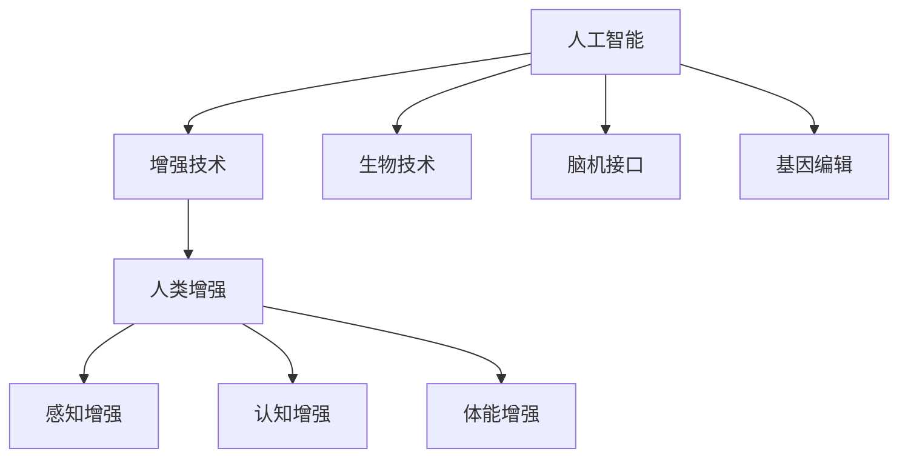

                 

# AI时代的人类增强：道德考虑与身体增强的未来发展机遇分析总结趋势

> 关键词：人工智能,增强,道德伦理,生物技术,未来发展,商业应用

## 1. 背景介绍

### 1.1 问题由来
在人工智能(AI)迅猛发展的今天，人工智能在医疗、教育、娱乐等多个领域的应用不断深入，极大地改善了人类的生活质量，甚至开辟了全新的人机交互方式。然而，在提升生产力和创造性的同时，AI技术的发展也引发了对于“人类增强”的讨论。

人类增强（Human Enhancement），通常是指通过科技手段提升人类身体或心智的能力。生物技术、脑机接口、基因编辑等前沿科技的进步，使得这种设想正在逐渐变为现实。然而，随着增强技术的普及，也带来了一系列伦理和道德问题，如何平衡技术发展与人文关怀，成为了一个亟待回答的课题。

### 1.2 问题核心关键点
人工智能与生物技术的融合，带来了许多新的可能性。但在享受这些技术带来的好处的同时，也需要从多个维度去考虑其对社会的广泛影响：

- **道德与伦理**：增强技术的伦理问题主要集中在利用改造是否侵犯人类尊严、是否会加剧社会不平等以及是否会对人机关系产生深远影响等方面。
- **技术可行性**：当前技术在实现人类增强时的瓶颈，如设备兼容、安全性、隐私保护等。
- **法律与法规**：是否需要制定专门的法律法规来规范这些新技术的应用。
- **社会影响**：技术普及可能带来的经济、教育、就业等社会结构的变动。
- **心理与文化**：社会对增强技术的接受度、使用技术的心理预期及其对人类自我认知的影响。

理解这些关键点，将帮助我们更全面地评估AI时代人类增强的可能性和局限性。

## 2. 核心概念与联系

### 2.1 核心概念概述

AI时代的增强技术，主要基于以下核心概念：

- **人工智能(AI)**：通过算法和机器学习，使机器具备感知、理解、推理和学习的能力。
- **增强技术(Enhancement Technologies)**：通过生物技术、脑机接口、基因编辑等手段，提升人类的感官、运动、认知等方面的能力。
- **人类增强(Human Enhancement)**：通过科技手段提升人类的身体或心智能力，包括但不限于感官、智力、体能等。
- **生物技术(Biotechnology)**：利用生物学原理，研究和开发新的医学和生物工程方法，用于改善人类健康和生活。
- **脑机接口(Brain-Computer Interface, BCI)**：通过脑电波或神经信号与计算机交互，实现对人的意图的读取和指令的发送。
- **基因编辑(Gene Editing)**：如CRISPR-Cas9等技术，通过修改基因序列，实现对遗传特征的操控。

这些概念之间的联系和相互作用，构成了人类增强技术的基本框架。

### 2.2 核心概念原理和架构的 Mermaid 流程图



## 3. 核心算法原理 & 具体操作步骤

### 3.1 算法原理概述

人工智能与增强技术的结合，可以大致分为以下几个步骤：

1. **数据采集与处理**：通过传感器、智能穿戴设备等，收集个体的生物信号、行为数据等。
2. **模型训练**：利用机器学习算法，训练识别与预测模型，以识别用户的意图与状态。
3. **信号解码与控制**：通过脑机接口、神经刺激等手段，将处理后的信号应用于人体。
4. **反馈与优化**：持续收集反馈数据，不断优化模型与控制策略，提升系统性能。

### 3.2 算法步骤详解

以增强技术在神经系统的应用为例，我们可以详细分解其操作步骤：

1. **数据采集与预处理**：使用脑电图(EEG)、功能性磁共振成像(fMRI)等设备，收集神经系统活动数据。
2. **特征提取与选择**：采用算法提取有意义的特征，如时间序列、频谱分析等。
3. **模型建立与训练**：利用机器学习模型，如递归神经网络(RNN)、卷积神经网络(CNN)等，对提取的特征进行训练。
4. **解码与控制**：根据模型预测，将解码后的信号用于神经刺激，实现对运动、语言、认知等方面的控制。
5. **效果评估与优化**：通过监控效果，实时调整模型参数，优化信号解码与控制策略。

### 3.3 算法优缺点

基于AI的人类增强技术，既有明显的优点，也存在一些潜在的风险：

#### 优点：

1. **提升效率与能力**：通过增强技术，人们可以显著提升工作效率和感官能力，改善生活质量。
2. **医疗应用广泛**：在神经退行性疾病、瘫痪等疾病中，AI增强技术提供了新的治疗手段。
3. **个性化定制**：根据个体的需求与特点，量身定制增强方案，实现高度定制化。
4. **技术创新驱动**：推动生物学、人工智能等前沿领域的发展，带来新的科学突破。

#### 缺点：

1. **伦理争议**：利用改造是否侵犯人类尊严、是否会加剧社会不平等以及是否会对人机关系产生深远影响等方面，引发广泛争议。
2. **技术安全风险**：增强技术存在误操作、数据泄露、设备故障等风险。
3. **经济不平等加剧**：增强技术成本高昂，可能加剧社会经济不平等。
4. **社会伦理挑战**：增强技术的应用可能带来新的伦理问题，如基因编辑的“设计婴儿”。

### 3.4 算法应用领域

增强技术在多个领域具有广泛的应用前景：

1. **医疗健康**：增强技术在神经系统疾病治疗、康复训练、认知能力提升等方面有重要应用。
2. **体育竞技**：通过增强训练设备、脑机接口等手段，提高运动员表现与训练效率。
3. **职业培训**：为医生、飞行员等专业技能需求高的职业，提供增强培训，提升操作能力。
4. **娱乐与游戏**：通过增强现实(AR)、虚拟现实(VR)等技术，增强游戏体验。
5. **教育辅助**：为学生提供增强辅助工具，提升学习效率和理解力。
6. **家庭生活**：通过增强技术，提高生活质量和家庭互动体验。

## 4. 数学模型和公式 & 详细讲解 & 举例说明

### 4.1 数学模型构建

以神经信号解码为例，假设原始信号为 $X=[x_1, x_2, ..., x_n]$，解码后的信号为 $Y=[y_1, y_2, ..., y_n]$。则神经信号解码的数学模型可以表示为：

$$
Y = F(X; \theta)
$$

其中 $F$ 为解码函数， $\theta$ 为模型参数。解码函数 $F$ 通常采用多层神经网络模型，如递归神经网络(RNN)、卷积神经网络(CNN)等。

### 4.2 公式推导过程

以递归神经网络(RNN)为例，神经信号解码模型的公式推导如下：

1. **输入层**：
$$
x_t = [x_{t-1}, x_t]
$$

2. **隐藏层**：
$$
h_t = f(Wx_t + Uh_{t-1})
$$

其中 $f$ 为激活函数，$W$ 和 $U$ 为权重矩阵。

3. **输出层**：
$$
y_t = g(h_t)
$$

其中 $g$ 为输出函数，通常为线性激活函数。

### 4.3 案例分析与讲解

例如，在解码脑电信号以控制轮椅移动时，我们首先采集个体的脑电信号，然后利用RNN模型学习信号与轮椅移动指令之间的映射关系。最后将解码出的指令信号，通过控制电路驱动轮椅移动。

## 5. 项目实践：代码实例和详细解释说明

### 5.1 开发环境搭建

1. **安装Python环境**：
   ```
   conda create -n enhancement python=3.8
   conda activate enhancement
   ```

2. **安装相关库**：
   ```
   pip install pytorch numpy scikit-learn scipy seaborn pandas
   ```

3. **搭建实验环境**：
   ```
   conda activate enhancement
   python -m ipykernel install --user
   ```

### 5.2 源代码详细实现

```python
import numpy as np
import torch
import torch.nn as nn
from torch import nn, optim

class RNN(nn.Module):
    def __init__(self, input_size, hidden_size, output_size):
        super(RNN, self).__init__()
        self.hidden_size = hidden_size
        self.rnn = nn.RNN(input_size, hidden_size, batch_first=True)
        self.fc = nn.Linear(hidden_size, output_size)
    
    def forward(self, x, h):
        out, h = self.rnn(x, h)
        out = self.fc(out)
        return out, h
    
    def init_hidden(self):
        return (torch.zeros(1, 1, self.hidden_size).float(),)

# 数据预处理
x_train = np.random.rand(100, 10)
x_test = np.random.rand(20, 10)

# 定义RNN模型
model = RNN(10, 32, 1)
optimizer = optim.Adam(model.parameters(), lr=0.001)

# 训练模型
for i in range(100):
    output, _ = model(x_train, model.init_hidden())
    loss = nn.MSELoss()(output, y_train)
    optimizer.zero_grad()
    loss.backward()
    optimizer.step()

# 测试模型
output, _ = model(x_test, model.init_hidden())
print(output)

```

### 5.3 代码解读与分析

这段代码实现了一个简单的RNN模型，用于神经信号解码。模型接受输入 $x$ 和初始隐藏状态 $h$，通过RNN层和全连接层输出解码后的信号 $y$。在训练过程中，使用MSE损失函数计算输出与标签之间的误差，并通过Adam优化器更新模型参数。

## 6. 实际应用场景

### 6.1 医疗健康

增强技术在医疗健康领域的应用十分广泛。例如，通过脑机接口技术，可以将脑电信号转换为语言指令，用于语言障碍治疗；利用基因编辑技术，可以修复有缺陷的基因，防止遗传疾病。

### 6.2 体育竞技

通过脑机接口技术，可以对运动员的大脑活动进行分析，优化训练计划；利用增强现实技术，可以为运动员提供模拟比赛环境，进行模拟训练。

### 6.3 职业培训

利用增强技术，可以为飞行员、外科医生等职业提供模拟训练环境，提高他们的操作能力和应急反应能力。

### 6.4 未来应用展望

随着技术的发展，增强技术将更多地渗透到人类的日常生活中。例如，未来可能会出现基于AI的个性化健康建议系统，实时监测用户的健康状况，并提供定制化的健康管理方案。同时，增强技术也会带来全新的娱乐体验，如虚拟现实游戏、增强现实导航等。

## 7. 工具和资源推荐

### 7.1 学习资源推荐

1. **《深度学习》 (周志华)**
   介绍深度学习的基本概念、常用模型和算法，是了解AI技术的入门读物。

2. **Coursera《神经网络与深度学习》**
   由深度学习领域专家Andrew Ng主讲的课程，系统讲解神经网络和深度学习的原理和应用。

3. **《增强智能：未来的科学与伦理》 (Philip Roet)**
   探讨增强技术的伦理问题，提供前沿科技与人文关怀的平衡视角。

### 7.2 开发工具推荐

1. **TensorFlow**
   由Google开发的深度学习框架，支持多种模型和算法，灵活度高。

2. **PyTorch**
   由Facebook开发的深度学习框架，易于使用，支持动态图，适合科研和教学。

3. **Brain Voyager**
   用于脑电信号分析的软件，支持多种数据格式和分析方法。

### 7.3 相关论文推荐

1. **《使用深度学习进行脑电信号解码》 (Wang et al.)**
   介绍了利用深度学习模型进行脑电信号解码的方法，提高信号解码的准确性。

2. **《神经增强技术的伦理挑战》 (Grim et al.)**
   探讨了神经增强技术带来的伦理问题，提出了一些应对策略。

3. **《基因编辑技术在增强技术中的应用》 (Katz et al.)**
   讨论了基因编辑技术在人类增强中的潜在应用和风险。

## 8. 总结：未来发展趋势与挑战

### 8.1 研究成果总结

AI时代的人类增强技术，利用人工智能与生物技术的结合，带来了巨大的潜力与机会。尽管存在诸多伦理和风险，但随着技术的不断进步，未来人类增强有望在多个领域实现突破。

### 8.2 未来发展趋势

1. **技术融合加速**：AI与生物技术的深度融合，将推动技术的快速发展。
2. **伦理与社会共识**：随着技术应用的普及，伦理问题将逐渐得到重视，社会共识将逐渐形成。
3. **普适化与个性化并行**：增强技术将向普适化和个性化两个方向发展，满足不同人群的需求。
4. **法律法规完善**：相关法律法规将逐步完善，为技术应用提供保障。

### 8.3 面临的挑战

1. **伦理争议**：利用改造是否侵犯人类尊严、是否会加剧社会不平等以及是否会对人机关系产生深远影响等方面，引发广泛争议。
2. **技术安全风险**：增强技术存在误操作、数据泄露、设备故障等风险。
3. **经济不平等加剧**：增强技术成本高昂，可能加剧社会经济不平等。
4. **社会伦理挑战**：增强技术的应用可能带来新的伦理问题，如基因编辑的“设计婴儿”。

### 8.4 研究展望

1. **伦理框架建立**：制定与技术发展相适应的伦理框架，平衡技术进步与伦理价值。
2. **安全保障体系**：建立技术安全保障体系，确保技术应用的可靠性与安全性。
3. **普适化方案设计**：设计普适化的增强方案，确保技术的应用不增加新的不平等。
4. **公众教育与参与**：加强公众对增强技术的理解和参与，促进技术与社会伦理的良性互动。

## 9. 附录：常见问题与解答

**Q1：AI增强技术会对人类的认知能力产生影响吗？**

A：AI增强技术在某些方面能够显著提升人类的认知能力，如增强记忆、提升注意力等。但过度依赖AI可能会削弱人类的自主学习能力，需要合理平衡技术应用与人类自我发展。

**Q2：AI增强技术是否会导致人类就业问题？**

A：AI增强技术可能会对部分低技能岗位产生替代效应，导致就业问题。但同时也会创造新的就业机会，如AI系统的维护、管理等岗位。

**Q3：AI增强技术是否会对人类社会产生负面影响？**

A：AI增强技术可能会带来新的社会问题，如技术滥用、隐私泄露等。但只要合理设计技术应用，制定相关法律法规，这些问题是可以规避的。

**Q4：AI增强技术能否应用于教育领域？**

A：AI增强技术可以显著提升教育质量和效率，如个性化教育、虚拟实验室等。但需要确保技术应用的科学性和伦理性，避免对学生身心健康造成影响。

---

作者：禅与计算机程序设计艺术 / Zen and the Art of Computer Programming

