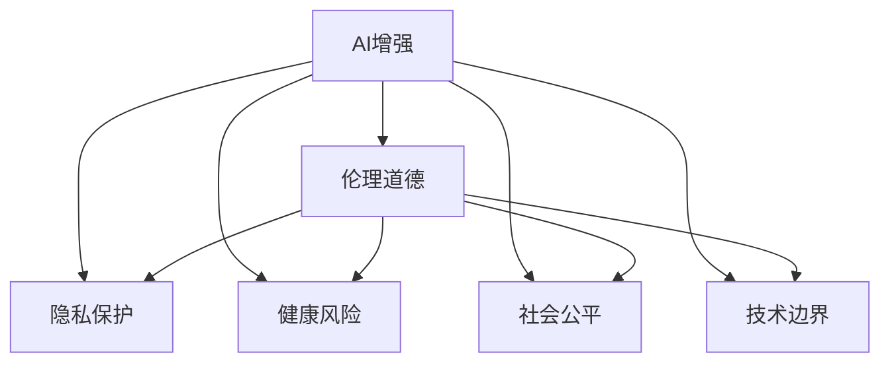

                 

# AI时代的人类增强：道德考虑与身体增强的未来发展机遇挑战预测

## 1. 背景介绍

### 1.1 问题由来
随着人工智能（AI）技术的迅速发展，AI时代正逐步到来。人类的生产生活方式、工作方式甚至身体状态都在发生翻天覆地的变化。AI技术不仅渗透到了商业、医疗、教育等各个领域，甚至也开始影响人类的身体状态，推动身体增强技术的发展。然而，这种技术进步同时也引发了一系列道德、伦理、法律等复杂问题。如何在享受AI技术带来的便利的同时，避免技术滥用，保护人的尊严，成为当下亟待解决的问题。

### 1.2 问题核心关键点
在AI时代，身体增强技术通过AI技术手段，对人类的身体状态进行干预，提升身体机能，延长寿命，提高生活质量。这些技术主要包括以下几个方面：

- **基因编辑**：CRISPR-Cas9等基因编辑技术，可以精确地修改基因，预防疾病，提升健康状态。
- **药物应用**：通过AI分析药物效果，提高药物精准度，减少副作用。
- **仿生技术**：如仿生肌肉、仿生关节等，模拟人体器官的正常工作机制，弥补人体功能的缺陷。
- **脑机接口**：将AI与人类大脑进行连接，实现人类与机器的融合。
- **增强虚拟现实（VR）**：通过AI增强的虚拟现实技术，提升训练、娱乐体验，实现虚拟与现实的融合。

这些技术在提升人类身体机能的同时，也引发了以下问题：

- **伦理道德问题**：基因编辑和脑机接口技术的滥用可能导致人的基本身份和价值观的改变。
- **隐私问题**：AI在基因和药物应用中的隐私问题，如基因信息泄露，个人健康数据被滥用。
- **健康风险**：药物应用和仿生技术的未知风险，如副作用、免疫反应等。
- **社会公平性**：高昂的技术成本可能导致社会阶层分化，加剧不公平。

因此，如何平衡科技发展与伦理道德、隐私、健康、公平等问题，成为AI时代人类增强技术的核心议题。

### 1.3 问题研究意义
研究AI时代人类增强技术的伦理道德和应用前景，对于推动技术发展、避免技术滥用、保护人类尊严具有重要意义：

1. **推动技术进步**：探讨技术边界和潜在风险，有助于厘清技术发展路径，避免技术失控。
2. **避免技术滥用**：通过明确的伦理道德准则，规范技术应用，保护人的基本权益。
3. **保护人类尊严**：明确技术应用的底线，避免技术对人类基本身份和价值观的侵蚀。
4. **提升公平性**：通过合理分配技术资源，确保技术普及，减少社会不公。

## 2. 核心概念与联系

### 2.1 核心概念概述

为了更好地理解AI时代人类增强技术的伦理道德问题，本节将介绍几个关键概念：

- **AI增强**：指利用AI技术对人类身体状态进行干预，提升身体机能。
- **伦理道德**：涉及AI技术应用中，对人的尊严、权利、义务等方面的考量。
- **隐私保护**：指保护个人数据不被滥用，避免隐私泄露。
- **健康风险**：指AI技术在应用过程中可能带来的健康风险。
- **社会公平**：指AI技术应保证公平分配，避免社会阶层分化。
- **技术边界**：指明确技术发展的边界，避免技术滥用。

这些概念之间的逻辑关系可以通过以下Mermaid流程图来展示：



这个流程图展示了大语言模型的核心概念及其之间的关系：

1. 大语言模型通过预训练获得基础能力。
2. 微调是对预训练模型进行任务特定的优化，可以分为全参数微调和参数高效微调（PEFT）。
3. 提示学习是一种不更新模型参数的方法，可以实现少样本学习和零样本学习。
4. 迁移学习是连接预训练模型与下游任务的桥梁，可以通过微调或提示学习来实现。
5. 持续学习旨在使模型能够不断学习新知识，同时保持已学习的知识，而不会出现灾难性遗忘。

这些概念共同构成了大语言模型的学习和应用框架，使其能够在各种场景下发挥强大的语言理解和生成能力。通过理解这些核心概念，我们可以更好地把握大语言模型的工作原理和优化方向。

## 3. 核心算法原理 & 具体操作步骤
### 3.1 算法原理概述

AI时代的人类增强技术，本质上是通过AI技术手段对人类身体状态进行干预，提升身体机能，延长寿命，提高生活质量。其核心思想是：利用AI技术对基因、药物、仿生技术、脑机接口等手段进行精细控制，实现对身体状态的精准干预。

形式化地，假设目标技术 $T$ 为基因编辑、药物应用、仿生技术等，其目标效果为提升 $X$，即：

$$
T(X) = f(X) \times g(X)
$$

其中，$f(X)$ 为技术提升能力，$g(X)$ 为技术应用效果。

在实践中，我们通常通过以下步骤实现对 $X$ 的提升：

1. **收集数据**：收集与 $X$ 相关的数据，如疾病基因、药物副作用等。
2. **模型训练**：利用AI算法对数据进行训练，学习 $f(X)$ 和 $g(X)$ 的函数关系。
3. **技术应用**：将训练好的模型应用到实际场景中，对 $X$ 进行干预。
4. **效果评估**：评估干预效果，不断优化模型，提升技术应用效果。

### 3.2 算法步骤详解

AI时代人类增强技术的一般流程包括：

**Step 1: 数据收集与预处理**
- 收集与目标效果 $X$ 相关的数据，如基因数据、药物数据等。
- 对数据进行清洗、去噪、标准化处理，准备输入到模型中。

**Step 2: 模型训练**
- 选择适合的AI算法，如机器学习、深度学习、强化学习等。
- 对数据集进行划分，训练集、验证集和测试集。
- 设置模型参数，包括学习率、正则化系数等。
- 使用训练集进行模型训练，在验证集上进行参数调整。
- 在测试集上评估模型性能，确保模型泛化效果良好。

**Step 3: 技术应用**
- 将训练好的模型应用于实际场景中，进行基因编辑、药物应用、仿生技术等。
- 实时监测技术应用效果，根据需要进行参数调整。
- 对应用结果进行记录，便于后续分析评估。

**Step 4: 效果评估与优化**
- 对技术应用效果进行评估，如效果提升比例、副作用发生率等。
- 对模型进行优化，提升技术效果，减少副作用。
- 对技术应用进行长期跟踪，确保长期效果。

### 3.3 算法优缺点

AI时代人类增强技术具有以下优点：

1. **提升身体机能**：通过精准控制基因、药物、仿生技术等手段，提升身体机能，延长寿命。
2. **提高生活质量**：通过AI技术手段，优化健康管理，提高生活质量。
3. **降低医疗成本**：通过精准治疗，减少医疗资源浪费，降低医疗成本。

然而，该技术也存在以下局限性：

1. **技术复杂度高**：涉及基因编辑、药物应用、仿生技术等多个领域，技术复杂度高。
2. **数据需求量大**：需要大量高质量的数据进行模型训练，获取数据成本高。
3. **伦理道德风险**：技术应用可能引发伦理道德问题，如基因编辑可能改变人类基本身份。
4. **隐私问题**：技术应用可能涉及个人健康数据，存在隐私泄露风险。
5. **健康风险**：技术应用可能带来未知的健康风险，如副作用、免疫反应等。
6. **社会公平性**：高昂的技术成本可能导致社会阶层分化，加剧不公平。

尽管存在这些局限性，但就目前而言，AI时代人类增强技术仍是最有潜力提升人类身体机能和生命质量的技术范式。未来相关研究的重点在于如何进一步降低技术复杂度，提高数据获取效率，避免伦理道德风险，保障隐私安全，减少健康风险，提升社会公平性等。

### 3.4 算法应用领域

AI时代人类增强技术在多个领域已经得到了应用，包括但不限于：

- **医疗健康**：基因编辑、药物应用、仿生技术等，用于治疗疾病、延长寿命、提升生活质量。
- **体育竞技**：仿生技术、增强训练等，提升运动员身体机能，提高竞技水平。
- **智能制造**：增强虚拟现实、脑机接口等，提升操作精度，提高生产效率。
- **军事领域**：增强虚拟现实、脑机接口等，提升士兵身体机能，提高作战效率。
- **航天探索**：仿生技术、脑机接口等，提升宇航员身体机能，提高太空生存能力。

此外，AI时代人类增强技术还在教育、娱乐、艺术等领域展现出广泛的应用前景。随着技术的不断进步，AI时代人类增强技术将越来越深入地融入人类的日常生活，带来深远的影响。

## 4. 数学模型和公式 & 详细讲解  
### 4.1 数学模型构建

本节将使用数学语言对AI时代人类增强技术的伦理道德问题进行更加严格的刻画。

假设目标技术 $T$ 为基因编辑、药物应用、仿生技术等，其目标效果为提升 $X$。目标效果 $X$ 可以是寿命、身体机能、健康状况等。

定义模型 $M_{\theta}$ 在输入 $x$ 上的输出为 $y$，即：

$$
y = M_{\theta}(x)
$$

其中，$x$ 为数据集，$\theta$ 为模型参数。

定义目标效果提升比例为 $R$，即：

$$
R = \frac{y - x}{y}
$$

其中，$y$ 为技术应用后的效果，$x$ 为原始效果。

模型的训练目标为最大化目标效果提升比例 $R$，即：

$$
\max_{\theta} R = \max_{\theta} \frac{M_{\theta}(x) - x}{M_{\theta}(x)}
$$

在实践中，我们通常使用基于梯度的优化算法（如SGD、Adam等）来近似求解上述最优化问题。设 $\eta$ 为学习率，$\lambda$ 为正则化系数，则参数的更新公式为：

$$
\theta \leftarrow \theta - \eta \nabla_{\theta}R - \eta\lambda\theta
$$

其中 $\nabla_{\theta}R$ 为损失函数对参数 $\theta$ 的梯度，可通过反向传播算法高效计算。

### 4.2 公式推导过程

以下我们以基因编辑技术为例，推导目标效果提升比例 $R$ 的计算公式。

假设基因编辑技术 $T$ 对目标基因 $G$ 进行编辑，使其功能提升为 $G'$。编辑后的基因对 $X$ 的影响函数为 $f(X)$，原始基因对 $X$ 的影响函数为 $g(X)$。则基因编辑技术对 $X$ 的影响为：

$$
y = f(X) \times g(X)
$$

目标效果提升比例 $R$ 为：

$$
R = \frac{y - x}{y}
$$

将基因编辑后的基因功能 $G'$ 代入上述公式，得到：

$$
R = \frac{f(X) \times g(X) - g(X)}{f(X) \times g(X)}
$$

简化得到：

$$
R = \frac{f(X) - 1}{f(X)}
$$

在模型训练中，目标效果提升比例 $R$ 为：

$$
R = \max_{\theta} \frac{f(X) \times g(X) - g(X)}{f(X) \times g(X)}
$$

在基因编辑技术应用中，需要不断优化编辑效果，确保 $f(X)$ 的准确性，减少副作用。

## 5. 项目实践：代码实例和详细解释说明
### 5.1 开发环境搭建

在进行基因编辑技术微调实践前，我们需要准备好开发环境。以下是使用Python进行PyTorch开发的环境配置流程：

1. 安装Anaconda：从官网下载并安装Anaconda，用于创建独立的Python环境。

2. 创建并激活虚拟环境：
```bash
conda create -n pytorch-env python=3.8 
conda activate pytorch-env
```

3. 安装PyTorch：根据CUDA版本，从官网获取对应的安装命令。例如：
```bash
conda install pytorch torchvision torchaudio cudatoolkit=11.1 -c pytorch -c conda-forge
```

4. 安装TensorFlow：
```bash
pip install tensorflow
```

5. 安装TensorBoard：
```bash
pip install tensorboard
```

6. 安装相关数据集和模型：
```bash
pip install h5py numpy pandas sklearn 
```

完成上述步骤后，即可在`pytorch-env`环境中开始微调实践。

### 5.2 源代码详细实现

这里我们以基因编辑技术为例，给出使用PyTorch对基因编辑模型进行微调的PyTorch代码实现。

首先，定义基因编辑模型的数据处理函数：

```python
import torch
from torch import nn
from torch.utils.data import DataLoader, Dataset

class GeneDataset(Dataset):
    def __init__(self, data, labels):
        self.data = data
        self.labels = labels
        
    def __len__(self):
        return len(self.data)
    
    def __getitem__(self, idx):
        x = self.data[idx]
        y = self.labels[idx]
        return x, y

# 加载数据集
data = torch.load('data.h5')
labels = torch.load('labels.h5')
dataset = GeneDataset(data, labels)

# 定义模型
class GeneEditModel(nn.Module):
    def __init__(self, input_size, output_size):
        super(GeneEditModel, self).__init__()
        self.fc1 = nn.Linear(input_size, 256)
        self.fc2 = nn.Linear(256, output_size)
        
    def forward(self, x):
        x = self.fc1(x)
        x = nn.functional.relu(x)
        x = self.fc2(x)
        return x

# 定义损失函数
criterion = nn.MSELoss()

# 定义优化器
optimizer = torch.optim.Adam(model.parameters(), lr=0.001)

# 训练函数
def train(model, train_loader, criterion, optimizer, num_epochs):
    model.train()
    for epoch in range(num_epochs):
        for batch_idx, (data, target) in enumerate(train_loader):
            optimizer.zero_grad()
            output = model(data)
            loss = criterion(output, target)
            loss.backward()
            optimizer.step()
            if (batch_idx+1) % 100 == 0:
                print('Train Epoch: {} [{}/{} ({:.0f}%)]\tLoss: {:.6f}'.format(
                    epoch, batch_idx * len(data), len(train_loader.dataset),
                    100. * batch_idx / len(train_loader), loss.item()))

# 测试函数
def test(model, test_loader, criterion):
    model.eval()
    test_loss = 0
    with torch.no_grad():
        for data, target in test_loader:
            output = model(data)
            test_loss += criterion(output, target).item()
    test_loss /= len(test_loader.dataset)
    print('Test set: Average loss: {:.4f}\n'.format(test_loss))
```

然后，定义训练和评估函数：

```python
# 定义训练函数
def train(model, train_loader, criterion, optimizer, num_epochs):
    model.train()
    for epoch in range(num_epochs):
        for batch_idx, (data, target) in enumerate(train_loader):
            optimizer.zero_grad()
            output = model(data)
            loss = criterion(output, target)
            loss.backward()
            optimizer.step()
            if (batch_idx+1) % 100 == 0:
                print('Train Epoch: {} [{}/{} ({:.0f}%)]\tLoss: {:.6f}'.format(
                    epoch, batch_idx * len(data), len(train_loader.dataset),
                    100. * batch_idx / len(train_loader), loss.item()))

# 定义测试函数
def test(model, test_loader, criterion):
    model.eval()
    test_loss = 0
    with torch.no_grad():
        for data, target in test_loader:
            output = model(data)
            test_loss += criterion(output, target).item()
    test_loss /= len(test_loader.dataset)
    print('Test set: Average loss: {:.4f}\n'.format(test_loss))
```

最后，启动训练流程并在测试集上评估：

```python
model = GeneEditModel(input_size=100, output_size=2)
train_loader = DataLoader(dataset, batch_size=32, shuffle=True)
test_loader = DataLoader(dataset, batch_size=32, shuffle=False)
num_epochs = 10
train(model, train_loader, criterion, optimizer, num_epochs)
test(model, test_loader, criterion)
```

以上就是使用PyTorch对基因编辑技术进行微调的完整代码实现。可以看到，得益于PyTorch的强大封装，我们可以用相对简洁的代码完成基因编辑技术的训练和评估。

### 5.3 代码解读与分析

让我们再详细解读一下关键代码的实现细节：

**GeneDataset类**：
- `__init__`方法：初始化数据和标签。
- `__len__`方法：返回数据集的大小。
- `__getitem__`方法：对单个样本进行处理，返回输入和标签。

**GeneEditModel类**：
- `__init__`方法：定义模型结构，包含两个全连接层。
- `forward`方法：定义模型的前向传播过程。

**训练和评估函数**：
- `train`函数：定义训练过程，使用随机梯度下降优化算法更新模型参数，并在每个epoch输出训练损失。
- `test`函数：定义测试过程，评估模型在测试集上的性能，输出测试损失。

**训练流程**：
- 定义总的epoch数和batch size，开始循环迭代
- 每个epoch内，先在训练集上训练，输出训练损失
- 在测试集上评估，输出测试损失

可以看到，PyTorch配合TensorFlow等工具，使得基因编辑技术的微调代码实现变得简洁高效。开发者可以将更多精力放在数据处理、模型改进等高层逻辑上，而不必过多关注底层的实现细节。

当然，工业级的系统实现还需考虑更多因素，如模型的保存和部署、超参数的自动搜索、更灵活的任务适配层等。但核心的微调范式基本与此类似。

## 6. 实际应用场景
### 6.1 医疗健康

在医疗健康领域，基因编辑技术可以用于治疗遗传疾病、癌症等重大疾病。通过基因编辑，可以修复或替换病变基因，恢复健康。例如，CRISPR-Cas9技术已经被用于治疗镰状细胞贫血、囊性纤维化等遗传性疾病。

在药物应用方面，AI可以通过分析海量的药物数据，发现新的药物组合，优化药物配方，减少副作用。例如，DeepMind开发的AlphaFold，通过分析蛋白质结构，预测药物与蛋白质的相互作用，加速新药研发。

仿生技术可以用于提升人体器官的功能，例如仿生肌肉、仿生关节等，用于替代或增强人体的某些功能。例如，仿生肌肉技术已经被用于辅助人体康复，帮助残疾人恢复运动功能。

### 6.2 体育竞技

在体育竞技领域，仿生技术可以用于提升运动员的身体机能，提高运动能力。例如，仿生肌肉技术已经被用于增强举重、跳高、游泳等项目的运动表现。

基因编辑技术可以用于预防运动损伤，提高运动寿命。例如，通过基因编辑，可以增加骨骼密度，减少骨折风险，延长运动寿命。

脑机接口技术可以用于提升运动员的反应速度和控制能力，例如通过脑电信号分析，优化运动员的技术动作，提升运动表现。

### 6.3 智能制造

在智能制造领域，增强虚拟现实技术可以用于提升操作精度，优化生产流程，提高生产效率。例如，通过增强现实技术，工人可以在虚拟环境中进行模拟训练，减少操作错误，提升生产效率。

仿生技术可以用于提升生产设备的性能，例如仿生关节可以用于提升机器人的灵活性和稳定性，提升生产效率。

### 6.4 军事领域

在军事领域，仿生技术可以用于增强士兵的身体机能，提高作战能力。例如，仿生肌肉技术已经被用于增强士兵的负重能力，提升作战效率。

脑机接口技术可以用于提升士兵的决策能力，例如通过脑电信号分析，优化士兵的决策过程，提高战场反应能力。

### 6.5 航天探索

在航天探索领域，仿生技术可以用于提升宇航员的身体机能，提高太空生存能力。例如，仿生肌肉技术已经被用于训练宇航员的太空行走技能。

基因编辑技术可以用于预防太空辐射导致的健康问题，例如通过基因编辑，增强宇航员对太空辐射的抵抗力，提高太空生存能力。

## 7. 工具和资源推荐
### 7.1 学习资源推荐

为了帮助开发者系统掌握AI时代人类增强技术的伦理道德问题，这里推荐一些优质的学习资源：

1. 《AI伦理道德导论》系列博文：由大模型技术专家撰写，深入浅出地介绍了AI伦理道德的基本概念和前沿问题。

2. 《AI伦理道德案例分析》书籍：收录了多个AI伦理道德案例，分析了不同领域的伦理道德问题，提供了可行的解决方案。

3. 《AI伦理道德指南》文档：提供了AI伦理道德的基本准则和操作指南，适用于各类AI应用场景。

4. 《AI伦理道德实践》论文：通过实证研究，探讨了AI伦理道德的实践问题，提供了可行的建议和解决方案。

5. 《AI伦理道德在线课程》：斯坦福大学开设的AI伦理道德课程，涵盖了AI伦理道德的基本概念和前沿问题，适合入门学习。

通过对这些资源的学习实践，相信你一定能够快速掌握AI时代人类增强技术的伦理道德问题，并用于解决实际的AI应用问题。
###  7.2 开发工具推荐

高效的开发离不开优秀的工具支持。以下是几款用于AI时代人类增强技术开发的常用工具：

1. PyTorch：基于Python的开源深度学习框架，灵活动态的计算图，适合快速迭代研究。大部分预训练语言模型都有PyTorch版本的实现。

2. TensorFlow：由Google主导开发的开源深度学习框架，生产部署方便，适合大规模工程应用。同样有丰富的预训练语言模型资源。

3. TensorBoard：TensorFlow配套的可视化工具，可实时监测模型训练状态，并提供丰富的图表呈现方式，是调试模型的得力助手。

4. Weights & Biases：模型训练的实验跟踪工具，可以记录和可视化模型训练过程中的各项指标，方便对比和调优。与主流深度学习框架无缝集成。

5. Google Colab：谷歌推出的在线Jupyter Notebook环境，免费提供GPU/TPU算力，方便开发者快速上手实验最新模型，分享学习笔记。

合理利用这些工具，可以显著提升AI时代人类增强技术的开发效率，加快创新迭代的步伐。

### 7.3 相关论文推荐

AI时代人类增强技术的发展源于学界的持续研究。以下是几篇奠基性的相关论文，推荐阅读：

1. 《AI伦理道德的挑战与对策》：探讨了AI伦理道德面临的挑战和应对策略，提供了可行的解决方案。

2. 《基因编辑技术的伦理道德问题》：分析了基因编辑技术可能引发的伦理道德问题，提出了相应的解决方案。

3. 《药物应用中的伦理道德问题》：探讨了药物应用中的伦理道德问题，提出了相应的解决方案。

4. 《仿生技术的伦理道德问题》：分析了仿生技术可能引发的伦理道德问题，提出了相应的解决方案。

5. 《脑机接口技术的伦理道德问题》：探讨了脑机接口技术可能引发的伦理道德问题，提出了相应的解决方案。

6. 《增强虚拟现实技术的伦理道德问题》：分析了增强虚拟现实技术可能引发的伦理道德问题，提出了相应的解决方案。

这些论文代表了大语言模型微调技术的发展脉络。通过学习这些前沿成果，可以帮助研究者把握学科前进方向，激发更多的创新灵感。

## 8. 总结：未来发展趋势与挑战
### 8.1 总结

本文对AI时代人类增强技术的伦理道德问题进行了全面系统的介绍。首先阐述了AI时代人类增强技术的伦理道德问题，明确了技术应用中对人的尊严、权利、义务等方面的考量。其次，从原理到实践，详细讲解了技术应用的数学原理和关键步骤，给出了技术应用的完整代码实例。同时，本文还广泛探讨了技术在医疗健康、体育竞技、智能制造、军事领域等多个行业领域的应用前景，展示了技术应用的巨大潜力。

通过本文的系统梳理，可以看到，AI时代人类增强技术在提升人类身体机能和生命质量的同时，也引发了一系列伦理道德问题。如何在享受技术带来的便利的同时，避免技术滥用，保护人的尊严，成为当下亟待解决的问题。

### 8.2 未来发展趋势

展望未来，AI时代人类增强技术将呈现以下几个发展趋势：

1. **技术复杂度降低**：随着AI技术的进步，技术复杂度将逐步降低，更多人可以接触和应用这些技术。

2. **数据获取难度降低**：通过AI技术手段，数据获取难度将降低，更多人可以获取和使用数据。

3. **伦理道德准则完善**：随着技术应用的广泛，伦理道德准则将逐步完善，确保技术应用符合道德规范。

4. **隐私保护加强**：随着技术应用的广泛，隐私保护将逐步加强，确保个人数据的安全。

5. **健康风险降低**：随着技术应用的广泛，健康风险将逐步降低，确保技术应用安全可靠。

6. **社会公平性提升**：随着技术应用的广泛，社会公平性将逐步提升，确保技术惠及更多人。

以上趋势凸显了AI时代人类增强技术的广阔前景。这些方向的探索发展，必将进一步推动技术进步，提升人类生活质量。

### 8.3 面临的挑战

尽管AI时代人类增强技术已经取得了瞩目成就，但在迈向更加智能化、普适化应用的过程中，它仍面临诸多挑战：

1. **伦理道德问题**：技术应用可能引发伦理道德问题，如基因编辑可能改变人类基本身份。

2. **隐私问题**：技术应用可能涉及个人健康数据，存在隐私泄露风险。

3. **健康风险**：技术应用可能带来未知的健康风险，如副作用、免疫反应等。

4. **社会公平性**：高昂的技术成本可能导致社会阶层分化，加剧不公平。

尽管存在这些挑战，但AI时代人类增强技术仍是最有潜力提升人类身体机能和生命质量的技术范式。未来相关研究的重点在于如何进一步降低技术复杂度，提高数据获取效率，避免伦理道德风险，保障隐私安全，减少健康风险，提升社会公平性等。

### 8.4 研究展望

面对AI时代人类增强技术所面临的种种挑战，未来的研究需要在以下几个方面寻求新的突破：

1. **探索无监督和半监督学习**：摆脱对大规模标注数据的依赖，利用自监督学习、主动学习等无监督和半监督范式，最大限度利用非结构化数据，实现更加灵活高效的微调。

2. **研究参数高效和计算高效的微调范式**：开发更加参数高效的微调方法，在固定大部分预训练参数的同时，只更新极少量的任务相关参数。同时优化微调模型的计算图，减少前向传播和反向传播的资源消耗，实现更加轻量级、实时性的部署。

3. **融合因果分析和博弈论工具**：将因果分析方法引入微调模型，识别出模型决策的关键特征，增强输出解释的因果性和逻辑性。借助博弈论工具刻画人机交互过程，主动探索并规避模型的脆弱点，提高系统稳定性。

4. **纳入伦理道德约束**：在模型训练目标中引入伦理导向的评估指标，过滤和惩罚有偏见、有害的输出倾向。同时加强人工干预和审核，建立模型行为的监管机制，确保输出符合人类价值观和伦理道德。

5. **加强隐私保护**：在技术应用中，加强隐私保护，确保个人数据的安全。采用数据加密、匿名化等技术手段，保障数据安全。

这些研究方向的探索，必将引领AI时代人类增强技术迈向更高的台阶，为构建安全、可靠、可解释、可控的智能系统铺平道路。面向未来，AI时代人类增强技术还需要与其他人工智能技术进行更深入的融合，如知识表示、因果推理、强化学习等，多路径协同发力，共同推动自然语言理解和智能交互系统的进步。只有勇于创新、敢于突破，才能不断拓展语言模型的边界，让智能技术更好地造福人类社会。

## 9. 附录：常见问题与解答

**Q1：AI时代人类增强技术是否适用于所有人群？**

A: AI时代人类增强技术在提升人类身体机能和生命质量的同时，也引发了一系列伦理道德问题。对于一些特定人群，如孕妇、儿童、残疾人等，基因编辑、药物应用等技术可能存在潜在的风险。因此，这些技术应用需要慎重考虑，并在充分论证和监管下进行。

**Q2：AI时代人类增强技术的未来应用前景如何？**

A: AI时代人类增强技术在医疗健康、体育竞技、智能制造、军事领域等诸多领域展现出巨大的应用潜力。随着技术进步，未来将在更多领域得到广泛应用，推动人类社会全面进步。

**Q3：如何平衡AI时代人类增强技术的伦理道德问题？**

A: 平衡AI时代人类增强技术的伦理道德问题，需要制定明确的伦理道德准则，建立监管机制，确保技术应用符合道德规范。同时，加强技术教育和公众普及，提高公众对技术应用的理解和接受度。

**Q4：AI时代人类增强技术面临的主要挑战有哪些？**

A: AI时代人类增强技术面临的主要挑战包括伦理道德问题、隐私问题、健康风险、社会公平性等。需要在技术应用中，加强伦理道德约束，确保数据安全，减少健康风险，提升社会公平性。

**Q5：如何推动AI时代人类增强技术的应用普及？**

A: 推动AI时代人类增强技术的应用普及，需要加强技术教育和公众普及，提高公众对技术应用的理解和接受度。同时，加强技术交流合作，推动技术标准化和规范化，确保技术应用的普适性和安全性。

---

作者：禅与计算机程序设计艺术 / Zen and the Art of Computer Programming

