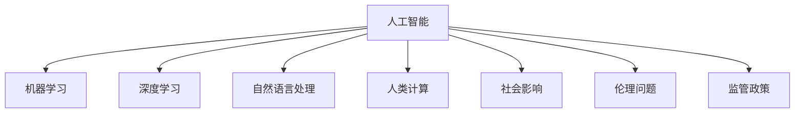

                 

# AI时代的人类计算：社会影响和责任

## 1. 背景介绍

### 1.1 问题由来
随着人工智能(AI)技术的飞速发展，人类计算的方式正在发生深刻变革。从简单的自动化处理到复杂的决策制定，AI技术正在逐步渗透到各个行业和领域。然而，随着AI技术的普及，其社会影响也愈发显著，引发了公众对AI技术的广泛关注和担忧。

在数字化转型的大背景下，AI技术不仅改变了人们的工作和生活方式，还对社会结构、伦理道德、就业结构等产生了深远影响。如何合理应用AI技术，既发挥其潜力又避免潜在的风险，成为了全社会共同面临的重大问题。

### 1.2 问题核心关键点
本文将围绕以下几个关键点探讨AI技术对人类计算的影响及其社会责任：

- AI技术的发展现状与未来趋势
- AI技术在各个行业的应用案例
- AI技术的社会影响与伦理问题
- AI技术的监管与政策建议

## 2. 核心概念与联系

### 2.1 核心概念概述

为更好地理解AI技术在人类计算中的应用，本文将介绍几个核心概念及其相互联系：

- 人工智能(AI)：通过机器学习、深度学习等技术，使计算机能够模拟人类智能行为，包括但不限于图像识别、语音识别、自然语言处理、推荐系统等。

- 机器学习(ML)：一种使计算机能够从数据中学习规律并自动改进的算法，包括监督学习、无监督学习、强化学习等。

- 深度学习(DL)：一种基于神经网络的机器学习技术，具有较强的特征提取和模式识别能力，广泛应用于图像、语音、文本等领域。

- 自然语言处理(NLP)：使计算机能够理解、处理和生成人类语言的学科，是AI技术的重要分支。

- 人类计算：指通过人工智能技术，实现对人类认知智能的模拟和增强，从而提升工作效率、优化决策过程等。

- 社会影响：AI技术在应用过程中，对社会结构、伦理道德、就业结构等方面产生的正面或负面影响。

- 伦理问题：AI技术在应用过程中涉及的隐私保护、数据安全、决策透明度、责任归属等伦理道德问题。

- 监管政策：各国政府和国际组织为规范AI技术应用，制定的法律法规、指导原则等政策框架。

这些核心概念之间的逻辑关系可以通过以下Mermaid流程图来展示：



这个流程图展示的核心概念及其之间的关系：

1. AI技术是整个讨论的基石，通过机器学习、深度学习、自然语言处理等技术，实现人类计算。
2. AI技术对社会结构、伦理道德、就业结构等方面产生影响，引发了广泛的讨论。
3. 伦理问题如隐私保护、数据安全、决策透明度等，是AI技术应用的重大关注点。
4. 政府和国际组织通过监管政策，规范AI技术的合理应用。

## 3. 核心算法原理 & 具体操作步骤
### 3.1 算法原理概述

AI时代的人类计算，核心在于通过AI技术实现对人类智能的模拟和增强。其核心算法原理可以概括为以下几点：

- 数据驱动：AI技术的应用离不开大规模的数据训练。无论是机器学习还是深度学习，都需要通过大量标注数据，让算法学习数据的规律和特征。

- 模型优化：基于数据的训练结果，AI模型需要进行优化和调参，才能得到最优的性能表现。常见的优化方法包括梯度下降、正则化、激活函数等。

- 分布式计算：AI模型的训练和推理往往需要大量的计算资源。分布式计算技术，如大数据平台、GPU/TPU加速等，可以大幅提升计算效率。

- 模型部署：训练好的AI模型需要进行部署和应用，以发挥其社会价值。常见的部署方式包括API服务、Web应用、移动应用等。

### 3.2 算法步骤详解

以下将以深度学习模型在自然语言处理(NLP)领域的应用为例，详细讲解AI技术的具体操作步骤：

1. 数据准备：收集和预处理训练数据，如清洗文本、去除停用词、标注样本等。

2. 模型构建：选择合适的深度学习模型，如RNN、LSTM、Transformer等，并进行模型搭建。

3. 模型训练：使用训练数据对模型进行监督学习或无监督学习，通过反向传播算法更新模型参数。

4. 模型优化：采用优化器如AdamW、SGD等，调整学习率、批大小、迭代轮数等超参数，使模型收敛于最优状态。

5. 模型评估：在验证集上评估模型性能，通过准确率、召回率、F1值等指标衡量模型效果。

6. 模型部署：将训练好的模型部署到生产环境，进行实时推理。

7. 模型监控：实时监控模型运行状态，收集性能指标，及时发现和解决性能问题。

### 3.3 算法优缺点

AI技术在人类计算中的应用具有以下优点：

1. 效率提升：AI技术可以大幅提升数据处理和决策制定的效率，缩短时间和人力成本。

2. 精度提高：通过大量数据的训练，AI模型能够获得高精度的预测结果，减少人为错误。

3. 泛化能力：AI模型通过学习数据规律，具备较强的泛化能力，能够处理复杂多变的情况。

4. 应用广泛：AI技术可以应用于多个领域，如金融、医疗、教育、交通等，带来深远影响。

同时，AI技术也存在以下缺点：

1. 数据依赖：AI技术需要大量高质量的数据训练，数据获取和标注成本较高。

2. 技术壁垒：AI技术需要较高的技术门槛，普通人难以理解和操作。

3. 伦理问题：AI模型可能存在偏见、有害信息等，引发伦理道德问题。

4. 缺乏透明度：AI模型通常被视为“黑盒”系统，难以解释其决策过程。

5. 安全风险：AI模型可能被恶意利用，引发隐私泄露、数据篡改等风险。

### 3.4 算法应用领域

AI技术在各个行业的应用案例如下：

- 医疗领域：通过AI模型进行疾病诊断、病历分析、医学影像识别等，提升医疗服务质量。

- 金融领域：利用AI模型进行风险评估、股票预测、欺诈检测等，增强金融决策的精准性。

- 教育领域：使用AI技术进行学生评估、个性化推荐、智能辅导等，提高教育质量和效率。

- 交通领域：通过AI模型进行交通流量分析、自动驾驶、智能交通管理等，提升交通运行效率。

- 零售领域：利用AI模型进行客户行为分析、商品推荐、库存管理等，优化零售业务。

## 4. 数学模型和公式 & 详细讲解  
### 4.1 数学模型构建

为了更严谨地阐述AI技术在人类计算中的应用，本文将使用数学语言对相关算法进行详细讲解。

以深度学习模型在文本分类任务中的应用为例，模型的输入为文本向量$x \in \mathbb{R}^d$，输出为分类标签$y \in \{0,1\}$。模型的数学模型为：

$$
P(y|x; \theta) = \frac{e^{\theta^T x \cdot y}}{1 + \sum_{i=1}^{n} e^{\theta_i^T x}}
$$

其中$\theta$为模型参数，$n$为类别数。模型的损失函数为交叉熵损失：

$$
\mathcal{L}(y, P(y|x; \theta)) = -y \log P(y|x; \theta) - (1-y) \log (1-P(y|x; \theta))
$$

通过反向传播算法，更新模型参数，最小化损失函数。

### 4.2 公式推导过程

以下以多层感知机(Multilayer Perceptron, MLP)为例，推导其训练过程的数学公式。

假设MLP的输入为$x \in \mathbb{R}^d$，隐藏层数为$L$，隐藏层节点数为$h_1, h_2, \dots, h_L$，输出节点数为$n$。模型的数学模型为：

$$
z^{(l)} = W^{(l)} x^{(l-1)} + b^{(l)}
$$

$$
x^{(l)} = \sigma(z^{(l)})
$$

其中$W^{(l)}$和$b^{(l)}$为第$l$层的权重和偏置。

模型的前向传播过程为：

$$
x^{(0)} = x
$$

$$
x^{(l)} = \sigma(W^{(l)} x^{(l-1)} + b^{(l)})
$$

$$
x^{(L)} = \sigma(W^{(L)} x^{(L-1)} + b^{(L)})
$$

模型的输出层节点数为$n$，因此模型的输出为：

$$
y = \sigma(W^{(L)} x^{(L-1)} + b^{(L)})
$$

模型的损失函数为交叉熵损失：

$$
\mathcal{L}(y, P(y|x; \theta)) = -y \log P(y|x; \theta) - (1-y) \log (1-P(y|x; \theta))
$$

通过反向传播算法，更新模型参数，最小化损失函数。

### 4.3 案例分析与讲解

以BERT模型在情感分析任务中的应用为例，详细讲解其微调过程。

BERT模型的输入为文本向量$x \in \mathbb{R}^{128}$，输出为情感标签$y \in \{-1, 1\}$。模型的数学模型为：

$$
P(y|x; \theta) = \frac{e^{\theta^T x \cdot y}}{1 + \sum_{i=1}^{2} e^{\theta_i^T x}}
$$

其中$\theta$为模型参数。

模型的微调过程分为预训练和微调两个阶段：

1. 预训练：使用大规模无标签文本数据对BERT模型进行预训练，使其学习到通用的语言表示。

2. 微调：使用情感分析任务的有标签数据集，对预训练模型进行微调，使其适应情感分析任务。

微调的数学模型为：

$$
P(y|x; \theta) = \frac{e^{\theta^T x \cdot y}}{1 + \sum_{i=1}^{2} e^{\theta_i^T x}}
$$

其中$\theta$为微调后的模型参数。

微调的损失函数为交叉熵损失：

$$
\mathcal{L}(y, P(y|x; \theta)) = -y \log P(y|x; \theta) - (1-y) \log (1-P(y|x; \theta))
$$

通过反向传播算法，更新模型参数，最小化损失函数。

## 5. 项目实践：代码实例和详细解释说明
### 5.1 开发环境搭建

在进行AI技术的应用开发前，需要准备好开发环境。以下是使用Python进行PyTorch开发的环境配置流程：

1. 安装Anaconda：从官网下载并安装Anaconda，用于创建独立的Python环境。

2. 创建并激活虚拟环境：
```bash
conda create -n pytorch-env python=3.8 
conda activate pytorch-env
```

3. 安装PyTorch：根据CUDA版本，从官网获取对应的安装命令。例如：
```bash
conda install pytorch torchvision torchaudio cudatoolkit=11.1 -c pytorch -c conda-forge
```

4. 安装各类工具包：
```bash
pip install numpy pandas scikit-learn matplotlib tqdm jupyter notebook ipython
```

完成上述步骤后，即可在`pytorch-env`环境中开始AI技术的应用开发。

### 5.2 源代码详细实现

下面我以BERT模型在情感分析任务中的应用为例，给出使用PyTorch进行模型微调的PyTorch代码实现。

首先，定义情感分析任务的数据处理函数：

```python
from transformers import BertTokenizer
from torch.utils.data import Dataset
import torch

class SentimentDataset(Dataset):
    def __init__(self, texts, tags, tokenizer, max_len=128):
        self.texts = texts
        self.tags = tags
        self.tokenizer = tokenizer
        self.max_len = max_len
        
    def __len__(self):
        return len(self.texts)
    
    def __getitem__(self, item):
        text = self.texts[item]
        tags = self.tags[item]
        
        encoding = self.tokenizer(text, return_tensors='pt', max_length=self.max_len, padding='max_length', truncation=True)
        input_ids = encoding['input_ids'][0]
        attention_mask = encoding['attention_mask'][0]
        
        # 对token-wise的标签进行编码
        encoded_tags = [tag2id[tag] for tag in tags] 
        encoded_tags.extend([tag2id['O']] * (self.max_len - len(encoded_tags)))
        labels = torch.tensor(encoded_tags, dtype=torch.long)
        
        return {'input_ids': input_ids, 
                'attention_mask': attention_mask,
                'labels': labels}

# 标签与id的映射
tag2id = {'O': 0, 'POSITIVE': 1, 'NEGATIVE': 2}
id2tag = {v: k for k, v in tag2id.items()}

# 创建dataset
tokenizer = BertTokenizer.from_pretrained('bert-base-cased')

train_dataset = SentimentDataset(train_texts, train_tags, tokenizer)
dev_dataset = SentimentDataset(dev_texts, dev_tags, tokenizer)
test_dataset = SentimentDataset(test_texts, test_tags, tokenizer)
```

然后，定义模型和优化器：

```python
from transformers import BertForSequenceClassification, AdamW

model = BertForSequenceClassification.from_pretrained('bert-base-cased', num_labels=len(tag2id))

optimizer = AdamW(model.parameters(), lr=2e-5)
```

接着，定义训练和评估函数：

```python
from torch.utils.data import DataLoader
from tqdm import tqdm
from sklearn.metrics import classification_report

device = torch.device('cuda') if torch.cuda.is_available() else torch.device('cpu')
model.to(device)

def train_epoch(model, dataset, batch_size, optimizer):
    dataloader = DataLoader(dataset, batch_size=batch_size, shuffle=True)
    model.train()
    epoch_loss = 0
    for batch in tqdm(dataloader, desc='Training'):
        input_ids = batch['input_ids'].to(device)
        attention_mask = batch['attention_mask'].to(device)
        labels = batch['labels'].to(device)
        model.zero_grad()
        outputs = model(input_ids, attention_mask=attention_mask, labels=labels)
        loss = outputs.loss
        epoch_loss += loss.item()
        loss.backward()
        optimizer.step()
    return epoch_loss / len(dataloader)

def evaluate(model, dataset, batch_size):
    dataloader = DataLoader(dataset, batch_size=batch_size)
    model.eval()
    preds, labels = [], []
    with torch.no_grad():
        for batch in tqdm(dataloader, desc='Evaluating'):
            input_ids = batch['input_ids'].to(device)
            attention_mask = batch['attention_mask'].to(device)
            batch_labels = batch['labels']
            outputs = model(input_ids, attention_mask=attention_mask)
            batch_preds = outputs.logits.argmax(dim=2).to('cpu').tolist()
            batch_labels = batch_labels.to('cpu').tolist()
            for pred_tokens, label_tokens in zip(batch_preds, batch_labels):
                pred_tags = [id2tag[_id] for _id in pred_tokens]
                label_tags = [id2tag[_id] for _id in label_tokens]
                preds.append(pred_tags[:len(label_tags)])
                labels.append(label_tags)
                
    print(classification_report(labels, preds))
```

最后，启动训练流程并在测试集上评估：

```python
epochs = 5
batch_size = 16

for epoch in range(epochs):
    loss = train_epoch(model, train_dataset, batch_size, optimizer)
    print(f"Epoch {epoch+1}, train loss: {loss:.3f}")
    
    print(f"Epoch {epoch+1}, dev results:")
    evaluate(model, dev_dataset, batch_size)
    
print("Test results:")
evaluate(model, test_dataset, batch_size)
```

以上就是使用PyTorch对BERT进行情感分析任务微调的完整代码实现。可以看到，得益于Transformers库的强大封装，我们可以用相对简洁的代码完成BERT模型的加载和微调。

### 5.3 代码解读与分析

让我们再详细解读一下关键代码的实现细节：

**SentimentDataset类**：
- `__init__`方法：初始化文本、标签、分词器等关键组件。
- `__len__`方法：返回数据集的样本数量。
- `__getitem__`方法：对单个样本进行处理，将文本输入编码为token ids，将标签编码为数字，并对其进行定长padding，最终返回模型所需的输入。

**tag2id和id2tag字典**：
- 定义了标签与数字id之间的映射关系，用于将token-wise的预测结果解码回真实的标签。

**训练和评估函数**：
- 使用PyTorch的DataLoader对数据集进行批次化加载，供模型训练和推理使用。
- 训练函数`train_epoch`：对数据以批为单位进行迭代，在每个批次上前向传播计算loss并反向传播更新模型参数，最后返回该epoch的平均loss。
- 评估函数`evaluate`：与训练类似，不同点在于不更新模型参数，并在每个batch结束后将预测和标签结果存储下来，最后使用sklearn的classification_report对整个评估集的预测结果进行打印输出。

**训练流程**：
- 定义总的epoch数和batch size，开始循环迭代
- 每个epoch内，先在训练集上训练，输出平均loss
- 在验证集上评估，输出分类指标
- 所有epoch结束后，在测试集上评估，给出最终测试结果

可以看到，PyTorch配合Transformers库使得BERT微调的代码实现变得简洁高效。开发者可以将更多精力放在数据处理、模型改进等高层逻辑上，而不必过多关注底层的实现细节。

当然，工业级的系统实现还需考虑更多因素，如模型的保存和部署、超参数的自动搜索、更灵活的任务适配层等。但核心的微调范式基本与此类似。

## 6. 实际应用场景
### 6.1 智能客服系统

基于AI技术的智能客服系统，已经在各行各业得到广泛应用。传统的客服系统依赖大量人工，高峰期响应慢，且服务质量不稳定。而智能客服系统能够24/7不间断服务，提升客户咨询体验，降低企业成本。

在技术实现上，可以收集企业内部的历史客服对话记录，将问题和最佳答复构建成监督数据，在此基础上对预训练语言模型进行微调。微调后的语言模型能够自动理解用户意图，匹配最合适的答案模板进行回复。对于客户提出的新问题，还可以接入检索系统实时搜索相关内容，动态组织生成回答。如此构建的智能客服系统，能大幅提升客户咨询体验和问题解决效率。

### 6.2 金融舆情监测

金融机构需要实时监测市场舆论动向，以便及时应对负面信息传播，规避金融风险。传统的人工监测方式成本高、效率低，难以应对网络时代海量信息爆发的挑战。基于AI技术的文本分类和情感分析技术，为金融舆情监测提供了新的解决方案。

具体而言，可以收集金融领域相关的新闻、报道、评论等文本数据，并对其进行主题标注和情感标注。在此基础上对预训练语言模型进行微调，使其能够自动判断文本属于何种主题，情感倾向是正面、中性还是负面。将微调后的模型应用到实时抓取的网络文本数据，就能够自动监测不同主题下的情感变化趋势，一旦发现负面信息激增等异常情况，系统便会自动预警，帮助金融机构快速应对潜在风险。

### 6.3 个性化推荐系统

当前的推荐系统往往只依赖用户的历史行为数据进行物品推荐，无法深入理解用户的真实兴趣偏好。基于AI技术的个性化推荐系统，可以更好地挖掘用户行为背后的语义信息，从而提供更精准、多样的推荐内容。

在实践中，可以收集用户浏览、点击、评论、分享等行为数据，提取和用户交互的物品标题、描述、标签等文本内容。将文本内容作为模型输入，用户的后续行为（如是否点击、购买等）作为监督信号，在此基础上微调预训练语言模型。微调后的模型能够从文本内容中准确把握用户的兴趣点。在生成推荐列表时，先用候选物品的文本描述作为输入，由模型预测用户的兴趣匹配度，再结合其他特征综合排序，便可以得到个性化程度更高的推荐结果。

### 6.4 未来应用展望

随着AI技术的不断发展，其应用场景将不断拓展，对人类计算和社会结构产生更深远的影响。

在智慧医疗领域，基于AI技术的医疗问答、病历分析、医学影像识别等应用将提升医疗服务质量，辅助医生诊疗，加速新药开发进程。

在智能教育领域，AI技术可应用于学生评估、个性化推荐、智能辅导等，提高教育质量和效率。

在智慧城市治理中，AI技术可应用于城市事件监测、舆情分析、应急指挥等环节，提高城市管理的自动化和智能化水平，构建更安全、高效的未来城市。

此外，在企业生产、社会治理、文娱传媒等众多领域，基于AI技术的智能应用也将不断涌现，为经济社会发展注入新的动力。相信随着技术的日益成熟，AI技术必将在更广阔的应用领域大放异彩，深刻影响人类的生产生活方式。

## 7. 工具和资源推荐
### 7.1 学习资源推荐

为了帮助开发者系统掌握AI技术在人类计算中的应用，这里推荐一些优质的学习资源：

1. 《深度学习》课程：斯坦福大学开设的深度学习课程，有Lecture视频和配套作业，带你入门深度学习的基本概念和经典模型。

2. CS231n《卷积神经网络》课程：斯坦福大学开设的计算机视觉课程，涵盖深度学习在图像处理中的应用。

3. 《自然语言处理》课程：深度学习在自然语言处理中的应用，包括文本分类、情感分析、机器翻译等。

4. 《计算机视觉》课程：深度学习在计算机视觉中的应用，包括图像分类、目标检测、图像生成等。

5. 《强化学习》课程：深度学习在强化学习中的应用，包括环境建模、策略优化、奖励函数设计等。

6. 《机器学习基础》书籍：全面介绍机器学习的基本概念和常用算法，适合初学者入门。

通过对这些资源的学习实践，相信你一定能够快速掌握AI技术在人类计算中的应用，并用于解决实际的AI问题。
###  7.2 开发工具推荐

高效的开发离不开优秀的工具支持。以下是几款用于AI技术开发的常用工具：

1. PyTorch：基于Python的开源深度学习框架，灵活动态的计算图，适合快速迭代研究。大多数深度学习模型都有PyTorch版本的实现。

2. TensorFlow：由Google主导开发的开源深度学习框架，生产部署方便，适合大规模工程应用。同样有丰富的预训练语言模型资源。

3. Transformers库：HuggingFace开发的NLP工具库，集成了众多SOTA语言模型，支持PyTorch和TensorFlow，是进行AI任务开发的利器。

4. Weights & Biases：模型训练的实验跟踪工具，可以记录和可视化模型训练过程中的各项指标，方便对比和调优。与主流深度学习框架无缝集成。

5. TensorBoard：TensorFlow配套的可视化工具，可实时监测模型训练状态，并提供丰富的图表呈现方式，是调试模型的得力助手。

6. Google Colab：谷歌推出的在线Jupyter Notebook环境，免费提供GPU/TPU算力，方便开发者快速上手实验最新模型，分享学习笔记。

合理利用这些工具，可以显著提升AI技术的应用开发效率，加快创新迭代的步伐。

### 7.3 相关论文推荐

AI技术在各个领域的应用，离不开学界的持续研究。以下是几篇奠基性的相关论文，推荐阅读：

1. ImageNet分类问题: Deep convolutional networks for large-scale image recognition：提出了卷积神经网络(CNN)在图像分类中的应用，奠定了深度学习在计算机视觉领域的基础。

2. Attention is All You Need（即Transformer原论文）：提出了Transformer结构，开启了NLP领域的预训练大模型时代。

3. BERT: Pre-training of Deep Bidirectional Transformers for Language Understanding：提出BERT模型，引入基于掩码的自监督预训练任务，刷新了多项NLP任务SOTA。

4. Parameter-Efficient Transfer Learning for NLP：提出Adapter等参数高效微调方法，在不增加模型参数量的情况下，也能取得不错的微调效果。

5. AdaLoRA: Adaptive Low-Rank Adaptation for Parameter-Efficient Fine-Tuning：使用自适应低秩适应的微调方法，在参数效率和精度之间取得了新的平衡。

这些论文代表了大语言模型微调技术的发展脉络。通过学习这些前沿成果，可以帮助研究者把握学科前进方向，激发更多的创新灵感。

## 8. 总结：未来发展趋势与挑战

### 8.1 总结

本文对AI技术在人类计算中的应用进行了全面系统的介绍。首先阐述了AI技术的发展现状与未来趋势，明确了AI技术在各个行业的应用案例。其次，探讨了AI技术的社会影响与伦理问题，指出其在社会结构、伦理道德、就业结构等方面的影响。最后，提出了AI技术的监管与政策建议，强调了建立公平、透明、安全的AI应用的重要性。

通过本文的系统梳理，可以看到，AI技术在各个领域的应用正在不断拓展，其社会影响也愈发显著。AI技术能够提升工作效率、优化决策过程，但也可能带来隐私泄露、数据篡改等风险。如何合理应用AI技术，既发挥其潜力又避免潜在的风险，是当前全社会共同面临的重大问题。

### 8.2 未来发展趋势

展望未来，AI技术在人类计算中的应用将呈现以下几个发展趋势：

1. 模型规模持续增大。随着算力成本的下降和数据规模的扩张，预训练语言模型的参数量还将持续增长。超大规模语言模型蕴含的丰富语言知识，有望支撑更加复杂多变的下游任务微调。

2. 模型泛化能力增强。通过更多的数据和更复杂的模型结构，AI模型的泛化能力将进一步提升，能够处理更复杂的任务和更广泛的场景。

3. 模型可解释性提高。未来的AI模型将更加透明和可解释，便于理解和调试。这将有助于解决伦理和道德问题，增强公众对AI技术的信任。

4. 跨模态融合加速。AI模型将能够融合多种数据类型，包括文本、图像、语音等，实现多模态信息的协同建模，提升任务性能。

5. 自监督和弱监督学习发展。未来的AI模型将更多地利用无监督和弱监督学习方法，提升模型的泛化能力和鲁棒性。

6. 联邦学习和边缘计算普及。未来的AI模型将更多地采用联邦学习和边缘计算技术，保护数据隐私，提升计算效率。

以上趋势凸显了AI技术在人类计算中的巨大潜力。这些方向的探索发展，必将进一步提升AI系统的性能和应用范围，为社会带来更深远的影响。

### 8.3 面临的挑战

尽管AI技术在人类计算中的应用前景广阔，但在迈向更加智能化、普适化应用的过程中，仍面临诸多挑战：

1. 数据获取和标注成本高昂。高质量的标注数据是AI技术的基础，获取和标注成本较高。如何降低数据成本，提高数据质量，是当前的一个重要研究方向。

2. 算法复杂度较高。AI模型通常需要复杂的算法进行优化，难以在普通设备上实现实时处理。如何优化算法，提升计算效率，仍是当前的一个重要研究方向。

3. 伦理和道德问题复杂。AI模型的应用可能引发隐私保护、数据安全、决策透明度等伦理道德问题。如何制定合理的伦理框架，保障数据和模型的安全，是当前的一个重要研究方向。

4. 社会适应性不足。AI技术在应用过程中可能对社会结构、就业结构等产生深远影响，引发社会适应性问题。如何平衡技术发展和社会适应，是当前的一个重要研究方向。

5. 监管政策滞后。当前的AI技术发展速度快，但监管政策相对滞后，难以跟上技术发展的步伐。如何建立有效的监管政策，保障AI技术的健康发展，是当前的一个重要研究方向。

### 8.4 研究展望

未来的AI研究需要在以下几个方面寻求新的突破：

1. 研究无监督和半监督学习算法。摆脱对大规模标注数据的依赖，利用自监督学习、主动学习等无监督和半监督范式，最大限度利用非结构化数据，实现更加灵活高效的模型微调。

2. 研究更加高效的模型结构。优化现有模型结构，降低计算复杂度，提升计算效率。同时研究新的模型结构，提升模型的泛化能力和鲁棒性。

3. 研究更加透明和可解释的模型。开发更加透明和可解释的AI模型，便于理解和调试，解决伦理和道德问题。

4. 研究多模态融合技术。开发能够融合多种数据类型的AI模型，实现多模态信息的协同建模，提升任务性能。

5. 研究联邦学习和边缘计算技术。开发能够保护数据隐私，提升计算效率的AI模型和算法，提升模型的社会适应性和普适性。

6. 研究跨学科协作。AI技术的研究需要跨学科协作，结合计算机科学、数学、统计学、伦理学等多个领域的知识，才能全面解决AI技术在各个领域的应用问题。

这些研究方向的探索，必将引领AI技术迈向更高的台阶，为构建公平、透明、安全的智能系统铺平道路。面向未来，AI技术还需要与其他人工智能技术进行更深入的融合，如知识表示、因果推理、强化学习等，多路径协同发力，共同推动人工智能技术的发展。只有勇于创新、敢于突破，才能不断拓展AI技术的边界，让智能技术更好地造福人类社会。

## 9. 附录：常见问题与解答

**Q1：AI技术在各个行业的应用现状如何？**

A: AI技术在各个行业的应用已经初见成效，具体表现如下：

1. 医疗领域：AI技术在医学影像分析、疾病诊断、病历分析等方面取得了显著成果，提升了医疗服务的质量和效率。

2. 金融领域：AI技术在风险评估、股票预测、欺诈检测等方面展现了强大的能力，提升了金融决策的精准性。

3. 教育领域：AI技术在学生评估、个性化推荐、智能辅导等方面展示了巨大的潜力，提高了教育质量和效率。

4. 交通领域：AI技术在交通流量分析、自动驾驶、智能交通管理等方面取得了突破，提升了交通运行效率。

5. 零售领域：AI技术在客户行为分析、商品推荐、库存管理等方面展现了强大的能力，优化了零售业务。

**Q2：AI技术对社会结构的影响有哪些？**

A: AI技术对社会结构的影响主要体现在以下几个方面：

1. 就业结构变化：AI技术替代了一些重复性高、技能要求低的工作，增加了对高技能人才的需求。

2. 社会治理方式变革：AI技术可以用于城市事件监测、舆情分析、应急指挥等，提高社会治理的自动化和智能化水平。

3. 数据安全风险：AI技术依赖大量数据，数据安全问题成为重要关注点。

4. 隐私保护挑战：AI技术在应用过程中可能侵犯个人隐私，引发隐私保护问题。

5. 伦理道德问题：AI技术的应用可能引发伦理道德问题，如决策透明度、责任归属等。

**Q3：AI技术在应用过程中如何避免伦理问题？**

A: AI技术在应用过程中，避免伦理问题的关键在于：

1. 制定合理的伦理框架：建立透明的伦理框架，明确AI技术的边界和使用场景。

2. 确保数据隐私保护：采用数据加密、匿名化等技术，保护用户隐私。

3. 提高模型透明度：开发透明和可解释的AI模型，便于理解和调试，解决伦理和道德问题。

4. 设置合理的使用限制：在AI系统的设计和应用过程中，设置合理的使用限制，避免滥用AI技术。

5. 建立伦理委员会：成立独立的伦理委员会，对AI技术的开发和应用进行监督和评估。

这些措施可以有效避免AI技术在应用过程中引发的伦理问题，保障技术的健康发展。

**Q4：AI技术在应用过程中如何应对数据获取和标注成本高昂的问题？**

A: 应对数据获取和标注成本高昂的问题，可以采取以下措施：

1. 利用无监督和半监督学习：摆脱对大规模标注数据的依赖，利用自监督学习、主动学习等无监督和半监督范式，最大限度利用非结构化数据，实现更加灵活高效的模型微调。

2. 数据生成技术：采用数据生成技术，如GAN、VAE等，生成更多数据，降低数据获取成本。

3. 弱监督学习：利用弱监督学习，如标签噪声鲁棒性训练，提高模型对不完美标注数据的鲁棒性。

4. 小样本学习：开发小样本学习算法，利用少量标注数据，训练高质量的模型。

5. 数据共享机制：建立数据共享机制，促进数据资源的共享和开放，降低数据获取成本。

这些措施可以有效应对数据获取和标注成本高昂的问题，提高AI技术的应用效率。

**Q5：AI技术在应用过程中如何提升模型的可解释性？**

A: 提升AI模型的可解释性，可以采取以下措施：

1. 开发可解释模型：采用可解释性模型，如决策树、规则系统等，便于理解和调试。

2. 可视化工具：开发可视化工具，如TensorBoard、ONNX等，实时监测模型的训练状态和推理过程，便于分析和优化。

3. 解释算法：采用解释算法，如LIME、SHAP等，分析模型的决策过程，提供可解释的输出。

4. 透明设计：在模型的设计和开发过程中，注重透明性和可解释性，便于用户理解和信任。

5. 用户反馈机制：建立用户反馈机制，收集用户对AI模型输出的意见和建议，不断改进和优化。

这些措施可以有效提升AI模型的可解释性，增强公众对AI技术的信任。

---

作者：禅与计算机程序设计艺术 / Zen and the Art of Computer Programming

