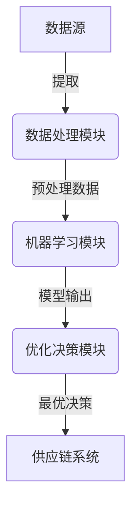

以下是技术博客文章的正文内容：

# AI代理在供应链管理中的工作流优化实践

## 1. 背景介绍

### 1.1 问题的由来

在当今快节奏的商业环境中，供应链管理扮演着至关重要的角色。它确保货物和服务能够高效、可靠地从供应商流向客户。然而,传统的供应链管理系统面临诸多挑战,例如:

- 复杂的物流网络和多层次供应商关系
- 来自多个渠道的大量数据需要整合和分析
- 需要快速响应市场变化并优化运营流程
- 人工决策过程效率低下且容易出错

这些挑战使得供应链管理变得越来越困难,需要更智能、更高效的解决方案来提高运营效率和决策质量。

### 1.2 研究现状 

近年来,人工智能(AI)技术在供应链管理领域得到了广泛应用,取得了令人瞩目的成就。AI代理系统通过机器学习、优化算法等技术自动分析大量数据,从中发现模式和规律,并提出优化建议。

目前的研究主要集中在以下几个方面:

- 需求预测:利用历史数据和外部因素预测未来需求
- 库存优化:确定最佳库存水平以满足需求并降低成本
- 路线规划:规划高效的运输路线以节省时间和燃料
- 异常检测:及时发现供应链中的异常情况并采取应对措施

尽管取得了一些进展,但将AI代理系统应用于复杂供应链环境仍面临诸多挑战,需要进一步研究和创新。

### 1.3 研究意义

成功应用AI代理技术优化供应链工作流程,可以带来以下重要意义:

- 提高运营效率,降低成本
- 提升决策质量,减少人为错误
- 快速响应市场变化,保持竞争优势
- 挖掘数据价值,发现新的商机

本文将深入探讨如何将AI代理系统融入供应链管理,并介绍具体的优化实践,为读者提供宝贵的理论基础和实践经验。

### 1.4 本文结构

本文共分为9个部分:

1. 背景介绍
2. 核心概念与联系
3. 核心算法原理与具体操作步骤
4. 数学模型和公式详细讲解与举例说明  
5. 项目实践:代码实例和详细解释说明
6. 实际应用场景
7. 工具和资源推荐
8. 总结:未来发展趋势与挑战
9. 附录:常见问题与解答

## 2. 核心概念与联系

在介绍AI代理在供应链管理中的应用之前,我们先来了解一些核心概念及它们之间的联系。

**供应链管理(SCM)**: 指企业与供应商、运输商、分销商、零售商等上下游合作伙伴之间,在物资采购、生产、库存管理、配送等环节的有效整合和优化。

**工作流程(Workflow)**: 指为完成特定任务而设计的一系列有序活动。在供应链管理中,典型的工作流程包括订单处理、采购、生产计划、库存管理、运输等。

**人工智能代理(AI Agent)**: 指能够感知环境、分析数据、做出决策并执行行动的智能系统。在供应链管理中,AI代理可用于优化各种工作流程。

**机器学习(Machine Learning)**: 赋予计算机从数据中自主学习并做出预测的能力。在供应链管理中,机器学习可用于需求预测、异常检测等任务。

**优化算法(Optimization Algorithms)**: 旨在找到满足特定条件的最优解的一系列计算步骤。在供应链管理中,常用的优化算法包括线性规划、整数规划、启发式算法等。

这些概念相互关联、环环相扣。AI代理系统通过机器学习算法从供应链数据中学习,再结合优化算法对工作流程进行优化决策,从而提高整个供应链系统的运营效率。

## 3. 核心算法原理与具体操作步骤  

### 3.1 算法原理概述

应用AI代理优化供应链工作流程的核心算法主要包括三个部分:

1. **数据处理模块**: 从各个来源收集供应链相关数据,并进行清洗、整合、标准化等预处理,为后续分析做好准备。

2. **机器学习模块**: 利用预处理后的数据,训练各种机器学习模型,如需求预测模型、异常检测模型等。这些模型将为优化决策提供依据。

3. **优化决策模块**: 将机器学习模型的输出结果与其他约束条件相结合,利用优化算法得到各个工作流程的最优解,并将决策执行到供应链系统中。

### 3.2 算法步骤详解  

1. **数据收集与预处理**
    - 从ERP、WMS、CRM等系统提取原始数据
    - 数据清洗:处理缺失值、异常值、重复数据等
    - 数据标准化:将数据转换为统一格式
    - 数据集成:将来自不同源的数据合并

2. **建立机器学习模型**
    - 划分训练集和测试集
    - 选择合适的机器学习算法,如决策树、神经网络等
    - 训练模型,调整超参数
    - 在测试集上评估模型性能,必要时重新训练

3. **构建优化模型**
    - 确定决策变量
    - 列出目标函数,如最小化成本、最大化利润等
    - 添加约束条件,如资源限制、时间窗口等
    - 选择合适的优化算法,如线性规划、整数规划等

4. **模型求解与决策执行** 
    - 将机器学习模型输出作为优化模型的输入
    - 运行优化算法求解最优解
    - 将最优决策方案应用到供应链系统的各个环节

5. **监控与反馈**
    - 持续监控决策执行效果
    - 收集新的数据,更新机器学习模型
    - 重新运行优化模型,进行下一轮决策

该算法通过机器学习和优化相结合的方式,能够自动分析海量数据,并为供应链管理的各个环节提供高效、科学的决策支持。

### 3.3 算法优缺点

**优点**:

- 能够处理大规模、高维度的复杂数据
- 通过机器学习发现人工难以觉察的数据模式
- 优化算法保证决策方案的最优性
- 自动化决策过程,提高效率,减少人为错误
- 能够快速响应数据变化,持续优化

**缺点**:

- 需要大量的历史数据用于训练机器学习模型
- 模型的性能很大程度上依赖于数据质量
- 复杂的优化模型求解过程计算量大
- 模型解释性不足,决策过程不够透明
- 系统构建和维护成本较高

### 3.4 算法应用领域

AI代理优化算法可应用于供应链管理的多个领域:

- **需求预测**: 基于历史销售数据、促销活动、天气等因素,预测未来的产品需求量。
- **库存控制**: 确定最佳库存水平,满足需求同时降低库存成本。
- **订单处理**: 优化订单分配、装箱及路线规划,提高订单履行效率。
- **运输调度**: 合理安排车辆路线和装载计划,降低运输成本。
- **供应商管理**: 根据供应商历史表现、产品质量等评估并选择最佳供应商。
- **异常检测**: 及时发现供应链中的异常情况,如缺货、延误等,并采取应对措施。

总的来说,AI代理优化算法可以渗透到供应链管理的方方面面,为各个环节提供智能化决策支持。

## 4. 数学模型和公式详细讲解与举例说明

### 4.1 数学模型构建

在供应链管理优化中,我们通常需要建立数学模型来刻画目标、变量和约束条件。一个典型的供应链优化模型可表示为:

$$
\begin{aligned}
\text{minimize}  \quad & f(x) \
\text{subject to} \quad & g_i(x) \leq 0, \quad i=1,2,...,m \
                       & h_j(x) = 0, \quad j=1,2,...,p
\end{aligned}
$$

其中:

- $f(x)$是要优化(最小化或最大化)的目标函数,如总成本、总利润等
- $x$是决策变量向量,如供应商选择、订单分配等
- $g_i(x) \leq 0$是不等式约束条件,如库存上限、预算限制等
- $h_j(x) = 0$是等式约束条件,如供需平衡等

通过数学建模,我们将供应链优化问题转化为求解约束条件下的最优解的问题。

### 4.2 公式推导过程

以库存优化为例,我们来看看如何建立数学模型。假设有n种产品,目标是最小化总库存成本,包括库存持有成本和缺货惩罚成本。

首先定义变量:

- $x_i$: 第i种产品的期末库存量
- $c_i$: 第i种产品的单位库存持有成本
- $p_i$: 第i种产品的单位缺货惩罚成本
- $d_i$: 第i种产品的需求量

则目标函数为:

$$\min \sum_{i=1}^n c_i x_i + p_i \max(0, d_i - x_i)$$

其次是约束条件:

- 非负性约束: $x_i \geq 0$  
- 库存上限约束: $x_i \leq M_i$

将约束代入,我们得到如下数学模型:

$$
\begin{aligned}
\min \quad & \sum_{i=1}^n c_i x_i + p_i \max(0, d_i - x_i) \
\text{s.t.} \quad & x_i \geq 0, \quad i=1,2,...,n \
             & x_i \leq M_i, \quad i=1,2,...,n
\end{aligned}
$$

这是一个线性规划模型,可以通过简单有效的算法求解。

### 4.3 案例分析与讲解

现在我们用一个实际案例来分析上述库存优化模型。假设一家零售商销售3种产品,相关数据如下:

| 产品 | 需求量 | 单位持有成本 | 单位缺货惩罚 | 库存上限 |
|------|--------|--------------|--------------|----------|
| A    | 200    | 5            | 50           | 300      |
| B    | 150    | 8            | 80           | 250      |  
| C    | 180    | 6            | 70           | 280      |

将数据代入模型:

$$
\begin{aligned}
\min \quad & 5x_1 + 50\max(0, 200-x_1) + 8x_2 + 80\max(0, 150-x_2) \
           & + 6x_3 + 70\max(0, 180-x_3) \
\text{s.t.} \quad & x_1 \geq 0, \quad x_1 \leq 300 \
             & x_2 \geq 0, \quad x_2 \leq 250 \
             & x_3 \geq 0, \quad x_3 \leq 280
\end{aligned}
$$

通过求解,我们得到最优库存量为:$x_1^* = 200, x_2^* = 150, x_3^* = 180$,总成本最小为$200 \times 5 + 150 \times 8 + 180 \times 6 = 3300$。

这个结果合乎直觉:对于每种产品,如果库存量小于需求量,那么缺货惩罚成本会远高于持有成本,因此最优策略是满足全部需求。

通过这个例子,我们可以直观地看到数学模型如何刻画现实问题,以及如何求解获得最优决策。在实际应用中,模型会更加复杂,但原理是相似的。

### 4.4 常见问题解答

**Q: 如何处理随时间动态变化的需求?**

A: 我们可以将时间因素引入模型,