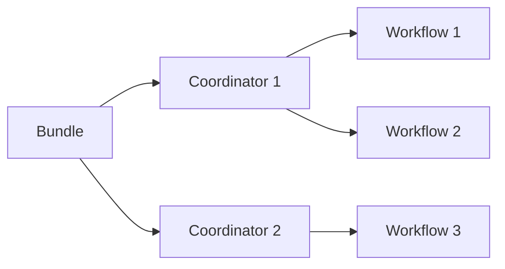
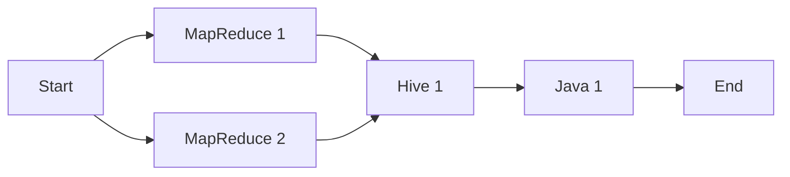

# Oozie原理与代码实例讲解

关键词：Oozie、工作流调度、Hadoop生态系统、有向无环图DAG、Coordinator、Bundle、Workflow

## 1. 背景介绍
### 1.1  问题的由来
随着大数据技术的发展，Hadoop生态系统日益丰富和完善。在海量数据的处理过程中，工作流调度系统扮演着至关重要的角色。Oozie作为Hadoop生态圈中的重要组件，为用户提供了一个可扩展、可靠、易于使用的工作流调度系统。
### 1.2  研究现状
目前业界已经有多个工作流调度系统，如Azkaban、Airflow等。而Oozie作为Apache顶级项目，与Hadoop紧密集成，支持多种类型的Hadoop作业，在工作流调度领域占据重要地位。越来越多的公司选择Oozie来调度和管理复杂的数据处理流程。
### 1.3  研究意义
深入研究Oozie的原理和使用方法，对于更好地应用工作流调度系统、优化数据处理流程、提升作业运行效率具有重要意义。同时也有助于我们理解整个Hadoop生态系统的协作机制。
### 1.4  本文结构
本文将从Oozie的核心概念出发，详细阐述其工作原理，并通过代码实例讲解Oozie的使用方法。全文分为9个章节，涵盖背景介绍、核心概念、原理讲解、数学建模、代码实践、应用场景、工具推荐、未来展望、常见问题等方面。

## 2. 核心概念与联系
Oozie的核心是工作流(Workflow)的概念，它定义了一系列的动作(Action)，比如Hadoop MapReduce、Pig、Hive等作业，以有向无环图(DAG)的方式组织起来。

除了Workflow，Oozie还引入了Coordinator和Bundle的概念：
- Coordinator用于定义基于时间触发的Workflow，比如每天定时执行一个Workflow
- Bundle则是多个Coordinator的集合，用于管理一组相关的Coordinator

下图展示了Workflow、Coordinator、Bundle三者之间的关系：



## 3. 核心算法原理 & 具体操作步骤
### 3.1  算法原理概述
Oozie的核心是如何调度和执行一个Workflow。当用户提交一个Workflow后，Oozie会解析Workflow定义，生成一个DAG，然后根据DAG来调度和执行各个Action。
### 3.2  算法步骤详解
1. 用户通过Oozie Client提交Workflow定义（通常是一个XML文件）
2. Oozie Server解析Workflow定义，生成DAG
3. Oozie根据DAG调度执行各个Action：
   - 对于MapReduce Action，提交到YARN执行
   - 对于Pig、Hive Action，生成对应的脚本提交执行
   - 对于Java Action，执行指定的Java类
   - 对于Shell Action，执行Shell脚本
4. 各个Action执行完成后，触发下一个Action
5. 所有Action都执行成功，则Workflow执行成功；如果有Action失败，则Workflow失败
### 3.3  算法优缺点
优点：
- 支持多种类型的Hadoop作业，与Hadoop生态系统无缝集成
- 可视化的DAG，便于理解和监控Workflow执行情况
- 基于XML的Workflow定义，可读性好，易于编写
- 可扩展性好，支持自定义Action

缺点：
- XML配置比较繁琐，缺乏更高层的抽象
- 调度能力比较简单，不如Azkaban、Airflow等专业的调度系统
### 3.4  算法应用领域
Oozie广泛应用于各种数据处理场景，比如日志分析、数据仓库ETL、机器学习等。任何需要使用Hadoop进行数据处理，且有工作流调度需求的场景，都可以使用Oozie。

## 4. 数学模型和公式 & 详细讲解 & 举例说明
### 4.1  数学模型构建
Oozie的数学模型可以抽象为一个有向无环图(DAG)。设Workflow有$n$个Action，则Workflow可以表示为:
$$G=(V,E)$$
其中，$V$表示顶点的集合，每个顶点对应一个Action；$E$表示有向边的集合，如果Action $i$ 执行完可以触发Action $j$，则存在一条从$i$到$j$的有向边。
### 4.2  公式推导过程
基于上述DAG模型，可以推导出以下定理：
1. Workflow必须是有向无环图，否则可能存在死循环。设 $G$ 的邻接矩阵为 $A$，则 $A$ 的幂次 $A^n$ 必须为 $0$ 矩阵。
2. 设 $d(i)$ 表示顶点 $i$ 的入度，则当且仅当 $d(i)=0$ 时，Action $i$ 才能执行。
3. Workflow执行时间取决于关键路径。设 $l(i,j)$ 表示从顶点 $i$ 到 $j$ 的最长路径长度，则Workflow的最短执行时间为 $\max_{i,j} l(i,j)$。
### 4.3  案例分析与讲解
举一个简单的Workflow示例：

该Workflow包含5个Action，构成一个DAG。其邻接矩阵为：
$$
A=\begin{bmatrix}
0 & 1 & 1 & 0 & 0 & 0\
0 & 0 & 0 & 1 & 0 & 0\
0 & 0 & 0 & 1 & 0 & 0\
0 & 0 & 0 & 0 & 1 & 0\
0 & 0 & 0 & 0 & 0 & 1\
0 & 0 & 0 & 0 & 0 & 0\
\end{bmatrix}
$$
可以验证 $A^6=0$，满足有向无环图的条件。
该Workflow的关键路径为 Start -> MapReduce 1 -> Hive 1 -> Java 1 -> End，最短执行时间为这4个Action的执行时间之和。
### 4.4  常见问题解答
问：Oozie的DAG是否允许存在环？
答：不允许，否则可能导致死循环。Oozie在解析Workflow定义时会检查是否存在环。

问：Oozie如何判断一个Action是否可以执行？
答：根据DAG模型，当一个Action的所有前置Action都执行完成时，该Action才能执行。Oozie会实时监控每个Action的状态，并触发后续Action。

## 5. 项目实践：代码实例和详细解释说明
### 5.1  开发环境搭建
1. 安装JDK，配置JAVA_HOME环境变量
2. 安装Hadoop集群，包括HDFS、YARN、MapReduce等组件
3. 下载Oozie安装包，解压到某个目录
4. 配置Oozie，修改conf/oozie-site.xml，指定Hadoop配置等
5. 初始化Oozie数据库，可以使用Derby或MySQL
6. 启动Oozie服务，执行bin/oozie-start.sh
### 5.2  源代码详细实现
下面以一个简单的MapReduce Workflow为例，演示Oozie的使用方法。
1. 创建Workflow配置文件 workflow.xml
```xml
<workflow-app xmlns="uri:oozie:workflow:0.5" name="map-reduce-wf">
    <start to="mr-node"/>
    <action name="mr-node">
        <map-reduce>
            <job-tracker>${jobTracker}</job-tracker>
            <name-node>${nameNode}</name-node>
            <configuration>
                <property>
                    <name>mapred.mapper.class</name>
                    <value>org.apache.oozie.example.SampleMapper</value>
                </property>
                <property>
                    <name>mapred.reducer.class</name>
                    <value>org.apache.oozie.example.SampleReducer</value>
                </property>
                <property>
                    <name>mapred.input.dir</name>
                    <value>/user/${wf:user()}/input</value>
                </property>
                <property>
                    <name>mapred.output.dir</name>
                    <value>/user/${wf:user()}/output</value>
                </property>
            </configuration>
        </map-reduce>
        <ok to="end"/>
        <error to="fail"/>
    </action>
    <kill name="fail">
        <message>Map/Reduce failed, error message[${wf:errorMessage(wf:lastErrorNode())}]</message>
    </kill>
    <end name="end"/>
</workflow-app>
```
2. 创建Job配置文件 job.properties
```properties
nameNode=hdfs://localhost:8020
jobTracker=localhost:8021
oozie.wf.application.path=${nameNode}/user/${user.name}/map-reduce-workflow
```
3. 将Workflow和Job配置文件上传到HDFS
```shell
hadoop fs -put workflow.xml /user/${user.name}/map-reduce-workflow
hadoop fs -put job.properties /user/${user.name}/map-reduce-workflow
```
4. 提交Workflow作业
```shell
oozie job -config job.properties -run
```
5. 查看作业状态
```shell
oozie job -info <job-id>
```
### 5.3  代码解读与分析
Workflow配置文件定义了一个MapReduce作业，其中：
- `<start>`指定开始节点
- `<action>`定义一个MapReduce Action，指定mapper、reducer类，以及输入输出目录等
- `<ok>`和`<error>`指定执行成功和失败后的转移
- `<kill>`定义作业失败时的Kill节点
- `<end>`定义结束节点

Job配置文件中指定了HDFS和MapReduce的访问地址，以及Workflow配置文件在HDFS上的位置。

提交作业时，Oozie会根据配置文件生成DAG并开始执行。可以通过`oozie job -info`命令查看作业执行状态。
### 5.4  运行结果展示
作业执行成功后，可以在HDFS的`/user/${user.name}/output`目录查看MapReduce的输出结果。

在Oozie Web UI上可以看到作业的DAG视图和执行状态：


## 6. 实际应用场景
Oozie在实际数据处理流程中有广泛应用，一些典型场景包括：
1. 数据仓库ETL
   可以使用Oozie编排Hive、Sqoop等组件，完成数据的抽取、转换、加载过程。
2. 日志分析流程
   通过Oozie调度一系列MapReduce、Pig作业，对原始日志数据进行清洗、转换、聚合分析，生成结构化的数据和统计报表。
3. 机器学习训练流程
   使用Oozie编排数据预处理、特征工程、模型训练、模型评估等步骤，自动化机器学习训练流程。
### 6.4  未来应用展望
随着大数据平台的发展，Oozie有望与更多的计算框架和存储系统集成，支持更加多样化的作业类型。同时Oozie也在不断优化性能、改进用户体验，未来有望成为大数据工作流调度的主流方案之一。

## 7. 工具和资源推荐
### 7.1  学习资源推荐
1. 官方文档：https://oozie.apache.org/docs/4.3.1/
2. Oozie Cookbook：https://www.oreilly.com/library/view/oozie-cookbook/9781449369910/
3. Oozie教程：https://www.tutorialspoint.com/apache_oozie/
### 7.2  开发工具推荐
1. Oozie Eclipse Plugin：https://oozie.apache.org/docs/4.3.1/DG_EclipsePlugin.html
2. Hue Oozie Editor：https://gethue.com/apache-oozie-workflow-coordinator-bundle-editors/
### 7.3  相关论文推荐
1. Oozie: Towards a Scalable Workflow Management System for Hadoop. Mohammad Islam, Angelo K. Huang, Mohamed Battisha, Michelle Chiang, Santhosh Srinivasan, Craig Peters, Andreas Neumann, and Alejandro Abdelnur. 2012 ACM SIGMOD Workshop on Scalable Workflow Execution Engines and Technologies (SWEET'12)
2. Scaling Advanced Workflow Management System Utilizing Cloud Services. Yogesh L Simmhan, Lavanya Ramakrishnan. 2011 IEEE World Congress on Services
### 7.4  其他资源推荐
1. Oozie Github仓库：https://github.com/apache/oozie
2. Oozie邮件列表