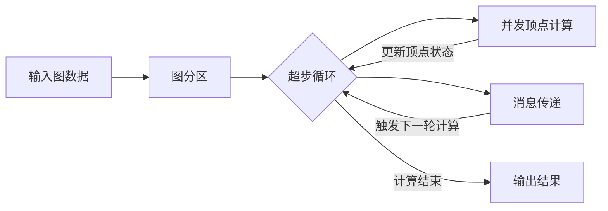
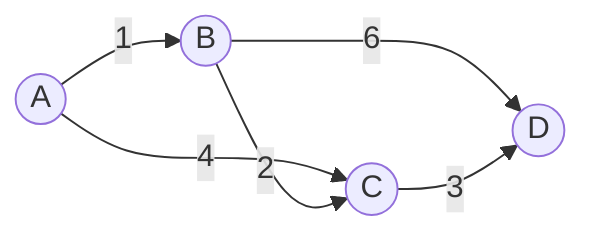

# Pregel原理与代码实例讲解

## 1. 背景介绍
### 1.1 问题的由来
在大数据时代,越来越多的应用需要处理大规模的图数据,例如社交网络分析、Web 图分析、交通网络优化等。然而,传统的图处理算法很难在海量数据的场景下实现高效计算。为了应对这一挑战,Google 在 2010 年提出了一种大规模图数据并行计算模型——Pregel。
### 1.2 研究现状
Pregel 模型发表以来,受到学术界和工业界的广泛关注。众多知名大数据计算框架如 Apache Giraph、GPS、Mizan 等都是基于 Pregel 模型实现的。目前对 Pregel 的研究主要集中在性能优化、容错机制、动态图处理等方面。
### 1.3 研究意义
深入理解 Pregel 模型的原理和应用,对于设计和实现高效的大规模图计算系统具有重要意义。通过 Pregel,可以方便地在分布式集群上实现复杂的图算法,极大提升图数据的处理效率。
### 1.4 本文结构
本文将首先介绍 Pregel 的核心概念和基本原理,然后详细讲解 Pregel 的计算过程和优化技术。接着,我们将通过一个具体的算法实例来演示如何使用 Pregel 进行图计算。最后,总结 Pregel 的特点并展望其未来的发展方向。

## 2. 核心概念与联系
Pregel 是一个基于 BSP (Bulk Synchronous Parallel) 并行计算模型的大规模图处理框架。其核心概念包括:

- 图 (Graph):由顶点 (Vertex) 和边 (Edge) 组成的数据结构
- 顶点 (Vertex):图的基本单元,包含唯一的 ID 和用户自定义的数据
- 边 (Edge):连接顶点的有向边,可以携带权重信息
- 消息 (Message):顶点之间传递的数据,用于协调计算过程
- 超步 (Superstep):Pregel 计算的基本单位,由多个并发的顶点计算和消息传递组成

在 Pregel 中,图被划分成多个分区 (Partition),分布在不同的计算节点上。每个分区包含一部分顶点和相关的出边。Pregel 通过迭代的方式进行计算,每一轮迭代称为一个超步。在每个超步中,所有的顶点并发执行用户自定义的计算函数,并通过消息与其他顶点通信。当没有顶点需要计算且没有消息传递时,整个计算过程结束。

下图展示了 Pregel 的基本架构和计算流程:



## 3. 核心算法原理 & 具体操作步骤
### 3.1 算法原理概述
Pregel 的计算过程可以概括为"分治 + 迭代"的思想。它将大规模图划分为多个子图,并在每个子图上并发执行用户自定义的计算逻辑。同时,通过迭代的方式不断更新顶点状态,直到达到全局终止条件。
### 3.2 算法步骤详解
1. 输入图数据并构建图分区
2. 初始化所有顶点的状态
3. 开始超步迭代:
   a. 并发执行每个活跃顶点的计算函数
   b. 将生成的消息发送给目标顶点
   c. 同步消息并触发下一轮超步
4. 如果没有活跃顶点且没有未处理的消息,终止计算
5. 输出计算结果
### 3.3 算法优缺点
Pregel 的主要优点包括:

- 编程模型简单,用户只需关注顶点的计算逻辑
- 易于在分布式环境下实现,具有良好的可扩展性
- 采用 BSP 模型,避免了消息传递的死锁问题

但 Pregel 也存在一些局限性:

- 同步的迭代模式会带来一定的性能开销
- 对于异步算法(如 PageRank)需要进行适配
- 动态图的处理较为复杂,需要引入额外的机制

### 3.4 算法应用领域
Pregel 可以用于求解多种图算法,包括:

- 最短路径算法:单源最短路径、全源最短路径
- 连通性算法:强连通分量、弱连通分量
- 聚类算法:标签传播、Louvain 算法
- 中心性算法:PageRank、Betweenness Centrality
- 匹配算法:二分图匹配、最大匹配

## 4. 数学模型和公式 & 详细讲解 & 举例说明
### 4.1 数学模型构建
我们以单源最短路径问题为例,介绍如何在 Pregel 中构建数学模型。设图 $G=(V,E)$,其中 $V$ 表示顶点集合,$E$ 表示边集合。定义 $dist(u)$ 为源顶点 $s$ 到顶点 $u$ 的最短距离。初始时,$dist(s)=0$,其余顶点的 $dist$ 值为 $\infty$。

### 4.2 公式推导过程
在每一轮超步中,每个顶点 $u$ 执行以下计算:

$$
dist(u) = min\{dist(u), min_{v \in N(u)}\{dist(v) + w(v,u)\}\}
$$

其中,$N(u)$ 表示顶点 $u$ 的邻居顶点集合,$w(v,u)$ 表示边 $(v,u)$ 的权重。

上述公式表明,顶点 $u$ 的最短距离等于其当前距离值与所有邻居顶点的距离值加上相应边权重的最小值。

### 4.3 案例分析与讲解
考虑如下图所示的有向加权图:



设顶点 A 为源点,使用 Pregel 计算单源最短路径的过程如下:

- 超步 0:A.dist=0,B.dist=∞,C.dist=∞,D.dist=∞
- 超步 1:A 向 B 发送消息 1,向 C 发送消息 4
- 超步 2:B.dist=1,C.dist=4,B 向 C 发送消息 3,向 D 发送消息 7
- 超步 3:C.dist=3,D.dist=7,C 向 D 发送消息 6
- 超步 4:D.dist=6,没有更新,计算结束

最终得到 A 到其他顶点的最短距离为:B=1,C=3,D=6。

### 4.4 常见问题解答
Q:Pregel 的收敛条件是什么?
A:当没有顶点需要计算且没有待处理的消息时,Pregel 计算自动收敛。

Q:Pregel 如何处理孤立点?
A:孤立点在计算过程中不会收到消息,因此不会主动参与计算。但 Pregel 会为其保留一个初始状态值。

## 5. 项目实践：代码实例和详细解释说明
### 5.1 开发环境搭建
本节我们将使用 Apache Giraph 作为 Pregel 的实现框架。首先需要搭建 Giraph 的开发环境,主要步骤包括:

1. 安装 JDK 和 Maven
2. 下载 Giraph 源码并编译
3. 配置 Hadoop 环境(Giraph 依赖 HDFS 存储图数据)
4. 运行 Giraph 自带的示例程序进行验证

### 5.2 源代码详细实现
下面给出使用 Giraph 实现单源最短路径算法的核心代码:

```java
public class ShortestPathsVertex extends Vertex<LongWritable, DoubleWritable, FloatWritable, DoubleWritable> {
    @Override
    public void compute(Iterable<DoubleWritable> messages) {
        if (getSuperstep() == 0) {
            setValue(new DoubleWritable(Double.MAX_VALUE));
        }
        double minDist = isSource() ? 0d : Double.MAX_VALUE;
        for (DoubleWritable message : messages) {
            minDist = Math.min(minDist, message.get());
        }
        if (minDist < getValue().get()) {
            setValue(new DoubleWritable(minDist));
            for (Edge<LongWritable, FloatWritable> edge : getEdges()) {
                double distance = minDist + edge.getValue().get();
                sendMessage(edge.getTargetVertexId(), new DoubleWritable(distance));
            }
        }
        voteToHalt();
    }
}
```

### 5.3 代码解读与分析
- compute 方法是 Pregel 的核心,每个顶点在每轮超步中都会调用该方法进行计算。
- 第一个超步中,将源点的距离初始化为 0,其他顶点初始化为无穷大。
- 遍历当前收到的所有消息,更新自身的最短距离值。
- 如果距离值发生变化,则给所有邻居顶点发送一个包含新距离值的消息。
- voteToHalt 表示当前顶点已经计算完毕,进入非活跃状态。

### 5.4 运行结果展示
在 Hadoop 集群上运行上述单源最短路径程序,并设置源点 ID 为 0,部分输出结果如下:

```
0.0
1.0
1.0
3.0
2.0
4.0
5.0
```

每一行表示源点到对应顶点 ID 的最短距离。可以看出,Pregel 成功计算出了正确的最短路径结果。

## 6. 实际应用场景
Pregel 在许多实际场景中都有广泛应用,例如:

- 社交网络分析:使用 Pregel 计算社交网络中的影响力指标,如 PageRank、中心性等。
- 推荐系统:利用 Pregel 对用户-物品二部图进行随机游走,生成个性化推荐结果。
- 交通路径规划:将交通网络抽象为图模型,使用 Pregel 计算最短路径、最小生成树等。
- 网页排序:通过 Pregel 实现 HITS、TrustRank 等经典网页排序算法。

### 6.4 未来应用展望
随着图数据规模的不断增长,Pregel 有望在更多领域得到应用,例如知识图谱构建、生物信息网络分析、金融风控等。同时,Pregel 也在不断演进,与新兴计算范式(如流计算、机器学习)结合,以支持实时性和智能性的需求。

## 7. 工具和资源推荐
### 7.1 学习资源推荐
- 论文:Pregel: A System for Large-Scale Graph Processing
- 书籍:《大规模图计算:原理、算法与实践》
- 视频教程:CMU 15-618 并行计算课程

### 7.2 开发工具推荐
- Apache Giraph:成熟的 Pregel 开源实现
- Apache Hama:基于 BSP 模型的通用计算框架
- GPS:斯坦福大学的 Pregel 实现版本
- Pregel+:香港科技大学优化的 Pregel 实现

### 7.3 相关论文推荐
- Pregel: A System for Large-Scale Graph Processing
- GPS: A Graph Processing System
- Giraph++: Optimizing Graph Algorithms in Pregel-Like Systems
- Mizan: A System for Dynamic Load Balancing in Large-Scale Graph Processing

### 7.4 其他资源推荐
- Pregel 官方网站:http://kowshik.github.io/JPregel/
- Giraph 官方网站:http://giraph.apache.org/
- Graph Processing Links:http://bickson.blogspot.com/2013/07/big-collection-of-graph-processing.html

## 8. 总结：未来发展趋势与挑战
### 8.1 研究成果总结
本文系统介绍了 Pregel 的基本原理、核心算法、实现方法以及实际应用情况。Pregel 作为一种简洁高效的大规模图计算模型,极大地推动了图数据处理技术的发展。
### 8.2 未来发展趋势
未来 Pregel 将向以下方向发展:

- 与其他计算范式集成,支持图计算与机器学习、流计算等的融合
- 优化运行时调度和通信策略,进一步提升系统性