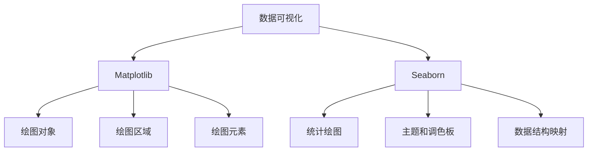

# Python机器学习实战：数据可视化的艺术 - Matplotlib & Seaborn 应用

## 1. 背景介绍

### 1.1 问题的由来

在当今数据主导的时代,数据可视化已成为一种强大的工具,帮助我们从海量数据中提取有价值的信息。无论是商业智能、科学研究还是日常生活,数据可视化都扮演着越来越重要的角色。然而,有效地将数据转化为直观且富有洞察力的可视化表现,往往需要专业的技能和工具。

Python作为一种流行的编程语言,拥有丰富的数据可视化库,其中Matplotlib和Seaborn就是两个非常出色的代表。它们为数据科学家和开发人员提供了强大而灵活的工具,用于创建各种类型的可视化效果,从简单的折线图和散点图,到复杂的三维图形和交互式图表。

### 1.2 研究现状

Matplotlib是Python中最著名和最广泛使用的绘图库,它提供了一个面向对象的接口,可以生成出版物质量的图形,包括线条、散点图、等高线图、条形图、饼图等各种类型的二维和三维图形。Matplotlib具有高度的可定制性,允许用户控制图形的每一个细节,从而实现复杂和精细的可视化效果。

Seaborn则是一个建立在Matplotlib之上的高级数据可视化库,它提供了一种更加简单、更加吸引人的界面,使得创建引人注目的统计图形变得更加容易。Seaborn的设计理念是使用默认主题和调色板,以及内置的数据集,从而减少代码的复杂性,同时保持高度的可定制性。

虽然Matplotlib和Seaborn都是强大的工具,但它们也存在一些局限性。例如,对于大型数据集或实时数据流,这些库可能会遇到性能问题。此外,创建高度交互式和动态的可视化效果也需要额外的工具和库。

### 1.3 研究意义

掌握Matplotlib和Seaborn的使用,对于数据科学家、分析师和开发人员来说,都是非常宝贵的技能。通过有效的数据可视化,我们可以更好地理解数据,发现隐藏的模式和趋势,从而做出更加明智的决策。同时,精美的可视化效果也有助于更好地传达信息,提高数据驱动型项目的影响力。

本文将深入探讨Matplotlib和Seaborn的核心概念、算法原理和实践应用,旨在为读者提供一个全面的指南,帮助他们掌握这两个强大的数据可视化工具。无论是初学者还是有经验的数据从业者,相信都能从本文中获益良多。

### 1.4 本文结构

本文将分为以下几个部分:

1. 背景介绍
2. 核心概念与联系
3. 核心算法原理与具体操作步骤
4. 数学模型和公式详细讲解与举例说明
5. 项目实践:代码实例和详细解释说明
6. 实际应用场景
7. 工具和资源推荐
8. 总结:未来发展趋势与挑战
9. 附录:常见问题与解答

## 2. 核心概念与联系

在深入探讨Matplotlib和Seaborn的细节之前,我们先来了解一些核心概念和它们之间的联系。



1. **数据可视化(Data Visualization)**: 将原始数据转化为图形或图像的过程,以便于人类更好地理解和分析数据。

2. **Matplotlib**: 一个用于创建静态、动画和交互式可视化的Python库,提供了一个面向对象的API。

3. **Seaborn**: 基于Matplotlib构建的高级数据可视化库,专注于统计绘图和数据探索。

4. **绘图对象(Plot Object)**: Matplotlib中用于表示图形元素的对象,如线条、标记、文本等。

5. **绘图区域(Figure Canvas)**: Matplotlib中用于容纳一个或多个绘图元素的区域。

6. **绘图元素(Plot Element)**: Matplotlib中用于构建图形的基本组件,如轴、标签、图例等。

7. **统计绘图(Statistical Plotting)**: Seaborn的核心功能之一,用于可视化统计关系和估计统计值。

8. **主题和调色板(Themes and Color Palettes)**: Seaborn提供了一系列预设的主题和调色板,用于美化图形并提高可读性。

9. **数据结构映射(Data Structure Mapping)**: Seaborn能够直接从Pandas数据结构(如DataFrame和Series)中绘制图形,简化了数据准备过程。

通过了解这些核心概念及其联系,我们可以更好地理解Matplotlib和Seaborn的工作原理,并有效地利用它们进行数据可视化。

## 3. 核心算法原理与具体操作步骤

### 3.1 算法原理概述

Matplotlib和Seaborn的核心算法原理主要包括以下几个方面:

1. **绘图渲染(Rendering)**: 将数据转化为图形元素,并将这些元素绘制到绘图区域中。Matplotlib使用了一种基于对象的渲染方式,每个图形元素都是一个独立的对象,可以单独控制和修改。

2. **图形映射(Mapping)**: 将数据值映射到图形元素的属性上,如位置、大小、颜色等。Matplotlib和Seaborn都提供了丰富的映射函数和工具,以实现各种类型的可视化效果。

3. **图层组合(Layering)**: 将多个图形元素组合在一个绘图区域中,形成复杂的可视化效果。Matplotlib和Seaborn都支持在同一个绘图区域中绘制多个图层,并提供了控制图层顺序和透明度的功能。

4. **统计计算(Statistical Computation)**: Seaborn内置了一些常用的统计函数,如估计值、置信区间、核密度估计等,用于支持统计绘图和数据探索。

5. **样式和主题(Styles and Themes)**: Matplotlib和Seaborn都提供了丰富的样式和主题选项,用于自定义图形的外观,包括颜色、字体、线条样式等。Seaborn还内置了一些预设的主题和调色板,可以快速美化图形。

### 3.2 算法步骤详解

下面我们将详细介绍Matplotlib和Seaborn的核心算法步骤:

#### 3.2.1 Matplotlib算法步骤

1. **创建绘图对象(Figure Object)**

    ```python
    import matplotlib.pyplot as plt
    fig = plt.figure()
    ```

2. **创建绘图区域(Axes Object)**

    ```python
    ax = fig.add_subplot(111)
    ```

3. **准备数据**

    ```python
    x = [1, 2, 3, 4, 5]
    y = [2, 4, 6, 8, 10]
    ```

4. **绘制图形元素**

    ```python
    ax.plot(x, y)
    ```

5. **添加图形元素**

    ```python
    ax.set_title('Line Plot')
    ax.set_xlabel('X')
    ax.set_ylabel('Y')
    ```

6. **显示图形**

    ```python
    plt.show()
    ```

#### 3.2.2 Seaborn算法步骤

1. **导入数据**

    ```python
    import seaborn as sns
    tips = sns.load_dataset("tips")
    ```

2. **设置样式和主题**

    ```python
    sns.set_style("darkgrid")
    ```

3. **绘制统计图形**

    ```python
    sns.scatterplot(x="total_bill", y="tip", data=tips)
    ```

4. **添加注释和图例**

    ```python
    plt.title("Tips vs. Total Bill")
    plt.xlabel("Total Bill")
    plt.ylabel("Tip")
    ```

5. **显示图形**

    ```python
    plt.show()
    ```

通过上述步骤,我们可以看到Matplotlib和Seaborn的核心算法都遵循了一个类似的流程:创建绘图对象、准备数据、绘制图形元素、添加注释和图例,最后显示图形。不同之处在于Seaborn提供了更高级别的接口,可以直接从数据结构中绘制统计图形,并内置了样式和主题选项。

### 3.3 算法优缺点

#### 3.3.1 Matplotlib

**优点**:

- 功能强大,可定制性高,支持各种类型的二维和三维图形。
- 面向对象的API设计,易于扩展和集成。
- 活跃的社区,有大量的第三方工具和扩展。
- 可以生成出版物质量的图形。

**缺点**:

- 学习曲线较陡峭,需要编写大量样板代码。
- 默认样式和主题不太吸引人,需要手动调整。
- 对于统计绘图和数据探索,功能相对有限。

#### 3.3.2 Seaborn

**优点**:

- 简单易用,提供了高级别的接口,减少了样板代码。
- 内置了吸引人的主题和调色板,图形美观。
- 专注于统计绘图和数据探索,功能强大。
- 可以直接从Pandas数据结构中绘制图形。

**缺点**:

- 功能相对有限,无法创建某些特殊类型的图形。
- 定制性较低,难以对图形进行细粒度的控制。
- 对于大型数据集或实时数据流,性能可能会受到影响。

总的来说,Matplotlib更加灵活和强大,适合于需要高度定制和控制的场景,而Seaborn则更加简单和直观,适合于快速探索数据和创建统计图形。两者可以很好地互补,结合使用可以发挥各自的优势。

### 3.4 算法应用领域

Matplotlib和Seaborn的应用领域非常广泛,包括但不限于:

- **科学研究**: 可视化实验数据、模拟结果、理论模型等。
- **商业智能**: 创建报告、仪表板、数据探索和可视化分析。
- **金融分析**: 绘制股票走势图、技术指标、风险分析等。
- **机器学习**: 可视化算法输出、模型评估、特征重要性等。
- **教育和培训**: 创建教学材料、演示文稿、交互式可视化等。
- **艺术和设计**: 生成艺术作品、图像处理、数据艺术等。

无论是在科研、商业还是其他领域,数据可视化都扮演着越来越重要的角色。Matplotlib和Seaborn作为Python生态系统中的佼佼者,为广大用户提供了强大的工具,帮助他们更好地理解和呈现数据。

## 4. 数学模型和公式详细讲解与举例说明

在数据可视化中,数学模型和公式扮演着重要的角色,它们为我们提供了理论基础和计算方法,帮助我们更好地处理和呈现数据。在本节中,我们将探讨一些常见的数学模型和公式,并详细讲解它们的原理和应用。

### 4.1 数学模型构建

#### 4.1.1 线性回归模型

线性回归是一种广泛使用的统计模型,用于描述两个或多个变量之间的线性关系。在数据可视化中,线性回归模型常被用于拟合趋势线、预测未来值等。

线性回归模型的基本形式为:

$$y = \beta_0 + \beta_1x_1 + \beta_2x_2 + ... + \beta_nx_n + \epsilon$$

其中:

- $y$ 是因变量(响应变量)
- $x_1, x_2, ..., x_n$ 是自变量(解释变量)
- $\beta_0, \beta_1, ..., \beta_n$ 是回归系数
- $\epsilon$ 是随机误差项

通过估计回归系数,我们可以得到一条最佳拟合线,描述自变量和因变量之间的关系。

#### 4.1.2 多项式回归模型

当数据呈现非线性关系时,线性回归模型可能无法很好地拟合。这时,我们可以使用多项式回归模型,它将自变量的多次幂项引入模型中,从而能够捕捉更复杂的曲线形状。

多项式回归模型的基本形式为:

$$y = \beta_0 + \beta_1x + \beta_2x^2 + ... + \beta_nx^n +