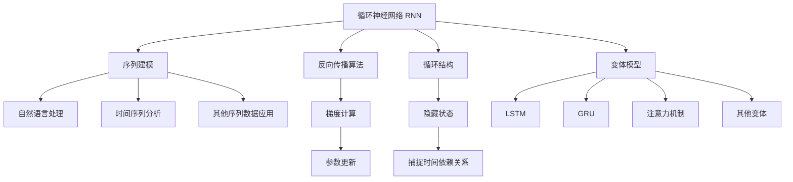

好的，我会严格遵循约束条件，以专业的技术语言撰写这篇关于循环神经网络(RNN)原理与实践的技术博客文章。

# Recurrent Neural Networks (RNN) 原理与代码实战案例讲解

## 1. 背景介绍

### 1.1 问题的由来

在自然语言处理、时间序列分析和其他涉及序列数据的领域中,传统的前馈神经网络存在一个重大缺陷:它们无法很好地捕捉输入数据中的时间依赖关系。这种时间依赖关系对于理解和预测序列数据至关重要。为了解决这一问题,循环神经网络(Recurrent Neural Networks, RNN)应运而生。

### 1.2 研究现状

循环神经网络已成为处理序列数据的主导模型,广泛应用于自然语言处理、语音识别、机器翻译、时间序列预测等领域。经典RNN及其变体(如LSTM和GRU)在捕捉长期依赖方面表现出色,但也存在一些缺陷,如梯度消失/爆炸问题。近年来,注意力机制、变分递归神经网络等新型架构不断涌现,进一步推动了RNN的发展。

### 1.3 研究意义

掌握循环神经网络的原理和实践技能,对于从事自然语言处理、时间序列分析等序列数据相关领域的工作至关重要。本文将全面阐述RNN的核心概念、算法原理、数学模型,并通过实战案例帮助读者深入理解和掌握RNN的实现细节,为读者在相关领域的研究和应用奠定坚实基础。

### 1.4 本文结构

本文将从以下几个方面全面介绍循环神经网络:

1. 核心概念与联系
2. 核心算法原理与具体操作步骤
3. 数学模型和公式详细讲解与案例分析
4. 项目实践:代码实例和详细解释说明
5. 实际应用场景
6. 工具和资源推荐
7. 未来发展趋势与挑战
8. 常见问题与解答

## 2. 核心概念与联系

循环神经网络(Recurrent Neural Networks, RNN)是一种特殊的神经网络架构,专门设计用于处理序列数据。它的核心思想是引入循环结构,允许信息在序列的时间步之间持续流动和更新。

RNN广泛应用于自然语言处理、时间序列分析等涉及序列数据的领域,用于序列建模任务。在自然语言处理中,RNN可以处理文本、语音等序列数据,用于语言模型、机器翻译、文本生成等任务。在时间序列分析中,RNN可以处理时间序列数据,用于预测、异常检测等任务。

RNN的核心是引入了隐藏状态(Hidden State),用于捕捉输入序列中的时间依赖关系。在每个时间步,RNN会根据当前输入和前一时间步的隐藏状态,计算出新的隐藏状态,并基于新的隐藏状态输出预测结果。这种循环结构使RNN能够有效地建模序列数据中的长期依赖关系。

RNN通过反向传播算法进行训练,计算损失函数关于参数的梯度,并更新网络参数。由于RNN的循环结构,需要通过反向传播时间步骤(Backpropagation Through Time, BPTT)计算梯度。

为了解决RNN在捕捉长期依赖关系时存在的梯度消失/爆炸问题,研究人员提出了多种变体模型,如长短期记忆网络(LSTM)、门控循环单元(GRU)等。此外,注意力机制的引入进一步增强了RNN在捕捉长期依赖关系的能力。

总的来说,循环神经网络是一种强大的序列建模工具,通过引入循环结构和隐藏状态,能够有效地捕捉序列数据中的时间依赖关系,在自然语言处理、时间序列分析等领域发挥着重要作用。

## 3. 核心算法原理与具体操作步骤

### 3.1 算法原理概述

循环神经网络(RNN)的核心思想是引入循环结构,允许信息在序列的时间步之间持续流动和更新。RNN在每个时间步都会根据当前输入和前一时间步的隐藏状态,计算出新的隐藏状态,并基于新的隐藏状态输出预测结果。

具体来说,在时间步 $t$,RNN的计算过程如下:

$$
\begin{aligned}
h_t &= f_W(x_t, h_{t-1}) \
y_t &= g(h_t)
\end{aligned}
$$

其中:

- $x_t$ 是时间步 $t$ 的输入
- $h_t$ 是时间步 $t$ 的隐藏状态,也是 RNN 的记忆单元
- $h_{t-1}$ 是前一时间步的隐藏状态
- $f_W$ 是计算新隐藏状态的函数,通常是一个循环层(如全连接层),参数为 $W$
- $y_t$ 是时间步 $t$ 的输出
- $g$ 是将隐藏状态映射到输出的函数,通常是一个全连接层或其他输出层

RNN 的关键在于隐藏状态 $h_t$ 不仅取决于当前输入 $x_t$,还取决于前一时间步的隐藏状态 $h_{t-1}$。这种循环结构使 RNN 能够捕捉输入序列中的时间依赖关系,并将这些信息编码到隐藏状态中。

在训练过程中,RNN 通过反向传播算法计算损失函数关于参数的梯度,并更新网络参数。由于 RNN 的循环结构,需要通过反向传播时间步骤(Backpropagation Through Time, BPTT)计算梯度。

### 3.2 算法步骤详解

1. **初始化**: 在处理序列数据之前,需要初始化 RNN 的隐藏状态 $h_0$,通常将其设置为全零向量。

2. **前向传播**: 对于每个时间步 $t$,执行以下操作:
   a. 计算当前时间步的隐藏状态 $h_t$,根据前一时间步的隐藏状态 $h_{t-1}$ 和当前输入 $x_t$:
      $$h_t = f_W(x_t, h_{t-1})$$
   b. 基于当前隐藏状态 $h_t$,计算当前时间步的输出 $y_t$:
      $$y_t = g(h_t)$$

3. **计算损失函数**: 在处理完整个序列后,计算输出 $y$ 与真实标签 $\hat{y}$ 之间的损失函数,如交叉熵损失函数:
   $$\mathcal{L}(\theta) = -\sum_t \hat{y}_t \log y_t$$
   其中 $\theta$ 表示 RNN 的所有可训练参数。

4. **反向传播**: 通过反向传播时间步骤(BPTT)计算损失函数关于参数的梯度:
   $$\frac{\partial \mathcal{L}}{\partial \theta} = \sum_t \frac{\partial \mathcal{L}}{\partial y_t} \frac{\partial y_t}{\partial h_t} \frac{\partial h_t}{\partial \theta}$$

5. **参数更新**: 使用优化算法(如随机梯度下降)根据计算得到的梯度,更新 RNN 的参数:
   $$\theta \leftarrow \theta - \eta \frac{\partial \mathcal{L}}{\partial \theta}$$
   其中 $\eta$ 是学习率。

6. **重复训练**: 重复步骤 2-5,直到模型收敛或达到指定的训练轮次。

需要注意的是,由于 RNN 的循环结构,在反向传播过程中需要解开循环,并通过 BPTT 算法计算每个时间步的梯度。这可能会导致梯度消失或梯度爆炸问题,从而影响 RNN 的训练效果。为了缓解这一问题,研究人员提出了多种 RNN 变体,如长短期记忆网络(LSTM)和门控循环单元(GRU)。

### 3.3 算法优缺点

**优点**:

1. **序列建模能力强大**: 循环神经网络能够有效地捕捉序列数据中的时间依赖关系,在处理自然语言、时间序列等序列数据时表现出色。

2. **灵活性强**: RNN 可以处理变长序列输入,不受输入长度的限制,具有很强的灵活性。

3. **端到端训练**: RNN 可以直接在原始序列数据上进行端到端的训练,无需手工特征工程。

4. **可解释性较好**: RNN 的隐藏状态在一定程度上可以解释网络内部的状态,有助于理解模型的工作原理。

**缺点**:

1. **梯度消失/爆炸问题**: 由于 RNN 的循环结构,在反向传播过程中可能会出现梯度消失或梯度爆炸问题,影响模型的训练效果。

2. **计算效率较低**: RNN 无法并行化计算,需要按时间步骤顺序计算,导致计算效率较低。

3. **难以捕捉长期依赖关系**: 虽然 RNN 理论上可以捕捉任意长度的依赖关系,但在实践中,它们很难有效地捕捉过长的依赖关系。

4. **缺乏显式记忆机制**: 普通 RNN 缺乏显式的记忆机制,难以有效地存储和访问长期信息。

为了解决 RNN 的这些缺陷,研究人员提出了多种改进的 RNN 变体,如长短期记忆网络(LSTM)、门控循环单元(GRU)等,以及注意力机制等新型架构。这些改进有助于提高 RNN 在捕捉长期依赖关系、并行计算等方面的能力。

### 3.4 算法应用领域

循环神经网络及其变体广泛应用于以下领域:

1. **自然语言处理(NLP)**:
   - 语言模型
   - 机器翻译
   - 文本生成
   - 情感分析
   - 问答系统

2. **语音识别**:
   - 自动语音识别
   - 语音合成

3. **时间序列分析**:
   - 时间序列预测
   - 异常检测
   - 金融时间序列分析

4. **计算机视觉**:
   - 视频分类
   - 视频描述
   - 视频预测

5. **生物信息学**:
   - 蛋白质结构预测
   - DNA序列分析

6. **信号处理**:
   - 语音信号处理
   - 传感器数据处理

7. **控制系统**:
   - 机器人控制
   - 自动驾驶

8. **其他序列数据应用**:
   - 手写识别
   - 绘图识别
   - 音乐生成

循环神经网络的应用领域非常广泛,凡是涉及序列数据的任务,都可以考虑使用 RNN 及其变体模型。随着深度学习技术的不断发展,RNN 在这些领域的应用也将不断扩展和深化。

## 4. 数学模型和公式详细讲解与举例说明

### 4.1 数学模型构建

循环神经网络(RNN)的数学模型可以形式化地表示为:

$$
\begin{aligned}
h_t &= \sigma(W_{hx}x_t + W_{hh}h_{t-1} + b_h) \
y_t &= g(W_{yh}h_t + b_y)
\end{aligned}
$$

其中:

- $x_t$ 是时间步 $t$ 的输入向量
- $h_t$ 是时间步 $t$ 的隐藏状态向量
- $y_t$ 是时间步 $t$ 的输出向量
- $W_{