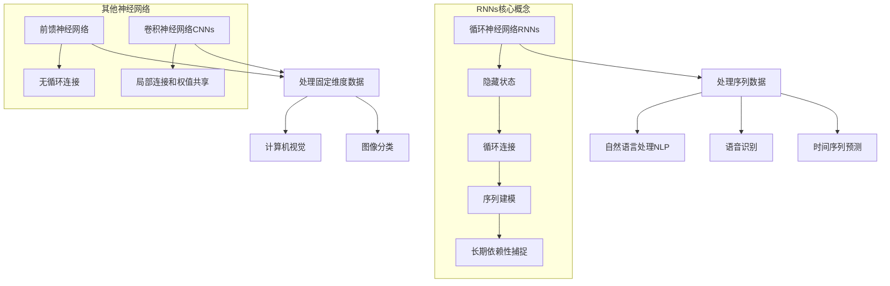

以下是文章正文部分：

# Recurrent Neural Networks 原理与代码实战案例讲解

## 1. 背景介绍

### 1.1 问题的由来

在过去几十年中，人工神经网络在各种任务中取得了巨大的成功,如计算机视觉、自然语言处理和语音识别等。然而,传统的前馈神经网络在处理序列数据时存在局限性。它们无法很好地捕捉序列中元素之间的长期依赖关系,这在许多实际应用场景中是必不可少的。

为了解决这个问题,循环神经网络(Recurrent Neural Networks, RNNs)应运而生。RNNs被设计用于处理序列数据,如文本、语音和时间序列等。与前馈网络不同,RNNs在隐藏层之间引入了循环连接,使得它们能够捕捉序列中元素之间的动态时间依赖关系。

### 1.2 研究现状

早期的RNNs虽然理论上具有学习长期依赖关系的能力,但在实践中却存在梯度消失或梯度爆炸的问题,这极大地限制了它们在长序列任务上的应用。为了缓解这个问题,研究人员提出了多种改进的RNN变体,如长短期记忆网络(Long Short-Term Memory, LSTM)和门控循环单元(Gated Recurrent Unit, GRU)。

这些改进的RNN变体通过引入门控机制和记忆单元,有效地解决了梯度问题,大大提高了它们捕捉长期依赖关系的能力。近年来,LSTM和GRU在各种序列建模任务中取得了卓越的表现,如机器翻译、语音识别、文本生成等,成为序列数据处理的主流模型。

### 1.3 研究意义

RNNs在处理序列数据方面的强大能力使它们在各种领域都有广泛的应用前景。例如:

- **自然语言处理**: RNNs可以用于机器翻译、文本生成、情感分析等任务。
- **语音识别**: RNNs可以捕捉语音信号中的时间依赖关系,提高识别准确率。
- **时间序列预测**: RNNs可以学习时间序列数据中的模式,用于预测未来趋势。
- **手写识别**: RNNs可以处理手写字符的在线序列数据,实现高精度的手写识别。

深入理解RNNs的原理和实现细节,对于开发更加强大和高效的序列建模模型至关重要。本文将全面介绍RNNs的基本概念、核心算法原理、数学模型推导以及实战案例,为读者提供一个系统的学习和实践指南。

### 1.4 本文结构

本文将按以下结构展开:

1. **背景介绍**: 阐述RNNs产生的背景、研究现状和意义。
2. **核心概念与联系**: 介绍RNNs的基本概念和与其他神经网络模型的关系。
3. **核心算法原理与具体操作步骤**: 深入探讨RNNs的核心算法原理,并详细讲解算法的具体操作步骤、优缺点和应用领域。
4. **数学模型和公式详细讲解与举例说明**: 推导RNNs的数学模型和公式,并通过案例分析进行详细讲解,解答常见问题。
5. **项目实践:代码实例和详细解释说明**: 提供完整的代码实例,介绍开发环境搭建、源代码实现细节、代码解读分析和运行结果展示。
6. **实际应用场景**: 探讨RNNs在自然语言处理、语音识别等领域的实际应用,并展望未来应用前景。
7. **工具和资源推荐**: 推荐相关的学习资源、开发工具、论文和其他有用资源。
8. **总结:未来发展趋势与挑战**: 总结研究成果,展望RNNs的未来发展趋势,并分析面临的主要挑战。
9. **附录:常见问题与解答**: 解答RNNs学习和应用过程中的常见问题。

## 2. 核心概念与联系

循环神经网络(Recurrent Neural Networks, RNNs)是一种专门设计用于处理序列数据的神经网络模型。与前馈神经网络和卷积神经网络不同,RNNs引入了隐藏层之间的循环连接,使得它们能够捕捉序列数据中元素之间的长期依赖关系。

RNNs的核心概念包括:

1. **隐藏状态(Hidden State)**: 每个时间步的隐藏层输出不仅取决于当前输入,还取决于前一时间步的隐藏状态,从而捕捉序列中元素之间的动态时间依赖关系。

2. **循环连接(Recurrent Connection)**: 隐藏层之间的循环连接使得网络能够将过去的信息传递到当前时间步,实现对序列数据的建模。

3. **序列建模(Sequence Modeling)**: RNNs擅长于对序列数据(如文本、语音、时间序列等)进行建模,捕捉其中的模式和规律。

4. **长期依赖性捕捉(Long-term Dependency Capturing)**: 与传统前馈网络相比,RNNs具有更强的能力来捕捉序列数据中元素之间的长期依赖关系。

虽然RNNs在处理序列数据方面具有独特的优势,但它们与其他神经网络模型也存在一些联系:

- 前馈神经网络通常用于处理固定维度的数据,如图像分类和计算机视觉任务。它们没有循环连接,无法很好地捕捉序列数据中的长期依赖关系。

- 卷积神经网络(Convolutional Neural Networks, CNNs)通过局部连接和权值共享的方式,擅长于捕捉数据中的局部模式,常用于计算机视觉和图像处理任务。但它们也无法直接处理序列数据。

- RNNs、CNNs和前馈网络常常结合使用,构建更加强大的神经网络模型,以解决复杂的实际问题。例如,在自然语言处理任务中,CNNs可用于提取文本的局部特征,而RNNs则用于捕捉全局的序列依赖关系。

总的来说,RNNs凭借其独特的循环结构和隐藏状态机制,为有效处理序列数据提供了强大的建模能力,在自然语言处理、语音识别、时间序列预测等领域发挥着重要作用。

## 3. 核心算法原理与具体操作步骤

### 3.1 算法原理概述

RNNs的核心算法原理是通过引入循环连接,使得隐藏层的输出不仅取决于当前输入,还取决于前一时间步的隐藏状态。这种设计使得RNNs能够捕捉序列数据中元素之间的动态时间依赖关系。

在RNNs中,每个时间步的隐藏状态$h_t$由当前输入$x_t$和前一时间步的隐藏状态$h_{t-1}$共同决定,可以表示为:

$$h_t = f_W(x_t, h_{t-1})$$

其中,$f_W$是一个非线性函数(如tanh或ReLU),参数$W$包含了RNNs的可训练权重。

基于当前隐藏状态$h_t$,RNNs会输出一个预测值$y_t$,用于解决特定的序列建模任务,如文本生成、机器翻译等。预测值$y_t$可以通过另一个函数$g$从$h_t$计算得到:

$$y_t = g(h_t)$$

在训练过程中,RNNs会根据预测值$y_t$和真实标签之间的误差,通过反向传播算法调整网络权重$W$,使得预测值逐渐逼近真实值。

虽然RNNs理论上能够捕捉任意长度的序列依赖关系,但在实践中,它们往往难以学习到很长的依赖关系,这是由于梯度消失或梯度爆炸问题的存在。为了解决这个问题,研究人员提出了一些改进的RNN变体,如长短期记忆网络(LSTM)和门控循环单元(GRU),它们通过引入门控机制和记忆单元,大大提高了捕捉长期依赖关系的能力。

### 3.2 算法步骤详解

以下是RNNs算法的具体操作步骤:

1. **初始化**: 初始化RNNs的权重矩阵$W$,以及初始隐藏状态$h_0$(通常设为全0向量)。

2. **前向传播**:
   - 对于每个时间步$t$,计算当前隐藏状态$h_t$:
     $$h_t = f_W(x_t, h_{t-1})$$
   - 基于$h_t$,计算当前时间步的预测值$y_t$:
     $$y_t = g(h_t)$$

3. **计算损失函数**:
   - 将预测值$y_t$与真实标签$y^*_t$进行比较,计算损失函数(如交叉熵损失)。
   - 对于整个序列,累积所有时间步的损失函数值。

4. **反向传播**:
   - 计算损失函数相对于$W$的梯度。
   - 根据梯度更新$W$,使用优化算法(如随机梯度下降)。

5. **重复步骤2-4**:
   - 在训练集上重复执行前向传播、损失计算和反向传播,直到模型收敛或达到最大迭代次数。

6. **预测**:
   - 对于新的输入序列,执行前向传播过程,得到每个时间步的预测值$y_t$。
   - 根据任务需求,可以选择输出最终时间步的预测值(如序列分类)或整个序列的预测值(如序列生成)。

需要注意的是,由于RNNs在训练过程中需要保存每个时间步的隐藏状态,因此它们在处理长序列时会消耗大量内存。此外,梯度消失或梯度爆炸问题可能会影响RNNs学习长期依赖关系的能力。

### 3.3 算法优缺点

**优点**:

1. **序列建模能力强大**: RNNs擅长于对序列数据(如文本、语音、时间序列等)进行建模,捕捉其中的模式和规律。

2. **捕捉长期依赖关系**: 与传统前馈网络相比,RNNs具有更强的能力来捕捉序列数据中元素之间的长期依赖关系。

3. **端到端训练**: RNNs可以直接对原始序列数据进行端到端的训练,无需手工设计特征。

4. **可解释性较好**: RNNs的隐藏状态和循环连接具有一定的可解释性,有助于理解模型内部的工作机制。

**缺点**:

1. **梯度消失/爆炸问题**: 在处理长序列时,RNNs容易遇到梯度消失或梯度爆炸的问题,导致无法有效捕捉长期依赖关系。

2. **不能并行计算**: 由于隐藏状态的递归计算方式,RNNs无法充分利用现代硬件(如GPU)的并行计算能力,计算效率较低。

3. **内存消耗大**: 在训练过程中,RNNs需要保存每个时间步的隐藏状态,因此对内存的需求较高,尤其是在处理长序列时。

4. **难以捕捉位置不变性**: 与卷积神经网络相比,RNNs较难捕捉序列数据中元素的位置不变性特征。

为了缓解RNNs的一些缺点,研究人员提出了多种改进的RNN变体,如LSTM和GRU,它们通过