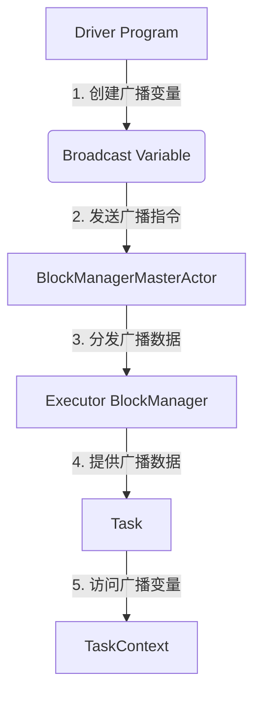

# Spark Broadcast原理与代码实例讲解

## 1. 背景介绍

### 1.1 问题的由来

在大数据处理领域中,数据集通常需要在多个节点之间进行分发和共享。然而,对于一些常用的大型数据集或查询表,如果每个任务都从Driver程序复制一份数据,将会产生大量的数据传输,从而导致性能低下和资源浪费。为了解决这个问题,Apache Spark引入了Broadcast机制。

### 1.2 研究现状

Broadcast机制是Spark中一种优化数据共享的技术,它可以将只读的数据集从Driver程序高效地分发到每个Executor节点,并在每个节点上缓存数据集的副本。这样,任务就可以在本地访问缓存的数据集,而无需从远程节点重复传输数据,从而提高了数据处理的效率。

### 1.3 研究意义

理解Spark Broadcast的原理和实现细节,对于开发高效的Spark应用程序至关重要。通过合理利用Broadcast机制,可以显著降低数据传输开销,提升作业执行速度,优化资源利用率。此外,深入研究Broadcast的内部实现,也有助于我们更好地理解Spark的内存管理、任务调度和容错机制等核心模块。

### 1.4 本文结构

本文将从以下几个方面全面介绍Spark Broadcast:

1. 核心概念与联系
2. 核心算法原理和具体操作步骤
3. 数学模型和公式详细讲解及案例分析
4. 项目实践:代码实例和详细解释说明
5. 实际应用场景
6. 工具和资源推荐
7. 总结:未来发展趋势与挑战
8. 附录:常见问题与解答

## 2. 核心概念与联系

Spark Broadcast涉及到以下几个核心概念:

1. **广播变量(Broadcast Variable)**: 一种只读的共享变量,可以高效地从Driver程序分发到每个Executor节点。

2. **BlockManager**: Spark中负责数据块(Block)管理的模块,它维护了一个内存存储区域,用于缓存广播变量等数据。

3. **BlockManagerMasterActor**: BlockManager的主控Actor,负责协调广播变量的分发和清理工作。

4. **TaskContext**: 每个Task执行时的上下文环境,包含了该Task可访问的广播变量等信息。

这些概念之间的关系如下:



## 3. 核心算法原理与具体操作步骤

### 3.1 算法原理概述

Spark Broadcast的核心算法原理可概括为以下几个步骤:

1. **创建广播变量**: 在Driver程序中,通过调用`SparkContext.broadcast()`方法创建一个`Broadcast`对象,该对象封装了需要广播的数据。

2. **发送广播指令**: Driver程序将广播变量的元数据信息发送给`BlockManagerMasterActor`。

3. **分发广播数据**: `BlockManagerMasterActor`将广播变量的数据分发给各个Executor节点上的`BlockManager`。

4. **缓存广播数据**: 每个`BlockManager`在本地内存中缓存接收到的广播数据。

5. **访问广播变量**: 在Task执行时,可以通过`TaskContext`访问该Task所在Executor节点上缓存的广播变量数据。

### 3.2 算法步骤详解

1. **创建广播变量**

   在Driver程序中,通过调用`SparkContext.broadcast(value)`方法创建一个`Broadcast`对象。其中,`value`是需要广播的数据,可以是任何类型的对象。

   ```scala
   val broadcastVar = sc.broadcast(Array(1, 2, 3))
   ```

2. **发送广播指令**

   Driver程序将广播变量的元数据信息发送给`BlockManagerMasterActor`。元数据信息包括广播变量的大小、类型等,用于后续的数据分发和内存管理。

3. **分发广播数据**

   `BlockManagerMasterActor`将广播变量的数据分发给各个Executor节点上的`BlockManager`。具体分发过程如下:

   a. `BlockManagerMasterActor`将广播数据划分为多个块(Block),并为每个块分配一个唯一的ID。

   b. `BlockManagerMasterActor`将这些块的元数据信息发送给所有Executor节点上的`BlockManager`。

   c. 每个`BlockManager`根据接收到的元数据,从`BlockManagerMasterActor`主动拉取对应的数据块。

4. **缓存广播数据**

   每个`BlockManager`在本地内存中缓存接收到的广播数据块。为了提高内存利用率,Spark采用了内存压缩和内存映射文件等技术来存储广播数据。

5. **访问广播变量**

   在Task执行时,可以通过`TaskContext`访问该Task所在Executor节点上缓存的广播变量数据。具体步骤如下:

   a. Task通过`TaskContext.getBroadcastVariable(broadcastId)`方法获取指定的广播变量对象。

   b. 广播变量对象提供了`value`方法,用于获取实际的广播数据。

   ```scala
   val broadcastData = taskContext.getBroadcastVariable(broadcastId).value
   ```

### 3.3 算法优缺点

**优点**:

- **高效数据共享**: 通过在Executor节点上缓存广播数据,避免了重复传输相同的数据,提高了数据处理效率。
- **内存利用率高**: Spark采用了内存压缩和内存映射文件等技术,提高了内存利用率。
- **容错性好**: 如果某个Executor节点失败,Spark会自动在其他节点上重新获取广播数据,保证了计算的可靠性。

**缺点**:

- **适用场景有限制**: 广播变量只适用于小数据集或只读数据,不适合频繁更新的大数据集。
- **内存占用较高**: 如果广播变量过大,可能会导致Executor节点内存不足,影响其他任务的执行。
- **初始化开销较大**: 在广播数据时,需要进行数据划分、元数据传输等操作,初始化开销较大。

### 3.4 算法应用领域

Spark Broadcast主要应用于以下几个场景:

1. **Join操作**: 在进行Join操作时,可以将较小的数据集广播到各个Executor节点,避免了数据的重复传输。

2. **lookup表**: 在需要频繁查询某些参考数据时,可以将这些数据广播到各个节点,提高查询效率。

3. **机器学习模型**: 在分布式机器学习中,可以将训练好的模型广播到各个Executor节点,用于预测或评分。

4. **配置参数**: 将一些全局配置参数广播到各个节点,方便任务访问和共享这些参数。

## 4. 数学模型和公式详细讲解与举例说明

在分析Spark Broadcast的性能时,我们需要考虑数据传输开销和内存占用两个主要因素。

### 4.1 数学模型构建

假设我们有一个大小为$S$的数据集需要在$N$个Executor节点上共享,并且每个Executor节点上有$M$个Task需要访问这个数据集。

不使用Broadcast机制时,每个Task都需要从Driver程序复制一份数据,总的数据传输开销为:

$$
O_1 = N \times M \times S
$$

使用Broadcast机制时,只需要将数据集从Driver程序传输到每个Executor节点一次,总的数据传输开销为:

$$
O_2 = N \times S
$$

我们可以看出,当$M > 1$时,使用Broadcast机制可以显著降低数据传输开销。

另一方面,我们还需要考虑广播变量在Executor节点上的内存占用。假设每个Executor节点上缓存了$K$个广播变量,总的内存占用为:

$$
M = \sum_{i=1}^{K} S_i
$$

其中,$S_i$表示第$i$个广播变量的大小。

为了避免内存不足导致任务失败,我们需要保证:

$$
M \leq T
$$

其中,$T$表示Executor节点可用于缓存广播变量的总内存大小。

### 4.2 公式推导过程

我们来推导一下,在什么情况下使用Broadcast机制比不使用更有利。

不使用Broadcast机制时,总的数据传输开销为:

$$
O_1 = N \times M \times S
$$

使用Broadcast机制时,总的数据传输开销为:

$$
O_2 = N \times S
$$

为了使$O_2 < O_1$,我们需要:

$$
N \times S < N \times M \times S \
\Rightarrow 1 < M
$$

也就是说,只要每个Executor节点上有多于1个Task需要访问该数据集,使用Broadcast机制就可以减少数据传输开销。

### 4.3 案例分析与讲解

假设我们有一个大小为10GB的lookup表,需要在10个Executor节点上共享,并且每个Executor节点上有5个Task需要访问这个lookup表。

不使用Broadcast机制时,总的数据传输开销为:

$$
O_1 = 10 \times 5 \times 10GB = 500GB
$$

使用Broadcast机制时,总的数据传输开销为:

$$
O_2 = 10 \times 10GB = 100GB
$$

我们可以看出,使用Broadcast机制可以将数据传输开销从500GB降低到100GB,节省了80%的数据传输量。

另一方面,如果每个Executor节点上只有1个Task需要访问lookup表,那么使用Broadcast机制反而会增加数据传输开销。在这种情况下,不使用Broadcast机制的数据传输开销为:

$$
O_1 = 10 \times 1 \times 10GB = 100GB
$$

而使用Broadcast机制的数据传输开销仍然是:

$$
O_2 = 10 \times 10GB = 100GB
$$

因此,在决定是否使用Broadcast机制时,需要根据具体的数据大小和任务分布情况进行权衡。

### 4.4 常见问题解答

1. **广播变量是否支持更新操作?**

   不支持。广播变量是只读的,一旦创建就无法修改其中的数据。如果需要更新数据,必须重新创建一个新的广播变量。

2. **广播变量的大小有限制吗?**

   理论上没有硬性限制,但是由于广播变量需要缓存在Executor节点的内存中,因此过大的广播变量可能会导致内存不足。通常建议广播变量的大小控制在几百MB以内。

3. **如何确定是否应该使用Broadcast机制?**

   可以根据以下几个因素来判断:
   - 数据集的大小
   - 需要访问该数据集的Task数量
   - Executor节点的内存容量

   如果数据集较小,且有多个Task需要访问,并且Executor节点有足够的内存,那么使用Broadcast机制可以提高性能。反之,如果数据集很大,或者只有少数Task需要访问,那么不使用Broadcast机制可能更加合适。

4. **广播变量是否支持容错机制?**

   支持。如果某个Executor节点失败,Spark会自动在其他节点上重新获取广播数据,保证了计算的可靠性。

## 5. 项目实践:代码实例和详细解释说明

在这一部分,我们将通过一个实际的代码示例,演示如何在Spark应用程序中使用Broadcast机制。

### 5.1 开发环境搭建

我们使用以下版本的Spark和Scala:

- Apache Spark 3.2.1
- Scala 2.12.15

首先,我们需要创建一个新的Spark应用程序项目,并添加必要的依赖项。以下是一个基于Maven的`pom.xml`文件示例:

```xml
<project>
  ...
  <dependencies>
    <dependency>
      <groupId>org.apache.spark</groupId>
      <artifactId>spark-core_2.12</artifactId>
      <version>3.2.1</version>
    </dependency>
  </dependencies>
  ...
</project>
```

### 5.2 源代码详细实现

我们将实现一个简单的WordCount程序,并使用Broadcast机制来共享停用词表(stop words list)。

```scala
import org.apache.spark.sql.SparkSession

object BroadcastExample {

  def main(args: Array[String]): Unit = {
    val spark = SparkSession.builder()
      .appName("Broadcast