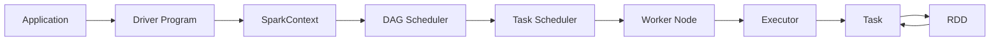

# Spark 原理与代码实例讲解

## 1. 背景介绍
### 1.1 问题的由来
随着大数据时代的到来,传统的数据处理方式已经无法满足海量数据的实时计算和处理需求。Hadoop虽然在离线批处理方面表现优异,但在实时流式计算方面却捉襟见肘。为了解决这一问题,Spark应运而生。
### 1.2 研究现状
Spark自2009年诞生以来,凭借其快速、通用、易用等特点,迅速成为大数据领域的明星项目。目前已广泛应用于各大互联网公司,成为大数据实时计算的事实标准。学术界对Spark的研究也方兴未艾,涌现出大量高质量论文。
### 1.3 研究意义
深入理解Spark的原理和实现,对于开发高性能的大数据应用具有重要意义。通过剖析Spark源码,我们可以学习其设计思想和优化技巧,写出更加高效、健壮的分布式程序。同时对Spark生态的掌握,也有助于解决实际工程问题。
### 1.4 本文结构
本文将分为9个章节,深入探讨Spark的方方面面。第2节介绍Spark的核心概念;第3节剖析其底层算法原理;第4节建立数学模型并推导公式;第5节通过代码实例演示Spark编程;第6节展望Spark的应用场景;第7节推荐相关工具和资源;第8节总结全文并展望未来;第9节为附录。

## 2. 核心概念与联系
Spark的核心概念包括:
- RDD(Resilient Distributed Dataset):Spark的基本计算单元,代表一个不可变、可分区、里面元素可并行计算的数据集。
- DAG(Directed Acyclic Graph):反映RDD之间的依赖关系,是Spark任务调度的基础。
- Executor:运行在工作节点(Worker Node)上的一个进程,负责运行Task。
- Application:用户编写的Spark应用程序。
- Driver Program:运行Application的main()函数并创建SparkContext。
- Cluster Manager:在集群上获取资源的外部服务,例如Hadoop YARN等。
- Worker Node:集群中任何可以运行Application代码的节点。
- Task:被送到某个Executor上的工作单元。

下图展示了这些概念之间的联系:



RDD是Spark的核心,Application中的算子(如map、reduce等)都是对RDD进行操作。这些转换关系由DAG描述,经过DAGScheduler的解析和TaskScheduler的调度,变成在Executor上运行的一个个Task,从而实现分布式计算。

## 3. 核心算法原理 & 具体操作步骤
### 3.1 算法原理概述
Spark的核心是RDD,提供了一组丰富的操作算子,可以将RDD转换成新的RDD。RDD的容错机制是通过记录更新来实现,即Lineage(血统),通过重算丢失的分区来恢复错误。
### 3.2 算法步骤详解
以WordCount为例,讲解Spark的工作流程:

1. 读入文本文件,将其转换为RDD[String]。
2. 对每一行数据进行切分,得到RDD[String]。flatMap
3. 将单词映射为(word, 1)的形式。map
4. 对(word, 1)进行分组聚合,得到(word, count)。reduceByKey
5. 将结果保存到HDFS或打印出来。

可见,Spark通过一系列算子的串联,完成了一个复杂的数据处理流程。这些算子可分为:
- Transformation:延迟计算,返回一个新的RDD,如map、filter等。
- Action:触发计算,返回结果给Driver程序,如reduce、collect等。

### 3.3 算法优缺点
Spark相比Hadoop MapReduce的优势在于:
- 中间结果保存在内存中,减少IO开销。
- 延迟计算和管道化,避免不必要的shuffle。
- 容错性好,可以从任意一步恢复。

但Spark也存在一些局限:
- 不适合迭代次数多且数据量大的任务,如机器学习。
- 对内存的需求大,可能出现OOM。
- 调优难度高,需要对Spark原理有深入理解。

### 3.4 算法应用领域
Spark在众多领域得到广泛应用,如:
- 电商:用户行为分析、商品推荐等。
- 金融:风险控制、反欺诈等。
- 物联网:传感器数据处理、异常检测等。
- 交通:路况预测、车流量分析等。

## 4. 数学模型和公式 & 详细讲解 & 举例说明
### 4.1 数学模型构建
Spark中的数学建模主要体现在机器学习库MLlib上。以线性回归为例,我们建立如下模型:

$h_\theta(x)=\theta_0+\theta_1x_1+\theta_2x_2+...+\theta_nx_n$

其中,$\theta_i$为模型参数,$x_i$为特征。我们希望找到一组参数,使得预测值$h_\theta(x)$和真实值$y$尽可能接近。

### 4.2 公式推导过程
上述问题可以转化为最小化损失函数:

$$J(\theta)=\frac{1}{2m}\sum_{i=1}^m(h_\theta(x^{(i)})-y^{(i)})^2$$

其中,$m$为样本数。这是一个无约束优化问题,可以用梯度下降法求解:

$$\theta_j:=\theta_j-\alpha\frac{1}{m}\sum_{i=1}^m(h_\theta(x^{(i)})-y^{(i)})x_j^{(i)}$$

其中,$\alpha$为学习率。在Spark中,可以用SGD(随机梯度下降)来加速计算。

### 4.3 案例分析与讲解
下面用Spark MLlib实现一个线性回归的例子:

```scala
import org.apache.spark.ml.regression.LinearRegression

// 加载数据
val data = spark.read.format("libsvm").load("data/mllib/sample_linear_regression_data.txt")

// 拆分训练集和测试集
val Array(trainingData, testData) = data.randomSplit(Array(0.7, 0.3))

// 创建线性回归模型
val lr = new LinearRegression()
  .setMaxIter(10)
  .setRegParam(0.3)
  .setElasticNetParam(0.8)

// 训练模型
val lrModel = lr.fit(trainingData)

// 在测试集上验证模型
val predictions = lrModel.transform(testData)

// 计算MSE
val mse = predictions.select(mean(pow(col("prediction") - col("label"), 2)).alias("mse")).collect()(0)(0)
println(s"Mean Squared Error = $mse")
```

### 4.4 常见问题解答
- Q:Spark能处理高维数据吗?
- A:当维度很高时,Spark可能会遇到维度诅咒问题。可以先用特征选择或降维算法处理,如PCA。

- Q:Spark适合深度学习吗?
- A:Spark目前对DL的支持还不够完善,主要体现在对GPU的利用不够高效。不过随着Spark 3.0的发布,对DL的支持会越来越好。

## 5. 项目实践：代码实例和详细解释说明
### 5.1 开发环境搭建
首先需要安装JDK、Scala和Spark。可以在官网下载,并设置好环境变量。推荐使用IDEA作为开发工具,并安装Scala插件。
### 5.2 源代码详细实现
本节将实现一个简单的Spark WordCount程序:

```scala
import org.apache.spark.rdd.RDD
import org.apache.spark.{SparkConf, SparkContext}

object WordCount {
  def main(args: Array[String]): Unit = {
    // 创建Spark配置和上下文
    val conf = new SparkConf().setAppName("WordCount").setMaster("local[2]")
    val sc = new SparkContext(conf)

    // 读取文件,转换为RDD
    val lines: RDD[String] = sc.textFile("data/words.txt")

    // 切分为单词
    val words: RDD[String] = lines.flatMap(_.split(" "))

    // 转换为(word, 1)的形式
    val wordPairs: RDD[(String, Int)] = words.map((_, 1))

    // 按单词聚合
    val wordCounts: RDD[(String, Int)] = wordPairs.reduceByKey(_ + _)

    // 打印结果
    wordCounts.collect().foreach(println)

    sc.stop()
  }
}
```

### 5.3 代码解读与分析
- 第1~2行:导入需要用到的类。
- 第6行:定义一个单例对象,其中包含main方法。
- 第8行:创建SparkConf对象,设置应用名和运行模式。
- 第9行:创建SparkContext对象,它是Spark程序的入口。
- 第12行:用textFile方法读取文本文件,返回一个RDD[String]。
- 第15行:用flatMap对每一行文本进行切分,返回RDD[String]。
- 第18行:用map将每个单词转换为(word, 1)形式的元组,返回RDD[(String, Int)]。
- 第21行:用reduceByKey按单词进行分组聚合,返回RDD[(String, Int)]。
- 第24行:用collect将结果收集到Driver端并打印。
- 第26行:停止SparkContext。

可以看到,Spark程序的编写遵循了transformation+action的模式,中间结果都是RDD,只有最后用action算子触发作业提交。

### 5.4 运行结果展示
在IDEA中运行该程序,可以看到输出如下:

```
(hello,3)
(world,2)
(spark,1)
```

这说明我们的WordCount程序运行成功了。

## 6. 实际应用场景
Spark在工业界有非常广泛的应用,下面列举几个典型场景:

- 网站点击流日志分析:通过对用户点击行为的分析,可以实现个性化推荐、广告投放等功能。
- 电商订单分析:通过对历史订单数据的挖掘,可以预测用户购买意向,调整营销策略。
- 金融风控:通过对交易数据的实时计算,可以及时发现异常行为,防范欺诈风险。
- 物联网数据处理:通过对传感器数据的流式计算,可以实现设备的实时监控和预警。

### 6.4 未来应用展望
随着5G、人工智能等新技术的发展,Spark在更多领域崭露头角:

- 自动驾驶:Spark可以对车载设备产生的海量数据进行实时处理,辅助决策。
- 智慧城市:Spark可以对来自交通、电网等城市设施的数据进行分析,提升管理效率。
- 个人助理:Spark可以对用户的行为数据进行挖掘,提供智能化的生活服务。
- 医疗健康:Spark可以对医疗大数据进行分析,辅助诊断和预测疾病风险。

## 7. 工具和资源推荐
### 7.1 学习资源推荐
- 《Spark: The Definitive Guide》:Spark权威指南,内容全面,案例丰富,适合系统学习。
- 《Learning Spark》:Spark入门教程,图文并茂,浅显易懂,适合初学者。
- Spark官方文档:权威、详尽,可以作为工具书使用。
- edX的Spark课程:由加州大学伯克利分校开设,非常适合入门。

### 7.2 开发工具推荐
- IntelliJ IDEA:功能强大的IDE,对Scala和Spark支持良好。
- Databricks:基于Web的交互式分析平台,使用Spark API,适合数据探索。
- Jupyter Notebook:基于Web的交互式编程环境,支持多种语言,适合数据分析。
- Zeppelin:基于Web的交互式开发平台,支持Spark、SQL等,适合数据可视化。

### 7.3 相关论文推荐
- 《Resilient Distributed Datasets: A Fault-Tolerant Abstraction for In-Memory Cluster Computing》:介绍RDD的设计与实现,Spark的开山之作。
- 《Spark SQL: Relational Data Processing in Spark》:介绍Spark SQL的设计与实现,将关系型处理引入Spark。
- 《MLlib: Machine Learning in Apache Spark》:介绍Spark MLlib的设计与实现,将机器学习引入Spark。
- 《Structured Streaming: A Declarative API for Real-Time Applications in Apache Spark》