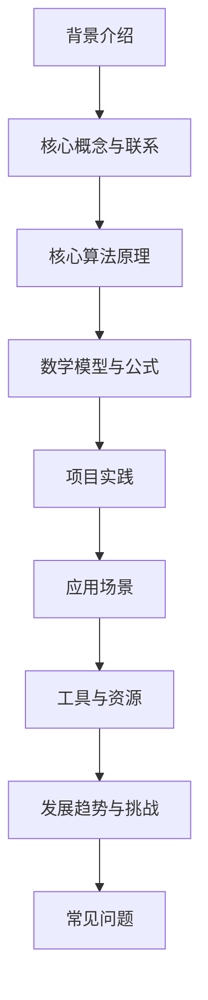
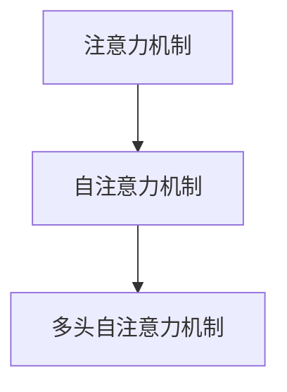
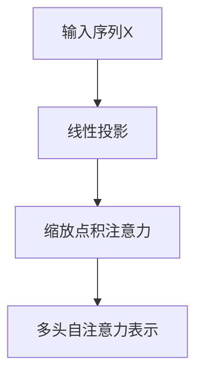

以下是题为《大语言模型原理与工程实践：多头自注意力模块》的技术博客文章正文内容：

# 大语言模型原理与工程实践：多头自注意力模块

## 1. 背景介绍

### 1.1 问题的由来

在自然语言处理(NLP)领域,序列建模一直是一个核心挑战。传统的序列模型如隐马尔可夫模型(HMM)和循环神经网络(RNN)在处理长序列时存在明显缺陷,难以有效捕捉长距离依赖关系。随着数据量的激增和任务复杂度的提高,这些模型在处理长序列时遇到了瓶颈。

### 1.2 研究现状

为了解决长序列建模问题,谷歌大脑团队在2017年提出了Transformer模型,其核心是多头自注意力(Multi-Head Attention)机制。该机制能够直接对序列中任意两个位置之间的元素进行关联,从而有效捕捉长距离依赖关系。Transformer模型在机器翻译、文本生成等任务上取得了卓越表现,引发了学术界和工业界的广泛关注。

### 1.3 研究意义

多头自注意力机制是Transformer模型的核心创新,也是近年来NLP领域最重要的技术突破之一。深入理解其原理及工程实现对于开发高性能的大型语言模型至关重要。本文将全面介绍多头自注意力机制的理论基础、数学模型、算法实现以及在大型语言模型中的应用,为读者提供系统的技术指导。

### 1.4 本文结构

本文将从以下几个方面深入探讨多头自注意力机制:

1. 核心概念与联系
2. 核心算法原理与具体操作步骤
3. 数学模型和公式详细讲解与案例分析
4. 项目实践:代码实例和详细解释说明
5. 实际应用场景
6. 工具和资源推荐
7. 总结:未来发展趋势与挑战
8. 附录:常见问题与解答

## 2. 核心概念与联系

### 2.1 注意力机制

注意力机制(Attention Mechanism)是近年来深度学习领域的一个重大突破,它赋予模型"注意力"的能力,使其能够在处理信息时专注于输入序列中的关键部分。这种选择性关注不同位置信息的能力,使模型能够更好地捕捉长距离依赖关系,从而提高了在机器翻译、阅读理解等任务上的性能表现。

### 2.2 自注意力机制

自注意力(Self-Attention)是注意力机制在编码器-解码器结构中的一种应用形式。不同于传统注意力机制需要将编码器的输出作为keys和values,自注意力机制将同一个输入序列作为queries、keys和values,通过计算输入序列中不同位置元素之间的相关性,捕捉序列内部的长距离依赖关系。

### 2.3 多头自注意力机制

多头自注意力(Multi-Head Attention)是Transformer模型中的核心创新,它将自注意力机制进行了并行化处理,使得模型能够同时关注输入序列中不同的位置子空间,从而提高了模型对不同位置信息的建模能力。每个"头"(Head)都是一个独立的自注意力子层,最终将所有头的输出进行拼接,形成最终的注意力表示。

## 3. 核心算法原理 & 具体操作步骤

### 3.1 算法原理概述

多头自注意力机制的核心思想是将输入序列进行多个线性投影,得到queries、keys和values,然后在每个子空间内计算自注意力,最后将所有子空间的注意力输出进行拼接。具体来说,包括以下几个关键步骤:

1. 线性投影: 将输入序列X通过不同的权重矩阵投影到queries、keys和values空间。
2. 缩放点积注意力: 在每个子空间内,计算queries与keys之间的缩放点积注意力权重,并将其与values相乘得到注意力输出。
3. 多头拼接: 将所有子空间的注意力输出拼接在一起,形成最终的多头自注意力表示。

### 3.2 算法步骤详解

1. **线性投影**

   对于长度为n的输入序列$X = (x_1, x_2, ..., x_n)$,我们将其投影到queries、keys和values空间:

   $$
   \begin{aligned}
   Q &= XW^Q \
   K &= XW^K \
   V &= XW^V
   \end{aligned}
   $$

   其中$W^Q \in \mathbb{R}^{d \times d_q}$、$W^K \in \mathbb{R}^{d \times d_k}$、$W^V \in \mathbb{R}^{d \times d_v}$分别是queries、keys和values的投影矩阵,d是输入序列的维度,而$d_q$、$d_k$和$d_v$则是对应的投影维度。

2. **缩放点积注意力**

   对于第i个头(Head),我们计算queries $Q_i$与keys $K_i$之间的缩放点积注意力权重:

   $$
   \text{Attention}(Q_i, K_i, V_i) = \text{softmax}\left(\frac{Q_iK_i^\top}{\sqrt{d_k}}\right)V_i
   $$

   其中$\sqrt{d_k}$是一个缩放因子,用于防止点积的值过大导致softmax函数梯度较小。注意力权重矩阵$\text{Attention}(Q_i, K_i, V_i) \in \mathbb{R}^{n \times d_v}$表示了输入序列中不同位置元素之间的关联强度。

3. **多头拼接**

   对于总共h个头,我们将所有头的注意力输出拼接在一起,得到最终的多头自注意力表示:

   $$
   \text{MultiHead}(Q, K, V) = \text{Concat}(\text{head}_1, \text{head}_2, ..., \text{head}_h)W^O
   $$

   其中$\text{head}_i = \text{Attention}(Q_i, K_i, V_i)$,而$W^O \in \mathbb{R}^{hd_v \times d}$是一个可训练的投影矩阵,用于将拼接后的表示映射回原始的维度d。

### 3.3 算法优缺点

**优点:**

1. 能够有效捕捉长距离依赖关系,克服了RNN等模型的局限性。
2. 计算效率高,可以进行并行计算,加速模型训练和推理。
3. 灵活性强,可以应用于不同的序列建模任务。

**缺点:**

1. 计算复杂度较高,尤其是对于长序列,需要计算全序列的自注意力权重。
2. 缺乏位置编码信息,无法很好地捕捉序列的顺序结构。
3. 对于某些特定任务,性能可能不如专门设计的模型。

### 3.4 算法应用领域

多头自注意力机制广泛应用于自然语言处理的各个领域,包括但不限于:

- **机器翻译**: Transformer是谷歌神经机器翻译系统的核心模型,显著提高了翻译质量。
- **文本生成**: GPT、BERT等大型语言模型都采用了多头自注意力机制,可用于文本生成、文本摘要等任务。
- **阅读理解**: 多头自注意力有助于捕捉文本中的长距离依赖关系,提高了阅读理解的性能。
- **关系抽取**: 在关系抽取任务中,多头自注意力可以更好地建模实体之间的关系。
- **情感分析**: 情感分析需要捕捉句子中不同词语之间的关联,多头自注意力在此任务中表现出色。

## 4. 数学模型和公式 & 详细讲解 & 举例说明

### 4.1 数学模型构建

我们将从数学角度对多头自注意力机制进行建模,以更好地理解其原理。假设输入序列$X = (x_1, x_2, ..., x_n)$,其中$x_i \in \mathbb{R}^d$是第i个位置的词嵌入向量。

1. **线性投影**

   我们将输入序列X投影到queries、keys和values空间:

   $$
   \begin{aligned}
   Q &= XW^Q \
   K &= XW^K \
   V &= XW^V
   \end{aligned}
   $$

   其中$W^Q \in \mathbb{R}^{d \times d_q}$、$W^K \in \mathbb{R}^{d \times d_k}$、$W^V \in \mathbb{R}^{d \times d_v}$分别是可训练的投影矩阵。

2. **缩放点积注意力**

   对于第i个头,我们计算queries $Q_i$与keys $K_i$之间的缩放点积注意力权重:

   $$
   \text{Attention}(Q_i, K_i, V_i) = \text{softmax}\left(\frac{Q_iK_i^\top}{\sqrt{d_k}}\right)V_i
   $$

   其中$\sqrt{d_k}$是一个缩放因子,用于防止点积的值过大导致softmax函数梯度较小。注意力权重矩阵$\text{Attention}(Q_i, K_i, V_i) \in \mathbb{R}^{n \times d_v}$表示了输入序列中不同位置元素之间的关联强度。

3. **多头拼接**

   对于总共h个头,我们将所有头的注意力输出拼接在一起,得到最终的多头自注意力表示:

   $$
   \text{MultiHead}(Q, K, V) = \text{Concat}(\text{head}_1, \text{head}_2, ..., \text{head}_h)W^O
   $$

   其中$\text{head}_i = \text{Attention}(Q_i, K_i, V_i)$,而$W^O \in \mathbb{R}^{hd_v \times d}$是一个可训练的投影矩阵,用于将拼接后的表示映射回原始的维度d。

### 4.2 公式推导过程

我们将从缩放点积注意力公式出发,推导多头自注意力的数学表达式。

首先,对于第i个头,我们有:

$$
\begin{aligned}
\text{head}_i &= \text{Attention}(Q_i, K_i, V_i) \
             &= \text{softmax}\left(\frac{Q_iK_i^\top}{\sqrt{d_k}}\right)V_i \
             &= \text{softmax}\left(\frac{(XW^Q_i)(XW^K_i)^\top}{\sqrt{d_k}}\right)(XW^V_i)
\end{aligned}
$$

其中$W^Q_i$、$W^K_i$和$W^V_i$分别是第i个头对应的投影矩阵。

接下来,我们将所有头的输出拼接在一起:

$$
\begin{aligned}
\text{MultiHead}(Q, K, V) &= \text{Concat}(\text{head}_1, \text{head}_2, ..., \text{head}_h)W^O \
                          &= \text{Concat}\left(\text{softmax}\left(\frac{(XW^Q_1)(XW^K_1)^\top}{\sqrt{d_k}}\right)(XW^V_1), \right. \
                          &\qquad\qquad\quad \left. \text{softmax}\left(\frac{(XW^Q_2)(XW^K_2)^\top}{\sqrt{d_k}}\right)(XW^V_2), ..., \right. \
                          &\qquad\qquad\qquad \left. \text{softmax}\left(\frac{(XW^Q_h)(XW^K_h)^\top}{\sqrt{d_k}}\right)(XW^V_h)\right)W^O
\end{aligned}
$$

其中$W^O \in \mathbb{R}^{hd_v \times d}$是一个可训练的投影矩阵,用于将拼