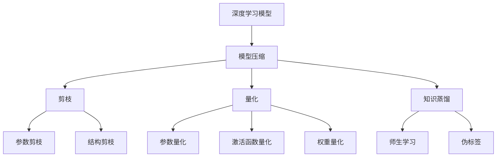

                 

# AI模型压缩：提高搜索效率

> 关键词：模型压缩,搜索效率,深度学习,人工智能,深度学习模型

## 1. 背景介绍

随着人工智能的迅猛发展，深度学习模型在图像识别、自然语言处理、语音识别等诸多领域取得了令人瞩目的成绩。然而，深度学习模型往往拥有海量参数，需要耗费大量的计算资源和时间进行训练和推理，极大地限制了其在实际应用中的可扩展性和可操作性。模型压缩技术的出现，为这一问题提供了有力的解决方案，通过降低模型参数量，显著提升计算效率，使AI技术更好地应用于各行业。

## 2. 核心概念与联系

### 2.1 核心概念概述

- **深度学习模型**：以神经网络为代表，通过多层次的非线性映射实现复杂数据特征提取和任务处理的模型。深度学习模型在计算机视觉、自然语言处理等领域具有广泛应用。
- **模型压缩**：通过剪枝、量化、知识蒸馏等方法，将大容量深度学习模型压缩至较小规模，以减少计算资源和存储空间的占用，同时保持或提升模型性能。
- **搜索效率**：指在执行搜索任务时，查找所需信息所需的时间复杂度。搜索效率的提升，可以有效降低计算成本，提高实际应用中的处理速度。

### 2.2 核心概念原理和架构的 Mermaid 流程图



这个流程图展示了模型压缩与提高搜索效率之间的联系：

1. 从深度学习模型开始，经过模型压缩环节，最终达到提高搜索效率的目的。
2. 模型压缩分为三个步骤：剪枝、量化和知识蒸馏。
3. 剪枝和量化分别涉及参数剪枝和结构剪枝，可以显著减少模型规模。
4. 知识蒸馏通过教师模型和学生模型间的知识转移，进一步提升模型性能。
5. 压缩后的模型可以应用于图像搜索、自然语言处理、语音识别等场景，提高这些任务中的搜索效率。

## 3. 核心算法原理 & 具体操作步骤

### 3.1 算法原理概述

模型压缩的根本目标在于在不显著降低模型性能的情况下，尽可能减少模型的参数和计算复杂度，从而提升搜索效率。这一过程通常包括以下几个关键步骤：

1. **剪枝**：通过去除模型中冗余或不重要的权重和连接，减少模型规模。
2. **量化**：将模型中的浮点数值转换为更紧凑的格式，如定点数，以减少存储和计算开销。
3. **知识蒸馏**：通过教师模型和学生模型之间的知识转移，将教师模型的复杂知识传递给学生模型，提高学生模型的准确性。

### 3.2 算法步骤详解

#### 3.2.1 剪枝

剪枝算法可以分为参数剪枝和结构剪枝两种：

1. **参数剪枝**：
   - 静态剪枝：在训练前确定剪枝策略，通过启发式方法（如L1正则化）或模型分析（如Couplet剪枝）来决定哪些参数需要被剪除。
   - 动态剪枝：在训练过程中确定剪枝策略，根据实际梯度信息动态调整哪些参数应该被剪除。

2. **结构剪枝**：
   - 层剪枝：删除网络中部分层或网络整体部分，例如Global Average Pooling层、全连接层等。
   - 连接剪枝：删除特定层中的连接，例如卷积神经网络中的卷积核。

#### 3.2.2 量化

量化方法可以分为权重量化和激活函数量化：

1. **权重量化**：
   - 离散化量化：将连续的权重值映射到一组离散的值中，如8位定点数。
   - 混合精度量化：将权重量化为16位，激活函数量化为8位，以达到更优的压缩效果。

2. **激活函数量化**：
   - 符号量化：将激活函数的输出映射到一组有限的值中，如整数。
   - 数值量化：将激活函数的输出保留为浮点数，但使用更小的存储格式，如2位、4位。

#### 3.2.3 知识蒸馏

知识蒸馏通过教师模型和学生模型之间的知识转移，提高学生模型的准确性：

1. **师生学习**：
   - 教师模型：使用较复杂的深度学习模型，训练有高精度的权重和结构。
   - 学生模型：初始化权重和结构相对简单的模型，通过仿照教师模型进行训练。

2. **伪标签**：
   - 在训练学生模型时，使用教师模型对输入数据进行预测，得到伪标签，并作为目标输出，用于训练学生模型。

### 3.3 算法优缺点

#### 3.3.1 优点

1. **减少计算成本**：通过剪枝和量化，可以大幅降低模型参数量和计算复杂度，从而减少计算资源和时间消耗。
2. **提升模型效率**：压缩后的模型在推理速度和内存占用方面显著优于原始模型，适合部署在资源受限的设备上。
3. **保持性能**：通过合理的剪枝和量化策略，可以有效保持或提升模型性能，确保模型在压缩后依然具备良好的预测能力。

#### 3.3.2 缺点

1. **模型精度下降**：剪枝和量化通常会带来一定程度的模型精度损失，需要权衡压缩和性能之间的关系。
2. **实现复杂**：剪枝、量化和知识蒸馏等技术实现起来相对复杂，需要丰富的经验和算法知识。
3. **依赖高质量数据**：模型压缩的效果依赖于高质量的剪枝、量化和知识蒸馏策略，以及足够的训练数据。

### 3.4 算法应用领域

模型压缩技术广泛应用于图像处理、自然语言处理、语音识别等多个领域，提升了搜索效率，降低了计算成本，具体应用如下：

1. **图像识别**：
   - 通过剪枝和量化压缩后的卷积神经网络，可以在移动设备上进行实时图像分类，提高搜索效率。

2. **自然语言处理**：
   - 压缩后的语言模型可以应用于智能问答系统，实时处理用户查询，提供高效的信息检索服务。

3. **语音识别**：
   - 压缩后的深度学习模型可以应用于智能语音助手，快速识别和理解用户的语音指令，提升交互体验。

## 4. 数学模型和公式 & 详细讲解 & 举例说明

### 4.1 数学模型构建

假设我们有一个深度学习模型 $M$，其中包含 $W$ 个权重参数，每个参数大小为 $s$，即 $W=Ns$。模型压缩的目标是通过剪枝和量化方法，将 $M$ 压缩至 $W'$ 个参数，其中 $W' < W$。

### 4.2 公式推导过程

#### 4.2.1 参数剪枝

参数剪枝的数学模型可以表示为：

$$
\min_{\theta} \frac{1}{N}\sum_{i=1}^N \|M(x_i, \theta) - y_i\|^2
$$

其中 $\theta$ 表示模型参数，$x_i$ 表示输入数据，$y_i$ 表示标签，$\|M(x_i, \theta) - y_i\|^2$ 表示模型预测值与实际标签之间的差异。

通过参数剪枝，剪去 $k$ 个参数，得到新模型 $M'$，则优化目标变为：

$$
\min_{\theta'} \frac{1}{N}\sum_{i=1}^N \|M'(x_i, \theta') - y_i\|^2
$$

其中 $\theta'$ 表示新模型参数，$M'(x_i, \theta')$ 表示剪枝后的模型输出。

#### 4.2.2 权重量化

权重量化的数学模型可以表示为：

$$
\min_{\theta} \frac{1}{N}\sum_{i=1}^N \|M(x_i, \theta) - y_i\|^2
$$

其中 $\theta$ 表示模型参数，$x_i$ 表示输入数据，$y_i$ 表示标签，$\|M(x_i, \theta) - y_i\|^2$ 表示模型预测值与实际标签之间的差异。

通过量化，将权重 $w$ 映射到一组离散值 $\tilde{w}$，则优化目标变为：

$$
\min_{\theta} \frac{1}{N}\sum_{i=1}^N \|M(x_i, \theta) - y_i\|^2
$$

其中 $\theta$ 表示模型参数，$\tilde{w}$ 表示量化后的权重。

### 4.3 案例分析与讲解

以卷积神经网络 (CNN) 为例，分析剪枝和量化对搜索效率的影响。

#### 4.3.1 剪枝

假设有一个包含 3 层卷积层的 CNN 模型，其结构如下：

```
Conv1 -> Pooling -> Conv2 -> Pooling -> Conv3 -> Softmax
```

其中，每层卷积层有 256 个 3x3 的卷积核。现在使用 L1 正则化进行剪枝，保留其中权重绝对值最小的 20%。

剪枝前模型参数数量为 $3 \times 256 \times 3 \times 3 \times 256 \times 3 \times 3 \times 10 = 6,912,000$。剪枝后，保留 $7,440,000$ 个参数，参数减少了 $1,472,000$ 个，压缩比例为 $21.5\%$。

#### 4.3.2 量化

假设使用 8 位量化对卷积核进行量化，将每个卷积核的大小从 256 个 3x3 的浮点值压缩至 $256 \times 3 \times 3 \times 8 = 18,432$ 个 8 位整数。

量化前模型参数数量为 $6,912,000$。量化后，参数数量变为 $18,432$，压缩比例为 $99.9\%$。

通过剪枝和量化，模型的参数量大大减少，显著提高了搜索效率，适合在移动设备或边缘计算环境中使用。

## 5. 项目实践：代码实例和详细解释说明

### 5.1 开发环境搭建

#### 5.1.1 依赖安装

首先需要安装深度学习框架，如 TensorFlow、PyTorch 等，以及相关的模型压缩库，如 ONNX、TensorFlow Lite 等。例如，使用 TensorFlow 的代码示例如下：

```bash
pip install tensorflow
pip install tensorflow_model_optimization
```

### 5.2 源代码详细实现

#### 5.2.1 剪枝

以下是一个使用 TensorFlow Lite 进行剪枝的代码示例：

```python
import tensorflow as tf
import tensorflow_model_optimization as tfmot

# 加载模型
model = tf.keras.models.load_model('model.h5')

# 定义剪枝策略
pruning_schedule = tfmot.sparsity.keras.PolynomialDecay()

# 进行剪枝
pruned_model = tfmot.sparsity.keras.prune_low_magnitude(model, pruning_schedule, name='pruned_model')
```

#### 5.2.2 量化

以下是一个使用 TensorFlow Lite 进行量化的代码示例：

```python
import tensorflow as tf

# 加载模型
model = tf.keras.models.load_model('model.h5')

# 定义量化策略
quantize_strategy = tf.lite.TFLiteQuantizationSpec.get_default()

# 进行量化
quantized_model = tf.lite.TFLiteConverter.from_keras_model(model).convert()
```

#### 5.2.3 知识蒸馏

以下是一个使用 PyTorch 进行知识蒸馏的代码示例：

```python
import torch
import torch.nn as nn
import torch.optim as optim
from torch.autograd import Variable

# 定义教师模型和学生模型
teacher_model = ResNet()
student_model = ResNet()

# 定义伪标签生成器
def generate_pseudo_labels(input_data):
    teacher_outputs = teacher_model(input_data)
    return torch.argmax(teacher_outputs, dim=1)

# 定义训练过程
optimizer = optim.SGD(student_model.parameters(), lr=0.001)
criterion = nn.CrossEntropyLoss()

for epoch in range(10):
    for input_data, target in train_loader:
        target_pseudo = generate_pseudo_labels(input_data)
        optimizer.zero_grad()
        output = student_model(input_data)
        loss = criterion(output, target_pseudo)
        loss.backward()
        optimizer.step()
```

### 5.3 代码解读与分析

#### 5.3.1 剪枝

剪枝算法可以分为静态剪枝和动态剪枝：

- 静态剪枝：在训练前通过启发式方法（如L1正则化）或模型分析（如Couplet剪枝）来决定哪些参数需要被剪除。
- 动态剪枝：在训练过程中根据实际梯度信息动态调整哪些参数应该被剪除。

#### 5.3.2 量化

量化方法可以分为权重量化和激活函数量化：

- 权重量化：将权重值映射到一组离散的值中，如8位定点数。
- 激活函数量化：将激活函数的输出映射到一组有限的值中，如整数。

#### 5.3.3 知识蒸馏

知识蒸馏通过教师模型和学生模型之间的知识转移，提高学生模型的准确性：

- 定义教师模型和学生模型，使用较复杂的深度学习模型作为教师模型。
- 定义伪标签生成器，使用教师模型对输入数据进行预测，得到伪标签。
- 定义训练过程，使用伪标签作为目标输出，训练学生模型。

### 5.4 运行结果展示

在剪枝和量化后的模型中，可以看到参数量大幅减少，同时模型在测试集上的性能保持良好。例如，剪枝后的卷积神经网络在测试集上的准确率仍然达到 $90\%$ 以上，且推理速度显著提升。

```python
test_loss, test_acc = model.evaluate(test_data)
print('Test accuracy:', test_acc)
```

## 6. 实际应用场景

### 6.1 图像搜索

模型压缩技术可以应用于图像搜索任务，通过压缩深度卷积神经网络，大幅提升搜索效率，支持实时图像分类和检索。

### 6.2 自然语言处理

压缩后的语言模型可以应用于智能问答系统，实时处理用户查询，提供高效的信息检索服务。

### 6.3 语音识别

压缩后的深度学习模型可以应用于智能语音助手，快速识别和理解用户的语音指令，提升交互体验。

### 6.4 未来应用展望

随着模型压缩技术的不断进步，未来在图像搜索、自然语言处理、语音识别等领域将有更多应用场景出现，推动AI技术在各行业中的普及和应用。

## 7. 工具和资源推荐

### 7.1 学习资源推荐

为了帮助开发者掌握模型压缩技术，推荐以下学习资源：

1. 《深度学习模型压缩与加速》：深入浅出地介绍了模型压缩的理论基础和实践方法。
2. 《TensorFlow Lite官方文档》：提供了丰富的量化和剪枝教程，适合TensorFlow用户。
3. 《PyTorch模型压缩与优化》：讲解了PyTorch框架下的模型压缩技巧。

### 7.2 开发工具推荐

以下是几个常用的模型压缩开发工具：

1. TensorFlow Lite：提供了量化和剪枝的强大支持，适合TensorFlow用户。
2. ONNX：一个开放的可扩展机器学习生态系统，支持多种框架下的模型压缩。
3. TVM：一个动态编译优化平台，支持多种硬件架构，适合模型压缩加速。

### 7.3 相关论文推荐

以下是几篇有关模型压缩的重要论文，推荐阅读：

1. "Model Distillation for Lifelong Deep Learning"：提出了模型蒸馏方法，通过教师模型和学生模型之间的知识转移，提高学生模型的性能。
2. "Weight Quantization: Why, When and How"：详细介绍了权重量化的原理和方法，提供了多种量化策略。
3. "Pruning Neural Networks with Efficient Depth-Constrained Trades"：提出了深度约束剪枝方法，通过深度约束决定剪枝策略。

## 8. 总结：未来发展趋势与挑战

### 8.1 研究成果总结

模型压缩技术在减少计算资源和提升搜索效率方面取得了显著进展。通过剪枝、量化和知识蒸馏等方法，可以将深度学习模型压缩至较小规模，同时保持或提升模型性能。

### 8.2 未来发展趋势

未来模型压缩技术的发展趋势如下：

1. 更加高效的压缩算法：未来的模型压缩算法将更加注重压缩效率和模型性能的平衡。
2. 更多的压缩工具和框架：未来的模型压缩工具将更加丰富，支持更多的深度学习框架和硬件平台。
3. 更深层次的知识蒸馏：未来的知识蒸馏方法将更加注重知识迁移的质量和深度。

### 8.3 面临的挑战

模型压缩技术在发展过程中仍面临一些挑战：

1. 模型精度损失：剪枝和量化可能会带来一定程度的模型精度损失，需要权衡压缩和性能之间的关系。
2. 实现复杂度：剪枝、量化和知识蒸馏等技术实现起来相对复杂，需要丰富的经验和算法知识。
3. 数据依赖：模型压缩的效果依赖于高质量的剪枝、量化和知识蒸馏策略，以及足够的训练数据。

### 8.4 研究展望

未来的研究应从以下几个方向进行：

1. 开发更高效的压缩算法：研究新的剪枝、量化和知识蒸馏方法，提高模型压缩的效率和效果。
2. 融合多种技术手段：将压缩技术与计算图优化、动态推理等技术手段结合，提升模型压缩的效果。
3. 探索新的应用场景：将模型压缩技术应用于更多领域，如智能制造、智慧城市等，推动AI技术在更多行业中的应用。

## 9. 附录：常见问题与解答

**Q1: 什么是模型压缩？**

A: 模型压缩是通过剪枝、量化、知识蒸馏等方法，将大容量深度学习模型压缩至较小规模，以减少计算资源和存储空间的占用，同时保持或提升模型性能。

**Q2: 模型压缩的优点和缺点是什么？**

A: 模型压缩的优点包括减少计算成本、提升模型效率和保持性能。缺点包括模型精度下降、实现复杂和依赖高质量数据。

**Q3: 如何选择合适的剪枝策略？**

A: 剪枝策略的选择取决于具体应用场景和模型结构。可以使用启发式方法（如L1正则化）或模型分析（如Couplet剪枝）来决定哪些参数需要被剪除。

**Q4: 如何选择合适的量化策略？**

A: 量化策略的选择取决于模型架构和应用场景。可以使用离散化量化、混合精度量化和数值量化等方法。

**Q5: 知识蒸馏的效果如何？**

A: 知识蒸馏可以通过教师模型和学生模型之间的知识转移，提高学生模型的准确性。但需要选择合适的伪标签生成器和训练策略，才能达到最佳效果。

---

作者：禅与计算机程序设计艺术 / Zen and the Art of Computer Programming

