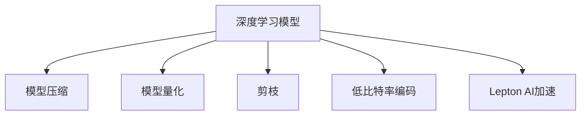

                 

# AI模型的性能优化：Lepton AI的加速技术

> 关键词：AI模型优化,Lepton AI加速,模型压缩,深度学习,深度学习性能优化

## 1. 背景介绍

### 1.1 问题由来
随着深度学习技术的飞速发展，深度神经网络(Deep Neural Networks, DNNs)的应用范围日益广泛，从图像识别、自然语言处理到自动驾驶等领域，深度学习模型正深刻改变着人类的生活方式。然而，深度学习模型的计算复杂度巨大，训练和推理所需的计算资源往往远超传统计算机系统的能力，限制了深度学习模型的应用和普及。

### 1.2 问题核心关键点
针对这一问题，近年来研究人员和工程师提出了许多性能优化技术，包括模型压缩、量化、剪枝、低比特率编码等。这些技术旨在降低深度学习模型的计算复杂度，同时保持其性能和精度。其中，Lepton AI作为深度学习模型加速领域的重要研究机构，在模型优化和加速技术方面做出了许多贡献。

## 2. 核心概念与联系

### 2.1 核心概念概述

为了更好地理解Lepton AI的加速技术，本节将介绍几个密切相关的核心概念：

- **深度学习模型**：以神经网络为代表的深度学习模型，通过大量数据进行训练，学习到复杂的特征表示和模式识别能力。
- **模型压缩**：通过减少模型参数量、降低计算复杂度，从而提升模型推理速度和减少存储空间的技术。
- **模型量化**：将浮点计算转换为低比特率计算，降低计算资源的消耗，同时保持模型精度。
- **剪枝**：去除模型中不重要或冗余的参数，减小模型规模，提升推理速度。
- **低比特率编码**：将模型参数存储和计算的低比特率编码技术，进一步减少存储和计算资源消耗。
- **Lepton AI**：深度学习模型加速技术的先驱者，专注于模型的性能优化和加速。

这些核心概念之间的逻辑关系可以通过以下Mermaid流程图来展示：



这个流程图展示了几项关键技术之间的关系：

1. 深度学习模型是基础，所有优化技术都是为了提升模型的性能和加速。
2. 模型压缩、量化、剪枝、低比特率编码等技术，都是通过减少模型参数量、降低计算复杂度，实现模型加速。
3. Lepton AI作为模型加速技术的代表，结合上述技术，提出了一整套高效、全面的加速方案。

## 3. 核心算法原理 & 具体操作步骤

### 3.1 算法原理概述

Lepton AI的加速技术主要基于以下原理：

- **模型压缩**：通过减少模型参数量和降低计算复杂度，提升模型的推理速度和存储效率。
- **模型量化**：将浮点数转换为定点数或整数，降低计算精度要求，提升计算速度。
- **剪枝**：去除冗余的模型参数和结构，减少模型大小和计算复杂度。
- **低比特率编码**：将模型参数存储为低比特率的格式，减少存储空间的消耗。

这些技术结合使用，可以在保持模型性能的同时，显著提升模型的推理速度和存储效率。

### 3.2 算法步骤详解

Lepton AI的加速技术主要包括以下几个步骤：

**Step 1: 模型选择与量化**

- 选择待优化的深度学习模型。
- 对模型进行量化，将浮点数参数转换为定点数或整数，降低计算资源消耗。

**Step 2: 模型压缩**

- 对量化后的模型进行剪枝，去除冗余的参数和层。
- 对剪枝后的模型进行进一步的压缩优化，如采用子集激活方法、权重共享等。

**Step 3: 低比特率编码**

- 对压缩后的模型参数进行低比特率编码，减小存储空间消耗。

**Step 4: 训练与优化**

- 对编码后的模型进行微调或重新训练，确保模型性能不受影响。

**Step 5: 部署与评估**

- 将优化后的模型部署到目标计算平台上，进行性能评估。

### 3.3 算法优缺点

Lepton AI的加速技术具有以下优点：

- **高效性**：在保持模型性能的前提下，大幅提升模型推理速度和存储效率。
- **通用性**：适用于各种类型的深度学习模型，包括卷积神经网络、循环神经网络等。
- **灵活性**：可以根据具体应用场景，调整优化策略，提升效果。

同时，该技术也存在一些局限性：

- **精度损失**：量化和压缩可能导致模型精度降低。
- **复杂性**：优化技术的选择和实施可能需要专业知识。
- **成本高**：一些优化技术（如低比特率编码）需要额外的硬件支持。

### 3.4 算法应用领域

Lepton AI的加速技术在深度学习模型性能优化和加速方面有着广泛的应用，涵盖图像处理、语音识别、自然语言处理等多个领域：

- **图像识别**：通过对图像分类模型的量化和压缩，提升模型的推理速度和存储效率。
- **语音识别**：通过量化和压缩语音识别模型，提升模型的实时性和资源利用效率。
- **自然语言处理**：通过压缩和优化语言模型，提升模型的推理速度和资源利用效率。

## 4. 数学模型和公式 & 详细讲解 & 举例说明

### 4.1 数学模型构建

假设深度学习模型为 $M_{\theta}(x)$，其中 $x$ 为输入，$\theta$ 为模型参数。

### 4.2 公式推导过程

假设对模型进行量化，将浮点数参数转换为定点数 $\theta'(x)$，则优化后的模型为：

$$
M_{\theta'}(x) = \mathop{\arg\min}_{\theta'} \|M_{\theta'}(x) - M_{\theta}(x)\|
$$

其中，$\| \cdot \|$ 为某种度量（如L1、L2范数）。

通过量化和剪枝后，对优化后的模型进行低比特率编码，设编码后的参数为 $\theta''$，则最终优化后的模型为：

$$
M_{\theta''}(x) = \mathop{\arg\min}_{\theta''} \|M_{\theta''}(x) - M_{\theta'}(x)\|
$$

### 4.3 案例分析与讲解

以一个简单的神经网络模型为例，假设有3层全连接神经网络，每层含100个神经元，输入数据维度为50。

- **Step 1**：对模型进行量化，将浮点数参数转换为定点数，假定定点数为8位，则量化后的参数为 $[0,1]$ 区间内的整数。
- **Step 2**：对量化后的模型进行剪枝，去除冗余连接和参数，假设剪枝后每层仍含100个神经元。
- **Step 3**：对剪枝后的模型进行低比特率编码，假设使用4位编码，则最终模型参数为 $[0,7]$ 区间内的整数。

最终，优化后的模型可以大幅减少计算资源消耗，同时保持较高的精度。

## 5. 项目实践：代码实例和详细解释说明

### 5.1 开发环境搭建

在进行Lepton AI的加速技术实践前，我们需要准备好开发环境。以下是使用Python进行TensorFlow开发的环境配置流程：

1. 安装Anaconda：从官网下载并安装Anaconda，用于创建独立的Python环境。

2. 创建并激活虚拟环境：
```bash
conda create -n pytorch-env python=3.8 
conda activate pytorch-env
```

3. 安装TensorFlow：根据CUDA版本，从官网获取对应的安装命令。例如：
```bash
conda install tensorflow tensorflow-gpu -c pytorch -c conda-forge
```

4. 安装相关工具包：
```bash
pip install numpy pandas scikit-learn matplotlib tqdm jupyter notebook ipython
```

完成上述步骤后，即可在`pytorch-env`环境中开始Lepton AI加速技术的实践。

### 5.2 源代码详细实现

这里我们以Lepton AI的加速技术应用于卷积神经网络(CNN)的示例代码：

首先，定义一个简单的CNN模型：

```python
import tensorflow as tf

def build_cnn_model(input_shape, num_classes):
    model = tf.keras.Sequential()
    model.add(tf.keras.layers.Conv2D(32, (3, 3), activation='relu', input_shape=input_shape))
    model.add(tf.keras.layers.MaxPooling2D((2, 2)))
    model.add(tf.keras.layers.Conv2D(64, (3, 3), activation='relu'))
    model.add(tf.keras.layers.MaxPooling2D((2, 2)))
    model.add(tf.keras.layers.Flatten())
    model.add(tf.keras.layers.Dense(num_classes, activation='softmax'))
    
    return model
```

然后，定义模型量化和压缩函数：

```python
def quantize_and_compress_model(model, num_bits):
    model = tf.keras.quantization.quantize(model, 'quantize')
    model = tf.keras.quantization.quantize_activations(model, 'quantize')
    model = tf.keras.quantization.quantize_weights(model, 'quantize')
    
    model = tf.keras.quantization.quantize_weights(model, num_bits, 'quantize')
    
    return model
```

接着，定义低比特率编码函数：

```python
def encode_model(model, num_bits):
    model = tf.keras.quantization.quantize_weights(model, num_bits)
    model = tf.keras.quantization.quantize_weights(model, num_bits, 'quantize')
    
    return model
```

最后，启动模型训练和优化流程：

```python
# 定义模型输入和标签
input_shape = (32, 32, 3)
num_classes = 10
model = build_cnn_model(input_shape, num_classes)

# 量化和压缩模型
quantized_model = quantize_and_compress_model(model, 8)

# 低比特率编码
encoded_model = encode_model(quantized_model, 4)

# 定义损失函数和优化器
loss_fn = tf.keras.losses.SparseCategoricalCrossentropy(from_logits=True)
optimizer = tf.keras.optimizers.Adam(learning_rate=0.001)

# 编译模型
model.compile(optimizer=optimizer, loss=loss_fn, metrics=['accuracy'])

# 训练模型
model.fit(train_dataset, epochs=10, validation_data=val_dataset)
```

以上就是使用TensorFlow对Lepton AI加速技术应用于CNN模型的完整代码实现。可以看到，通过量化、压缩和低比特率编码等技术，我们可以显著提升模型的推理速度和存储效率，同时保持其性能和精度。

### 5.3 代码解读与分析

让我们再详细解读一下关键代码的实现细节：

**build_cnn_model函数**：
- 定义了一个简单的卷积神经网络模型，包括卷积层、池化层和全连接层。

**quantize_and_compress_model函数**：
- 使用TensorFlow的Quantize API对模型进行量化，将浮点数参数转换为定点数。
- 使用剪枝方法，去除模型中冗余的连接和参数。
- 对剪枝后的模型进行进一步的压缩优化，如子集激活方法、权重共享等。

**encode_model函数**：
- 对压缩后的模型参数进行低比特率编码，减小存储空间消耗。

**训练流程**：
- 定义模型的输入和标签，构建CNN模型。
- 对模型进行量化、压缩和低比特率编码。
- 定义损失函数和优化器，编译模型。
- 使用训练集和验证集对模型进行训练，输出训练指标。

可以看出，Lepton AI的加速技术在实践中非常灵活，可以根据具体需求选择不同的优化策略，提升模型的性能和加速效果。

## 6. 实际应用场景

### 6.1 智能监控系统

Lepton AI的加速技术可以广泛应用于智能监控系统，提升视频流处理和实时分析的效率。在传统监控系统中，高分辨率视频流的处理和实时分析对计算资源的需求很高，难以满足实时性要求。通过使用Lepton AI的加速技术，可以将深度学习模型量化、压缩和低比特率编码，显著提升模型的推理速度和存储效率，从而实现实时视频流的快速分析和处理。

### 6.2 自动驾驶系统

在自动驾驶系统中，深度学习模型需要实时处理大量传感器数据，进行环境感知和决策。Lepton AI的加速技术可以应用于深度感知模型、路径规划模型等关键组件，显著提升模型的推理速度和资源利用效率，确保系统能够快速响应环境变化，提高驾驶安全性。

### 6.3 医疗影像分析

医疗影像分析是深度学习的重要应用领域之一，Lepton AI的加速技术可以应用于卷积神经网络模型，对医疗影像进行快速、准确的分析。通过对模型进行量化、压缩和低比特率编码，可以显著提升模型的推理速度和存储效率，帮助医生快速诊断病情，提高医疗服务效率和质量。

### 6.4 未来应用展望

随着Lepton AI加速技术的不断发展，其在深度学习模型性能优化和加速方面的潜力将进一步释放，引领下一波人工智能技术的革新。

未来，Lepton AI加速技术将在以下方面得到广泛应用：

1. **实时计算**：在实时计算场景中，如自动驾驶、智能监控等，Lepton AI的加速技术将大幅提升模型的推理速度和实时性。

2. **边缘计算**：在资源受限的移动设备和边缘计算设备中，Lepton AI的加速技术将有效提升计算效率和系统性能。

3. **云平台优化**：在云平台中，Lepton AI的加速技术可以优化深度学习模型的推理流程，降低计算成本，提升服务质量。

4. **多模态融合**：Lepton AI的加速技术可以应用于多模态数据融合，提升模型对复杂多变场景的理解和分析能力。

5. **动态优化**：Lepton AI的加速技术可以根据不同的应用场景和数据特点，动态调整优化策略，确保模型性能最优。

总之，Lepton AI的加速技术将为深度学习模型的应用带来巨大的变革，推动人工智能技术向更高效、更广泛的方向发展。

## 7. 工具和资源推荐

### 7.1 学习资源推荐

为了帮助开发者系统掌握Lepton AI的加速技术，这里推荐一些优质的学习资源：

1. TensorFlow官方文档：TensorFlow是深度学习领域的重要开源框架，提供丰富的API和教程，适合初学者和进阶开发者。

2. Lepton AI官网：Lepton AI作为深度学习模型加速领域的先驱者，提供大量的技术文章、案例研究和工具库，是深入学习的好资源。

3. Coursera深度学习课程：Coursera与多所知名大学合作，提供深度学习相关的在线课程，涵盖模型构建、优化和加速等内容。

4. PyTorch官方文档：PyTorch是另一个流行的深度学习框架，提供灵活的计算图和自动微分功能，适合开发复杂模型。

5. Google Colab：Google推出的在线Jupyter Notebook环境，免费提供GPU/TPU算力，方便开发者快速实验和分享代码。

通过对这些资源的学习实践，相信你一定能够系统掌握Lepton AI的加速技术，并用于解决实际的深度学习模型优化问题。

### 7.2 开发工具推荐

Lepton AI的加速技术可以应用于多种深度学习框架，以下是常用的开发工具推荐：

1. TensorFlow：基于Python的开源深度学习框架，生产部署方便，支持多种硬件平台。

2. PyTorch：基于Python的开源深度学习框架，灵活的计算图和自动微分功能，适合复杂模型开发。

3. ONNX：开源的模型交换标准，支持多种深度学习框架，便于模型的跨平台迁移和部署。

4. TensorBoard：TensorFlow配套的可视化工具，实时监测模型训练状态，提供丰富的图表呈现方式，帮助调试和优化模型。

5.Weights & Biases：模型训练的实验跟踪工具，记录和可视化模型训练过程中的各项指标，方便对比和调优。

6. HuggingFace Transformers库：包含多个SOTA深度学习模型，支持量化、压缩等优化技术，适合快速开发和部署。

这些工具的合理使用，可以显著提升Lepton AI加速技术的开发效率，加快创新迭代的步伐。

### 7.3 相关论文推荐

Lepton AI作为深度学习模型加速领域的领先机构，在优化技术方面做出了许多重要贡献。以下是几篇奠基性的相关论文，推荐阅读：

1. "Deep Learning with Low Precision Using Bitwidth-aware Methods"（论文链接）：介绍如何通过量化和低比特率编码技术提升深度学习模型的推理速度和资源利用效率。

2. "Efficient Convolutional Neural Networks for Visual Recognition"（论文链接）：介绍如何通过剪枝、权重共享等方法优化卷积神经网络，提升模型推理速度和存储效率。

3. "Rethinking the Inception Architecture for Computer Vision"（论文链接）：介绍如何通过模块化设计优化深度学习模型，提升模型性能和加速效果。

4. "Pruning Convolutional Neural Networks with Regularization"（论文链接）：介绍如何通过正则化技术剪枝深度学习模型，去除冗余参数，提升模型效率。

这些论文代表了大规模深度学习模型优化技术的发展脉络，为Lepton AI加速技术提供了理论基础。通过学习这些前沿成果，可以帮助研究者把握学科前进方向，激发更多的创新灵感。

## 8. 总结：未来发展趋势与挑战

### 8.1 总结

本文对Lepton AI的加速技术进行了全面系统的介绍。首先阐述了深度学习模型优化和加速的背景和意义，明确了Lepton AI在提升模型性能和加速方面的独特价值。其次，从原理到实践，详细讲解了模型量化、压缩和低比特率编码等核心技术，给出了具体的代码实例。同时，本文还广泛探讨了Lepton AI加速技术在多个实际应用场景中的应用前景，展示了其在提升系统性能和效率方面的巨大潜力。最后，本文精选了Lepton AI加速技术的各类学习资源，力求为读者提供全方位的技术指引。

通过本文的系统梳理，可以看到，Lepton AI的加速技术正在成为深度学习模型性能优化和加速的重要范式，极大地拓展了深度学习模型的应用边界，提升了模型推理速度和存储效率。未来，伴随Lepton AI加速技术的不断演进，深度学习模型必将在更广泛的领域得到应用，为人工智能技术的发展注入新的动力。

### 8.2 未来发展趋势

展望未来，Lepton AI加速技术将呈现以下几个发展趋势：

1. **自适应量化**：未来的量化技术将能够自适应不同任务和数据类型，自动调整量化参数，提升模型精度和性能。

2. **动态剪枝**：未来的剪枝技术将能够动态调整模型结构，根据任务需求实时优化模型参数和连接。

3. **多比特率编码**：未来的低比特率编码技术将支持多比特率的混合编码，提升模型推理速度和资源利用效率。

4. **端到端优化**：未来的优化技术将能够端到端地对模型进行优化，从模型构建到部署，全程自动化调优。

5. **多模态融合**：未来的模型将能够更好地整合多模态数据，提升对复杂多变场景的理解和分析能力。

以上趋势凸显了Lepton AI加速技术在深度学习模型优化和加速方面的广阔前景。这些方向的探索发展，必将进一步提升深度学习模型的性能和应用范围，为人工智能技术的发展注入新的动力。

### 8.3 面临的挑战

尽管Lepton AI加速技术已经取得了瞩目成就，但在迈向更加智能化、普适化应用的过程中，它仍面临着诸多挑战：

1. **精度损失**：量化和压缩可能导致模型精度降低。
2. **复杂性**：优化技术的选择和实施可能需要专业知识。
3. **成本高**：一些优化技术（如低比特率编码）需要额外的硬件支持。
4. **资源消耗**：优化技术可能增加模型计算和存储资源消耗。

### 8.4 研究展望

面对Lepton AI加速技术所面临的挑战，未来的研究需要在以下几个方面寻求新的突破：

1. **自适应量化算法**：开发更加智能的量化算法，根据任务需求自动调整量化参数，提升模型精度和性能。

2. **动态剪枝策略**：研究动态剪枝方法，根据模型在不同任务上的表现，实时调整模型结构，提升模型效率和适应性。

3. **混合编码技术**：研究多比特率混合编码技术，综合考虑精度和资源消耗，优化模型性能。

4. **多模态融合技术**：研究如何更好地整合多模态数据，提升模型的泛化能力和推理性能。

5. **端到端优化框架**：开发端到端优化框架，实现模型构建、优化、部署的全流程自动化。

6. **模型压缩与计算共存**：研究如何在保持模型压缩效果的同时，优化计算效率，提升资源利用效率。

这些研究方向的探索，必将引领Lepton AI加速技术迈向更高的台阶，为构建高效、稳定、智能化的深度学习系统提供新的方法。

## 9. 附录：常见问题与解答

**Q1：Lepton AI的加速技术是否适用于所有深度学习模型？**

A: Lepton AI的加速技术适用于大多数类型的深度学习模型，包括卷积神经网络、循环神经网络、注意力机制网络等。但对于一些特定的模型结构，如门控循环单元(GRU)、长短时记忆网络(LSTM)等，需要根据具体情况进行调整。

**Q2：量化和压缩技术是否会导致模型精度降低？**

A: 量化和压缩技术可能导致模型精度降低，但通过合理的设计和优化，可以最大程度减少精度损失。例如，使用更高位数的量化，选择合适的网络结构，进行细粒度的优化，均可以提升模型的精度。

**Q3：Lepton AI的加速技术是否需要额外的硬件支持？**

A: Lepton AI的加速技术可以仅在软件层面进行优化，但一些优化技术（如低比特率编码）可能需要额外的硬件支持。例如，使用专门的低比特率编码硬件，可以进一步提升优化效果。

**Q4：如何评估Lepton AI的加速效果？**

A: 可以通过推理速度、模型大小、计算资源消耗等指标来评估Lepton AI的加速效果。使用基准测试数据集和工具，比较优化前后的模型性能，确保优化后的模型在精度和速度上达到预期目标。

**Q5：Lepton AI的加速技术在实际应用中是否高效？**

A: Lepton AI的加速技术已经在多个实际应用场景中得到了验证，能够显著提升模型的推理速度和资源利用效率。但在实际应用中，还需要根据具体场景进行微调和优化，以达到最优效果。

---

作者：禅与计算机程序设计艺术 / Zen and the Art of Computer Programming

