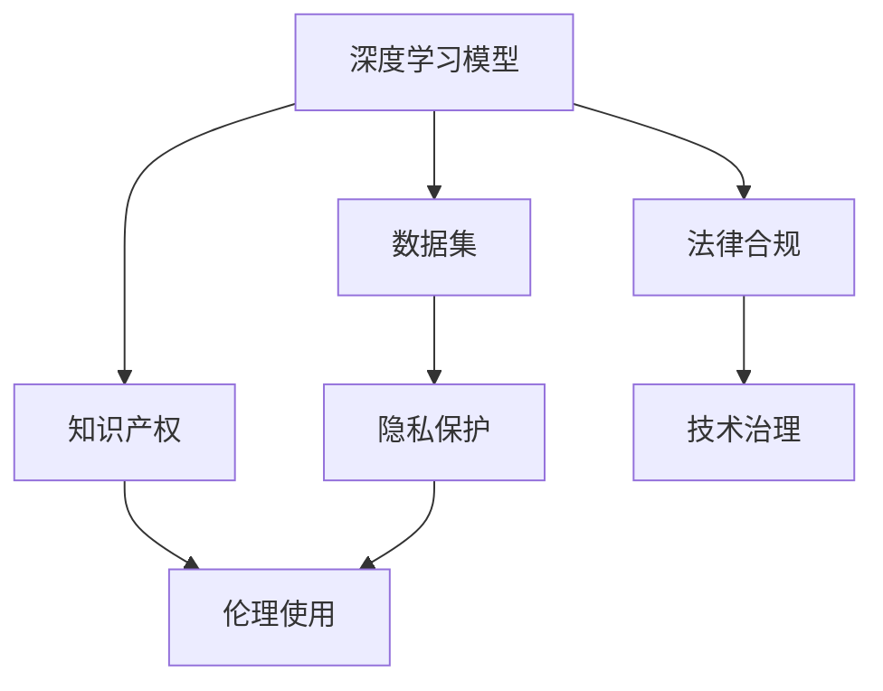

                 

# AI模型的版权问题：法律与伦理的思考

> 关键词：AI模型版权,知识产权,数据隐私,伦理,法律合规,人工智能治理

## 1. 背景介绍

### 1.1 问题由来
在人工智能（AI）领域，特别是深度学习模型的研发和部署中，版权问题始终是一个备受关注的话题。随着深度学习模型变得越来越复杂和依赖于大量的数据，其版权归属、使用许可以及相关权益的界定变得愈加复杂。同时，模型的伦理使用和数据隐私保护也成为了不容忽视的重要议题。这些问题不仅关系到创新者的利益，更牵涉到社会公平、用户权益保护以及技术应用的规范性。本文将从法律与伦理的角度，探讨AI模型版权问题，分析其影响和应对策略。

### 1.2 问题核心关键点
- **模型版权**：涉及深度学习模型开发、训练、部署等各个环节的知识产权归属。
- **数据隐私**：AI模型训练中涉及的个人信息的收集、存储、使用等隐私保护问题。
- **伦理使用**：确保AI模型在应用中遵循伦理原则，避免偏见、歧视等社会问题。
- **法律合规**：遵守各国相关法律法规，确保模型应用的合法性。
- **技术治理**：建立有效的AI模型治理体系，确保模型使用的透明度和可追溯性。

## 2. 核心概念与联系

### 2.1 核心概念概述

要理解AI模型版权问题，首先需要掌握几个关键概念：

- **深度学习模型**：一类基于神经网络结构的机器学习模型，通过多层非线性变换，从输入数据中学习到高层次的特征表示。
- **数据集**：用于训练深度学习模型的数据集，可能包含大量的个人信息和隐私数据。
- **知识产权**：包括专利、商标、版权等，保护创作者的合法权益。
- **隐私保护**：确保个人数据的收集、存储和处理符合法律规定，保护个人隐私不受侵犯。
- **伦理使用**：确保AI模型在应用中遵循伦理原则，避免偏见、歧视等社会问题。
- **法律合规**：遵守各国相关法律法规，确保模型应用的合法性。
- **技术治理**：建立有效的AI模型治理体系，确保模型使用的透明度和可追溯性。

这些概念之间的逻辑关系可以通过以下Mermaid流程图来展示：



这个流程图展示了大模型版权问题的核心概念及其之间的关系：

1. 深度学习模型依赖于数据集进行训练。
2. 数据集涉及隐私保护，需遵守相关法律法规。
3. 模型的开发和部署需遵守知识产权和伦理原则。
4. 法律合规和技术治理确保模型的合法和透明使用。

## 3. 核心算法原理 & 具体操作步骤
### 3.1 算法原理概述

AI模型的版权问题主要涉及模型的开发、训练、部署等各个环节的知识产权归属。其核心在于明确模型的创造者、开发者和使用者之间的权利义务关系。同时，涉及数据隐私保护和伦理使用等问题，需要通过法律和伦理规范加以约束。

### 3.2 算法步骤详解

#### 3.2.1 模型开发

模型的开发通常涉及以下步骤：

1. **数据准备**：收集、整理、清洗数据，确保数据集的合法性和完整性。
2. **模型设计**：设计神经网络结构，选择合适的网络层数、激活函数、优化器等参数。
3. **训练过程**：使用数据集进行模型训练，调整模型超参数，优化模型性能。

#### 3.2.2 模型训练

在模型训练过程中，涉及大量的数据处理和计算资源，可能面临以下法律和伦理问题：

1. **数据隐私**：需要确保数据采集和使用符合隐私保护法规，如GDPR等。
2. **伦理使用**：避免模型中出现偏见、歧视等问题，确保模型公平性。
3. **知识产权**：保护开发者对模型的知识产权，防止侵权。

#### 3.2.3 模型部署

模型部署是将训练好的模型应用于实际场景的过程，涉及以下问题：

1. **法律合规**：确保模型应用的合法性，遵守相关法律法规。
2. **伦理使用**：确保模型在实际应用中的伦理使用，避免社会问题。
3. **技术治理**：建立有效的模型治理体系，确保模型使用的透明度和可追溯性。

### 3.3 算法优缺点

**优点**：

- 提升模型性能：通过大规模数据集训练和优化，模型能够获得更高的预测精度和泛化能力。
- 应用广泛：深度学习模型在图像识别、自然语言处理、语音识别等领域有广泛应用。

**缺点**：

- 数据隐私风险：模型训练和应用中涉及大量数据，可能泄露个人隐私。
- 伦理风险：模型可能存在偏见、歧视等问题，带来社会公平问题。
- 法律风险：模型应用过程中可能违反法律法规，带来法律风险。

### 3.4 算法应用领域

AI模型版权问题涉及多个领域，包括但不限于：

- **自然语言处理**：如文本分类、机器翻译、情感分析等任务。
- **计算机视觉**：如图像识别、物体检测、视频分析等任务。
- **语音识别**：如语音转文字、情感识别、语音合成等任务。
- **医疗健康**：如疾病诊断、影像分析、健康监测等任务。

## 4. 数学模型和公式 & 详细讲解 & 举例说明

### 4.1 数学模型构建

AI模型的版权问题涉及多个方面的数学模型构建，以下以自然语言处理中的文本分类为例：

设模型输入为 $x = (x_1, x_2, ..., x_n)$，其中 $x_i$ 为输入样本，$y$ 为模型输出，表示样本的类别标签。

模型的损失函数为 $L = -\sum_{i=1}^N y_i\log y_i + (1-y_i)\log(1-y_i)$。

模型的训练目标是最小化损失函数 $L$，即：

$$
\min_{\theta} L
$$

其中 $\theta$ 为模型的参数。

### 4.2 公式推导过程

基于上述数学模型，推导模型的训练过程：

1. **前向传播**：将输入样本 $x$ 通过模型 $M_{\theta}$ 得到输出 $y$。
2. **计算损失**：根据输出 $y$ 和真实标签 $y_i$ 计算损失函数 $L$。
3. **反向传播**：计算损失函数 $L$ 对模型参数 $\theta$ 的梯度，并使用梯度下降等优化算法更新参数。

### 4.3 案例分析与讲解

以文本分类任务为例，分析模型训练过程中涉及的版权和隐私问题：

1. **数据集获取**：涉及数据的合法获取和使用，需遵守相关法律法规。
2. **模型训练**：需确保模型训练过程中的数据隐私保护，防止数据泄露。
3. **模型部署**：需确保模型应用的合法性和伦理使用，避免社会问题。

## 5. 项目实践：代码实例和详细解释说明
### 5.1 开发环境搭建

为了进行模型开发和训练，需要搭建一个开发环境。以下是使用Python进行TensorFlow开发的详细步骤：

1. 安装Anaconda：从官网下载并安装Anaconda，用于创建独立的Python环境。
2. 创建并激活虚拟环境：
```bash
conda create -n tf-env python=3.8 
conda activate tf-env
```
3. 安装TensorFlow：根据CUDA版本，从官网获取对应的安装命令。例如：
```bash
conda install tensorflow -c tf -c conda-forge
```
4. 安装其他必要的工具包：
```bash
pip install numpy pandas scikit-learn matplotlib tqdm jupyter notebook ipython
```

完成上述步骤后，即可在`tf-env`环境中进行模型开发和训练。

### 5.2 源代码详细实现

以下是使用TensorFlow进行文本分类任务的完整代码实现：

```python
import tensorflow as tf
from tensorflow.keras.datasets import imdb
from tensorflow.keras.preprocessing import sequence
from tensorflow.keras.models import Sequential
from tensorflow.keras.layers import Dense, Embedding, LSTM, Dropout

# 加载IMDB数据集
max_features = 10000
max_len = 200
(x_train, y_train), (x_test, y_test) = imdb.load_data(num_words=max_features)
x_train = sequence.pad_sequences(x_train, maxlen=max_len)
x_test = sequence.pad_sequences(x_test, maxlen=max_len)

# 定义模型
model = Sequential()
model.add(Embedding(max_features, 128))
model.add(LSTM(64, dropout=0.2, recurrent_dropout=0.2))
model.add(Dense(1, activation='sigmoid'))

# 编译模型
model.compile(optimizer='adam', loss='binary_crossentropy', metrics=['accuracy'])

# 训练模型
model.fit(x_train, y_train, validation_data=(x_test, y_test), epochs=5, batch_size=32)

# 评估模型
test_loss, test_acc = model.evaluate(x_test, y_test)
print('Test accuracy:', test_acc)
```

### 5.3 代码解读与分析

代码中，我们首先加载IMDB数据集，并对数据进行预处理，包括词向量化和padding。然后定义模型，包括嵌入层、LSTM层和全连接层。最后编译和训练模型，并在测试集上进行评估。

## 6. 实际应用场景
### 6.1 智能客服系统

智能客服系统中，AI模型版权问题主要涉及以下方面：

- **数据隐私**：智能客服系统需要处理大量用户数据，需确保数据隐私保护。
- **伦理使用**：避免客服系统出现偏见、歧视等问题，确保系统公平性。
- **法律合规**：智能客服系统需遵守相关法律法规，确保模型应用的合法性。

### 6.2 金融舆情监测

金融舆情监测中，AI模型版权问题主要涉及以下方面：

- **数据隐私**：监测系统需处理大量金融数据，需确保数据隐私保护。
- **伦理使用**：避免监测系统出现偏见、歧视等问题，确保系统公平性。
- **法律合规**：监测系统需遵守相关法律法规，确保模型应用的合法性。

### 6.3 个性化推荐系统

个性化推荐系统中，AI模型版权问题主要涉及以下方面：

- **数据隐私**：推荐系统需处理大量用户数据，需确保数据隐私保护。
- **伦理使用**：避免推荐系统出现偏见、歧视等问题，确保系统公平性。
- **法律合规**：推荐系统需遵守相关法律法规，确保模型应用的合法性。

### 6.4 未来应用展望

随着AI技术的发展，未来在AI模型版权问题方面将呈现以下几个趋势：

1. **数据隐私保护**：未来AI模型将更加注重数据隐私保护，确保数据使用的合法性和透明性。
2. **伦理使用**：未来AI模型将更加注重伦理使用，避免偏见、歧视等问题。
3. **法律合规**：未来AI模型将更加注重法律合规，确保模型应用的合法性。
4. **技术治理**：未来AI模型将建立有效的技术治理体系，确保模型使用的透明度和可追溯性。

## 7. 工具和资源推荐
### 7.1 学习资源推荐

为帮助开发者系统掌握AI模型版权问题，以下是一些推荐的资源：

1. **《AI模型版权与数据隐私》系列博文**：由AI专家撰写，深入浅出地介绍了AI模型版权和数据隐私的相关知识和法律法规。
2. **AI模型版权与伦理在线课程**：多门知名的在线课程，涵盖AI模型版权和伦理的基本知识和最新发展。
3. **AI模型版权与法律合规手册**：详细介绍了AI模型版权和法律合规的基本知识和实战技巧。

### 7.2 开发工具推荐

以下几款工具可以帮助开发者进行AI模型开发和训练：

1. **PyTorch**：基于Python的开源深度学习框架，支持动态计算图，适合快速迭代研究。
2. **TensorFlow**：由Google主导开发的开源深度学习框架，支持静态计算图和分布式训练，适合大规模工程应用。
3. **Transformers库**：HuggingFace开发的NLP工具库，集成了众多SOTA语言模型，支持PyTorch和TensorFlow，是进行模型微调和推理的利器。

### 7.3 相关论文推荐

以下是几篇奠基性的相关论文，推荐阅读：

1. **《深度学习模型的版权归属》**：讨论了深度学习模型版权的归属问题，分析了不同模型组件的知识产权归属。
2. **《数据隐私保护与AI模型应用》**：探讨了数据隐私保护与AI模型应用的关系，提出了多种数据隐私保护技术。
3. **《AI模型伦理使用指南》**：介绍了AI模型伦理使用的基本原则和实践指南，确保AI模型在应用中的公平性和透明性。
4. **《AI模型法律合规框架》**：提出了AI模型法律合规的框架和建议，确保模型应用的合法性。
5. **《AI模型技术治理体系》**：讨论了AI模型技术治理体系的设计和实施，确保模型使用的透明度和可追溯性。

## 8. 总结：未来发展趋势与挑战
### 8.1 总结

本文对AI模型版权问题进行了全面系统的介绍，从法律与伦理的角度探讨了深度学习模型的开发、训练和部署过程中涉及的版权问题。通过数学模型和具体实例的分析，详细讲解了AI模型版权问题的核心概念和操作步骤。同时，本文还探讨了AI模型版权问题在智能客服、金融舆情监测、个性化推荐等多个行业领域的应用前景，展示了AI模型版权问题的广阔前景。

### 8.2 未来发展趋势

展望未来，AI模型版权问题将呈现以下几个发展趋势：

1. **数据隐私保护**：未来AI模型将更加注重数据隐私保护，确保数据使用的合法性和透明性。
2. **伦理使用**：未来AI模型将更加注重伦理使用，避免偏见、歧视等问题。
3. **法律合规**：未来AI模型将更加注重法律合规，确保模型应用的合法性。
4. **技术治理**：未来AI模型将建立有效的技术治理体系，确保模型使用的透明度和可追溯性。

### 8.3 面临的挑战

尽管AI模型版权问题已经取得了一定的进展，但在迈向更加智能化、普适化应用的过程中，仍面临诸多挑战：

1. **数据隐私保护**：虽然数据隐私保护技术不断进步，但面对大规模数据集，隐私保护仍面临巨大挑战。
2. **伦理使用**：AI模型可能存在偏见、歧视等问题，带来社会公平问题，需进一步加强伦理使用。
3. **法律合规**：不同国家和地区的法律法规各异，AI模型应用的法律合规问题复杂。
4. **技术治理**：AI模型使用的透明度和可追溯性问题仍需进一步解决。

### 8.4 研究展望

未来，需要在以下几个方面进行更深入的研究：

1. **隐私保护技术**：开发更加高效、透明的数据隐私保护技术，确保数据使用的合法性和透明性。
2. **伦理使用**：建立AI模型伦理使用的评估和监管机制，确保模型应用的公平性和透明性。
3. **法律合规**：研究AI模型法律合规的框架和建议，确保模型应用的合法性。
4. **技术治理**：建立有效的AI模型技术治理体系，确保模型使用的透明度和可追溯性。

## 9. 附录：常见问题与解答

**Q1：如何保护AI模型的知识产权？**

A: 可以通过申请专利、注册商标等方式，保护AI模型的知识产权。同时，开发者也应注意合同条款，明确模型使用权和收益分配。

**Q2：如何在AI模型应用中保护数据隐私？**

A: 在数据采集和使用过程中，需确保数据处理的合法性和透明性。可以采用数据匿名化、去标识化等技术，确保数据隐私保护。

**Q3：如何在AI模型应用中确保伦理使用？**

A: 建立AI模型伦理使用的评估和监管机制，确保模型应用的公平性和透明性。同时，开发者需考虑模型的偏见和歧视问题，进行充分的测试和验证。

**Q4：如何在AI模型应用中确保法律合规？**

A: 研究AI模型法律合规的框架和建议，确保模型应用的合法性。同时，开发者需了解相关法律法规，确保模型应用的合规性。

**Q5：如何在AI模型应用中确保技术治理？**

A: 建立有效的AI模型技术治理体系，确保模型使用的透明度和可追溯性。可以采用数据日志、模型审计等技术手段，确保模型使用的安全性和可靠性。

---

作者：禅与计算机程序设计艺术 / Zen and the Art of Computer Programming

