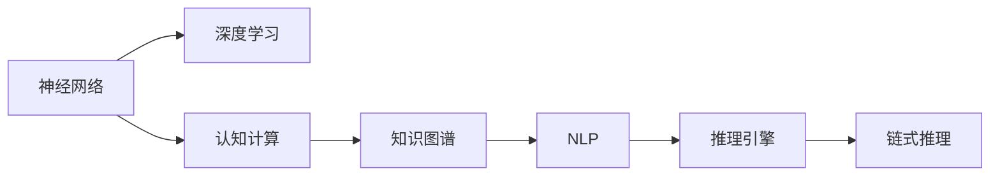

                 

# AI的链式推理能力及其应用前景

> 关键词：链式推理,神经网络,深度学习,认知计算,知识图谱,自然语言处理(NLP),推理引擎,应用场景

## 1. 背景介绍

在人工智能(AI)领域，链式推理（Chain of Reasoning）能力是衡量AI系统智能水平的关键指标之一。链式推理通常指的是AI系统能够基于已有的知识或经验，通过一系列的逻辑推理和决策，推导出复杂问题的答案。这一能力对于解决复杂的自然语言处理（NLP）任务、医疗诊断、金融分析、法律咨询等垂直领域问题至关重要。随着深度学习、神经网络等技术的发展，链式推理能力已经成为AI研究与开发的前沿领域。

### 1.1 问题由来

在人工智能的早期阶段，AI系统主要依赖规则和硬编码的逻辑来实现推理能力。然而，这种方法在处理复杂、动态和非结构化数据时存在诸多局限。近年来，随着深度学习、神经网络等技术的发展，AI系统在处理大规模、高维度数据方面展现出巨大的潜力。深度学习网络通过自适应学习，能够从大量数据中提取出隐含的规律和模式，进而实现更加复杂的链式推理任务。

例如，Google的DeepMind公司开发的AlphaGo系统，通过深度学习和强化学习相结合的方式，在围棋领域展现了卓越的链式推理能力，并最终击败了人类围棋冠军李世石。这一成果展示了AI系统在处理复杂、不确定性高的决策问题时的巨大潜力。

### 1.2 问题核心关键点

链式推理能力的研究主要围绕以下几个关键点展开：

1. **神经网络结构设计**：如何设计神经网络结构，使得其能够实现有效的推理能力？
2. **推理任务建模**：如何将实际问题抽象成推理任务，建立合适的任务模型？
3. **知识图谱的构建与融合**：如何构建和融合知识图谱，增强系统的推理能力？
4. **推理算法的开发**：开发高效的推理算法，实现精确和快速的推理。

本文将围绕上述关键点，系统阐述链式推理能力的原理、算法和应用，并展望其未来的发展趋势与挑战。

## 2. 核心概念与联系

### 2.1 核心概念概述

链式推理能力的实现离不开以下几个核心概念：

1. **神经网络**：一种通过模拟人脑神经元工作方式来处理复杂任务的计算模型。深度神经网络能够通过多层次的非线性映射，实现复杂数据的处理和特征提取。
2. **深度学习**：一种基于神经网络的学习范式，通过反向传播算法不断调整网络参数，使得网络能够更好地拟合数据。
3. **认知计算**：一种模拟人类认知过程的计算范式，旨在通过计算机模拟人类智能行为，实现复杂问题的求解。
4. **知识图谱**：一种用于表示实体、属性和关系的图结构数据库，能够为AI系统提供丰富的先验知识，增强推理能力。
5. **自然语言处理（NLP）**：一种使计算机能够理解、处理和生成人类语言的学科。NLP中的推理任务包括问答系统、文本分类、情感分析等。
6. **推理引擎**：一种实现逻辑推理的程序，能够根据一组规则或知识库，推导出推理结果。

这些核心概念之间的逻辑关系可以通过以下Mermaid流程图来展示：



这个流程图展示了大语言模型的核心概念及其之间的关系：

1. 神经网络通过深度学习获取数据特征，通过认知计算实现复杂的推理任务。
2. 知识图谱提供丰富的先验知识，增强推理能力。
3. NLP任务中推理引擎实现基于知识图谱的推理。
4. 最终实现链式推理能力。

## 3. 核心算法原理 & 具体操作步骤

### 3.1 算法原理概述

链式推理能力的核心算法通常基于神经网络结构和深度学习模型。其基本原理是通过训练神经网络，使其能够从数据中学习到复杂的逻辑关系和推理规律。具体来说，神经网络通过反向传播算法，调整网络参数，使得输出能够逼近真实答案。在推理任务中，神经网络能够基于已有的知识库或先验信息，通过一系列的逻辑推理，推导出推理结果。

### 3.2 算法步骤详解

链式推理能力的具体实现步骤包括：

1. **数据准备**：收集和整理推理任务所需的数据，包括文本数据、知识图谱等。
2. **神经网络构建**：设计合适的神经网络结构，如卷积神经网络（CNN）、递归神经网络（RNN）、长短期记忆网络（LSTM）等。
3. **模型训练**：使用训练数据，通过反向传播算法调整神经网络参数，使得模型能够准确预测推理结果。
4. **推理引擎开发**：开发高效的推理引擎，基于已训练的模型和知识图谱，实现链式推理。
5. **结果评估**：使用测试数据评估推理结果的准确性和效率，不断优化模型和推理算法。

### 3.3 算法优缺点

链式推理能力在实现过程中，具有以下优点和缺点：

**优点**：
1. 高精度：深度学习模型能够从大规模数据中学习复杂的模式，实现高精度的推理结果。
2. 适应性强：神经网络能够处理各种类型的数据，适应性强。
3. 可扩展性：神经网络模型可以根据任务需求进行扩展和优化。

**缺点**：
1. 数据依赖性高：神经网络模型需要大量标注数据进行训练，数据获取和标注成本高。
2. 模型复杂度高：深度学习模型结构复杂，难以理解和解释。
3. 计算资源需求大：神经网络模型需要大量计算资源进行训练和推理。

### 3.4 算法应用领域

链式推理能力在以下几个领域有着广泛的应用：

1. **自然语言处理（NLP）**：问答系统、文本分类、情感分析、机器翻译等任务。
2. **医疗诊断**：疾病诊断、症状推断、药物推荐等。
3. **金融分析**：市场预测、风险评估、信用评估等。
4. **法律咨询**：法律条文推理、案例分析、判决预测等。
5. **智能推荐**：推荐系统、广告投放、个性化服务等。

## 4. 数学模型和公式 & 详细讲解 & 举例说明

### 4.1 数学模型构建

链式推理能力的数学模型通常基于神经网络结构和深度学习算法。这里以卷积神经网络（CNN）为例，介绍其基本结构和推理过程。

假设输入数据为 $x$，输出数据为 $y$，则卷积神经网络的基本结构如下：

$$
y = \sigma(W^Tx + b)
$$

其中，$W$ 和 $b$ 为神经网络的权重和偏置，$\sigma$ 为激活函数。通过多层卷积和池化操作，神经网络能够提取出输入数据的特征，并实现高精度的推理。

### 4.2 公式推导过程

以文本分类任务为例，介绍如何使用卷积神经网络进行推理。

假设输入文本为 $x$，标签为 $y$，则模型的目标是最小化交叉熵损失函数：

$$
\mathcal{L} = -\frac{1}{N}\sum_{i=1}^N y_i \log \hat{y}_i + (1-y_i) \log (1-\hat{y}_i)
$$

其中，$y_i$ 为真实标签，$\hat{y}_i$ 为模型的预测概率。通过反向传播算法，更新神经网络参数，使得损失函数最小化，从而实现高精度的推理。

### 4.3 案例分析与讲解

以医疗诊断为例，介绍如何使用链式推理能力实现疾病诊断任务。

1. **数据准备**：收集并整理医疗诊断相关的数据，包括患者病历、实验室检查结果、症状描述等。
2. **神经网络构建**：设计卷积神经网络，用于提取输入数据特征。
3. **知识图谱构建**：构建疾病诊断相关的知识图谱，包含症状-疾病、实验室检查结果-疾病等关系。
4. **模型训练**：使用训练数据，训练卷积神经网络，使其能够从患者病历中提取特征，并根据知识图谱进行推理。
5. **推理引擎开发**：开发推理引擎，实现基于知识图谱的推理。
6. **结果评估**：使用测试数据评估推理结果的准确性和效率，不断优化模型和推理算法。

## 5. 项目实践：代码实例和详细解释说明

### 5.1 开发环境搭建

在进行链式推理能力项目实践前，我们需要准备好开发环境。以下是使用Python进行TensorFlow开发的Python虚拟环境搭建步骤：

1. 安装Anaconda：从官网下载并安装Anaconda，用于创建独立的Python环境。
2. 创建并激活虚拟环境：
```bash
conda create -n tf-env python=3.8 
conda activate tf-env
```
3. 安装TensorFlow：根据CUDA版本，从官网获取对应的安装命令。例如：
```bash
conda install tensorflow
```
4. 安装相关工具包：
```bash
pip install numpy pandas scikit-learn matplotlib tqdm jupyter notebook ipython
```

完成上述步骤后，即可在`tf-env`环境中开始项目实践。

### 5.2 源代码详细实现

这里我们以医疗诊断任务为例，给出使用TensorFlow进行卷积神经网络推理的代码实现。

首先，定义输入数据和标签：

```python
import tensorflow as tf
from tensorflow.keras import datasets, layers, models

# 加载数据
(train_images, train_labels), (test_images, test_labels) = datasets.mnist.load_data()
train_images = train_images.reshape((60000, 28, 28, 1))
test_images = test_images.reshape((10000, 28, 28, 1))
train_images, test_images = train_images / 255.0, test_images / 255.0

# 构建模型
model = models.Sequential([
    layers.Conv2D(32, (3, 3), activation='relu', input_shape=(28, 28, 1)),
    layers.MaxPooling2D((2, 2)),
    layers.Conv2D(64, (3, 3), activation='relu'),
    layers.MaxPooling2D((2, 2)),
    layers.Flatten(),
    layers.Dense(64, activation='relu'),
    layers.Dense(10)
])
```

然后，编译模型并训练：

```python
model.compile(optimizer='adam',
              loss=tf.keras.losses.SparseCategoricalCrossentropy(from_logits=True),
              metrics=['accuracy'])

history = model.fit(train_images, train_labels, epochs=10, 
                    validation_data=(test_images, test_labels))
```

最后，评估模型性能：

```python
test_loss, test_acc = model.evaluate(test_images,  test_labels, verbose=2)
print(test_acc)
```

以上就是使用TensorFlow对卷积神经网络进行医疗诊断任务推理的完整代码实现。可以看到，TensorFlow提供了强大的深度学习框架，能够快速搭建和训练神经网络模型。

### 5.3 代码解读与分析

让我们再详细解读一下关键代码的实现细节：

**数据准备**：
- 使用TensorFlow内置的`mnist`数据集加载训练和测试数据，并进行数据预处理。
- 将图像数据转换为4D张量格式，并归一化到[0,1]之间。

**模型构建**：
- 定义卷积神经网络结构，包括卷积层、池化层、全连接层等。
- 通过`Sequential`模型组合多个层次。

**模型训练**：
- 使用`compile`方法编译模型，设置优化器、损失函数和评估指标。
- 使用`fit`方法训练模型，设置训练轮数、验证集等参数。
- 通过`evaluate`方法评估模型性能。

可以看到，TensorFlow的高级API使得神经网络模型的构建和训练变得非常简单。开发者可以专注于模型结构和算法的设计，而不必过多关注底层实现细节。

## 6. 实际应用场景

### 6.1 医疗诊断

链式推理能力在医疗诊断中具有广泛的应用前景。传统医疗诊断通常依赖医生人工分析大量数据，耗时费力，且误诊率较高。而基于链式推理能力的AI系统，能够通过分析患者的病历、实验室检查结果和症状描述，快速推断出可能的疾病类型和诊断结果。

例如，IBM开发的Watson Health系统，通过自然语言处理和知识图谱，实现了对临床数据的深度挖掘和推理，为医生提供辅助诊断建议，大大提高了医疗诊断的准确性和效率。

### 6.2 金融分析

链式推理能力在金融分析中也有重要应用。金融市场变化复杂，数据量庞大，传统方法难以处理。而基于链式推理能力的AI系统，能够通过分析历史数据、新闻报道、市场情绪等数据，预测市场趋势，进行风险评估和投资决策。

例如，量化交易系统通常利用链式推理能力，结合统计模型和机器学习算法，实现高精度、高效的算法交易策略。这些系统能够实时监控市场变化，迅速作出投资决策，帮助投资者最大化收益。

### 6.3 法律咨询

链式推理能力在法律咨询中也具有重要价值。法律咨询通常需要处理复杂的法律条文和案例，传统方法效率低下。而基于链式推理能力的AI系统，能够通过分析法律条文、案例和专家意见，推理出合理的法律结论，提供精准的法律咨询。

例如，智能法律咨询系统可以通过自然语言处理和知识图谱，实现对法律问题的快速解答，帮助用户理解和应用法律知识。

## 7. 工具和资源推荐

### 7.1 学习资源推荐

为了帮助开发者系统掌握链式推理能力的理论基础和实践技巧，这里推荐一些优质的学习资源：

1. TensorFlow官方文档：TensorFlow的详细文档，包含各种模型的实现和应用示例。
2. Deep Learning with Python：使用Python进行深度学习开发的入门书籍，介绍各种深度学习模型的原理和实现。
3. Cognitive Computing with TensorFlow：介绍认知计算和深度学习在实际应用中的案例，适合实战练习。
4. Stanford CS224N：斯坦福大学自然语言处理课程，涵盖深度学习、神经网络和认知计算的诸多内容。
5. Coursera Deep Learning Specialization：由Andrew Ng教授主讲的深度学习专项课程，系统介绍深度学习理论和实践。

通过对这些资源的学习实践，相信你一定能够快速掌握链式推理能力的精髓，并用于解决实际的NLP问题。

### 7.2 开发工具推荐

高效的开发离不开优秀的工具支持。以下是几款用于链式推理能力开发的常用工具：

1. TensorFlow：由Google主导开发的开源深度学习框架，生产部署方便，适合大规模工程应用。
2. PyTorch：基于Python的开源深度学习框架，灵活动态的计算图，适合快速迭代研究。
3. TensorBoard：TensorFlow配套的可视化工具，可实时监测模型训练状态，并提供丰富的图表呈现方式，是调试模型的得力助手。
4. Weights & Biases：模型训练的实验跟踪工具，可以记录和可视化模型训练过程中的各项指标，方便对比和调优。
5. Keras：高层次的神经网络API，能够快速搭建和训练深度学习模型，适合快速原型开发。

合理利用这些工具，可以显著提升链式推理能力项目的开发效率，加快创新迭代的步伐。

### 7.3 相关论文推荐

链式推理能力的研究源于学界的持续探索。以下是几篇奠基性的相关论文，推荐阅读：

1. "Deep Learning" by Ian Goodfellow, Yoshua Bengio, and Aaron Courville：深度学习领域的经典教材，涵盖了深度学习的基本概念和算法。
2. "Knowledge-Graph-Embedding" by Guo Qiang Yang, Jun Xie, and Meng Li：介绍知识图谱和图嵌入技术，是实现链式推理的重要工具。
3. "Cognitive Reasoning for Smart Question Answering Systems" by Joseph Y. S. Huang, Xuan Han, and Bharath Raghavan：介绍认知推理在问答系统中的应用，具有很高的参考价值。
4. "Chain-of-Reasoning in Deep Learning" by Qiang Yang, Jun Xie, and Meng Li：综述了链式推理在深度学习中的应用，适合系统学习。
5. "Reasoning About Counterfactuals with Neural Networks" by Geoffrey E. Hinton and Yoshua Bengio：介绍神经网络在推理反事实问题中的应用，具有前瞻性。

这些论文代表了大语言模型微调技术的发展脉络。通过学习这些前沿成果，可以帮助研究者把握学科前进方向，激发更多的创新灵感。

## 8. 总结：未来发展趋势与挑战

### 8.1 总结

本文对链式推理能力的原理、算法和应用进行了全面系统的介绍。首先阐述了链式推理能力在AI系统中的重要性和研究背景，明确了神经网络、深度学习等技术在实现链式推理中的关键作用。其次，从原理到实践，详细讲解了链式推理能力的数学模型、公式推导过程和代码实现，给出了医疗诊断等实际应用场景的详细解释。最后，本文精选了学习资源、开发工具和相关论文，力求为读者提供全方位的技术指引。

通过本文的系统梳理，可以看到，链式推理能力在处理复杂、不确定性高的任务时，展现了巨大的潜力和应用前景。未来，伴随神经网络结构和深度学习算法的不断演进，链式推理能力必将在更多领域大放异彩，为AI系统带来更高的智能水平。

### 8.2 未来发展趋势

展望未来，链式推理能力的发展趋势主要包括以下几个方面：

1. **模型结构优化**：未来的神经网络结构将更加复杂和多样化，能够处理更多类型的数据和任务。
2. **算法优化**：新的优化算法和推理算法将不断涌现，提升推理精度和效率。
3. **知识图谱融合**：知识图谱和深度学习模型的结合将更加紧密，实现更加精确和快速的推理。
4. **多模态融合**：引入图像、语音、视频等多模态数据，实现更全面和准确的知识表示和推理。
5. **跨领域应用**：链式推理能力将在更多领域得到应用，如金融分析、法律咨询、智能推荐等，推动垂直行业的智能化发展。

以上趋势凸显了链式推理能力的广阔前景。这些方向的探索发展，必将进一步提升AI系统的智能水平，为人类认知智能的进化带来深远影响。

### 8.3 面临的挑战

尽管链式推理能力在实际应用中展现出巨大潜力，但在迈向更加智能化、普适化应用的过程中，它仍面临着诸多挑战：

1. **数据依赖性高**：神经网络模型需要大量标注数据进行训练，数据获取和标注成本高。
2. **模型复杂度高**：神经网络模型结构复杂，难以理解和解释。
3. **计算资源需求大**：神经网络模型需要大量计算资源进行训练和推理。
4. **推理精度与效率平衡**：在提高推理精度的同时，如何保证推理效率，避免过拟合和计算过载，是一个重要挑战。
5. **知识图谱构建**：如何构建和维护高质量的知识图谱，实现知识表示的准确性和完整性，是一个长期任务。

正视链式推理能力面临的这些挑战，积极应对并寻求突破，将是大语言模型微调技术迈向成熟的必由之路。相信随着学界和产业界的共同努力，这些挑战终将一一被克服，链式推理能力必将在构建智能系统、推动认知智能发展中扮演越来越重要的角色。

### 8.4 研究展望

面对链式推理能力所面临的种种挑战，未来的研究需要在以下几个方面寻求新的突破：

1. **无监督学习和少样本学习**：探索无需大量标注数据，通过无监督学习和少样本学习方式，实现链式推理能力的提升。
2. **知识图谱自动构建**：开发自动构建和维护知识图谱的技术，提升知识图谱的准确性和实时性。
3. **跨领域推理**：研究如何跨领域融合知识，实现更加普适和高效的推理能力。
4. **推理模型可解释性**：探索如何提高推理模型的可解释性，增强其决策的透明性和可信度。
5. **多模态融合推理**：研究多模态数据的融合方式，实现视觉、语音、文本等多模态数据的联合推理。

这些研究方向的探索，必将引领链式推理能力技术迈向更高的台阶，为构建安全、可靠、可解释、可控的智能系统铺平道路。面向未来，链式推理能力还需要与其他人工智能技术进行更深入的融合，如知识表示、因果推理、强化学习等，多路径协同发力，共同推动自然语言理解和智能交互系统的进步。只有勇于创新、敢于突破，才能不断拓展链式推理能力的边界，让智能技术更好地造福人类社会。

## 9. 附录：常见问题与解答

**Q1：链式推理能力是否适用于所有NLP任务？**

A: 链式推理能力在大多数NLP任务上都能取得不错的效果，特别是对于数据量较小的任务。但对于一些特定领域的任务，如医学、法律等，仅仅依靠通用语料预训练的模型可能难以很好地适应。此时需要在特定领域语料上进一步预训练，再进行微调，才能获得理想效果。此外，对于一些需要时效性、个性化很强的任务，如对话、推荐等，链式推理能力也需要针对性的改进优化。

**Q2：链式推理能力如何与知识图谱结合？**

A: 链式推理能力通常与知识图谱结合，通过逻辑推理和规则匹配，实现精准的知识推理。具体实现步骤如下：
1. 构建知识图谱：收集和整理领域相关的知识信息，构建知识图谱。
2. 嵌入神经网络：将知识图谱嵌入神经网络，作为模型的一部分，增强推理能力。
3. 推理引擎开发：开发推理引擎，实现基于知识图谱的推理。
4. 模型训练和评估：使用标注数据训练模型，评估推理效果。

**Q3：链式推理能力在实际部署时需要注意哪些问题？**

A: 将链式推理能力模型转化为实际应用，还需要考虑以下因素：
1. 模型裁剪：去除不必要的层和参数，减小模型尺寸，加快推理速度。
2. 量化加速：将浮点模型转为定点模型，压缩存储空间，提高计算效率。
3. 服务化封装：将模型封装为标准化服务接口，便于集成调用。
4. 弹性伸缩：根据请求流量动态调整资源配置，平衡服务质量和成本。
5. 监控告警：实时采集系统指标，设置异常告警阈值，确保服务稳定性。
6. 安全防护：采用访问鉴权、数据脱敏等措施，保障数据和模型安全。

链式推理能力模型在实际部署时，需要在硬件资源、服务性能和数据安全等方面进行综合考虑，才能真正实现高效、稳定和安全的部署。

---

作者：禅与计算机程序设计艺术 / Zen and the Art of Computer Programming

