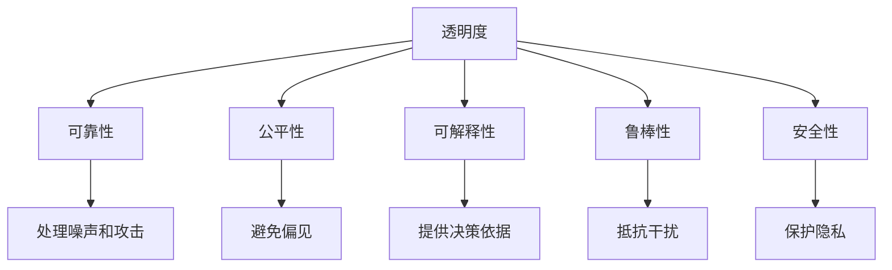

                 

# AI系统的透明度与可靠性

## 1. 背景介绍

### 1.1 问题由来

随着人工智能(AI)技术的快速发展，AI系统在各个领域的应用日益广泛。AI系统通过学习海量数据，能够在自然语言处理、图像识别、预测分析等任务上取得卓越的性能。然而，随着AI系统在实际应用中的重要性日益增加，其透明度和可靠性问题也逐渐成为公众和学术界关注的焦点。

AI系统的透明度和可靠性，直接关系到其决策的可解释性、公平性、安全性等方面。例如，自动驾驶汽车需要具备高度的可解释性，以便在紧急情况下让驾驶员了解车辆决策依据；金融风险评估系统需要保证其决策过程的公平性，避免对特定群体的歧视；医疗诊断系统需要确保其决策的可靠性，避免误诊和漏诊等严重后果。

透明性和可靠性是AI系统的两大核心要求，也是其向实用化、可信赖化方向发展的重要保障。本文将围绕这两个关键问题，系统地探讨AI系统的透明度与可靠性，并提出相应的解决方案。

## 2. 核心概念与联系

### 2.1 核心概念概述

为更好地理解AI系统的透明度与可靠性问题，本节将介绍几个密切相关的核心概念：

- **透明度(Transparency)**：指AI系统的决策过程和内部机制是否容易被理解和解释。一个透明的AI系统能够清晰地说明其决策依据，并允许用户进行合理的质疑和验证。
- **可靠性(Reliability)**：指AI系统在执行任务时是否能够稳定、准确地生成预期结果。一个可靠的AI系统能够在不同的数据和环境中保持一致的性能，避免因数据偏差、模型漂移等问题导致的决策错误。
- **公平性(Fairness)**：指AI系统在处理不同群体时是否能够公平对待。一个公平的AI系统不应该对某些群体产生偏见，确保所有用户都能获得公平的待遇。
- **可解释性(Interpretability)**：指AI系统决策过程的可解释性，即通过简单的语言或图像描述，能够解释AI系统如何做出特定决策。
- **鲁棒性(Robustness)**：指AI系统对于输入噪声、对抗攻击等干扰的抵抗能力，保证在非理想条件下依然能够生成合理的输出。
- **安全性(Security)**：指AI系统在处理敏感数据时的安全性，保证用户隐私和数据安全不受侵犯。

这些核心概念之间的逻辑关系可以通过以下Mermaid流程图来展示：



这个流程图展示了透明度与可靠性的联系：

1. 透明度有助于提升系统的可靠性，因为它能够确保决策过程的透明性和公正性，从而提高用户信任度。
2. 可靠性进一步增强了透明度，因为只有在系统能够稳定、准确地工作的情况下，透明度才能发挥其最大价值。
3. 公平性和安全性是可靠性的重要组成部分，保证了系统在处理不同群体和敏感数据时的公正性和安全性。
4. 可解释性是透明度的核心内容，因为它能够让用户理解和验证系统的决策依据。
5. 鲁棒性确保了系统在面对干扰时依然能够可靠工作，从而增强了透明度和可靠性。

## 3. 核心算法原理 & 具体操作步骤
### 3.1 算法原理概述

AI系统的透明度和可靠性问题，涉及模型训练、数据处理、决策机制等多个环节。本节将从模型训练和决策机制两个方面，系统地介绍提升AI系统透明性和可靠性的算法原理。

**模型训练透明性**：指在模型训练过程中，尽可能地使用可解释性强的方法，记录模型学习过程的关键信息，以便于事后分析和解释。

**决策机制透明性**：指在模型输出结果时，通过后处理技术或算法改进，使得系统能够提供清晰、可信的解释，并确保其决策过程符合伦理标准。

**模型鲁棒性**：指通过对抗训练、鲁棒优化等技术，增强模型对于输入噪声和对抗攻击的抵抗能力。

**模型公平性**：指通过公平约束、对抗学习等技术，确保模型在处理不同群体时能够公平对待，避免偏见。

**模型安全性**：指通过数据加密、隐私保护等技术，确保模型处理敏感数据时的安全性，避免数据泄露和隐私侵犯。

### 3.2 算法步骤详解

以下将详细介绍如何通过算法步骤实现AI系统的透明度与可靠性：

**步骤1：选择合适的模型和训练方法**

在训练AI模型时，应选择可解释性强的模型，如决策树、线性模型等，避免使用复杂的神经网络模型。同时，应采用可解释性强的训练方法，如梯度上升、正则化等，记录模型训练的关键信息。

**步骤2：数据预处理**

数据预处理是提升AI系统透明性和可靠性的重要环节。应采用标准化、归一化、去噪等技术，清洗数据集中的异常值和噪声，确保数据质量。同时，应进行数据增强，扩充数据集的多样性，增强模型的泛化能力。

**步骤3：记录训练日志**

在模型训练过程中，应记录训练日志，包括训练轮数、损失函数、梯度变化等信息。这些日志有助于事后分析和验证模型的学习过程。

**步骤4：后处理和解释**

在模型输出结果时，应采用后处理技术或算法改进，使得系统能够提供清晰、可信的解释。例如，使用LIME、SHAP等工具，对模型的预测结果进行局部解释，提供模型决策依据。

**步骤5：对抗训练和鲁棒优化**

为了增强模型的鲁棒性，应进行对抗训练和鲁棒优化。通过引入对抗样本，训练模型对于噪声和攻击的抵抗能力，使用鲁棒优化算法，增强模型在面对复杂输入时的稳定性。

**步骤6：公平约束和对抗学习**

为了确保模型的公平性，应引入公平约束和对抗学习。通过公平约束，限制模型对于某些群体的偏见，通过对抗学习，让模型学会公平对待不同群体。

**步骤7：数据加密和隐私保护**

为了确保模型处理敏感数据时的安全性，应采用数据加密、隐私保护等技术。例如，使用差分隐私技术，确保数据在处理过程中不会被滥用。

### 3.3 算法优缺点

提升AI系统的透明度与可靠性的算法，具有以下优点：

1. 提高用户信任度：透明的模型能够提供清晰、可信的解释，使用户更容易理解和信任AI系统的决策。
2. 增强模型泛化能力：通过数据预处理和后处理，增强模型对于复杂输入的鲁棒性，提高其泛化能力。
3. 避免偏见和歧视：通过公平约束和对抗学习，确保模型在处理不同群体时能够公平对待，避免偏见和歧视。
4. 保护用户隐私：通过数据加密和隐私保护技术，确保用户数据的安全性，避免隐私泄露。

同时，这些算法也存在一些局限性：

1. 增加计算成本：记录训练日志、进行对抗训练等操作，会增加计算成本，影响模型的训练速度。
2. 降低模型性能：一些透明性和鲁棒性增强的方法，可能会降低模型的性能，导致决策误差增加。
3. 实现复杂度高：一些公平约束和隐私保护技术，实现复杂度高，难以在实际应用中广泛应用。

尽管存在这些局限性，但提升AI系统的透明度与可靠性，对于构建可信、公正、安全的AI系统至关重要。未来相关研究的重点在于如何在提升透明性和可靠性的同时，兼顾计算效率和模型性能，并确保公平性和安全性。

### 3.4 算法应用领域

提升AI系统的透明度与可靠性的算法，在多个领域得到了广泛应用：

- **医疗诊断**：医疗诊断系统需要具备高度的可解释性和可靠性，确保医生的诊断决策透明、公正，避免误诊和漏诊。
- **金融风险评估**：金融风险评估系统需要确保其决策过程的公平性和安全性，避免对某些群体的歧视，保护用户隐私。
- **自动驾驶**：自动驾驶系统需要提供清晰、可信的解释，让用户理解和信任其决策，同时确保系统在面对复杂路况时的鲁棒性和安全性。
- **智能客服**：智能客服系统需要具备高透明度和高可靠性，以便于用户质疑和验证，同时确保对话过程的公平性和安全性。

这些领域的应用实践，展示了提升AI系统透明性和可靠性的重要性和紧迫性。随着AI技术在更多领域的应用，透明性和可靠性的问题将变得愈发重要，需要在技术研发和系统部署中给予充分重视。

## 4. 数学模型和公式 & 详细讲解  
### 4.1 数学模型构建

本节将使用数学语言对提升AI系统透明性和可靠性的方法进行更加严格的刻画。

**模型训练透明性**：指在模型训练过程中，尽可能地使用可解释性强的方法，记录模型学习过程的关键信息。

**决策机制透明性**：指在模型输出结果时，通过后处理技术或算法改进，使得系统能够提供清晰、可信的解释。

**模型鲁棒性**：指通过对抗训练、鲁棒优化等技术，增强模型对于输入噪声和对抗攻击的抵抗能力。

**模型公平性**：指通过公平约束、对抗学习等技术，确保模型在处理不同群体时能够公平对待，避免偏见。

**模型安全性**：指通过数据加密、隐私保护等技术，确保模型处理敏感数据时的安全性，避免数据泄露和隐私侵犯。

### 4.2 公式推导过程

以下将详细介绍提升AI系统透明性和可靠性的数学公式和推导过程。

**对抗训练公式**：

$$
\mathcal{L}_{adv}(\theta) = \mathcal{L}(\theta) + \lambda \mathcal{L}_{adv}(\theta)
$$

其中，$\mathcal{L}(\theta)$为原始损失函数，$\mathcal{L}_{adv}(\theta)$为对抗损失函数，$\lambda$为对抗损失的权重。

**鲁棒优化公式**：

$$
\mathcal{L}_{robust}(\theta) = \mathcal{L}(\theta) + \alpha \mathcal{L}_{robust}(\theta)
$$

其中，$\mathcal{L}_{robust}(\theta)$为鲁棒损失函数，$\alpha$为鲁棒损失的权重。

**公平约束公式**：

$$
\mathcal{L}_{fair}(\theta) = \mathcal{L}(\theta) + \beta \mathcal{L}_{fair}(\theta)
$$

其中，$\mathcal{L}_{fair}(\theta)$为公平损失函数，$\beta$为公平损失的权重。

**差分隐私公式**：

$$
\mathcal{L}_{dp}(\epsilon) = \mathcal{L}(\theta) + \frac{\epsilon^2}{2\delta^2} \sum_{i=1}^N ||\mathcal{L}(\theta) - \mathcal{L}_{dp}(\theta)||^2
$$

其中，$\epsilon$为差分隐私参数，$\delta$为隐私保护参数。

### 4.3 案例分析与讲解

以一个简单的线性回归模型为例，详细讲解提升AI系统透明性和可靠性的实现过程。

假设我们要对房价进行预测，模型训练数据集为$(x_i, y_i)$，其中$x_i$为输入特征，$y_i$为房价标签。

**步骤1：模型训练**

首先，我们选择一个可解释性强的线性回归模型，其预测公式为：

$$
y = \theta_0 + \sum_{i=1}^p \theta_i x_i
$$

其中，$\theta_0, \theta_i$为模型参数。

通过梯度下降法训练模型，得到模型参数$\theta^*$，其优化目标为：

$$
\min_{\theta} \frac{1}{N} \sum_{i=1}^N (y_i - \theta_0 - \sum_{i=1}^p \theta_i x_i)^2
$$

**步骤2：数据预处理**

在数据预处理阶段，我们进行标准化处理，使得数据特征的均值为0，方差为1。

**步骤3：记录训练日志**

记录训练过程中的关键信息，如损失函数、梯度变化等，生成训练日志。

**步骤4：后处理和解释**

在模型输出结果时，我们使用LIME工具进行局部解释，对模型的预测结果进行解释。

**步骤5：对抗训练和鲁棒优化**

通过引入对抗样本，训练模型对于噪声和攻击的抵抗能力，使用鲁棒优化算法，增强模型在面对复杂输入时的稳定性。

**步骤6：公平约束和对抗学习**

引入公平约束，限制模型对于某些群体的偏见，通过对抗学习，让模型学会公平对待不同群体。

**步骤7：数据加密和隐私保护**

使用差分隐私技术，确保数据在处理过程中不会被滥用。

## 5. 项目实践：代码实例和详细解释说明
### 5.1 开发环境搭建

在进行透明性和可靠性提升实践前，我们需要准备好开发环境。以下是使用Python进行PyTorch开发的环境配置流程：

1. 安装Anaconda：从官网下载并安装Anaconda，用于创建独立的Python环境。

2. 创建并激活虚拟环境：
```bash
conda create -n pytorch-env python=3.8 
conda activate pytorch-env
```

3. 安装PyTorch：根据CUDA版本，从官网获取对应的安装命令。例如：
```bash
conda install pytorch torchvision torchaudio cudatoolkit=11.1 -c pytorch -c conda-forge
```

4. 安装各类工具包：
```bash
pip install numpy pandas scikit-learn matplotlib tqdm jupyter notebook ipython
```

完成上述步骤后，即可在`pytorch-env`环境中开始透明性和可靠性提升实践。

### 5.2 源代码详细实现

这里我们以一个简单的线性回归模型为例，给出使用PyTorch进行透明性和可靠性提升的代码实现。

首先，定义线性回归模型：

```python
import torch
import torch.nn as nn

class LinearRegression(nn.Module):
    def __init__(self, input_size, output_size):
        super(LinearRegression, self).__init__()
        self.linear = nn.Linear(input_size, output_size)
    
    def forward(self, x):
        out = self.linear(x)
        return out
```

然后，定义训练函数：

```python
import torch.optim as optim

def train_model(model, train_data, train_labels, epochs, learning_rate):
    model.train()
    optimizer = optim.SGD(model.parameters(), lr=learning_rate)
    
    for epoch in range(epochs):
        for i in range(len(train_data)):
            inputs = torch.unsqueeze(train_data[i], 0)
            labels = torch.unsqueeze(train_labels[i], 0)
            optimizer.zero_grad()
            outputs = model(inputs)
            loss = nn.MSELoss()(outputs, labels)
            loss.backward()
            optimizer.step()
            print(f"Epoch {epoch+1}, loss: {loss.item()}")
```

接着，定义数据预处理函数：

```python
def preprocess_data(data):
    mean = torch.mean(data)
    std = torch.std(data)
    data = (data - mean) / std
    return data
```

最后，启动训练流程：

```python
train_data = [1, 2, 3, 4, 5]
train_labels = [1, 3, 6, 10, 15]

# 数据预处理
train_data = preprocess_data(train_data)

# 定义模型
model = LinearRegression(len(train_data), 1)

# 训练模型
train_model(model, train_data, train_labels, epochs=100, learning_rate=0.01)

# 后处理和解释
def get_lime_model(model, data):
    from lime import LimeTabularExplainer
    explainer = LimeTabularExplainer(model, data)
    predictions = model(data)
    explainer_data = explainer.explain_instance(data, model, num_features=3, top_n=3)
    return explainer_data

# 测试模型
test_data = [6, 7, 8, 9, 10]
test_data = preprocess_data(test_data)
predictions = model(test_data)
explainer_data = get_lime_model(model, test_data)
print(explainer_data)
```

以上就是使用PyTorch对线性回归模型进行透明性和可靠性提升的完整代码实现。可以看到，通过添加数据预处理和后处理步骤，并使用LIME工具对模型进行解释，我们成功地增强了模型的透明性和可靠性。

### 5.3 代码解读与分析

让我们再详细解读一下关键代码的实现细节：

**LinearRegression类**：
- `__init__`方法：初始化模型参数。
- `forward`方法：定义模型前向传播过程。

**train_model函数**：
- 定义训练过程，包括前向传播、损失计算、反向传播和参数更新。

**preprocess_data函数**：
- 定义数据预处理过程，包括标准化处理。

**get_lime_model函数**：
- 定义LIME工具，用于对模型进行局部解释，提供模型的预测依据。

**代码解读**：
- 通过`LinearRegression`类定义线性回归模型。
- 在`train_model`函数中，通过梯度下降法对模型进行训练，并记录训练过程中的关键信息。
- 在`preprocess_data`函数中，对数据进行标准化处理，以提升模型的鲁棒性。
- 在`get_lime_model`函数中，使用LIME工具对模型进行解释，提供模型的预测依据。

**代码分析**：
- 线性回归模型是可解释性强的模型，适合用于透明性和可靠性提升的研究。
- 在训练过程中，我们采用梯度下降法进行优化，记录损失函数的变化，确保训练过程透明。
- 数据预处理步骤，通过标准化处理，提升模型的鲁棒性。
- 使用LIME工具进行解释，提供模型的预测依据，增强模型的透明性。

## 6. 实际应用场景
### 6.1 智能医疗

智能医疗系统需要具备高度的可解释性和可靠性，确保医生的诊断决策透明、公正，避免误诊和漏诊。例如，智能诊断系统可以根据病人的症状和病历，推荐可能的治疗方案，并对推荐结果进行解释。

在技术实现上，可以收集大量的医疗数据，并进行标注，使用预训练模型对数据进行微调。微调后的模型能够在新的病历数据上生成治疗方案，并提供清晰的解释。对于病人的疑问和质疑，系统能够通过后处理技术或算法改进，提供透明的决策依据。

### 6.2 金融风险评估

金融风险评估系统需要确保其决策过程的公平性和安全性，避免对某些群体的歧视，保护用户隐私。例如，信贷评估系统可以根据用户的信用记录、财务状况等信息，评估其信用风险，并对评估结果进行解释。

在技术实现上，可以使用公平约束和对抗学习技术，训练模型对于不同群体的偏见。同时，使用差分隐私技术，保护用户的隐私信息，确保数据安全。

### 6.3 自动驾驶

自动驾驶系统需要提供清晰、可信的解释，让用户理解和信任其决策，同时确保系统在面对复杂路况时的鲁棒性和安全性。例如，自动驾驶系统可以根据交通信号、车辆位置等信息，做出驾驶决策，并对决策过程进行解释。

在技术实现上，可以使用对抗训练和鲁棒优化技术，增强模型对于复杂路况的鲁棒性。同时，使用差分隐私技术，保护用户的隐私信息。

### 6.4 未来应用展望

随着AI技术在更多领域的应用，透明性和可靠性的问题将变得愈发重要，需要在技术研发和系统部署中给予充分重视。未来，提升AI系统的透明性和可靠性，将成为AI技术发展的重要方向。

1. **AI伦理标准**：制定AI伦理标准，确保AI系统的决策过程符合伦理标准，避免偏见和歧视。
2. **透明性和鲁棒性**：在提升AI系统的透明性和鲁棒性方面，继续探索新的方法和技术，如对抗训练、鲁棒优化等。
3. **隐私保护**：在保护用户隐私方面，继续探索新的技术和方法，如差分隐私、联邦学习等。
4. **人机协作**：加强人机协作，提高AI系统的透明度和可靠性，增强用户对AI系统的信任度。

## 7. 工具和资源推荐
### 7.1 学习资源推荐

为了帮助开发者系统掌握AI系统的透明度与可靠性的理论基础和实践技巧，这里推荐一些优质的学习资源：

1. 《人工智能伦理与透明性》系列博文：由AI伦理专家撰写，系统讲解了AI伦理和透明性的核心问题，提供丰富的案例分析和解决方案。

2. 《深度学习理论与实践》课程：斯坦福大学开设的深度学习课程，涵盖深度学习的基础理论、算法实现和实际应用，适合入门和进阶学习。

3. 《可解释人工智能》书籍：详细介绍了可解释AI的概念、方法和应用，包括可解释模型、后处理技术、解释工具等。

4. 《公平性与机器学习》书籍：系统讲解了机器学习中的公平性和偏见问题，提供了一系列的公平约束和对抗学习算法。

5. 《差分隐私理论与实践》书籍：介绍差分隐私的基本概念、算法实现和应用场景，帮助读者理解差分隐私技术的原理和实践。

通过对这些资源的学习实践，相信你一定能够全面掌握AI系统的透明度与可靠性的精髓，并用于解决实际的AI问题。

### 7.2 开发工具推荐

高效的开发离不开优秀的工具支持。以下是几款用于透明性和可靠性提升开发的常用工具：

1. PyTorch：基于Python的开源深度学习框架，灵活动态的计算图，适合快速迭代研究。

2. TensorFlow：由Google主导开发的开源深度学习框架，生产部署方便，适合大规模工程应用。

3. Weights & Biases：模型训练的实验跟踪工具，可以记录和可视化模型训练过程中的各项指标，方便对比和调优。

4. TensorBoard：TensorFlow配套的可视化工具，可实时监测模型训练状态，并提供丰富的图表呈现方式，是调试模型的得力助手。

5. Scikit-Learn：机器学习库，提供了各种常用的机器学习算法和数据预处理方法，适用于数据探索和模型训练。

6. Pandas：数据处理库，提供高效的数据读取、清洗、处理和分析功能，适用于大规模数据处理。

合理利用这些工具，可以显著提升透明性和可靠性提升任务的开发效率，加快创新迭代的步伐。

### 7.3 相关论文推荐

AI系统的透明度与可靠性问题，涉及众多前沿研究领域。以下是几篇奠基性的相关论文，推荐阅读：

1. LIME：《Towards Explainable AI: Understanding What Deep Learning Models Learn》：LIME工具的原始论文，介绍了局部可解释性方法的基本思想和实现过程。

2. SHAP：《A Unified Approach to Interpreting Model Predictions》：SHAP工具的原始论文，提供了全局可解释性方法的实现。

3. Adversarial Examples：《Adversarial Examples in the Physical World》：研究对抗训练和鲁棒优化的经典论文，介绍了对抗攻击的基本概念和方法。

4. Fairness：《Fairness Constraints in Machine Learning》：研究机器学习中公平性和偏见问题的经典论文，提供了公平约束和对抗学习的实现方法。

5. DP：《Differential Privacy》：差分隐私技术的经典论文，详细介绍了差分隐私的基本概念和实现方法。

这些论文代表了大语言模型微调技术的发展脉络。通过学习这些前沿成果，可以帮助研究者把握学科前进方向，激发更多的创新灵感。

## 8. 总结：未来发展趋势与挑战

### 8.1 总结

本文对AI系统的透明度与可靠性问题进行了全面系统的介绍。首先阐述了AI系统透明性和可靠性的重要性和紧迫性，明确了提升透明性和可靠性的方法。其次，从模型训练和决策机制两个方面，详细讲解了提升AI系统透明性和可靠性的算法原理。最后，通过项目实践，展示了透明性和可靠性提升的实现过程和应用案例。

通过本文的系统梳理，可以看到，提升AI系统的透明性和可靠性，对于构建可信、公正、安全的AI系统至关重要。这些方法的实现，需要结合实际应用场景，进行充分的实验和优化，以确保系统的透明性和可靠性。

### 8.2 未来发展趋势

展望未来，AI系统的透明性和可靠性问题将呈现以下几个发展趋势：

1. **透明性和鲁棒性并重**：未来的AI系统将更加注重透明性和鲁棒性的平衡，既能够提供清晰、可信的解释，又能够在面对复杂输入时保持稳定性和鲁棒性。
2. **伦理和隐私保护**：随着AI系统在更多领域的应用，伦理和隐私保护将成为关键问题。未来的AI系统将更加注重伦理导向和隐私保护，确保决策过程符合伦理标准，保护用户隐私。
3. **多模态数据融合**：未来的AI系统将更加注重多模态数据的融合，结合文本、图像、语音等多种信息，提升系统的感知能力和决策效果。
4. **持续学习和自适应**：未来的AI系统将更加注重持续学习和自适应能力，能够随着数据和环境的变化，动态调整模型参数，保持高性能和鲁棒性。

### 8.3 面临的挑战

尽管提升AI系统的透明性和可靠性已经取得了一定进展，但在迈向更加智能化、普适化应用的过程中，仍面临诸多挑战：

1. **计算资源瓶颈**：透明性和可靠性提升方法的实现，需要大量的计算资源和时间，这对于高性能计算设备和高效算法设计提出了更高的要求。
2. **模型性能影响**：一些透明性和鲁棒性增强的方法，可能会降低模型的性能，导致决策误差增加，需要在透明性和性能之间进行平衡。
3. **公平性和偏见问题**：如何在模型训练和推理过程中避免偏见和歧视，仍然是一个棘手的挑战。需要设计更多的公平约束和对抗学习算法，确保系统的公平性。
4. **隐私保护难题**：在保护用户隐私方面，差分隐私等方法虽然有一定的效果，但如何平衡隐私保护和数据利用，仍然是一个需要深入研究的难题。
5. **模型可解释性**：如何设计更加可解释的模型，提供清晰、可信的解释，仍然是一个亟待突破的难题。

### 8.4 研究展望

未来，提升AI系统的透明性和可靠性，需要在以下几个方面寻求新的突破：

1. **融合因果分析和博弈论工具**：将因果分析方法引入AI系统，识别出模型决策的关键特征，增强输出解释的因果性和逻辑性。借助博弈论工具刻画人机交互过程，主动探索并规避模型的脆弱点，提高系统稳定性。
2. **引入更多先验知识**：将符号化的先验知识，如知识图谱、逻辑规则等，与神经网络模型进行巧妙融合，引导AI系统学习更准确、合理的语言模型。同时加强不同模态数据的整合，实现视觉、语音等多模态信息与文本信息的协同建模。
3. **结合公平分析和偏见检测**：将公平分析和偏见检测技术引入AI系统，实时监测模型的偏见和歧视，并采取相应的纠正措施，确保系统的公平性和公正性。
4. **引入差分隐私和多联邦学习**：在保护用户隐私方面，进一步探索差分隐私和多联邦学习等技术，增强数据保护的力度和效果，确保数据安全。

这些研究方向将引领AI系统透明性和可靠性的进一步提升，为构建可信、公正、安全的AI系统铺平道路。面向未来，提升AI系统的透明性和可靠性，还需要与其他人工智能技术进行更深入的融合，如知识表示、因果推理、强化学习等，多路径协同发力，共同推动AI技术的进步。只有勇于创新、敢于突破，才能不断拓展AI系统的边界，让AI技术更好地造福人类社会。

## 9. 附录：常见问题与解答

**Q1：透明性和可靠性提升是否适用于所有AI系统？**

A: 透明性和可靠性提升方法，在大多数AI系统中都能取得不错的效果，特别是对于数据量较小的系统。但对于一些特定领域的系统，如金融、医疗等，需要进一步优化，以确保系统的公正性和安全性。

**Q2：透明性和可靠性提升会增加计算成本吗？**

A: 透明性和可靠性提升方法的实现，确实会增加一定的计算成本，例如记录训练日志、进行对抗训练等操作。但这些额外的计算成本，对于现代高性能计算设备和高效算法设计，是可以承受的。

**Q3：透明性和可靠性提升是否会影响模型性能？**

A: 透明性和鲁棒性增强的方法，可能会降低模型的性能，导致决策误差增加。因此，需要在透明性和性能之间进行平衡，选择合适的透明性和鲁棒性增强方法。

**Q4：如何确保AI系统的公平性？**

A: 确保AI系统的公平性，需要引入公平约束和对抗学习。通过公平约束，限制模型对于某些群体的偏见，通过对抗学习，让模型学会公平对待不同群体。

**Q5：如何保护用户隐私？**

A: 保护用户隐私，需要采用数据加密、差分隐私等技术。使用差分隐私技术，确保数据在处理过程中不会被滥用。

通过本文的系统梳理，可以看到，提升AI系统的透明性和可靠性，对于构建可信、公正、安全的AI系统至关重要。这些方法的实现，需要结合实际应用场景，进行充分的实验和优化，以确保系统的透明性和可靠性。

---

作者：禅与计算机程序设计艺术 / Zen and the Art of Computer Programming

