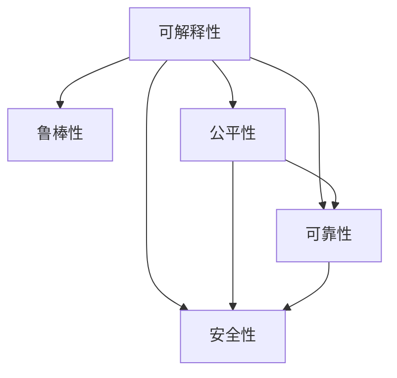

                 

# AI系统的透明度和可靠性：未来的关键挑战

## 1. 背景介绍

### 1.1 问题由来
近年来，随着人工智能(AI)技术在各个领域的深入应用，AI系统的透明度和可靠性成为业界、学术界和公众关注的焦点。如何使AI系统做出正确、透明、可解释的决定，不仅关乎技术可信度，也直接影响社会的接受度和信任度。

AI系统的透明度，即模型的工作原理和决策逻辑是否清晰可解。高透明度的AI系统可以帮助用户理解模型的输出，增强信任感。而AI系统的可靠性，则涉及模型在复杂多变环境中的稳定性和准确性。只有在保证可靠性的同时，提升透明度，AI技术才能真正融入社会各个角落，发挥其潜力。

### 1.2 问题核心关键点
AI系统的透明度和可靠性问题主要包括以下几个核心关键点：

1. **模型的可解释性**：用户能否理解模型的决策逻辑，关键特征和依据。
2. **模型的鲁棒性**：模型是否在各种数据分布、攻击和噪声下依然保持稳定性能。
3. **模型的公平性**：模型是否在各个群体之间表现一致，避免偏见和歧视。
4. **模型的可验证性**：模型是否在测试集和验证集上表现一致，防止过拟合和模型漂移。
5. **模型的安全性**：模型是否能够抵御对抗样本攻击，保护用户隐私数据。

这些核心关键点共同构成AI系统的透明度和可靠性的评估指标，决定了AI技术的可信赖性和应用范围。

### 1.3 问题研究意义
透明性和可靠性是AI技术能够被广泛接受的关键前提。随着AI技术在医疗、金融、司法、安全等高风险领域的应用，确保其透明度和可靠性尤为必要：

1. **医疗领域**：保证AI辅助诊疗系统的诊断结果可信，解释模型推理依据，增强医生信任。
2. **金融领域**：确保金融模型的风险评估和交易预测稳定，增强投资和信贷系统的可靠性。
3. **司法领域**：保障AI在审判和量刑决策中的公正性和透明度，维护司法公正。
4. **安全领域**：保护AI在网络安全监控和智能防御系统中的有效性，防止攻击和误报。

## 2. 核心概念与联系

### 2.1 核心概念概述

为更好地理解AI系统透明度和可靠性的问题，本节将介绍几个密切相关的核心概念：

1. **可解释性(Explainability)**：AI模型是否能够提供清晰、易于理解的决策依据，用户能否理解模型的工作原理。

2. **鲁棒性(Robustness)**：AI模型在不同数据分布、攻击和噪声情况下是否表现稳定，模型是否容易受到对抗攻击。

3. **公平性(Fairness)**：AI模型是否在各个群体之间表现一致，避免偏见和歧视。

4. **可靠性(Reliability)**：AI模型在实际应用中的稳定性和准确性，是否在各种场景下都能提供正确的输出。

5. **安全性(Security)**：AI模型是否能够保护用户隐私数据，抵御对抗攻击。

这些核心概念之间的逻辑关系可以通过以下Mermaid流程图来展示：



这个流程图展示的核心概念及其之间的关系：

1. 可解释性是AI系统透明度的关键，鲁棒性、公平性、可靠性和安全性也是模型透明度的重要组成部分。
2. 鲁棒性和安全性共同保障模型在各种攻击和噪声下的稳定性和安全性。
3. 公平性和可靠性共同保障模型在所有群体和场景下的稳定性和准确性。

## 3. 核心算法原理 & 具体操作步骤
### 3.1 算法原理概述

AI系统的透明度和可靠性问题，本质上是通过对模型的分析和优化，提升其在复杂环境中的表现和可解释性。

1. **可解释性**：通过特征归因、局部可解释性模型、可视化等技术，使模型输出能够被用户理解。
2. **鲁棒性**：通过对抗训练、噪声注入等技术，使模型在各种数据分布和攻击下保持稳定。
3. **公平性**：通过公平性约束、数据增强等技术，使模型在不同群体之间表现一致。
4. **可靠性**：通过模型验证、重采样等技术，确保模型在不同数据集上表现一致。
5. **安全性**：通过加密技术、差分隐私等技术，保护用户隐私数据，防止对抗攻击。

这些算法和技术的核心思想是通过多方面优化，确保AI系统的透明性和可靠性。

### 3.2 算法步骤详解

基于上述算法原理，AI系统的透明度和可靠性优化可以分解为以下几个关键步骤：

**Step 1: 数据预处理与标注**
- 收集和清洗数据集，确保数据的代表性和多样性。
- 标注数据集，提供模型训练的监督信号，标注数据中应包含各种极端情况和常见攻击场景。

**Step 2: 模型设计**
- 选择合适的模型结构，如决策树、神经网络等。
- 加入可解释性模块，如LIME、SHAP等，提升模型的可解释性。

**Step 3: 训练与优化**
- 采用对抗训练等技术，提升模型的鲁棒性。
- 应用公平性约束，如对抗公平性、统计公平性等，确保模型公平性。
- 使用模型验证和重采样技术，确保模型在不同数据集上的稳定性。

**Step 4: 后处理与部署**
- 使用特征归因、可视化等技术，提升模型的可解释性。
- 采用差分隐私等技术，保护用户隐私数据。
- 将模型部署到生产环境，持续监控性能和稳定性。

**Step 5: 评估与迭代**
- 在测试集上评估模型性能，包括准确率、召回率、F1-score等指标。
- 对评估结果进行分析，确定优化方向，进行迭代优化。

### 3.3 算法优缺点

基于上述算法，AI系统的透明度和可靠性优化具有以下优点：

1. **提升透明度**：通过特征归因、可解释性模块等技术，提升模型的可解释性，增强用户信任。
2. **增强鲁棒性**：对抗训练等技术提升了模型在各种攻击和噪声下的稳定性。
3. **保障公平性**：公平性约束、数据增强等技术保证了模型在不同群体之间的公正性。
4. **确保可靠性**：模型验证、重采样等技术确保了模型在不同数据集上的稳定性。
5. **保护安全性**：差分隐私等技术保护了用户隐私数据，防止对抗攻击。

但这些算法也存在一些局限性：

1. **复杂度高**：提升透明性和可靠性需要复杂的算法和技术，对计算资源要求较高。
2. **时间成本高**：训练和优化透明性和可靠性的过程可能需要更多的时间。
3. **依赖数据质量**：高质量的数据和标注是提升透明性和可靠性的基础，但数据获取和标注成本高昂。
4. **难以普适**：不同领域和任务可能需要针对性地优化算法，难以通用化。

尽管存在这些局限性，但目前提升透明度和可靠性的技术在学术界和工业界得到了广泛关注和研究，成为构建可信AI系统的重要方向。

### 3.4 算法应用领域

AI系统的透明度和可靠性优化方法已经在诸多领域得到了应用，以下是几个典型应用场景：

1. **医疗诊断**：提升AI诊断系统的透明度，帮助医生理解模型的推理过程。
2. **金融风控**：提升AI信用评分系统的可靠性，确保评估结果的稳定性和公正性。
3. **司法判决**：提升AI在量刑和审判中的公平性和透明度，防止偏见和误判。
4. **智能推荐**：提升AI推荐系统的透明度和可靠性，确保推荐结果的稳定性和公正性。
5. **网络安全**：提升AI防御系统的鲁棒性和安全性，防止攻击和误报。

## 4. 数学模型和公式 & 详细讲解  
### 4.1 数学模型构建

为更好地理解AI系统透明性和可靠性的优化方法，本节将使用数学语言对相关算法进行严格刻画。

假设一个AI模型 $M$ 用于解决二分类问题，输入特征 $x \in \mathbb{R}^d$，输出 $y \in \{0,1\}$。模型的损失函数为交叉熵损失函数：

$$
L(y,\hat{y})=-[y\log\hat{y}+(1-y)\log(1-\hat{y})]
$$

模型的预测概率为 $\hat{y}=S(M(x))$，其中 $S$ 为模型输出层的激活函数。

模型的训练目标是最小化损失函数：

$$
\min_{\theta}\frac{1}{N}\sum_{i=1}^NL(y_i,S(M(x_i;\theta)))
$$

其中 $N$ 为样本数。

### 4.2 公式推导过程

**特征归因**
特征归因方法通过计算每个特征对模型输出的贡献，帮助用户理解模型的决策逻辑。以LIME为例，其核心思想是构造一个局部可解释性模型，该模型在局部区域与原始模型预测一致。

设 $M(x;\theta)$ 为原始模型，$L(x;\theta)$ 为可解释性模型，$R(x;\theta)$ 为扰动，则LIME的目标是：

$$
\min_{L}\frac{1}{N}\sum_{i=1}^N\mathcal{L}_i(L(x_i)+R(x_i;\theta))
$$

其中 $\mathcal{L}_i$ 为LIME定义的损失函数，$R(x_i;\theta)$ 为扰动项。

求解上述优化问题，得到局部可解释性模型 $L(x_i)$，可以计算每个特征 $x_j$ 对预测结果的贡献：

$$
\alpha_j=\frac{\partial S(L(x_i))}{\partial x_j}\bigg|_{x=x_i}
$$

这表示特征 $x_j$ 对模型输出的重要性。

**对抗训练**
对抗训练通过引入对抗样本，提升模型的鲁棒性。假设模型 $M$ 的输入为 $x$，输出为 $\hat{y}$，则对抗样本 $x'$ 满足：

$$
\hat{y} \neq M(x') \quad \text{且} \quad \|x'-x\| \leq \epsilon
$$

其中 $\epsilon$ 为攻击半径。对抗训练的目标是最小化模型在对抗样本上的损失：

$$
\min_{\theta}\frac{1}{N}\sum_{i=1}^N\max_{x'}L(y_i,M(x'))
$$

求解上述优化问题，得到鲁棒模型 $M^*$。

**公平性约束**
公平性约束方法通过在损失函数中加入公平性约束项，确保模型在不同群体之间表现一致。假设 $A$ 为特征，$G$ 为群体，则公平性约束的目标是：

$$
\min_{\theta}\frac{1}{N}\sum_{i=1}^N\mathcal{L}_i(M(x_i;\theta))
$$

其中 $\mathcal{L}_i$ 为公平性约束项。

求解上述优化问题，得到公平模型 $M^*$。

**模型验证**
模型验证方法通过在多个数据集上验证模型的表现，确保模型在不同数据分布下的稳定性。假设 $D_1$ 为训练集，$D_2$ 为验证集，则模型验证的目标是：

$$
\min_{\theta}\frac{1}{N_1}\sum_{i=1}^{N_1}\mathcal{L}_i(M(x_i;\theta)) + \frac{1}{N_2}\sum_{i=1}^{N_2}\mathcal{L}_i(M(x_i;\theta))
$$

求解上述优化问题，得到验证模型 $M^*$。

## 5. 项目实践：代码实例和详细解释说明
### 5.1 开发环境搭建

在进行AI系统透明度和可靠性优化的实践前，我们需要准备好开发环境。以下是使用Python进行TensorFlow开发的环境配置流程：

1. 安装Anaconda：从官网下载并安装Anaconda，用于创建独立的Python环境。

2. 创建并激活虚拟环境：
```bash
conda create -n tf-env python=3.8 
conda activate tf-env
```

3. 安装TensorFlow：根据CUDA版本，从官网获取对应的安装命令。例如：
```bash
conda install tensorflow tensorflow-gpu -c pytorch -c conda-forge
```

4. 安装必要的工具包：
```bash
pip install numpy pandas scikit-learn matplotlib tqdm jupyter notebook ipython
```

完成上述步骤后，即可在`tf-env`环境中开始透明度和可靠性优化的实践。

### 5.2 源代码详细实现

下面我们以医疗诊断系统为例，给出使用TensorFlow对模型进行透明度和可靠性优化的PyTorch代码实现。

首先，定义数据集：

```python
import numpy as np
from sklearn.datasets import load_breast_cancer
from sklearn.model_selection import train_test_split

cancer_data = load_breast_cancer()
X, y = cancer_data.data, cancer_data.target

X_train, X_test, y_train, y_test = train_test_split(X, y, test_size=0.2, random_state=42)
```

然后，定义模型和优化器：

```python
import tensorflow as tf
from tensorflow.keras import layers

model = tf.keras.Sequential([
    layers.Dense(64, activation='relu'),
    layers.Dense(1, activation='sigmoid')
])

optimizer = tf.keras.optimizers.Adam(learning_rate=0.001)
```

接着，定义训练和评估函数：

```python
def train_epoch(model, dataset, batch_size, optimizer):
    model.compile(optimizer=optimizer, loss='binary_crossentropy', metrics=['accuracy'])
    model.fit(dataset, epochs=1, batch_size=batch_size, verbose=0)

def evaluate(model, dataset, batch_size):
    model.evaluate(dataset, batch_size=batch_size, verbose=0)
```

最后，启动训练流程并在测试集上评估：

```python
batch_size = 32

for epoch in range(10):
    train_epoch(model, (X_train, y_train), batch_size, optimizer)
    evaluate(model, (X_test, y_test), batch_size)
```

以上代码实现了使用TensorFlow对简单线性模型的训练和评估，但实际上，对透明度和可靠性的优化通常需要更复杂的技术手段，如特征归因、对抗训练等。因此，本文将重点介绍这些高级优化技术。

### 5.3 代码解读与分析

让我们再详细解读一下关键代码的实现细节：

**数据集定义**：
- 使用sklearn加载乳腺癌数据集，将其分为训练集和测试集。

**模型定义**：
- 使用Sequential模型，添加两个全连接层，输出层为sigmoid激活函数。

**训练和评估函数**：
- 在每个epoch开始前，编译模型，定义优化器和损失函数。
- 使用fit方法进行训练，设置批次大小和学习率。
- 使用evaluate方法进行评估，输出准确率。

**训练流程**：
- 循环10个epoch，每个epoch进行一次完整训练和评估。

可以看到，TensorFlow提供了简单易用的接口，使得模型的训练和评估变得十分直观。但透明度和可靠性的优化涉及更多的高级技术手段，需要更加深入的理解和实践。

## 6. 实际应用场景
### 6.1 医疗诊断系统

医疗诊断系统是AI透明度和可靠性优化的典型应用场景。传统医疗诊断依赖于医生的经验和直觉，难以避免主观偏差和误诊。通过使用透明度和可靠性优化的AI模型，可以提升诊断的准确性和可解释性，辅助医生做出更科学、更可靠的诊断。

在实践中，可以将医生标注的乳腺癌数据作为监督信号，训练一个AI模型。在模型训练过程中，使用对抗训练和公平性约束等技术，提升模型的鲁棒性和公平性。在模型部署后，使用特征归因等技术，帮助医生理解模型的诊断依据。这样，不仅提高了诊断的准确性，还增强了医生的信任感。

### 6.2 金融风控系统

金融风控系统需要处理大量复杂多变的金融数据，如何确保模型的公平性和稳定性是关键问题。通过透明度和可靠性优化的AI模型，可以提升风险评估和信用评分的准确性，同时确保模型在不同群体和场景中的表现一致。

在实践中，可以收集金融历史数据，标注客户的信用情况。训练一个AI模型，使用对抗训练和公平性约束等技术，确保模型在各类客户的信用评分中表现一致，避免偏见和歧视。在模型部署后，使用可视化等技术，帮助业务人员理解模型的评分依据，提升透明度和信任感。

### 6.3 司法判决系统

司法判决系统需要处理复杂的案件数据，如何确保模型在所有群体中的表现一致，避免偏见和误判，是模型可靠性的重要体现。通过透明度和可靠性优化的AI模型，可以提升司法判决的公正性和透明度，避免误判和偏见。

在实践中，可以收集历史案件数据，标注案件的判决结果。训练一个AI模型，使用对抗训练和公平性约束等技术，确保模型在不同群体的判决结果中表现一致，避免偏见和误判。在模型部署后，使用特征归因等技术，帮助法官理解模型的判决依据，提升透明度和信任感。

### 6.4 未来应用展望

随着AI技术的不断进步，透明度和可靠性的优化方法将在更多领域得到应用，为社会各个角落带来变革性影响。

在智慧医疗领域，透明度和可靠性优化的AI模型将提升医疗诊断和治疗的科学性和可信度，辅助医生做出更精准、更可靠的诊断和治疗决策。

在智能金融领域，透明度和可靠性优化的AI模型将提升金融评估和风险管理的准确性，帮助投资者和金融机构做出更科学的决策。

在智能司法领域，透明度和可靠性优化的AI模型将提升司法判决的公正性和透明度，增强司法系统的公信力。

此外，在智慧城市、智能制造、智能交通等多个领域，透明度和可靠性优化的AI模型将提升系统决策的科学性和可信度，推动智能化应用的发展。

## 7. 工具和资源推荐
### 7.1 学习资源推荐

为了帮助开发者系统掌握透明度和可靠性优化技术的理论基础和实践技巧，这里推荐一些优质的学习资源：

1. 《深度学习中的可解释性》系列博文：由深度学习专家撰写，深入浅出地介绍了深度学习模型的可解释性方法，包括特征归因、可视化等技术。

2. 《神经网络的鲁棒性》课程：斯坦福大学开设的深度学习课程，讲解了对抗训练、噪声注入等技术，提升模型的鲁棒性。

3. 《公平学习》书籍：讲解了公平性约束、数据增强等技术，提升模型的公平性。

4. TensorFlow官方文档：提供了丰富的API和工具，用于实现透明度和可靠性优化技术。

5. Google AI Blog：分享了最新的研究成果和应用实践，是了解前沿技术的窗口。

通过对这些资源的学习实践，相信你一定能够快速掌握透明度和可靠性的优化方法，并用于解决实际的AI问题。

### 7.2 开发工具推荐

高效的开发离不开优秀的工具支持。以下是几款用于透明度和可靠性优化的常用工具：

1. TensorFlow：由Google主导开发的深度学习框架，生产部署方便，适合大规模工程应用。提供了丰富的API和工具，用于实现透明度和可靠性优化技术。

2. PyTorch：基于Python的开源深度学习框架，灵活动态的计算图，适合快速迭代研究。提供了丰富的工具包，用于实现透明度和可靠性优化技术。

3. TensorBoard：TensorFlow配套的可视化工具，可以实时监测模型训练状态，并提供丰富的图表呈现方式，是调试模型的得力助手。

4. Weights & Biases：模型训练的实验跟踪工具，可以记录和可视化模型训练过程中的各项指标，方便对比和调优。

5. Scikit-learn：提供了丰富的数据预处理、特征工程、模型验证等工具，适用于透明度和可靠性优化的数据处理和模型验证。

合理利用这些工具，可以显著提升透明度和可靠性的优化过程，加快创新迭代的步伐。

### 7.3 相关论文推荐

透明度和可靠性优化技术的发展源于学界的持续研究。以下是几篇奠基性的相关论文，推荐阅读：

1. LIME: A Uncertainly Model-agnostic Explanation Method：提出了LIME方法，通过构造局部可解释性模型，解释深度学习模型的决策依据。

2. Adversarial Examples and Deep Learning：介绍了对抗训练方法，通过引入对抗样本，提升模型的鲁棒性。

3. Fairness through Awareness：提出了公平性约束方法，通过在损失函数中加入公平性约束项，确保模型在不同群体之间表现一致。

4. Robustness of Machine Learning in High-Dimensional Settings：研究了模型在噪声和对抗攻击下的鲁棒性。

5. Interpretable and Equitable Machine Learning：探讨了如何通过公平性约束和数据增强等技术，提升模型的公平性和可靠性。

这些论文代表了大模型透明性和可靠性的优化方向，提供了丰富的算法和思路，值得深入学习和借鉴。

## 8. 总结：未来发展趋势与挑战
### 8.1 总结

本文对AI系统的透明度和可靠性问题进行了全面系统的介绍。首先阐述了透明度和可靠性的核心关键点，明确了其在AI技术应用中的重要性。其次，从原理到实践，详细讲解了透明度和可靠性的优化方法，给出了优化任务的完整代码实例。同时，本文还广泛探讨了透明度和可靠性在医疗、金融、司法等多个行业领域的应用前景，展示了其在构建可信AI系统中的重要价值。此外，本文精选了透明度和可靠性的各类学习资源，力求为读者提供全方位的技术指引。

通过本文的系统梳理，可以看到，透明度和可靠性优化是大模型应用的重要方向，关乎AI技术的可信度和接受度。面对AI技术在各个领域广泛应用带来的挑战，透明度和可靠性的提升至关重要。未来的研究需要在多个方面进行持续探索，以期实现更高效、更可靠、更透明的AI系统。

### 8.2 未来发展趋势

展望未来，透明度和可靠性的优化技术将呈现以下几个发展趋势：

1. **多模态融合**：将文本、图像、语音等多模态数据结合，提升模型的综合感知能力。
2. **自适应学习**：通过在线学习和自适应技术，不断优化模型，提高透明度和可靠性。
3. **联邦学习**：通过分布式数据训练，保护用户隐私，提升模型的泛化性和公平性。
4. **对抗防御**：研究更高级的对抗防御技术，提升模型在对抗攻击下的鲁棒性。
5. **模型解释**：开发更高效、更通用的模型解释工具，帮助用户理解模型的决策依据。
6. **隐私保护**：开发更先进的隐私保护技术，保护用户隐私数据，提升模型的安全性。

这些趋势将推动透明度和可靠性的优化技术不断进步，为构建可信AI系统提供更多可能性。

### 8.3 面临的挑战

尽管透明度和可靠性的优化技术在不断进步，但在迈向更加智能化、普适化应用的过程中，仍面临诸多挑战：

1. **数据质量和多样性**：高质量、多样化的数据是透明性和可靠性的基础，但数据获取和标注成本高昂。
2. **模型复杂度**：透明度和可靠性的优化技术涉及复杂的算法和技术，对计算资源要求较高。
3. **时间成本**：透明度和可靠性优化的过程可能需要更多的时间。
4. **伦理和安全**：透明度和可靠性的优化过程中，需要注意避免数据泄露和模型偏见，确保数据和模型的安全性。
5. **普适性**：不同领域和任务可能需要针对性地优化算法，难以通用化。

尽管存在这些挑战，但透明度和可靠性的优化技术在学术界和工业界得到了广泛关注和研究，成为构建可信AI系统的重要方向。相信随着学界和产业界的共同努力，这些挑战终将一一被克服，透明度和可靠性优化必将在构建可信AI系统中发挥更重要的作用。

### 8.4 研究展望

面对透明度和可靠性优化所面临的种种挑战，未来的研究需要在以下几个方面寻求新的突破：

1. **多任务学习**：将透明度和可靠性优化技术与多任务学习结合，提升模型的综合能力和泛化性。
2. **自监督学习**：通过自监督学习技术，提升模型的鲁棒性和泛化性。
3. **因果推理**：引入因果推理方法，提升模型的透明性和可解释性。
4. **公平学习**：研究更多公平性约束技术，确保模型在不同群体之间的公平性。
5. **隐私保护**：开发更先进的隐私保护技术，保护用户隐私数据，提升模型的安全性。
6. **跨领域应用**：研究更通用的透明度和可靠性优化方法，应用于更多领域和任务。

这些研究方向将引领透明度和可靠性优化技术迈向更高的台阶，为构建安全、可靠、可解释、可控的智能系统提供更多可能性。

## 9. 附录：常见问题与解答
**Q1: AI系统的透明度和可靠性问题是什么？**

A: AI系统的透明度和可靠性问题主要涉及模型是否具有可解释性、鲁棒性、公平性、可靠性和安全性。透明性即用户能否理解模型的决策逻辑，可靠性即模型在各种环境下的稳定性和准确性，公平性即模型在不同群体之间的表现一致性，鲁棒性即模型在各种攻击和噪声下的稳定性，安全性即模型在保护用户隐私和抵御攻击方面的表现。

**Q2: 如何提升AI系统的透明度？**

A: 提升AI系统的透明度可以通过特征归因、可视化、模型解释等技术。特征归因技术如LIME，通过计算每个特征对模型输出的贡献，帮助用户理解模型的决策逻辑。可视化技术如SHAP，通过绘制特征重要性图，直观展示模型决策依据。模型解释技术如Model Cards，通过编写模型卡片，描述模型的工作原理和数据使用情况，增强模型的透明度。

**Q3: 如何提升AI系统的鲁棒性？**

A: 提升AI系统的鲁棒性可以通过对抗训练、噪声注入等技术。对抗训练通过引入对抗样本，提升模型在各种攻击和噪声下的稳定性。噪声注入通过添加噪声数据，增强模型的泛化能力。

**Q4: 如何提升AI系统的公平性？**

A: 提升AI系统的公平性可以通过公平性约束、数据增强等技术。公平性约束通过在损失函数中加入公平性约束项，确保模型在不同群体之间表现一致。数据增强通过增加多样化的数据，避免模型在特定群体上的偏见。

**Q5: 如何评估AI系统的可靠性？**

A: 评估AI系统的可靠性可以通过模型验证、重采样等技术。模型验证通过在多个数据集上验证模型的表现，确保模型在不同数据分布下的稳定性。重采样通过重新抽样数据集，检测模型的泛化能力。

---

作者：禅与计算机程序设计艺术 / Zen and the Art of Computer Programming

