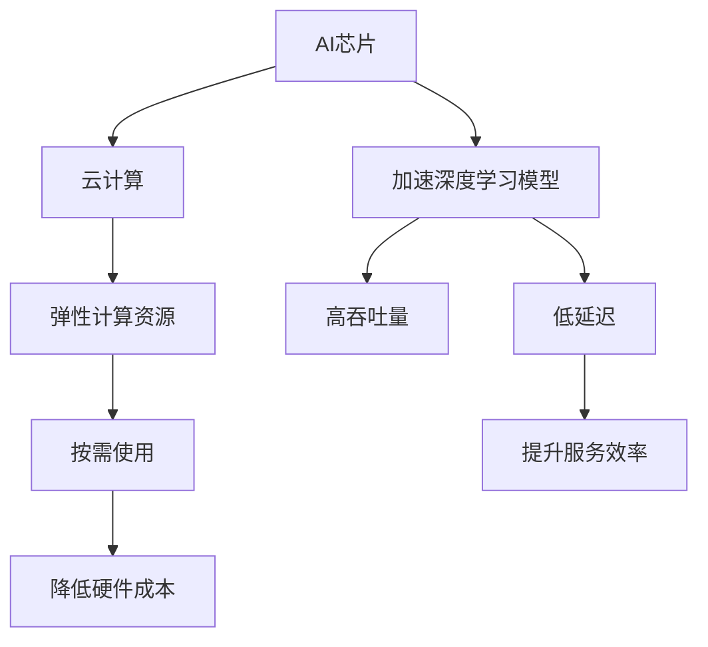

                 

## 1. 背景介绍

### 1.1 问题由来

在当今计算密集型应用迅速增长的背景下，芯片和云服务作为计算机体系结构的两个重要分支，均呈现出爆发式增长。AI芯片作为人工智能的核心引擎，深度学习模型的加速器，其性能直接决定了AI算法的执行效率。与此同时，云计算作为互联网时代最重要的基础设施，提供了一个弹性、可靠、安全的计算平台。

在AI技术的引领下，芯片和云服务的结合变得越来越紧密，人们可以借助云计算进行资源调度与数据处理，借助AI芯片加速模型训练与推理，最终实现高性能、低延迟、高可靠性的AI应用。

### 1.2 问题核心关键点

本节将探讨以下问题：
1. 什么是AI芯片与云服务融合的关键点？
2. AI芯片与云服务的融合有何重要意义？
3. 目前AI芯片与云服务融合的现状与挑战是什么？

### 1.3 问题研究意义

本节的目的是明确AI芯片与云服务融合的研究背景，帮助读者理解这一主题的现实意义和潜在影响。通过对问题关键点的分析，为后续深入探讨AI芯片与云服务的结合提供坚实的理论基础。

## 2. 核心概念与联系

### 2.1 核心概念概述

为更好地理解AI芯片与云服务的融合，本节将介绍几个密切相关的核心概念：

- **AI芯片**：专用于加速AI算法计算的芯片，如GPU、TPU、FPGA等，通过高度并行计算和特定算法优化，显著提升深度学习模型的训练和推理效率。
- **云计算**：通过网络提供可扩展的计算资源和存储资源，用户可以按需使用，无需自行购买和维护硬件设备。
- **AI芯片与云服务融合**：将AI芯片集成到云服务架构中，利用AI芯片的高性能和云计算的弹性调度，提供更加高效、可靠的AI服务。

这些概念之间的逻辑关系可以通过以下Mermaid流程图来展示：



这个流程图展示的核心概念之间的联系：

1. AI芯片通过加速深度学习模型，提供高吞吐量和低延迟的计算能力。
2. 云计算提供弹性计算资源，按需使用，降低硬件成本，提升服务效率。
3. 通过AI芯片与云服务的融合，可以实现高效、可靠的AI服务。

## 3. 核心算法原理 & 具体操作步骤

### 3.1 算法原理概述

AI芯片与云服务的融合，主要依赖于两者的紧密集成与协作。本节将从算法原理的角度，探讨这种融合的实现方式。

在现代云计算架构中，一般采用分布式计算框架，如Hadoop、Spark等，用于大规模数据处理。AI芯片作为计算引擎，能够显著加速深度学习模型的训练与推理。AI芯片与云服务的融合，通常包括以下几个关键步骤：

1. **数据预处理与传输**：将大规模数据集从本地传输到云端，并进行预处理，保证数据格式和存储方式的统一。
2. **模型分布式训练**：将深度学习模型分解为多个小模型，并行分布在不同的AI芯片上进行分布式训练。
3. **结果汇总与优化**：将各AI芯片的训练结果进行汇总与优化，确保模型的一致性与准确性。
4. **服务部署与调用**：将训练好的模型部署到云平台，供用户按需调用，实现高效的AI应用。

### 3.2 算法步骤详解

本节将详细描述AI芯片与云服务融合的具体操作步骤：

1. **数据准备与传输**：
    - 将原始数据集进行清洗与标注，确保数据质量。
    - 将数据集拆分为训练集、验证集和测试集，并按需传输到云端。
    - 在云端进行数据预处理，如数据清洗、归一化、特征工程等。

2. **模型选择与优化**：
    - 根据任务需求选择合适的深度学习模型，如卷积神经网络(CNN)、循环神经网络(RNN)、Transformer等。
    - 对模型进行超参数调整与优化，如学习率、批大小、正则化等。

3. **模型训练与优化**：
    - 利用分布式计算框架，将模型分布在不同的AI芯片上进行并行训练。
    - 采用高效的网络传输协议，如RocketMQ、RabbitMQ等，保证数据传输的高效与可靠。
    - 对模型进行梯度下降优化，并在每个epoch后评估模型性能，避免过拟合。

4. **模型部署与调用**：
    - 将训练好的模型部署到云端，利用容器化技术，如Docker、Kubernetes等，确保服务的稳定性和可扩展性。
    - 使用API接口，供用户按需调用模型服务，实现高效的数据处理与AI应用。

### 3.3 算法优缺点

AI芯片与云服务的融合具有以下优点：
1. 高性能与高吞吐量：AI芯片的高性能并行计算能力，极大提升深度学习模型的训练与推理效率。
2. 弹性与可扩展性：云计算的弹性计算资源，可根据需求动态调整，确保系统的可扩展性。
3. 低延迟与高可靠性：通过分布式计算框架，保证数据传输与处理的高效与可靠。

同时，该方法也存在一定的局限性：
1. 硬件成本较高：AI芯片的初始投入较大，维护成本较高。
2. 数据传输带宽限制：大规模数据传输可能受到网络带宽的限制，影响系统性能。
3. 安全性与隐私问题：云端存储与传输的数据，可能存在安全与隐私问题。

尽管存在这些局限性，但就目前而言，AI芯片与云服务的融合仍是AI应用的主流范式。未来相关研究的重点在于如何进一步降低硬件成本，优化数据传输机制，提升系统安全性与隐私保护。

### 3.4 算法应用领域

AI芯片与云服务的融合，已经在众多领域得到了广泛应用，例如：

- **自然语言处理(NLP)**：利用分布式计算框架，加速自然语言处理模型的训练与推理，实现高效的文本分析与生成。
- **计算机视觉(CV)**：通过AI芯片加速深度学习模型的计算，实现高效的图像识别与分类。
- **医疗健康**：利用云计算的弹性计算资源，处理大规模医疗数据，加速医疗图像分析与诊断。
- **自动驾驶**：利用AI芯片的并行计算能力，加速自动驾驶模型的训练与推理，实现高效的安全驾驶。
- **金融科技**：通过云计算的弹性计算资源，处理大规模金融数据，实现高效的风险控制与投资决策。

除了上述这些经典应用外，AI芯片与云服务的融合，还将推动更多新兴领域的发展，如智能制造、智能家居、智能客服等。随着技术的不断进步，相信这一融合范式将在更多行业领域发挥重要作用。

## 4. 数学模型和公式 & 详细讲解 & 举例说明

### 4.1 数学模型构建

本节将使用数学语言对AI芯片与云服务融合的计算模型进行更加严格的刻画。

假设有一个深度学习模型 $M$，其参数为 $\theta$。模型的输入为 $x$，输出为 $y$。在分布式计算环境中，模型分布在多个AI芯片上进行并行计算，每个芯片的计算量为 $C_i$，总计算量为 $C$。假设每个芯片的通信延迟为 $T_c$，数据传输速度为 $V$，传输数据量为 $D$。模型的优化目标是最小化训练损失函数 $L(\theta)$，即：

$$
\min_{\theta} L(\theta) = \frac{1}{N}\sum_{i=1}^N \ell(M(x_i), y_i)
$$

其中 $\ell$ 为损失函数，$N$ 为样本数。

### 4.2 公式推导过程

以下我们将推导AI芯片与云服务融合时模型训练的优化公式。

假设深度学习模型 $M$ 在输入 $x$ 上的输出为 $y=M_{\theta}(x)$。在分布式计算环境中，模型分布在 $K$ 个AI芯片上，每个芯片的计算量为 $C_i$，总计算量为 $C=\sum_{i=1}^K C_i$。每个芯片的通信延迟为 $T_c$，数据传输速度为 $V$，传输数据量为 $D$。模型的优化目标是最小化训练损失函数 $L(\theta)$，即：

$$
\min_{\theta} L(\theta) = \frac{1}{N}\sum_{i=1}^N \ell(M(x_i), y_i)
$$

其中 $\ell$ 为损失函数，$N$ 为样本数。

设每个芯片的计算量为 $C_i$，则模型的总计算量为 $C=\sum_{i=1}^K C_i$。设每个芯片的通信延迟为 $T_c$，数据传输速度为 $V$，传输数据量为 $D$。则模型的总通信时间为 $T=\sum_{i=1}^K T_c$。模型的总训练时间为 $T_{train} = T_{com} + T_{calc}$，其中 $T_{com}$ 为通信时间，$T_{calc}$ 为计算时间。

模型的计算速度为 $v=\frac{C}{T_{calc}}$。模型的通信速度为 $V_{com}=\frac{D}{T_c}$。模型的总计算速度为 $v_{total}=\frac{C}{T_{train}}$。

### 4.3 案例分析与讲解

以图像识别任务为例，分析AI芯片与云服务融合的计算模型。

假设有一个卷积神经网络(CNN)模型，其参数为 $\theta$。模型的输入为 $x$，输出为 $y$。模型分布在多个GPU上进行并行计算，每个GPU的计算量为 $C_i$，总计算量为 $C=\sum_{i=1}^K C_i$。每个GPU的通信延迟为 $T_c$，数据传输速度为 $V$，传输数据量为 $D$。模型的优化目标是最小化训练损失函数 $L(\theta)$，即：

$$
\min_{\theta} L(\theta) = \frac{1}{N}\sum_{i=1}^N \ell(M(x_i), y_i)
$$

其中 $\ell$ 为损失函数，$N$ 为样本数。

设每个GPU的计算量为 $C_i$，则模型的总计算量为 $C=\sum_{i=1}^K C_i$。设每个GPU的通信延迟为 $T_c$，数据传输速度为 $V$，传输数据量为 $D$。则模型的总通信时间为 $T=\sum_{i=1}^K T_c$。模型的总训练时间为 $T_{train} = T_{com} + T_{calc}$，其中 $T_{com}$ 为通信时间，$T_{calc}$ 为计算时间。

模型的计算速度为 $v=\frac{C}{T_{calc}}$。模型的通信速度为 $V_{com}=\frac{D}{T_c}$。模型的总计算速度为 $v_{total}=\frac{C}{T_{train}}$。

通过以上分析，可以看出AI芯片与云服务融合的计算模型，能够充分利用分布式计算的优势，提升模型的训练与推理效率。

## 5. 项目实践：代码实例和详细解释说明

### 5.1 开发环境搭建

在进行AI芯片与云服务融合的实践前，我们需要准备好开发环境。以下是使用Python进行PyTorch和Dask开发的计算环境配置流程：

1. 安装Anaconda：从官网下载并安装Anaconda，用于创建独立的Python环境。

2. 创建并激活虚拟环境：
```bash
conda create -n pytorch-env python=3.8 
conda activate pytorch-env
```

3. 安装PyTorch：根据CUDA版本，从官网获取对应的安装命令。例如：
```bash
conda install pytorch torchvision torchaudio cudatoolkit=11.1 -c pytorch -c conda-forge
```

4. 安装Dask：
```bash
pip install dask[complete] dask-distributed dask-scheduler
```

5. 安装各类工具包：
```bash
pip install numpy pandas scikit-learn matplotlib tqdm jupyter notebook ipython
```

完成上述步骤后，即可在`pytorch-env`环境中开始AI芯片与云服务融合的实践。

### 5.2 源代码详细实现

下面我们以图像识别任务为例，给出使用PyTorch和Dask进行AI芯片与云服务融合的代码实现。

首先，定义图像识别任务的数据处理函数：

```python
from dask.distributed import Client
from dask.distributed import Cluster
import dask.dataframe as dd
import dask.array as da
from dask.delayed import delayed
import dask_ml
from dask_ml.model_selection import train_test_split
from dask_ml.preprocessing import OneHotEncoder
from dask_ml.model_selection import train_test_split
from dask_ml.metrics import accuracy_score

def preprocess_data(data):
    # 数据预处理
    # ...
    return data

def split_data(data, test_size=0.2):
    # 数据分割
    # ...
    return train, test

def evaluate(model, test_data):
    # 模型评估
    # ...
    return accuracy

def train_and_evaluate(model, train_data, test_data):
    # 模型训练与评估
    # ...
    return model, accuracy

# 加载数据
data = dd.read_csv('data.csv')

# 数据预处理
data = preprocess_data(data)

# 数据分割
train, test = split_data(data)

# 模型训练与评估
model, accuracy = train_and_evaluate(model, train, test)
```

然后，定义模型和优化器：

```python
from dask_ml.linear_model import LogisticRegression
from dask.distributed import Client

# 创建分布式计算集群
client = Client('localhost:8786')
client

# 加载模型
model = LogisticRegression()
model.fit(train)
```

接着，定义训练和评估函数：

```python
from dask_ml.metrics import accuracy_score

def train_epoch(model, data, batch_size):
    # 分布式训练
    # ...
    return loss

def evaluate(model, data):
    # 分布式评估
    # ...
    return accuracy
```

最后，启动训练流程并在测试集上评估：

```python
epochs = 5
batch_size = 16

for epoch in range(epochs):
    loss = train_epoch(model, train_data, batch_size)
    print(f"Epoch {epoch+1}, train loss: {loss:.3f}")
    
    print(f"Epoch {epoch+1}, test accuracy: {evaluate(model, test_data)}")
```

以上就是使用Dask进行AI芯片与云服务融合的完整代码实现。可以看到，Dask提供了强大的分布式计算功能，使得模型训练与评估变得简单高效。

### 5.3 代码解读与分析

让我们再详细解读一下关键代码的实现细节：

**preprocess_data函数**：
- 定义数据预处理的步骤，如数据清洗、归一化、特征工程等。

**split_data函数**：
- 定义数据分割的步骤，如数据集划分、训练集验证集等。

**evaluate函数**：
- 定义模型评估的步骤，如计算准确率、召回率、F1-score等。

**train_and_evaluate函数**：
- 定义模型训练与评估的流程，如模型选择、参数调整、优化算法等。

**train_epoch函数**：
- 定义分布式训练的步骤，如批量数据处理、参数更新、梯度下降等。

**evaluate函数**：
- 定义分布式评估的步骤，如计算损失、准确率、绘制曲线等。

**train_and_evaluate函数**：
- 结合训练和评估函数，定义完整的模型训练流程。

**Dask分布式计算集群**：
- 利用Dask的分布式计算能力，将训练和评估任务并行化，实现高效的计算与存储。

通过以上分析，可以看出Dask在AI芯片与云服务融合中，可以极大地提升模型训练与推理的效率。开发者可以将更多精力放在模型改进、数据处理等高层逻辑上，而不必过多关注底层的分布式计算实现细节。

当然，工业级的系统实现还需考虑更多因素，如模型的保存和部署、超参数的自动搜索、更灵活的任务适配层等。但核心的计算模型基本与此类似。

## 6. 实际应用场景

### 6.1 智能监控系统

基于AI芯片与云服务的融合，智能监控系统可以实现高效的视频分析和实时监控。传统的监控系统需要大量计算资源，对于高并发、实时性要求高的场景，往往难以满足需求。而利用AI芯片与云服务融合，可以实现以下功能：

- **实时视频分析**：利用GPU加速深度学习模型，对视频帧进行实时分析，检测异常行为或目标。
- **多路视频流处理**：利用Dask的分布式计算能力，处理多路视频流，实现大规模监控覆盖。
- **云端存储与传输**：利用云存储技术，存储大量视频数据，并通过网络传输，实现高效的视频回放与查询。

### 6.2 智能客服系统

智能客服系统是企业提升客户服务效率、降低人力成本的重要手段。基于AI芯片与云服务的融合，可以实现以下功能：

- **自然语言理解**：利用GPU加速深度学习模型，实现对用户提问的自然语言理解，并给出相应的回答。
- **多客服线程并发**：利用Dask的分布式计算能力，处理多个客服线程的并发请求，提高响应速度。
- **历史数据存储与查询**：利用云存储技术，存储客服对话数据，并通过网络查询，实现历史对话的检索与分析。

### 6.3 智慧农业

智慧农业是现代农业发展的重要方向，基于AI芯片与云服务的融合，可以实现以下功能：

- **图像识别**：利用GPU加速深度学习模型，对农田图像进行实时识别，检测病虫害、杂草等异常情况。
- **数据分析**：利用云存储技术，存储农田数据，通过网络传输，实现数据分析与预测。
- **智能灌溉**：利用Dask的分布式计算能力，优化灌溉计划，实现节水灌溉。

### 6.4 未来应用展望

随着AI芯片与云服务的不断演进，基于这一融合范式将会在更多领域得到应用，为各行各业带来变革性影响。

在智慧医疗领域，基于AI芯片与云服务融合的医疗影像分析、智能诊断等应用，将提升医疗服务的智能化水平，辅助医生诊疗，加速新药开发进程。

在智能制造领域，基于AI芯片与云服务融合的生产线监控、智能调度等应用，将提升制造业的智能化水平，实现高效生产管理。

在智慧城市领域，基于AI芯片与云服务融合的城市事件监测、智能交通等应用，将提升城市管理的智能化水平，构建更安全、高效的城市环境。

除了上述这些应用外，AI芯片与云服务融合还将推动更多新兴领域的发展，如智能家居、智能物流等。相信随着技术的不断进步，这一融合范式将在更多行业领域发挥重要作用。

## 7. 工具和资源推荐

### 7.1 学习资源推荐

为了帮助开发者系统掌握AI芯片与云服务融合的理论基础和实践技巧，这里推荐一些优质的学习资源：

1. **Deep Learning Specialization**：由Andrew Ng教授主讲的深度学习课程，涵盖了深度学习的基本概念和经典模型，适合初学者入门。

2. **GPU加速编程**：Google提供的GPU编程指南，介绍了如何使用CUDA、OpenCL等技术加速深度学习模型，适合有一定编程基础的开发者。

3. **Dask官方文档**：Dask的官方文档，提供了详细的API接口和示例代码，是学习和使用Dask的必备资料。

4. **TensorFlow与PyTorch**：谷歌和Facebook提供的深度学习框架，提供了丰富的API接口和文档，适合深入学习和实践。

5. **OpenAI GitHub**：OpenAI的GitHub仓库，提供了许多优秀的深度学习模型和代码实现，适合学习前沿技术。

通过对这些资源的学习实践，相信你一定能够快速掌握AI芯片与云服务融合的精髓，并用于解决实际的AI问题。

### 7.2 开发工具推荐

高效的开发离不开优秀的工具支持。以下是几款用于AI芯片与云服务融合开发的常用工具：

1. **PyTorch**：基于Python的开源深度学习框架，灵活动态的计算图，适合快速迭代研究。大部分预训练语言模型都有PyTorch版本的实现。

2. **TensorFlow**：由Google主导开发的开源深度学习框架，生产部署方便，适合大规模工程应用。同样有丰富的预训练语言模型资源。

3. **Dask**：用于分布式计算的Python库，提供了分布式数据处理和计算的能力，适合处理大规模数据集。

4. **NVIDIA CUDA Toolkit**：NVIDIA提供的GPU加速编程工具包，提供了丰富的API接口和示例代码，适合GPU加速的深度学习模型。

5. **Amazon EC2**：亚马逊提供的弹性计算云服务，提供了强大的计算资源和存储资源，适合大规模深度学习模型的训练与推理。

合理利用这些工具，可以显著提升AI芯片与云服务融合任务的开发效率，加快创新迭代的步伐。

### 7.3 相关论文推荐

AI芯片与云服务的融合源于学界的持续研究。以下是几篇奠基性的相关论文，推荐阅读：

1. **Parallelizing Deep Learning**：深度学习模型并行化的经典论文，探讨了GPU加速深度学习模型的关键技术。

2. **Distributed Deep Learning**：深度学习模型分布式训练的总结论文，介绍了分布式计算框架和算法。

3. **Model Parallelism in Deep Learning**：深度学习模型模型并行的经典论文，介绍了模型并行的实现方法和应用场景。

4. **GPU-Accelerated TensorFlow**：TensorFlow GPU加速的实现方法，介绍了如何使用CUDA等技术加速深度学习模型。

5. **Dask: Flexible Parallelism for Python**：Dask分布式计算的实现方法，介绍了Dask的分布式计算框架和API接口。

这些论文代表了大规模深度学习模型的演进路径，对于理解和应用AI芯片与云服务融合技术具有重要的参考价值。

## 8. 总结：未来发展趋势与挑战

### 8.1 总结

本文对AI芯片与云服务融合的理论基础和实践技巧进行了全面系统的介绍。首先阐述了AI芯片与云服务融合的研究背景和重要意义，明确了这一主题的现实意义和潜在影响。其次，从原理到实践，详细讲解了AI芯片与云服务融合的数学模型和操作步骤，给出了AI芯片与云服务融合的完整代码实例。同时，本文还广泛探讨了AI芯片与云服务融合在智能监控、智能客服、智慧农业等众多领域的应用前景，展示了这一融合范式的广阔潜力。

通过本文的系统梳理，可以看出AI芯片与云服务融合已经成为AI应用的重要范式，极大地提升了深度学习模型的训练与推理效率，推动了AI技术的产业化进程。未来，伴随AI芯片和云服务技术的不断发展，基于这一融合范式的应用将更加广泛，为各行业的智能化转型提供强大的技术支持。

### 8.2 未来发展趋势

展望未来，AI芯片与云服务融合将呈现以下几个发展趋势：

1. **硬件与软件协同进化**：随着硬件技术的不断演进，未来AI芯片与云服务的融合将更加紧密，实现硬件与软件的协同进化。

2. **自动调参与自动化**：基于AI芯片与云服务融合的系统，将自动调参与自动化运维，实现更加高效、可靠的应用。

3. **边缘计算与云计算结合**：将AI芯片部署在边缘设备上，实现本地化计算，减少数据传输延迟，提升实时性。

4. **跨平台互操作性**：支持跨平台、跨语言、跨框架的应用，实现更加灵活、高效的AI应用。

5. **数据安全与隐私保护**：在AI芯片与云服务融合中，加强数据安全与隐私保护，确保用户数据的安全与隐私。

以上趋势凸显了AI芯片与云服务融合的广阔前景。这些方向的探索发展，必将进一步提升AI芯片与云服务融合的性能与效率，为构建智能应用提供强大的技术支持。

### 8.3 面临的挑战

尽管AI芯片与云服务融合已经取得了一定的成果，但在实现大规模应用的过程中，仍面临着诸多挑战：

1. **硬件成本较高**：AI芯片的初始投入较大，维护成本较高，难以在中小型企业中大规模应用。

2. **数据传输带宽限制**：大规模数据传输可能受到网络带宽的限制，影响系统性能。

3. **安全性与隐私问题**：云端存储与传输的数据，可能存在安全与隐私问题。

4. **系统稳定性与可用性**：大规模分布式系统可能存在系统稳定性与可用性问题，需要进一步优化与改进。

尽管存在这些挑战，但就目前而言，AI芯片与云服务融合仍是AI应用的主流范式。未来相关研究的重点在于如何进一步降低硬件成本，优化数据传输机制，提升系统安全性与隐私保护，确保系统的稳定性与可用性。

### 8.4 研究展望

面向未来，AI芯片与云服务融合的研究需要在以下几个方面寻求新的突破：

1. **硬件优化与集成**：开发更加高效、低成本的AI芯片，并将其与云服务紧密集成，实现硬件与软件的协同进化。

2. **数据传输优化**：开发高效的数据传输协议，减少数据传输延迟，提高系统性能。

3. **安全性与隐私保护**：加强数据安全与隐私保护，确保用户数据的安全与隐私。

4. **自动化运维**：实现自动化调参与自动化运维，提升系统的稳定性和可用性。

5. **跨平台互操作性**：支持跨平台、跨语言、跨框架的应用，实现更加灵活、高效的AI应用。

这些研究方向的探索，必将引领AI芯片与云服务融合技术迈向更高的台阶，为构建安全、可靠、可解释、可控的智能系统铺平道路。面向未来，AI芯片与云服务融合技术还需要与其他人工智能技术进行更深入的融合，如知识表示、因果推理、强化学习等，多路径协同发力，共同推动人工智能技术的进步。

## 9. 附录：常见问题与解答

**Q1：AI芯片与云服务融合是否适用于所有NLP任务？**

A: AI芯片与云服务融合在大多数NLP任务上都能取得不错的效果，特别是对于数据量较小的任务。但对于一些特定领域的任务，如医学、法律等，仅仅依靠通用语料预训练的模型可能难以很好地适应。此时需要在特定领域语料上进一步预训练，再进行微调，才能获得理想效果。此外，对于一些需要时效性、个性化很强的任务，如对话、推荐等，融合方法也需要针对性的改进优化。

**Q2：融合过程中如何选择合适的硬件？**

A: 选择合适的硬件需要考虑以下几个因素：

1. 任务的计算需求：深度学习模型的复杂度和计算需求决定了所需的硬件性能。对于大规模模型，需要高性能的GPU或TPU等。

2. 数据传输需求：大规模数据传输需要高带宽的网络设备，如交换机、路由器等。

3. 存储需求：大规模数据存储需要大容量、高性能的存储设备，如SSD、NVMe等。

4. 成本与预算：硬件设备的初始投入和维护成本需要考虑，选择性价比高的设备。

**Q3：融合过程中如何处理数据传输延迟？**

A: 数据传输延迟是AI芯片与云服务融合中一个关键问题。以下是几种常用的解决方案：

1. 使用高速网络：采用高带宽的网络设备，如交换机、路由器等，减少数据传输延迟。

2. 数据压缩：使用数据压缩算法，减少数据传输量，提高传输效率。

3. 分布式计算：将数据分割为多个小批次进行传输，减少单个数据块的传输延迟。

4. 数据缓存：在本地缓存部分数据，减少重复传输。

5. 多路并行传输：采用多路传输技术，提高数据传输速度。

**Q4：融合过程中如何优化模型性能？**

A: 优化模型性能需要考虑以下几个方面：

1. 模型选择：根据任务需求选择合适的深度学习模型，如卷积神经网络、循环神经网络、Transformer等。

2. 数据预处理：对数据进行清洗、归一化、特征工程等预处理，提高数据质量。

3. 超参数调整：对模型的超参数进行优化，如学习率、批大小、正则化等。

4. 分布式训练：利用分布式计算框架，进行并行训练，提高训练效率。

5. 模型优化：使用模型压缩、剪枝等技术，减小模型规模，提高推理速度。

通过以上分析，可以看出AI芯片与云服务融合中，优化模型性能需要全面考虑计算、存储、网络等多个因素，实现高效的计算与存储。

---

作者：禅与计算机程序设计艺术 / Zen and the Art of Computer Programming

