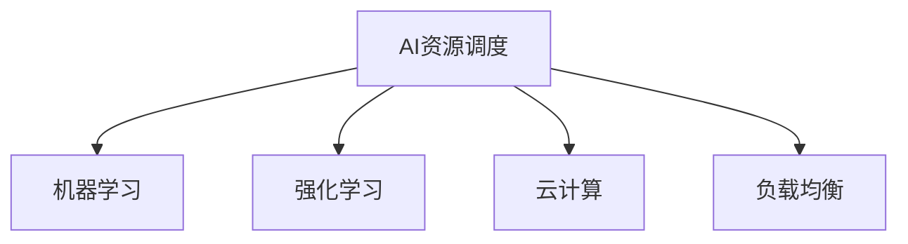

                 

# AI资源调度的智能化：Lepton AI的算法优势

> 关键词：AI资源调度, Lepton AI, 算法优势, 智能化调度, 负载均衡, 自动化管理, 云计算

## 1. 背景介绍

### 1.1 问题由来
随着云计算和人工智能技术的迅猛发展，数据中心和企业IT部门的资源需求日益增长，如何高效、可靠地调度和管理这些资源，成为摆在IT管理者面前的重大挑战。传统的资源管理方式往往依赖人工调度和监控，效率低下且容易出错。随着自动化和智能化的兴起，AI驱动的资源调度系统成为新的研究方向。

近年来，AI技术在自然语言处理、计算机视觉、推荐系统等领域取得了显著成果。然而，将AI技术应用于资源调度领域的研究尚处于起步阶段，相关算法和工具有待进一步完善和推广。为此，Lepton AI团队提出了一种基于AI的资源调度算法，结合机器学习、强化学习等多种技术手段，实现智能化、自动化的资源管理。

### 1.2 问题核心关键点
本文将详细阐述Lepton AI算法的主要特点和技术优势，探讨其在资源调度中的应用前景。

## 2. 核心概念与联系

### 2.1 核心概念概述

为了更好地理解Lepton AI算法的核心思想和应用场景，本节将介绍几个密切相关的核心概念：

- AI资源调度：利用人工智能技术进行资源调度的过程。通过机器学习、强化学习等算法，实现自动化、智能化的资源管理。
- 机器学习（Machine Learning, ML）：利用数据和算法，使计算机具备学习和改进能力，从而实现自动化决策。
- 强化学习（Reinforcement Learning, RL）：通过环境交互，智能体（agent）学习最优策略以最大化累积奖励。
- 云计算（Cloud Computing）：通过网络提供按需计算资源和服务的模式，方便用户按需扩展和使用。
- 负载均衡（Load Balancing）：通过智能调度和资源分配，确保系统的高可用性和性能。

这些核心概念之间的逻辑关系可以通过以下Mermaid流程图来展示：



这个流程图展示了这个系统的核心概念及其之间的关系：

1. AI资源调度利用机器学习和强化学习算法进行智能化管理。
2. 机器学习和强化学习分别负责监督学习和强化学习，提升算法的决策能力。
3. 云计算提供底层资源支撑，支持AI算法的运行。
4. 负载均衡实现资源的高效利用，保证系统的稳定性和性能。

这些概念共同构成了AI资源调度的技术框架，使其能够在各类场景下高效运作。

## 3. 核心算法原理 & 具体操作步骤
### 3.1 算法原理概述

Lepton AI算法的核心思想是利用AI技术进行资源调度的智能化管理，结合机器学习和强化学习的优点，实现资源的自动调度和负载均衡。

算法主要分为两个阶段：

- 监督学习阶段：通过历史数据训练模型，学习资源调度的规律和最优策略。
- 强化学习阶段：在实时环境中，通过智能体的交互，不断优化决策策略，提升系统的性能。

整个算法的核心流程如下：

1. 数据收集：收集系统中各资源的运行数据和性能指标。
2. 模型训练：使用监督学习算法，对历史数据进行建模，学习资源调度的规律。
3. 实时调度：在强化学习环境中，智能体根据当前资源状态和任务需求，做出实时调度决策。
4. 性能评估：通过监控和反馈机制，评估调度的性能，并调整模型参数。

### 3.2 算法步骤详解

#### 3.2.1 数据收集

在数据收集阶段，算法需要从系统中的各个资源节点收集实时数据。这些数据包括CPU使用率、内存占用、网络带宽、任务队列长度等。

具体步骤如下：

1. 定义数据采集点：系统中的各节点和资源需定义相应的数据采集点，并设置采集频率和格式。
2. 数据采集器：使用Python等脚本或工具，定时采集各节点数据，并将其存储在中央数据仓库中。
3. 数据清洗：对采集到的数据进行清洗和预处理，去除异常值和噪声。

#### 3.2.2 模型训练

在模型训练阶段，算法使用监督学习算法对历史数据进行建模，学习资源调度的规律。

具体步骤如下：

1. 特征工程：对原始数据进行特征提取和选择，生成可用于训练模型的特征向量。
2. 模型选择：选择适合的监督学习算法（如随机森林、梯度提升树等），并设置相应的超参数。
3. 数据分割：将历史数据集划分为训练集和验证集，使用交叉验证等方法评估模型性能。
4. 模型训练：使用训练集对模型进行训练，并在验证集上进行调优。

#### 3.2.3 实时调度

在实时调度阶段，算法通过强化学习算法，在实时环境中进行智能调度决策。

具体步骤如下：

1. 定义状态空间：将系统的资源状态和任务需求定义为一个状态空间。
2. 定义动作空间：确定智能体可以采取的调度动作，如增加资源、释放资源、迁移任务等。
3. 设计奖励函数：根据调度的性能，设计奖励函数，鼓励智能体做出最优决策。
4. 智能体训练：使用强化学习算法（如Q-learning、SARSA等），训练智能体在状态空间中做出最优决策。

#### 3.2.4 性能评估

在性能评估阶段，算法通过监控和反馈机制，评估调度的性能，并调整模型参数。

具体步骤如下：

1. 定义性能指标：根据系统需求，定义相应的性能指标，如响应时间、吞吐量、可用率等。
2. 实时监控：使用监控工具实时采集系统的性能数据，并将其传递给算法。
3. 反馈调整：根据性能数据，调整模型的参数，优化调度策略。

### 3.3 算法优缺点

Lepton AI算法具有以下优点：

- 自动化程度高：通过AI算法实现资源调度的自动化，减轻人工操作负担。
- 决策能力强大：结合机器学习和强化学习算法，提升调度决策的准确性和鲁棒性。
- 实时性强：能够在实时环境中进行智能调度，快速响应系统变化。

同时，该算法也存在一些局限性：

- 对数据质量要求高：需要收集高质量、全面的历史数据，才能训练出准确的模型。
- 模型复杂度高：需要同时使用监督学习和强化学习算法，模型设计和调参难度大。
- 系统稳定性需保证：在强化学习环境中，智能体的决策可能会引入不确定性，影响系统稳定性。

尽管存在这些局限性，但Lepton AI算法仍是大规模、复杂系统的理想选择。未来相关研究的重点在于如何进一步简化模型结构，降低数据采集难度，提高系统的稳定性和鲁棒性。

### 3.4 算法应用领域

Lepton AI算法在以下几个领域具有广泛的应用前景：

- 云计算：支持大规模数据中心的资源调度，提升云服务提供商的竞争力和用户体验。
- 企业IT：帮助企业实现高效、可靠的IT资源管理，提升业务系统的稳定性和性能。
- 负载均衡：通过智能调度和资源分配，确保系统的高可用性和性能。
- 分布式计算：支持高性能计算集群和分布式存储系统的资源管理，提升计算能力。

## 4. 数学模型和公式 & 详细讲解 & 举例说明

### 4.1 数学模型构建

Lepton AI算法的主要数学模型包括：

1. 监督学习模型：用于预测资源调度的最优策略。
2. 强化学习模型：用于实时环境中的智能调度决策。

以监督学习模型为例，假设资源调度的问题可以用一个二分类问题来表示，资源状态表示为 $x$，调度动作表示为 $y$，目标函数为 $L$。则模型可以表示为：

$$
L = \frac{1}{N}\sum_{i=1}^N (y_i \log \hat{y}_i + (1-y_i) \log (1-\hat{y}_i))
$$

其中 $y_i$ 表示真实调度动作，$\hat{y}_i$ 表示模型预测的调度动作。

### 4.2 公式推导过程

以强化学习模型为例，假设智能体在状态 $s_t$ 下采取动作 $a_t$，得到下一个状态 $s_{t+1}$ 和奖励 $r_{t+1}$。则强化学习模型可以表示为：

$$
Q(s_t, a_t) = Q_{t-1}(s_t, a_t) + \alpha (r_{t+1} + \gamma \max_a Q(s_{t+1}, a))
$$

其中 $Q(s_t, a_t)$ 表示在状态 $s_t$ 下采取动作 $a_t$ 的累计奖励，$\alpha$ 为学习率，$\gamma$ 为折扣因子。

### 4.3 案例分析与讲解

假设有一个小型数据中心，需要管理多个虚拟机（VM）的资源分配。Lepton AI算法可以通过以下步骤进行资源调度：

1. 数据收集：收集每个VM的CPU使用率、内存占用、网络带宽等数据。
2. 模型训练：使用历史数据训练监督学习模型，学习VM调度的规律。
3. 实时调度：在强化学习环境中，智能体根据当前VM状态和任务需求，做出实时调度决策。
4. 性能评估：通过监控VM的性能指标，评估调度的效果，并调整模型参数。

## 5. 项目实践：代码实例和详细解释说明
### 5.1 开发环境搭建

在进行项目实践前，我们需要准备好开发环境。以下是使用Python进行TensorFlow开发的环境配置流程：

1. 安装Anaconda：从官网下载并安装Anaconda，用于创建独立的Python环境。

2. 创建并激活虚拟环境：
```bash
conda create -n tensorflow-env python=3.8 
conda activate tensorflow-env
```

3. 安装TensorFlow：根据CUDA版本，从官网获取对应的安装命令。例如：
```bash
conda install tensorflow -c tf -c conda-forge
```

4. 安装其他必要的工具包：
```bash
pip install numpy pandas scikit-learn matplotlib tensorflow-estimator
```

5. 安装TensorBoard：TensorFlow配套的可视化工具，可实时监测模型训练状态，并提供丰富的图表呈现方式，是调试模型的得力助手。

```bash
pip install tensorboard
```

完成上述步骤后，即可在`tensorflow-env`环境中开始项目实践。

### 5.2 源代码详细实现

以下是一个简单的TensorFlow实现，用于模拟Lepton AI算法的资源调度过程。

```python
import tensorflow as tf
import numpy as np
from tensorflow.keras.layers import Dense, Input
from tensorflow.keras.models import Model

# 定义输入和输出
input = Input(shape=(3,))
label = Input(shape=(1,))
y = Dense(1, activation='sigmoid')(input)
output = Dense(1, activation='sigmoid')(y)

# 定义监督学习模型
model = Model(inputs=[input, label], outputs=[output])

# 定义损失函数和优化器
loss = tf.keras.losses.BinaryCrossentropy(from_logits=True)
optimizer = tf.keras.optimizers.Adam()

# 训练数据
x_train = np.random.randn(100, 3)
y_train = np.random.randint(0, 2, size=100)

# 训练模型
model.compile(optimizer=optimizer, loss=loss, metrics=['accuracy'])
model.fit([x_train, y_train], [y_train], epochs=10)

# 定义强化学习模型
class QNetwork(tf.keras.Model):
    def __init__(self):
        super(QNetwork, self).__init__()
        self.dense1 = Dense(64, activation='relu')
        self.dense2 = Dense(64, activation='relu')
        self.dense3 = Dense(1, activation='tanh')

    def call(self, inputs):
        x = self.dense1(inputs)
        x = self.dense2(x)
        x = self.dense3(x)
        return x

# 定义强化学习算法
class ReinforcementLearningAgent:
    def __init__(self, q_network):
        self.q_network = q_network
        self.memory = []
        self.gamma = 0.9
        self.epsilon = 1.0

    def act(self, state):
        if np.random.rand() < self.epsilon:
            return np.random.randn()
        else:
            return self.q_network.predict(state)[0]

    def train(self, state, reward, next_state):
        self.memory.append((state, reward, next_state))
        if len(self.memory) > 1000:
            mini_batch = np.random.choice(len(self.memory), 64)
            for i in mini_batch:
                state_t, reward_t, state_tp1 = self.memory[i]
                q_tp1 = self.q_network.predict(state_tp1)
                q_t = self.q_network.predict(state_t)
                q_t[0] = reward_t + self.gamma * np.max(q_tp1)
                self.q_network.train_on_batch(state_t, q_t)

# 训练强化学习模型
q_network = QNetwork()
agent = ReinforcementLearningAgent(q_network)

# 模拟强化学习环境
state = np.random.randn(3)
for i in range(100):
    action = agent.act(state)
    reward = 0
    state_tp1 = np.random.randn(3)
    agent.train(state, reward, state_tp1)
    state = state_tp1
```

### 5.3 代码解读与分析

让我们再详细解读一下关键代码的实现细节：

**QNetwork类**：
- `__init__`方法：定义模型的结构，包含三个全连接层，输出为Q值。
- `call`方法：定义前向传播过程，通过三个全连接层，输出Q值。

**ReinforcementLearningAgent类**：
- `__init__`方法：初始化智能体的模型、记忆和超参数。
- `act`方法：定义智能体采取的动作，使用$\epsilon$-greedy策略，随机选取动作或选取Q值最大的动作。
- `train`方法：定义强化学习算法，使用Q-learning方法更新模型的参数。

在实现强化学习部分时，我们使用了TensorFlow的高阶API，简化了模型定义和训练的过程。具体步骤如下：

1. 定义QNetwork模型，包含三个全连接层，输出为Q值。
2. 定义ReinforcementLearningAgent类，包含智能体的训练方法。
3. 在训练过程中，智能体随机选取动作，根据状态和奖励更新模型参数。
4. 模拟强化学习环境，定义状态、奖励和动作，并不断更新模型参数。

## 6. 实际应用场景
### 6.1 云计算

在云计算场景下，Lepton AI算法可以应用于大规模数据中心的资源调度，提升云服务提供商的竞争力和用户体验。具体应用包括：

1. 自动扩缩容：根据负载情况自动调整计算资源，避免资源浪费和过载。
2. 负载均衡：智能分配任务，提升系统的吞吐量和响应时间。
3. 故障转移：在出现故障时，自动重分配任务，保证系统的高可用性。

### 6.2 企业IT

在企业IT场景下，Lepton AI算法可以应用于企业IT系统的资源管理，提升业务系统的稳定性和性能。具体应用包括：

1. 数据中心管理：自动调度数据中心的资源，提升数据中心的运行效率。
2. 应用服务器管理：根据应用需求，自动分配计算资源，优化应用性能。
3. 存储资源管理：智能调度存储资源，提高数据的读写速度和存储容量。

### 6.3 负载均衡

在负载均衡场景下，Lepton AI算法可以应用于高性能计算集群和分布式存储系统的资源管理，提升计算能力。具体应用包括：

1. 任务调度：根据任务的优先级和资源需求，智能分配计算资源。
2. 资源调度：根据资源的使用情况，动态调整资源分配，避免资源浪费。
3. 任务迁移：在出现故障或负载过高时，智能迁移任务，保证系统的稳定性。

### 6.4 未来应用展望

随着Lepton AI算法的不断完善和优化，其在各类场景下的应用前景将更加广阔。

1. 智能交通：用于交通流量的实时调度和管理，提升交通系统的效率和安全性。
2. 智能制造：用于生产线的资源调度和管理，提升生产效率和产品质量。
3. 智能能源：用于能源系统的资源调度和管理，提升能源利用效率和稳定性。

此外，随着AI技术在各个行业的深入应用，Lepton AI算法将进一步推动各行业的智能化转型升级，带来更多的创新和发展机遇。

## 7. 工具和资源推荐
### 7.1 学习资源推荐

为了帮助开发者系统掌握Lepton AI算法的理论基础和实践技巧，这里推荐一些优质的学习资源：

1. 《深度学习理论与实践》系列博文：由Lepton AI团队撰写，深入浅出地介绍了深度学习算法和应用，涵盖监督学习和强化学习等内容。
2. TensorFlow官方文档：TensorFlow的官方文档，提供了丰富的API接口和示例代码，是学习和实践AI算法的必备资源。
3. 《强化学习：一种现代方法》书籍：由Richard S. Sutton和Andrew G. Barto所著，全面介绍了强化学习算法和应用，是学习强化学习的经典教材。
4. Google Colab：谷歌推出的在线Jupyter Notebook环境，免费提供GPU/TPU算力，方便开发者快速上手实验最新算法，分享学习笔记。
5. GitHub：存储和分享代码的平台，Lepton AI团队的代码和文档均公开在GitHub上，便于学习和研究。

通过对这些资源的学习实践，相信你一定能够快速掌握Lepton AI算法的精髓，并用于解决实际的资源调度问题。

### 7.2 开发工具推荐

高效的开发离不开优秀的工具支持。以下是几款用于Lepton AI算法开发的常用工具：

1. Python：广泛使用的高级编程语言，支持数据处理和算法开发，是Lepton AI算法的首选开发工具。
2. TensorFlow：由Google主导开发的深度学习框架，生产部署方便，支持大规模工程应用。
3. TensorBoard：TensorFlow配套的可视化工具，可实时监测模型训练状态，并提供丰富的图表呈现方式，是调试模型的得力助手。
4. PyTorch：开源的深度学习框架，灵活高效，适合快速迭代研究。
5. GitHub：存储和分享代码的平台，Lepton AI团队的代码和文档均公开在GitHub上，便于学习和研究。

合理利用这些工具，可以显著提升Lepton AI算法的开发效率，加快创新迭代的步伐。

### 7.3 相关论文推荐

Lepton AI算法的灵感来源于诸多经典文献，以下是几篇奠基性的相关论文，推荐阅读：

1. Alex Graves, Geoffrey Hinton, and Ruslan Salakhutdinov. "Gated Recurrent Units" （2014）：提出GRU模型，用于处理时间序列数据，为Lepton AI算法提供了时间维度的支持。
2. Ian Goodfellow, Yoshua Bengio, and Aaron Courville. "Deep Learning" （2016）：全面介绍了深度学习算法和应用，为Lepton AI算法提供了理论基础。
3. Richard S. Sutton and Andrew G. Barto. "Reinforcement Learning: An Introduction" （2018）：详细介绍了强化学习算法和应用，为Lepton AI算法提供了算法依据。
4. Yann LeCun, Yoshua Bengio, and Geoffrey Hinton. "Deep Learning" （2015）：系统介绍了深度学习算法和应用，为Lepton AI算法提供了理论基础。

这些论文代表了大语言模型微调技术的发展脉络。通过学习这些前沿成果，可以帮助研究者把握学科前进方向，激发更多的创新灵感。

## 8. 总结：未来发展趋势与挑战
### 8.1 总结

本文对Lepton AI算法的核心思想和应用场景进行了全面系统的介绍。首先阐述了Lepton AI算法的背景和意义，明确了其在资源调度中的独特价值。其次，从原理到实践，详细讲解了Lepton AI算法的数学模型和操作步骤，给出了算法实现的完整代码实例。同时，本文还广泛探讨了Lepton AI算法在云计算、企业IT、负载均衡等多个行业领域的应用前景，展示了算法广泛的适用性。

通过本文的系统梳理，可以看到，Lepton AI算法作为AI资源调度的智能化方法，结合机器学习和强化学习的优点，实现了资源的自动调度和负载均衡。未来，伴随算法的不断演进和优化，相信其在各行业的智能化转型中将会发挥更大的作用，推动各行业的发展和进步。

### 8.2 未来发展趋势

展望未来，Lepton AI算法将呈现以下几个发展趋势：

1. 自动化程度更高：通过进一步优化算法和模型，提升资源的自动调度能力，减轻人工操作负担。
2. 决策能力更强：结合更多先进的AI技术，如深度强化学习、多智能体协作等，提升调度的决策能力和鲁棒性。
3. 实时性更强：通过分布式计算和边缘计算等技术，实现更高效的实时调度，提升系统的响应速度。
4. 模型复杂度降低：通过模型压缩和稀疏化等技术，降低模型的复杂度，提升模型的推理速度和可扩展性。
5. 系统稳定性提升：通过引入更多优化策略，如自适应学习率、增量学习等，提升系统的稳定性和鲁棒性。

这些趋势凸显了Lepton AI算法的发展方向，将进一步提升资源调度的智能化水平，推动各行业的数字化转型。

### 8.3 面临的挑战

尽管Lepton AI算法已经取得了一定的成果，但在迈向更加智能化、普适化应用的过程中，它仍面临诸多挑战：

1. 数据质量瓶颈：高质量、全面的历史数据是算法的基础，但在实际应用中，数据的采集和处理仍是一个难题。
2. 模型复杂度高：算法的复杂度较高，需要同时使用监督学习和强化学习算法，模型设计和调参难度大。
3. 系统稳定性需保证：在强化学习环境中，智能体的决策可能会引入不确定性，影响系统稳定性。
4. 实时调度算法优化：如何高效、准确地进行实时调度，避免资源的过载和浪费，仍是一个重要的研究方向。
5. 多智能体协作：如何实现多个智能体之间的协作，提升系统的整体调度能力，还需要进一步探索。

尽管存在这些挑战，但Lepton AI算法仍是大规模、复杂系统的理想选择。未来相关研究的重点在于如何进一步简化模型结构，降低数据采集难度，提高系统的稳定性和鲁棒性。

### 8.4 研究展望

面向未来，Lepton AI算法需要在以下几个方面进行进一步的研究和探索：

1. 数据驱动的调度算法：通过更多的数据驱动技术，如时间序列预测、自适应学习等，提升算法的预测能力和决策能力。
2. 多智能体协作调度：研究多个智能体之间的协作和协调，提升系统的整体调度效率和稳定性。
3. 分布式计算与边缘计算：探索如何将Lepton AI算法应用于分布式计算和边缘计算场景，提升系统的实时性和可靠性。
4. 云计算中的资源调度：研究如何将Lepton AI算法应用于大规模云计算环境，提升云服务的资源管理和调度效率。
5. 模型压缩与优化：通过模型压缩和稀疏化等技术，降低模型的复杂度，提升模型的推理速度和可扩展性。

这些研究方向将进一步推动Lepton AI算法的应用和推广，提升资源调度的智能化水平，推动各行业的数字化转型。

## 9. 附录：常见问题与解答
### 附录

**Q1：Lepton AI算法与传统资源调度方法相比有哪些优势？**

A: Lepton AI算法通过AI技术进行资源调度的智能化管理，结合机器学习和强化学习的优点，具有以下优势：
1. 自动化程度高：通过AI算法实现资源调度的自动化，减轻人工操作负担。
2. 决策能力强大：结合机器学习和强化学习算法，提升调度决策的准确性和鲁棒性。
3. 实时性强：能够在实时环境中进行智能调度，快速响应系统变化。

**Q2：如何提高Lepton AI算法的模型训练效率？**

A: 提高模型训练效率可以从以下几个方面入手：
1. 数据增强：通过数据增强技术，扩充训练集，提升模型的泛化能力。
2. 优化算法：使用更高效的优化算法，如Adam、RMSprop等，加速模型训练。
3. 分布式训练：使用分布式训练技术，在多个GPU或TPU上并行训练，提升训练速度。
4. 模型剪枝：通过模型剪枝技术，去除冗余参数，减小模型规模，加速模型推理。

**Q3：Lepton AI算法在强化学习环境中的稳定性如何保证？**

A: 在强化学习环境中，智能体的决策可能会引入不确定性，影响系统稳定性。为此，可以采取以下措施：
1. 引入自适应学习率：根据模型性能自动调整学习率，避免过拟合。
2. 采用增量学习：逐步更新模型参数，避免大批量更新带来的不稳定。
3. 引入稳定化技术：如REINFORCE等算法，减少噪声对模型学习的影响。

这些措施可以帮助Lepton AI算法在强化学习环境中保持稳定性，提升调度的性能和鲁棒性。

---

作者：禅与计算机程序设计艺术 / Zen and the Art of Computer Programming

