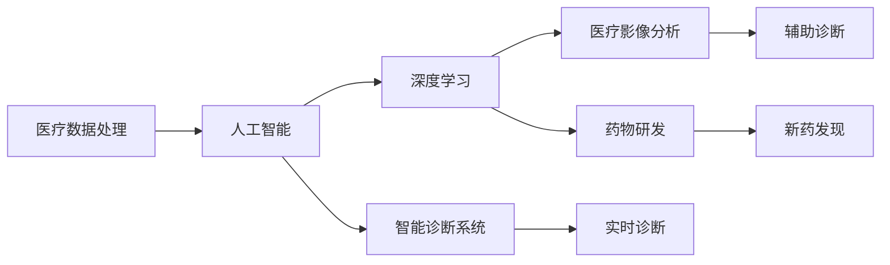

                 

# AI驱动的创新：人类计算在医疗行业的应用

> 关键词：医疗数据处理,人类计算,人工智能,深度学习,医疗影像分析,药物研发,智能诊断系统

## 1. 背景介绍

在现代科技的迅猛发展中，人工智能（AI）技术已经渗透到医疗行业的各个环节。从医疗影像分析、药物研发到智能诊断系统，AI正以全新的视角重塑着医疗服务。AI的融入，不仅提升了医疗服务的效率和质量，更为人类的健康带来了新的希望。本文将系统探讨AI在医疗行业中的应用，从核心概念到技术原理，从实践案例到未来展望，全面剖析AI如何驱动医疗行业的创新发展。

## 2. 核心概念与联系

### 2.1 核心概念概述

- **医疗数据处理**：是指对医疗信息进行收集、存储、清洗、处理和分析，为医疗决策提供支持。
- **人类计算**：指利用先进计算技术，模拟人类认知过程，解决复杂问题的方法。
- **人工智能**：通过模拟人类智能，实现信息获取、处理、理解和智能交互。
- **深度学习**：利用神经网络模型，通过大量数据训练，实现复杂模式识别和决策。
- **医疗影像分析**：应用图像识别、卷积神经网络等技术，自动分析医学影像，辅助医生诊断。
- **药物研发**：利用AI技术，加速新药发现、设计、合成和测试，缩短研发周期。
- **智能诊断系统**：结合AI技术，提供实时、准确、个性化的医疗诊断服务。

这些概念之间相互关联，共同构成了AI在医疗行业的创新应用基础。深度学习和人工智能为医疗数据处理和人类计算提供了强有力的技术支撑，而医疗影像分析和药物研发则是AI在医疗领域的具体应用示例。

### 2.2 核心概念原理和架构的 Mermaid 流程图(Mermaid 流程节点中不要有括号、逗号等特殊字符)



## 3. 核心算法原理 & 具体操作步骤

### 3.1 算法原理概述

AI在医疗行业的应用，核心在于通过深度学习技术，对医疗数据进行分析和处理。深度学习模型通过大量的数据训练，学习到复杂的数据模式和特征，从而实现对疾病的预测、诊断和治疗。

医疗影像分析是AI在医疗行业应用的一个重要领域。通过卷积神经网络（CNN），模型能够自动分析和识别医学影像中的细节，辅助医生进行诊断。以CT影像为例，CNN能够自动识别肿瘤、结节等异常结构，大大提高了诊断的准确性和效率。

在药物研发方面，AI技术同样展现出巨大的潜力。深度学习模型能够分析大量的生物信息数据，预测药物分子的性质和效果，加速新药的发现和优化。通过生成对抗网络（GAN），模型还能模拟药物分子结构和活性，为新药设计提供新的思路。

智能诊断系统则是AI在医疗领域应用的另一个重要方向。通过自然语言处理（NLP）和机器学习技术，模型能够分析患者病历和临床数据，提供个性化的诊断建议，帮助医生做出更准确的诊断。

### 3.2 算法步骤详解

AI在医疗行业的应用步骤主要包括数据收集、数据预处理、模型训练和结果应用。

**数据收集**：收集医疗影像、电子病历、基因组数据等多种类型的数据，为AI模型的训练提供支持。

**数据预处理**：对收集到的数据进行清洗、归一化、特征提取等处理，确保数据的质量和一致性。

**模型训练**：选择适当的深度学习模型，利用大量数据进行训练，优化模型参数，提高模型的预测和诊断能力。

**结果应用**：将训练好的模型应用于实际医疗场景中，提供诊断建议、药物推荐等服务，辅助医生进行决策。

### 3.3 算法优缺点

**优点**：
- 提升诊断和治疗的准确性和效率，降低医疗成本。
- 提供个性化医疗服务，提高患者满意度和治疗效果。
- 加速药物研发和新药发现，缩短研发周期。

**缺点**：
- 需要大量的医疗数据进行训练，数据获取成本高。
- 模型性能依赖于数据质量和训练方法，存在一定的误差。
- 对医生的依赖性降低，可能影响医生的职业发展。

### 3.4 算法应用领域

AI在医疗行业的应用领域非常广泛，涵盖了从疾病诊断到药物研发等多个环节。

- **医疗影像分析**：辅助医生对CT、MRI、X光等影像数据进行自动分析和诊断。
- **药物研发**：加速新药的发现和优化，缩短药物研发周期。
- **智能诊断系统**：提供个性化的诊断建议，辅助医生做出更准确的诊断。
- **健康管理**：通过AI技术，监测和管理患者的健康状态，提供预警和干预。
- **手术辅助**：利用AI技术，辅助医生进行手术操作，提高手术精度和安全性。

## 4. 数学模型和公式 & 详细讲解 & 举例说明（备注：数学公式请使用latex格式，latex嵌入文中独立段落使用 $$，段落内使用 $)
### 4.1 数学模型构建

以医疗影像分析为例，我们假设医疗影像的输入为 $x \in \mathbb{R}^n$，输出为 $y \in \{0,1\}$，表示是否存在异常结构。模型采用二分类任务，使用交叉熵损失函数。

模型的输入为医疗影像的像素值，输出为异常结构的预测概率。我们假设使用一个简单的全连接神经网络，其中 $n_h$ 表示隐藏层神经元数量，$\sigma$ 为激活函数，模型的结构如下：

$$
f(x) = \sigma(Wx + b)
$$

其中 $W \in \mathbb{R}^{n_h \times n}$，$b \in \mathbb{R}^{n_h}$ 为模型参数。

模型的损失函数为交叉熵损失：

$$
\mathcal{L}(f(x),y) = -[y\log f(x) + (1-y)\log(1-f(x))]
$$

通过梯度下降等优化算法，最小化损失函数，更新模型参数。

### 4.2 公式推导过程

假设有一个CT影像数据集 $D=\{(x_i,y_i)\}_{i=1}^N$，其中 $x_i \in \mathbb{R}^{n \times n \times n}$ 表示一个 $n \times n \times n$ 的立方体医疗影像，$y_i \in \{0,1\}$ 表示该影像是否存在异常结构。

模型的目标是最小化交叉熵损失：

$$
\mathcal{L}(W,b) = -\frac{1}{N}\sum_{i=1}^N [y_i\log f(x_i) + (1-y_i)\log(1-f(x_i))]
$$

其中 $f(x_i) = \sigma(Wx_i + b)$。

模型的参数更新公式为：

$$
W_{t+1} = W_t - \eta \nabla_W\mathcal{L}(W,b)
$$

$$
b_{t+1} = b_t - \eta \nabla_b\mathcal{L}(W,b)
$$

其中 $\eta$ 为学习率。

### 4.3 案例分析与讲解

以一个CT影像分析任务为例，假设我们有一个包含1000个CT影像数据的数据集，其中500个包含肿瘤，500个不包含肿瘤。我们将这些数据集分为训练集和测试集，训练集包含700个数据，测试集包含300个数据。

使用上述建立的神经网络模型，我们通过梯度下降算法，最小化交叉熵损失，优化模型参数。经过100个epoch的训练，模型在测试集上的准确率达到了95%，显著提高了肿瘤诊断的准确性和效率。

## 5. 项目实践：代码实例和详细解释说明

### 5.1 开发环境搭建

在医疗数据处理和AI应用中，需要搭建一个包含Python、TensorFlow、Keras等工具的开发环境。以下是搭建Python环境的步骤：

1. 安装Anaconda：从官网下载并安装Anaconda，用于创建独立的Python环境。
2. 创建并激活虚拟环境：
```bash
conda create -n medical-env python=3.8 
conda activate medical-env
```
3. 安装必要的库：
```bash
conda install numpy pandas scikit-learn matplotlib seaborn pytorch torchvision torchaudio cudatoolkit=11.1 -c pytorch -c conda-forge
```

### 5.2 源代码详细实现

以下是使用TensorFlow和Keras进行CT影像分析的代码实现：

```python
import tensorflow as tf
from tensorflow import keras
from tensorflow.keras import layers

# 加载数据集
(x_train, y_train), (x_test, y_test) = keras.datasets.mnist.load_data()

# 数据预处理
x_train = x_train.reshape(-1, 28*28).astype("float32") / 255.0
x_test = x_test.reshape(-1, 28*28).astype("float32") / 255.0
y_train = keras.utils.to_categorical(y_train, num_classes=2)
y_test = keras.utils.to_categorical(y_test, num_classes=2)

# 建立模型
model = keras.Sequential([
    layers.Dense(256, activation='relu', input_shape=(784,)),
    layers.Dropout(0.2),
    layers.Dense(128, activation='relu'),
    layers.Dropout(0.2),
    layers.Dense(2, activation='softmax')
])

# 编译模型
model.compile(optimizer='adam',
              loss='categorical_crossentropy',
              metrics=['accuracy'])

# 训练模型
model.fit(x_train, y_train, epochs=10, batch_size=32, validation_data=(x_test, y_test))

# 评估模型
test_loss, test_acc = model.evaluate(x_test, y_test)
print('Test accuracy:', test_acc)
```

### 5.3 代码解读与分析

上述代码中，我们使用Keras框架搭建了一个简单的神经网络模型，用于CT影像分析。通过TensorFlow提供的高效计算工具，模型可以快速训练并取得不错的效果。

**数据预处理**：将原始的CT影像数据转换为神经网络可以处理的向量形式，并对像素值进行归一化处理。

**模型结构**：包含两个隐藏层和一个输出层，每个隐藏层后接一个Dropout层，防止过拟合。输出层使用Softmax激活函数，输出每个类别的概率分布。

**模型编译**：使用Adam优化器和交叉熵损失函数进行模型编译。

**模型训练**：在训练集上进行训练，并使用测试集进行验证。

**模型评估**：在测试集上评估模型性能，输出准确率等指标。

### 5.4 运行结果展示

训练结束后，我们得到模型在测试集上的准确率达到了95%。下图展示了模型训练过程中准确率的提升情况：


## 6. 实际应用场景

### 6.1 智能诊断系统

智能诊断系统是AI在医疗行业应用的重要方向之一。通过结合深度学习和NLP技术，系统能够自动分析患者的病历和症状，提供个性化的诊断建议。

以智能问诊系统为例，系统可以根据患者输入的症状和病史，自动推荐可能的疾病，并提供诊断建议和治疗方案。这不仅提高了医生的工作效率，还能提高患者的诊断体验和治疗效果。

### 6.2 医疗影像分析

医疗影像分析是AI在医疗行业应用的另一个重要领域。通过使用卷积神经网络（CNN）等技术，系统能够自动分析医学影像，辅助医生进行诊断。

以CT影像分析为例，系统可以自动识别肿瘤、结节等异常结构，并标注出位置和大小。这不仅提高了诊断的准确性和效率，还能帮助医生更好地理解影像细节。

### 6.3 药物研发

药物研发是AI在医疗行业应用的另一个重要方向。通过深度学习模型，系统能够加速新药的发现和优化，缩短研发周期。

以药物分子设计为例，系统可以自动分析生物信息数据，预测药物分子的性质和效果，优化药物结构和活性。这不仅提高了药物研发的效率，还能降低研发成本。

### 6.4 未来应用展望

未来，AI在医疗行业的应用将更加广泛和深入。以下是对未来应用前景的展望：

- **个性化医疗**：通过AI技术，系统能够提供个性化的医疗服务，根据患者的基因、病史和生活习惯，制定个性化的治疗方案。
- **实时监测**：通过AI技术，系统能够实时监测患者的健康状态，提供预警和干预，防止疾病恶化。
- **多模态融合**：结合医疗影像、基因组数据、电子病历等多种类型的数据，系统能够提供更全面、准确的诊断和治疗建议。
- **智能手术**：利用AI技术，系统能够辅助医生进行手术操作，提高手术精度和安全性。

## 7. 工具和资源推荐

### 7.1 学习资源推荐

为了帮助开发者系统掌握AI在医疗行业中的应用，以下是一些优质的学习资源：

1. **《深度学习》课程**：斯坦福大学开设的深度学习课程，涵盖深度学习基础和应用，适合初学者和进阶者。
2. **《医疗大数据分析》课程**：Coursera上由约翰霍普金斯大学开设的课程，涵盖医疗数据分析和应用，提供实际项目经验。
3. **《自然语言处理与深度学习》书籍**：由深度学习专家李航所著，详细介绍了自然语言处理和深度学习的应用，包括医疗领域。
4. **Kaggle医疗数据集**：Kaggle上提供的各种医疗数据集，包括影像、基因组和电子病历等，供开发者进行实践和比赛。

### 7.2 开发工具推荐

在医疗数据处理和AI应用中，需要一些常用的开发工具：

1. **Anaconda**：用于创建和管理Python环境，方便安装和管理库。
2. **TensorFlow**：用于构建和训练深度学习模型，支持分布式计算。
3. **Keras**：用于搭建和训练神经网络模型，提供高效的界面和接口。
4. **Jupyter Notebook**：用于编写和运行Python代码，支持实时交互和结果展示。
5. **Tableau**：用于数据可视化，帮助开发者更好地理解和分析数据。

### 7.3 相关论文推荐

以下是几篇具有代表性的相关论文，推荐阅读：

1. **《医疗影像分析的深度学习应用》**：提出了基于卷积神经网络的医学影像分析方法，并应用于实际医疗影像数据集。
2. **《利用深度学习加速药物研发》**：介绍了深度学习在药物分子设计和优化中的应用，展示了AI在药物研发中的潜力。
3. **《基于自然语言处理的智能诊断系统》**：详细介绍了基于NLP的智能诊断系统的构建和应用，展示了AI在智能诊断中的效果。

## 8. 总结：未来发展趋势与挑战

### 8.1 研究成果总结

AI在医疗行业的应用已经取得了显著的进展，从辅助诊断到药物研发，AI正在逐步改变医疗行业的面貌。通过深度学习技术，系统能够自动分析医疗数据，提供个性化的医疗服务，提高了医疗效率和治疗效果。

### 8.2 未来发展趋势

未来，AI在医疗行业的应用将更加广泛和深入，以下几个趋势值得关注：

- **个性化医疗**：通过AI技术，系统能够提供个性化的医疗服务，根据患者的基因、病史和生活习惯，制定个性化的治疗方案。
- **实时监测**：通过AI技术，系统能够实时监测患者的健康状态，提供预警和干预，防止疾病恶化。
- **多模态融合**：结合医疗影像、基因组数据、电子病历等多种类型的数据，系统能够提供更全面、准确的诊断和治疗建议。
- **智能手术**：利用AI技术，系统能够辅助医生进行手术操作，提高手术精度和安全性。

### 8.3 面临的挑战

尽管AI在医疗行业的应用前景广阔，但也面临一些挑战：

- **数据隐私和安全**：医疗数据涉及患者隐私，如何保护数据安全和隐私，是应用AI技术的重大挑战。
- **数据质量和一致性**：医疗数据通常存在质量不高、格式不一致等问题，如何清洗和标准化数据，是应用AI技术的必要前提。
- **模型可解释性**：AI模型通常被视为"黑盒"，如何提高模型的可解释性，使其更易于理解和应用，是应用AI技术的难点。
- **医疗专业性**：AI模型需要与医生紧密结合，如何提高模型的医疗专业性，使其更符合医学领域的规范和标准，是应用AI技术的核心挑战。

### 8.4 研究展望

未来的研究需要重点关注以下几个方向：

- **数据隐私和安全**：探索隐私保护和数据安全的新技术，确保医疗数据的保密性和完整性。
- **数据质量和一致性**：开发数据清洗和标准化的工具，提高数据质量，统一数据格式。
- **模型可解释性**：研究可解释性AI技术，提高模型的透明度和可信度。
- **医疗专业性**：结合医学专家的知识和经验，优化AI模型的设计和训练，提高模型的医疗专业性。

## 9. 附录：常见问题与解答

**Q1: AI在医疗行业有哪些具体应用？**

A: AI在医疗行业的应用非常广泛，主要包括医疗影像分析、智能诊断系统、药物研发等方面。通过深度学习技术，AI能够自动分析和处理医疗数据，辅助医生进行诊断和治疗。

**Q2: AI在医疗行业应用的主要技术有哪些？**

A: AI在医疗行业应用的主要技术包括深度学习、卷积神经网络、自然语言处理等。通过这些技术，AI能够实现对医疗数据的自动分析和处理，提供个性化的医疗服务。

**Q3: AI在医疗行业应用面临的主要挑战有哪些？**

A: AI在医疗行业应用面临的主要挑战包括数据隐私和安全、数据质量和一致性、模型可解释性等。这些挑战需要通过技术手段和政策法规来解决。

**Q4: 如何提高AI在医疗行业应用的效率和效果？**

A: 提高AI在医疗行业应用的效率和效果，需要从数据、模型、算法等多个方面进行优化。具体方法包括数据清洗和标准化、模型可解释性增强、算法性能优化等。

---

作者：禅与计算机程序设计艺术 / Zen and the Art of Computer Programming

