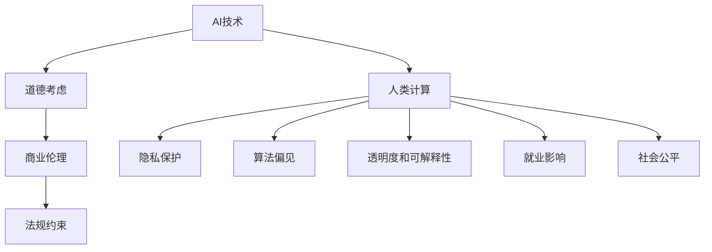

                 

# AI驱动的创新：人类计算在商业中的道德考虑因素总结

## 1. 背景介绍

### 1.1 问题由来

随着人工智能(AI)技术的快速发展和广泛应用，人类计算在商业中的角色和价值正在发生深刻变化。AI驱动的自动化、智能化技术，正在改变传统的商业模式，提高企业运营效率，创造新的商业价值。然而，在AI技术不断带来创新与变革的同时，也引发了一系列道德和伦理问题。这些问题不仅涉及技术本身，还触及人类社会的核心价值观念，如隐私保护、公平正义、就业影响等。因此，如何在推动AI技术创新的同时，兼顾道德考虑，确保其发展方向符合人类社会的长远利益，成为了一个亟待解决的重要课题。

### 1.2 问题核心关键点

AI技术在商业中的道德考虑，主要集中在以下几个核心关键点上：

- **隐私保护**：AI系统在处理大量数据时，如何确保用户隐私不被侵犯。
- **算法偏见**：AI模型在训练和应用过程中，如何避免因数据偏差导致的不公平问题。
- **透明度和可解释性**：AI决策过程如何变得更加透明，使用户能够理解和信任AI系统。
- **就业影响**：AI自动化取代人力对就业市场的影响，如何通过创新创造新的就业机会。
- **社会公平**：AI技术应用是否会加剧社会不平等，如何促进社会的包容性发展。

这些关键问题直接关系到AI技术的可持续发展与社会接受度，因此需要在技术创新与道德考量之间寻求平衡。

## 2. 核心概念与联系

### 2.1 核心概念概述

为更好地理解AI技术在商业中的道德考虑因素，本节将介绍几个密切相关的核心概念：

- **AI技术**：包括机器学习、深度学习、自然语言处理、计算机视觉等，是推动商业创新的重要力量。
- **人类计算**：指利用AI技术对人类工作进行自动化和智能化处理，提高生产效率和决策质量。
- **道德考虑**：涉及隐私、公平、透明、责任等伦理问题，是人类社会对AI技术的期望和要求。
- **商业伦理**：企业在使用AI技术时，应遵循的商业道德规范和社会责任。
- **法规约束**：各国政府和国际组织为规范AI技术应用，制定的法律法规和指导原则。

这些核心概念之间的逻辑关系可以通过以下Mermaid流程图来展示：



这个流程图展示了AI技术、人类计算与道德、商业伦理、法规约束之间的联系。其中，隐私保护、算法偏见、透明度和可解释性、就业影响、社会公平等道德考虑，是在不同层面上对AI技术的约束和指导。

## 3. 核心算法原理 & 具体操作步骤

### 3.1 算法原理概述

AI技术在商业中的应用，通常包括数据收集、模型训练、预测分析等步骤。这些步骤不仅需要技术上的支持，还需要在道德层面上进行严格审查和指导。以下是AI技术在商业中的核心算法原理和具体操作步骤：

- **数据收集**：通过网络爬虫、用户交互、传感器等多种方式，收集大量数据，为模型训练提供原始材料。
- **模型训练**：利用机器学习算法，从数据中学习规律和知识，构建预测模型。
- **预测分析**：使用训练好的模型，对新数据进行分析和预测，辅助商业决策。

### 3.2 算法步骤详解

AI技术在商业中的应用，主要包括以下几个关键步骤：

**Step 1: 数据准备**
- 确保数据来源合法、合规，避免侵犯用户隐私。
- 对数据进行清洗和预处理，确保数据质量和一致性。
- 设置数据访问权限，确保数据仅在授权范围内使用。

**Step 2: 模型选择与训练**
- 选择合适的算法和模型架构，确保模型的准确性和泛化能力。
- 在训练过程中，确保模型避免数据偏差，避免算法偏见。
- 设置合理的训练参数，如学习率、迭代次数等，优化模型性能。

**Step 3: 预测分析**
- 使用训练好的模型，对新数据进行分析和预测。
- 确保预测过程的透明性和可解释性，使用户能够理解和信任模型输出。
- 定期评估模型性能，及时调整和优化模型。

### 3.3 算法优缺点

AI技术在商业中的应用，具有以下优点：

- **提高效率**：自动化处理大量数据和复杂任务，提高工作效率。
- **降低成本**：减少人力成本，提高资源利用效率。
- **创新能力**：通过数据分析和模型预测，发现新的商业机会和趋势。

同时，也存在以下缺点：

- **数据隐私**：处理大量数据时，如何保护用户隐私和数据安全。
- **算法偏见**：模型训练数据可能存在偏差，导致输出结果不公平。
- **透明度不足**：AI决策过程黑箱化，难以理解和解释。
- **就业冲击**：自动化取代人力，可能导致就业结构变化。
- **社会公平**：技术应用可能加剧社会不平等，需要关注社会公平问题。

### 3.4 算法应用领域

AI技术在商业中的应用领域非常广泛，以下是几个典型的应用场景：

- **金融科技**：利用AI技术进行风险评估、欺诈检测、信用评分等。
- **电子商务**：通过推荐系统、搜索排序、客户服务等方面提升用户体验。
- **医疗健康**：利用AI技术进行疾病诊断、患者管理、医疗影像分析等。
- **制造业**：通过智能制造、质量控制、供应链管理等提高生产效率。
- **人力资源**：在招聘、培训、绩效评估等方面提供智能化支持。

这些应用领域展示了AI技术在商业中的强大潜力和广泛前景，但也带来了相应的道德和伦理挑战。

## 4. 数学模型和公式 & 详细讲解 & 举例说明

### 4.1 数学模型构建

AI技术在商业中的应用，通常涉及数据科学和统计学等数学模型。以下是几个典型的数学模型构建示例：

- **线性回归模型**：用于预测连续型变量，公式为 $y = \beta_0 + \beta_1x_1 + \beta_2x_2 + \ldots + \beta_nx_n + \epsilon$。
- **决策树模型**：用于分类和预测，通过树形结构展示决策规则，公式为 $T(x) = \text{if} \ x_j < T_j \ \text{then} \ T_j\text{左分支；} \ \text{else} \ T_j\text{右分支}$。
- **神经网络模型**：用于复杂数据处理和模式识别，公式为 $f(x) = \sum_{i=1}^n w_ix_i + b$。

### 4.2 公式推导过程

以线性回归模型为例，推导其预测公式和损失函数：

- **预测公式**：$y = \beta_0 + \beta_1x_1 + \beta_2x_2 + \ldots + \beta_nx_n + \epsilon$。
- **损失函数**：$L(y, \hat{y}) = \frac{1}{2}\sum_{i=1}^m (y_i - \hat{y}_i)^2$。

其中，$y$ 为真实标签，$\hat{y}$ 为模型预测值，$\epsilon$ 为误差项，$m$ 为样本数。

### 4.3 案例分析与讲解

以金融科技中的信用评分模型为例，分析其道德考量因素：

- **数据隐私**：模型需要大量个人信用数据，如何保护用户隐私。
- **算法偏见**：模型可能因历史数据偏差，对某些群体不公平。
- **透明度**：模型的评分标准和预测过程应透明，让用户理解和信任。
- **就业影响**：自动化审核可能导致部分岗位消失，如何创造新的就业机会。
- **社会公平**：评分模型可能加剧贫富差距，如何促进社会公平。

## 5. 项目实践：代码实例和详细解释说明

### 5.1 开发环境搭建

在进行AI项目开发前，需要先搭建好开发环境。以下是使用Python进行TensorFlow开发的配置流程：

1. 安装Anaconda：从官网下载并安装Anaconda，用于创建独立的Python环境。

2. 创建并激活虚拟环境：
```bash
conda create -n tf-env python=3.8 
conda activate tf-env
```

3. 安装TensorFlow：根据CUDA版本，从官网获取对应的安装命令。例如：
```bash
pip install tensorflow==2.7.0
```

4. 安装Pandas、NumPy等库：
```bash
pip install pandas numpy scikit-learn
```

完成上述步骤后，即可在`tf-env`环境中开始AI项目的开发。

### 5.2 源代码详细实现

这里我们以信用评分模型为例，给出使用TensorFlow进行AI模型开发的完整代码实现。

首先，定义信用评分问题的数据处理函数：

```python
import pandas as pd
import numpy as np
from tensorflow.keras import layers, models
from sklearn.model_selection import train_test_split

def load_data():
    df = pd.read_csv('credit_data.csv')
    X = df.drop('default', axis=1).values
    y = df['default'].values
    return train_test_split(X, y, test_size=0.2, random_state=42)

# 数据预处理
def preprocess_data(X_train, X_test, y_train, y_test):
    X_train = (X_train - X_train.mean()) / X_train.std()
    X_test = (X_test - X_train.mean()) / X_train.std()
    return X_train, X_test, y_train, y_test

# 模型定义
def create_model(input_dim):
    model = models.Sequential([
        layers.Dense(64, activation='relu', input_shape=(input_dim,)),
        layers.Dense(1, activation='sigmoid')
    ])
    model.compile(optimizer='adam', loss='binary_crossentropy', metrics=['accuracy'])
    return model

# 模型训练和评估
def train_and_evaluate(model, X_train, X_test, y_train, y_test):
    model.fit(X_train, y_train, epochs=10, batch_size=32, verbose=1)
    score = model.evaluate(X_test, y_test, verbose=0)
    print(f'Test loss: {score[0]:.4f}, Test accuracy: {score[1]:.4f}')
```

然后，调用上述函数进行模型训练和评估：

```python
X_train, X_test, y_train, y_test = load_data()

input_dim = X_train.shape[1]
model = create_model(input_dim)
train_and_evaluate(model, X_train, X_test, y_train, y_test)
```

以上就是使用TensorFlow进行信用评分模型开发的完整代码实现。可以看到，通过TensorFlow的高级API，可以非常方便地构建、训练和评估AI模型。

### 5.3 代码解读与分析

让我们再详细解读一下关键代码的实现细节：

**load_data函数**：
- 从CSV文件中加载信用评分数据，并使用sklearn的train_test_split进行数据划分。

**preprocess_data函数**：
- 对数据进行标准化处理，确保模型能够稳定收敛。

**create_model函数**：
- 定义一个包含两个全连接层的神经网络模型，使用relu激活函数和sigmoid输出层，适合二分类问题。
- 使用adam优化器和binary_crossentropy损失函数进行模型训练。

**train_and_evaluate函数**：
- 在训练集上训练模型，并在测试集上进行评估。

**train_and_evaluate函数**：
- 在测试集上输出模型的损失和准确率，评估模型性能。

可以看到，TensorFlow提供了丰富的API和工具，使得AI模型的构建和训练变得更加简便和高效。开发者可以专注于模型设计和优化，而不必过多关注底层实现细节。

当然，工业级的系统实现还需考虑更多因素，如模型的保存和部署、超参数的自动搜索、更灵活的任务适配层等。但核心的AI模型开发流程基本与此类似。

## 6. 实际应用场景

### 6.1 金融科技

AI在金融科技中的应用，可以显著提升金融机构的运营效率和风险管理能力。以下是几个典型的应用场景：

- **信用评分**：利用AI模型评估个人信用风险，快速审核贷款申请。
- **欺诈检测**：使用AI模型监测交易行为，及时发现和防范欺诈行为。
- **投资策略**：通过AI模型分析市场数据，制定投资策略，优化投资组合。

这些应用场景展示了AI技术在金融领域的强大潜力和广泛前景，但也带来了相应的道德和伦理挑战。

### 6.2 电子商务

AI在电子商务中的应用，可以提升用户体验，优化商品推荐和库存管理。以下是几个典型的应用场景：

- **推荐系统**：通过用户行为数据和商品属性，推荐个性化商品。
- **库存管理**：预测商品需求，优化库存水平，减少库存成本。
- **客户服务**：使用AI驱动的聊天机器人，提供24小时客户服务。

这些应用场景展示了AI技术在电子商务领域的强大潜力和广泛前景，但也带来了相应的道德和伦理挑战。

### 6.3 医疗健康

AI在医疗健康中的应用，可以辅助医生诊断和治疗，提高医疗服务质量。以下是几个典型的应用场景：

- **影像分析**：利用AI模型分析医学影像，辅助医生诊断疾病。
- **患者管理**：通过AI模型监测患者健康状况，提供个性化医疗建议。
- **药物研发**：使用AI模型分析药物效果，加速新药开发进程。

这些应用场景展示了AI技术在医疗健康领域的强大潜力和广泛前景，但也带来了相应的道德和伦理挑战。

### 6.4 未来应用展望

随着AI技术的发展和普及，其在商业中的应用将更加广泛和深入。未来，AI技术将在更多领域带来创新和变革，如智能制造、智慧城市、智能交通等。这些领域的AI应用，将进一步推动社会生产力的提升，改善人们的生活质量。

## 7. 工具和资源推荐

### 7.1 学习资源推荐

为了帮助开发者系统掌握AI技术在商业中的应用，这里推荐一些优质的学习资源：

1. 《深度学习》系列书籍：由人工智能领域的知名专家撰写，全面介绍了深度学习的基本概念和算法。
2. 《机器学习实战》书籍：提供了丰富的实践案例和代码实现，适合入门学习和项目实践。
3. TensorFlow官方文档：详细介绍了TensorFlow的API和工具，适合深入学习和开发。
4. Kaggle：提供了大量的数据集和竞赛平台，适合数据分析和模型训练。
5. Coursera、edX等在线学习平台：提供了AI相关的课程和项目，适合系统学习。

通过对这些资源的学习实践，相信你一定能够快速掌握AI技术在商业中的应用，并用于解决实际的商业问题。

### 7.2 开发工具推荐

高效的开发离不开优秀的工具支持。以下是几款用于AI技术在商业中应用开发的常用工具：

1. TensorFlow：由Google主导开发的开源深度学习框架，生产部署方便，适合大规模工程应用。
2. PyTorch：基于Python的开源深度学习框架，灵活动态的计算图，适合快速迭代研究。
3. Scikit-learn：提供了多种机器学习算法，适合数据科学项目开发。
4. Apache Spark：支持大规模数据处理和机器学习，适合大数据应用。
5. Jupyter Notebook：免费的开源Jupyter环境，支持Python和R等多种编程语言。

合理利用这些工具，可以显著提升AI技术在商业中的开发效率，加快创新迭代的步伐。

### 7.3 相关论文推荐

AI技术在商业中的应用，需要不断借鉴和吸收最新的研究成果。以下是几篇奠基性的相关论文，推荐阅读：

1. "Deep Learning" by Ian Goodfellow et al.：介绍了深度学习的基本概念和算法，适合入门学习。
2. "Pattern Recognition and Machine Learning" by Christopher Bishop：介绍了机器学习的基本理论和应用，适合系统学习。
3. "Neural Network Models" by Geoffrey Hinton et al.：介绍了神经网络的基本模型和算法，适合深入研究。
4. "AI and Society" by Martin Kushner et al.：探讨了AI技术对社会的影响，适合理解AI的伦理和道德问题。
5. "Deep Learning and Neuroscience" by Terry Sejnowski et al.：探讨了深度学习与神经科学的联系，适合深入理解AI的认知机制。

这些论文代表了大规模AI技术在商业中的应用和伦理问题的发展脉络，通过学习这些前沿成果，可以帮助研究者把握学科前进方向，激发更多的创新灵感。

## 8. 总结：未来发展趋势与挑战

### 8.1 研究成果总结

AI技术在商业中的应用，正在推动各行各业的创新和变革。从金融、电子商务、医疗健康到智能制造、智慧城市等，AI技术正在全面渗透到人类社会各个领域，带来巨大的商业价值和社会效益。然而，在推动AI技术创新的同时，也必须高度重视其带来的道德和伦理问题。这些问题不仅关系到技术本身，更触及人类社会的核心价值观念，如隐私保护、公平正义、就业影响等。

### 8.2 未来发展趋势

展望未来，AI技术在商业中的应用将呈现以下几个发展趋势：

- **深度融合**：AI技术与各行业的深度融合，将带来更加智能化、自动化的解决方案。
- **普惠普及**：AI技术的普及，将使得更多的中小型企业能够享受到AI带来的商业价值。
- **跨领域应用**：AI技术将在更多领域带来创新和变革，如智能制造、智慧城市、智能交通等。
- **伦理考量**：AI技术的伦理和道德问题将成为行业关注的重点，推动技术可持续发展。
- **全球合作**：AI技术的全球合作与交流，将推动技术的普惠和应用。

### 8.3 面临的挑战

尽管AI技术在商业中的应用前景广阔，但在实际落地过程中，仍面临诸多挑战：

- **数据隐私**：处理大量数据时，如何保护用户隐私和数据安全。
- **算法偏见**：模型训练数据可能存在偏差，导致输出结果不公平。
- **透明度不足**：AI决策过程黑箱化，难以理解和解释。
- **就业冲击**：自动化取代人力，可能导致就业结构变化。
- **社会公平**：技术应用可能加剧社会不平等，需要关注社会公平问题。

### 8.4 研究展望

未来的研究需要在以下几个方面寻求新的突破：

- **隐私保护**：开发更加安全和透明的隐私保护技术，确保用户数据安全。
- **算法公平**：研究如何消除算法偏见，构建更加公平的AI系统。
- **可解释性**：提升AI决策过程的可解释性，增强用户信任。
- **普惠技术**：推动AI技术的普惠普及，使得更多人能够享受AI带来的好处。
- **社会责任**：明确AI技术的社会责任，推动技术可持续发展。

这些研究方向将引领AI技术在商业中的应用，为构建安全、可靠、可解释、可控的智能系统铺平道路。面向未来，AI技术需要在技术创新与道德考量之间寻求平衡，推动技术与社会的和谐发展。

## 9. 附录：常见问题与解答

**Q1：AI技术在商业中如何保障用户隐私？**

A: AI技术在商业中的应用，需遵守相关的隐私保护法律法规，如GDPR、CCPA等。具体措施包括：
- 数据匿名化：对用户数据进行脱敏处理，去除可识别信息。
- 访问控制：设置严格的权限管理，确保数据仅在授权范围内使用。
- 数据加密：对存储和传输的数据进行加密，防止数据泄露。
- 隐私审计：定期进行隐私审计，确保数据处理过程合规。

**Q2：AI技术在商业中如何避免算法偏见？**

A: 避免算法偏见，需要从数据和算法两个层面进行优化：
- 数据层面：确保数据集的多样性和代表性，避免数据偏差。
- 算法层面：采用公平性约束和正则化技术，如均值差分、代价敏感学习等，确保算法输出公平。

**Q3：AI技术在商业中如何提升透明度和可解释性？**

A: 提升透明度和可解释性，需要从模型设计和输出展示两个层面进行优化：
- 模型设计：使用可解释性更高的模型架构，如决策树、逻辑回归等，便于解释。
- 输出展示：提供可视化结果和解释，使用户能够理解和信任AI系统。

**Q4：AI技术在商业中如何缓解就业冲击？**

A: 缓解就业冲击，需要从就业替代和创造新岗位两个层面进行优化：
- 就业替代：通过培训和教育，提升员工技能，适应新岗位要求。
- 创造新岗位：利用AI技术创新，创造新的就业机会，如数据分析、AI开发等。

**Q5：AI技术在商业中如何促进社会公平？**

A: 促进社会公平，需要从技术设计和政策引导两个层面进行优化：
- 技术设计：构建公平的AI系统，避免因技术应用加剧社会不平等。
- 政策引导：制定公平的政策，确保技术应用符合社会价值观和伦理要求。

这些问题的解答展示了AI技术在商业中的道德考虑因素，强调了技术创新与社会责任之间的平衡，有助于推动AI技术的健康发展。

