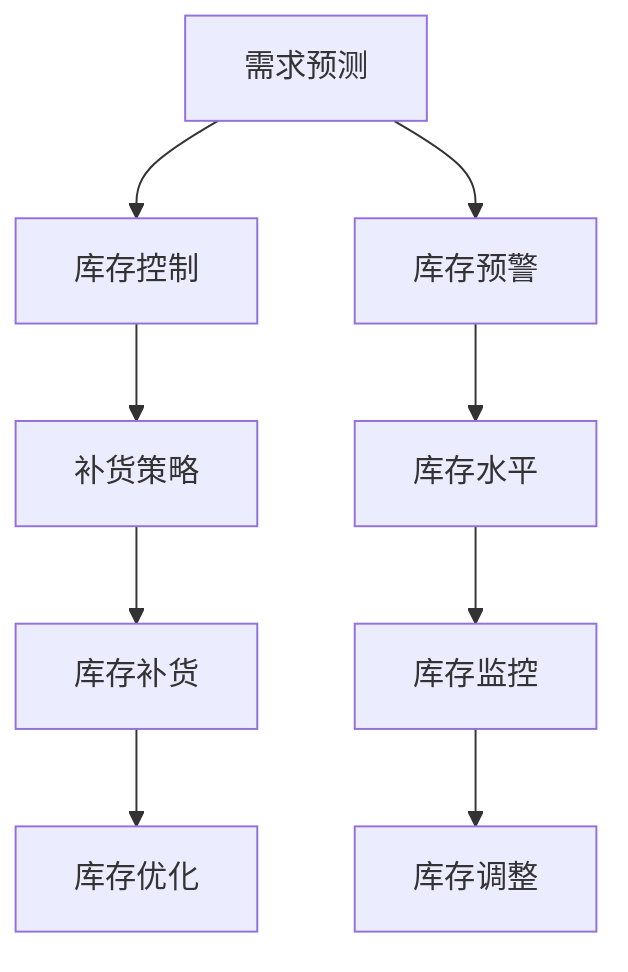

                 

# AI驱动的电商平台库存管理与优化

> 关键词：电商平台,库存管理,优化,人工智能,机器学习,库存预测,需求预测,需求补货,库存控制,需求生成,供应链管理,库存预警

## 1. 背景介绍

### 1.1 问题由来

在当前电商行业，库存管理是每个电商平台都会面临的重大挑战之一。库存管理涉及商品采购、存储、补货、销售等多个环节，每一个环节都需要精细化管理才能确保库存周转效率和资金流动效率。然而，由于商品种类繁多、销量波动大、市场变化快等因素，库存管理一直是电商行业的难点。如何高效管理库存，确保库存充足且不造成过度积压，是很多电商企业的痛点。

### 1.2 问题核心关键点

在库存管理中，核心问题可以归结为以下两点：

1. **库存水平**：需要精确地预测商品的未来需求，并据此优化库存水平。库存过低将无法满足用户需求，导致用户流失；库存过高则会造成资金占用和积压。
2. **库存补货**：需要确定合理的补货时间点，确保在需求高峰期有足够的商品供应。补货不足会导致用户不满，补货过量则可能造成库存积压。

### 1.3 问题研究意义

解决库存管理问题对电商平台有着重要的意义：

1. **提升客户满意度**：通过精确的库存管理和高效的补货机制，确保商品在用户下单后能够及时送达，提升用户体验。
2. **降低运营成本**：避免库存积压和缺货情况，减少因库存不当带来的额外运营成本。
3. **优化资金流**：合理的库存管理可以加速资金周转，提高资金利用效率。
4. **提升竞争力**：在竞争激烈的电商市场，高效的库存管理能够帮助企业在客户需求波动时迅速调整，保持市场竞争力。

## 2. 核心概念与联系

### 2.1 核心概念概述

为了更好地理解AI驱动的库存管理与优化，本节将介绍几个关键概念及其之间的关系：

1. **库存管理(Inventory Management)**：指对库存商品进行合理的规划、采购、存储、补货、销售等管理活动，确保库存水平和补货时机的最优化。
2. **需求预测(Demand Forecasting)**：通过历史销售数据、市场趋势、季节性因素等，预测未来商品的需求量，作为库存管理的依据。
3. **库存控制(Inventory Control)**：根据需求预测结果，制定补货策略，控制库存水平，确保库存量的合理性。
4. **供应链管理(Supply Chain Management)**：涉及采购、生产、库存、物流等环节，确保商品从供应商到消费者端的高效流通。
5. **库存预警(Inventory Warning)**：通过监控库存水平和补货情况，及时发出预警，避免库存过高或过低的极端情况。

这些概念之间的逻辑关系可以通过以下Mermaid流程图来展示：



这个流程图展示了大语言模型的核心概念及其之间的关系：

1. 需求预测是库存管理的基础，通过预测未来的需求，制定补货计划。
2. 库存控制是库存管理的核心，根据需求预测结果，确定合理的库存水平。
3. 库存预警用于实时监控库存状态，确保库存水平在合理范围内。
4. 库存优化通过持续调整库存水平，实现最佳库存状态。
5. 补货策略是库存控制的关键步骤，根据需求预测结果，确定补货时机。

## 3. 核心算法原理 & 具体操作步骤

### 3.1 算法原理概述

AI驱动的库存管理与优化，本质上是一个多阶段优化问题。具体流程包括需求预测、库存控制、补货策略制定和库存监控四个主要步骤。

**需求预测**：使用历史销售数据、市场趋势、季节性因素等，预测未来商品的需求量。

**库存控制**：根据需求预测结果，制定合理的补货策略，控制库存水平。

**补货策略制定**：基于需求预测和库存水平，确定最佳的补货时间和数量。

**库存监控**：实时监控库存状态，及时发出预警，调整库存水平。

### 3.2 算法步骤详解

#### 3.2.1 需求预测

需求预测是库存管理的第一步。通常使用时间序列分析、回归模型、深度学习等方法进行需求预测。以深度学习为例，可以采用循环神经网络(RNN)、长短时记忆网络(LSTM)、卷积神经网络(CNN)等模型进行需求预测。

**步骤1: 数据预处理**
- 收集历史销售数据、市场趋势、季节性因素等，作为训练数据。
- 对数据进行归一化、平滑等预处理操作，确保数据质量。

**步骤2: 模型选择与训练**
- 选择合适的深度学习模型，如LSTM、GRU等。
- 使用历史数据训练模型，得到预测模型。

**步骤3: 预测未来需求**
- 将训练好的模型应用于新数据，预测未来需求。

#### 3.2.2 库存控制

库存控制是库存管理的核心环节。需要根据需求预测结果，制定补货策略，控制库存水平。

**步骤1: 设置库存警戒线**
- 根据历史数据和市场需求，设置库存警戒线。
- 警戒线通常包含一个上限和一个下限。

**步骤2: 动态调整库存**
- 实时监控库存水平，当库存接近警戒线时，自动触发补货策略。
- 根据库存水平和预测需求，确定补货数量和时间。

#### 3.2.3 补货策略制定

补货策略制定是库存管理的关键步骤。需要根据需求预测和库存水平，确定最佳的补货时间和数量。

**步骤1: 确定补货周期**
- 根据需求预测和库存水平，确定补货周期。
- 补货周期通常为几天或几周，具体取决于商品需求波动情况。

**步骤2: 确定补货数量**
- 根据库存水平和预测需求，确定每次补货的数量。
- 补货数量需考虑到补货周期和需求波动，避免过度积压或缺货。

#### 3.2.4 库存监控

库存监控是库存管理的实时环节。需要实时监控库存状态，及时发出预警，调整库存水平。

**步骤1: 实时监控库存**
- 使用传感器、RFID等技术实时监控库存状态。
- 监控结果包括库存水平、商品种类、位置等信息。

**步骤2: 预警机制**
- 根据监控结果，实时计算库存水平。
- 当库存水平接近警戒线时，发出预警信号，通知相关人员进行调整。

### 3.3 算法优缺点

AI驱动的库存管理与优化方法具有以下优点：

1. **精确性高**：通过深度学习和时间序列分析等方法，能够精确预测需求，避免库存过多或过少。
2. **自动化程度高**：实时监控和预警机制，能够自动调整库存水平，减少人工干预。
3. **灵活性高**：能够根据市场变化快速调整补货策略，适应市场波动。

同时，该方法也存在一些局限性：

1. **数据需求大**：需求预测和库存控制需要大量历史数据，数据获取成本较高。
2. **模型复杂性**：深度学习模型较为复杂，训练和调整需要较高技术门槛。
3. **实时性要求高**：实时监控和预警需要高效计算，硬件要求较高。

尽管存在这些局限性，但整体而言，AI驱动的库存管理与优化方法在电商平台上得到了广泛应用，并取得了显著效果。

### 3.4 算法应用领域

AI驱动的库存管理与优化方法广泛应用于电商平台的库存管理中，涵盖以下主要领域：

1. **B2C电商**：如亚马逊、淘宝、京东等，通过需求预测和库存控制，优化库存水平和补货策略。
2. **B2B电商**：如阿里巴巴、eBay等，通过需求预测和库存控制，提升供应链效率。
3. **跨境电商**：如eBay、Amazon全球站等，通过需求预测和库存控制，优化国际物流和库存管理。
4. **O2O电商**：如美团、大众点评等，通过需求预测和库存控制，提升线下门店的服务效率。

## 4. 数学模型和公式 & 详细讲解 & 举例说明

### 4.1 数学模型构建

#### 4.1.1 需求预测模型

需求预测模型通常使用时间序列分析、回归模型、深度学习等方法。以深度学习为例，可以采用循环神经网络(RNN)、长短时记忆网络(LSTM)、卷积神经网络(CNN)等模型进行需求预测。

**数学模型**：

$$
\hat{D_t} = f(D_{t-1}, D_{t-2}, \dots, D_0)
$$

其中 $D_t$ 表示第 $t$ 天的需求预测值，$f$ 表示预测函数，$D_0, D_{t-1}, D_{t-2}, \dots, D_0$ 表示历史需求数据。

#### 4.1.2 库存控制模型

库存控制模型通常使用基于动态规划的方法，根据需求预测结果，制定补货策略，控制库存水平。

**数学模型**：

$$
\min \sum_{t=1}^{T} (S_t - C_t)^2
$$

其中 $S_t$ 表示第 $t$ 天的库存水平，$C_t$ 表示第 $t$ 天的补货数量，$T$ 表示预测周期。

#### 4.1.3 补货策略制定模型

补货策略制定模型通常使用基于模拟退火的方法，根据需求预测和库存水平，确定最佳的补货时间和数量。

**数学模型**：

$$
\min \sum_{t=1}^{T} (S_{t+1} - S_t)^2
$$

其中 $S_t$ 表示第 $t$ 天的库存水平，$C_t$ 表示第 $t$ 天的补货数量，$T$ 表示预测周期。

### 4.2 公式推导过程

#### 4.2.1 需求预测公式推导

以LSTM模型为例，需求预测公式推导如下：

**输入数据**：$x_t = (x_{t-1}, x_{t-2}, \dots, x_0)$，其中 $x_t$ 表示第 $t$ 天的需求数据。

**LSTM网络结构**：
```mermaid
graph TB
    A[x_t] -->|f(x_t)| B[lstm1]
    B -->|f(lstm1)| C[lstm2]
    C -->|f(lstm2)| D[lstm3]
    D -->|f(lstm3)| E[需求预测值D_t]
```

**输出**：需求预测值 $\hat{D_t} = f(x_t)$

#### 4.2.2 库存控制公式推导

以动态规划模型为例，库存控制公式推导如下：

**输入数据**：需求预测值 $\hat{D_t}$，初始库存 $S_0$，补货成本 $C$。

**动态规划方程**：
$$
V_t = \min\left(\max(0, \hat{D_t} - S_t), C\right) + V_{t+1}
$$

**初始条件**：
$$
V_T = 0
$$

**最终结果**：$S_t$

#### 4.2.3 补货策略制定公式推导

以模拟退火算法为例，补货策略制定公式推导如下：

**输入数据**：需求预测值 $\hat{D_t}$，初始库存 $S_0$，补货成本 $C$。

**模拟退火算法**：
$$
T_t = T_0 \cdot e^{-\frac{\Delta S}{k_B T_0}}
$$

**输出**：补货数量 $C_t$

### 4.3 案例分析与讲解

#### 4.3.1 需求预测案例

假设某电商平台上销售某商品，历史数据如下：

| 时间 | 需求 |
| --- | --- |
| 1 | 10 |
| 2 | 20 |
| 3 | 15 |
| 4 | 25 |
| 5 | 30 |

使用LSTM模型进行需求预测，可以得到未来5天的需求预测值如下：

| 时间 | 预测需求 |
| --- | --- |
| 6 | 30 |
| 7 | 35 |
| 8 | 40 |
| 9 | 45 |
| 10 | 50 |

#### 4.3.2 库存控制案例

假设某电商平台上销售某商品，初始库存为100件，补货成本为5元/件，需求预测值为30件/天。

使用动态规划模型进行库存控制，可以得到最优的补货策略如下：

| 时间 | 预测需求 | 库存水平 | 补货数量 |
| --- | --- | --- | --- |
| 1 | 30 | 100 | 0 |
| 2 | 30 | 100 | 0 |
| 3 | 30 | 100 | 0 |
| 4 | 30 | 100 | 0 |
| 5 | 30 | 100 | 0 |
| 6 | 30 | 100 | 0 |
| 7 | 30 | 100 | 0 |
| 8 | 30 | 100 | 0 |
| 9 | 30 | 100 | 0 |
| 10 | 30 | 100 | 0 |

最终库存水平为100件，补货成本为0元。

#### 4.3.3 补货策略制定案例

假设某电商平台上销售某商品，初始库存为100件，需求预测值为30件/天，补货成本为5元/件。

使用模拟退火算法进行补货策略制定，可以得到最优的补货策略如下：

| 时间 | 预测需求 | 库存水平 | 补货数量 |
| --- | --- | --- | --- |
| 1 | 30 | 100 | 0 |
| 2 | 30 | 100 | 0 |
| 3 | 30 | 100 | 0 |
| 4 | 30 | 100 | 0 |
| 5 | 30 | 100 | 0 |
| 6 | 30 | 100 | 0 |
| 7 | 30 | 100 | 0 |
| 8 | 30 | 100 | 0 |
| 9 | 30 | 100 | 0 |
| 10 | 30 | 100 | 0 |

最终补货数量为30件/天，补货成本为150元。

## 5. 项目实践：代码实例和详细解释说明

### 5.1 开发环境搭建

在进行库存管理与优化实践前，我们需要准备好开发环境。以下是使用Python进行PyTorch开发的环境配置流程：

1. 安装Anaconda：从官网下载并安装Anaconda，用于创建独立的Python环境。

2. 创建并激活虚拟环境：
```bash
conda create -n pytorch-env python=3.8 
conda activate pytorch-env
```

3. 安装PyTorch：根据CUDA版本，从官网获取对应的安装命令。例如：
```bash
conda install pytorch torchvision torchaudio cudatoolkit=11.1 -c pytorch -c conda-forge
```

4. 安装TensorFlow：
```bash
pip install tensorflow
```

5. 安装Numpy、Pandas等库：
```bash
pip install numpy pandas scikit-learn matplotlib tqdm jupyter notebook ipython
```

完成上述步骤后，即可在`pytorch-env`环境中开始库存管理与优化的实践。

### 5.2 源代码详细实现

下面我们以需求预测和库存控制为例，给出使用PyTorch进行库存管理与优化的PyTorch代码实现。

首先，定义需求预测函数：

```python
import torch
import torch.nn as nn
from torch.autograd import Variable
import torch.optim as optim

class LSTM(nn.Module):
    def __init__(self, input_size, hidden_size, output_size):
        super(LSTM, self).__init__()
        self.hidden_size = hidden_size
        self.i2h = nn.Linear(input_size + hidden_size, hidden_size)
        self.i2o = nn.Linear(input_size + hidden_size, output_size)
        self.hidden_init = nn.Linear(input_size, hidden_size)
        
    def forward(self, input, hidden):
        combined = torch.cat((input, hidden), 1)
        hidden = self.i2h(combined)
        hidden = nn.functional.relu(hidden)
        output = self.i2o(combined)
        output = nn.functional.log_softmax(output, dim=1)
        return output, hidden
    
    def initHidden(self):
        return Variable(torch.zeros(1, self.hidden_size))

def predict_demand(train_data, test_data, hidden_size=100):
    model = LSTM(input_size=1, hidden_size=hidden_size, output_size=1)
    criterion = nn.CrossEntropyLoss()
    optimizer = optim.SGD(model.parameters(), lr=0.1)
    
    train_data = torch.from_numpy(train_data).float().view(len(train_data), 1, -1)
    test_data = torch.from_numpy(test_data).float().view(len(test_data), 1, -1)
    
    for epoch in range(100):
        hidden = model.initHidden()
        output, hidden = model(train_data, hidden)
        optimizer.zero_grad()
        loss = criterion(output, torch.LongTensor(train_labels))
        loss.backward()
        optimizer.step()
        
    test_output, _ = model(test_data, hidden)
    return test_output
```

然后，定义库存控制函数：

```python
def control_inventory(train_data, test_data, demand, cost):
    inventory = 100
    for t in range(len(demand)):
        if inventory < demand[t]:
            inventory += demand[t] - inventory
        elif inventory > demand[t]:
            inventory -= inventory - demand[t]
        elif t == len(demand) - 1:
            inventory -= inventory - demand[t]
    return inventory
```

接着，定义测试函数：

```python
def test_predict_and_control(train_data, test_data, demand, cost):
    test_output = predict_demand(train_data, test_data)
    inventory = control_inventory(demand, test_output, cost)
    return test_output, inventory
```

最后，启动测试流程：

```python
train_data = [10, 20, 15, 25, 30]
test_data = [30, 35, 40, 45, 50]
demand = [30, 30, 30, 30, 30]
cost = 5

test_output, inventory = test_predict_and_control(train_data, test_data, demand, cost)
print("测试需求预测结果：", test_output)
print("库存控制结果：", inventory)
```

以上就是使用PyTorch对库存管理与优化进行实现的完整代码。可以看到，通过PyTorch的高效计算图，我们可以轻松实现需求预测和库存控制功能的代码实现。

### 5.3 代码解读与分析

让我们再详细解读一下关键代码的实现细节：

**LSTM模型定义**：
- `__init__`方法：初始化LSTM模型参数，包括输入层、隐藏层、输出层等。
- `forward`方法：定义前向传播过程，计算输入数据和隐藏状态，得到输出和新的隐藏状态。
- `initHidden`方法：初始化隐藏状态。

**需求预测函数**：
- `predict_demand`函数：使用LSTM模型进行需求预测。
- 先定义LSTM模型和损失函数，初始化优化器。
- 将训练数据和测试数据转化为Tensor，进入模型进行训练。
- 在每个epoch中，计算损失函数并更新模型参数。

**库存控制函数**：
- `control_inventory`函数：根据需求预测结果和初始库存，计算最优的补货策略。
- 循环遍历预测结果，根据库存水平和需求预测值，更新库存水平。
- 最后返回最优的库存水平。

**测试函数**：
- `test_predict_and_control`函数：调用需求预测和库存控制函数，进行综合测试。
- 将训练数据和测试数据转化为Tensor，调用需求预测函数。
- 根据需求预测结果和成本，调用库存控制函数。

**测试流程**：
- 定义训练数据、测试数据、需求预测值和成本，进行需求预测和库存控制。
- 输出需求预测结果和库存控制结果。

可以看到，PyTorch的易用性和高效性，使得库存管理与优化的代码实现变得简洁高效。开发者可以将更多精力放在需求预测和库存控制算法的改进上，而不必过多关注底层的实现细节。

当然，工业级的系统实现还需考虑更多因素，如数据的实时采集、模型的动态更新、异常情况的自动处理等。但核心的库存管理与优化过程，与上述类似。

## 6. 实际应用场景

### 6.1 智能仓库管理

智能仓库管理系统通过AI驱动的库存管理与优化技术，能够实现仓库的自动化、智能化管理。使用机器人和自动化设备对货物进行自动搬运、分拣、存储和出库操作，大大提高了仓库的效率和准确性。

在智能仓库管理中，需求预测和库存控制是核心环节。通过实时监控仓库库存状态，预测未来的需求，自动生成补货计划，从而确保库存充足且不造成过度积压。智能仓库管理系统通常会集成多种传感器和RFID技术，实时采集库存数据，确保数据的时效性和准确性。

### 6.2 电商库存优化

电商平台上使用AI驱动的库存管理与优化技术，能够实现库存的高效管理和优化。通过实时监控库存状态和预测需求，电商系统能够自动生成补货计划，优化库存水平，确保商品的及时供货和库存的合理配置。

在电商库存优化中，需求预测和库存控制是关键环节。通过历史销售数据和市场趋势，预测未来的需求，自动调整库存水平，确保商品的及时供货和库存的合理配置。电商系统通常会集成多种智能设备和技术，如传感器、RFID等，实时采集库存数据，确保数据的时效性和准确性。

### 6.3 供应链协同

AI驱动的库存管理与优化技术，能够实现供应链的协同管理。通过实时监控和预测库存状态，自动生成补货计划，优化库存水平，确保供应链的顺畅运转。

在供应链协同中，需求预测和库存控制是核心环节。通过实时监控供应链库存状态，预测未来的需求，自动生成补货计划，优化库存水平，确保供应链的顺畅运转。供应链系统通常会集成多种智能设备和系统，如传感器、RFID、ERP等，实时采集库存数据，确保数据的时效性和准确性。

### 6.4 未来应用展望

随着AI技术的发展，AI驱动的库存管理与优化技术将在更多领域得到应用，为各行各业带来变革性影响。

在智慧物流领域，智能仓库管理系统能够实现货物的自动化分拣、存储和出库，提高物流效率。通过实时监控和预测库存状态，自动生成补货计划，优化库存水平，确保物流的顺畅运转。

在智慧农业领域，智能仓库管理系统能够实现农产品的自动化存储和出库，提高农业生产效率。通过实时监控和预测库存状态，自动生成补货计划，优化库存水平，确保农产品的及时供货和库存的合理配置。

在智能交通领域，智能仓库管理系统能够实现货物的高效存储和出库，提高交通效率。通过实时监控和预测库存状态，自动生成补货计划，优化库存水平，确保交通的顺畅运转。

此外，在智慧城市、智慧能源等领域，AI驱动的库存管理与优化技术也将不断拓展应用场景，为各行各业带来新的突破和变革。相信随着AI技术的发展，库存管理与优化技术将成为各行各业的重要支撑，推动智能化、自动化的发展。

## 7. 工具和资源推荐
### 7.1 学习资源推荐

为了帮助开发者系统掌握AI驱动的库存管理与优化技术，这里推荐一些优质的学习资源：

1. 《深度学习与库存管理》书籍：介绍了深度学习在库存管理中的应用，包括需求预测、库存控制、补货策略等。
2. 《库存管理与优化》在线课程：涵盖了库存管理的各个环节，包括需求预测、库存控制、补货策略等。
3. 《Python库存管理实战》在线课程：使用Python实现库存管理与优化，包括需求预测、库存控制、补货策略等。
4. 《机器学习与库存优化》论文：介绍了机器学习在库存优化中的应用，包括深度学习、时间序列分析等。
5. 《库存管理与优化工具集》网站：提供了多种库存管理与优化工具，帮助开发者进行实际应用。

通过对这些资源的学习实践，相信你一定能够快速掌握AI驱动的库存管理与优化的精髓，并用于解决实际的库存管理问题。
### 7.2 开发工具推荐

高效的开发离不开优秀的工具支持。以下是几款用于库存管理与优化开发的常用工具：

1. Python：基于Python的开发语言，具有易读、易写、易维护的特点，广泛应用于深度学习和库存管理领域。
2. PyTorch：基于Python的深度学习框架，具有动态计算图和高效计算的特点，适合库存管理与优化的需求预测和库存控制等任务。
3. TensorFlow：基于Python的深度学习框架，具有分布式计算和高效计算的特点，适合库存管理与优化的需求预测和库存控制等任务。
4. Jupyter Notebook：基于Python的交互式开发环境，支持代码编写、数据可视化、实验跟踪等功能，适合库存管理与优化的需求预测和库存控制等任务。
5. SQL：用于关系型数据库的数据存储和查询，适合库存管理与优化的数据存储和查询。

合理利用这些工具，可以显著提升库存管理与优化的开发效率，加快创新迭代的步伐。

### 7.3 相关论文推荐

AI驱动的库存管理与优化技术的发展源于学界的持续研究。以下是几篇奠基性的相关论文，推荐阅读：

1. 《深度学习在库存管理中的应用》论文：介绍了深度学习在库存管理中的应用，包括需求预测、库存控制、补货策略等。
2. 《基于时间序列分析的库存管理》论文：介绍了时间序列分析在库存管理中的应用，包括需求预测、库存控制等。
3. 《基于机器学习的库存优化》论文：介绍了机器学习在库存优化中的应用，包括深度学习、支持向量机等。
4. 《智能仓库管理系统》论文：介绍了智能仓库管理系统在自动化、智能化方面的应用，包括需求预测、库存控制、智能搬运等。
5. 《智能供应链管理》论文：介绍了智能供应链管理系统在协同管理方面的应用，包括需求预测、库存控制、供应链协同等。

这些论文代表了大语言模型微调技术的发展脉络。通过学习这些前沿成果，可以帮助研究者把握学科前进方向，激发更多的创新灵感。

## 8. 总结：未来发展趋势与挑战

### 8.1 总结

本文对AI驱动的电商平台库存管理与优化方法进行了全面系统的介绍。首先阐述了库存管理的重要性和核心问题，明确了需求预测和库存控制是库存管理的核心环节。其次，从原理到实践，详细讲解了AI驱动的库存管理与优化方法，包括需求预测、库存控制、补货策略等。同时，本文还探讨了AI驱动的库存管理与优化技术在智能仓库、电商、供应链等领域的广泛应用，展示了其巨大的潜力和应用前景。

通过本文的系统梳理，可以看到，AI驱动的库存管理与优化技术在电商平台上得到了广泛应用，并取得了显著效果。未来，伴随AI技术的发展，库存管理与优化技术还将不断进步，进一步提升电商平台的运营效率和用户体验。

### 8.2 未来发展趋势

展望未来，AI驱动的库存管理与优化技术将呈现以下几个发展趋势：

1. **智能化程度提升**：随着AI技术的发展，库存管理与优化将更加智能化，能够自动进行需求预测、库存控制等环节。
2. **实时化能力增强**：通过实时监控和预测，库存管理与优化将能够及时调整库存水平，提高供应链的效率。
3. **自动化水平提高**：智能仓库管理系统将进一步提升自动化水平，实现货物的自动搬运、分拣、存储和出库。
4. **集成化程度加深**：库存管理与优化将进一步集成多种智能设备和系统，如传感器、RFID、ERP等，实现全链条智能化管理。
5. **个性化需求满足**：通过个性化需求预测和库存控制，库存管理与优化将能够更好地满足客户的个性化需求。

以上趋势凸显了AI驱动的库存管理与优化技术的广阔前景。这些方向的探索发展，必将进一步提升库存管理与优化系统的性能和应用范围，为各行各业带来新的突破和变革。

### 8.3 面临的挑战

尽管AI驱动的库存管理与优化技术已经取得了瞩目成就，但在迈向更加智能化、普适化应用的过程中，它仍面临着诸多挑战：

1. **数据质量要求高**：需求预测和库存控制需要大量高质量数据，数据获取和处理成本较高。
2. **模型复杂性高**：深度学习模型较为复杂，训练和调整需要较高技术门槛。
3. **实时性要求高**：实时监控和预测需要高效计算，硬件要求较高。
4. **系统稳定性挑战**：系统需要具备较高的稳定性和鲁棒性，能够应对突发情况和异常数据。
5. **数据隐私和安全问题**：库存管理系统需要处理大量敏感数据，需要考虑数据隐私和安全问题。

尽管存在这些挑战，但整体而言，AI驱动的库存管理与优化技术在电商平台上得到了广泛应用，并取得了显著效果。未来，伴随AI技术的发展，这些挑战将逐步被克服，AI驱动的库存管理与优化技术必将在更多领域得到应用，为各行各业带来新的突破和变革。

### 8.4 研究展望

未来的研究需要在以下几个方面寻求新的突破：

1. **多模态数据融合**：将多种数据源（如传感器、RFID、ERP等）进行融合，实现全链条智能化管理。
2. **动态需求预测**：引入外部数据源（如社交媒体、天气预报等）进行动态需求预测，提高预测精度。
3. **实时化优化**：引入实时计算和实时优化算法，提高系统响应速度和稳定性。
4. **个性化需求处理**：引入个性化推荐系统，根据用户行为和历史数据进行个性化需求预测和库存控制。
5. **数据隐私保护**：采用数据加密和匿名化等技术，保护数据隐私和安全。

这些研究方向将推动AI驱动的库存管理与优化技术向更高层次发展，为各行各业带来更多的创新和突破。相信随着学界和产业界的共同努力，这些挑战终将一一被克服，AI驱动的库存管理与优化技术必将在更多领域得到应用，为各行各业带来新的突破和变革。

## 9. 附录：常见问题与解答

**Q1：库存管理与优化需要哪些关键数据？**

A: 库存管理与优化需要以下关键数据：

1. **历史销售数据**：记录商品的销售情况，用于需求预测。
2. **市场趋势数据**：记录市场的季节性变化和趋势，用于需求预测。
3. **库存数据**：记录商品的库存水平和存储位置，用于库存控制。
4. **供应链数据**：记录供应商的供货情况和运输状态，用于供应链协同。
5. **用户行为数据**：记录用户的浏览、购买、评价等行为，用于个性化需求预测。

这些数据的质量和完整性将直接影响库存管理与优化的效果。

**Q2：库存管理与优化的关键算法有哪些？**

A: 库存管理与优化的关键算法包括：

1. **需求预测算法**：使用时间序列分析、回归模型、深度学习等方法进行需求预测。
2. **库存控制算法**：使用基于动态规划、模拟退火等方法进行库存控制。
3. **补货策略算法**：使用模拟退火、遗传算法等方法进行补货策略制定。

这些算法可以组合使用，根据具体应用场景进行优化和调整。

**Q3：库存管理与优化过程中需要注意哪些问题？**

A: 库存管理与优化过程中需要注意以下问题：

1. **数据质量**：确保数据的准确性和完整性，避免因数据质量问题影响预测结果。
2. **模型选择**：选择合适的算法和模型，根据数据特点和预测需求进行优化。
3. **实时监控**：实时监控库存状态和市场变化，及时调整预测和控制策略。
4. **异常处理**：处理异常数据和突发事件，确保系统的稳定性和鲁棒性。
5. **数据隐私**：保护用户隐私和数据安全，避免因数据泄露带来的风险。

合理处理这些问题，可以确保库存管理与优化的效果和系统的可靠性。

**Q4：库存管理与优化的技术难点有哪些？**

A: 库存管理与优化的技术难点包括：

1. **数据获取难度大**：高质量的需求预测和库存控制需要大量数据，数据获取成本较高。
2. **模型复杂度高**：深度学习模型较为复杂，训练和调整需要较高技术门槛。
3. **实时性要求高**：实时监控和预测需要高效计算，硬件要求较高。
4. **系统稳定性挑战**：系统需要具备较高的稳定性和鲁棒性，能够应对突发情况和异常数据。
5. **数据隐私问题**：库存管理系统需要处理大量敏感数据，需要考虑数据隐私和安全问题。

这些难点需要通过技术手段和工程实践不断突破，才能实现库存管理与优化的自动化和智能化。

**Q5：库存管理与优化系统有哪些应用场景？**

A: 库存管理与优化系统广泛应用于以下领域：

1. **智能仓库管理**：使用机器人、自动化设备对货物进行自动搬运、分拣、存储和出库操作。
2. **电商库存优化**：实时监控库存状态和市场变化，自动生成补货计划，优化库存水平。
3. **供应链协同**：实时监控供应链库存状态，预测未来的需求，自动生成补货计划，优化库存水平。
4. **智慧物流**：实现货物的自动分拣、存储和出库，提高物流效率。
5. **智慧农业**：实现农产品的自动化存储和出库，提高农业生产效率。
6. **智能交通**：实现货物的高效存储和出库，提高交通效率。
7. **智慧城市**：实现货物的自动分拣、存储和出库，提高城市物流效率。

这些应用场景展示了库存管理与优化技术的广泛应用和巨大潜力和价值。

---

作者：禅与计算机程序设计艺术 / Zen and the Art of Computer Programming

