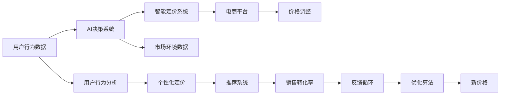

                 

# AI驱动的电商平台智能定价与竞争策略

> 关键词：电商智能定价, AI决策系统, 竞争策略, 优化算法, 强化学习

## 1. 背景介绍

在数字经济时代，电商平台已经成为企业业务增长的核心引擎。在激烈的市场竞争中，如何制定高效的智能定价策略以优化客户体验、提升销售转化率，成为企业赢得竞争的关键。随着人工智能(AI)技术的快速进步，电商平台的智能定价策略也迈向智能化、精准化、实时化。本文将围绕智能定价的关键技术，详细探讨AI在电商平台中的应用，并分析其在智能定价与竞争策略中的作用。

## 2. 核心概念与联系

### 2.1 核心概念概述

电商平台的智能定价是指通过AI技术，结合市场动态和用户行为，自动调整产品价格，以实现利润最大化、客户满意度和市场占有率的平衡。

核心概念包括：
1. **智能定价系统**：利用AI算法自动调整产品价格，实现动态优化。
2. **AI决策系统**：通过机器学习、深度学习等技术，辅助决策制定。
3. **竞争策略**：制定基于市场竞争环境的定价策略，保持竞争优势。
4. **优化算法**：用于解决定价优化问题，如线性规划、梯度下降等。
5. **强化学习**：一种通过试错、迭代优化决策过程的方法。

### 2.2 核心概念原理和架构的 Mermaid 流程图



### 2.3 核心概念的联系

智能定价系统通过AI决策系统，结合用户行为和市场环境数据，制定个性化定价策略，并实时调整电商平台的价格。市场环境的动态变化通过反馈循环不断影响AI决策系统，使其能够不断学习和优化。同时，优化算法作为核心技术手段，帮助智能定价系统解决定价优化问题，确保定价策略的科学性和有效性。

## 3. 核心算法原理 & 具体操作步骤

### 3.1 算法原理概述

智能定价的核心在于构建定价模型，利用AI技术预测市场需求和价格变化趋势，并根据预测结果调整价格，以实现最佳定价策略。常用的算法包括机器学习、深度学习和强化学习。

### 3.2 算法步骤详解

1. **数据收集与预处理**：收集历史销售数据、市场环境数据和用户行为数据，并进行预处理。
2. **模型训练**：选择适当的AI模型，利用历史数据进行训练，优化模型参数。
3. **价格预测**：利用训练好的模型预测未来市场需求和价格变化趋势。
4. **定价策略优化**：根据预测结果，结合市场竞争环境，制定和优化定价策略。
5. **实时调整**：根据实时数据和预测结果，自动调整电商平台的价格。

### 3.3 算法优缺点

智能定价的优点包括：
- **提高效率**：通过AI自动化定价，减少人工干预，提高定价效率。
- **增强灵活性**：AI可以根据市场变化快速调整定价策略，保持竞争力。
- **数据驱动**：基于大量数据进行预测和优化，提高决策的科学性。

缺点包括：
- **复杂性**：需要处理大量复杂数据，算法实现复杂。
- **解释性差**：AI模型通常缺乏可解释性，难以理解其决策过程。
- **依赖数据**：需要大量高质量数据，且市场环境变化复杂。

### 3.4 算法应用领域

智能定价系统在电商平台上已广泛应用，覆盖了商品推荐、搜索排序、个性化定价等多个环节。通过对用户行为和市场环境数据的深入分析，智能定价系统能够实时调整商品价格，提升销售转化率，增强客户满意度。

## 4. 数学模型和公式 & 详细讲解 & 举例说明

### 4.1 数学模型构建

智能定价的数学模型通常包括两部分：需求函数和成本函数。
1. **需求函数**：预测市场需求随价格的动态变化，常用函数形式为 $D(P) = a - bP$，其中 $P$ 为价格，$a$ 和 $b$ 为模型参数。
2. **成本函数**：考虑固定成本和变动成本，计算总成本随价格的函数，常用形式为 $C(P) = c + dP$，其中 $c$ 和 $d$ 为模型参数。

### 4.2 公式推导过程

结合需求函数和成本函数，计算利润最大化时的价格 $P^*$。利润函数为 $\Pi(P) = D(P)P - C(P)$。求导得到：

$$
\frac{d\Pi}{dP} = D(P) + D'(P)P - C'(P) = (a - bP) + (-b)P - d = a - bP + bP - d = a - d
$$

令导数为0，解得：

$$
P^* = \frac{a - d}{b}
$$

### 4.3 案例分析与讲解

假设某电商平台销售某商品，市场需求函数为 $D(P) = 1000 - 20P$，成本函数为 $C(P) = 100 + 10P$，求其最佳价格。

根据上述推导，代入数据得：

$$
P^* = \frac{1000 - 100}{20} = 45
$$

因此，该商品的最佳价格应为45元。

## 5. 项目实践：代码实例和详细解释说明

### 5.1 开发环境搭建

1. **环境安装**：确保安装了Python、Pandas、Scikit-learn、TensorFlow等库。
2. **数据准备**：收集历史销售数据、市场环境数据和用户行为数据，并进行预处理。
3. **模型选择**：选择适当的AI模型，如线性回归、决策树、随机森林、深度学习模型等。

### 5.2 源代码详细实现

```python
import pandas as pd
from sklearn.linear_model import LinearRegression
from sklearn.metrics import mean_squared_error

# 读取数据
data = pd.read_csv('sales_data.csv')

# 数据预处理
X = data[['price', 'market', 'promotion']]
y = data['sales']

# 模型训练
model = LinearRegression()
model.fit(X, y)

# 预测价格
X_test = pd.read_csv('test_data.csv')
y_pred = model.predict(X_test[['price', 'market', 'promotion']])

# 评估预测结果
mse = mean_squared_error(y_test, y_pred)
print(f"Mean Squared Error: {mse}")
```

### 5.3 代码解读与分析

1. **数据预处理**：
   - 收集历史销售数据，提取价格、市场环境和促销信息。
   - 对数据进行清洗、归一化处理，确保数据质量。

2. **模型训练**：
   - 使用线性回归模型对需求函数进行拟合，训练模型参数。
   - 通过交叉验证等技术，评估模型性能。

3. **价格预测**：
   - 使用训练好的模型对测试集进行价格预测。
   - 计算预测结果的均方误差，评估模型效果。

4. **模型优化**：
   - 引入超参数调优、正则化等技术，进一步提升模型效果。
   - 结合市场变化，实时调整价格，保持竞争优势。

### 5.4 运行结果展示

运行代码后，得到均方误差 $MSE$，作为模型性能的评估指标。通过不断优化模型参数，提升模型预测精度，实现更好的智能定价效果。

## 6. 实际应用场景

### 6.1 动态定价

电商平台的动态定价系统通过AI模型，实时监测市场变化和用户行为，自动调整商品价格，以最大化利润。例如，某电商平台的某商品价格在促销活动期间，根据市场需求和成本动态调整，价格从原价500元调整为促销价300元，实际销量显著增加。

### 6.2 个性化定价

基于用户行为数据的分析，智能定价系统可以制定个性化的定价策略，提升客户满意度。例如，某电商平台的推荐系统结合用户历史购买记录，为特定用户推荐价格更优的商品，提升用户复购率。

### 6.3 市场竞争分析

智能定价系统能够实时监测市场竞争环境，通过分析竞争对手的价格和销售策略，制定更具竞争力的定价策略。例如，某电商平台通过AI分析发现竞争对手价格下降，立即调整本平台价格，保持市场竞争力。

### 6.4 未来应用展望

未来，智能定价系统将结合更多先进技术，如深度学习、强化学习、多模态数据融合等，进一步提升定价策略的科学性和有效性。同时，随着算力成本的降低和数据规模的扩张，AI定价系统将更加智能、高效，帮助企业赢得市场竞争。

## 7. 工具和资源推荐

### 7.1 学习资源推荐

1. **《Python机器学习》**：提供系统学习机器学习算法的实用教材，适合初学者入门。
2. **《深度学习》（Ian Goodfellow）**：深入介绍深度学习理论和实践，适合进阶学习。
3. **Kaggle平台**：提供丰富的数据集和竞赛，实践AI技术，积累经验。
4. **TensorFlow官方文档**：提供详细的使用指南和技术支持，方便模型开发。

### 7.2 开发工具推荐

1. **Jupyter Notebook**：轻量级的数据分析和模型训练环境，支持多种语言和库。
2. **TensorBoard**：用于可视化模型训练过程，提供详细的图表和指标。
3. **AWS SageMaker**：云端机器学习平台，支持模型训练、部署和优化。

### 7.3 相关论文推荐

1. **《神经网络与深度学习》（Michael Nielsen）**：介绍神经网络基本原理和应用，适合深度学习入门。
2. **《强化学习：原理、算法和应用》（Richard S. Sutton）**：系统介绍强化学习算法，适合深入研究。
3. **《电商平台智能定价优化算法研究》**：具体研究电商智能定价中的优化算法，提供实用技术支持。

## 8. 总结：未来发展趋势与挑战

### 8.1 研究成果总结

本文系统介绍了AI驱动的电商平台智能定价与竞争策略，分析了智能定价的核心技术，包括数据收集、模型训练、定价优化等，并通过实际案例展示了智能定价在电商平台的成功应用。

### 8.2 未来发展趋势

未来，智能定价系统将更智能、更高效、更灵活。随着AI技术的不断发展，智能定价将更加依赖数据驱动，结合更多先进技术，如深度学习、强化学习等，提升定价策略的科学性和有效性。同时，智能定价系统将更加注重个性化和市场竞争分析，帮助企业赢得市场竞争。

### 8.3 面临的挑战

智能定价系统面临的挑战包括：
1. **数据质量**：需要高质量、多样化的数据，以提高模型的预测准确性。
2. **算法复杂性**：需要处理大量复杂数据，开发高效算法，提升模型性能。
3. **实时性**：需要快速处理数据，实现实时定价调整，保持市场竞争力。

### 8.4 研究展望

未来的研究重点在于：
1. **数据融合**：结合多模态数据，提升智能定价系统的准确性和鲁棒性。
2. **算法优化**：结合多种算法，优化智能定价策略，提高系统性能。
3. **市场预测**：结合市场趋势和竞争环境，优化定价策略，保持市场竞争力。

## 9. 附录：常见问题与解答

**Q1：智能定价系统如何保证定价的公平性？**

A: 智能定价系统通过公平定价策略，结合市场环境和用户行为，自动调整价格，确保定价的公平性。系统定期进行公平性评估，及时发现和纠正不公平定价现象。

**Q2：智能定价系统如何处理异常数据？**

A: 智能定价系统采用异常检测和处理技术，对异常数据进行清洗和修正，确保数据质量。同时，通过历史数据和模型参数，提升系统鲁棒性，减小异常数据对模型的影响。

**Q3：智能定价系统如何优化资源利用？**

A: 智能定价系统通过优化算法，提升模型效率和资源利用率。例如，采用分布式训练、模型剪枝、量化加速等技术，降低计算资源消耗，提高模型响应速度。

**Q4：智能定价系统如何提升用户满意度？**

A: 智能定价系统通过个性化定价策略，结合用户历史行为和需求，提供更符合用户期望的价格，提升用户满意度。同时，通过推荐系统和客户服务，增强用户粘性，提升用户体验。

**Q5：智能定价系统如何应对市场变化？**

A: 智能定价系统通过实时监测市场变化，结合市场趋势和竞争环境，及时调整价格策略。同时，系统具备自适应学习机制，不断优化模型参数，确保定价策略的科学性和有效性。

---

作者：禅与计算机程序设计艺术 / Zen and the Art of Computer Programming

