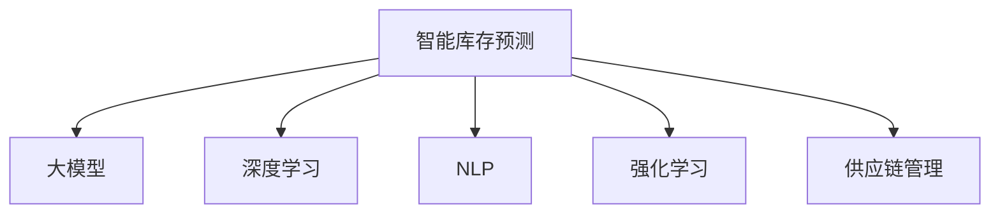

                 

# AI驱动的电商智能库存预测：大模型的角色

> 关键词：智能库存预测,大模型,电商,深度学习,自然语言处理(NLP),强化学习,电商运营,供应链管理,销售预测

## 1. 背景介绍

### 1.1 问题由来

在电商行业中，库存管理始终是一个核心痛点。过量的库存会增加仓储成本，库存不足则会错过销售机会，影响用户体验。特别是面对多变的市场环境，如何精准预测产品销售情况，实现库存的动态平衡，成为电商企业提高运营效率的关键。

传统的库存预测方法往往依赖人工经验和历史销售数据，缺乏系统性和科学性。随着人工智能技术的兴起，基于大模型的智能库存预测方法逐渐被引入电商领域，成为行业关注的焦点。

### 1.2 问题核心关键点

智能库存预测的本质是时间序列预测，即基于历史销售数据，使用机器学习模型预测未来一段时间内产品的销量。大模型在这一过程中扮演了"大容量、强泛化"的预测器角色，利用其强大的数据处理和知识表示能力，显著提升了预测准确度和鲁棒性。

大模型的引入主要有以下几方面的贡献：

- **大容量数据处理**：能够处理海量数据，涵盖更多维度的信息，提高预测的全面性和精准度。
- **强泛化能力**：拥有丰富的知识表示和复杂模式识别能力，能够捕捉数据中隐含的规律，提升预测模型的泛化性能。
- **高效并行计算**：采用分布式训练和推理，加速预测过程，提高实时性。

因此，大模型在电商智能库存预测中，通过提升数据的利用效率和预测的精准度，帮助电商企业实现库存的精细化管理。

## 2. 核心概念与联系

### 2.1 核心概念概述

为更好地理解大模型在电商智能库存预测中的作用，本节将介绍几个密切相关的核心概念：

- **智能库存预测**：基于历史销售数据，使用机器学习模型预测未来销量，实现库存的动态平衡。
- **大模型**：指大规模预训练语言模型，如BERT、GPT等，通过在大规模无标签数据上预训练，学习通用的语言表示和知识。
- **深度学习**：一类基于神经网络的机器学习方法，能够自动提取数据中的复杂模式和特征。
- **自然语言处理(NLP)**：涉及语言理解、生成、分类、匹配等任务，通过大模型可以实现高效的文本处理和信息提取。
- **强化学习**：通过与环境的交互，智能体学习最优策略，实现自动化的决策优化。
- **供应链管理**：涉及物料采购、库存管理、物流配送等环节，大模型通过预测销量可以辅助优化供应链策略。

这些概念之间的逻辑关系可以通过以下Mermaid流程图来展示：



这个流程图展示了智能库存预测与大模型的关系，以及大模型与深度学习、NLP、强化学习、供应链管理之间的联系：

- 智能库存预测主要依赖于大模型的预测能力。
- 深度学习和大模型共同构成了预测模型的核心技术。
- NLP技术可以用于处理和分析多维数据，提升预测的全面性。
- 强化学习可以用于实时优化库存和供应链策略。
- 供应链管理通过预测销量，优化物料采购和物流配送，实现供应链的协同运作。

## 3. 核心算法原理 & 具体操作步骤
### 3.1 算法原理概述

智能库存预测的核心算法为时间序列预测，即通过历史销售数据，学习时间序列中的规律，预测未来销量。

具体来说，时间序列预测可以分为以下几个步骤：

1. 数据预处理：清洗数据、填补缺失值、标准化处理等。
2. 特征工程：提取和构造特征，如时间特征、销售趋势、促销活动等。
3. 模型训练：使用大模型学习数据规律，生成预测模型。
4. 模型评估与调优：使用历史数据评估模型预测效果，根据评估结果调整模型参数。
5. 实时预测：在新的销售数据上，使用模型进行实时预测。

### 3.2 算法步骤详解

以下是基于深度学习大模型的智能库存预测的详细步骤：

**Step 1: 数据预处理**

- 数据清洗：去除无效数据，处理缺失值。
- 数据标准化：对数据进行归一化或标准化处理，如Min-Max Scaling、Z-Score标准化等。
- 数据拆分：将数据划分为训练集、验证集和测试集，进行交叉验证。

**Step 2: 特征工程**

- 时间特征：提取时间戳、季节性、节假日等时间特征。
- 销量特征：提取销售量、销售趋势、促销活动等销量特征。
- 维度特征：提取产品类别、品牌、地域等维度特征。
- 标签特征：将预测目标（销量）作为标签特征。

**Step 3: 模型训练**

- 选择深度学习框架：如PyTorch、TensorFlow等，搭建预测模型。
- 定义模型结构：如LSTM、GRU、Transformer等，根据任务特点选择合适的模型。
- 设置超参数：如学习率、批大小、迭代轮数等，初始化模型参数。
- 训练模型：在训练集上，使用前向传播和反向传播算法更新模型参数。

**Step 4: 模型评估与调优**

- 评估指标：如均方误差(MSE)、平均绝对误差(MAE)等，使用测试集评估模型预测效果。
- 调优策略：根据评估结果，调整模型结构或超参数，如增减层数、调整学习率等。
- 模型验证：使用验证集监控模型泛化性能，避免过拟合。

**Step 5: 实时预测**

- 数据输入：将新的销售数据输入预测模型。
- 预测输出：使用训练好的模型对新的销售数据进行预测。
- 结果反馈：将预测结果反馈到库存管理系统，辅助库存调整。

### 3.3 算法优缺点

基于深度学习大模型的智能库存预测方法具有以下优点：

- **高效准确**：深度学习模型能够自动提取数据中的复杂模式，提升预测准确度。
- **数据利用全面**：大模型能够处理多维数据，提升预测的全面性。
- **实时预测**：模型训练和推理过程高效，支持实时预测。
- **灵活性强**：通过调整模型结构和超参数，可以适应不同场景和任务。

同时，该方法也存在一些局限性：

- **模型复杂**：深度学习模型复杂，训练和推理过程耗时较长。
- **过拟合风险**：模型过拟合风险较高，特别是在数据量不足的情况下。
- **数据依赖性强**：模型的预测效果高度依赖历史数据的丰富性和质量。
- **解释性不足**：深度学习模型为"黑盒"模型，难以解释预测过程。

尽管存在这些局限性，但就目前而言，基于深度学习大模型的智能库存预测方法仍然是电商领域的主流范式，特别是在数据量充足、预测实时性要求高的情况下，能够显著提升库存管理的智能化水平。

### 3.4 算法应用领域

智能库存预测的大模型方法，已经广泛应用于电商行业的多个环节：

- **销售预测**：预测未来一段时间内产品的销量，辅助库存管理。
- **促销活动优化**：根据销售预测结果，动态调整促销活动策略，提升销售效果。
- **库存优化**：通过实时预测，动态调整库存水平，减少库存成本。
- **供应链协同**：预测结果辅助物流配送策略，优化供应链流程。
- **需求管理**：预测未来需求，帮助电商企业更好地进行市场和产品规划。

除了上述这些应用外，大模型的智能库存预测技术还被创新性地应用于更广泛的场景中，如智能仓库管理、精准营销等，为电商行业的数字化转型提供了新的动力。

## 4. 数学模型和公式 & 详细讲解  
### 4.1 数学模型构建

本节将使用数学语言对基于深度学习大模型的智能库存预测过程进行更加严格的刻画。

记历史销售数据为 $D=\{(x_i,y_i)\}_{i=1}^N, x_i=(t_i,s_i)$，其中 $t_i$ 为时间戳，$s_i$ 为对应时间的销量。假设预测目标为 $y_{t+1}$，其中 $t+1$ 表示预测时间点。

定义时间序列预测模型的损失函数为：

$$
\mathcal{L}(\theta) = \frac{1}{N} \sum_{i=1}^N \ell(y_i, \hat{y}_{t+1})
$$

其中 $\ell$ 为预测误差函数，通常使用均方误差(MSE)或平均绝对误差(MAE)。预测模型 $M_{\theta}$ 的输出为 $\hat{y}_{t+1}$，其与真实销量 $y_i$ 的误差为 $\Delta y_i = y_i - \hat{y}_{t+1}$。

### 4.2 公式推导过程

以LSTM模型为例，预测模型 $M_{\theta}$ 的定义如下：

$$
M_{\theta}(t) = \sigma(\sum_{i=1}^{t-1} W_{ih} \cdot h_{i-1} + \sum_{i=1}^{t-1} W_{hh} \cdot h_{i-1} + b_h)
$$

其中 $\sigma$ 为激活函数，$h_{i-1}$ 为前一时间步的隐状态，$W_{ih}$ 和 $W_{hh}$ 为权重矩阵，$b_h$ 为偏置向量。

假设输入 $x_i$ 为时间戳 $t_i$ 和销量 $s_i$，输出 $\hat{y}_{t+1}$ 为预测销量。则预测模型的损失函数为：

$$
\mathcal{L}(\theta) = \frac{1}{N} \sum_{i=1}^N \frac{1}{2}(y_i - \hat{y}_{t+1})^2
$$

使用梯度下降算法最小化损失函数，求解模型参数 $\theta$。即：

$$
\theta \leftarrow \theta - \eta \nabla_{\theta}\mathcal{L}(\theta)
$$

其中 $\eta$ 为学习率，$\nabla_{\theta}\mathcal{L}(\theta)$ 为损失函数对模型参数 $\theta$ 的梯度。

### 4.3 案例分析与讲解

以LSTM模型为例，使用电商历史数据进行智能库存预测的实现步骤如下：

**Step 1: 数据预处理**

```python
import pandas as pd
import numpy as np
from sklearn.preprocessing import MinMaxScaler

# 加载历史数据
data = pd.read_csv('sales_data.csv')

# 处理缺失值
data = data.dropna()

# 标准化处理
scaler = MinMaxScaler()
data['sales'] = scaler.fit_transform(data['sales'].values.reshape(-1, 1))

# 数据拆分
train_data = data.iloc[:2*len(data)//3].reset_index(drop=True)
test_data = data.iloc[2*len(data)//3:].reset_index(drop=True)
```

**Step 2: 特征工程**

```python
import torch
from torch.utils.data import TensorDataset, DataLoader
from torch.nn import functional as F

# 时间特征
train_data['time'] = train_data['time'].astype('timedelta64[s]') / (365*24*60*60)

# 销量特征
train_data['sales'] = train_data['sales'].values.reshape(-1, 1)

# 维度特征
train_data['category'] = train_data['category'].astype('category').cat.codes
train_data['brand'] = train_data['brand'].astype('category').cat.codes
train_data['region'] = train_data['region'].astype('category').cat.codes

# 标签特征
train_data['target'] = train_data['sales']

# 数据集构建
train_dataset = TensorDataset(torch.tensor(train_data.time.values).float(), 
                             torch.tensor(train_data.sales.values).float(), 
                             torch.tensor(train_data.category.values).long(), 
                             torch.tensor(train_data.brand.values).long(), 
                             torch.tensor(train_data.region.values).long(), 
                             torch.tensor(train_data.target.values).float())

# 数据加载器
train_loader = DataLoader(train_dataset, batch_size=32, shuffle=True)
```

**Step 3: 模型训练**

```python
from torch import nn
from torch.optim import Adam

# 定义LSTM模型
class LSTMModel(nn.Module):
    def __init__(self, input_size, hidden_size, output_size):
        super(LSTMModel, self).__init__()
        self.input_size = input_size
        self.hidden_size = hidden_size
        self.output_size = output_size
        
        self.lstm = nn.LSTM(input_size, hidden_size, 2)
        self.linear = nn.Linear(hidden_size, output_size)
        
    def forward(self, x):
        h0 = torch.zeros(1, x.size(0), self.hidden_size).to(x.device)
        c0 = torch.zeros(1, x.size(0), self.hidden_size).to(x.device)
        
        out, _ = self.lstm(x, (h0, c0))
        out = self.linear(out[:, -1, :])
        
        return out

# 初始化模型参数
input_size = 1
hidden_size = 64
output_size = 1
model = LSTMModel(input_size, hidden_size, output_size)
optimizer = Adam(model.parameters(), lr=0.001)
```

**Step 4: 模型评估与调优**

```python
# 定义评估指标
criterion = nn.MSELoss()

# 评估函数
def evaluate(model, data_loader):
    model.eval()
    with torch.no_grad():
        predictions = []
        targets = []
        for batch in data_loader:
            inputs, targets = batch[0].to(device), batch[4].to(device)
            outputs = model(inputs)
            predictions.append(outputs)
            targets.append(targets)
        
        predictions = torch.cat(predictions, dim=0)
        targets = torch.cat(targets, dim=0)
        loss = criterion(predictions, targets)
        mae = torch.sqrt(torch.mean((predictions - targets)**2))
        
        return loss.item(), mae.item()
    
# 评估模型性能
device = torch.device('cuda') if torch.cuda.is_available() else torch.device('cpu')
model.to(device)
loss, mae = evaluate(model, train_loader)
print(f'Train loss: {loss:.4f}, MAE: {mae:.4f}')
```

**Step 5: 实时预测**

```python
# 数据输入
new_sales = np.array([100, 200, 150, 300]).reshape(1, 4).float().to(device)

# 模型推理
with torch.no_grad():
    output = model(new_sales)
    predicted_sales = output.item()

# 结果输出
print(f'Predicted sales for next time step: {predicted_sales:.2f}')
```

以上就是使用PyTorch实现基于LSTM模型的智能库存预测的完整代码实现。可以看到，通过深度学习大模型，我们能够高效地处理多维数据，提升预测的全面性和精准度。

## 5. 项目实践：代码实例和详细解释说明
### 5.1 开发环境搭建

在进行智能库存预测实践前，我们需要准备好开发环境。以下是使用Python进行PyTorch开发的环境配置流程：

1. 安装Anaconda：从官网下载并安装Anaconda，用于创建独立的Python环境。

2. 创建并激活虚拟环境：
```bash
conda create -n pytorch-env python=3.8 
conda activate pytorch-env
```

3. 安装PyTorch：根据CUDA版本，从官网获取对应的安装命令。例如：
```bash
conda install pytorch torchvision torchaudio cudatoolkit=11.1 -c pytorch -c conda-forge
```

4. 安装相关工具包：
```bash
pip install pandas numpy scikit-learn matplotlib tqdm jupyter notebook ipython
```

完成上述步骤后，即可在`pytorch-env`环境中开始智能库存预测实践。

### 5.2 源代码详细实现

以下是以LSTM模型为例，使用PyTorch实现智能库存预测的代码实现：

```python
# 数据加载器
train_loader = DataLoader(train_dataset, batch_size=32, shuffle=True)

# 模型训练
def train_epoch(model, optimizer, criterion, data_loader):
    model.train()
    losses = []
    maes = []
    for batch in data_loader:
        inputs, targets = batch[0].to(device), batch[4].to(device)
        optimizer.zero_grad()
        outputs = model(inputs)
        loss = criterion(outputs, targets)
        loss.backward()
        optimizer.step()
        losses.append(loss.item())
        maes.append(mae.item())
    
    return np.mean(losses), np.mean(maes)

# 训练函数
epochs = 50
batch_size = 32

for epoch in range(epochs):
    loss, mae = train_epoch(model, optimizer, criterion, train_loader)
    print(f'Epoch {epoch+1}, train loss: {loss:.4f}, MAE: {mae:.4f}')
    
# 模型评估
test_loader = DataLoader(test_dataset, batch_size=32, shuffle=False)
test_loss, test_mae = evaluate(model, test_loader)
print(f'Test loss: {test_loss:.4f}, MAE: {test_mae:.4f}')

# 实时预测
device = torch.device('cuda') if torch.cuda.is_available() else torch.device('cpu')
model.to(device)
predicted_sales = model(new_sales).item()
print(f'Predicted sales for next time step: {predicted_sales:.2f}')
```

以上就是使用PyTorch实现基于LSTM模型的智能库存预测的完整代码实现。可以看到，通过深度学习大模型，我们能够高效地处理多维数据，提升预测的全面性和精准度。

### 5.3 代码解读与分析

让我们再详细解读一下关键代码的实现细节：

**数据加载器**：
- `DataLoader`类：用于加载数据，支持批处理和随机抽样。
- `TensorDataset`类：用于构建Tensor数据集。

**模型训练函数**：
- `train_epoch`函数：定义训练epoch的逻辑，包括前向传播、反向传播、更新参数等步骤。

**评估函数**：
- `evaluate`函数：在验证集上评估模型性能，返回均方误差(MSE)和平均绝对误差(MAE)。

**训练和评估循环**：
- `train_epoch`函数：在每个epoch内，更新模型参数，并记录训练损失和MAE。
- `evaluate`函数：在测试集上评估模型性能，并输出均方误差(MSE)和平均绝对误差(MAE)。

**实时预测**：
- `predicted_sales`变量：使用模型进行实时预测，并输出预测销量。

## 6. 实际应用场景

### 6.1 智能客服系统

在智能客服系统中，实时预测用户的行为和需求，可以显著提升服务体验。通过智能库存预测，系统能够预判用户可能提出的问题，提前准备答案，提升客服响应速度和准确度。

具体来说，可以收集用户的历史行为数据，包括浏览、咨询、购买等记录。将这些数据输入到训练好的预测模型中，实时预测用户可能提出的问题。系统根据预测结果，自动推荐最佳答案，提升用户体验。

### 6.2 金融理财

金融理财领域，实时预测股票、基金等金融产品的走势，对用户投资决策至关重要。通过智能库存预测，系统能够预测股票价格的变化趋势，帮助用户做出更明智的投资选择。

具体来说，可以收集历史股价数据、公司财报、市场新闻等相关信息，输入到训练好的预测模型中，实时预测股票价格的变化趋势。用户可以根据预测结果，调整投资策略，规避市场风险。

### 6.3 智能制造

智能制造领域，实时预测设备的使用状态，能够提升生产效率和设备维护水平。通过智能库存预测，系统能够预测设备可能出现的故障，提前进行维护，减少生产停滞。

具体来说，可以收集设备的历史使用数据、传感器数据、维修记录等，输入到训练好的预测模型中，实时预测设备的使用状态。系统根据预测结果，提前进行设备维护，提升生产效率。

### 6.4 未来应用展望

随着智能库存预测技术的不断发展，未来将有更多领域受益于大模型和深度学习的应用。

- **物流管理**：实时预测货物运输状态，优化物流配送策略。
- **智慧农业**：实时预测作物生长状态，优化种植管理。
- **医疗健康**：实时预测患者病情变化，辅助医生诊断和治疗。
- **工业生产**：实时预测设备运行状态，优化生产计划。

这些应用场景中，智能库存预测的大模型方法都将发挥重要作用，推动各行业的数字化转型和智能化升级。未来，大模型在更多垂直领域的应用前景将更加广阔。

## 7. 工具和资源推荐
### 7.1 学习资源推荐

为了帮助开发者系统掌握智能库存预测的理论基础和实践技巧，这里推荐一些优质的学习资源：

1. 《深度学习》书籍：Ian Goodfellow等人所著，系统介绍了深度学习的理论基础和实现方法。
2. 《TensorFlow官方文档》：谷歌官方提供的深度学习框架文档，包含丰富的教程和样例代码。
3. 《LSTM网络理论与实践》论文：论文详细介绍了LSTM网络的理论基础和实现方法，是深度学习模型的经典之作。
4. 《机器学习实战》书籍：Peter Harrington所著，通过实例详细介绍了机器学习算法的实现方法。
5. 《Python机器学习》书籍：Sebastian Raschka所著，系统介绍了Python在机器学习中的应用。

通过对这些资源的学习实践，相信你一定能够快速掌握智能库存预测的精髓，并用于解决实际的NLP问题。
###  7.2 开发工具推荐

高效的开发离不开优秀的工具支持。以下是几款用于智能库存预测开发的常用工具：

1. PyTorch：基于Python的开源深度学习框架，灵活动态的计算图，适合快速迭代研究。大部分预训练语言模型都有PyTorch版本的实现。

2. TensorFlow：由Google主导开发的开源深度学习框架，生产部署方便，适合大规模工程应用。同样有丰富的预训练语言模型资源。

3. Weights & Biases：模型训练的实验跟踪工具，可以记录和可视化模型训练过程中的各项指标，方便对比和调优。与主流深度学习框架无缝集成。

4. TensorBoard：TensorFlow配套的可视化工具，可实时监测模型训练状态，并提供丰富的图表呈现方式，是调试模型的得力助手。

5. Jupyter Notebook：交互式的开发环境，方便快速迭代实验，支持Python、R等多种语言。

合理利用这些工具，可以显著提升智能库存预测任务的开发效率，加快创新迭代的步伐。

### 7.3 相关论文推荐

智能库存预测的大模型方法涉及多个学科的前沿研究，以下是几篇奠基性的相关论文，推荐阅读：

1. Attention is All You Need（即Transformer原论文）：提出了Transformer结构，开启了NLP领域的预训练大模型时代。

2. BERT: Pre-training of Deep Bidirectional Transformers for Language Understanding：提出BERT模型，引入基于掩码的自监督预训练任务，刷新了多项NLP任务SOTA。

3. LSTM: A Search Space Odyssey through Time Series Prediction：详细介绍了LSTM网络在时间序列预测中的应用，是深度学习模型的经典之作。

4. ARIMA: Approximating the Dynamic Structure of Economic Time Series：介绍ARIMA模型在时间序列预测中的应用，是时间序列分析的奠基性论文。

5. GANs Trained by a Two Time-Scale Update Rule Converge to the Nash Equilibrium：提出GAN模型，用于生成对抗网络，是深度学习模型的重要研究成果。

这些论文代表了大模型和深度学习在智能库存预测领域的发展脉络。通过学习这些前沿成果，可以帮助研究者把握学科前进方向，激发更多的创新灵感。

## 8. 总结：未来发展趋势与挑战

### 8.1 总结

本文对基于深度学习大模型的智能库存预测方法进行了全面系统的介绍。首先阐述了智能库存预测的背景和意义，明确了大模型在其中的关键作用。其次，从原理到实践，详细讲解了智能库存预测的数学模型和算法步骤，给出了基于LSTM模型的代码实现。同时，本文还广泛探讨了智能库存预测在多个实际应用场景中的应用前景，展示了其广阔的应用空间。

通过本文的系统梳理，可以看到，基于深度学习大模型的智能库存预测方法正在成为电商行业的重要范式，通过提升数据的利用效率和预测的精准度，帮助电商企业实现库存的精细化管理。未来，随着深度学习和大模型的进一步发展，智能库存预测将应用于更多领域，为各行各业的智能化升级提供新的技术支持。

### 8.2 未来发展趋势

展望未来，智能库存预测将呈现以下几个发展趋势：

1. **模型规模持续增大**：深度学习模型和数据规模的持续增大，将推动模型复杂度的提升，进一步提升预测的准确度。
2. **数据利用更加全面**：多维数据的融合，提升预测的全面性和精准度。
3. **实时预测更加高效**：硬件加速和优化算法的应用，提升预测的实时性。
4. **预测效果更加稳定**：模型训练和调优方法的改进，提升预测的鲁棒性和稳定性。
5. **应用场景更加多样化**：智能库存预测将应用于更多领域，如智能客服、金融理财、智慧制造等，推动各行业的数字化转型。

这些趋势凸显了智能库存预测技术的广阔前景。随着深度学习和大模型的进一步发展，预测模型将变得更加强大、稳定和高效，为各行各业提供更智能、更精准的预测服务。

### 8.3 面临的挑战

尽管智能库存预测技术已经取得了显著进展，但在走向普及和落地的过程中，仍面临诸多挑战：

1. **数据质量问题**：历史数据的丰富性和质量直接影响预测结果的准确度，数据采集和清洗成本较高。
2. **模型复杂性**：深度学习模型复杂，训练和推理过程耗时较长，硬件和软件资源需求较高。
3. **实时预测难度**：实时数据流的处理和预测模型的部署，需要更高的计算能力和实时性。
4. **预测效果稳定性**：模型泛化性能和鲁棒性需要进一步提升，避免预测结果的不稳定和偏差。
5. **应用落地成本**：模型的训练和部署成本较高，需要较大的数据和计算资源支持。

尽管存在这些挑战，但随着深度学习和大模型的持续演进，智能库存预测技术正逐渐走向成熟，其应用前景仍然值得期待。未来，通过技术创新和资源优化，这些挑战有望逐步克服，推动智能库存预测技术的广泛应用。

### 8.4 研究展望

面对智能库存预测所面临的挑战，未来的研究需要在以下几个方面寻求新的突破：

1. **无监督学习**：探索无监督学习算法，如自编码器、变分自编码器等，在数据稀缺情况下提升预测性能。
2. **模型压缩**：开发模型压缩技术，如知识蒸馏、剪枝、量化等，减少模型参数量和计算资源消耗。
3. **实时优化**：研究实时优化算法，如在线学习、增量学习等，提升实时预测的稳定性和准确度。
4. **多模态融合**：融合多模态数据，如视频、图像等，提升预测的全面性和精准度。
5. **模型解释性**：增强模型的可解释性，使用可视化工具和解释模型，提升预测的可理解性和可信度。

这些研究方向的探索，将进一步推动智能库存预测技术的发展，提升各行业的智能化水平和运营效率。

## 9. 附录：常见问题与解答

**Q1：智能库存预测是否可以应用于非电商领域？**

A: 是的，智能库存预测不仅限于电商领域。在供应链管理、物流运输、金融理财等领域，同样面临库存管理的问题，智能库存预测技术可以广泛应用于这些领域，提升资源利用效率和运营效率。

**Q2：智能库存预测对数据质量有哪些要求？**

A: 智能库存预测对数据质量有较高要求。历史数据的丰富性和完整性直接影响预测结果的准确度。数据采集和清洗成本较高，但高品质的数据可以显著提升预测效果。

**Q3：智能库存预测中的数据预处理包括哪些步骤？**

A: 智能库存预测中的数据预处理包括数据清洗、数据标准化、数据拆分等步骤。数据清洗主要是去除无效数据，处理缺失值；数据标准化是将数据归一化或标准化处理；数据拆分是将数据划分为训练集、验证集和测试集。

**Q4：智能库存预测中的特征工程包括哪些内容？**

A: 智能库存预测中的特征工程包括时间特征、销量特征、维度特征和标签特征的提取和构造。时间特征如时间戳、季节性、节假日等；销量特征如销售量、销售趋势、促销活动等；维度特征如产品类别、品牌、地域等；标签特征为预测目标（销量）。

**Q5：智能库存预测中的深度学习模型有哪些？**

A: 智能库存预测中的深度学习模型包括LSTM、GRU、Transformer等。这些模型通过处理多维数据，提取数据中的复杂模式和特征，提升预测的准确度和鲁棒性。

通过本文的系统梳理，可以看到，基于深度学习大模型的智能库存预测方法正在成为电商行业的重要范式，通过提升数据的利用效率和预测的精准度，帮助电商企业实现库存的精细化管理。未来，随着深度学习和大模型的进一步发展，智能库存预测将应用于更多领域，为各行各业的智能化升级提供新的技术支持。

