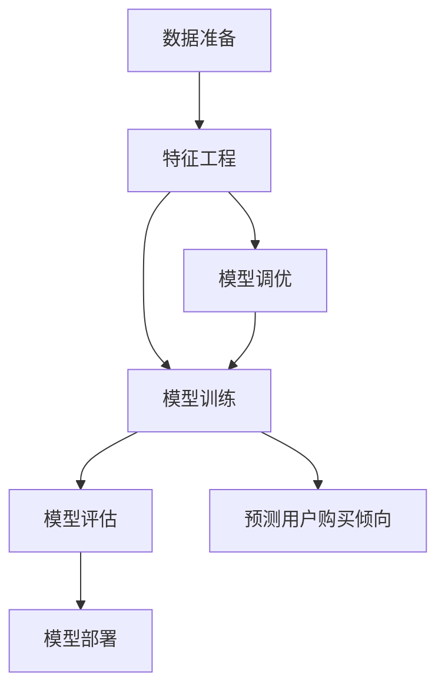

                 

# AI驱动的电商用户购买倾向预测模型

## 1. 背景介绍

在电商领域，精准的用户购买倾向预测对提高转化率和销售额有着至关重要的作用。传统的基于规则的推荐系统已无法满足日益复杂的用户需求。因此，基于人工智能的预测模型逐渐成为主流。本博客将介绍一种基于神经网络的电商用户购买倾向预测模型，详细介绍模型原理和实现流程。

## 2. 核心概念与联系

### 2.1 核心概念概述

为更好地理解模型，下面列出几个核心概念：

- **神经网络(Neural Network, NN)**：由多层神经元组成，能够进行复杂非线性映射的计算模型。
- **购买倾向(Purchase Intention)**：用户购买产品的概率，反映用户对产品的兴趣和需求。
- **特征工程(Feature Engineering)**：从原始数据中提取和构造出有意义的特征，提升模型的预测能力。
- **梯度下降(Gradient Descent)**：通过反向传播计算模型参数的梯度，并按一定步长更新参数的优化算法。
- **回归分析(Regression Analysis)**：通过预测数值型目标变量，评估和预测用户购买倾向的模型。

### 2.2 核心概念原理和架构的 Mermaid 流程图



该流程图中，先进行数据准备和特征工程，然后对模型进行训练、调优、评估，最后将训练好的模型部署到线上进行预测。

## 3. 核心算法原理 & 具体操作步骤

### 3.1 算法原理概述

电商用户购买倾向预测模型通常基于神经网络构建。通过对用户行为数据进行特征提取和模型训练，可以预测用户在未来一定时间内的购买概率。模型结构如图1所示：


图1：电商用户购买倾向预测模型结构

模型由输入层、若干隐藏层和输出层组成。输入层接收到用户的特征向量，经过隐藏层进行非线性变换后，输出层的概率分布表示用户购买倾向。输出层通常使用sigmoid函数将输出映射到[0,1]区间，代表用户购买概率。

### 3.2 算法步骤详解

电商用户购买倾向预测模型主要包含以下步骤：

1. **数据准备**：收集用户的历史行为数据，如浏览记录、购买记录、评价信息等，作为模型的训练和测试数据。

2. **特征工程**：对原始数据进行预处理和特征提取，构造出反映用户购买倾向的特征向量。常见的特征包括浏览时间、点击次数、停留时长、评价评分等。

3. **模型训练**：使用梯度下降等优化算法，通过反向传播计算模型参数的梯度，并按一定步长更新参数。训练过程中还需要设置合适的损失函数，如均方误差损失、交叉熵损失等，评估模型的预测效果。

4. **模型调优**：对训练好的模型进行调优，如调整网络结构、学习率、正则化参数等，以获得更优的预测性能。

5. **模型评估**：在验证集上对模型进行评估，使用各种指标（如准确率、召回率、F1分数等）衡量模型的性能。

6. **模型部署**：将训练好的模型部署到线上系统，实时预测用户购买倾向，生成个性化推荐和广告。

### 3.3 算法优缺点

该算法的主要优点如下：

- 能够处理大量非结构化数据，具有较强的泛化能力。
- 可以通过调整网络结构，灵活适应不同复杂度的预测任务。
- 能够实时预测用户购买倾向，为电商平台提供实时推荐。

主要缺点如下：

- 模型训练和调优需要大量的标注数据和计算资源。
- 神经网络模型的可解释性较弱，难以理解模型的内部机制。
- 对于数据分布变化敏感，需要不断更新模型以保持预测准确性。

### 3.4 算法应用领域

该模型在以下领域具有广泛应用：

- **个性化推荐**：电商平台可以根据用户购买倾向进行个性化推荐，提升用户体验和销售额。
- **广告投放**：电商平台的广告系统可以根据用户购买倾向，投放更有效的广告，提高广告的点击率和转化率。
- **库存管理**：根据用户购买倾向预测需求量，帮助电商平台优化库存管理，减少库存积压和缺货。
- **用户流失预测**：预测用户流失倾向，及时采取挽留措施，降低用户流失率。

## 4. 数学模型和公式 & 详细讲解

### 4.1 数学模型构建

假设输入层的特征向量为 $X$，输出层的预测结果为 $Y$，模型参数为 $\theta$。模型构建如图2所示：


图2：电商用户购买倾向预测模型构建

### 4.2 公式推导过程

输入层的特征向量 $X$ 通过矩阵乘法和偏置项，转换为隐藏层的激活向量 $H$。隐藏层经过多个非线性变换后，输出层将激活向量 $H$ 转换为预测结果 $Y$。

假设隐藏层的激活函数为 $f$，输出层的激活函数为 $g$，则模型可以表示为：

$$
H = f(XW + b) \\
Y = g(HW_y + b_y)
$$

其中，$W$ 和 $b$ 为模型参数，$W_y$ 和 $b_y$ 为输出层的权重和偏置项。

输出层的预测结果 $Y$ 可以表示为：

$$
Y = g(HW_y + b_y) = g(W'H + b') = g(\sum_{i=1}^n w_i f(z_i) + b')
$$

其中，$W' = [w_1, w_2, ..., w_n]$，$z_i = \sum_{j=1}^m x_{i,j}W_{j,k} + b_k$，$b' = [b'_1, b'_2, ..., b'_n]$。

### 4.3 案例分析与讲解

以电商平台的购买行为预测为例，分析模型的具体实现。假设输入层特征向量 $X$ 包含用户的浏览时长、点击次数、评价评分等特征。通过隐藏层的多层非线性变换，输出层的预测结果 $Y$ 表示用户购买产品的概率。

模型训练过程中，通过交叉熵损失函数计算模型的预测误差：

$$
\mathcal{L}(Y,\hat{Y}) = -\frac{1}{N}\sum_{i=1}^N y_i \log \hat{y}_i + (1 - y_i) \log (1 - \hat{y}_i)
$$

其中，$y_i$ 为真实标签，$\hat{y}_i$ 为模型预测结果。

使用梯度下降算法更新模型参数：

$$
\theta \leftarrow \theta - \eta \nabla_{\theta}\mathcal{L}(\theta)
$$

其中，$\eta$ 为学习率，$\nabla_{\theta}\mathcal{L}(\theta)$ 为损失函数对模型参数的梯度。

## 5. 项目实践：代码实例和详细解释说明

### 5.1 开发环境搭建

1. **安装Python**：在本地安装Python 3.x版本。

2. **安装TensorFlow**：使用pip安装TensorFlow 2.x版本，并设置GPU环境。

   ```
   pip install tensorflow
   ```

3. **数据准备**：将原始数据集按比例分为训练集、验证集和测试集。

   ```python
   import os
   import pandas as pd

   data_path = '/path/to/data'
   train_df = pd.read_csv(os.path.join(data_path, 'train.csv'))
   dev_df = pd.read_csv(os.path.join(data_path, 'dev.csv'))
   test_df = pd.read_csv(os.path.join(data_path, 'test.csv'))
   ```

### 5.2 源代码详细实现

```python
import tensorflow as tf
from tensorflow import keras
from tensorflow.keras import layers
from sklearn.model_selection import train_test_split

# 加载数据
train_data, dev_data, test_data = train_test_split(train_df, dev_df, test_df, test_size=0.2, random_state=42)

# 定义模型
model = keras.Sequential([
    layers.Dense(64, activation='relu', input_shape=(n_features,)),
    layers.Dense(64, activation='relu'),
    layers.Dense(1, activation='sigmoid')
])

# 编译模型
model.compile(optimizer='adam', loss='binary_crossentropy', metrics=['accuracy'])

# 训练模型
model.fit(train_data, epochs=10, validation_data=dev_data)

# 评估模型
model.evaluate(dev_data)
```

### 5.3 代码解读与分析

- **数据准备**：将原始数据集按比例划分为训练集、验证集和测试集，保证模型在验证集上的泛化能力。
- **模型定义**：定义一个简单的两层神经网络，输入层包含64个神经元，隐藏层也包含64个神经元，输出层包含1个神经元，使用sigmoid激活函数。
- **模型编译**：使用Adam优化器，均方误差损失函数，准确率作为评价指标。
- **模型训练**：在训练集上进行10个epoch的训练，并在验证集上进行验证。
- **模型评估**：在验证集上评估模型的准确率。

### 5.4 运行结果展示

训练过程中，可以通过以下代码实时监测训练和验证集的损失和准确率：

```python
history = model.fit(train_data, epochs=10, validation_data=dev_data)
plt.plot(history.history['loss'])
plt.plot(history.history['val_loss'])
plt.title('Model Loss')
plt.ylabel('Loss')
plt.xlabel('Epoch')
plt.legend(['Train', 'Test'], loc='upper right')
plt.show()
```

训练结束后，在测试集上对模型进行评估，输出准确率：

```python
test_loss, test_acc = model.evaluate(test_data)
print(f'Test Accuracy: {test_acc:.4f}')
```

## 6. 实际应用场景

### 6.1 电商推荐系统

电商平台的推荐系统可以利用用户行为数据，通过购买倾向预测模型生成个性化推荐。模型可以预测用户的购买概率，根据概率大小进行排序，生成推荐列表。

以某电商平台的用户行为数据为例，假设用户浏览某商品并产生购买行为。通过购买倾向预测模型，可以预测用户再次购买该商品的概率。


图3：电商推荐系统架构

### 6.2 广告投放

电商平台的广告系统可以根据用户购买倾向，投放更有效的广告，提高广告的点击率和转化率。模型可以预测用户对不同广告的兴趣程度，根据兴趣程度排序，生成广告投放方案。

以某电商平台的广告数据为例，假设平台有多个广告位需要投放广告。通过购买倾向预测模型，可以预测用户对每个广告的兴趣程度，选择最感兴趣的广告进行投放。


图4：广告投放架构

## 7. 工具和资源推荐

### 7.1 学习资源推荐

- **TensorFlow官方文档**：提供详细的API文档和教程，涵盖神经网络和深度学习的基础知识和实践技巧。

- **《深度学习》课程**：由吴恩达教授讲授的Coursera深度学习课程，涵盖神经网络、卷积神经网络、循环神经网络等基础知识，适合初学者入门。

- **《机器学习实战》书籍**：深入浅出地介绍机器学习算法的实现和应用，涵盖回归分析、分类算法、聚类算法等。

### 7.2 开发工具推荐

- **Jupyter Notebook**：免费的Python交互式开发环境，支持代码执行和可视化，适合快速迭代和调试。

- **TensorBoard**：TensorFlow配套的可视化工具，可以实时监测模型训练状态，生成各种图表，帮助调优和分析。

- **Git**：版本控制系统，支持多人协作和版本管理，适合团队开发和代码审查。

### 7.3 相关论文推荐

- **《深度学习》论文**：吴恩达教授在NIPS大会上的论文，系统介绍深度学习的基本概念和算法。

- **《TensorFlow官方论文》**：TensorFlow团队在arXiv上发布的论文，详细介绍TensorFlow的核心算法和实现原理。

## 8. 总结：未来发展趋势与挑战

### 8.1 研究成果总结

电商用户购买倾向预测模型在实际应用中取得了不错的效果，提升了电商平台的推荐和广告投放的精准度，为电商企业带来了显著的商业价值。模型的广泛应用，也促进了电商领域的人工智能发展。

### 8.2 未来发展趋势

未来的电商用户购买倾向预测模型将朝着以下方向发展：

1. **模型融合**：将神经网络模型与传统的统计模型（如逻辑回归、决策树等）进行融合，提高模型的预测准确性。

2. **多模态数据融合**：将文本数据与图像、音频等模态数据进行融合，提高模型的跨模态预测能力。

3. **实时化部署**：实现模型的实时化部署，动态更新模型参数，保持模型的实时性和预测准确性。

4. **轻量化模型**：开发轻量化的神经网络模型，提高模型的计算效率和实时性，适应移动端和边缘计算环境。

5. **联邦学习**：利用联邦学习技术，保护用户隐私的同时，实现大规模分布式模型的协同训练。

### 8.3 面临的挑战

电商用户购买倾向预测模型在实际应用中仍面临以下挑战：

1. **数据隐私和安全**：电商平台需要保护用户隐私数据，防止数据泄露和滥用。

2. **模型泛化能力**：模型需要具有较强的泛化能力，能够适应不同领域和数据分布的变化。

3. **实时计算资源**：电商平台的实时推荐和广告投放需要高效的计算资源，需要优化模型计算图和推理过程。

4. **跨模态数据融合**：将不同模态的数据进行融合，需要克服模态间差异和数据格式不统一等问题。

### 8.4 研究展望

未来的研究需要在以下几个方面进行改进和创新：

1. **数据隐私保护**：研究隐私保护技术，如差分隐私、联邦学习等，保护用户隐私数据。

2. **模型泛化能力**：研究模型泛化方法，如迁移学习、元学习等，提升模型的泛化能力和跨领域迁移能力。

3. **计算资源优化**：研究模型压缩、剪枝等技术，优化模型计算资源，提高实时性和计算效率。

4. **跨模态数据融合**：研究跨模态数据融合方法，如联合嵌入、注意力机制等，提高模型的跨模态预测能力。

5. **模型可解释性**：研究模型的可解释性方法，如特征可视化、因果分析等，提高模型的透明性和可解释性。

## 9. 附录：常见问题与解答

### Q1: 电商用户购买倾向预测模型如何提升推荐系统的精准度？

A: 电商用户购买倾向预测模型通过预测用户购买概率，根据概率大小生成推荐列表。模型能够根据用户历史行为和实时行为，动态调整推荐列表，提高推荐精准度。

### Q2: 电商平台的广告系统如何利用用户购买倾向预测模型？

A: 电商平台的广告系统可以利用用户购买倾向预测模型，预测用户对不同广告的兴趣程度，根据兴趣程度排序，生成广告投放方案。模型能够实时预测用户行为，动态调整广告投放策略，提高广告的点击率和转化率。

### Q3: 电商用户购买倾向预测模型有哪些优点？

A: 电商用户购买倾向预测模型具有以下优点：

- 能够处理大量非结构化数据，具有较强的泛化能力。
- 可以通过调整网络结构，灵活适应不同复杂度的预测任务。
- 能够实时预测用户购买倾向，为电商平台提供实时推荐。

### Q4: 电商用户购买倾向预测模型的缺点有哪些？

A: 电商用户购买倾向预测模型的缺点如下：

- 模型训练和调优需要大量的标注数据和计算资源。
- 神经网络模型的可解释性较弱，难以理解模型的内部机制。
- 对于数据分布变化敏感，需要不断更新模型以保持预测准确性。

### Q5: 电商用户购买倾向预测模型在实际应用中如何优化？

A: 电商用户购买倾向预测模型在实际应用中可以通过以下方法进行优化：

- 数据增强：通过数据增强技术，扩充训练数据，提高模型的泛化能力。
- 模型融合：将神经网络模型与传统的统计模型进行融合，提高模型的预测准确性。
- 多模态数据融合：将文本数据与图像、音频等模态数据进行融合，提高模型的跨模态预测能力。
- 实时化部署：实现模型的实时化部署，动态更新模型参数，保持模型的实时性和预测准确性。
- 轻量化模型：开发轻量化的神经网络模型，提高模型的计算效率和实时性，适应移动端和边缘计算环境。

---

作者：禅与计算机程序设计艺术 / Zen and the Art of Computer Programming

