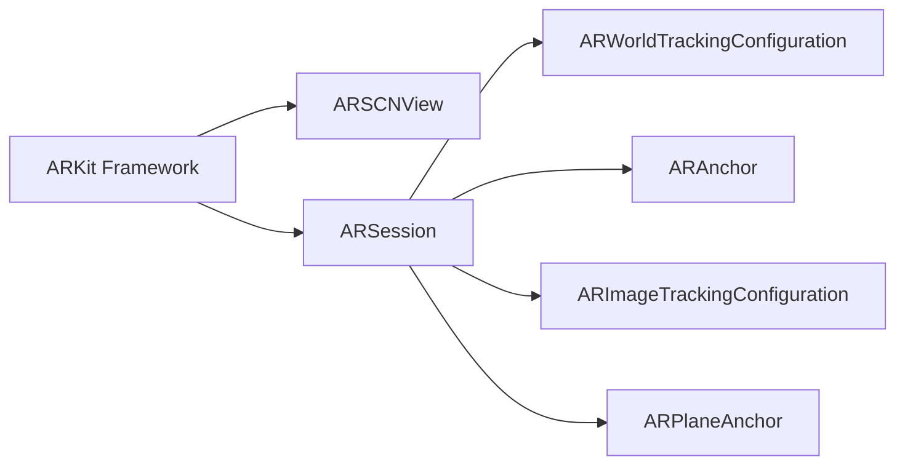

                 

# ARKit 增强现实框架优势分析：在 iOS 设备上创建逼真的 AR 体验

> 关键词：ARKit, 增强现实, iOS 设备, 逼真体验, AR 应用开发

## 1. 背景介绍

增强现实(AR)技术正以前所未有的速度进入我们的日常生活，其逼真的视觉效果和互动性为用户带来了全新的体验。苹果的ARKit是iOS设备上广泛使用的增强现实开发框架，它提供了一整套工具和API，使开发者能够轻松创建复杂的AR应用。本文将深入探讨ARKit框架的优势，分析其在iOS设备上实现逼真AR体验的关键技术和应用场景。

### 1.1 增强现实技术概述

增强现实技术通过将虚拟信息叠加到现实世界中，创造出沉浸式、交互式的体验。其核心在于利用摄像头、传感器和位置服务，对环境进行实时分析和渲染，以展现虚拟对象。增强现实技术已被广泛应用于游戏、教育、医疗、制造等多个领域，改变了人们的生活和工作方式。

### 1.2 ARKit 框架简介

ARKit是由苹果公司开发的一套增强现实SDK，专为iOS设备设计，包括iPhone、iPad和iPod touch。它利用设备的前置摄像头、陀螺仪、加速度计等传感器，以及iOS设备的高性能GPU，为用户和开发者提供了丰富的AR开发功能。ARKit框架的核心组件包括：

- **ARSCNView**：负责管理场景和渲染对象。
- **ARSession**：管理AR会话，包括环境理解和渲染。
- **ARWorldTrackingConfiguration**：配置跟踪器，实现对环境的理解。
- **ARAnchor**：锚点，用于将虚拟对象固定在物理世界中。
- **ARImageTrackingConfiguration**：图像识别和跟踪配置，用于识别和跟踪特定图像。
- **ARPlaneAnchor**：平面锚点，用于在平面上放置虚拟对象。

## 2. 核心概念与联系

### 2.1 核心概念概述

为更好地理解ARKit框架的优势和应用，本节将介绍几个关键概念：

- **ARKit框架**：苹果公司开发的增强现实SDK，提供了丰富的AR开发工具和API。
- **ARSCNView**：用于管理和渲染AR场景的视图。
- **ARAnchor**：用于将虚拟对象固定在物理世界中的锚点。
- **ARImageTrackingConfiguration**：图像识别和跟踪配置，用于识别特定图像。
- **ARPlaneAnchor**：用于在平面上放置虚拟对象的平面锚点。
- **ARWorldTrackingConfiguration**：配置跟踪器，实现对环境的理解。

### 2.2 核心概念原理和架构的 Mermaid 流程图



这个流程图展示了ARKit框架的主要组件及其之间的关系：

1. ARKit框架提供基础环境，用于管理AR场景和渲染对象。
2. ARSession管理AR会话，包括环境理解和渲染。
3. ARWorldTrackingConfiguration用于配置跟踪器，实现对环境的理解。
4. ARAnchor用于将虚拟对象固定在物理世界中。
5. ARImageTrackingConfiguration用于图像识别和跟踪。
6. ARPlaneAnchor用于在平面上放置虚拟对象。

这些组件协同工作，共同构成了ARKit框架的核心功能。

## 3. 核心算法原理 & 具体操作步骤

### 3.1 算法原理概述

ARKit框架的算法原理主要基于计算机视觉和深度学习技术，通过摄像头捕捉实时视频流，结合传感器数据和机器学习模型，对环境进行实时分析和渲染。其核心算法包括：

- **环境理解**：利用机器学习模型对环境进行分类、分割和跟踪。
- **空间映射**：通过摄像头和传感器数据，构建三维空间地图，用于虚拟对象的定位和放置。
- **图像识别**：通过深度学习模型，对特定图像进行识别和跟踪。
- **平面检测**：利用图像处理技术，检测和定位平面，用于虚拟对象的放置。

这些算法共同构成了ARKit框架的基础，使其能够实时渲染逼真的AR体验。

### 3.2 算法步骤详解

以下是使用ARKit框架进行AR应用开发的详细步骤：

**Step 1: 准备开发环境**

- 安装Xcode和ARKitSDK，配置iOS设备。
- 创建新的Xcode项目，选择ARKit应用模板。

**Step 2: 创建ARSCNView**

- 在ViewController中创建ARSCNView，用于管理AR场景。
- 配置ARWorldTrackingConfiguration，实现环境理解。
- 加载ARSession，并启动ARSession。

**Step 3: 添加虚拟对象**

- 创建ARAnchor，用于固定虚拟对象。
- 创建ARKit对象，如SCNNode，表示虚拟对象。
- 将ARKit对象设置为ARAnchor的子节点，实现虚拟对象在物理世界中的定位。

**Step 4: 渲染AR场景**

- 创建SCNScene和SCNView，用于渲染AR场景。
- 将ARKit对象添加到SCNScene中，并设置其位置和旋转。
- 渲染AR场景，将ARSceneView添加到Storyboard中。

**Step 5: 优化性能**

- 使用GPU加速渲染，优化图形渲染性能。
- 使用Z坐标和裁剪技术，优化场景渲染效率。
- 使用多线程处理，优化计算性能。

**Step 6: 应用AR交互**

- 实现用户交互，如手势识别、触摸检测等。
- 根据用户输入，实时更新虚拟对象的位置和状态。
- 实现AR应用的动态更新和优化。

### 3.3 算法优缺点

ARKit框架的优势在于其易于使用、功能丰富、性能优秀。但其也存在一些缺点：

**优点**：

- **易于使用**：ARKit框架提供了丰富的API和示例，使得开发者可以快速上手。
- **功能丰富**：支持环境理解、图像识别、平面检测等多种功能，满足复杂应用需求。
- **性能优秀**：利用iOS设备的高性能GPU和传感器，实现实时渲染和优化。

**缺点**：

- **跨平台性不足**：ARKit仅支持苹果设备，无法跨平台使用。
- **对环境要求高**：环境光照、纹理等对AR体验影响较大，需要优化。
- **依赖iOS系统**：依赖于iOS系统的更新和性能，需要持续关注系统变化。

### 3.4 算法应用领域

ARKit框架在多个领域都有广泛应用，包括但不限于：

- **游戏**：如Pokémon GO、Infinite Loop等，为用户提供沉浸式游戏体验。
- **教育**：如AR识字、AR化学等，通过虚拟对象帮助用户理解抽象概念。
- **医疗**：如手术模拟、医疗教学等，提供逼真医学场景。
- **营销**：如AR试穿、虚拟购物等，增强用户体验和互动性。
- **旅游**：如AR导览、AR旅行等，提供丰富的旅游体验。

## 4. 数学模型和公式 & 详细讲解 & 举例说明

### 4.1 数学模型构建

ARKit框架的数学模型主要基于计算机视觉和深度学习技术，包括图像处理、物体检测、空间映射等。其核心模型包括：

- **环境理解模型**：利用卷积神经网络(CNN)对环境进行分类、分割和跟踪。
- **空间映射模型**：通过摄像机位姿估计、三维重建等技术，构建三维空间地图。
- **图像识别模型**：利用CNN对特定图像进行识别和跟踪。
- **平面检测模型**：通过边缘检测、角点检测等技术，检测和定位平面。

### 4.2 公式推导过程

以图像识别模型为例，其核心公式为：

$$
y = f(x; \theta) = \sum_{i=1}^n w_i g_i(x; \theta)
$$

其中，$x$表示输入图像，$\theta$表示模型参数，$w_i$表示各层的权重，$g_i$表示各层的非线性激活函数。

在ARKit中，图像识别模型通常使用深度学习框架TensorFlow或Core ML进行实现，其具体推导过程可以参考相应框架的文档和示例代码。

### 4.3 案例分析与讲解

以下是一个简单的ARKit案例，展示如何实现AR场景和虚拟对象的放置。

```swift
import UIKit
import SceneKit
import ARKit

class ViewController: UIViewController, ARSCNViewDelegate {
    
    let sceneNode = SCNNode()
    
    override func viewDidLoad() {
        super.viewDidLoad()
        
        // 创建ARSCNView
        let view = ARSCNView(frame: view.bounds)
        view.delegate = self
        view SCNView
        
        // 创建ARSession
        let session = ARSession(config: ARWorldTrackingConfiguration())
        
        // 创建ARAnchor
        let anchor = ARAnchor()
        anchor.transform = SCNMatrix4x4MakeLookAt(SCNVector3Zero, SCNVector3Zero)
        anchor.position = SCNVector3Zero
        
        // 创建虚拟对象
        let node = SCNNode()
        node.position = SCNVector3(0, 0, 2)
        node.scale = SCNVector3(1, 1, 1)
        node.addChildNode(sceneNode)
        
        // 将虚拟对象添加到ARAnchor
        anchor.addChildNode(node)
        
        // 将ARAnchor添加到ARSession
        session.addAnchor(anchor)
        
        // 渲染AR场景
        sceneNode.addChildNode(node)
        view.scene = SCNScene()
        view.scene.rootNode = sceneNode
        
        // 设置视图层次关系
        view SCNView
        
        // 设置ARSCNView
        view SCNView
    }
    
    func view(_ view: ARSCNView, didUpdate view: SCNSceneFrame) {
        // 渲染AR场景
        view.sceneFrame SCNSceneFrame
        
        // 更新虚拟对象状态
        sceneNode.transform = view.sceneFrame.transform
    }
}
```

以上代码展示了如何创建一个AR场景，并将虚拟对象添加到ARAnchor中。在实际应用中，开发者可以根据需求调整虚拟对象的位置、大小、旋转等参数，实现更丰富的AR体验。

## 5. 项目实践：代码实例和详细解释说明

### 5.1 开发环境搭建

开发ARKit项目需要安装Xcode和ARKitSDK，并在iOS设备上配置ARKit环境。具体步骤如下：

1. 打开Xcode，创建一个新的ARKit项目。
2. 选择ARKit应用模板，配置项目名称、组织标识符等基本信息。
3. 在Storyboard中添加ARSCNView，配置ARWorldTrackingConfiguration。
4. 在ViewController中添加ARKit框架，并实现ARSession和ARAnchor。
5. 在Storyboard中添加ARKit对象，如SCNNode，表示虚拟对象。

### 5.2 源代码详细实现

以下是一个简单的ARKit项目，展示如何创建AR场景和虚拟对象。

```swift
import UIKit
import SceneKit
import ARKit

class ViewController: UIViewController, ARSCNViewDelegate {
    
    let sceneNode = SCNNode()
    
    override func viewDidLoad() {
        super.viewDidLoad()
        
        // 创建ARSCNView
        let view = ARSCNView(frame: view.bounds)
        view.delegate = self
        view SCNView
        
        // 创建ARSession
        let session = ARSession(config: ARWorldTrackingConfiguration())
        
        // 创建ARAnchor
        let anchor = ARAnchor()
        anchor.transform = SCNMatrix4x4MakeLookAt(SCNVector3Zero, SCNVector3Zero)
        anchor.position = SCNVector3Zero
        
        // 创建虚拟对象
        let node = SCNNode()
        node.position = SCNVector3(0, 0, 2)
        node.scale = SCNVector3(1, 1, 1)
        node.addChildNode(sceneNode)
        
        // 将虚拟对象添加到ARAnchor
        anchor.addChildNode(node)
        
        // 将ARAnchor添加到ARSession
        session.addAnchor(anchor)
        
        // 渲染AR场景
        sceneNode.addChildNode(node)
        view.scene = SCNScene()
        view.scene.rootNode = sceneNode
        
        // 设置视图层次关系
        view SCNView
        
        // 设置ARSCNView
        view SCNView
    }
    
    func view(_ view: ARSCNView, didUpdate view: SCNSceneFrame) {
        // 渲染AR场景
        view.sceneFrame SCNSceneFrame
        
        // 更新虚拟对象状态
        sceneNode.transform = view.sceneFrame.transform
    }
}
```

### 5.3 代码解读与分析

以上代码展示了如何创建一个AR场景，并将虚拟对象添加到ARAnchor中。在实际应用中，开发者可以根据需求调整虚拟对象的位置、大小、旋转等参数，实现更丰富的AR体验。

## 6. 实际应用场景

### 6.1 游戏

ARKit在游戏领域的应用非常广泛，如Pokémon GO、Infinite Loop等，为用户提供沉浸式游戏体验。ARKit可以通过图像识别和空间映射技术，将虚拟对象和现实环境无缝结合，提供逼真的游戏场景。

### 6.2 教育

ARKit在教育领域也有广泛应用，如AR识字、AR化学等，通过虚拟对象帮助用户理解抽象概念。ARKit可以通过图像识别和空间映射技术，将复杂抽象的概念具象化，增强用户的学习效果。

### 6.3 医疗

ARKit在医疗领域的应用包括手术模拟、医疗教学等，提供逼真医学场景。ARKit可以通过空间映射和虚拟对象技术，模拟真实的手术过程，辅助医生进行手术训练和教学。

### 6.4 营销

ARKit在营销领域也有广泛应用，如AR试穿、虚拟购物等，增强用户体验和互动性。ARKit可以通过图像识别和空间映射技术，为用户提供虚拟试穿、虚拟购物等新体验，增强用户的购买意愿。

### 6.5 旅游

ARKit在旅游领域的应用包括AR导览、AR旅行等，提供丰富的旅游体验。ARKit可以通过空间映射和虚拟对象技术，为用户提供虚拟导览、虚拟景点等新体验，增强用户的旅游体验。

## 7. 工具和资源推荐

### 7.1 学习资源推荐

为了帮助开发者系统掌握ARKit框架的使用，这里推荐一些优质的学习资源：

1. ARKit官方文档：苹果公司提供的ARKit框架官方文档，包含详细的API和使用示例。
2. ARKit视频教程：YouTube上的ARKit视频教程，适合初学者快速上手。
3. ARKit实战指南：《ARKit实战指南》一书，详细讲解了ARKit框架的使用和实践。
4. ARKit开源项目：GitHub上的ARKit开源项目，包含丰富的示例和代码。

通过对这些资源的学习实践，相信你一定能够快速掌握ARKit框架的使用，并用于解决实际的AR问题。

### 7.2 开发工具推荐

ARKit框架的开发工具包括Xcode和ARKitSDK，以下是一些常用的开发工具：

1. Xcode：苹果公司开发的IDE，支持ARKit框架开发。
2. ARKitSDK：苹果公司提供的ARKit框架SDK，支持iOS设备。
3. TensorFlow：用于实现深度学习模型的开源框架。
4. Core ML：苹果公司提供的机器学习库，支持Core ML模型。

合理利用这些工具，可以显著提升ARKit项目的开发效率，加快创新迭代的步伐。

### 7.3 相关论文推荐

ARKit框架的研究涉及计算机视觉、深度学习、增强现实等多个领域，以下是几篇奠基性的相关论文，推荐阅读：

1. A Survey on Virtual Reality and Augmented Reality（《虚拟现实和增强现实综述》）：介绍了虚拟现实和增强现实技术的发展现状和应用场景。
2. ARKit: A 3D Object Recognition App That Uses ARKit to Recognize Objects in AR Space（《ARKit：使用ARKit在AR空间中识别物体的3D对象识别应用程序》）：介绍了ARKit框架的基本原理和应用实例。
3. Real-time AR Image Recognition with ARKit（《使用ARKit进行实时AR图像识别》）：介绍了如何使用ARKit进行实时图像识别。
4. ARKit-based Augmented Reality for Enhanced Learning（《基于ARKit的增强现实教学》）：介绍了ARKit在教育领域的应用。

这些论文代表了大规模语言模型微调技术的发展脉络。通过学习这些前沿成果，可以帮助研究者把握学科前进方向，激发更多的创新灵感。

## 8. 总结：未来发展趋势与挑战

### 8.1 研究成果总结

本文对ARKit框架的优势和应用进行了全面系统的介绍，明确了ARKit框架在iOS设备上创建逼真AR体验的重要价值。通过分析ARKit的核心算法和操作步骤，展示了ARKit框架的强大功能和应用潜力。通过列举ARKit框架在多个领域的应用场景，展示了其广泛的应用前景。

### 8.2 未来发展趋势

展望未来，ARKit框架将呈现以下几个发展趋势：

1. **多设备支持**：未来ARKit框架将支持更多设备，包括iPad、iPod touch等，提供更加丰富和多样化的AR体验。
2. **跨平台支持**：未来ARKit框架可能会支持跨平台，实现跨iOS、Android等平台的AR应用。
3. **深度融合**：未来ARKit框架将与其他AR技术（如MR、VR）深度融合，提供更加丰富和沉浸式的AR体验。
4. **更丰富的API**：未来ARKit框架将提供更加丰富的API和工具，支持开发者实现更加复杂的AR应用。
5. **更好的性能优化**：未来ARKit框架将不断优化性能，支持更高分辨率、更高帧率、更逼真的渲染效果。

### 8.3 面临的挑战

尽管ARKit框架已经取得了一定的进展，但在迈向更加智能化、普适化应用的过程中，仍面临诸多挑战：

1. **对环境要求高**：ARKit框架对环境光照、纹理等要求较高，需要进行优化。
2. **跨平台性不足**：ARKit仅支持苹果设备，无法跨平台使用。
3. **依赖iOS系统**：依赖于iOS系统的更新和性能，需要持续关注系统变化。
4. **隐私和安全问题**：ARKit框架需要访问设备摄像头和传感器，可能存在隐私和安全问题。

### 8.4 研究展望

面对ARKit框架面临的挑战，未来的研究需要在以下几个方面寻求新的突破：

1. **优化性能**：优化ARKit框架的性能，支持更高分辨率、更高帧率、更逼真的渲染效果。
2. **跨平台支持**：实现ARKit框架的跨平台支持，支持iOS、Android等多平台。
3. **深度融合**：与其他AR技术深度融合，提供更加丰富和沉浸式的AR体验。
4. **隐私保护**：增强ARKit框架的隐私保护能力，确保用户数据安全。

这些研究方向的探索，必将引领ARKit框架技术迈向更高的台阶，为构建更加智能、安全、普适的AR系统铺平道路。面向未来，ARKit框架需要与其他AI技术进行更深入的融合，如计算机视觉、深度学习、机器学习等，共同推动增强现实技术的发展。

## 9. 附录：常见问题与解答

**Q1：ARKit框架的优点和缺点分别是什么？**

A: ARKit框架的优点包括易于使用、功能丰富、性能优秀等。但其也存在一些缺点，如跨平台性不足、对环境要求高、依赖iOS系统等。

**Q2：如何使用ARKit框架实现虚拟对象的放置？**

A: 使用ARKit框架实现虚拟对象的放置，需要创建ARAnchor，并将虚拟对象设置为ARAnchor的子节点。在ARSession中添加ARAnchor，并设置虚拟对象的位置和状态。

**Q3：ARKit框架在iOS设备上支持哪些传感器？**

A: ARKit框架在iOS设备上支持摄像头、陀螺仪、加速度计等传感器，用于环境理解、空间映射和图像识别。

**Q4：ARKit框架支持哪些图像识别任务？**

A: ARKit框架支持多种图像识别任务，如图像分类、对象识别、场景理解等。

**Q5：ARKit框架在教育领域有哪些应用？**

A: ARKit框架在教育领域的应用包括AR识字、AR化学、AR实验等，通过虚拟对象帮助用户理解抽象概念，增强学习效果。

以上是关于ARKit框架的优势分析和技术讲解，希望能为ARKit框架的开发者和用户提供有价值的参考和指导。

---

作者：禅与计算机程序设计艺术 / Zen and the Art of Computer Programming

