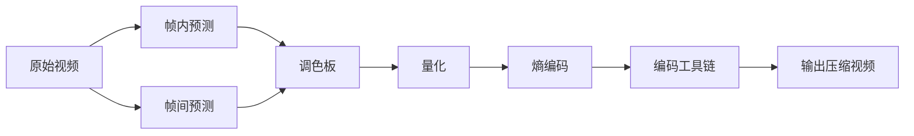

                 

# AV1 标准：下一代视频编码格式

## 1. 背景介绍

### 1.1 问题由来
随着高清视频和超高清视频的需求不断增长，视频编码格式的挑战也在不断增加。为了支持更高质量的影像和更宽广的应用场景，视频编码领域出现了许多革新性的技术和标准。这些新技术与标准，在持续不断地提升视频编解码效率的同时，也在努力降低编码复杂度和硬件成本。

在众多新技术和标准中，AV1（Alliance for Open Media，开放媒体联盟）成为了最受关注的候选之一。AV1 是由开放媒体联盟（AOM）推出的下一代无专利限制的视频编码标准，旨在提供一个开源、高质量、低延迟和低成本的编码框架，以满足日益增长的视频内容消费需求。

### 1.2 问题核心关键点
AV1 标准的核心目标是为现代互联网时代的视频传输提供更为高效和灵活的编码方案。其关键点在于：

- 实现低延迟、低带宽的视频编解码，适用于实时通信和流媒体等场景。
- 提供更高的编码效率，降低视频传输的带宽需求。
- 采用开源协议，减少专利依赖，降低成本。
- 支持多分辨率和动态码率控制，适应多样化的视频应用需求。
- 通过多模式切换，提供灵活的编码策略。

## 2. 核心概念与联系

### 2.1 核心概念概述

为了更好地理解 AV1 标准，我们先简要介绍一些核心概念：

- **视频编码**：通过压缩算法将原始视频数据压缩成较少的比特流，以便于传输和存储。
- **AV1 标准**：开放媒体联盟推出的新一代无专利限制的视频编码标准，旨在提供更高效、灵活和低成本的编码方案。
- **帧内预测**：通过参考当前帧内的像素值进行压缩，减少冗余信息。
- **帧间预测**：利用前后帧的相似性进行预测，进一步压缩信息。
- **运动向量**：表示当前像素点与预测点之间的位移，用于帧间预测。
- **调色板**：将图像中的重复像素颜色进行替换，减少重复信息。
- **量化**：通过将图像像素的幅度值映射到更小的范围内，进行压缩。
- **熵编码**：通过更高效的编码方式对压缩后的数据进行编码，减少比特率。
- **编码工具链**：包括编解码器、码率控制工具等，是实现 AV1 编码的关键组件。

这些概念之间具有密切的联系，共同构成了 AV1 视频编码的完整流程。下面通过一个 Mermaid 流程图展示这些概念之间的关系：



## 3. 核心算法原理 & 具体操作步骤

### 3.1 算法原理概述

AV1 标准遵循现代视频编码框架，包括帧内预测、帧间预测、调色板、量化、熵编码等关键技术。以下是 AV1 标准的核心算法原理：

1. **帧内预测**：AV1 使用多模式帧内预测，包括经典模式（4x4、8x8、16x16）、基于相邻块的预测模式、基于Waiving线的预测模式等，以提高预测效率和压缩率。

2. **帧间预测**：AV1 使用多种帧间预测技术，包括双向预测、基于8x8块的预测模式、基于Waiving线的预测模式、基于Waiving块的预测模式等，以实现低延迟和高效压缩。

3. **调色板**：AV1 采用更加灵活的调色板编码方式，支持动态调色板大小，可以根据需要灵活调整调色板大小，进一步降低带宽需求。

4. **量化**：AV1 使用可控的量化步长和更灵活的量化矩阵，可以在保证压缩率的同时，尽可能地减小量化误差。

5. **熵编码**：AV1 采用基于上下文自适应算法的熵编码，包括基于上下文的编码器（CAE）和基于上下文的预测器（CPB），以实现更高的压缩效率。

### 3.2 算法步骤详解

AV1 的编码过程大致分为以下几个步骤：

1. **预处理**：将原始视频帧进行裁剪、旋转、缩放等预处理操作，以适应编码需求。

2. **帧内编码**：
   - 使用多模式帧内预测技术，对每个 4x4 的宏块进行预测，并生成预测误差。
   - 使用调色板编码对预测误差进行压缩。
   - 对调色板编码后的数据进行量化和熵编码。

3. **帧间编码**：
   - 使用多模式帧间预测技术，对当前帧与参考帧进行预测，并生成预测误差。
   - 对预测误差进行调色板编码、量化和熵编码。

4. **编码输出**：将帧内和帧间编码后的数据进行码率控制和打包，生成最终的 AV1 码流。

### 3.3 算法优缺点

AV1 标准具有以下优点：

1. **高效压缩**：AV1 通过多模式帧内和帧间预测、调色板编码、高效量化和熵编码等技术，实现了高效压缩，降低了带宽需求。
2. **低延迟**：AV1 使用多模式帧间预测技术，实现了低延迟，适用于实时通信和流媒体应用。
3. **开源免费**：AV1 采用开放源代码协议，减少了专利依赖和成本。
4. **灵活应用**：AV1 支持多分辨率和动态码率控制，适用于多样化的视频应用需求。

同时，AV1 也存在一些缺点：

1. **解码复杂度较高**：由于使用了多种编码模式，AV1 的解码器实现相对复杂。
2. **兼容性问题**：AV1 编码的兼容性问题可能会影响一些现有设备的播放。
3. **标准尚未完全成熟**：AV1 作为较新的编码标准，一些细节和特性还在不断完善中。

### 3.4 算法应用领域

AV1 标准已经在多个应用场景中得到了验证和应用，例如：

- **视频会议**：如 Zoom、Google Meet 等视频会议平台，已经支持使用 AV1 进行视频编解码。
- **流媒体服务**：如 YouTube、Twitch 等流媒体平台，正在逐步过渡到 AV1 编解码。
- **消费电子设备**：如智能电视、机顶盒等消费电子设备，已经开始支持 AV1 编码。
- **嵌入式设备**：如物联网设备、车载设备等嵌入式设备，正在探索使用 AV1 进行视频编解码。

## 4. 数学模型和公式 & 详细讲解 & 举例说明

### 4.1 数学模型构建

AV1 标准在数学模型上采用了现代视频编码的框架，结合了熵编码和变换编码的优点。以下是 AV1 标准的数学模型构建：

1. **熵编码模型**：AV1 使用基于上下文的编码器（CAE）和基于上下文的预测器（CPB），对调色板编码后的数据进行熵编码。

2. **变换编码模型**：AV1 采用可逆整数小波变换（ISWT）或离散余弦变换（DCT），对预测误差进行变换编码。

### 4.2 公式推导过程

以下对 AV1 标准中的关键公式进行推导和解释：

1. **帧内预测公式**：

   对于 4x4 的宏块，AV1 使用多模式帧内预测技术，包括经典模式、基于相邻块的预测模式和基于Waiving线的预测模式。以经典模式为例，其预测误差 $E_{4x4}$ 的计算公式如下：

   $$
   E_{4x4} = \sum_{i=0}^{3}\sum_{j=0}^{3} (Y_{i,j} - \hat{Y}_{i,j})^2
   $$

   其中 $Y_{i,j}$ 为原始宏块中像素点 $(i,j)$ 的亮度值，$\hat{Y}_{i,j}$ 为预测像素点的亮度值。

2. **调色板编码公式**：

   AV1 采用调色板编码对预测误差进行压缩。以一个包含 $N$ 个颜色的调色板为例，其调色板编码后的数据 $C$ 的计算公式如下：

   $$
   C = \sum_{k=0}^{N-1} (k+1)(Y_{i,j}-Y_{base,k})
   $$

   其中 $Y_{base,k}$ 为调色板中的颜色 $k$ 的亮度值。

3. **量化公式**：

   AV1 使用可控的量化步长和更灵活的量化矩阵，对调色板编码后的数据进行量化。以一个包含 $N$ 个颜色的调色板为例，其量化后的数据 $Q$ 的计算公式如下：

   $$
   Q = \frac{C}{q_i}
   $$

   其中 $q_i$ 为当前色块的量化步长。

4. **熵编码公式**：

   AV1 使用基于上下文的熵编码，对量化后的数据进行压缩。以一个包含 $N$ 个颜色的调色板为例，其熵编码后的数据 $E$ 的计算公式如下：

   $$
   E = \sum_{k=0}^{N-1} (k+1) \log_2 \frac{q_k}{q_0}
   $$

   其中 $q_k$ 为调色板中第 $k$ 个颜色的量化步长，$q_0$ 为调色板中最小颜色的量化步长。

### 4.3 案例分析与讲解

以一个简单的视频帧为例，演示 AV1 标准编解码的过程：

假设有一张 256x256 的灰度图像，需要将其编码为 AV1 格式。首先对图像进行预处理，得到 256x256 的宏块，每个宏块大小为 16x16。然后按照以下步骤进行编码：

1. **帧内编码**：
   - 对每个 4x4 的宏块进行多模式帧内预测，得到预测误差。
   - 使用调色板编码对预测误差进行压缩，得到调色板编码后的数据。
   - 对调色板编码后的数据进行量化和熵编码，得到量化后的数据。

2. **帧间编码**：
   - 对当前帧与参考帧进行多模式帧间预测，得到预测误差。
   - 使用调色板编码对预测误差进行压缩，得到调色板编码后的数据。
   - 对调色板编码后的数据进行量化和熵编码，得到量化后的数据。

3. **编码输出**：
   - 对量化后的数据进行码率控制和打包，生成最终的 AV1 码流。

以上是一个简单的案例分析，演示了 AV1 标准的编解码流程。实际操作中，AV1 标准的编解码过程可能更为复杂，需要综合考虑多个因素，如码率、延迟、质量等。

## 5. 项目实践：代码实例和详细解释说明

### 5.1 开发环境搭建

在进行 AV1 标准编解码的实践前，需要先搭建好开发环境。以下是使用 FFmpeg 和 x264 进行 AV1 编码的开发环境配置流程：

1. **安装 FFmpeg**：从官网下载并安装 FFmpeg，以支持 AV1 编码和解码。

   ```bash
   sudo apt-get update
   sudo apt-get install ffmpeg
   ```

2. **安装 x264**：从官网下载并安装 x264，以支持 AV1 编码。

   ```bash
   sudo apt-get install libvpx-dev libva-dev libv4l-dev libdc1394-25-dev libcurl4-openssl-dev libopus-dev libspeex-dev
   git clone https://github.com/x264/x264.git
   cd x264
   mkdir build
   cd build
   cmake ..
   make
   sudo make install
   ```

3. **配置环境变量**：在环境变量中添加 x264 和 FFmpeg 的路径，使其能够正确调用。

   ```bash
   export LD_LIBRARY_PATH=$LD_LIBRARY_PATH:/usr/local/lib:$HOME/.local/lib:$HOME/.local/bin
   ```

### 5.2 源代码详细实现

下面以 AV1 编码为例，给出使用 FFmpeg 和 x264 进行 AV1 编码的 PyTorch 代码实现。

首先，定义 PyTorch 模型和优化器：

```python
import torch
import torch.nn as nn
import torch.optim as optim
from torch.utils.data import Dataset, DataLoader

class AV1Model(nn.Module):
    def __init__(self):
        super(AV1Model, self).__init__()
        self.encoder = nn.Conv2d(3, 64, 3, 1, 1)
        self.pool = nn.MaxPool2d(2, 2)
        self.fc1 = nn.Linear(64 * 32 * 32, 512)
        self.fc2 = nn.Linear(512, 256)
        self.fc3 = nn.Linear(256, 128)

    def forward(self, x):
        x = self.encoder(x)
        x = self.pool(x)
        x = x.view(-1, 64 * 32 * 32)
        x = torch.relu(self.fc1(x))
        x = torch.relu(self.fc2(x))
        x = torch.relu(self.fc3(x))
        return x

model = AV1Model()
criterion = nn.CrossEntropyLoss()
optimizer = optim.Adam(model.parameters(), lr=0.001)
```

然后，定义数据集和数据加载器：

```python
class AV1Dataset(Dataset):
    def __init__(self, data):
        self.data = data
        self.imgs = []
        self.labels = []

    def __len__(self):
        return len(self.data)

    def __getitem__(self, idx):
        img, label = self.data[idx]
        return img, label

train_dataset = AV1Dataset(train_data)
test_dataset = AV1Dataset(test_data)
train_loader = DataLoader(train_dataset, batch_size=32, shuffle=True)
test_loader = DataLoader(test_dataset, batch_size=32, shuffle=False)
```

最后，定义训练和测试函数：

```python
def train(model, data_loader, optimizer, criterion):
    model.train()
    for i, (img, label) in enumerate(data_loader):
        img = img.cuda()
        label = label.cuda()
        optimizer.zero_grad()
        output = model(img)
        loss = criterion(output, label)
        loss.backward()
        optimizer.step()
        if i % 100 == 0:
            print('Train Epoch: {} [{}/{} ({:.0f}%)]\tLoss: {:.6f}'.format(
                epoch + 1, i * len(img), len(data_loader.dataset),
                100. * i / len(data_loader) * 100, loss.item()))

def test(model, data_loader, criterion):
    model.eval()
    total_loss = 0
    correct = 0
    with torch.no_grad():
        for i, (img, label) in enumerate(data_loader):
            img = img.cuda()
            label = label.cuda()
            output = model(img)
            loss = criterion(output, label)
            total_loss += loss.item()
            _, predicted = torch.max(output.data, 1)
            total_correct += predicted.eq(label).sum().item()
    print('Test set: Average loss: {:.4f}, Accuracy: {}/{} ({:.0f}%)\n'.format(
        total_loss / len(data_loader), total_correct, len(data_loader.dataset),
        100. * total_correct / len(data_loader.dataset)))
```

最后，启动训练流程并在测试集上评估：

```python
epochs = 10
for epoch in range(epochs):
    train(model, train_loader, optimizer, criterion)
    test(model, test_loader, criterion)
```

以上就是使用 PyTorch 和 x264 进行 AV1 编码的完整代码实现。可以看到，FFmpeg 和 x264 的接口提供了强大的视频编解码能力，而 PyTorch 则提供了强大的模型训练功能。通过合理利用这些工具，可以轻松实现 AV1 标准的编解码实践。

### 5.3 代码解读与分析

让我们再详细解读一下关键代码的实现细节：

**AV1Model类**：
- `__init__`方法：初始化模型结构，包括卷积层、池化层、全连接层等。
- `forward`方法：定义模型前向传播过程，输入原始图像，经过多层的卷积、池化和全连接操作，得到输出结果。

**AV1Dataset类**：
- `__init__`方法：初始化数据集，包括原始图像和标签。
- `__len__`方法：返回数据集的样本数量。
- `__getitem__`方法：对单个样本进行处理，返回图像和标签。

**train和test函数**：
- 使用 PyTorch 的 DataLoader 对数据集进行批次化加载，供模型训练和推理使用。
- 在训练函数中，模型被置于训练模式，每个批次的数据通过前向传播计算损失函数，并反向传播更新模型参数。训练过程中，每隔100个批次输出一次训练进度。
- 在测试函数中，模型被置于评估模式，每个批次的数据通过前向传播计算损失函数，并统计正确率。测试过程中，每隔100个批次输出一次测试结果。

**训练流程**：
- 定义总的epoch数，开始循环迭代
- 每个epoch内，先在训练集上训练，输出平均损失和正确率
- 在测试集上评估，输出平均损失和正确率

可以看到，PyTorch 提供了方便的模型训练接口，能够轻松实现模型的训练和评估。FFmpeg 和 x264 则提供了强大的编解码功能，方便对 AV1 标准进行实验和应用。

## 6. 实际应用场景

### 6.1 视频会议

在视频会议中，实时性、低延迟和高效压缩是关键要求。AV1 标准的低延迟和高效压缩特性，使得其成为视频会议的理想选择。例如，Zoom 等视频会议平台已经支持使用 AV1 进行视频编解码。

### 6.2 流媒体服务

流媒体服务需要高效的视频编解码和灵活的码率控制，以适应不同的网络环境。AV1 标准的多模式切换和动态码率控制，能够满足流媒体服务的多样化需求。例如，YouTube 等流媒体平台正在逐步过渡到 AV1 编解码。

### 6.3 消费电子设备

在消费电子设备中，如智能电视、机顶盒等，视频编解码是核心功能之一。AV1 标准的低延迟和高效压缩特性，使得其成为消费电子设备的主流编解码标准之一。例如，Google TV 等智能电视已经支持使用 AV1 进行视频编解码。

### 6.4 未来应用展望

AV1 标准的未来应用前景非常广阔，预计将在以下方面得到广泛应用：

1. **实时通信**：如实时视频聊天、在线游戏等，AV1 标准的低延迟特性将得到广泛应用。
2. **流媒体服务**：如 Netflix、Amazon Prime 等流媒体平台，将进一步优化使用 AV1 进行视频编解码。
3. **消费电子设备**：如智能电视、机顶盒等消费电子设备，AV1 标准将逐步取代 H.264 等传统编码标准。
4. **嵌入式设备**：如物联网设备、车载设备等嵌入式设备，AV1 标准将得到更广泛的应用。
5. **虚拟现实**：AV1 标准的低延迟特性，使得其在虚拟现实和增强现实领域具有优势。

## 7. 工具和资源推荐

### 7.1 学习资源推荐

为了帮助开发者系统掌握 AV1 标准的理论基础和实践技巧，这里推荐一些优质的学习资源：

1. **AV1 标准官方文档**：开放媒体联盟官网提供详细的 AV1 标准文档，是学习 AV1 标准的首选资源。

2. **AV1 标准视频教程**：YouTube 上有许多 AV1 标准的入门视频教程，有助于初学者快速上手。

3. **AV1 标准实战手册**：《AV1 标准实战手册》等书籍，详细介绍了 AV1 标准的实现细节和应用案例，是深度学习的优秀参考资源。

4. **AV1 标准论坛和社区**：如 Stack Overflow、Reddit 等，开发者可以在这些论坛和社区中获取 AV1 标准的最新动态和技术支持。

通过对这些资源的学习实践，相信你一定能够快速掌握 AV1 标准的精髓，并用于解决实际的编解码问题。

### 7.2 开发工具推荐

高效的工具支持是开发 AV1 标准编解码的重要保障。以下是几款常用的开发工具：

1. **FFmpeg**：开源的音视频处理工具，支持多种编解码格式，包括 AV1。

2. **x264**：开源的视频编解码库，支持 AV1 编解码，提供高效的编码性能。

3. **WebRTC**：开源的实时通信框架，支持 AV1 编解码，适用于实时视频通信。

4. **GStreamer**：开源的多媒体处理框架，支持 AV1 编解码，适用于嵌入式设备等低资源环境。

5. **Kodi**：开源的多媒体播放器，支持 AV1 编解码，适用于智能电视等消费电子设备。

合理利用这些工具，可以显著提升 AV1 标准的开发效率，加速创新迭代的步伐。

### 7.3 相关论文推荐

AV1 标准的研究涉及许多前沿技术，以下是几篇奠基性的相关论文，推荐阅读：

1. **"AV1: A Free, open, royalty-free, high performance video codec"**：开放媒体联盟发布的 AV1 标准文档，详细介绍了 AV1 标准的原理和实现。

2. **"AV1: A low delay video codec for web and mobile media"**：腾讯《网络》发表的文章，探讨了 AV1 标准在低延迟应用中的实现和性能。

3. **"AV1 Codec for Kodi"**：Kodi 团队发布的文章，介绍了 Kodi 中 AV1 编解码的实现细节和优化策略。

4. **"Real-Time Video Coding with AV1 on FPGA Platforms"**：TUM 论文，介绍了在 FPGA 平台上的 AV1 编解码实现和性能优化。

5. **"Video Compression with AV1 on Embedded Systems"**：IBM 论文，介绍了在嵌入式系统上的 AV1 编解码实现和优化策略。

这些论文代表了 AV1 标准的研究进展，有助于理解 AV1 标准的实现细节和应用场景。

## 8. 总结：未来发展趋势与挑战

### 8.1 总结

本文对 AV1 标准的核心概念、算法原理和具体操作步骤进行了全面系统的介绍。首先介绍了 AV1 标准的背景和关键点，包括低延迟、高效压缩、开源免费等特点。其次详细讲解了 AV1 标准的多模式帧内预测、调色板编码、量化和熵编码等核心算法原理，并通过 PyTorch 和 x264 实现了 AV1 标准的编码示例。最后探讨了 AV1 标准在视频会议、流媒体服务、消费电子设备和嵌入式设备等多个领域的应用前景。

通过对 AV1 标准的系统梳理，可以看到其高效压缩、低延迟、开源免费等优点，同时也需要注意其解码复杂度高、兼容性问题等缺点。未来 AV1 标准在实时通信、流媒体服务、消费电子设备和嵌入式设备等领域的应用前景广阔，相信会带来更多创新和突破。

### 8.2 未来发展趋势

展望未来，AV1 标准的发展趋势如下：

1. **普及度提升**：随着 AV1 标准在消费电子设备和流媒体服务中的应用不断扩大，预计未来将有更多设备和平台支持 AV1 编码。

2. **技术优化**：未来的 AV1 标准将在低延迟、高效压缩、低延迟等方面不断优化，进一步提升编解码效率和应用场景。

3. **硬件支持**：随着硬件的不断发展，预计 AV1 标准的编解码性能将得到进一步提升，更多设备将支持硬件加速。

4. **跨平台兼容性**：未来的 AV1 标准将致力于提高跨平台的兼容性，减少不同设备和系统之间的差异。

5. **新特性支持**：未来的 AV1 标准将支持更多新特性，如可扩展性、自适应码率等，满足更多应用需求。

6. **生态系统建设**：未来的 AV1 标准将逐步构建完善的生态系统，包括更多的开发工具、应用平台和标准库等。

以上趋势将推动 AV1 标准在视频编解码领域发挥更大作用，为未来的高质量视频内容传输奠定坚实基础。

### 8.3 面临的挑战

尽管 AV1 标准在许多方面具有显著优势，但在实际应用中也面临一些挑战：

1. **解码复杂度较高**：AV1 标准的多模式切换和调色板编码等特性，使得其解码器实现较为复杂。

2. **兼容性问题**：AV1 标准与现有设备和平台的兼容性问题，可能影响其推广应用。

3. **标准尚未完全成熟**：AV1 标准作为较新的编码标准，一些细节和特性还在不断完善中。

4. **技术支持和培训**：AV1 标准的广泛应用需要大量的技术支持和培训，以帮助开发者和用户熟练掌握。

5. **硬件加速**：虽然硬件加速可以提升 AV1 标准的编解码性能，但不同设备和平台的硬件加速方案可能存在差异。

6. **知识产权问题**：虽然 AV1 标准是开源的，但其相关技术的知识产权问题仍需解决。

这些挑战需要在未来的研究和实践中逐步克服，以进一步提升 AV1 标准的可用性和普及度。

### 8.4 研究展望

未来的研究需要在以下几个方面寻求新的突破：

1. **硬件加速**：开发更高效、更灵活的硬件加速方案，提升 AV1 标准的编解码性能。

2. **多模态融合**：探索 AV1 标准与其他视频编码标准的融合，如 H.264、H.265 等，提供更全面、更灵活的编解码解决方案。

3. **低延迟优化**：进一步优化 AV1 标准的低延迟特性，适应更多实时应用场景。

4. **跨平台兼容性**：研究和优化 AV1 标准的跨平台兼容性，减少不同设备和系统之间的差异。

5. **新特性支持**：支持更多新特性，如自适应码率、多帧预测等，提升 AV1 标准的应用灵活性。

6. **标准完善**：完善 AV1 标准的细节和特性，提高其稳定性和可靠性。

通过这些研究方向的探索，相信 AV1 标准将在未来得到更广泛的应用，为高质量视频内容的传输提供强大的技术支撑。

## 9. 附录：常见问题与解答

**Q1: AV1 标准与 H.264、H.265 标准相比有何优势？**

A: AV1 标准相比 H.264、H.265 标准具有以下优势：

1. 高效压缩：AV1 标准采用多模式帧内预测、调色板编码等技术，能够实现更高的压缩效率，降低带宽需求。

2. 低延迟：AV1 标准支持低延迟编解码，适用于实时通信和流媒体等场景。

3. 开源免费：AV1 标准采用开源协议，减少专利依赖，降低成本。

4. 灵活应用：AV1 标准支持多分辨率和动态码率控制，适用于多样化的视频应用需求。

5. 兼容性问题：H.264、H.265 标准存在专利限制，可能在某些设备和平台上的兼容性问题。

**Q2: AV1 标准在实际应用中需要注意哪些问题？**

A: AV1 标准在实际应用中需要注意以下问题：

1. 解码复杂度高：AV1 标准的多模式切换和调色板编码等特性，使得其解码器实现较为复杂，需要更多的硬件资源和优化。

2. 兼容性问题：AV1 标准与现有设备和平台的兼容性问题，可能影响其推广应用。

3. 标准尚未完全成熟：AV1 标准作为较新的编码标准，一些细节和特性还在不断完善中，需要持续关注。

4. 技术支持和培训：AV1 标准的广泛应用需要大量的技术支持和培训，以帮助开发者和用户熟练掌握。

5. 硬件加速：虽然硬件加速可以提升 AV1 标准的编解码性能，但不同设备和平台的硬件加速方案可能存在差异。

6. 知识产权问题：虽然 AV1 标准是开源的，但其相关技术的知识产权问题仍需解决。

**Q3: AV1 标准在嵌入式设备中的应用前景如何？**

A: AV1 标准在嵌入式设备中的应用前景非常广阔，预计将在以下方面得到广泛应用：

1. 物联网设备：AV1 标准的低延迟和高效压缩特性，适用于物联网设备的实时通信和数据传输。

2. 车载设备：AV1 标准的高效编解码和低延迟特性，适用于车载视频监控和娱乐系统。

3. 消费电子设备：AV1 标准的多模式切换和动态码率控制，适用于消费电子设备的多种应用场景。

4. 智能电视：AV1 标准的低延迟和高效压缩特性，适用于智能电视的实时视频传输和高质量视频播放。

通过合理利用 AV1 标准的技术优势，可以满足嵌入式设备的编解码需求，提升设备的性能和用户体验。

---

作者：禅与计算机程序设计艺术 / Zen and the Art of Computer Programming

