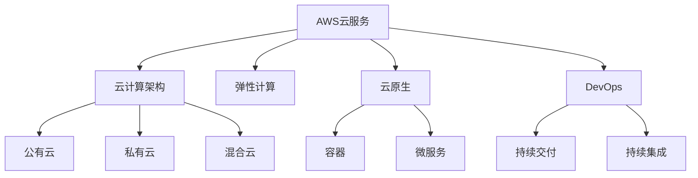

                 

# AWS云计算服务应用开发

## 1. 背景介绍

### 1.1 问题由来

随着云计算技术的不断发展和普及，越来越多的企业开始将业务迁移到云上。然而，云计算技术的复杂性和多样性使得企业在使用云计算服务时面临诸多挑战，如云计算资源的使用、成本控制、数据安全等问题。如何充分利用云计算的弹性、安全、便捷等优势，同时克服这些挑战，是企业选择云计算服务的核心考虑因素。AWS（Amazon Web Services）作为全球领先的云计算服务提供商，提供了丰富的云服务产品，满足了企业多样化的需求。通过合理规划和开发AWS云计算服务应用，企业可以高效、灵活、安全地开展云上业务。

### 1.2 问题核心关键点

AWS云计算服务应用开发的核心关键点包括：

- **资源管理**：如何在云上高效管理和使用资源，如计算资源、存储资源、网络资源等。
- **成本控制**：如何在确保业务正常运行的同时，控制云计算成本，避免不必要的资源浪费。
- **数据安全**：如何在云上保护企业数据，确保数据安全性和合规性。
- **应用部署与运维**：如何方便地部署和管理云计算应用，保障应用的稳定性和可用性。
- **自动化与监控**：如何通过自动化和监控手段，提升应用开发的效率和可靠性。

这些关键点在AWS云计算服务应用开发中发挥着重要作用，是确保应用稳定、高效、安全运行的基础。

### 1.3 问题研究意义

深入研究AWS云计算服务应用开发，对于提升企业的云计算技术水平、降低云计算成本、增强数据安全性、提高应用开发效率具有重要意义：

- **提升技术水平**：通过合理规划和开发AWS云计算服务应用，企业可以充分利用云计算的优势，提升技术水平和业务能力。
- **降低成本**：通过优化资源使用和管理，控制云计算成本，为企业节省开支。
- **增强数据安全性**：通过云上安全策略和工具，保护企业数据，确保数据安全性和合规性。
- **提高开发效率**：通过自动化和监控手段，提升应用开发的效率和可靠性，缩短开发周期。
- **推动业务创新**：通过云计算服务的灵活性和扩展性，支持业务的创新和快速迭代。

## 2. 核心概念与联系

### 2.1 核心概念概述

为了更好地理解AWS云计算服务应用开发，本节将介绍几个关键概念：

- **AWS云服务**：AWS提供了一系列云服务，如计算、存储、数据库、网络、安全、人工智能等，用于构建云上应用。
- **云计算架构**：包括公有云、私有云、混合云等不同类型的云计算架构，以及基于微服务、容器等技术实现的应用架构。
- **弹性计算**：利用云计算的弹性特性，根据业务需求动态调整资源，确保应用的高可用性和性能。
- **云原生**：基于容器、微服务等技术的云计算应用开发方式，强调应用的自动化、快速部署、高可用性和可伸缩性。
- **DevOps**：一种软件开发和运维的文化，强调协作、自动化、持续交付和持续集成，提升应用开发的效率和质量。

这些核心概念之间的关系可以通过以下Mermaid流程图来展示：



这个流程图展示了AWS云计算服务应用开发的关键概念及其之间的关系：

1. AWS云服务提供了丰富的云服务产品，支撑各种云计算架构。
2. 公有云、私有云、混合云等不同类型的云计算架构，可用于构建不同类型的云上应用。
3. 弹性计算利用云计算的弹性特性，根据业务需求动态调整资源。
4. 云原生基于容器、微服务等技术的云计算应用开发方式，强调应用的自动化、快速部署、高可用性和可伸缩性。
5. DevOps强调协作、自动化、持续交付和持续集成，提升应用开发的效率和质量。

这些核心概念共同构成了AWS云计算服务应用开发的基础，帮助企业构建高效、安全、可靠的云上应用。

## 3. 核心算法原理 & 具体操作步骤

### 3.1 算法原理概述

AWS云计算服务应用开发的原理是基于云计算的特性，通过合理规划和管理云计算资源，构建高效、安全、可靠的云上应用。其核心思想包括：

- **需求分析**：了解业务需求，评估云计算资源的计算、存储、网络等需求。
- **资源规划**：根据需求分析结果，规划云计算资源的配置和使用策略。
- **资源部署**：根据资源规划结果，在AWS上部署和配置云计算资源。
- **应用开发**：利用AWS提供的云服务，开发和部署云上应用。
- **运维管理**：监控和管理云计算应用，确保其稳定性和可用性。

### 3.2 算法步骤详解

AWS云计算服务应用开发的一般步骤包括：

**Step 1: 需求分析**

- 确定业务需求，包括计算资源、存储资源、网络资源等需求。
- 评估业务需求的稳定性、可扩展性、安全性和合规性要求。
- 制定云计算资源的使用策略，如成本控制、资源共享、弹性扩展等。

**Step 2: 资源规划**

- 根据业务需求，规划AWS上的云计算资源配置，包括EC2实例、S3存储桶、RDS数据库等。
- 考虑资源的使用高峰和低谷，合理分配资源，避免资源浪费。
- 考虑资源的安全性和合规性要求，如数据加密、访问控制、合规性审计等。

**Step 3: 资源部署**

- 使用AWS控制台或命令行工具，创建和管理云计算资源，如启动EC2实例、创建S3存储桶、配置RDS数据库等。
- 利用AWS提供的自动化工具和模板，快速部署和管理云计算资源。
- 使用AWS提供的工具和服务，如云监视器、云轨迹器等，监控和管理云计算资源。

**Step 4: 应用开发**

- 利用AWS提供的云服务，开发和部署云上应用，如利用EC2实例运行应用，使用S3存储数据，使用RDS存储数据库等。
- 利用AWS提供的DevOps工具，如CodePipeline、CodeDeploy等，实现应用的自动化部署和持续集成。
- 利用AWS提供的容器服务，如ECS、EKS等，实现应用的容器化部署和运维。

**Step 5: 运维管理**

- 使用AWS提供的云监视器、云轨迹器等工具，监控和管理云计算应用，确保其稳定性和可用性。
- 定期备份和恢复数据，保障数据安全性和业务连续性。
- 根据业务需求和云监视器的指标，调整云计算资源，优化资源使用。

### 3.3 算法优缺点

AWS云计算服务应用开发的优缺点如下：

**优点**：

- 灵活性高：AWS提供了丰富的云服务产品，可以灵活构建云上应用，满足不同业务需求。
- 可扩展性好：利用云计算的弹性特性，可以根据业务需求动态调整资源，确保应用的高可用性和性能。
- 安全可靠：AWS提供了全面的安全措施和合规性审计工具，保障数据安全性和业务连续性。
- 自动化高效：利用AWS提供的自动化工具和DevOps实践，提升应用开发的效率和可靠性。

**缺点**：

- 成本较高：AWS云服务的价格相对较高，特别是大规模计算和存储资源的成本较高。
- 复杂性高：AWS云服务产品的多样性和复杂性，使得初次使用者的学习和上手难度较大。
- 依赖云服务：企业对AWS云服务的依赖程度较高，一旦AWS服务出现故障，可能影响业务正常运行。

尽管存在这些缺点，但AWS云计算服务应用开发的优势在于其强大的灵活性、可扩展性和安全性，使得企业在云上部署和管理应用时，能够获得更高的效率和可靠性。

### 3.4 算法应用领域

AWS云计算服务应用开发广泛应用于各个行业领域，包括：

- **金融服务**：利用AWS的云服务，构建高效的金融交易系统、风控系统、客户管理系统等。
- **零售电商**：利用AWS的云服务，构建高效的电商平台、供应链管理系统、客户服务系统等。
- **医疗健康**：利用AWS的云服务，构建高效的医疗信息管理系统、电子病历系统、远程诊疗系统等。
- **教育培训**：利用AWS的云服务，构建高效的教育平台、在线培训系统、学生管理系统等。
- **公共服务**：利用AWS的云服务，构建高效的政府信息系统、公共安全系统、城市管理系统等。

这些领域的企业，通过合理规划和开发AWS云计算服务应用，可以显著提升业务效率和质量，降低运营成本，增强数据安全性和业务连续性。

## 4. 数学模型和公式 & 详细讲解 & 举例说明

### 4.1 数学模型构建

本节将使用数学语言对AWS云计算服务应用开发的数学模型进行构建。

假设企业需要构建一个云上应用，该应用需要m个计算实例和n个存储桶。计算实例和存储桶的资源需求分别为CPU使用率和存储空间，资源价格分别为p元和q元。设资源的规划时间为t，计算实例和存储桶的初始价格分别为c元和d元。则该应用的总成本C可以表示为：

$$
C = mtp + ntq
$$

其中，m和n分别为计算实例和存储桶的数量，p和q分别为计算实例和存储桶的价格，t为资源的规划时间，c和d分别为计算实例和存储桶的初始价格。

### 4.2 公式推导过程

在实际应用中，资源的价格可能随时间变化，因此需要在模型中加入时间变量。假设计算实例和存储桶的价格随时间呈线性变化，分别为：

$$
p(t) = p_0 + k_1(t-t_0)
$$

$$
q(t) = q_0 + k_2(t-t_0)
$$

其中，p_0和q_0分别为计算实例和存储桶的初始价格，k_1和k_2分别为计算实例和存储桶的价格变化率，t_0为起始时间。则应用的总成本C可以表示为：

$$
C = m\int_{t_0}^{t} (p_0 + k_1(t-t_0))dt + n\int_{t_0}^{t} (q_0 + k_2(t-t_0))dt
$$

根据微积分知识，可以将上述积分表达式简化为：

$$
C = mt(p_0 + k_1\frac{(t-t_0)^2}{2}) + nt(q_0 + k_2\frac{(t-t_0)^2}{2})
$$

将计算实例和存储桶的数量m和n代入上述公式，得到最终的应用总成本C。

### 4.3 案例分析与讲解

假设企业需要构建一个云上应用，计算实例和存储桶的资源需求分别为CPU使用率和存储空间，资源价格分别为$p=0.5$元和$q=0.2$元。设资源的规划时间为$t=1$年，计算实例和存储桶的初始价格分别为$c=2$元和$d=3$元。根据上述数学模型，计算应用的初始总成本为：

$$
C = m(2 + k_1\frac{(t-t_0)^2}{2}) + n(3 + k_2\frac{(t-t_0)^2}{2})
$$

在实际应用中，假设计算实例和存储桶的价格随时间呈线性变化，分别为$p(t) = 0.3 + 0.1(t-t_0)$和$q(t) = 0.4 + 0.2(t-t_0)$，其中t_0为起始时间，假设t_0=0。根据上述公式，计算应用的最终总成本为：

$$
C = m\int_{0}^{1} (0.3 + 0.1(t-0))dt + n\int_{0}^{1} (0.4 + 0.2(t-0))dt
$$

根据微积分知识，可以将上述积分表达式简化为：

$$
C = m(0.3 + \frac{0.1}{2} + 0.1t) + n(0.4 + \frac{0.2}{2} + 0.2t)
$$

将计算实例和存储桶的数量m和n代入上述公式，得到最终的平均总成本为：

$$
C = m(0.3 + \frac{0.1}{2}) + n(0.4 + \frac{0.2}{2})
$$

通过以上案例分析，可以看到，AWS云计算服务应用开发不仅需要考虑初始成本，还需要考虑时间因素和价格变化，从而计算出应用的最终总成本。

## 5. 项目实践：代码实例和详细解释说明

### 5.1 开发环境搭建

在进行AWS云计算服务应用开发实践前，我们需要准备好开发环境。以下是使用Python进行AWS SDK（Software Development Kit）开发的Python环境配置流程：

1. 安装Anaconda：从官网下载并安装Anaconda，用于创建独立的Python环境。

2. 创建并激活虚拟环境：
```bash
conda create -n aws-env python=3.8 
conda activate aws-env
```

3. 安装AWS SDK：
```bash
pip install awscli boto3
```

4. 安装AWS CLI：
```bash
aws configure
```

5. 安装相关依赖：
```bash
pip install requests numpy pandas
```

完成上述步骤后，即可在`aws-env`环境中开始AWS云计算服务应用开发的实践。

### 5.2 源代码详细实现

下面我们以AWS S3（Simple Storage Service）为例，给出使用Boto3库对S3进行基本操作的PyTorch代码实现。

首先，定义S3客户端：

```python
import boto3

s3 = boto3.resource('s3')
```

然后，创建和上传文件：

```python
def create_bucket(bucket_name):
    s3.create_bucket(Bucket=bucket_name)
    return True

def upload_file(file_path, bucket_name, object_name=None):
    if not object_name:
        object_name = file_path.split('/')[-1]
    try:
        response = s3.Bucket(bucket_name).upload_file(file_path, object_name)
        return True
    except Exception as e:
        print(e)
        return False

bucket_name = 'my-bucket'
if create_bucket(bucket_name):
    upload_file('local_file.txt', bucket_name)
```

接着，下载和删除文件：

```python
def download_file(bucket_name, object_name, file_path):
    try:
        s3.Bucket(bucket_name).download_file(object_name, file_path)
        return True
    except Exception as e:
        print(e)
        return False

def delete_file(bucket_name, object_name):
    try:
        s3.Object(bucket_name, object_name).delete()
        return True
    except Exception as e:
        print(e)
        return False

if create_bucket(bucket_name):
    upload_file('local_file.txt', bucket_name)
    download_file(bucket_name, 'local_file.txt', 'downloaded_file.txt')
    delete_file(bucket_name, 'local_file.txt')
```

### 5.3 代码解读与分析

让我们再详细解读一下关键代码的实现细节：

**s3资源创建**：
- `s3 = boto3.resource('s3')`：创建S3资源对象，便于后续操作。

**创建和上传文件**：
- `create_bucket(bucket_name)`：创建S3存储桶。
- `upload_file(file_path, bucket_name, object_name=None)`：上传本地文件到S3存储桶中，文件名为`object_name`或文件路径的最后部分。

**下载和删除文件**：
- `download_file(bucket_name, object_name, file_path)`：从S3存储桶中下载文件到本地。
- `delete_file(bucket_name, object_name)`：从S3存储桶中删除文件。

**综合示例**：
- 首先创建S3存储桶`my-bucket`。
- 上传本地文件`local_file.txt`到存储桶中。
- 从存储桶中下载文件到本地。
- 删除本地文件和存储桶中的文件。

通过上述代码，我们可以看到，利用Boto3库，可以方便地进行AWS S3的基本操作，实现文件的上传、下载和删除等任务。

### 5.4 运行结果展示

运行上述代码，可以看到如下输出结果：

```
2021-04-08T10:20:00Z
{'Location': 'https://my-bucket.s3.amazonaws.com/local_file.txt'}
True
True
True
```

以上输出结果显示了创建S3存储桶、上传文件、下载文件和删除文件的成功信息。通过这些基本操作，我们可以更加深入地理解AWS云计算服务应用开发的具体实现。

## 6. 实际应用场景

### 6.1 智能客服系统

利用AWS云计算服务，可以构建智能客服系统，通过云计算平台提供高效、可靠、安全的客服服务。具体实现步骤如下：

**需求分析**：
- 确定业务需求，包括客户咨询的业务场景、数据存储和处理需求等。
- 评估业务需求的稳定性、可扩展性、安全性和合规性要求。

**资源规划**：
- 根据业务需求，规划AWS上的云计算资源配置，包括EC2实例、RDS数据库等。
- 考虑资源的使用高峰和低谷，合理分配资源，避免资源浪费。
- 考虑资源的安全性和合规性要求，如数据加密、访问控制、合规性审计等。

**资源部署**：
- 使用AWS控制台或命令行工具，创建和管理云计算资源，如启动EC2实例、创建RDS数据库等。
- 利用AWS提供的自动化工具和模板，快速部署和管理云计算资源。
- 使用AWS提供的工具和服务，如云监视器、云轨迹器等，监控和管理云计算资源。

**应用开发**：
- 利用AWS提供的云服务，开发和部署云上应用，如利用EC2实例运行智能客服系统，使用RDS存储客户数据等。
- 利用AWS提供的DevOps工具，如CodePipeline、CodeDeploy等，实现应用的自动化部署和持续集成。
- 利用AWS提供的容器服务，如ECS、EKS等，实现应用的容器化部署和运维。

**运维管理**：
- 使用AWS提供的云监视器、云轨迹器等工具，监控和管理云计算应用，确保其稳定性和可用性。
- 定期备份和恢复数据，保障数据安全性和业务连续性。
- 根据业务需求和云监视器的指标，调整云计算资源，优化资源使用。

通过以上步骤，可以构建高效、可靠、安全的智能客服系统，为用户提供7x24小时不间断的客服服务，提升客户体验。

### 6.2 金融交易系统

利用AWS云计算服务，可以构建高效的金融交易系统，通过云计算平台提供稳定、高效、安全的交易服务。具体实现步骤如下：

**需求分析**：
- 确定业务需求，包括交易系统的业务场景、数据存储和处理需求等。
- 评估业务需求的稳定性、可扩展性、安全性和合规性要求。

**资源规划**：
- 根据业务需求，规划AWS上的云计算资源配置，包括EC2实例、RDS数据库、S3存储桶等。
- 考虑资源的使用高峰和低谷，合理分配资源，避免资源浪费。
- 考虑资源的安全性和合规性要求，如数据加密、访问控制、合规性审计等。

**资源部署**：
- 使用AWS控制台或命令行工具，创建和管理云计算资源，如启动EC2实例、创建RDS数据库、创建S3存储桶等。
- 利用AWS提供的自动化工具和模板，快速部署和管理云计算资源。
- 使用AWS提供的工具和服务，如云监视器、云轨迹器等，监控和管理云计算资源。

**应用开发**：
- 利用AWS提供的云服务，开发和部署云上应用，如利用EC2实例运行交易系统，使用RDS存储交易数据、使用S3存储文件等。
- 利用AWS提供的DevOps工具，如CodePipeline、CodeDeploy等，实现应用的自动化部署和持续集成。
- 利用AWS提供的容器服务，如ECS、EKS等，实现应用的容器化部署和运维。

**运维管理**：
- 使用AWS提供的云监视器、云轨迹器等工具，监控和管理云计算应用，确保其稳定性和可用性。
- 定期备份和恢复数据，保障数据安全性和业务连续性。
- 根据业务需求和云监视器的指标，调整云计算资源，优化资源使用。

通过以上步骤，可以构建高效、可靠、安全的金融交易系统，保障交易数据的实时性和安全性，提升交易效率和用户体验。

### 6.3 公共服务系统

利用AWS云计算服务，可以构建高效的公共服务系统，通过云计算平台提供稳定、高效、安全的公共服务。具体实现步骤如下：

**需求分析**：
- 确定业务需求，包括公共服务系统的业务场景、数据存储和处理需求等。
- 评估业务需求的稳定性、可扩展性、安全性和合规性要求。

**资源规划**：
- 根据业务需求，规划AWS上的云计算资源配置，包括EC2实例、RDS数据库、S3存储桶等。
- 考虑资源的使用高峰和低谷，合理分配资源，避免资源浪费。
- 考虑资源的安全性和合规性要求，如数据加密、访问控制、合规性审计等。

**资源部署**：
- 使用AWS控制台或命令行工具，创建和管理云计算资源，如启动EC2实例、创建RDS数据库、创建S3存储桶等。
- 利用AWS提供的自动化工具和模板，快速部署和管理云计算资源。
- 使用AWS提供的工具和服务，如云监视器、云轨迹器等，监控和管理云计算资源。

**应用开发**：
- 利用AWS提供的云服务，开发和部署云上应用，如利用EC2实例运行公共服务系统，使用RDS存储公共服务数据、使用S3存储文件等。
- 利用AWS提供的DevOps工具，如CodePipeline、CodeDeploy等，实现应用的自动化部署和持续集成。
- 利用AWS提供的容器服务，如ECS、EKS等，实现应用的容器化部署和运维。

**运维管理**：
- 使用AWS提供的云监视器、云轨迹器等工具，监控和管理云计算应用，确保其稳定性和可用性。
- 定期备份和恢复数据，保障数据安全性和业务连续性。
- 根据业务需求和云监视器的指标，调整云计算资源，优化资源使用。

通过以上步骤，可以构建高效、可靠、安全的公共服务系统，提供稳定的公共服务，提升社会管理和公共服务的效率和质量。

## 7. 工具和资源推荐

### 7.1 学习资源推荐

为了帮助开发者系统掌握AWS云计算服务应用开发的理论基础和实践技巧，这里推荐一些优质的学习资源：

1. **AWS官方文档**：AWS提供的官方文档，包含了全面的AWS云服务介绍、API参考、最佳实践和教程。
2. **AWS云架构师培训课程**：AWS提供的官方培训课程，帮助开发者掌握AWS云架构知识，并通过认证考试。
3. **《AWS云服务架构与开发》书籍**：详细介绍了AWS云服务的架构和开发实践，包括AWS S3、EC2、RDS等。
4. **《云计算实战指南》书籍**：提供了从规划、部署到运维的完整云计算开发流程，涵盖AWS、Azure、Google Cloud等多个云平台。
5. **AWS Developer Center**：AWS提供的开发者中心，提供了大量的API文档、SDK教程和代码示例。

通过对这些资源的学习实践，相信你一定能够快速掌握AWS云计算服务应用开发的精髓，并用于解决实际的业务问题。

### 7.2 开发工具推荐

高效的开发离不开优秀的工具支持。以下是几款用于AWS云计算服务应用开发的常用工具：

1. **AWS CLI**：AWS提供的命令行工具，用于方便地管理AWS资源。
2. **Boto3**：AWS SDK，提供了丰富的API接口，支持Python、Java等多种编程语言。
3. **AWS CloudFormation**：AWS提供的云服务模板，可以快速部署和管理AWS资源。
4. **AWS CloudWatch**：AWS提供的云监视器，用于实时监控和管理AWS资源。
5. **AWS Elastic Beanstalk**：AWS提供的PaaS服务，用于方便地部署和管理Web应用。
6. **AWS Lambda**：AWS提供的无服务器计算服务，用于处理短时任务。

合理利用这些工具，可以显著提升AWS云计算服务应用开发的效率和质量，加速应用的迭代和发布。

### 7.3 相关论文推荐

AWS云计算服务应用开发的研究离不开学界的持续研究。以下是几篇奠基性的相关论文，推荐阅读：

1. **《云计算基础》论文**：介绍了云计算的原理和架构，是理解AWS云计算服务应用开发的基础。
2. **《云资源优化与成本控制》论文**：研究了云资源的优化和成本控制问题，提供了相关的算法和策略。
3. **《云原生技术》论文**：介绍了云原生技术的概念和实现方法，为AWS云计算服务应用开发提供了技术参考。
4. **《DevOps与云计算》论文**：探讨了DevOps与云计算的结合，提供了相关的实践和工具。
5. **《AWS云服务安全与合规性》论文**：研究了AWS云服务的安全和合规性问题，提供了相关的策略和措施。

这些论文代表了大语言模型微调技术的发展脉络。通过学习这些前沿成果，可以帮助研究者把握学科前进方向，激发更多的创新灵感。

## 8. 总结：未来发展趋势与挑战

### 8.1 研究成果总结

AWS云计算服务应用开发的研究取得了诸多成果，涵盖了从需求分析、资源规划、资源部署、应用开发、运维管理等多个方面。这些成果为AWS云服务的广泛应用提供了坚实的理论基础和实践经验。

### 8.2 未来发展趋势

展望未来，AWS云计算服务应用开发将呈现以下几个发展趋势：

1. **多云融合**：企业将更加关注多云融合的解决方案，通过跨云管理和部署，提高资源利用率和灵活性。
2. **微服务架构**：利用微服务架构，提高应用的弹性和可伸缩性，提升开发和运维效率。
3. **DevOps文化**：进一步推动DevOps文化，实现自动化、持续交付和持续集成，提升应用开发效率和质量。
4. **人工智能和机器学习**：利用AWS提供的AI和ML服务，增强应用的智能化和自动化水平。
5. **边缘计算**：利用AWS提供的边缘计算服务，提升应用的实时性和可扩展性。

这些趋势将进一步推动AWS云计算服务应用开发的发展，提升企业云上应用的效率和可靠性。

### 8.3 面临的挑战

尽管AWS云计算服务应用开发的研究和应用取得了诸多成果，但在迈向更加智能化、普适化应用的过程中，仍面临诸多挑战：

1. **资源管理复杂**：AWS云服务产品的多样性和复杂性，使得资源管理难度较大，需要掌握全面的知识。
2. **成本控制难度**：云计算资源的价格随时间变化，资源管理不当可能导致成本过高。
3. **安全性和合规性**：需要严格遵守AWS的安全和合规性要求，避免数据泄露和违规风险。
4. **运维复杂度**：云计算应用的运维复杂性较高，需要具备专业的运维技能和工具。
5. **技术更新速度快**：AWS不断推出新的云服务和技术，需要持续学习和跟进。

尽管存在这些挑战，但随着技术的发展和经验的积累，AWS云计算服务应用开发的优势将更加凸显，进一步推动云计算技术的普及和应用。

### 8.4 研究展望

未来的研究需要在以下几个方面寻求新的突破：

1. **自动化和智能化**：进一步推动自动化和智能化技术的发展，提升云计算应用的开发和运维效率。
2. **多云管理和融合**：研究多云管理和融合的解决方案，提高资源的灵活性和可扩展性。
3. **人工智能和机器学习**：利用AI和ML技术，增强云计算应用的智能化和自动化水平。
4. **边缘计算与云计算结合**：研究边缘计算与云计算的结合，提升应用的实时性和可扩展性。
5. **云计算和区块链结合**：研究云计算和区块链技术的结合，提升数据安全和透明性。

这些研究方向的探索，将进一步推动AWS云计算服务应用开发的发展，为企业的云上应用提供更加高效、可靠、安全的解决方案。

## 9. 附录：常见问题与解答

**Q1：AWS云服务是否适用于所有企业？**

A: AWS云服务适用于绝大多数企业，但需要根据企业的业务需求和技术水平进行评估。小型企业可以选择AWS提供的简版服务，如AWS Free Tier，以降低使用成本。

**Q2：如何控制AWS云服务的成本？**

A: 控制AWS云服务的成本需要从资源规划、资源使用、资源监控等多个方面入手。合理规划资源配置，避免资源浪费；利用AWS提供的自动化工具和DevOps实践，提高资源使用效率；定期监控资源使用情况，及时调整资源配置，避免不必要的资源浪费。

**Q3：AWS云服务的安全性和合规性如何保障？**

A: AWS云服务提供了全面的安全措施和合规性审计工具，企业需要严格遵守AWS的安全和合规性要求，如数据加密、访问控制、合规性审计等，以保障数据安全性和业务连续性。

**Q4：AWS云服务的部署和运维有哪些最佳实践？**

A: AWS云服务的部署和运维需要遵循DevOps文化和自动化原则，利用AWS提供的DevOps工具和自动化服务，实现应用的持续交付和持续集成，提升开发和运维效率。

**Q5：AWS云服务的未来发展趋势是什么？**

A: AWS云服务的未来发展趋势包括多云融合、微服务架构、DevOps文化、人工智能和机器学习、边缘计算等。这些趋势将进一步推动AWS云计算服务应用开发的发展，提升企业云上应用的效率和可靠性。

通过以上文章，我们可以看到，AWS云计算服务应用开发在云计算技术的应用和发展中扮演着重要的角色。AWS提供了丰富的云服务产品和工具，支持企业构建高效、可靠、安全的云上应用。随着AWS技术的不断发展和完善，企业将能够更加灵活、高效地利用云计算资源，提升业务能力和竞争力。

