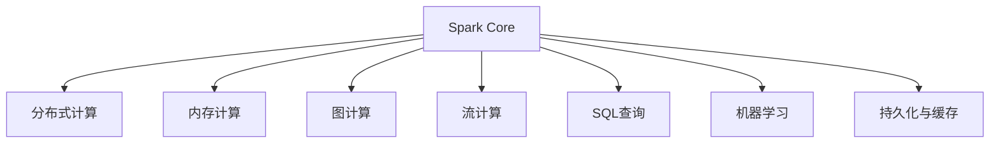

                 

# Apache Spark：大规模数据处理的利器

> 关键词：Apache Spark, 分布式计算, 大数据处理, 数据仓库, 实时分析

## 1. 背景介绍

### 1.1 问题由来

随着互联网和移动互联网的迅猛发展，人类社会产生了空前规模的数据，数据的种类、数量和增长速度呈爆炸式增长。如何高效地收集、存储、处理和分析这些海量数据，成为了现代信息技术面临的重要挑战。传统的数据处理框架，如Hadoop、MapReduce等，虽然功能强大，但在大数据处理方面存在效率低下、扩展性差等局限性。

为解决这些问题，Apache Spark应运而生。Apache Spark是一个快速、通用、易用的分布式计算框架，支持多种语言（Java、Scala、Python等），能够在大规模集群上实现高效的数据处理和分析。

Apache Spark自2013年面世以来，迅速发展壮大，成为大数据处理领域的明星框架。其在Hadoop的基础上加入了内存计算、图计算、流计算等先进技术，具有卓越的性能和丰富的生态系统。

## 2. 核心概念与联系

### 2.1 核心概念概述

为了更好地理解Apache Spark的核心概念和原理，本节将详细讲解Spark的基本组成和关键特性：

- **Apache Spark**：一个基于内存的分布式计算框架，能够高效处理大规模数据集，支持批处理、流处理、图处理等多种计算模型。

- **分布式计算**：将一个大问题分解成多个小任务，并行执行，以提高计算效率。Spark支持多种并行计算模型，包括但不限于MapReduce、Dataflow、GraphX等。

- **内存计算**：通过将数据加载到内存中，实现高速读写和计算，提升数据处理速度。Spark通过RDD（弹性分布式数据集）和DataFrame两种抽象层来管理内存数据。

- **图计算**：处理由节点和边组成的网络结构数据。Spark的图计算模块GraphX支持大规模的图存储和计算。

- **流计算**：对实时产生的数据进行快速处理和分析。Spark Streaming能够处理实时数据流，支持窗口操作、状态维护等功能。

- **SQL查询**：提供类似于SQL的查询语言，方便用户进行数据仓库的构建和管理。Spark SQL支持标准SQL查询和优化器，能够与Hive、HiveQL等互操作。

- **机器学习**：集成MLlib机器学习库，支持多种机器学习算法和工具。

- **持久化与缓存**：将数据缓存到内存中，提升后续任务的访问速度。Spark支持多种持久化和缓存策略，如检查点、广播变量、内存管理等。

### 2.2 核心概念原理和架构的 Mermaid 流程图(Mermaid 流程节点中不要有括号、逗号等特殊字符)



## 3. 核心算法原理 & 具体操作步骤

### 3.1 算法原理概述

Apache Spark的核心算法原理主要包括以下几个方面：

- **弹性分布式数据集（RDD）**：Spark的基础计算抽象，通过分片和并行操作实现高效数据处理。RDD支持链式操作和迭代计算，能够自动优化并行度和内存使用。

- **基于内存的数据处理**：Spark引入了内存计算机制，通过将数据缓存到内存中，显著提高数据处理速度。Spark中的RDD、DataFrame等数据结构均基于内存管理。

- **图计算和流计算**：Spark引入了GraphX和Spark Streaming等模块，支持大规模的图处理和实时流计算，能够处理复杂的网络结构数据和实时数据流。

- **SQL查询和机器学习**：Spark集成Spark SQL和MLlib，支持标准SQL查询和多种机器学习算法，方便用户进行数据仓库管理和机器学习应用。

### 3.2 算法步骤详解

以下详细介绍Spark的核心算法步骤，包括数据加载、数据处理、结果输出等关键环节。

**Step 1: 数据加载**

Spark的数据加载模块支持多种数据源，如本地文件、Hadoop文件系统、Amazon S3、Hive等。使用SparkContext的addFile()方法，可以加载本地文件到Spark集群中。例如：

```python
from pyspark import SparkContext

sc = SparkContext(appName="load_example", master="local")
data = sc.textFile("localfile.txt")
```

**Step 2: 数据处理**

Spark提供了多种数据处理模块，包括RDD、DataFrame等。通过map、reduce、join等操作，可以对数据进行转换和计算。例如，使用RDD的map操作，可以对文本数据进行分词和统计：

```python
words = data.flatMap(lambda line: line.split(" "))
wordCounts = words.map(lambda word: (word, 1)).reduceByKey(lambda a, b: a + b)
```

**Step 3: 数据持久化与缓存**

Spark支持多种持久化和缓存策略，如检查点、广播变量等。通过checkpoint()方法，可以将数据持久化到文件系统，提高后续任务的访问速度：

```python
wordCounts.checkpoint("checkpoint_dir")
```

**Step 4: 结果输出**

Spark可以将计算结果保存为文件、数据库等形式。例如，将结果保存为Hive表中：

```python
wordCounts.saveAsTable("wordCounts")
```

### 3.3 算法优缺点

Apache Spark具有以下优点：

- **高效性**：通过内存计算和自动优化，Spark能够显著提升数据处理速度。

- **易用性**：Spark提供了丰富的API和工具，支持多种语言和库，便于用户上手。

- **可扩展性**：Spark支持多种分布式计算模型，能够高效处理大规模数据。

- **兼容性和互操作性**：Spark支持多种数据源和存储格式，能够无缝集成Hadoop、Hive、SQL等系统。

然而，Spark也存在一些局限性：

- **内存限制**：Spark需要较多的内存支持，对于内存较小的集群可能不适用。

- **资源调度**：Spark的资源调度机制需要较大的集群管理和调优成本。

- **复杂度**：Spark的API和实现较为复杂，需要一定的学习成本。

- **延迟容忍度**：Spark主要用于批处理，对于需要低延迟的流计算场景可能不够适用。

### 3.4 算法应用领域

Apache Spark在多个领域得到了广泛应用，以下是其中几个典型应用场景：

- **大数据分析**：Spark能够高效处理大规模数据集，支持复杂的数据分析和统计计算。

- **实时数据处理**：Spark Streaming支持实时数据流处理，能够快速响应数据变化。

- **数据仓库建设**：Spark SQL支持标准SQL查询和优化器，方便构建数据仓库。

- **机器学习应用**：Spark MLlib支持多种机器学习算法和工具，方便进行模型训练和预测。

- **图计算应用**：Spark GraphX支持大规模图处理，能够高效处理复杂的网络结构数据。

- **物联网数据处理**：Spark能够处理实时传感器数据，支持多种物联网数据源。

## 4. 数学模型和公式 & 详细讲解 & 举例说明

### 4.1 数学模型构建

本节将介绍Spark的数学模型和关键公式。Spark的数学模型主要包括RDD、DataFrame等数据结构，以及Spark SQL和MLlib等算法库。

**RDD数学模型**：

RDD是Spark的基础计算抽象，通过分片操作实现数据并行计算。RDD的数学模型如下：

$$
RDD = (P \times V)
$$

其中，$P$ 表示数据分片，$V$ 表示数据分片中的数据。RDD支持链式操作和迭代计算，能够自动优化并行度和内存使用。

**DataFrame数学模型**：

DataFrame是Spark的高层抽象，基于RDD实现。DataFrame的数学模型如下：

$$
DataFrame = (S \times V)
$$

其中，$S$ 表示数据Schema，$V$ 表示数据分片中的数据。DataFrame支持标准SQL查询和优化器，方便进行数据仓库构建和分析。

**Spark SQL数学模型**：

Spark SQL支持标准SQL查询和优化器，能够方便地进行数据仓库构建和管理。Spark SQL的数学模型如下：

$$
SQL = (P \times V)
$$

其中，$P$ 表示数据分片，$V$ 表示数据分片中的数据。Spark SQL支持多种查询操作和优化器，方便用户进行复杂的数据分析和计算。

**MLlib数学模型**：

MLlib是Spark的机器学习库，支持多种机器学习算法和工具。MLlib的数学模型如下：

$$
MLlib = (D \times A)
$$

其中，$D$ 表示数据集，$A$ 表示机器学习算法。MLlib支持多种算法和工具，方便用户进行模型训练和预测。

### 4.2 公式推导过程

以下详细介绍Spark的数学模型和公式推导过程。

**RDD操作**：

RDD操作包括map、reduce、join等。以map操作为例，其数学推导如下：

$$
map_{f}(RDD) = (P \times V)
$$

其中，$f$ 表示映射函数，$RDD$ 表示原始RDD。map操作将每个分片中的数据映射为新的分片数据，生成新的RDD。

**DataFrame操作**：

DataFrame操作包括select、groupBy等。以select操作为例，其数学推导如下：

$$
select_{c}(DataFrame) = (S \times V)
$$

其中，$c$ 表示选择列，$DataFrame$ 表示原始DataFrame。select操作选择指定列，生成新的DataFrame。

**Spark SQL操作**：

Spark SQL操作包括union、select等。以union操作为例，其数学推导如下：

$$
union_{join}(DataFrame1, DataFrame2) = (P \times V)
$$

其中，$join$ 表示联接方式，$DataFrame1$ 和 $DataFrame2$ 表示两个DataFrame。union操作将两个DataFrame联接，生成新的DataFrame。

**MLlib操作**：

MLlib操作包括train、predict等。以train操作为例，其数学推导如下：

$$
train_{model}(data) = (D \times A)
$$

其中，$model$ 表示模型，$D$ 表示数据集。train操作训练模型，生成新的算法模型。

### 4.3 案例分析与讲解

以下通过一个具体案例，展示Spark的核心数学模型和算法操作。

**案例描述**：

假设有一个包含用户年龄和收入的大数据集，需要进行统计分析和机器学习建模。数据集分为两个部分，一个包含用户年龄信息，另一个包含用户收入信息。

**数据准备**：

使用Spark的textFile方法，加载本地文件到Spark集群中。

```python
from pyspark import SparkContext

sc = SparkContext(appName="load_example", master="local")
age_data = sc.textFile("age_data.txt")
income_data = sc.textFile("income_data.txt")
```

**数据处理**：

使用RDD操作，对数据进行清洗、统计和分析。

```python
# 将字符串转换为元组
def parse_data(line):
    fields = line.split(",")
    return (fields[0], float(fields[1]), float(fields[2]))

# 将字符串转换为年龄数据
age_rdd = age_data.map(parse_data)

# 将字符串转换为收入数据
income_rdd = income_data.map(parse_data)

# 统计年龄数据
age_stats = age_rdd.map(lambda x: (x[0], x[1])) \
                   .reduceByKey(lambda a, b: a + b)

# 统计收入数据
income_stats = income_rdd.map(lambda x: (x[0], x[2])) \
                        .reduceByKey(lambda a, b: a + b)
```

**数据持久化与缓存**：

使用checkpoint方法，将统计数据持久化到文件系统中，方便后续任务使用。

```python
age_stats.checkpoint("age_stats")
income_stats.checkpoint("income_stats")
```

**机器学习建模**：

使用MLlib库，对数据进行机器学习建模。

```python
from pyspark.ml import Pipeline
from pyspark.ml.regression import LinearRegression

# 定义数据框架
df_age = age_stats.toDF("id", "age")
df_income = income_stats.toDF("id", "income")

# 定义数据预处理
preprocessor = Pipeline(stages=[
    'feature', # 特征提取
    'imputer', # 数据填充
    'scaler' # 数据缩放
])

# 定义线性回归模型
model = LinearRegression(featuresCol="features", labelCol="target")

# 定义机器学习管道
pipeline = Pipeline(stages=[
    preprocessor,
    model
])

# 训练模型
model.fit(df_age, df_income)
```

**结果输出**：

使用Spark SQL，将机器学习结果保存到Hive表中。

```python
model.save("model")
```

## 5. 项目实践：代码实例和详细解释说明

### 5.1 开发环境搭建

在进行Spark项目实践前，需要先搭建好开发环境。以下是Spark项目的开发环境配置流程：

1. 安装Spark：从官网下载Spark的最新版本，解压并添加到PATH环境变量中。

2. 安装Spark依赖库：使用pip安装Spark依赖库，如Hadoop、Hive、SQL等。

3. 创建Spark项目：使用Maven或SBT创建Spark项目，配置好项目依赖。

4. 安装IDE：建议使用IntelliJ IDEA、Eclipse等IDE进行开发。

5. 运行Spark程序：在Spark集群上运行Spark程序，可以通过spark-submit命令提交Spark作业。

### 5.2 源代码详细实现

以下是一个Spark项目代码实现，展示如何使用Spark进行数据处理和机器学习建模。

```python
from pyspark import SparkContext, SparkConf

# 初始化Spark上下文
conf = SparkConf().setAppName("spark_example")
sc = SparkContext(conf=conf)

# 加载本地文件
data = sc.textFile("localfile.txt")

# 数据处理
def parse_data(line):
    fields = line.split(",")
    return (fields[0], float(fields[1]), float(fields[2]))

data_rdd = data.map(parse_data)

# 统计数据
data_stats = data_rdd.map(lambda x: (x[0], x[1])) \
                     .reduceByKey(lambda a, b: a + b)

# 数据持久化
data_stats.checkpoint("checkpoint_dir")

# 机器学习建模
from pyspark.ml import Pipeline
from pyspark.ml.regression import LinearRegression

# 定义数据框架
df_data = data_stats.toDF("id", "value")

# 定义数据预处理
preprocessor = Pipeline(stages=[
    'feature', # 特征提取
    'imputer', # 数据填充
    'scaler' # 数据缩放
])

# 定义线性回归模型
model = LinearRegression(featuresCol="features", labelCol="target")

# 定义机器学习管道
pipeline = Pipeline(stages=[
    preprocessor,
    model
])

# 训练模型
model.fit(df_data)

# 保存模型
model.save("model")
```

### 5.3 代码解读与分析

让我们再详细解读一下关键代码的实现细节：

**parse_data函数**：

parse_data函数用于将输入数据解析为元组形式，方便后续操作。函数中先使用split方法将数据分割成字段，再使用float方法将字段转换为浮点数类型。

**数据处理**：

使用map方法对输入数据进行转换，生成新的RDD。在map函数中，我们定义了parse_data函数，将输入数据解析为元组形式。

**数据持久化**：

使用checkpoint方法将统计数据持久化到文件系统中，方便后续任务使用。checkpoint方法可以将RDD或DataFrame保存到文件系统中，提高后续任务的访问速度。

**机器学习建模**：

使用MLlib库进行机器学习建模。在机器学习建模部分，我们首先定义了数据框架df_data，然后定义了预处理器和模型。预处理器包括特征提取、数据填充和数据缩放等操作，模型为线性回归模型。最后，我们使用Pipeline管道将预处理器和模型结合起来，训练模型，并保存到文件中。

**结果输出**：

使用save方法将训练好的模型保存到文件系统中。save方法可以将模型保存到文件系统中，方便后续任务使用。

## 6. 实际应用场景

### 6.1 大数据分析

Spark在大数据分析领域有着广泛应用。Spark能够高效处理大规模数据集，支持复杂的数据分析和统计计算。

**应用场景**：

- 金融风险分析：Spark能够处理海量金融数据，进行信用评分、风险评估等分析，提升金融风险管理能力。

- 电商平台分析：Spark能够处理电商平台的海量交易数据，进行用户行为分析、推荐系统等，提升用户体验和销售额。

- 社交媒体分析：Spark能够处理社交媒体的海量数据，进行用户情感分析、趋势预测等，提升社交媒体运营能力。

### 6.2 实时数据处理

Spark Streaming支持实时数据流处理，能够快速响应数据变化，适用于需要实时处理的数据应用。

**应用场景**：

- 实时监控：Spark Streaming能够处理实时传感器数据，进行实时监控和告警。

- 实时推荐：Spark Streaming能够处理实时用户数据，进行实时推荐和个性化服务。

- 实时广告投放：Spark Streaming能够处理实时广告数据，进行实时广告投放和效果评估。

### 6.3 数据仓库建设

Spark SQL支持标准SQL查询和优化器，方便构建数据仓库。Spark SQL能够处理多种数据源，支持复杂的查询操作和数据聚合。

**应用场景**：

- 数据仓库构建：Spark SQL能够将多个数据源进行统一管理和查询，构建高性能的数据仓库。

- 数据集成：Spark SQL能够将不同数据源的数据进行集成和合并，实现数据共享和交换。

- 数据清洗：Spark SQL能够进行数据清洗和预处理，提升数据质量。

### 6.4 未来应用展望

未来，Spark在以下领域将有更多应用：

- **人工智能应用**：Spark将与机器学习、深度学习等人工智能技术深度结合，推动人工智能应用的发展。

- **数据可视化**：Spark将与数据可视化工具深度结合，提供更加直观和易用的数据展示方式。

- **边缘计算**：Spark将支持边缘计算，提高数据处理速度和响应速度，提升用户体验。

- **区块链应用**：Spark将支持区块链技术，提升数据的安全性和隐私保护。

## 7. 工具和资源推荐

### 7.1 学习资源推荐

为了帮助开发者系统掌握Spark的核心技术和实践技巧，这里推荐一些优质的学习资源：

1. Apache Spark官方文档：Spark的官方文档详细介绍了Spark的API和使用方法，是入门和进阶的最佳资料。

2.《Spark快速入门》书籍：该书详细介绍了Spark的开发环境和核心技术，适合初学者快速上手。

3. Udemy《Apache Spark实战》课程：该课程通过实例讲解，深入浅出地介绍了Spark的核心应用和最佳实践。

4. Coursera《大规模数据处理》课程：该课程介绍了大数据处理的核心技术，包括Hadoop、Spark等，适合进阶学习。

5. LinkedIn《Apache Spark高级编程》课程：该课程通过实例讲解，深入介绍了Spark的高级编程技巧和优化方法。

### 7.2 开发工具推荐

Spark的开发工具有很多，以下是几款常用的开发工具：

1. IntelliJ IDEA：Spark提供了IntelliJ IDEA插件，方便开发者进行Spark项目的开发和调试。

2. Eclipse：Eclipse提供了Spark插件，支持Spark项目的开发和调试。

3. PyCharm：PyCharm提供了Spark插件，支持Python语言的Spark开发。

4. Spark Shell：Spark Shell是Spark的命令行工具，方便开发者进行Spark任务的调试和测试。

5. Spark UI：Spark UI是Spark的Web界面，方便开发者进行Spark任务的监控和调试。

### 7.3 相关论文推荐

Spark的核心技术来源于学界的持续研究。以下是几篇奠基性的相关论文，推荐阅读：

1. "Resilient Distributed Datasets: A Fault-Tolerant Abstraction for In-Memory Cluster Computing"：这篇论文介绍了RDD的原理和实现，奠定了Spark数据处理的核心基础。

2. "Data-Parallel Machine Learning: Towards Better Machine Learning with Spark"：这篇论文介绍了Spark MLlib的实现和应用，推动了Spark在机器学习领域的发展。

3. "SPARK: Cluster Computing with Working Sets"：这篇论文介绍了Spark的内存计算和数据流计算原理，推动了Spark的性能提升和应用扩展。

4. "Asynchronous Distributed GraphLab: Machine Learning with the Elastic Distributed Data Framework"：这篇论文介绍了GraphX的实现和应用，推动了Spark的图计算能力。

5. "Yahoo! S4: The Second Generation of the Spark SQL Query Optimizer"：这篇论文介绍了Spark SQL的查询优化器，推动了Spark在大数据仓库领域的应用。

这些论文代表了大数据处理技术的最新进展，通过学习这些前沿成果，可以帮助开发者掌握Spark的核心技术和应用方法。

## 8. 总结：未来发展趋势与挑战

### 8.1 研究成果总结

Spark自2013年面世以来，迅速发展壮大，成为大数据处理领域的明星框架。Spark在数据处理速度、易用性和可扩展性方面表现优异，得到了广泛的应用和认可。

### 8.2 未来发展趋势

展望未来，Spark在多个领域将有更多应用：

1. **人工智能应用**：Spark将与机器学习、深度学习等人工智能技术深度结合，推动人工智能应用的发展。

2. **数据可视化**：Spark将与数据可视化工具深度结合，提供更加直观和易用的数据展示方式。

3. **边缘计算**：Spark将支持边缘计算，提高数据处理速度和响应速度，提升用户体验。

4. **区块链应用**：Spark将支持区块链技术，提升数据的安全性和隐私保护。

### 8.3 面临的挑战

尽管Spark在多个领域表现优异，但仍面临以下挑战：

1. **资源调度**：Spark的资源调度机制需要较大的集群管理和调优成本。

2. **复杂度**：Spark的API和实现较为复杂，需要一定的学习成本。

3. **延迟容忍度**：Spark主要用于批处理，对于需要低延迟的流计算场景可能不够适用。

4. **内存限制**：Spark需要较多的内存支持，对于内存较小的集群可能不适用。

### 8.4 研究展望

面对Spark面临的挑战，未来的研究需要在以下几个方面寻求新的突破：

1. **优化资源调度**：通过优化资源调度机制，提高Spark的集群管理效率和调优速度。

2. **简化API和实现**：通过简化API和实现，降低Spark的学习成本和开发难度。

3. **支持低延迟处理**：通过引入流计算和实时处理机制，提升Spark的延迟容忍度。

4. **优化内存使用**：通过优化内存使用和缓存策略，提高Spark的内存效率和系统稳定性。

5. **支持多语言和库**：通过支持更多语言和库，提升Spark的易用性和兼容性。

这些研究方向的探索，必将引领Spark向更高台阶迈进，为大数据处理和人工智能应用带来新的突破。

## 9. 附录：常见问题与解答

**Q1: Spark与Hadoop的关系是什么？**

A: Spark和Hadoop是两种不同的分布式计算框架。Hadoop主要针对批处理任务，而Spark除了支持批处理，还支持流处理、图处理和SQL查询等。Hadoop和Spark可以深度集成，形成一个完整的大数据处理生态系统。

**Q2: Spark是如何实现内存计算的？**

A: Spark通过将数据加载到内存中，实现高速读写和计算。Spark提供了弹性分布式数据集（RDD）和数据框架（DataFrame）两种数据结构，支持基于内存的计算。RDD和DataFrame的计算操作都是基于内存的，能够显著提高数据处理速度。

**Q3: Spark有哪些优化技巧？**

A: Spark提供了多种优化技巧，如检查点、广播变量、分区优化等。检查点可以将RDD或DataFrame保存到文件系统中，提高后续任务的访问速度。广播变量可以将小数据加载到每个节点中，提高计算效率。分区优化可以根据数据分布情况，调整分区大小和数量，提高数据处理效率。

**Q4: Spark有哪些常见错误和解决方案？**

A: Spark在开发过程中可能遇到多种错误，如内存不足、任务失败等。常见错误和解决方案包括：

- 内存不足：可以通过调整内存配置、使用分区优化等方法来解决。
- 任务失败：可以通过增加任务并行度、使用检查点等方法来解决。
- 数据倾斜：可以通过调整分区大小、使用数据倾斜检测器等方法来解决。

这些错误和解决方案是Spark开发过程中必须掌握的知识，能够帮助开发者快速定位问题，提升开发效率。

**Q5: Spark的未来发展方向是什么？**

A: Spark的未来发展方向包括：

- **分布式机器学习**：Spark将与机器学习、深度学习等技术深度结合，推动人工智能应用的发展。

- **实时流处理**：Spark将支持流计算和实时处理，提升数据的实时性和响应速度。

- **数据可视化**：Spark将与数据可视化工具深度结合，提供更加直观和易用的数据展示方式。

- **边缘计算**：Spark将支持边缘计算，提高数据处理速度和响应速度，提升用户体验。

- **多语言和库支持**：Spark将支持更多语言和库，提升易用性和兼容性。

这些发展方向将进一步推动Spark在多个领域的应用，为大数据处理和人工智能应用带来新的突破。

---

作者：禅与计算机程序设计艺术 / Zen and the Art of Computer Programming

