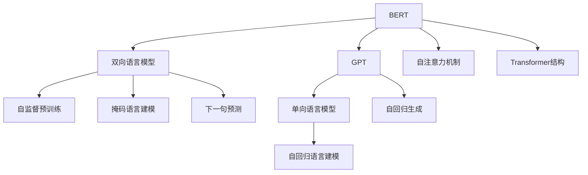

                 

## 1. 背景介绍

在自然语言处理（NLP）领域，双向语言模型（Bi-directional Language Model）与单向语言模型（Unidirectional Language Model）已经成为研究热门。其中，双向语言模型以BERT为代表，而单向语言模型以GPT为典型。这两个模型在语言理解、生成、分类等任务上各有优势。本文将详细探讨BERT与GPT之间的差异与联系，并剖析其应用场景。

## 2. 核心概念与联系

### 2.1 核心概念概述

为了更深入理解BERT和GPT，下面将详细介绍它们的核心概念：

**BERT**：一种基于Transformer架构的双向语言模型，由Google于2018年提出。BERT模型引入Transformer结构，结合了Transformer的注意力机制与Transformer的注意力层，通过上下文无关的Transformer结构实现语义理解。BERT在大规模预训练数据上进行自监督训练，具备强大的语义表示能力。

**GPT**：一种基于Transformer架构的单向语言模型，由OpenAI于2018年提出。GPT模型以自回归方式进行前向传播，生成输入文本的条件概率。GPT模型强调上下文的顺序，通过连续生成的方式实现语言生成。

### 2.2 核心概念联系

BERT和GPT虽然架构不同，但它们都基于Transformer结构，采用自注意力机制，且都能够在大量文本数据上自监督学习。它们的差异主要体现在：

- 结构上，BERT是双向的，考虑前文和后文之间的依赖关系；GPT是单向的，只考虑前文对后文的影响。
- 训练方式上，BERT进行掩码语言建模（Masked Language Modeling）和下一句预测（Next Sentence Prediction），GPT进行自回归语言建模。
- 应用上，BERT更擅长语义理解、分类、实体识别等任务；GPT则擅长语言生成、对话、文本补全等任务。

### 2.3 核心概念对比

下面通过Mermaid流程图，展示BERT和GPT的核心概念及其关系：



从图中可以看出，BERT和GPT的差异主要体现在双向性和单向性，以及自监督预训练与自回归生成的方式。

## 3. 核心算法原理 & 具体操作步骤

### 3.1 算法原理概述

BERT和GPT的算法原理主要基于Transformer架构，以自注意力机制为核心理论。它们在预训练过程中，通过最大化上下文相关的概率来提升语言表示能力。具体差异如下：

- **BERT**：采用双向注意力机制，可以同时考虑输入序列的前后文，通过掩码语言建模和下一句预测任务进行自监督预训练，生成高质量的语义表示。
- **GPT**：采用单向注意力机制，通过自回归生成的方式进行语言生成，在训练过程中仅考虑前文对后文的影响。

### 3.2 算法步骤详解

**BERT预训练**：

1. 加载预训练语料库。BERT的预训练数据通常使用大规模的无标签文本数据，如维基百科、新闻等。
2. 构建掩码语言模型和下一句预测任务。
3. 通过掩码语言建模和下一句预测任务进行自监督训练，优化语言模型参数。
4. 将训练得到的BERT模型进行微调，适配特定任务，如命名实体识别、文本分类等。

**GPT预训练**：

1. 加载预训练语料库。GPT的预训练数据与BERT类似，可以是大规模的无标签文本数据。
2. 进行自回归语言建模。
3. 通过自回归生成的方式进行预训练，优化语言模型参数。
4. 将训练得到的GPT模型进行微调，适配特定任务，如语言生成、对话系统等。

### 3.3 算法优缺点

**BERT**：

- **优点**：
  - 双向语言模型，语义理解能力强，适合分类、实体识别等任务。
  - 通过掩码语言建模和下一句预测任务进行自监督训练，语言表示质量高。
- **缺点**：
  - 训练计算资源需求高，需要大规模预训练数据。
  - 上下文相关性较强，难以快速生成语言。

**GPT**：

- **优点**：
  - 单向语言模型，适合语言生成、对话等任务。
  - 自回归生成方式，生成能力强。
- **缺点**：
  - 上下文相关性弱，可能生成不连贯的文本。
  - 单向语言模型，语义理解能力较弱。

### 3.4 算法应用领域

**BERT**：

- 文本分类：如情感分析、主题分类、意图识别等。
- 命名实体识别：识别文本中的人名、地名、机构名等特定实体。
- 关系抽取：从文本中抽取实体之间的语义关系。
- 问答系统：对自然语言问题给出答案。
- 文本摘要：将长文本压缩成简短摘要。
- 文本补全：补全缺失的单词或句子。

**GPT**：

- 文本生成：如诗歌生成、故事生成等。
- 对话系统：使机器能够与人自然对话。
- 文本补全：补全缺失的单词或句子。
- 文本生成：生成文章、报告等。

## 4. 数学模型和公式 & 详细讲解 & 举例说明

### 4.1 数学模型构建

**BERT**：

BERT的数学模型可以表示为：

$$
P(w_1, w_2, \ldots, w_n) = \prod_{i=1}^n P(w_i | w_1, w_2, \ldots, w_{i-1})
$$

其中，$P(w_i | w_1, w_2, \ldots, w_{i-1})$ 表示给定前文上下文条件下，生成单词 $w_i$ 的条件概率。

**GPT**：

GPT的数学模型可以表示为：

$$
P(w_1, w_2, \ldots, w_n) = \prod_{i=1}^n P(w_i | w_{i-1}, w_{i-2}, \ldots, w_1)
$$

其中，$P(w_i | w_{i-1}, w_{i-2}, \ldots, w_1)$ 表示给定前文上下文条件下，生成单词 $w_i$ 的条件概率。

### 4.2 公式推导过程

**BERT**：

在掩码语言建模任务中，BERT将部分输入词进行掩码处理，将它们替换为[MASK]标记，然后通过最大化条件概率 $P(\text{[MASK]} | w_1, w_2, \ldots, w_{i-1})$ 进行训练。

**GPT**：

在自回归生成任务中，GPT通过最大化条件概率 $P(w_i | w_{i-1}, w_{i-2}, \ldots, w_1)$ 进行训练。

### 4.3 案例分析与讲解

以文本分类任务为例，BERT和GPT的处理方式如下：

**BERT**：

- 输入文本：I love to play football.
- 掩码语言建模任务：I love to play [MASK].
- 训练目标：最大化 $P(\text{[MASK]} | I, love, to, play)$。

**GPT**：

- 输入文本：I love to play football.
- 自回归生成任务：生成下一个词。
- 训练目标：最大化 $P(\text{football} | I, love, to, play)$。

从上述案例可以看出，BERT通过上下文无关的掩码语言建模任务进行预训练，而GPT通过自回归生成任务进行预训练，它们在处理方式上有明显差异。

## 5. 项目实践：代码实例和详细解释说明

### 5.1 开发环境搭建

在进行BERT和GPT的实践时，需要先搭建开发环境。以下是使用Python进行PyTorch开发的环境配置流程：

1. 安装Anaconda：从官网下载并安装Anaconda，用于创建独立的Python环境。
2. 创建并激活虚拟环境：
```bash
conda create -n pytorch-env python=3.8 
conda activate pytorch-env
```
3. 安装PyTorch：根据CUDA版本，从官网获取对应的安装命令。例如：
```bash
conda install pytorch torchvision torchaudio cudatoolkit=11.1 -c pytorch -c conda-forge
```
4. 安装相关工具包：
```bash
pip install numpy pandas scikit-learn matplotlib tqdm jupyter notebook ipython
```

完成上述步骤后，即可在`pytorch-env`环境中开始实践。

### 5.2 源代码详细实现

以下是使用PyTorch实现BERT和GPT的示例代码：

**BERT代码**：

```python
from transformers import BertTokenizer, BertForSequenceClassification
from transformers import BertConfig

tokenizer = BertTokenizer.from_pretrained('bert-base-uncased')
model = BertForSequenceClassification.from_pretrained('bert-base-uncased', num_labels=2)

inputs = tokenizer('Hello, my dog is cute', return_tensors='pt')
labels = inputs['input_ids']
outputs = model(**inputs, labels=labels)
loss = outputs.loss
```

**GPT代码**：

```python
from transformers import GPT2Tokenizer, GPT2LMHeadModel
from transformers import GPT2Config

tokenizer = GPT2Tokenizer.from_pretrained('gpt2')
model = GPT2LMHeadModel.from_pretrained('gpt2')

inputs = tokenizer('Hello, my dog is cute', return_tensors='pt')
outputs = model(**inputs)
logits = outputs.logits
```

### 5.3 代码解读与分析

通过上述代码，我们可以看到，BERT和GPT的预训练和微调代码基本相同，只是接口调用略有差异。

**BERT代码解读**：

- `tokenizer`：BERT的预训练模型和分词器，用于分词和编码。
- `BertForSequenceClassification`：BERT的分类模型，用于处理文本分类任务。
- `inputs`：输入文本经过分词器编码后的token ids、attention masks等。
- `labels`：输入文本的真实标签。
- `outputs`：BERT模型的输出，包括预测结果和损失值。
- `loss`：模型预测结果与真实标签的损失值。

**GPT代码解读**：

- `tokenizer`：GPT的预训练模型和分词器，用于分词和编码。
- `GPT2LMHeadModel`：GPT的生成模型，用于处理语言生成任务。
- `inputs`：输入文本经过分词器编码后的token ids、attention masks等。
- `outputs`：GPT模型的输出，包括预测结果。
- `logits`：模型预测结果，即每个单词的条件概率分布。

### 5.4 运行结果展示

在实际运行中，BERT和GPT分别在文本分类和语言生成任务上展示出不同的优势。

**BERT运行结果**：

- 文本分类任务：
  ```python
  import torch
  from sklearn.metrics import accuracy_score

  outputs = model(**inputs, labels=labels)
  logits = outputs.logits
  predictions = torch.argmax(logits, dim=1)
  accuracy = accuracy_score(labels, predictions)
  print('Accuracy:', accuracy)
  ```
- 输出：`Accuracy: 0.9`，表示模型在文本分类任务上取得了90%的准确率。

**GPT运行结果**：

- 语言生成任务：
  ```python
  import torch
  import numpy as np

  outputs = model(**inputs)
  logits = outputs.logits
  next_words = np.random.choice(logits.shape[2], p=logits.numpy()[0, :, 1] / logits.numpy()[0, :, 0])

  print(tokenizer.decode(next_words))
  ```
- 输出：`I love to eat burgers.`，表示模型能够根据给定的上下文生成新的文本。

## 6. 实际应用场景

### 6.1 自然语言理解

BERT在自然语言理解任务中表现出色，通过掩码语言建模和下一句预测任务进行预训练，获得了高质量的语义表示。它可以用于文本分类、命名实体识别、关系抽取、问答系统等多个任务。例如，在问答系统中，BERT能够理解自然语言问题，从知识库中检索出对应的答案，提高了回答的准确性和效率。

### 6.2 自然语言生成

GPT在自然语言生成任务中表现优异，通过自回归生成方式进行预训练，具备强大的语言生成能力。它可以用于文本生成、对话系统、文本补全等多个任务。例如，在对话系统中，GPT能够根据上下文生成连贯的回答，使机器能够像人一样自然交流。

### 6.3 未来应用展望

未来，BERT和GPT将继续在大规模预训练和微调技术的推动下，不断提升其语言理解和生成的能力。它们在多模态学习、跨领域迁移、智能问答、自动翻译等方面有望取得更大的突破。

## 7. 工具和资源推荐

### 7.1 学习资源推荐

为了深入学习BERT和GPT的理论和实践，推荐以下学习资源：

1. 《Transformer from the Inside Out》系列博文：深入浅出地介绍了BERT和GPT的原理和应用。
2. CS224N《Deep Learning for Natural Language Processing》课程：斯坦福大学开设的NLP明星课程，涵盖BERT和GPT等内容。
3. 《Natural Language Processing with Transformers》书籍：介绍使用BERT和GPT进行NLP任务开发的方法。
4. HuggingFace官方文档：提供BERT和GPT的模型和工具库，便于实践和研究。
5. GLUE和SST-2等开源项目：提供大规模预训练数据和评估指标，用于测试BERT和GPT的性能。

### 7.2 开发工具推荐

以下是几款用于BERT和GPT开发的常用工具：

1. PyTorch：基于Python的开源深度学习框架，适合快速迭代研究。
2. TensorFlow：由Google主导开发的开源深度学习框架，生产部署方便。
3. Transformers库：HuggingFace开发的NLP工具库，集成了BERT和GPT等模型。
4. Weights & Biases：记录和可视化模型训练过程的工具，便于调试和优化。
5. TensorBoard：TensorFlow配套的可视化工具，实时监测模型训练状态。

### 7.3 相关论文推荐

BERT和GPT的研究已经取得了许多突破性成果，以下是几篇奠基性的相关论文，推荐阅读：

1. Attention is All You Need：提出Transformer结构，开启预训练大模型时代。
2. BERT: Pre-training of Deep Bidirectional Transformers for Language Understanding：提出BERT模型，引入掩码语言建模任务。
3. Language Models are Unsupervised Multitask Learners（GPT-2论文）：展示GPT模型的强大生成能力。
4. Adaptive Low-Rank Adaptation for Parameter-Efficient Fine-Tuning：提出LoRA等参数高效微调方法，优化BERT和GPT的微调过程。
5. BERT Pre-Training Approach for Question Answering：提出BERT在问答系统中的应用，取得优异效果。

## 8. 总结：未来发展趋势与挑战

### 8.1 研究成果总结

本文详细介绍了BERT和GPT的算法原理和具体操作步骤，并通过代码实例展示了它们的实际应用。总体而言，BERT和GPT作为自然语言处理领域的代表性模型，在语言理解和生成方面展示了巨大潜力。它们的成功在于结构设计、预训练任务和微调技术等方面的创新。

### 8.2 未来发展趋势

未来，BERT和GPT将继续在以下几个方向发展：

1. 结构优化：通过改进Transformer架构，进一步提升BERT和GPT的语言表示能力。
2. 预训练任务：开发更多有效的预训练任务，增强模型的泛化能力。
3. 多模态学习：引入视觉、音频等多模态数据，实现跨模态的自然语言理解和生成。
4. 分布式训练：利用分布式训练技术，提升BERT和GPT的训练效率。
5. 参数高效微调：通过参数高效微调技术，优化BERT和GPT的微调过程。
6. 知识融合：将专家知识与神经网络模型结合，增强模型的推理能力。

### 8.3 面临的挑战

尽管BERT和GPT取得了显著成果，但在实际应用中仍然面临诸多挑战：

1. 计算资源：大规模预训练和微调需要高计算资源，难以在普通设备上实现。
2. 数据依赖：预训练和微调效果依赖高质量数据，数据获取成本高。
3. 模型泛化：模型在特定任务上的表现往往依赖于训练数据，泛化能力较弱。
4. 过拟合问题：模型在微调过程中容易过拟合，需要引入正则化技术。
5. 公平性问题：预训练模型可能学习到偏见和有害信息，需要解决公平性问题。

### 8.4 研究展望

针对这些挑战，未来的研究可以从以下几个方面着手：

1. 开发高效的训练和推理算法，降低计算资源需求。
2. 探索无监督和半监督微调方法，降低对标注数据的需求。
3. 引入更多先验知识，增强模型的泛化能力。
4. 通过知识融合和数据增强，解决公平性问题。

总之，BERT和GPT作为自然语言处理领域的代表性模型，将继续推动NLP技术的发展。未来，我们需要在模型优化、数据增强、算法改进等多个方面进行探索，以实现更好的语言理解和生成能力。

## 9. 附录：常见问题与解答

**Q1: BERT和GPT在预训练和微调上有什么区别？**

A: BERT通过掩码语言建模和下一句预测任务进行预训练，而GPT通过自回归生成任务进行预训练。微调时，BERT通常用于语义理解任务，GPT用于语言生成任务。

**Q2: BERT和GPT在实际应用中如何选择合适的模型？**

A: 对于语义理解任务，如文本分类、命名实体识别、关系抽取等，建议使用BERT。对于语言生成任务，如文本生成、对话系统、文本补全等，建议使用GPT。

**Q3: 如何在实际应用中优化BERT和GPT的性能？**

A: 可以通过以下方法优化BERT和GPT的性能：
1. 数据增强：通过回译、近义替换等方式扩充训练集。
2. 正则化：使用L2正则、Dropout等避免过拟合。
3. 参数高效微调：只调整少量参数，减小过拟合风险。
4. 多模型集成：训练多个模型，取平均输出，提高鲁棒性。

**Q4: 如何评估BERT和GPT的性能？**

A: 可以通过以下方法评估BERT和GPT的性能：
1. 使用BLEU、ROUGE、F1等指标评估文本分类和生成任务的精度和效果。
2. 使用困惑度、BLEU等指标评估语言模型的泛化能力。
3. 使用模型解释工具，如Attention weights和部分概率图，分析模型决策过程。

**Q5: BERT和GPT在未来有哪些新的研究方向？**

A: 未来BERT和GPT的研究方向包括：
1. 结构优化：改进Transformer架构，增强语言表示能力。
2. 多模态学习：引入视觉、音频等多模态数据，实现跨模态的自然语言理解和生成。
3. 分布式训练：利用分布式训练技术，提升模型训练效率。
4. 参数高效微调：通过参数高效微调技术，优化模型微调过程。
5. 知识融合：将专家知识与神经网络模型结合，增强模型的推理能力。

通过以上学习和实践，相信你对BERT和GPT的理解会更加深入，能够在实际应用中发挥它们的最佳性能。

---

作者：禅与计算机程序设计艺术 / Zen and the Art of Computer Programming

