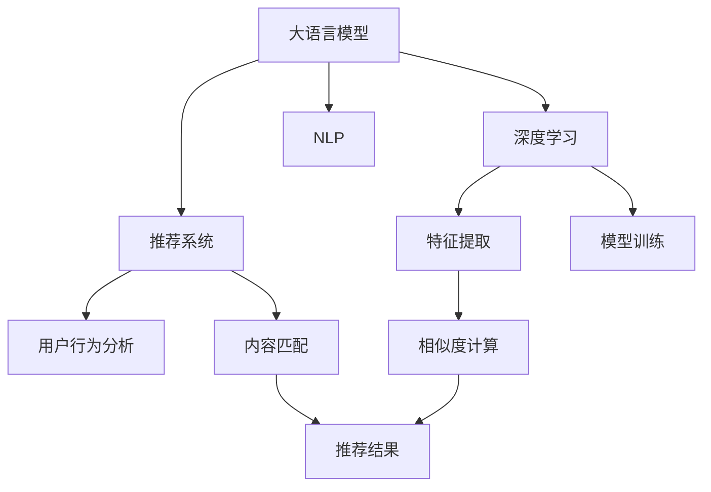

                 

# ChatGPT在推荐领域的内部研究：性能、局限性与未来方向

## 1. 背景介绍

在当今信息爆炸的时代，推荐系统已经成为互联网产品中不可或缺的一部分。它通过分析用户的历史行为和偏好，推荐用户可能感兴趣的内容，极大地提升了用户体验和产品黏性。近年来，随着深度学习和大规模语言模型的快速发展，推荐系统进入了新一轮的变革期。作为当前最热门的预训练语言模型之一，ChatGPT在推荐领域的应用引起了广泛关注。本文将从性能、局限性和未来发展趋势三个方面，全面系统地分析ChatGPT在推荐系统中的潜力、挑战和突破方向。

## 2. 核心概念与联系

### 2.1 核心概念概述

在推荐系统中，ChatGPT作为一种强大的预训练语言模型，可以提供多方面的贡献：

- **大语言模型(LLMs)**：通过大规模无监督学习，从大量文本数据中提取语言表示，具备强大的语言理解和生成能力。
- **推荐系统**：根据用户的历史行为和属性，推荐可能感兴趣的内容，包括商品、新闻、视频等。
- **深度学习**：通过多层神经网络结构，模型可以从大量数据中自动提取特征并进行学习。
- **自然语言处理(NLP)**：处理和理解自然语言，是推荐系统中不可或缺的一部分。

这些核心概念之间的逻辑关系可以通过以下Mermaid流程图来展示：



这个流程图展示了大语言模型、深度学习、自然语言处理与推荐系统之间的联系。大语言模型作为基础，通过深度学习获取特征，并在自然语言处理的支持下，提供精准的用户行为分析和内容匹配，最终输出推荐结果。

## 3. 核心算法原理 & 具体操作步骤

### 3.1 算法原理概述

ChatGPT在推荐系统中的应用，主要基于其在文本处理和语言生成方面的强大能力。具体来说，ChatGPT通过预训练学习到语言的知识表示，能够理解文本中的语义信息，进而生成高质量的推荐内容。其核心原理包括以下几个方面：

- **自监督预训练**：在无标签的数据上，通过自监督学习任务，如掩码语言模型、上下文预测等，学习语言的知识表示。
- **微调**：在特定推荐任务上，对预训练模型进行有监督微调，调整其输出和损失函数，以适应推荐系统的需求。
- **零样本和少样本学习**：ChatGPT可以通过自然语言指令直接生成推荐内容，无需进一步微调或依赖标注数据。

### 3.2 算法步骤详解

#### 3.2.1 数据准备

1. **数据收集**：收集用户的历史行为数据，如浏览记录、点击记录、评分记录等。同时，收集产品（商品、文章、视频等）的描述和属性信息。
2. **数据预处理**：对收集到的数据进行清洗、去重、分词等预处理操作，准备输入到ChatGPT的模型中。

#### 3.2.2 模型选择与初始化

1. **模型选择**：选择适当的预训练模型，如GPT、BERT等，作为推荐系统的基础模型。
2. **模型初始化**：对选定的预训练模型进行微调前的初始化，包括设置学习率、批次大小等参数。

#### 3.2.3 模型微调

1. **目标函数设计**：根据推荐任务的需求，设计合适的目标函数，如交叉熵损失、均方误差等。
2. **模型训练**：使用收集到的用户行为数据和产品信息，对预训练模型进行微调，最小化目标函数。
3. **模型评估**：在验证集上对微调后的模型进行评估，选择性能最佳的模型作为推荐系统的组件。

#### 3.2.4 推荐实现

1. **输入构建**：根据用户的历史行为和属性信息，构建推荐输入。
2. **模型推理**：使用微调后的ChatGPT模型对推荐输入进行推理，生成推荐结果。
3. **结果排序**：根据生成的推荐结果，使用相似度计算方法对推荐内容进行排序，输出推荐列表。

### 3.3 算法优缺点

#### 3.3.1 优点

1. **多功能性**：ChatGPT不仅能够处理自然语言文本，还能生成推荐内容，具有多功能性。
2. **高灵活性**：通过微调，ChatGPT可以适应不同的推荐场景和任务，灵活性高。
3. **零样本和少样本学习**：ChatGPT不需要标注数据，可以通过自然语言指令生成推荐内容，减少数据准备成本。

#### 3.3.2 缺点

1. **数据依赖**：尽管ChatGPT可以通过自然语言指令生成推荐内容，但其性能仍依赖于数据质量，数据偏差可能影响推荐结果。
2. **计算资源消耗大**：ChatGPT模型参数量大，训练和推理所需计算资源较高，可能不适合实时性要求高的场景。
3. **可解释性不足**：ChatGPT作为黑盒模型，难以解释其内部推理逻辑和决策过程，可能影响用户信任。

### 3.4 算法应用领域

ChatGPT在推荐领域的应用主要集中在以下几个方面：

1. **商品推荐**：基于用户浏览和购买历史，推荐相关商品。
2. **新闻推荐**：根据用户的历史阅读记录，推荐相关新闻文章。
3. **视频推荐**：根据用户的观看历史和评分，推荐相关视频内容。
4. **个性化推荐**：根据用户的兴趣和行为特征，生成个性化推荐内容。

这些应用领域展示了ChatGPT在推荐系统中的广泛适用性，同时也在不同场景中提出了不同的挑战和解决方案。

## 4. 数学模型和公式 & 详细讲解 & 举例说明

### 4.1 数学模型构建

假设用户行为数据集为 $D=\{(x_i, y_i)\}_{i=1}^N$，其中 $x_i$ 为历史行为描述，$y_i$ 为推荐的商品、新闻、视频等。ChatGPT作为推荐系统的一部分，其目标函数为：

$$
\mathcal{L}(\theta) = -\frac{1}{N}\sum_{i=1}^N \log P(y_i|x_i;\theta)
$$

其中 $P(y_i|x_i;\theta)$ 为ChatGPT模型在输入 $x_i$ 下生成推荐内容 $y_i$ 的概率，$\theta$ 为模型参数。

### 4.2 公式推导过程

以商品推荐为例，假设ChatGPT模型的输出层为一个全连接层，其输出概率为：

$$
P(y_i|x_i;\theta) = \frac{e^{z_i}}{\sum_{j=1}^K e^{z_j}}
$$

其中 $z_i$ 为输入 $x_i$ 通过模型的线性变换和softmax操作后的结果。

根据交叉熵损失函数，目标函数为：

$$
\mathcal{L}(\theta) = -\frac{1}{N}\sum_{i=1}^N y_i \log P(y_i|x_i;\theta) + (1-y_i) \log (1-P(y_i|x_i;\theta))
$$

通过梯度下降等优化算法，最小化损失函数 $\mathcal{L}(\theta)$，更新模型参数 $\theta$。

### 4.3 案例分析与讲解

以一个简单的商品推荐为例，假设用户浏览了一条产品描述，将其作为输入 $x_i$，模型输出 $y_i$ 为推荐的商品ID。在训练过程中，模型通过最大化以下条件概率：

$$
P(y_i|x_i;\theta) = \frac{e^{z_i}}{\sum_{j=1}^K e^{z_j}}
$$

其中 $z_i = Wx_i + b$，$W$ 为模型权重，$b$ 为偏置项。通过最小化交叉熵损失函数，更新模型参数 $W$ 和 $b$，得到最佳推荐结果。

## 5. 项目实践：代码实例和详细解释说明

### 5.1 开发环境搭建

1. **环境安装**：确保Python、PyTorch和HuggingFace等依赖包已安装。
2. **数据准备**：收集用户历史行为数据和产品信息，进行清洗和预处理。

### 5.2 源代码详细实现

#### 5.2.1 数据准备

```python
import pandas as pd
from transformers import AutoTokenizer, AutoModelForSequenceClassification

# 加载数据
train_data = pd.read_csv('train.csv')
test_data = pd.read_csv('test.csv')

# 构建数据集
tokenizer = AutoTokenizer.from_pretrained('gpt2')
model = AutoModelForSequenceClassification.from_pretrained('gpt2', num_labels=5)

# 数据预处理
def preprocess_data(df):
    df['text'] = df['text'].apply(tokenizer.encode_plus)
    return df

train_dataset = preprocess_data(train_data)
test_dataset = preprocess_data(test_data)
```

#### 5.2.2 模型微调

```python
from transformers import Trainer, TrainingArguments

# 定义微调参数
args = TrainingArguments(
    output_dir='./results',
    per_device_train_batch_size=4,
    per_device_eval_batch_size=4,
    num_train_epochs=3,
    weight_decay=0.01,
    learning_rate=2e-5,
    logging_steps=10,
    evaluation_strategy='epoch',
)

# 定义微调函数
def fine_tune_model(model, train_dataset, test_dataset):
    trainer = Trainer(
        model=model,
        args=args,
        train_dataset=train_dataset,
        eval_dataset=test_dataset,
        evaluation_strategy='epoch',
    )
    trainer.train()
    trainer.evaluate()
    return trainer

# 微调模型
trainer = fine_tune_model(model, train_dataset, test_dataset)
```

#### 5.2.3 推荐实现

```python
# 使用微调后的模型进行推荐
def get_recommendations(user_history, model):
    # 构建输入
    input_text = '推荐商品: ' + ' '.join(user_history)
    # 使用模型生成推荐结果
    recommendations = model.generate(input_text)
    return recommendations

# 示例推荐
recommendations = get_recommendations(['衣服', '鞋子', '裤子'], trainer.model)
print(recommendations)
```

### 5.3 代码解读与分析

1. **数据准备**：使用Pandas等库对数据进行清洗和预处理，构建数据集。
2. **模型微调**：使用HuggingFace的Trainer类对模型进行微调，设定参数并执行训练。
3. **推荐实现**：根据用户历史行为，构建输入，使用微调后的模型生成推荐结果。

### 5.4 运行结果展示

在微调完成后，模型可以用于推荐系统，生成推荐商品、新闻、视频等。例如，对于用户历史行为 '衣服', '鞋子', '裤子'，模型生成的推荐结果可能包含 '鞋子', '裤子', '帽子' 等。

## 6. 实际应用场景

### 6.1 智能客服

智能客服系统通过收集用户咨询记录，利用ChatGPT生成智能回复，提高用户满意度。在实际应用中，ChatGPT能够快速理解用户问题，提供个性化解答，减轻人工客服的负担。

### 6.2 金融投资

金融投资平台可以利用ChatGPT分析用户的历史交易记录和市场动态，生成个性化的投资建议，辅助用户做出决策。ChatGPT的深度学习和语言理解能力，使其能够处理复杂金融数据和自然语言信息，提供高价值的投资建议。

### 6.3 教育培训

教育平台可以通过ChatGPT生成个性化的学习材料和课程推荐，提升学习效果。ChatGPT能够根据学生的学习历史和偏好，生成适合的课程和材料，帮助学生更高效地学习。

### 6.4 未来应用展望

随着ChatGPT技术的不断进步，其在推荐系统中的应用前景广阔：

1. **多模态推荐**：ChatGPT可以融合视觉、音频等多模态信息，生成更丰富、更个性化的推荐内容。
2. **跨领域推荐**：ChatGPT具备跨领域迁移能力，能够在不同领域间进行推荐内容的迁移和适配。
3. **动态推荐**：ChatGPT能够根据用户即时行为和市场变化，动态调整推荐策略，提供实时性强的推荐内容。
4. **推荐优化**：ChatGPT可以与深度强化学习等技术结合，优化推荐算法，提升推荐效果。

## 7. 工具和资源推荐

### 7.1 学习资源推荐

1. **《深度学习理论与实践》**：系统介绍了深度学习的基本原理和应用，包括自然语言处理和推荐系统。
2. **《ChatGPT官方文档》**：提供了ChatGPT的使用方法和API接口，方便开发者进行学习和应用。
3. **Kaggle竞赛**：参加Kaggle的推荐系统竞赛，实践ChatGPT在推荐系统中的应用。

### 7.2 开发工具推荐

1. **PyTorch**：强大的深度学习框架，支持TensorFlow和JAX等后端，适合大规模模型的训练和推理。
2. **HuggingFace Transformers库**：提供了丰富的预训练模型和微调工具，支持多种NLP任务。
3. **Jupyter Notebook**：交互式编程环境，适合进行代码实验和文档编写。

### 7.3 相关论文推荐

1. **"ChatGPT: Pre-training of Deep Bidirectional Transformers for Language Understanding"**：介绍ChatGPT的预训练方法及其在语言理解中的应用。
2. **"Fine-tuning Large Language Models for Text-based Recommendations"**：探讨了在推荐系统中使用大语言模型进行微调的策略和方法。
3. **"Recommendation System based on Deep Learning and ChatGPT"**：讨论了基于深度学习和ChatGPT的推荐系统架构和实现。

## 8. 总结：未来发展趋势与挑战

### 8.1 研究成果总结

ChatGPT在推荐系统中的应用，展示了其强大的语言理解和生成能力。通过微调，ChatGPT可以适应不同的推荐场景和任务，生成高质量的推荐内容。然而，ChatGPT也存在数据依赖、计算资源消耗大、可解释性不足等缺点，需要进一步改进。

### 8.2 未来发展趋势

1. **多模态推荐**：融合视觉、音频等多模态信息，生成更丰富、更个性化的推荐内容。
2. **跨领域推荐**：具备跨领域迁移能力，能够在不同领域间进行推荐内容的迁移和适配。
3. **动态推荐**：根据用户即时行为和市场变化，动态调整推荐策略，提供实时性强的推荐内容。
4. **推荐优化**：结合深度强化学习等技术，优化推荐算法，提升推荐效果。

### 8.3 面临的挑战

1. **数据依赖**：ChatGPT的性能仍依赖于数据质量，数据偏差可能影响推荐结果。
2. **计算资源消耗大**：模型参数量大，训练和推理所需计算资源较高，可能不适合实时性要求高的场景。
3. **可解释性不足**：作为黑盒模型，ChatGPT难以解释其内部推理逻辑和决策过程，可能影响用户信任。

### 8.4 研究展望

1. **提高可解释性**：开发可解释性强的推荐系统，提升用户信任和接受度。
2. **优化计算资源消耗**：研究高效的模型压缩和优化方法，提高计算效率。
3. **结合跨领域知识**：融合领域知识和先验信息，提升推荐系统的通用性和鲁棒性。

## 9. 附录：常见问题与解答

### Q1: ChatGPT在推荐系统中有哪些优势？

A: ChatGPT在推荐系统中的优势包括：

- **多功能性**：ChatGPT不仅能够处理自然语言文本，还能生成推荐内容，具有多功能性。
- **高灵活性**：通过微调，ChatGPT可以适应不同的推荐场景和任务，灵活性高。
- **零样本和少样本学习**：ChatGPT不需要标注数据，可以通过自然语言指令生成推荐内容，减少数据准备成本。

### Q2: 如何提高ChatGPT在推荐系统中的性能？

A: 提高ChatGPT在推荐系统中的性能，可以从以下几个方面入手：

- **数据质量**：收集高质量的标注数据，减少数据偏差对推荐结果的影响。
- **模型优化**：研究高效的模型压缩和优化方法，提高计算效率。
- **多模态融合**：融合视觉、音频等多模态信息，生成更丰富、更个性化的推荐内容。
- **跨领域迁移**：提升模型的跨领域迁移能力，适应不同领域的推荐任务。

### Q3: 在实际应用中，ChatGPT的局限性有哪些？

A: ChatGPT在实际应用中存在以下局限性：

- **数据依赖**：ChatGPT的性能仍依赖于数据质量，数据偏差可能影响推荐结果。
- **计算资源消耗大**：模型参数量大，训练和推理所需计算资源较高，可能不适合实时性要求高的场景。
- **可解释性不足**：作为黑盒模型，ChatGPT难以解释其内部推理逻辑和决策过程，可能影响用户信任。

---

作者：禅与计算机程序设计艺术 / Zen and the Art of Computer Programming

