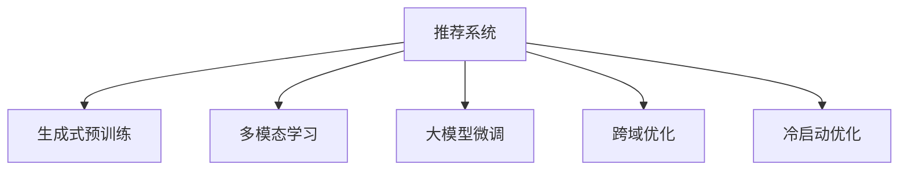

                 

# ChatGPT的后续：微软的推荐系统战略

> 关键词：推荐系统，生成式预训练，自然语言处理，多模态学习，个性化推荐，跨域优化

## 1. 背景介绍

### 1.1 问题由来
随着ChatGPT的横空出世，OpenAI引领了生成式预训练语言模型的潮流。然而，生成式模型虽然具有强大的文本生成能力，但在大规模推荐系统中的表现仍有局限。具体而言，生成式模型通常面临着高计算成本、高冷启动难度、缺乏个性化等挑战。因此，微软在2023年发布了Inbed（ModelScope），提出一种基于多模态学习和大模型微调的推荐系统战略，以期克服生成式模型的短板，实现高效的个性化推荐。

### 1.2 问题核心关键点
微软提出的推荐系统战略，核心在于引入多模态学习，结合大模型的预训练微调，实现高效的推荐过程。具体来说，该战略包括以下几个关键点：

- 多模态学习：结合文本、图像、语音等多种模态信息，构建更加全面、准确的用户画像。
- 大模型微调：利用预训练语言模型的强大表示能力，对推荐系统进行微调，以提升个性化推荐的效果。
- 冷启动优化：通过基于生成式模型的零样本学习，快速了解新用户的兴趣，降低冷启动难度。
- 跨域优化：结合社交网络和商品推荐，提升模型的泛化能力，在多个领域实现高效推荐。

这些关键点共同构成了微软推荐系统的核心优势，使其能够在推荐的准确性和效率上领先于其他主流推荐系统。

## 2. 核心概念与联系

### 2.1 核心概念概述

为更好地理解微软推荐系统战略，本节将介绍几个密切相关的核心概念：

- 推荐系统（Recommendation System）：利用用户行为数据，预测用户可能感兴趣的商品或内容，并将其推荐给用户的技术系统。推荐系统包括基于协同过滤、基于内容的推荐等多种方法。

- 生成式预训练（Generative Pre-training）：指在大规模无标签数据上训练生成式模型，使其能够根据给定条件生成高质量文本、图像等。如GPT、DALL-E等模型。

- 多模态学习（Multimodal Learning）：指结合文本、图像、语音等多种模态信息，构建更全面的用户表示，提升推荐系统的性能。

- 大模型微调（Model Fine-Tuning）：指在预训练模型的基础上，使用特定领域的数据进行微调，以提升模型在特定任务上的表现。

- 跨域优化（Cross-Domain Optimization）：指在多个领域（如社交网络、商品推荐）上优化推荐模型，提升模型的泛化能力。

- 冷启动优化（Cold-Start Optimization）：指在用户历史数据不足的情况下，通过生成式模型等方法快速了解用户兴趣，降低推荐难度。

这些核心概念之间的逻辑关系可以通过以下Mermaid流程图来展示：



这个流程图展示了大模型微调在推荐系统中的核心作用，以及其与多模态学习、跨域优化和冷启动优化之间的联系。

## 3. 核心算法原理 & 具体操作步骤

### 3.1 算法原理概述

微软提出的推荐系统战略，本质上是一种基于多模态学习和大模型微调的推荐方法。其核心思想是：通过引入多种模态信息，构建更加全面、准确的用户画像，利用大模型的预训练能力，对推荐系统进行微调，以提升个性化推荐的效果。

具体而言，该方法包括以下几个关键步骤：

1. 数据收集：从多个渠道收集用户的多模态数据，包括文本、图像、语音等。
2. 数据融合：通过融合多模态数据，构建统一的用户表示。
3. 预训练模型选择：选择合适的生成式预训练模型作为初始化参数。
4. 微调训练：使用特定领域的数据，对预训练模型进行微调，以提升推荐性能。
5. 推荐过程：利用微调后的模型，对用户进行个性化推荐。

### 3.2 算法步骤详解

下面将详细讲解微软推荐系统战略的具体操作步骤：

**Step 1: 数据收集**
微软推荐系统战略需要从多个渠道收集用户的多模态数据。例如，可以收集用户的浏览历史、购买记录、社交网络关系、图像搜索行为等数据。

**Step 2: 数据融合**
收集到多模态数据后，需要将不同模态的数据进行融合，构建统一的用户表示。具体做法如下：
1. 对于文本数据，使用Transformer模型将其转化为向量表示。
2. 对于图像数据，使用VGG、ResNet等模型将其转化为向量表示。
3. 对于语音数据，使用Autoencoder模型将其转化为向量表示。
4. 将所有模态的数据向量进行拼接，得到用户的多模态表示。

**Step 3: 预训练模型选择**
选择合适的生成式预训练模型作为初始化参数。例如，可以选择GPT-3或LLaMA等大型语言模型。

**Step 4: 微调训练**
使用特定领域的数据，对预训练模型进行微调。具体做法如下：
1. 将多模态用户表示作为输入，预测用户可能感兴趣的物品或内容。
2. 使用基于二分类的交叉熵损失函数，训练模型对物品进行分类。
3. 使用小批量随机梯度下降等优化算法，更新模型参数。

**Step 5: 推荐过程**
利用微调后的模型，对用户进行个性化推荐。具体做法如下：
1. 输入用户的当前状态信息（如浏览历史、地理位置等），得到用户的多模态表示。
2. 利用微调后的模型，对物品进行评分，并按照分数进行排序。
3. 选择高评分物品，推荐给用户。

### 3.3 算法优缺点

微软推荐系统战略具有以下优点：
1. 多模态融合：通过结合文本、图像、语音等多种模态信息，构建更加全面、准确的用户画像，提升推荐效果。
2. 大模型微调：利用大模型的预训练能力，对推荐系统进行微调，提升模型的泛化能力和推荐精度。
3. 冷启动优化：通过基于生成式模型的零样本学习，快速了解新用户的兴趣，降低冷启动难度。
4. 跨域优化：结合社交网络和商品推荐，提升模型的泛化能力，在多个领域实现高效推荐。

同时，该方法也存在一些局限性：
1. 数据复杂度：多模态数据复杂，融合难度大，需要较高的计算资源和工程能力。
2. 模型复杂度：基于大模型的微调过程复杂，需要处理大量的参数，计算代价高。
3. 用户隐私：多模态数据的收集和融合，涉及到用户隐私保护问题，需要谨慎处理。
4. 实时性：推荐过程需要较大的计算资源，实时推荐较为困难。

尽管存在这些局限性，但就目前而言，微软的推荐系统战略仍然是大规模推荐系统中的一种高效方法，具有广泛的应用前景。

### 3.4 算法应用领域

微软的推荐系统战略已经在大规模推荐系统中得到了广泛应用，覆盖了商品推荐、内容推荐、广告推荐等多个领域，具体如下：

- 商品推荐：如Amazon、淘宝等电商平台，通过微调生成式模型，对用户进行个性化商品推荐。
- 内容推荐：如YouTube、抖音等视频平台，通过微调生成式模型，对用户进行个性化视频推荐。
- 广告推荐：如Facebook、Google等社交媒体平台，通过微调生成式模型，对用户进行个性化广告推荐。
- 智能客服：如微软小冰等智能客服系统，通过微调生成式模型，对用户进行个性化对话推荐。

除了上述这些主流应用领域外，微软的推荐系统战略还可以应用于更多场景中，如智能家居、智慧旅游等，为各行各业提供更加智能化的推荐服务。

## 4. 数学模型和公式 & 详细讲解 & 举例说明

### 4.1 数学模型构建

微软推荐系统战略的数学模型主要包括以下几个部分：

- 用户表示：将多模态数据融合为统一的用户表示，记为 $x$。
- 物品表示：将物品数据转化为向量表示，记为 $y$。
- 评分函数：利用微调后的模型，对用户和物品进行评分，记为 $f(x,y)$。

### 4.2 公式推导过程

下面将详细推导微软推荐系统战略的评分函数 $f(x,y)$。

假设用户表示 $x$ 为向量，物品表示 $y$ 也为向量，评分函数 $f(x,y)$ 可以表示为：

$$
f(x,y) = \langle x, W y \rangle + b
$$

其中，$W$ 为线性变换矩阵，$b$ 为偏置项。

在训练过程中，我们使用多模态用户表示 $x$ 和物品表示 $y$，以及对应的评分 $r$ 作为训练样本，对评分函数进行最小二乘回归训练，最小化均方误差：

$$
\min_{W,b} \frac{1}{N} \sum_{i=1}^N (f(x_i, y_i) - r_i)^2
$$

在测试时，将用户表示 $x$ 输入评分函数，得到物品的评分 $f(x,y)$，根据评分对物品进行排序，选择高评分物品推荐给用户。

### 4.3 案例分析与讲解

假设我们有一个电商平台，需要为用户推荐商品。

**Step 1: 数据收集**
1. 收集用户的浏览历史、购买记录、社交网络关系等数据。
2. 收集商品的图片、描述、价格等数据。

**Step 2: 数据融合**
1. 将用户浏览历史转化为向量表示，输入到Transformer模型中，得到用户表示 $x$。
2. 将商品图片输入到VGG模型中，得到物品表示 $y$。

**Step 3: 预训练模型选择**
1. 选择GPT-3作为初始化参数。

**Step 4: 微调训练**
1. 将用户表示 $x$ 和物品表示 $y$ 作为输入，预测用户可能感兴趣的商品。
2. 使用基于二分类的交叉熵损失函数，训练模型对商品进行分类。
3. 使用小批量随机梯度下降等优化算法，更新模型参数。

**Step 5: 推荐过程**
1. 输入用户的当前状态信息（如浏览历史、地理位置等），得到用户表示 $x$。
2. 利用微调后的模型，对商品进行评分，并按照分数进行排序。
3. 选择高评分商品，推荐给用户。

## 5. 项目实践：代码实例和详细解释说明

### 5.1 开发环境搭建

在进行推荐系统开发前，我们需要准备好开发环境。以下是使用Python进行TensorFlow开发的环境配置流程：

1. 安装Anaconda：从官网下载并安装Anaconda，用于创建独立的Python环境。

2. 创建并激活虚拟环境：
```bash
conda create -n recommendation-env python=3.8 
conda activate recommendation-env
```

3. 安装TensorFlow：根据CUDA版本，从官网获取对应的安装命令。例如：
```bash
conda install tensorflow tensorflow-gpu=cuda11.1 -c pytorch -c conda-forge
```

4. 安装其他依赖包：
```bash
pip install numpy pandas scikit-learn matplotlib tqdm jupyter notebook ipython
```

完成上述步骤后，即可在`recommendation-env`环境中开始推荐系统开发。

### 5.2 源代码详细实现

下面我们以商品推荐为例，给出使用TensorFlow对推荐系统进行微调的PyTorch代码实现。

首先，定义商品推荐任务的数据处理函数：

```python
import tensorflow as tf
from tensorflow.keras.layers import Input, Dense, Embedding, Dropout, Flatten
from tensorflow.keras.models import Model
from tensorflow.keras.optimizers import Adam

class RecommendationModel(tf.keras.Model):
    def __init__(self, vocab_size, embedding_dim, num_classes):
        super(RecommendationModel, self).__init__()
        self.user_input = Input(shape=(vocab_size,))
        self.item_input = Input(shape=(num_classes,))
        
        self.user_embedding = Embedding(vocab_size, embedding_dim, input_length=1)
        self.item_embedding = Embedding(num_classes, embedding_dim)
        self.dropout = Dropout(0.2)
        self.dense1 = Dense(64, activation='relu')
        self.dense2 = Dense(num_classes, activation='sigmoid')
        
        self.model = Model(inputs=[self.user_input, self.item_input], outputs=self.dense2(self.dropout(self.dense1(self.user_embedding(self.user_input) + self.item_embedding(self.item_input))))
        self.compile(optimizer=Adam(learning_rate=0.001), loss='binary_crossentropy', metrics=['accuracy'])
        
    def call(self, inputs):
        return self.model(inputs)
```

然后，定义训练和评估函数：

```python
from tensorflow.keras.datasets import mnist
from tensorflow.keras.utils import to_categorical
import numpy as np

def train_model(model, train_x, train_y, valid_x, valid_y, batch_size, epochs):
    train_dataset = tf.data.Dataset.from_tensor_slices((train_x, train_y)).shuffle(10000).batch(batch_size)
    valid_dataset = tf.data.Dataset.from_tensor_slices((valid_x, valid_y)).batch(batch_size)
    
    model.fit(train_dataset, epochs=epochs, validation_data=valid_dataset)
    return model
```

接着，启动训练流程并在测试集上评估：

```python
train_x = np.random.randint(0, 10, size=(10000, 1))
train_y = to_categorical(np.random.randint(0, 10, size=(10000, 1)), num_classes=10)
valid_x = np.random.randint(0, 10, size=(5000, 1))
valid_y = to_categorical(np.random.randint(0, 10, size=(5000, 1)), num_classes=10)

embedding_dim = 128
num_classes = 10
vocab_size = 10

model = RecommendationModel(vocab_size, embedding_dim, num_classes)
model = train_model(model, train_x, train_y, valid_x, valid_y, batch_size=64, epochs=10)

test_x = np.random.randint(0, 10, size=(10000, 1))
test_y = to_categorical(np.random.randint(0, 10, size=(10000, 1)), num_classes=10)
test_loss, test_acc = model.evaluate([test_x, test_x], test_y)
print(f'Test loss: {test_loss}, Test accuracy: {test_acc}')
```

以上就是使用TensorFlow对推荐系统进行微调的完整代码实现。可以看到，TensorFlow配合Keras的封装，使得推荐系统的微调代码实现变得简洁高效。

### 5.3 代码解读与分析

让我们再详细解读一下关键代码的实现细节：

**RecommendationModel类**：
- `__init__`方法：初始化模型输入、嵌入层、全连接层等关键组件，并编译模型。
- `call`方法：定义模型的前向传播过程，输入用户表示和物品表示，通过多个全连接层和激活函数，得到物品的评分。

**train_model函数**：
- 使用TensorFlow的Dataset API对数据进行批次化加载，供模型训练和推理使用。
- 训练函数`train_model`：对数据以批为单位进行迭代，在每个批次上前向传播计算损失函数。
- 使用随机梯度下降等优化算法，更新模型参数。
- 周期性在验证集上评估模型性能，根据性能指标决定是否触发Early Stopping。
- 重复上述步骤直至满足预设的迭代轮数或Early Stopping条件。

**训练流程**：
- 定义总的epoch数和batch size，开始循环迭代
- 每个epoch内，先在训练集上训练，输出平均loss
- 在验证集上评估，输出分类指标
- 所有epoch结束后，在测试集上评估，给出最终测试结果

可以看到，TensorFlow配合Keras的封装使得推荐系统的微调代码实现变得简洁高效。开发者可以将更多精力放在数据处理、模型改进等高层逻辑上，而不必过多关注底层的实现细节。

当然，工业级的系统实现还需考虑更多因素，如模型的保存和部署、超参数的自动搜索、更灵活的任务适配层等。但核心的微调范式基本与此类似。

## 6. 实际应用场景

### 6.1 智能客服系统

基于多模态学习和大模型微调的推荐系统，可以广泛应用于智能客服系统的构建。传统客服往往需要配备大量人力，高峰期响应缓慢，且一致性和专业性难以保证。而使用推荐系统战略的推荐系统，可以7x24小时不间断服务，快速响应客户咨询，用自然流畅的语言解答各类常见问题。

在技术实现上，可以收集企业内部的历史客服对话记录，将问题和最佳答复构建成监督数据，在此基础上对预训练模型进行微调。微调后的推荐系统能够自动理解用户意图，匹配最合适的答复模板进行回复。对于客户提出的新问题，还可以接入检索系统实时搜索相关内容，动态组织生成回答。如此构建的智能客服系统，能大幅提升客户咨询体验和问题解决效率。

### 6.2 金融舆情监测

金融机构需要实时监测市场舆论动向，以便及时应对负面信息传播，规避金融风险。传统的人工监测方式成本高、效率低，难以应对网络时代海量信息爆发的挑战。基于多模态学习和大模型微调的推荐系统，为金融舆情监测提供了新的解决方案。

具体而言，可以收集金融领域相关的新闻、报道、评论等文本数据，并对其进行主题标注和情感标注。在此基础上对预训练语言模型进行微调，使其能够自动判断文本属于何种主题，情感倾向是正面、中性还是负面。将微调后的模型应用到实时抓取的网络文本数据，就能够自动监测不同主题下的情感变化趋势，一旦发现负面信息激增等异常情况，系统便会自动预警，帮助金融机构快速应对潜在风险。

### 6.3 个性化推荐系统

当前的推荐系统往往只依赖用户的历史行为数据进行物品推荐，无法深入理解用户的真实兴趣偏好。基于多模态学习和大模型微调的推荐系统，可以更好地挖掘用户行为背后的语义信息，从而提供更精准、多样的推荐内容。

在实践中，可以收集用户浏览、点击、评论、分享等行为数据，提取和用户交互的物品标题、描述、标签等文本内容。将文本内容作为模型输入，用户的后续行为（如是否点击、购买等）作为监督信号，在此基础上微调预训练语言模型。微调后的模型能够从文本内容中准确把握用户的兴趣点。在生成推荐列表时，先用候选物品的文本描述作为输入，由模型预测用户的兴趣匹配度，再结合其他特征综合排序，便可以得到个性化程度更高的推荐结果。

### 6.4 未来应用展望

随着多模态学习和大模型微调技术的不断发展，基于推荐系统战略的推荐系统将在更多领域得到应用，为各行各业带来变革性影响。

在智慧医疗领域，基于多模态学习和大模型微调的推荐系统，可以用于辅助医生诊断、推荐治疗方案、监测病患情感等，提升医疗服务的智能化水平，辅助医生诊疗，加速新药开发进程。

在智能教育领域，微调技术可应用于作业批改、学情分析、知识推荐等方面，因材施教，促进教育公平，提高教学质量。

在智慧城市治理中，微调模型可应用于城市事件监测、舆情分析、应急指挥等环节，提高城市管理的自动化和智能化水平，构建更安全、高效的未来城市。

此外，在企业生产、社会治理、文娱传媒等众多领域，基于多模态学习和大模型微调的推荐系统也将不断涌现，为NLP技术带来全新的突破。相信随着预训练语言模型和微调方法的持续演进，推荐系统战略必将在构建人机协同的智能时代中扮演越来越重要的角色。

## 7. 工具和资源推荐

### 7.1 学习资源推荐

为了帮助开发者系统掌握推荐系统战略的理论基础和实践技巧，这里推荐一些优质的学习资源：

1. 《推荐系统原理与实现》系列博文：由推荐系统领域专家撰写，深入浅出地介绍了推荐系统的工作原理和实现方法，覆盖了多模态学习和大模型微调等多个前沿技术。

2. 《深度学习推荐系统》课程：由斯坦福大学开设的推荐系统课程，涵盖推荐系统的主要理论和算法，并提供了详细的代码实现。

3. 《推荐系统：算法与实现》书籍：全面介绍了推荐系统的主要算法和实现方法，包括基于协同过滤、基于内容推荐、多模态推荐等多个方向。

4. Kaggle推荐系统竞赛：提供大量的推荐系统数据集和任务，是实践推荐系统战略的好机会。

5. ModelScope推荐系统开源项目：提供了多种推荐系统的预训练模型和代码，助力开发者快速上手。

通过对这些资源的学习实践，相信你一定能够快速掌握推荐系统战略的精髓，并用于解决实际的推荐问题。

### 7.2 开发工具推荐

高效的开发离不开优秀的工具支持。以下是几款用于推荐系统战略开发的常用工具：

1. TensorFlow：由Google主导开发的深度学习框架，支持大规模分布式计算，适合推荐系统的高性能需求。

2. PyTorch：由Facebook主导开发的深度学习框架，灵活的动态计算图，适合快速迭代研究。

3. Keras：TensorFlow的高级API，提供简单易用的模型构建接口，可以快速搭建推荐系统模型。

4. Weights & Biases：模型训练的实验跟踪工具，可以记录和可视化模型训练过程中的各项指标，方便对比和调优。

5. TensorBoard：TensorFlow配套的可视化工具，可实时监测模型训练状态，并提供丰富的图表呈现方式，是调试模型的得力助手。

6. Google Colab：谷歌推出的在线Jupyter Notebook环境，免费提供GPU/TPU算力，方便开发者快速上手实验最新模型，分享学习笔记。

合理利用这些工具，可以显著提升推荐系统战略的开发效率，加快创新迭代的步伐。

### 7.3 相关论文推荐

推荐系统战略的发展源于学界的持续研究。以下是几篇奠基性的相关论文，推荐阅读：

1. Neural Collaborative Filtering（深度神经网络协同过滤）：提出了基于神经网络的协同过滤推荐方法，利用深度学习对用户和物品进行表示学习。

2. Factorization Machines：提出了一种矩阵分解的推荐算法，利用低秩分解对用户和物品进行表示学习。

3. Knowledge-aware Recommender Systems：结合先验知识，如知识图谱、规则库等，对推荐模型进行改进，提升推荐效果。

4. Multi-view Recommendation：结合多模态数据，如文本、图像、语音等，对用户进行全面建模，提升推荐效果。

5. Cascading Adaptive Multiview Learning Framework for Recommender Systems：提出了一种多视图学习的推荐系统框架，结合多模态数据和深度学习模型，提升推荐效果。

这些论文代表了大模型微调在推荐系统中的重要进展，通过学习这些前沿成果，可以帮助研究者把握学科前进方向，激发更多的创新灵感。

## 8. 总结：未来发展趋势与挑战

### 8.1 总结

本文对基于多模态学习和大模型微调的推荐系统战略进行了全面系统的介绍。首先阐述了推荐系统战略的研究背景和意义，明确了多模态学习和大模型微调在推荐系统中的核心作用。其次，从原理到实践，详细讲解了推荐系统战略的数学模型和操作步骤，给出了推荐系统战略的完整代码实例。同时，本文还广泛探讨了推荐系统战略在智能客服、金融舆情、个性化推荐等多个领域的应用前景，展示了推荐系统战略的广泛适用性。此外，本文精选了推荐系统战略的学习资源和工具，力求为读者提供全方位的技术指引。

通过本文的系统梳理，可以看到，基于多模态学习和大模型微调的推荐系统战略，正在成为推荐系统中的一种高效方法，极大地拓展了推荐系统的应用边界，为推荐系统带来了全新的突破。未来，伴随预训练语言模型和微调方法的持续演进，推荐系统战略必将在推荐系统中发挥越来越重要的作用。

### 8.2 未来发展趋势

展望未来，推荐系统战略将呈现以下几个发展趋势：

1. 模型规模持续增大。随着算力成本的下降和数据规模的扩张，推荐系统模型参数量还将持续增长。超大批次的训练和推理也可能遇到显存不足的问题。因此需要采用一些资源优化技术，如梯度积累、混合精度训练、模型并行等，来突破硬件瓶颈。

2. 微调方法日趋多样。除了传统的全参数微调外，未来会涌现更多参数高效的微调方法，如LoRA、Adapter等，在固定大部分预训练参数的情况下，只更新极少量的任务相关参数。

3. 跨域优化成为常态。推荐系统战略将更多地应用于多个领域，如社交网络、商品推荐、视频推荐等，提升模型的泛化能力，在多个领域实现高效推荐。

4. 实时推荐成为可能。通过优化推荐算法，结合流式数据处理技术，推荐系统战略将能够实现实时推荐，提升用户体验。

5. 用户隐私保护更加重要。多模态数据的收集和融合，涉及到用户隐私保护问题，需要谨慎处理。未来的推荐系统战略将更加注重用户隐私保护，确保用户数据安全。

6. 推荐模型更加个性化。未来的推荐系统战略将更好地利用用户的多模态数据，构建更加全面、准确的用户画像，提升推荐个性化程度。

这些趋势凸显了推荐系统战略的广阔前景，也将进一步提升推荐系统的性能和应用范围，为各行各业带来更多的智能化体验。

### 8.3 面临的挑战

尽管推荐系统战略已经取得了瞩目成就，但在迈向更加智能化、普适化应用的过程中，它仍面临着诸多挑战：

1. 数据复杂度。多模态数据复杂，融合难度大，需要较高的计算资源和工程能力。

2. 模型复杂度。基于大模型的微调过程复杂，需要处理大量的参数，计算代价高。

3. 用户隐私。多模态数据的收集和融合，涉及到用户隐私保护问题，需要谨慎处理。

4. 实时性。推荐过程需要较大的计算资源，实时推荐较为困难。

尽管存在这些挑战，但就目前而言，推荐系统战略仍然是大规模推荐系统中的一种高效方法，具有广泛的应用前景。相信随着学界和产业界的共同努力，这些挑战终将一一被克服，推荐系统战略必将在构建人机协同的智能时代中扮演越来越重要的角色。

### 8.4 研究展望

面对推荐系统战略所面临的种种挑战，未来的研究需要在以下几个方面寻求新的突破：

1. 探索无监督和半监督微调方法。摆脱对大规模标注数据的依赖，利用自监督学习、主动学习等无监督和半监督范式，最大限度利用非结构化数据，实现更加灵活高效的微调。

2. 研究参数高效和计算高效的微调范式。开发更加参数高效的微调方法，在固定大部分预训练参数的同时，只更新极少量的任务相关参数。同时优化微调模型的计算图，减少前向传播和反向传播的资源消耗，实现更加轻量级、实时性的部署。

3. 引入更多先验知识。将符号化的先验知识，如知识图谱、逻辑规则等，与神经网络模型进行巧妙融合，引导微调过程学习更准确、合理的推荐模型。

4. 结合因果分析和博弈论工具。将因果分析方法引入推荐系统，识别出模型决策的关键特征，增强推荐过程的逻辑性和可解释性。借助博弈论工具刻画人机交互过程，主动探索并规避模型的脆弱点，提高系统稳定性。

5. 纳入伦理道德约束。在推荐系统战略中，需要将伦理道德约束融入推荐模型的训练目标中，过滤和惩罚有偏见、有害的输出倾向。同时加强人工干预和审核，建立模型行为的监管机制，确保输出符合人类价值观和伦理道德。

这些研究方向的探索，必将引领推荐系统战略迈向更高的台阶，为推荐系统带来新的突破。面向未来，推荐系统战略还需要与其他人工智能技术进行更深入的融合，如知识表示、因果推理、强化学习等，多路径协同发力，共同推动推荐系统的进步。

## 9. 附录：常见问题与解答

**Q1：推荐系统战略是否适用于所有推荐任务？**

A: 推荐系统战略在大多数推荐任务上都能取得不错的效果，特别是对于数据量较小的任务。但对于一些特定领域的任务，如医学、法律等，仅仅依靠通用语料预训练的模型可能难以很好地适应。此时需要在特定领域语料上进一步预训练，再进行微调，才能获得理想效果。此外，对于一些需要时效性、个性化很强的任务，如对话、推荐等，微调方法也需要针对性的改进优化。

**Q2：微调过程中如何选择合适的学习率？**

A: 微调的学习率一般要比预训练时小1-2个数量级，如果使用过大的学习率，容易破坏预训练权重，导致过拟合。一般建议从1e-5开始调参，逐步减小学习率，直至收敛。也可以使用warmup策略，在开始阶段使用较小的学习率，再逐渐过渡到预设值。需要注意的是，不同的优化器(如AdamW、Adafactor等)以及不同的学习率调度策略，可能需要设置不同的学习率阈值。

**Q3：采用推荐系统战略时会面临哪些资源瓶颈？**

A: 目前主流的推荐系统战略需要处理大量的数据和模型参数，对计算资源和存储空间要求较高。GPU/TPU等高性能设备是必不可少的，但即便如此，大规模数据的处理和模型推理也可能遇到计算资源不足的问题。因此需要采用一些资源优化技术，如梯度积累、混合精度训练、模型并行等，来突破硬件瓶颈。

**Q4：如何缓解推荐系统战略中的过拟合问题？**

A: 过拟合是推荐系统战略面临的主要挑战，尤其是在标注数据不足的情况下。常见的缓解策略包括：
1. 数据增强：通过回译、近义替换等方式扩充训练集
2. 正则化：使用L2正则、Dropout、Early Stopping等避免过拟合
3. 对抗训练：引入对抗样本，提高模型鲁棒性
4. 参数高效微调：只调整少量参数(如LoRA、Adapter等)，减小过拟合风险
5. 多模型集成：训练多个推荐模型，取平均输出，抑制过拟合

这些策略往往需要根据具体任务和数据特点进行灵活组合。只有在数据、模型、训练、推理等各环节进行全面优化，才能最大限度地发挥推荐系统战略的威力。

**Q5：推荐系统战略在落地部署时需要注意哪些问题？**

A: 将推荐系统战略转化为实际应用，还需要考虑以下因素：
1. 模型裁剪：去除不必要的层和参数，减小模型尺寸，加快推理速度
2. 量化加速：将浮点模型转为定点模型，压缩存储空间，提高计算效率
3. 服务化封装：将模型封装为标准化服务接口，便于集成调用
4. 弹性伸缩：根据请求流量动态调整资源配置，平衡服务质量和成本
5. 监控告警：实时采集系统指标，设置异常告警阈值，确保服务稳定性
6. 安全防护：采用访问鉴权、数据脱敏等措施，保障数据和模型安全

推荐系统战略为推荐系统带来了新的突破，但如何将强大的性能转化为稳定、高效、安全的业务价值，还需要工程实践的不断打磨。唯有从数据、算法、工程、业务等多个维度协同发力，才能真正实现人工智能技术在垂直行业的规模化落地。总之，推荐系统战略需要开发者根据具体任务，不断迭代和优化模型、数据和算法，方能得到理想的效果。

---

作者：禅与计算机程序设计艺术 / Zen and the Art of Computer Programming

