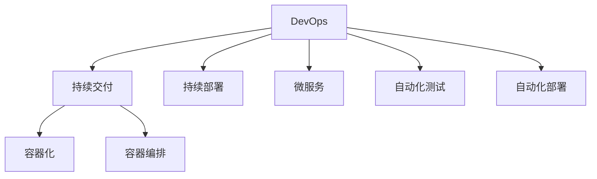

                 

# DevOps 实践指南更新：持续交付和部署的最新技术

> 关键词：DevOps, 持续交付, 持续部署, CI/CD, 自动化, 容器化, Kubernetes, 微服务, 敏捷开发, 自动化测试, 自动化部署

## 1. 背景介绍

随着云计算和容器技术的发展，DevOps（开发运维）成为软件开发和运维工作的重要组成部分。DevOps通过自动化工具和流程，使软件开发的各个环节紧密协作，提高了开发效率和软件质量，缩短了软件交付周期。

DevOps不仅仅是一种技术架构，更是一种文化。它强调持续交付和持续部署（Continuous Delivery and Deployment, CD），以应对快速变化的市场需求，提高产品竞争力。在当今快速变化的市场环境下，DevOps的应用显得尤为重要。

然而，DevOps的实践并不是一成不变的。随着技术的进步和市场需求的变化，DevOps的实践方法也在不断地演进。本文将介绍DevOps的最新技术，并探讨其在持续交付和部署中的具体应用。

## 2. 核心概念与联系

### 2.1 核心概念概述

为更好地理解DevOps的最新技术，本节将介绍几个密切相关的核心概念：

- DevOps：一种将开发和运维紧密结合的软件开发生命周期管理模式，强调协作、自动化和持续交付。
- 持续交付（Continuous Delivery）：将软件持续集成到共享仓库，并持续部署到生产环境的过程，旨在提高软件的交付速度和质量。
- 持续部署（Continuous Deployment）：在持续交付的基础上，自动将软件部署到生产环境的过程，进一步缩短交付周期，提升效率。
- 容器化（Containerization）：将应用程序及其依赖打包到可移植的容器中，以提高部署的灵活性和一致性。
- 容器编排（Container Orchestration）：通过容器编排工具（如Kubernetes）自动化管理容器的部署和调度。
- 微服务（Microservices）：将应用程序拆分为多个独立、可互操作的微服务，以提高系统的可维护性和扩展性。
- 自动化测试（Automated Testing）：通过自动化测试工具（如Jenkins、TestNG等）自动化执行测试，提高测试效率和覆盖率。
- 自动化部署（Automated Deployment）：通过自动化部署工具（如Ansible、Chef等）自动化执行部署操作，提高部署的可靠性和效率。

这些核心概念之间的逻辑关系可以通过以下Mermaid流程图来展示：



这个流程图展示了他DevOps的核心概念及其之间的关系：

1. DevOps强调开发和运维的紧密协作，贯穿持续交付和持续部署的全过程。
2. 持续交付和持续部署是DevOps的核心目标，旨在通过自动化工具和流程提高软件交付速度和质量。
3. 容器化和容器编排技术是实现持续交付和持续部署的重要手段。
4. 微服务化是提高系统可维护性和扩展性的关键技术。
5. 自动化测试和自动化部署是保障软件质量和交付效率的关键手段。

这些核心概念共同构成了DevOps的实践框架，使得软件开发和运维工作更加高效、协作、可靠。

## 3. 核心算法原理 & 具体操作步骤

### 3.1 算法原理概述

DevOps的持续交付和持续部署流程主要包括以下几个关键环节：

1. 代码提交：开发者将代码提交到版本控制系统中，触发持续集成（Continuous Integration, CI）流程。
2. 代码审查：代码提交后，通过自动化工具（如GitHub Actions）进行代码审查，确保代码质量。
3. 自动化测试：通过自动化测试工具（如Jenkins）执行单元测试、集成测试、性能测试等，确保软件质量。
4. 自动化部署：通过自动化部署工具（如Ansible）将软件部署到目标环境。
5. 持续集成和持续部署：持续集成和持续部署是DevOps的核心流程，通过自动化工具和CI/CD系统实现自动化流水线管理。

持续交付和持续部署的算法原理主要体现在以下几个方面：

- 自动化：通过自动化工具和流程，实现从代码提交到软件部署的全过程自动化。
- 测试驱动：通过自动化测试工具，确保每个版本的软件质量，提高交付的可靠性。
- 版本管理：通过版本控制系统（如Git）管理代码的历史和分支，确保软件的稳定性和可追溯性。
- 容器化：通过容器化技术，确保软件在各种环境下的一致性和可靠性。
- 可扩展性：通过微服务化设计，提高系统的可维护性和扩展性。

### 3.2 算法步骤详解

基于DevOps的持续交付和持续部署流程，本节将详细介绍具体的操作方法：

**Step 1: 准备开发环境**
- 安装开发所需的软件环境，如IDE、版本控制系统（如Git）、持续集成和持续部署工具（如Jenkins、Travis CI等）。
- 配置自动化测试工具（如TestNG、JUnit等）和自动化部署工具（如Ansible、Chef等）。

**Step 2: 实施持续集成**
- 配置持续集成工具（如Jenkins），将代码提交触发CI流程。
- 在CI流程中添加代码审查、自动化测试等环节，确保每个版本软件的质量。
- 配置CI流程中的环境配置、依赖安装等步骤，确保软件在不同环境中的兼容性。

**Step 3: 实施持续部署**
- 配置持续部署工具（如Ansible），将软件自动部署到目标环境。
- 配置部署过程中的监控、日志记录等环节，确保部署过程的可靠性和可追溯性。
- 配置回滚机制，在部署失败时能够快速回滚到上一个版本，减少对生产环境的影响。

**Step 4: 实施容器化和容器编排**
- 将应用程序打包到容器中（如Docker），确保在不同环境中的一致性。
- 使用容器编排工具（如Kubernetes）自动化管理容器的部署和调度。
- 配置容器编排中的服务发现、负载均衡等环节，提高系统的可用性和可靠性。

**Step 5: 实施微服务化**
- 将应用程序拆分为多个独立、可互操作的微服务，提高系统的可维护性和扩展性。
- 配置微服务间的通信机制，确保各微服务之间的协作和互通。
- 配置微服务的监控、日志记录等环节，提高系统的可追溯性和可维护性。

**Step 6: 实施自动化测试和自动化部署**
- 配置自动化测试工具（如Jenkins），自动执行测试用例。
- 配置自动化部署工具（如Ansible），自动执行部署操作。
- 配置CI/CD系统，实现从代码提交到软件部署的全过程自动化。

### 3.3 算法优缺点

DevOps的持续交付和持续部署方法具有以下优点：

1. 提高效率：通过自动化工具和流程，显著提高开发和运维的效率，缩短软件交付周期。
2. 提高质量：通过自动化测试和代码审查，确保每个版本的软件质量，提高交付的可靠性。
3. 提高一致性：通过容器化和容器编排，确保软件在不同环境中的一致性和可靠性。
4. 提高可维护性：通过微服务化设计，提高系统的可维护性和扩展性。

同时，该方法也存在一定的局限性：

1. 对工具的依赖：DevOps的实践依赖于各种自动化工具和流程，一旦工具出现问题，可能导致整个流程的中断。
2. 对技术的要求：DevOps的实践需要开发人员和运维人员具备一定的技术能力，否则可能导致流程执行不顺利。
3. 对资源的要求：DevOps的实践需要一定的计算资源和网络带宽，可能导致成本增加。
4. 对人员协作的要求：DevOps的实践需要开发和运维的紧密协作，否则可能导致流程执行不顺利。

尽管存在这些局限性，但就目前而言，DevOps的持续交付和持续部署方法仍然是软件开发和运维的最佳实践之一。未来相关研究的重点在于如何进一步优化工具链，降低对技术的要求，提高对资源的利用效率，从而更好地支持DevOps的实践。

### 3.4 算法应用领域

DevOps的持续交付和持续部署方法已经在软件开发、运维、测试、项目管理等诸多领域得到了广泛应用，具体如下：

1. 软件开发：通过持续集成和持续部署，快速构建、测试和部署软件，缩短软件交付周期，提高软件质量。
2. 运维管理：通过持续集成和持续部署，快速构建、测试和部署运维工具，提高运维效率和可靠性。
3. 测试自动化：通过持续集成和持续部署，自动执行测试用例，提高测试效率和覆盖率。
4. 项目管理：通过持续集成和持续部署，实现软件开发的敏捷管理和流程自动化，提高项目管理的效率和质量。

除了上述这些经典应用外，DevOps的持续交付和持续部署方法也在更多场景中得到应用，如云计算、物联网、人工智能等，为这些领域的快速发展提供了技术支持。

## 4. 数学模型和公式 & 详细讲解 & 举例说明

### 4.1 数学模型构建

本节将使用数学语言对DevOps的持续交付和持续部署过程进行更加严格的刻画。

记软件开发流程为 $F=\{f_1,f_2,f_3,...,f_n\}$，其中 $f_i$ 表示第 $i$ 个开发环节。假设每个开发环节的执行时间为 $t_i$，每个开发环节的资源需求为 $c_i$，则软件开发流程的总执行时间为：

$$
T=\sum_{i=1}^n t_i
$$

每个开发环节的资源需求总和为：

$$
C=\sum_{i=1}^n c_i
$$

假设每个开发环节的执行时间为 $t_i$，每个开发环节的资源需求为 $c_i$，则软件开发流程的总执行时间为：

$$
T=\sum_{i=1}^n t_i
$$

每个开发环节的资源需求总和为：

$$
C=\sum_{i=1}^n c_i
$$

### 4.2 公式推导过程

以下我们以持续交付和持续部署的自动化测试流程为例，推导自动化测试的时间复杂度和资源需求。

假设每个测试用例的执行时间为 $t$，测试用例数量为 $m$，则自动化测试的总执行时间为：

$$
T_{test}=m \times t
$$

假设每个测试用例的资源需求为 $c$，则自动化测试的资源需求总和为：

$$
C_{test}=m \times c
$$

在持续交付和持续部署流程中，自动化测试是关键环节之一。通过自动化测试，可以确保每个版本的软件质量，提高交付的可靠性。假设每个版本的软件经过 $k$ 次自动化测试，则持续交付和持续部署的自动化测试总执行时间为：

$$
T_{del}=T_{test} \times k
$$

持续交付和持续部署的自动化测试资源需求总和为：

$$
C_{del}=C_{test} \times k
$$

通过优化自动化测试流程，可以显著降低持续交付和持续部署的总执行时间和资源需求。例如，通过并行执行测试用例，可以将自动化测试的时间复杂度降至 $O(\log m)$。通过优化测试用例的资源需求，可以显著降低持续交付和持续部署的资源需求。

### 4.3 案例分析与讲解

在实际应用中，DevOps的持续交付和持续部署方法已经广泛应用于各行各业，以下以一个电商网站为例，介绍持续交付和持续部署的实际应用：

1. 持续集成流程：开发者将代码提交到Git仓库，触发Jenkins的CI流程。CI流程包括代码审查、自动化测试等环节。通过持续集成，快速构建和测试新功能，确保每个版本软件质量。
2. 持续部署流程：Jenkins触发CI流程后，将新功能部署到 staging 环境。在 staging 环境中进行最后的测试，通过测试后再将新功能部署到生产环境。通过持续部署，快速发布新功能，提高用户满意度。
3. 容器化和容器编排：将电商网站的应用程序打包到Docker容器中，使用Kubernetes进行容器编排。通过容器化技术，确保软件在不同环境中的一致性和可靠性。通过容器编排技术，自动化管理容器的部署和调度，提高系统的可用性和可靠性。
4. 微服务化设计：将电商网站拆分为多个独立、可互操作的微服务，如用户管理、商品管理、订单管理等。通过微服务化设计，提高系统的可维护性和扩展性。
5. 自动化测试和自动化部署：通过自动化测试工具（如TestNG）自动执行测试用例，确保每个版本软件质量。通过自动化部署工具（如Ansible）自动执行部署操作，提高部署效率和可靠性。通过CI/CD系统，实现从代码提交到软件部署的全过程自动化，提高软件开发和运维的效率和质量。

通过上述持续交付和持续部署流程的实现，电商网站可以快速构建、测试和部署新功能，提高软件交付速度和质量，满足用户需求，提升用户体验。

## 5. 项目实践：代码实例和详细解释说明

### 5.1 开发环境搭建

在进行DevOps的持续交付和持续部署实践前，我们需要准备好开发环境。以下是使用Jenkins和Git进行持续集成和持续部署的环境配置流程：

1. 安装Jenkins：从官网下载并安装Jenkins，配置Jenkins的主机地址、管理员密码等基本信息。
2. 安装Git：从官网下载并安装Git，配置Git的仓库地址、用户名和密码等基本信息。
3. 配置CI流程：在Jenkins中创建新的项目，配置CI流程的步骤、环境配置等参数。
4. 配置自动化测试工具：在CI流程中添加自动化测试工具的配置，如TestNG、JUnit等。
5. 配置自动化部署工具：在CI流程中添加自动化部署工具的配置，如Ansible、Chef等。

完成上述步骤后，即可在Jenkins中启动持续集成和持续部署流程。

### 5.2 源代码详细实现

这里我们以一个简单的Java项目为例，介绍如何在Jenkins中实现持续交付和持续部署。

首先，在Git仓库中创建新的Java项目：

```java
package com.example;

public class HelloWorld {
    public static void main(String[] args) {
        System.out.println("Hello, World!");
    }
}
```

然后，在Jenkins中配置CI流程：

1. 创建新的Jenkins项目，选择“Freestyle”项目类型。
2. 在项目配置中，添加“源码管理”、“构建”、“发布”等模块。
3. 在“源码管理”模块中，配置Git仓库的地址、分支等参数。
4. 在“构建”模块中，添加编译、测试等步骤，并配置相应的工具。
5. 在“发布”模块中，添加部署到目标环境的步骤，并配置相应的工具。

接下来，编写Jenkins的配置文件，实现持续交付和持续部署：

```groovy
pipeline {
    agent any
    stages {
        stage('编译') {
            steps {
                sh 'javac src/main/java/HelloWorld.java'
            }
        }
        stage('测试') {
            steps {
                sh 'java -cp target/HelloWorld.jar com.example.HelloWorld'
            }
        }
        stage('发布') {
            steps {
                sh 'mvn package'
                sh 'mvn install:install-file -Dfile=target/HelloWorld.jar -DgroupId=com.example -DartifactId=HelloWorld -Dversion=1.0.0 -Dpackaging=jar -Dclassifier=all.jar -Dfile=target/HelloWorld.jar'
            }
        }
    }
}
```

最后，启动Jenkins中的持续集成和持续部署流程，即可实现Java项目的持续交付和持续部署。

### 5.3 代码解读与分析

让我们再详细解读一下关键代码的实现细节：

**Jenkins配置文件**：
- `pipeline`：定义Jenkins的持续集成和持续部署流程。
- `agent any`：指定Jenkins的执行环境，可以是本地计算机或远程服务器。
- `stages`：定义Jenkins的流程步骤，包括编译、测试、发布等环节。
- `sh`命令：通过Shell命令执行Jenkins的每个步骤，实现持续集成和持续部署的自动化。

**编译步骤**：
- `javac src/main/java/HelloWorld.java`：通过javac命令编译Java代码。

**测试步骤**：
- `java -cp target/HelloWorld.jar com.example.HelloWorld`：通过java命令运行测试程序，确保代码正确无误。

**发布步骤**：
- `mvn package`：通过Maven命令生成项目的JAR包。
- `mvn install:install-file`：通过Maven命令将JAR包发布到本地仓库或远程仓库中，供其他项目使用。

通过上述Jenkins的配置和实现，Java项目的持续交付和持续部署流程得以实现。Jenkins通过自动化工具和流程，实现了代码提交、编译、测试、发布等环节的自动化，提高了软件开发和运维的效率和可靠性。

当然，工业级的系统实现还需考虑更多因素，如Jenkins的集群管理、Jenkins插件的开发和集成、Jenkins的备份和恢复等。但核心的持续交付和持续部署范式基本与此类似。

## 6. 实际应用场景

### 6.1 电商平台

基于DevOps的持续交付和持续部署方法，电商平台可以快速构建、测试和部署新功能，提高软件交付速度和质量，满足用户需求，提升用户体验。

在实际应用中，电商平台可以通过持续集成和持续部署流程，快速构建、测试和部署新功能，如商品管理、订单管理、支付功能等。通过容器化和容器编排技术，确保软件在不同环境中的一致性和可靠性。通过微服务化设计，提高系统的可维护性和扩展性。通过自动化测试和自动化部署工具，提高软件质量和部署效率。

### 6.2 金融系统

金融系统需要实时处理大量的交易数据，对系统的稳定性和可靠性要求极高。通过DevOps的持续交付和持续部署方法，金融系统可以快速构建、测试和部署新功能，提高软件交付速度和质量，确保系统的稳定性和可靠性。

在实际应用中，金融系统可以通过持续集成和持续部署流程，快速构建、测试和部署新功能，如交易系统、清算系统、风控系统等。通过容器化和容器编排技术，确保软件在不同环境中的一致性和可靠性。通过微服务化设计，提高系统的可维护性和扩展性。通过自动化测试和自动化部署工具，提高软件质量和部署效率。

### 6.3 智慧城市

智慧城市需要实时处理大量的城市数据，对系统的实时性和可靠性要求极高。通过DevOps的持续交付和持续部署方法，智慧城市可以快速构建、测试和部署新功能，提高软件交付速度和质量，确保系统的实时性和可靠性。

在实际应用中，智慧城市可以通过持续集成和持续部署流程，快速构建、测试和部署新功能，如交通监控、环境监测、公共安全等。通过容器化和容器编排技术，确保软件在不同环境中的一致性和可靠性。通过微服务化设计，提高系统的可维护性和扩展性。通过自动化测试和自动化部署工具，提高软件质量和部署效率。

### 6.4 未来应用展望

随着DevOps的持续交付和持续部署方法的不断发展，其在更多领域的应用前景将更加广阔。

在智慧医疗领域，基于DevOps的持续交付和持续部署方法，可以快速构建、测试和部署新功能，如电子病历系统、医疗影像分析、智能问诊系统等。通过容器化和容器编排技术，确保软件在不同环境中的一致性和可靠性。通过微服务化设计，提高系统的可维护性和扩展性。通过自动化测试和自动化部署工具，提高软件质量和部署效率。

在智能教育领域，基于DevOps的持续交付和持续部署方法，可以快速构建、测试和部署新功能，如在线课程系统、智能辅导系统、学习管理系统等。通过容器化和容器编排技术，确保软件在不同环境中的一致性和可靠性。通过微服务化设计，提高系统的可维护性和扩展性。通过自动化测试和自动化部署工具，提高软件质量和部署效率。

在智慧城市治理中，基于DevOps的持续交付和持续部署方法，可以快速构建、测试和部署新功能，如城市事件监测、舆情分析、应急指挥等。通过容器化和容器编排技术，确保软件在不同环境中的一致性和可靠性。通过微服务化设计，提高系统的可维护性和扩展性。通过自动化测试和自动化部署工具，提高软件质量和部署效率。

此外，在企业生产、社会治理、文娱传媒等众多领域，基于DevOps的持续交付和持续部署方法也将不断涌现，为各行各业带来变革性影响。相信随着DevOps的持续交付和持续部署方法的不断演进，其在更多领域的应用前景将更加广阔，为各行各业带来更高的效率和可靠性。

## 7. 工具和资源推荐

### 7.1 学习资源推荐

为了帮助开发者系统掌握DevOps的持续交付和持续部署的理论基础和实践技巧，这里推荐一些优质的学习资源：

1. DevOps 圣经（《The Phoenix Project》）：一本关于DevOps实践的经典书籍，深入浅出地介绍了DevOps的理念、工具和流程。
2. Jenkins官方文档：Jenkins的官方文档，提供了详细的配置和使用方法，是入门DevOps实践的必备资料。
3. Kubernetes官方文档：Kubernetes的官方文档，提供了详细的部署和使用方法，是容器编排技术的核心文档。
4. Docker官方文档：Docker的官方文档，提供了详细的部署和使用方法，是容器化技术的核心文档。
5. Ansible官方文档：Ansible的官方文档，提供了详细的配置和使用方法，是自动化部署技术的核心文档。
6. TestNG官方文档：TestNG的官方文档，提供了详细的测试用例编写和执行方法，是自动化测试技术的核心文档。

通过对这些资源的学习实践，相信你一定能够快速掌握DevOps的持续交付和持续部署的精髓，并用于解决实际的DevOps问题。

### 7.2 开发工具推荐

高效的开发离不开优秀的工具支持。以下是几款用于DevOps持续交付和持续部署开发的常用工具：

1. Jenkins：开源的持续集成和持续部署工具，支持多种开发语言和框架，提供强大的自动化测试和自动化部署能力。
2. Git：流行的版本控制系统，支持多人协作开发和代码管理，提供高效的代码审查和代码合并功能。
3. Docker：开源的容器化技术，支持应用和依赖的打包和分发，提供高效的应用部署和管理能力。
4. Kubernetes：开源的容器编排工具，支持容器的自动化部署和调度，提供高效的应用管理和扩展能力。
5. Ansible：开源的自动化部署工具，支持基于SSH的远程操作，提供高效的应用部署和配置能力。
6. TestNG：开源的自动化测试框架，支持多种测试用例编写和执行方法，提供高效的测试覆盖和测试自动化能力。

合理利用这些工具，可以显著提升DevOps持续交付和持续部署任务的开发效率，加快创新迭代的步伐。

### 7.3 相关论文推荐

DevOps的持续交付和持续部署技术的发展源于学界的持续研究。以下是几篇奠基性的相关论文，推荐阅读：

1. "Continuous Delivery: Principles and Practices for Fast, Safe, Reliable Software Releases"（DevOps宣言）：DevOps社区发布的DevOps宣言，概述了DevOps的理念、原则和实践。
2. "Automated Testing and Dynamic Analysis of Large Software Systems"：Kent Beck的经典论文，介绍了自动化测试的基本概念和实现方法。
3. "DevOps Adoption and Value in Startups"：一项针对创业公司的DevOps实践调查研究，提供了DevOps实践的数据和分析。
4. "Continuous Integration: Principles, Patterns, and Practices"：Martin Fowler的经典著作，深入浅出地介绍了CI/CD的基本概念和实践。
5. "Docker: The Definitive Guide"：Docker官方出版的指南，提供了详细的Docker部署和使用方法，是容器化技术的核心文档。
6. "Kubernetes: Up and Running"：CoreOS官方出版的指南，提供了详细的Kubernetes部署和使用方法，是容器编排技术的核心文档。

这些论文代表了大规模软件开发和运维的最新研究成果，为DevOps的持续交付和持续部署实践提供了理论基础和实践经验。

## 8. 总结：未来发展趋势与挑战

### 8.1 总结

本文对DevOps的持续交付和持续部署方法进行了全面系统的介绍。首先阐述了DevOps的核心理念和应用场景，明确了持续交付和持续部署在软件开发和运维中的重要地位。其次，从原理到实践，详细讲解了DevOps的数学模型和算法步骤，给出了持续交付和持续部署任务开发的完整代码实例。同时，本文还探讨了DevOps在电商、金融、智慧城市等领域的实际应用，展示了DevOps的广泛应用前景。此外，本文精选了DevOps的学习资源和开发工具，力求为读者提供全方位的技术指引。

通过本文的系统梳理，可以看到，DevOps的持续交付和持续部署方法已经成为软件开发和运维的最佳实践之一。它通过自动化工具和流程，显著提高了软件开发和运维的效率和可靠性，缩短了软件交付周期，提高了软件质量。未来，随着DevOps的持续交付和持续部署方法的不断演进，其在更多领域的应用前景将更加广阔，为各行各业带来更高的效率和可靠性。

### 8.2 未来发展趋势

展望未来，DevOps的持续交付和持续部署技术将呈现以下几个发展趋势：

1. 持续集成和持续部署的自动化程度将进一步提高，通过更高效的自动化测试和自动化部署工具，实现更快速的软件交付。
2. 容器化和容器编排技术将进一步成熟，通过更高效的容器化和容器编排工具，实现更灵活的应用部署和管理。
3. 微服务化设计将进一步推广，通过更高效的微服务化设计，实现更可维护和可扩展的软件架构。
4. 持续交付和持续部署的可视化管理将进一步完善，通过更高效的可视化管理工具，实现更高效的软件开发和运维管理。
5. 持续交付和持续部署的安全性将进一步提升，通过更高效的安全管理和监控工具，实现更可靠的软件交付和安全保障。

以上趋势凸显了DevOps的持续交付和持续部署技术的广阔前景。这些方向的探索发展，必将进一步提升软件开发和运维的效率和可靠性，为各行各业带来更高的效率和可靠性。

### 8.3 面临的挑战

尽管DevOps的持续交付和持续部署方法已经取得了瞩目成就，但在迈向更加智能化、普适化应用的过程中，它仍面临着诸多挑战：

1. 对工具的依赖：DevOps的持续交付和持续部署依赖于各种自动化工具和流程，一旦工具出现问题，可能导致整个流程的中断。
2. 对技术的要求：DevOps的持续交付和持续部署需要开发人员和运维人员具备一定的技术能力，否则可能导致流程执行不顺利。
3. 对资源的要求：DevOps的持续交付和持续部署需要一定的计算资源和网络带宽，可能导致成本增加。
4. 对人员协作的要求：DevOps的持续交付和持续部署需要开发和运维的紧密协作，否则可能导致流程执行不顺利。
5. 对安全性的要求：DevOps的持续交付和持续部署需要较强的安全性管理，否则可能导致安全漏洞和数据泄露。
6. 对可靠性的要求：DevOps的持续交付和持续部署需要较强的可靠性管理，否则可能导致系统故障和业务中断。

尽管存在这些挑战，但就目前而言，DevOps的持续交付和持续部署方法仍然是软件开发和运维的最佳实践之一。未来相关研究的重点在于如何进一步优化工具链，降低对技术的要求，提高对资源的利用效率，从而更好地支持DevOps的实践。

### 8.4 研究展望

面向未来，DevOps的持续交付和持续部署技术需要在以下几个方面寻求新的突破：

1. 探索更高效的自动化测试和自动化部署工具，实现更快速的软件交付。
2. 研究更高效的容器化和容器编排技术，实现更灵活的应用部署和管理。
3. 开发更高效的微服务化设计工具，实现更可维护和可扩展的软件架构。
4. 探索更高效的可视化管理工具，实现更高效的软件开发和运维管理。
5. 研究更高效的安全管理和监控工具，实现更可靠的软件交付和安全保障。

这些研究方向的探索，必将引领DevOps的持续交付和持续部署技术迈向更高的台阶，为构建安全、可靠、可解释、可控的智能系统铺平道路。面向未来，DevOps的持续交付和持续部署技术还需要与其他人工智能技术进行更深入的融合，如知识表示、因果推理、强化学习等，多路径协同发力，共同推动软件开发和运维技术的进步。

## 9. 附录：常见问题与解答

**Q1：DevOps的持续交付和持续部署是否适用于所有软件开发项目？**

A: DevOps的持续交付和持续部署方法适用于绝大多数软件开发项目，尤其是对效率和可靠性要求较高的项目。但对于一些特殊项目，如安全要求极高的系统，DevOps的方法可能不太适用。此外，对于小型项目，DevOps的持续交付和持续部署方法可能过于复杂，不太适合。

**Q2：如何选择合适的持续集成和持续部署工具？**

A: 选择持续集成和持续部署工具时，需要考虑项目的规模、技术栈、团队结构等因素。一般来说，中小型项目可以选择Jenkins、GitLab CI等开源工具，大型项目可以选择Travis CI、CircleCI等商业工具。对于特定的开发语言和框架，也有专门的CI/CD工具，如Jenkins Pipeline、Jenkinsfile等。

**Q3：持续交付和持续部署是否需要考虑安全性和可靠性？**

A: 持续交付和持续部署需要对安全性进行严格管理，以防止安全漏洞和数据泄露。同时，需要对持续交付和持续部署的各个环节进行监控和管理，确保系统的可靠性和稳定性。

**Q4：持续交付和持续部署是否需要考虑资源优化？**

A: 持续交付和持续部署需要考虑资源的优化，以提高效率和降低成本。可以使用容器化和容器编排技术，优化资源的使用。同时，可以使用资源优化工具，如Docker Swarm、Kubernetes等，实现资源的灵活管理。

**Q5：持续交付和持续部署是否需要考虑性能优化？**

A: 持续交付和持续部署需要对性能进行优化，以提高系统的响应速度和稳定性。可以使用缓存技术、负载均衡技术、CDN技术等，优化系统的性能。同时，需要对持续交付和持续部署的各个环节进行性能监控，及时发现和解决性能问题。

通过上述对DevOps持续交付和持续部署的详细探讨，相信你对这一技术有了更深入的了解。DevOps的持续交付和持续部署方法已经成为软件开发和运维的最佳实践之一，为各行各业带来了更高的效率和可靠性。未来，随着DevOps的持续交付和持续部署方法的不断演进，其在更多领域的应用前景将更加广阔，为各行各业带来更高的效率和可靠性。

---

作者：禅与计算机程序设计艺术 / Zen and the Art of Computer Programming

