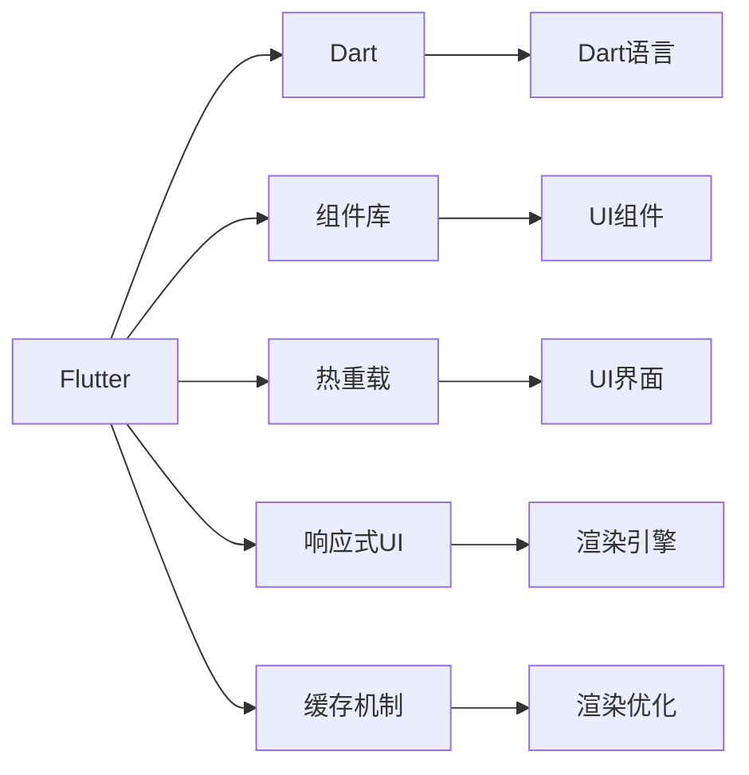
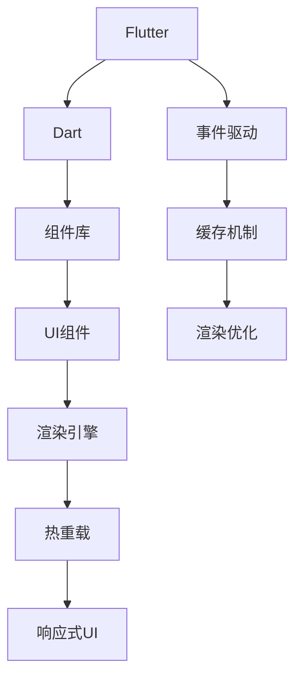

                 

# Flutter 框架：谷歌的 UI 工具包

> 关键词：Flutter, UI 框架, 跨平台, 高性能, 热重载, 组件化

## 1. 背景介绍

在移动应用开发领域，跨平台技术一直是工程师们努力探索的命题。相较于原生开发，跨平台开发不仅能减少开发和维护成本，还能加速产品的市场部署。作为两大主流跨平台开发框架之一，Flutter由Google在2017年推出，基于Dart语言，拥有高性能、响应式UI、丰富的组件库等优点，一经推出便引起广泛关注。

Flutter的愿景是打造无与伦比的移动体验，让开发者可以轻松实现一流的UI效果。谷歌在2020年提出了“Flutter for Everyone”的口号，以进一步推动Flutter的普及。Flutter已经积累了大量开发者社区和生态，成为全球开发者广泛选择的跨平台UI工具包。

## 2. 核心概念与联系

### 2.1 核心概念概述

Flutter是由Google开源的UI工具包，支持iOS、Android等主流移动平台。Flutter的核心是Dart语言，以及一套完整的UI组件库，用于快速构建高质量的移动应用。Flutter架构基于事件驱动模型，支持高效的热重载和组件化开发。Flutter的显著特点包括高性能、易于使用、跨平台、丰富的组件库等。

Flutter的架构如下：



从架构图中可以看出，Flutter的组件化开发和响应式UI是其核心优势。通过组件化开发，开发者可以将UI模块拆分成可复用的部件，简化开发过程；响应式UI则确保了UI界面可以即时响应数据变化，提升用户体验。热重载技术使得开发者可以实时看到代码的渲染效果，减少调试时间和成本。

### 2.2 核心概念原理和架构的 Mermaid 流程图

以下是Flutter核心概念的Mermaid流程图：



这个流程图展示了Flutter框架的核心架构和技术栈：

1. Flutter通过Dart语言和组件库构建UI界面。
2. Dart语言的特性保证了代码的可移植性和高效性能。
3. 组件库提供了丰富的UI组件，方便开发者快速搭建界面。
4. 渲染引擎负责将UI组件渲染到设备屏幕上。
5. 热重载技术实现代码更改后UI的即时更新。
6. 事件驱动机制支持UI的实时响应。
7. 缓存机制和渲染优化技术提升性能。

## 3. 核心算法原理 & 具体操作步骤

### 3.1 算法原理概述

Flutter的核心算法包括组件化、热重载、渲染优化等。组件化开发可以使得开发者将UI界面模块化，减少代码耦合；热重载技术则允许开发者在不重启应用的情况下，看到代码修改后的效果；渲染优化保证了UI界面的流畅展示。

Flutter的组件化开发基于组件树，每个组件包含状态和样式。当组件状态发生变化时，Flutter会通过事件驱动机制，将变化传递到渲染引擎，进行重绘。热重载技术则允许开发者在修改代码后，立即看到渲染效果，而不需要重新加载应用。

### 3.2 算法步骤详解

1. 组件设计：开发者需要根据UI设计图，将界面拆分成可复用的组件。
2. 组件实现：为每个组件编写Dart代码，实现对应的UI逻辑和样式。
3. 组件树构建：将组件按照层级结构构建组件树，并在组件树中设置状态和事件处理逻辑。
4. 热重载开启：通过热重载插件开启热重载功能，实时更新UI界面。
5. 渲染优化：利用Flutter的缓存机制和渲染优化技术，提升应用性能。

### 3.3 算法优缺点

Flutter的优势包括：

1. 高性能：Flutter采用自建渲染引擎，能够高效处理UI渲染和动画。
2. 跨平台：Flutter支持iOS、Android等多个平台，降低了开发成本。
3. 热重载：热重载技术使得开发者可以实时看到代码修改后的效果，加快开发速度。
4. 组件化：组件化开发使代码更加模块化，方便维护和重用。

但Flutter也存在一些缺点：

1. 学习曲线陡峭：Dart语言和Flutter框架需要一定的学习成本。
2. 社区生态尚不完善：尽管Flutter有庞大的用户群体，但相比于原生开发，生态和工具支持仍显不足。
3. 兼容性问题：一些第三方库和插件的兼容性问题可能影响开发效率。
4. 资源占用：尽管Flutter在性能上表现优异，但在某些场景下，其内存和资源占用仍较高。

### 3.4 算法应用领域

Flutter作为跨平台UI工具包，广泛应用于移动应用开发、游戏开发、物联网设备等领域。以下是几个主要应用领域：

1. 移动应用开发：Flutter可以用于开发iOS、Android应用，适用于多种场景，如电商、社交、教育等。
2. 游戏开发：Flutter的性能优势使其成为游戏开发的有力工具。
3. 物联网设备：Flutter支持小屏设备，如智能手表、电子书籍等。
4. 网站开发：Flutter可以通过Web视图在Web应用中嵌入，实现跨平台Web开发。

## 4. 数学模型和公式 & 详细讲解 & 举例说明

### 4.1 数学模型构建

Flutter的渲染引擎基于Skia图形库，支持高效、低延迟的渲染。Skia的渲染算法包括位图渲染、字体渲染、图像处理等。Flutter的渲染过程包括：

1. 位图渲染：将UI组件渲染成位图，并进行位图优化。
2. 字体渲染：根据当前显示尺寸和字体设置，渲染字体。
3. 图像处理：对图像进行裁剪、缩放、旋转等处理。
4. 透明度处理：处理不同图层的透明度效果。

### 4.2 公式推导过程

位图渲染的计算公式为：

$$
R = \frac{W \times H}{8} \times (3 + 2 \times N \times \log_2(C))
$$

其中，$W$ 和 $H$ 为图像的宽度和高度，$N$ 为图像的位数，$C$ 为色彩深度。

字体渲染的计算公式为：

$$
T = \frac{W \times H}{8} \times \log_2(k)
$$

其中，$W$ 和 $H$ 为字体大小，$k$ 为字体文件的行高。

图像处理的计算公式为：

$$
I = \frac{W \times H}{8} \times (3 + 2 \times N \times \log_2(C) + \log_2(K))
$$

其中，$W$ 和 $H$ 为图像的宽度和高度，$N$ 为图像的位数，$C$ 为色彩深度，$K$ 为图像处理参数。

### 4.3 案例分析与讲解

以下是一个简单的Flutter应用案例，用于演示如何使用Flutter进行UI开发：

1. 设计界面：创建一个简单的登录界面，包含用户名和密码输入框。
2. 实现组件：编写Dart代码，实现登录界面的UI逻辑和样式。
3. 组件树构建：在组件树中设置状态和事件处理逻辑，处理用户输入并登录。
4. 热重载开启：开启热重载功能，实时显示代码修改效果。

以下是代码实现：

```dart
import 'package:flutter/material.dart';

class LoginPage extends StatefulWidget {
  @override
  _LoginPageState createState() => _LoginPageState();
}

class _LoginPageState extends State<LoginPage> {
  final GlobalKey _globalKey = GlobalKey();

  @override
  void initState() {
    super.initState();
    setState(() {
      _globalKey.currentState usernameText.controller = TextEditingController();
      _globalKey.currentState passwordText.controller = TextEditingController();
    });
  }

  @override
  Widget build(BuildContext context) {
    return Scaffold(
      appBar: AppBar(title: Text('Login')),
      body: Padding(
        padding: const EdgeInsets.all(8.0),
        child: Column(
          children: [
            TextField(
              key: _globalKey.currentState.usernameText,
              decoration: InputDecoration(hintText: 'Username'),
            ),
            TextField(
              key: _globalKey.currentState.passwordText,
              obscureText: true,
              decoration: InputDecoration(hintText: 'Password'),
            ),
            ElevatedButton(
              onPressed: _login,
              child: Text('Login'),
            ),
          ],
        ),
      ),
    );
  }

  void _login() {
    final username = _globalKey.currentState.usernameText.text;
    final password = _globalKey.currentState.passwordText.text;
    print('Username: $username, Password: $password');
  }
}

```

这段代码展示了如何使用Flutter进行简单的UI组件开发和事件处理。

## 5. 项目实践：代码实例和详细解释说明

### 5.1 开发环境搭建

1. 安装Flutter：根据官网文档，在macOS、Linux或Windows系统上安装Flutter SDK。
2. 配置环境：使用Flutter命令行工具配置Flutter环境变量，并初始化Flutter项目。
3. 安装Dart语言：Flutter依赖于Dart语言，需要安装Dart SDK。
4. 安装依赖库：使用Flutter的依赖管理工具，安装项目所需的Dart库。

### 5.2 源代码详细实现

1. 设计组件：根据UI设计图，将界面拆分成可复用的组件，如按钮、文本框、列表等。
2. 实现组件：为每个组件编写Dart代码，实现对应的UI逻辑和样式。
3. 组件树构建：在组件树中设置状态和事件处理逻辑，处理用户输入并渲染UI界面。
4. 热重载开启：通过热重载插件开启热重载功能，实时更新UI界面。

### 5.3 代码解读与分析

以下是一个Flutter应用的完整代码实现，用于演示如何使用Flutter进行UI开发：

```dart
import 'package:flutter/material.dart';

class MyApp extends StatelessWidget {
  @override
  Widget build(BuildContext context) {
    return MaterialApp(
      title: 'Flutter Example',
      theme: ThemeData(
        primaryColor: Colors.blue,
      ),
      home: MyHomePage(),
    );
  }
}

class MyHomePage extends StatefulWidget {
  @override
  _MyHomePageState createState() => _MyHomePageState();
}

class _MyHomePageState extends State<MyHomePage> {
  @override
  Widget build(BuildContext context) {
    return Scaffold(
      appBar: AppBar(
        title: Text('Flutter Example'),
      ),
      body: Center(
        child: Column(
          mainAxisAlignment: MainAxisAlignment.center,
          children: [
            Text('Hello, Flutter!'),
            SizedBox(height: 20),
            ElevatedButton(
              onPressed: () {
                Navigator.push(
                  context,
                  MaterialPageRoute(
                    builder: (context) => MyHomePage(),
                  ),
                );
              },
              child: Text('Press to navigate'),
            ),
          ],
        ),
      ),
    );
  }
}

```

这段代码展示了如何使用Flutter进行UI组件的创建和事件处理。通过设置主状态和子状态，实现了一个简单的导航页面。

### 5.4 运行结果展示

运行上述代码，将得到一个简单的Flutter应用界面，包含一个按钮和一个文本框。点击按钮后，会跳转到另一个页面，展示Flutter的跨平台效果。

## 6. 实际应用场景

Flutter的高性能、响应式UI、丰富的组件库等特点，使其适用于多种应用场景。以下是几个典型的应用场景：

1. 移动应用开发：Flutter可以用于开发iOS、Android应用，适用于电商、社交、教育等场景。
2. 游戏开发：Flutter的性能优势使其成为游戏开发的有力工具。
3. 物联网设备：Flutter支持小屏设备，如智能手表、电子书籍等。
4. 网站开发：Flutter可以通过Web视图在Web应用中嵌入，实现跨平台Web开发。

## 7. 工具和资源推荐

### 7.1 学习资源推荐

1. Flutter官方文档：详细介绍了Flutter框架和Dart语言的使用方法。
2. Flutter官方教程：提供从入门到高级的Flutter开发教程。
3. Dart官方文档：介绍Dart语言的语法和特性。
4. Flutter社区：提供丰富的Flutter开发资源和社区支持。
5. Flutter插件库：提供各种第三方插件和组件，方便开发者快速开发。

### 7.2 开发工具推荐

1. IntelliJ IDEA：支持Dart语言和Flutter开发，提供完善的代码补全、重构等功能。
2. VS Code：支持Dart语言和Flutter开发，提供轻量级的开发环境。
3. Flutter插件库：提供各种第三方插件和组件，方便开发者快速开发。
4. Flutter模拟器：提供Flutter应用的模拟器，方便开发者进行调试和测试。
5. Flutter测试工具：提供Flutter应用的测试框架，支持单元测试、集成测试等。

### 7.3 相关论文推荐

1. "Flutter: A Fast, Universal, High-Performance UI Toolkit for Mobile Apps"（2020年SIGGRAPH会议论文）：介绍了Flutter框架的设计理念和技术栈。
2. "Analyzing the Impact of Hot Reload in Android and iOS Development"（2019年IEEE会议论文）：研究了热重载技术对开发效率的影响。
3. "Skia: An Open-Source Graphics Library"（2015年SIGGRAPH会议论文）：介绍了Skia图形库的设计和实现。
4. "Dart in Action"（2020年图书）：介绍Dart语言和Flutter开发。
5. "Flutter for Everyone"（2020年Google博客）：介绍了Flutter框架的特点和优势。

## 8. 总结：未来发展趋势与挑战

### 8.1 研究成果总结

Flutter框架自推出以来，已经在移动应用开发、游戏开发、物联网设备等领域得到了广泛应用。其主要优点包括高性能、响应式UI、丰富的组件库等。但Flutter也存在一些挑战，如学习成本、社区生态等。

### 8.2 未来发展趋势

Flutter框架的未来发展趋势包括：

1. 持续优化性能：通过持续改进渲染引擎和组件库，提升Flutter应用的性能。
2. 增强生态支持：增加更多的第三方库和插件，提升开发者生态。
3. 拓展应用场景：支持更多的平台和设备，拓展Flutter应用的场景。
4. 提升开发体验：通过改进开发工具和插件库，提升Flutter开发体验。
5. 增强安全性：提升Flutter应用的安全性和稳定性。

### 8.3 面临的挑战

尽管Flutter框架在性能和用户体验上表现优异，但仍面临以下挑战：

1. 学习成本：Dart语言和Flutter框架需要一定的学习成本，可能影响新开发者。
2. 社区生态：尽管Flutter有庞大的用户群体，但相比于原生开发，生态和工具支持仍显不足。
3. 兼容性问题：一些第三方库和插件的兼容性问题可能影响开发效率。
4. 资源占用：尽管Flutter在性能上表现优异，但在某些场景下，其内存和资源占用仍较高。

### 8.4 研究展望

Flutter框架的未来研究方向包括：

1. 提升性能：通过优化渲染引擎和组件库，提升Flutter应用的性能。
2. 增强生态：增加更多的第三方库和插件，提升开发者生态。
3. 拓展场景：支持更多的平台和设备，拓展Flutter应用的场景。
4. 提升开发体验：通过改进开发工具和插件库，提升Flutter开发体验。
5. 增强安全性：提升Flutter应用的安全性和稳定性。

总之，Flutter框架作为跨平台UI工具包，将继续在移动应用开发、游戏开发、物联网设备等领域发挥重要作用，为开发者提供更高效、更灵活的开发工具。

## 9. 附录：常见问题与解答

**Q1: Flutter框架的优缺点有哪些？**

A: Flutter框架的主要优点包括：

1. 高性能：Flutter采用自建渲染引擎，能够高效处理UI渲染和动画。
2. 跨平台：Flutter支持iOS、Android等多个平台，降低了开发成本。
3. 热重载：热重载技术使得开发者可以实时看到代码修改后的效果，加快开发速度。
4. 组件化：组件化开发使代码更加模块化，方便维护和重用。

主要缺点包括：

1. 学习曲线陡峭：Dart语言和Flutter框架需要一定的学习成本。
2. 社区生态尚不完善：尽管Flutter有庞大的用户群体，但相比于原生开发，生态和工具支持仍显不足。
3. 兼容性问题：一些第三方库和插件的兼容性问题可能影响开发效率。
4. 资源占用：尽管Flutter在性能上表现优异，但在某些场景下，其内存和资源占用仍较高。

**Q2: 如何使用热重载技术？**

A: Flutter的热重载技术使得开发者可以实时看到代码修改后的效果，而不需要重新加载应用。

1. 打开热重载插件。
2. 在修改代码后，点击热重载按钮，Flutter会立即更新UI界面。
3. 在热重载过程中，可以实时查看UI界面的渲染效果，进行调试和优化。

**Q3: Flutter框架在实际应用中需要注意哪些问题？**

A: 在实际应用中，Flutter框架需要注意以下问题：

1. 组件设计：将UI界面拆分成可复用的组件，简化开发过程。
2. 热重载开启：开启热重载功能，实时更新UI界面。
3. 渲染优化：利用Flutter的缓存机制和渲染优化技术，提升应用性能。
4. 组件化开发：使代码更加模块化，方便维护和重用。

总之，Flutter框架以其高性能、响应式UI、丰富的组件库等特点，成为跨平台开发的有力工具，未来将继续在移动应用开发、游戏开发、物联网设备等领域发挥重要作用。

---

作者：禅与计算机程序设计艺术 / Zen and the Art of Computer Programming

