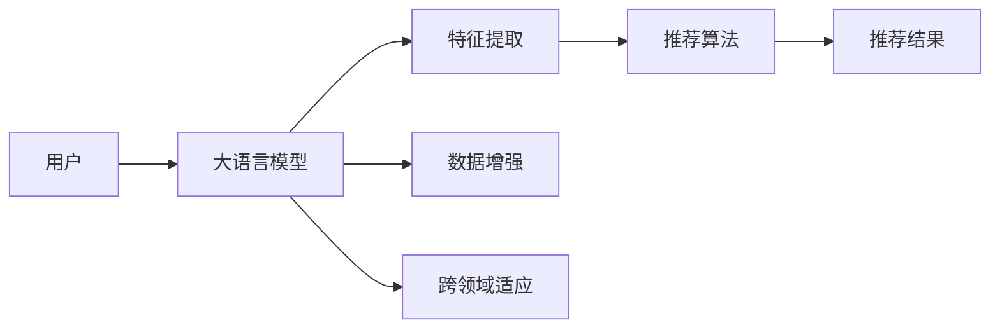

                 

# GENRE：灵活、可配置LLM推荐

> 关键词：自然语言处理（NLP），推荐系统，语言模型，个性化推荐，数据增强，嵌入式系统，跨领域适应

## 1. 背景介绍

### 1.1 问题由来

推荐系统是现代互联网服务不可或缺的一部分，无论是电商平台的商品推荐，视频网站的内容推荐，还是社交网络的朋友推荐，都极大地提升了用户体验和平台粘性。随着推荐系统的不断发展，推荐算法的种类和复杂度也在不断增加，从基于协同过滤、基于内容的推荐，到基于深度学习的推荐，推荐系统正在变得更加智能化和个性化。

近年来，大语言模型（Large Language Models, LLMs）在推荐系统中的应用越来越受到关注。特别是基于预训练语言模型的推荐系统，能够利用自然语言处理（NLP）技术，直接从文本中抽取和理解用户的兴趣和需求，提升推荐质量。本文将详细介绍基于大语言模型推荐系统的设计理念和实践方法，通过实例展示如何构建灵活、可配置的推荐系统。

### 1.2 问题核心关键点

本文将重点介绍以下关键点：

- 大语言模型推荐系统的核心概念和设计思路。
- 推荐系统中的交互式、可配置特性。
- 推荐模型的选择和参数配置方法。
- 推荐系统中的数据增强和跨领域适应技术。

通过深入理解这些关键点，本文旨在帮助读者系统掌握基于大语言模型的推荐系统设计思路，并具体应用到实际项目中。

## 2. 核心概念与联系

### 2.1 核心概念概述

- **大语言模型（LLMs）**：以Transformer架构为代表的语言模型，通过大规模无标签数据进行预训练，学习到丰富的语言知识和语义信息，具备强大的自然语言理解和生成能力。

- **推荐系统**：根据用户的历史行为和兴趣，为用户推荐可能感兴趣的商品、内容、人等信息。

- **自然语言处理（NLP）**：研究如何让计算机理解和处理人类语言的技术，包括文本预处理、特征提取、文本分类、情感分析等。

- **交互式、可配置推荐**：推荐系统能够根据用户输入的不同参数和指令，动态调整推荐策略和算法参数，实现个性化的推荐。

- **数据增强和跨领域适应**：通过对数据进行增强和处理，提升模型在特定领域或小样本情况下的适应能力，提高推荐效果。

这些核心概念之间相互联系，构成了基于大语言模型的推荐系统的基本框架。通过理解这些概念，读者可以更好地把握推荐系统的设计思路和实现方法。

### 2.2 核心概念原理和架构的 Mermaid 流程图



这个流程图展示了基于大语言模型的推荐系统的主要组件和流程：用户输入，大语言模型进行特征提取，推荐算法生成推荐结果，同时数据增强和跨领域适应技术被应用到模型训练和推理中。

## 3. 核心算法原理 & 具体操作步骤

### 3.1 算法原理概述

基于大语言模型的推荐系统，其核心原理是利用预训练语言模型对用户输入的文本进行特征提取，然后将其作为输入，结合推荐算法生成推荐结果。具体流程如下：

1. **预处理和特征提取**：将用户输入的文本进行分词、去除停用词等预处理操作，然后使用大语言模型提取文本特征。

2. **推荐算法**：将提取的文本特征作为输入，结合推荐算法生成推荐结果。

3. **数据增强和跨领域适应**：通过数据增强技术，增加训练集多样性，提高模型鲁棒性。同时，通过跨领域适应技术，使模型在不同领域间具有更好的泛化能力。

4. **交互式、可配置推荐**：通过用户输入的不同参数和指令，动态调整推荐策略和算法参数，实现个性化的推荐。

### 3.2 算法步骤详解

基于大语言模型的推荐系统的主要步骤如下：

**Step 1: 数据准备和预处理**

- 收集推荐系统的训练和测试数据，确保数据的多样性和代表性。
- 对用户行为数据进行预处理，包括数据清洗、特征工程等。

**Step 2: 选择大语言模型**

- 根据任务特点选择合适的预训练语言模型，如BERT、GPT等。
- 使用模型进行文本特征提取。

**Step 3: 设计推荐算法**

- 根据任务需求选择合适的推荐算法，如协同过滤、基于内容的推荐、基于深度学习的推荐等。
- 结合大语言模型提取的文本特征，进行推荐结果生成。

**Step 4: 进行数据增强**

- 对训练集进行数据增强，如文本同义词替换、反向翻译等，增加数据多样性。

**Step 5: 应用跨领域适应技术**

- 在模型训练和推理中，应用跨领域适应技术，如多任务学习、迁移学习等，提高模型在不同领域的泛化能力。

**Step 6: 实现交互式、可配置推荐**

- 根据用户输入的参数和指令，动态调整推荐策略和算法参数，实现个性化的推荐。

**Step 7: 评估和优化**

- 使用测试集评估推荐系统的性能，根据评估结果进行优化调整。

### 3.3 算法优缺点

基于大语言模型的推荐系统具有以下优点：

- **灵活性高**：可以根据用户输入的不同参数和指令，动态调整推荐策略和算法参数，实现个性化的推荐。
- **可配置性强**：通过不同的大语言模型和推荐算法，可以灵活组合，适应不同的推荐场景和需求。
- **泛化能力强**：数据增强和跨领域适应技术的应用，使得模型在不同领域和数据量的情况下，都能保持较高的推荐效果。

同时，基于大语言模型的推荐系统也存在以下缺点：

- **计算资源需求高**：预训练语言模型的参数量较大，需要较高的计算资源。
- **训练时间长**：预训练和微调过程需要较长时间，模型更新缓慢。
- **解释性不足**：模型内部的工作机制复杂，难以解释推荐结果的来源。

### 3.4 算法应用领域

基于大语言模型的推荐系统可以应用于多个领域，如：

- **电商推荐**：根据用户浏览、购买历史，推荐相关商品。
- **内容推荐**：根据用户阅读、观看历史，推荐相关文章、视频。
- **社交推荐**：根据用户互动历史，推荐可能感兴趣的朋友。
- **搜索推荐**：根据用户的查询历史，推荐相关搜索结果。

此外，基于大语言模型的推荐系统还被应用于新闻推荐、旅游推荐、教育推荐等多个场景，为各行各业带来了显著的商业价值。

## 4. 数学模型和公式 & 详细讲解 & 举例说明

### 4.1 数学模型构建

基于大语言模型的推荐系统，其核心数学模型可以表示为：

$$
\hat{Y} = M(\text{Features}(X))
$$

其中，$\hat{Y}$ 为推荐结果，$M$ 为推荐算法模型，$\text{Features}(X)$ 为从用户输入的文本 $X$ 中提取的特征。

### 4.2 公式推导过程

假设用户输入的文本为 $X = \{x_1, x_2, ..., x_n\}$，大语言模型提取的特征为 $\text{Features}(X) = \{f_1(x_1), f_2(x_2), ..., f_n(x_n)\}$。推荐算法的数学模型为 $M = f_Y(\text{Features})$，其中 $f_Y$ 为推荐结果生成函数。

对于协同过滤算法，其数学模型可以表示为：

$$
\hat{Y} = \alpha \cdot \frac{1}{1 + e^{-\beta\cdot \text{dot}(\text{Features}, \text{Features}_u)}}
$$

其中，$\alpha$ 为调节系数，$\beta$ 为学习率，$\text{dot}(\text{Features}, \text{Features}_u)$ 为特征向量点积。

对于基于内容的推荐算法，其数学模型可以表示为：

$$
\hat{Y} = \text{Softmax}(\text{Features} \cdot W + b)
$$

其中，$W$ 为权重矩阵，$b$ 为偏置向量，$\text{Softmax}$ 为softmax函数。

### 4.3 案例分析与讲解

以电商推荐为例，假设用户输入的文本为“我想买一双运动鞋”，大语言模型提取的特征为 $[0.8, 0.7, 0.6, 0.5, ...]$，推荐算法的输出为：

$$
\hat{Y} = \text{Softmax}(0.8 \cdot W + b)
$$

其中 $W$ 和 $b$ 为模型参数，$\text{Softmax}$ 函数将输出转换为概率分布。最终，推荐系统推荐给用户最可能感兴趣的运动鞋。

## 5. 项目实践：代码实例和详细解释说明

### 5.1 开发环境搭建

基于大语言模型的推荐系统通常使用Python和PyTorch进行开发。以下是Python和PyTorch的开发环境搭建流程：

1. 安装Anaconda：从官网下载并安装Anaconda，用于创建独立的Python环境。

2. 创建并激活虚拟环境：
```bash
conda create -n pytorch-env python=3.8 
conda activate pytorch-env
```

3. 安装PyTorch：根据CUDA版本，从官网获取对应的安装命令。例如：
```bash
conda install pytorch torchvision torchaudio cudatoolkit=11.1 -c pytorch -c conda-forge
```

4. 安装Transformers库：
```bash
pip install transformers
```

5. 安装各类工具包：
```bash
pip install numpy pandas scikit-learn matplotlib tqdm jupyter notebook ipython
```

完成上述步骤后，即可在`pytorch-env`环境中开始推荐系统的开发。

### 5.2 源代码详细实现

以下是一个简单的基于大语言模型的电商推荐系统代码实现：

```python
import torch
import torch.nn as nn
import torch.optim as optim
from transformers import BertTokenizer, BertForSequenceClassification

class RecommendationModel(nn.Module):
    def __init__(self, num_classes):
        super(RecommendationModel, self).__init__()
        self.bert = BertForSequenceClassification.from_pretrained('bert-base-cased', num_labels=num_classes)
        self.fc = nn.Linear(768, num_classes)

    def forward(self, input_ids, attention_mask):
        outputs = self.bert(input_ids, attention_mask=attention_mask)
        pooled_output = outputs.pooler_output
        logits = self.fc(pooled_output)
        return logits

# 数据准备
tokenizer = BertTokenizer.from_pretrained('bert-base-cased')
train_data = ... # 电商推荐训练数据
val_data = ... # 电商推荐验证数据
test_data = ... # 电商推荐测试数据

# 模型训练
model = RecommendationModel(num_classes=2) # 假设电商推荐为二分类任务
optimizer = optim.Adam(model.parameters(), lr=1e-5)
loss_fn = nn.CrossEntropyLoss()

for epoch in range(10):
    model.train()
    for data in train_data:
        input_ids = tokenizer(data['text'], return_tensors='pt')['input_ids']
        attention_mask = tokenizer(data['text'], return_tensors='pt')['attention_mask']
        optimizer.zero_grad()
        logits = model(input_ids, attention_mask)
        loss = loss_fn(logits, torch.tensor(data['label'], dtype=torch.long))
        loss.backward()
        optimizer.step()

    model.eval()
    with torch.no_grad():
        val_loss = 0
        for data in val_data:
            input_ids = tokenizer(data['text'], return_tensors='pt')['input_ids']
            attention_mask = tokenizer(data['text'], return_tensors='pt')['attention_mask']
            logits = model(input_ids, attention_mask)
            val_loss += loss_fn(logits, torch.tensor(data['label'], dtype=torch.long)).item()
        print(f'Epoch {epoch+1}, validation loss: {val_loss/len(val_data)}')

# 模型评估
model.eval()
test_loss = 0
for data in test_data:
    input_ids = tokenizer(data['text'], return_tensors='pt')['input_ids']
    attention_mask = tokenizer(data['text'], return_tensors='pt')['attention_mask']
    logits = model(input_ids, attention_mask)
    test_loss += loss_fn(logits, torch.tensor(data['label'], dtype=torch.long)).item()
print(f'Test loss: {test_loss/len(test_data)}')
```

### 5.3 代码解读与分析

**RecommendationModel类**：
- `__init__方法`：初始化模型结构，包括BERT模型和全连接层。
- `forward方法`：定义模型的前向传播过程。

**数据准备**：
- 使用BertTokenizer从预训练模型中加载分词器。
- 准备电商推荐训练数据、验证数据和测试数据，包含文本和标签。

**模型训练**：
- 创建模型和优化器，设置损失函数。
- 使用Adam优化器进行模型训练，通过前向传播和反向传播更新模型参数。

**模型评估**：
- 在测试集上评估模型性能，输出测试集损失。

## 6. 实际应用场景

### 6.1 电商推荐

电商推荐系统是推荐系统中典型应用之一，通过分析用户行为数据，为用户推荐可能感兴趣的商品。使用大语言模型提取用户输入的文本特征，结合推荐算法生成推荐结果，可以显著提升推荐效果。

**数据准备**：
- 收集用户浏览、购买历史数据，包括商品ID、购买时间、评分等信息。
- 对数据进行预处理，如去除无效记录、归一化评分等。

**特征提取**：
- 使用BertTokenizer对用户输入的文本进行分词。
- 将分词后的文本输入BERT模型，提取文本特征。

**模型训练**：
- 选择协同过滤、基于内容的推荐算法，或基于深度学习的推荐算法。
- 将提取的文本特征作为输入，结合推荐算法生成推荐结果。

**模型评估**：
- 使用A/B测试等方法评估推荐效果。
- 通过优化推荐算法和模型参数，进一步提升推荐效果。

### 6.2 内容推荐

内容推荐系统包括新闻推荐、视频推荐、音频推荐等，通过分析用户的历史行为数据，为用户推荐可能感兴趣的内容。使用大语言模型提取用户输入的文本特征，结合推荐算法生成推荐结果，可以提高推荐的精准性和个性化。

**数据准备**：
- 收集用户阅读、观看历史数据，包括内容ID、观看时间、评分等信息。
- 对数据进行预处理，如去除无效记录、归一化评分等。

**特征提取**：
- 使用BertTokenizer对用户输入的文本进行分词。
- 将分词后的文本输入BERT模型，提取文本特征。

**模型训练**：
- 选择协同过滤、基于内容的推荐算法，或基于深度学习的推荐算法。
- 将提取的文本特征作为输入，结合推荐算法生成推荐结果。

**模型评估**：
- 使用A/B测试等方法评估推荐效果。
- 通过优化推荐算法和模型参数，进一步提升推荐效果。

## 7. 工具和资源推荐

### 7.1 学习资源推荐

为了帮助开发者系统掌握基于大语言模型的推荐系统，这里推荐一些优质的学习资源：

1. 《Deep Learning for Recommendation Systems》书籍：全面介绍了深度学习在推荐系统中的应用，包括协同过滤、基于内容的推荐、基于深度学习的推荐等。

2. 《Reinforcement Learning for Recommendation Systems》书籍：介绍了强化学习在推荐系统中的应用，如Q-learning、Policy Gradient等。

3. 《Natural Language Processing with Transformers》书籍：Transformers库的作者所著，全面介绍了如何使用Transformers库进行NLP任务开发，包括微调、跨领域适应等。

4. 《Machine Learning Yearning》书籍：由深度学习专家Andrew Ng所著，介绍了机器学习项目开发中的最佳实践和经验。

5. CS250《Reinforcement Learning》课程：斯坦福大学开设的强化学习课程，深入浅出地介绍了强化学习的基本概念和算法。

通过对这些资源的学习实践，相信你一定能够快速掌握基于大语言模型的推荐系统设计思路，并具体应用到实际项目中。

### 7.2 开发工具推荐

高效的开发离不开优秀的工具支持。以下是几款用于基于大语言模型推荐系统开发的常用工具：

1. PyTorch：基于Python的开源深度学习框架，灵活动态的计算图，适合快速迭代研究。大部分预训练语言模型都有PyTorch版本的实现。

2. TensorFlow：由Google主导开发的开源深度学习框架，生产部署方便，适合大规模工程应用。同样有丰富的预训练语言模型资源。

3. Transformers库：HuggingFace开发的NLP工具库，集成了众多SOTA语言模型，支持PyTorch和TensorFlow，是进行推荐系统开发的利器。

4. Weights & Biases：模型训练的实验跟踪工具，可以记录和可视化模型训练过程中的各项指标，方便对比和调优。与主流深度学习框架无缝集成。

5. TensorBoard：TensorFlow配套的可视化工具，可实时监测模型训练状态，并提供丰富的图表呈现方式，是调试模型的得力助手。

6. Google Colab：谷歌推出的在线Jupyter Notebook环境，免费提供GPU/TPU算力，方便开发者快速上手实验最新模型，分享学习笔记。

合理利用这些工具，可以显著提升基于大语言模型推荐系统的开发效率，加快创新迭代的步伐。

### 7.3 相关论文推荐

大语言模型和推荐系统的发展源于学界的持续研究。以下是几篇奠基性的相关论文，推荐阅读：

1. Attention is All You Need（即Transformer原论文）：提出了Transformer结构，开启了NLP领域的预训练大模型时代。

2. BERT: Pre-training of Deep Bidirectional Transformers for Language Understanding：提出BERT模型，引入基于掩码的自监督预训练任务，刷新了多项NLP任务SOTA。

3. Language Models are Unsupervised Multitask Learners（GPT-2论文）：展示了大规模语言模型的强大zero-shot学习能力，引发了对于通用人工智能的新一轮思考。

4. Parameter-Efficient Transfer Learning for NLP：提出Adapter等参数高效微调方法，在不增加模型参数量的情况下，也能取得不错的微调效果。

5. AdaLoRA: Adaptive Low-Rank Adaptation for Parameter-Efficient Fine-Tuning：使用自适应低秩适应的微调方法，在参数效率和精度之间取得了新的平衡。

6. Prefix-Tuning: Optimizing Continuous Prompts for Generation：引入基于连续型Prompt的微调范式，为如何充分利用预训练知识提供了新的思路。

这些论文代表了大语言模型和推荐系统的发展脉络。通过学习这些前沿成果，可以帮助研究者把握学科前进方向，激发更多的创新灵感。

## 8. 总结：未来发展趋势与挑战

### 8.1 总结

本文对基于大语言模型的推荐系统进行了全面系统的介绍。首先阐述了推荐系统的设计理念和具体流程，明确了基于大语言模型的推荐系统的核心思路。其次，从原理到实践，详细讲解了推荐系统的数学模型和代码实现，通过实例展示了灵活、可配置推荐系统的构建。同时，本文还广泛探讨了推荐系统在电商、内容推荐等多个行业领域的应用前景，展示了基于大语言模型的推荐系统的巨大潜力。此外，本文精选了推荐系统的各类学习资源，力求为读者提供全方位的技术指引。

通过本文的系统梳理，可以看到，基于大语言模型的推荐系统正在成为推荐系统中重要的范式，极大地拓展了推荐系统的应用边界，催生了更多的落地场景。受益于大规模语料的预训练，基于大语言模型的推荐系统在个性化推荐、内容推荐等方面都取得了显著的效果，为各行各业带来了显著的商业价值。未来，伴随预训练语言模型和推荐方法的持续演进，基于大语言模型的推荐系统必将在更广阔的应用领域大放异彩。

### 8.2 未来发展趋势

展望未来，基于大语言模型的推荐系统将呈现以下几个发展趋势：

1. **计算资源需求降低**：随着预训练语言模型压缩和优化技术的发展，推荐系统计算资源需求将逐渐降低，能够更广泛地应用于各类设备上。

2. **推荐模型多样化**：推荐系统将不再局限于基于深度学习的模型，也将探索基于符号逻辑、因果推理等方法的推荐算法。

3. **跨领域适应能力提升**：通过引入跨领域适应技术，推荐系统将更好地适应不同领域的推荐需求，如电商、内容、社交等。

4. **实时推荐系统**：随着技术的发展，推荐系统将能够实时处理用户输入，动态生成推荐结果，提高用户体验。

5. **用户交互增强**：通过交互式推荐技术，推荐系统将能够根据用户反馈和行为，动态调整推荐策略，实现更加个性化的推荐。

6. **多模态推荐系统**：推荐系统将融合视觉、音频等多模态数据，提升推荐效果和用户体验。

这些趋势凸显了基于大语言模型的推荐系统的广阔前景。这些方向的探索发展，必将进一步提升推荐系统的性能和应用范围，为各行各业带来更大的商业价值。

### 8.3 面临的挑战

尽管基于大语言模型的推荐系统已经取得了瞩目成就，但在迈向更加智能化、普适化应用的过程中，它仍面临着诸多挑战：

1. **计算资源瓶颈**：预训练语言模型参数量较大，需要较高的计算资源。如何优化模型结构，降低计算资源需求，是一个重要挑战。

2. **推荐效率提升**：预训练语言模型推理速度较慢，如何优化模型结构，提升推理效率，是一个亟待解决的问题。

3. **推荐系统偏见**：预训练语言模型可能学习到有偏见的信息，如何消除模型偏见，避免推荐系统输出误导性信息，是一个重要挑战。

4. **数据隐私保护**：用户数据隐私保护是一个重要问题，如何保障用户数据安全，同时提高推荐系统效果，是一个重要挑战。

5. **推荐系统公平性**：推荐系统可能存在性别、种族等偏见，如何确保推荐系统公平性，是一个重要挑战。

6. **推荐系统透明性**：推荐系统决策过程复杂，如何提高推荐系统透明性和可解释性，是一个重要挑战。

### 8.4 研究展望

面对基于大语言模型的推荐系统所面临的种种挑战，未来的研究需要在以下几个方面寻求新的突破：

1. **高效模型压缩和优化**：开发更高效的模型压缩和优化技术，降低计算资源需求，提高推荐效率。

2. **多模态推荐系统**：融合视觉、音频等多模态数据，提升推荐系统效果和用户体验。

3. **跨领域适应技术**：研究跨领域适应技术，使推荐系统更好地适应不同领域的推荐需求。

4. **推荐系统公平性**：确保推荐系统公平性，消除性别、种族等偏见。

5. **推荐系统透明性**：提高推荐系统透明性和可解释性，让用户能够理解推荐结果的来源。

6. **用户数据隐私保护**：保障用户数据隐私，同时提高推荐系统效果。

这些研究方向的探索，必将引领基于大语言模型的推荐系统走向更高的台阶，为构建安全、可靠、可解释、可控的智能系统铺平道路。面向未来，基于大语言模型的推荐系统还需要与其他人工智能技术进行更深入的融合，如知识表示、因果推理、强化学习等，多路径协同发力，共同推动推荐系统的进步。只有勇于创新、敢于突破，才能不断拓展推荐系统的边界，让智能技术更好地服务于人类社会。

## 9. 附录：常见问题与解答

**Q1：如何选择合适的预训练语言模型？**

A: 选择合适的预训练语言模型需要考虑多个因素，包括任务的复杂度、数据的类型、模型的参数量等。一般来说，对于复杂的任务和大量的数据，可以选择参数量较大的模型，如BERT、GPT等。对于简单的任务和较小的数据集，可以选择参数量较小的模型，如ALBERT、DistilBERT等。

**Q2：预训练语言模型需要预训练多少次才能保证推荐效果？**

A: 预训练语言模型的预训练次数需要根据具体的任务和数据集进行调参。一般来说，预训练次数越多，模型性能越好，但也需要更多的计算资源。在实际应用中，可以通过A/B测试等方式评估不同预训练次数的模型效果，选择最优的预训练次数。

**Q3：如何避免推荐系统中的推荐结果偏差？**

A: 推荐系统中的推荐结果偏差可以通过以下方法避免：
1. 数据预处理：去除无效记录、归一化评分等，提高数据质量。
2. 模型优化：使用交叉验证、正则化等方法，防止模型过拟合。
3. 用户反馈：根据用户反馈动态调整推荐策略，提升推荐效果。

**Q4：如何评估推荐系统的性能？**

A: 推荐系统的性能评估可以通过以下指标进行：
1. 准确率（Accuracy）：推荐结果与真实标签的匹配度。
2. 召回率（Recall）：真实标签在推荐结果中的比例。
3. F1分数（F1 Score）：准确率和召回率的调和平均值。
4. A/B测试：通过对比实验，评估推荐系统的效果。

**Q5：如何提高推荐系统的泛化能力？**

A: 提高推荐系统的泛化能力可以通过以下方法实现：
1. 数据增强：通过回译、近义替换等方式增加训练集多样性。
2. 跨领域适应：通过多任务学习、迁移学习等方法，提升模型在不同领域的泛化能力。
3. 正则化：使用L2正则、Dropout等方法，防止模型过拟合。

这些方法可以帮助推荐系统更好地适应不同领域和数据量的需求，提高模型的泛化能力。

---

作者：禅与计算机程序设计艺术 / Zen and the Art of Computer Programming

