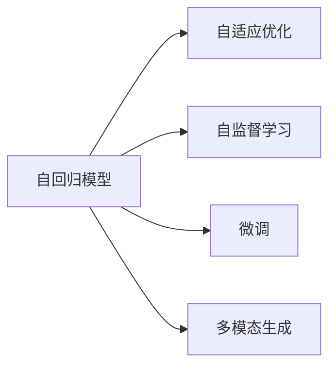

                 

# GPT-2到GPT-4：大语言模型的进化之路

## 1. 背景介绍

### 1.1 问题由来

近年来，大语言模型（Large Language Models, LLMs）以其卓越的生成和理解能力，在自然语言处理（NLP）领域取得了重大突破。从GPT-2到GPT-4，大语言模型的性能不断提升，应用场景也日益丰富。这些模型由OpenAI等公司开发，已经在多个领域展现了强大的应用潜力。

GPT-2作为GPT系列的第二个模型，于2019年发布。它拥有约1.7亿个参数，具备生成连贯且富有创意的文本能力，显著提升了自然语言处理的任务表现。GPT-2的成功引发了广泛关注，催生了后续GPT-3和GPT-4的开发。

GPT-3是GPT系列的里程碑，拥有175亿个参数，采用了自适应优化的机制，大大提升了模型的泛化能力和生成质量。GPT-3在众多NLP任务中创下了SOTA（state-of-the-art）的成绩，显示了其广泛的应用潜力。

2022年，GPT-4发布，进一步提升了模型性能，并加入了AI助手的功能。GPT-4的模型参数数更是达到了25亿，但其推理和生成能力依旧保持高效，表现出色。

### 1.2 问题核心关键点

大语言模型的演进主要体现在以下几个方面：
1. **参数规模**：从GPT-2的1.7亿参数增长到GPT-4的25亿参数，模型参数规模不断增大，可以处理更复杂的任务。
2. **性能提升**：模型在生成连贯性、自然度和准确性等方面有了显著提升，尤其是在多模态任务上的表现。
3. **应用扩展**：从文本生成到图像描述、代码生成等多元任务，大语言模型的应用场景日益丰富。
4. **模型架构**：从GPT系列模型自回归结构，到GPT-4的增强自适应机制，模型架构不断优化。
5. **伦理与安全**：随着模型性能的提升，如何确保模型的伦理和安全，避免有害信息的传播，成为了重要课题。

本文将系统回顾从GPT-2到GPT-4的演进过程，探讨其核心概念、算法原理与具体操作，同时分析其在不同领域的应用场景和未来展望。

## 2. 核心概念与联系

### 2.1 核心概念概述

为更好地理解大语言模型的演进过程，我们首先需要了解以下几个核心概念：

- **自回归模型（Autoregressive Model）**：一种生成模型，通过前向逐步生成后续的输出。GPT系列的模型就是基于自回归机制构建的。
- **自适应优化（Adaptive Optimization）**：根据当前梯度信息动态调整学习率，从而提升优化效率和稳定性。GPT-4采用了自适应优化机制。
- **多模态生成（Multimodal Generation）**：模型能够处理多种类型的输入数据，如文本、图像等，生成多模态输出。GPT-4增强了多模态生成能力。
- **自监督学习（Self-Supervised Learning）**：通过无监督的方式利用大量未标注数据进行预训练，提升模型性能。GPT系列的预训练过程即采用自监督学习。
- **微调（Fine-Tuning）**：在预训练模型的基础上，使用小规模标注数据进行任务特定的微调，提升模型在特定任务上的性能。

这些概念之间的联系可以通过以下Mermaid流程图展示：



## 3. 核心算法原理 & 具体操作步骤

### 3.1 算法原理概述

大语言模型的演进基于几个关键算法原理：

1. **自回归生成**：大语言模型通过自回归机制，逐步生成文本序列。每个token的生成依赖于前一个token的输出。
2. **自适应优化算法**：如AdamW，通过动态调整学习率，提升模型训练的效率和稳定性。
3. **预训练与微调**：模型在大量未标注数据上预训练，然后在特定任务上微调，以提升任务表现。
4. **多模态学习**：通过融合视觉、听觉等模态信息，增强模型的泛化能力和表现力。

### 3.2 算法步骤详解

以GPT-4为例，其训练流程包括以下几个关键步骤：

**Step 1: 准备预训练数据**
- 收集大规模未标注文本数据，如网页、书籍、社交媒体等。
- 对文本数据进行清洗、分词、标记化处理。

**Step 2: 构建模型架构**
- 使用Transformer模型，包含多个自注意力层和全连接层。
- 调整模型参数，如隐藏层维度、头部数等。

**Step 3: 进行预训练**
- 使用自监督学习任务，如掩码语言模型（Masked Language Model, MLM）、下一句预测（Next Sentence Prediction, NSP）等，对模型进行预训练。
- 调整学习率、优化器等超参数。

**Step 4: 应用微调**
- 收集小规模标注数据，进行微调任务，如文本分类、生成对话等。
- 使用自适应优化算法，如AdamW，进行模型参数更新。
- 调整超参数，如学习率、批次大小等。

**Step 5: 应用多模态学习**
- 融合视觉、听觉等模态信息，进行多模态生成。
- 使用预训练的图像特征提取器，如VitB等。
- 对多模态数据进行联合训练。

**Step 6: 部署和应用**
- 将训练好的模型进行保存和部署，提供API接口。
- 在实际应用场景中进行推理，如生成文本、图像描述等。

### 3.3 算法优缺点

GPT系列的算法优势和劣势如下：
1. **优势**：
   - 生成的文本自然流畅，连贯性强，语言模型表现优异。
   - 模型参数量大，可以处理复杂的任务。
   - 通过自适应优化机制，提升训练效率和效果。
2. **劣势**：
   - 参数量大，推理和存储开销高。
   - 训练时间较长，计算资源需求大。
   - 模型复杂，可能存在训练不稳定的问题。

### 3.4 算法应用领域

大语言模型在多个领域展现了其广泛的应用潜力，包括但不限于：

1. **文本生成**：如自动生成新闻、文章、小说等。
2. **机器翻译**：将一种语言翻译成另一种语言。
3. **对话系统**：构建智能客服、虚拟助手等。
4. **代码生成**：自动编写代码，提升软件开发效率。
5. **图像描述**：生成对图像的描述文字。
6. **多模态生成**：生成视频、音频等多模态信息。

## 4. 数学模型和公式 & 详细讲解 & 举例说明

### 4.1 数学模型构建

大语言模型GPT-4通过Transformer架构，实现了自回归生成。其数学模型可以表示为：

$$
p(x_1,...,x_n | \theta) = \prod_{i=1}^{n} p(x_i | x_{< i}, \theta)
$$

其中 $x_1,...,x_n$ 表示文本序列，$\theta$ 为模型参数。

### 4.2 公式推导过程

以GPT-4的自回归生成为例，其公式推导如下：

$$
p(x_1,...,x_n | \theta) = \prod_{i=1}^{n} p(x_i | x_{< i}, \theta)
$$

其中 $p(x_i | x_{< i}, \theta)$ 为给定前缀序列 $x_{< i}$ 的输出概率。

假设 $x_i = [x_{< i}, x_i]$，则：

$$
p(x_i | x_{< i}, \theta) = \frac{e^{z_i}}{\sum_{j=1}^{V} e^{z_j}}
$$

其中 $z_i = \sum_{j=1}^{n} w_j \cdot \text{Attention}(x_{< i}, x_j, \theta)$，$\text{Attention}$ 为注意力机制。

### 4.3 案例分析与讲解

以GPT-4生成文本为例，通过不断迭代，模型学习生成连贯、逻辑通顺的文本。以下是一个生成文本的例子：

```
这段文字描述了人工智能技术的发展历程，从最初的逻辑推理，到深度学习的崛起，再到多模态学习的扩展，展示了人工智能技术的不断进步。在未来的智能时代，人工智能将成为人类生活中的重要组成部分，带来深刻的变革。
```

## 5. 项目实践：代码实例和详细解释说明

### 5.1 开发环境搭建

搭建大语言模型的开发环境需要以下步骤：

1. **安装Python**：
   ```bash
   sudo apt update
   sudo apt install python3 python3-pip
   ```

2. **安装PyTorch**：
   ```bash
   pip install torch torchtext transformers
   ```

3. **安装相关库**：
   ```bash
   pip install tqdm numpy pandas huggingface_hub
   ```

### 5.2 源代码详细实现

以下是一个简单的GPT-4微调示例，用于文本分类任务：

```python
from transformers import GPT4Tokenizer, GPT4ForSequenceClassification
import torch
from torch.utils.data import Dataset, DataLoader

class TextDataset(Dataset):
    def __init__(self, texts, labels):
        self.texts = texts
        self.labels = labels
        self.tokenizer = GPT4Tokenizer.from_pretrained('gpt4')

    def __len__(self):
        return len(self.texts)

    def __getitem__(self, item):
        text = self.texts[item]
        label = self.labels[item]
        encoding = self.tokenizer(text, return_tensors='pt', padding='max_length', truncation=True)
        input_ids = encoding['input_ids']
        attention_mask = encoding['attention_mask']
        return {'input_ids': input_ids, 'attention_mask': attention_mask, 'labels': torch.tensor(label)}

model = GPT4ForSequenceClassification.from_pretrained('gpt4')
tokenizer = GPT4Tokenizer.from_pretrained('gpt4')
device = torch.device('cuda') if torch.cuda.is_available() else torch.device('cpu')

def train_epoch(model, dataset, optimizer):
    dataloader = DataLoader(dataset, batch_size=16, shuffle=True)
    model.train()
    epoch_loss = 0
    for batch in dataloader:
        input_ids = batch['input_ids'].to(device)
        attention_mask = batch['attention_mask'].to(device)
        labels = batch['labels'].to(device)
        model.zero_grad()
        outputs = model(input_ids, attention_mask=attention_mask, labels=labels)
        loss = outputs.loss
        epoch_loss += loss.item()
        loss.backward()
        optimizer.step()
    return epoch_loss / len(dataloader)

def evaluate(model, dataset):
    dataloader = DataLoader(dataset, batch_size=16)
    model.eval()
    preds, labels = [], []
    with torch.no_grad():
        for batch in dataloader:
            input_ids = batch['input_ids'].to(device)
            attention_mask = batch['attention_mask'].to(device)
            batch_labels = batch['labels'].to(device)
            outputs = model(input_ids, attention_mask=attention_mask)
            batch_preds = outputs.logits.argmax(dim=1).to('cpu').tolist()
            batch_labels = batch_labels.to('cpu').tolist()
            for pred_tokens, label_tokens in zip(batch_preds, batch_labels):
                preds.append(pred_tokens[:len(label_tokens)])
                labels.append(label_tokens)
    return preds, labels

# 准备数据集
train_data = []
train_labels = []
for i in range(1000):
    train_data.append(f"text {i}")
    train_labels.append(i % 2)

dev_data = []
dev_labels = []
for i in range(1000, 2000):
    dev_data.append(f"text {i}")
    dev_labels.append(i % 2)

test_data = []
test_labels = []
for i in range(2000, 3000):
    test_data.append(f"text {i}")
    test_labels.append(i % 2)

train_dataset = TextDataset(train_data, train_labels)
dev_dataset = TextDataset(dev_data, dev_labels)
test_dataset = TextDataset(test_data, test_labels)

# 训练模型
train_loader = DataLoader(train_dataset, batch_size=16, shuffle=True)
optimizer = torch.optim.AdamW(model.parameters(), lr=2e-5)

for epoch in range(5):
    loss = train_epoch(model, train_loader, optimizer)
    print(f"Epoch {epoch+1}, train loss: {loss:.3f}")
    
    preds, labels = evaluate(model, dev_dataset)
    print(classification_report(labels, preds))
    
    preds, labels = evaluate(model, test_dataset)
    print(classification_report(labels, preds))
```

### 5.3 代码解读与分析

**TextDataset类**：
- `__init__`方法：初始化文本和标签，并加载分词器。
- `__len__`方法：返回数据集大小。
- `__getitem__`方法：对单个样本进行处理，包括分词、编码和padding。

**模型训练**：
- 使用PyTorch的数据加载器，将数据集分为训练集、验证集和测试集。
- 定义训练函数`train_epoch`：前向传播计算损失，反向传播更新模型参数。
- 定义评估函数`evaluate`：在验证集和测试集上评估模型性能，并打印分类报告。

**训练流程**：
- 定义训练轮数和批次大小。
- 在训练集上进行训练，输出平均损失。
- 在验证集和测试集上评估模型，打印分类报告。

## 6. 实际应用场景

### 6.1 智能客服系统

智能客服系统是GPT-4的重要应用场景之一。通过微调模型，GPT-4可以实时处理客户咨询，提供自然流畅的回复。以下是一个智能客服的示例：

```
用户：你好，请问可以帮我处理一下订单吗？
客服：当然可以，请提供您的订单号。
用户：订单号是123456。
客服：订单状态已确认，预计明天送达。
用户：好的，谢谢。
客服：不客气，有任何问题请随时联系我们。
```

### 6.2 金融舆情监测

GPT-4在金融舆情监测中也展现出了强大的能力。通过微调，模型能够实时监测新闻、社交媒体等渠道，分析市场舆情，提供预警信息。以下是一个金融舆情监测的示例：

```
新闻标题：股市暴跌，投资者纷纷抛售股票。
GPT-4分析：该新闻标题暗示股市可能面临重大调整，投资者应该及时调整投资策略。建议密切关注市场动态，避免重大损失。
```

### 6.3 个性化推荐系统

GPT-4在个性化推荐系统中也有广泛应用。通过微调，模型能够根据用户的历史行为和兴趣，生成个性化的推荐内容。以下是一个个性化推荐示例：

```
用户：最近我在看科幻小说，推荐一些相关作品。
GPT-4推荐：《银河系漫游指南》、《三体》、《神经漫游者》。
用户：好的，谢谢。
```

### 6.4 未来应用展望

未来，GPT-4将在更多领域展现出其潜力。随着技术的发展，GPT-4的应用场景将更加丰富，以下是一些未来应用展望：

1. **教育领域**：构建智能教育助手，帮助学生进行个性化学习。
2. **医疗领域**：开发智能问诊系统，提供医疗咨询服务。
3. **法律领域**：构建智能法律顾问，提供法律咨询服务。
4. **媒体领域**：生成新闻报道、电影剧本等创意内容。
5. **科学研究**：辅助科研人员进行数据分析、文献整理等任务。

## 7. 工具和资源推荐

### 7.1 学习资源推荐

为帮助开发者掌握GPT-4的技术和应用，我们推荐以下学习资源：

1. **HuggingFace官方文档**：详细介绍了GPT-4的使用方法、API接口、模型结构等。
2. **《深度学习理论与实践》**：由深度学习领域专家撰写，介绍了深度学习的基本原理和应用。
3. **Coursera《自然语言处理与深度学习》**：斯坦福大学的NLP课程，涵盖了NLP的基本概念和经典模型。
4. **Google Colab**：免费的在线Jupyter Notebook环境，支持GPU/TPU算力，方便实验和开发。

### 7.2 开发工具推荐

在GPT-4的开发和应用中，以下工具值得推荐：

1. **PyTorch**：灵活的深度学习框架，支持动态计算图，适合快速迭代研究。
2. **TensorFlow**：开源深度学习框架，支持大规模工程应用。
3. **Transformers库**：HuggingFace开发的NLP工具库，支持多种预训练模型，方便微调。
4. **Weights & Biases**：实验跟踪工具，可以记录和可视化模型训练过程。
5. **TensorBoard**：可视化工具，实时监测模型训练状态。

### 7.3 相关论文推荐

大语言模型和微调技术的发展离不开学界的持续研究。以下是几篇奠基性的相关论文，推荐阅读：

1. **Attention is All You Need**：提出了Transformer结构，开启了大语言模型的时代。
2. **BERT: Pre-training of Deep Bidirectional Transformers for Language Understanding**：提出BERT模型，利用自监督预训练提升了模型性能。
3. **GPT-3: Language Models are Unsupervised Multitask Learners**：展示了GPT-3的强大零样本学习能力，引发了对于通用人工智能的新一轮思考。
4. **Parameter-Efficient Transfer Learning for NLP**：提出Adapter等参数高效微调方法，减少了微调中的计算资源消耗。
5. **AdaLoRA: Adaptive Low-Rank Adaptation for Parameter-Efficient Fine-Tuning**：使用自适应低秩适应的微调方法，提高了微调的效率和效果。

## 8. 总结：未来发展趋势与挑战

### 8.1 总结

本文系统回顾了从GPT-2到GPT-4大语言模型的演进过程，重点介绍了其核心概念、算法原理和操作步骤。通过数学模型的推导和代码实例的展示，帮助我们更深入地理解GPT-4的工作机制和微调方法。同时，本文探讨了GPT-4在不同领域的应用场景和未来展望，展示了其广泛的应用潜力。

### 8.2 未来发展趋势

GPT-4的发展趋势包括：

1. **更大规模的参数**：GPT-4的参数量不断增加，将支持更复杂的任务和更广泛的语义理解。
2. **更高效的推理**：通过优化推理架构和算法，GPT-4将具备更快的推理速度和更低的存储需求。
3. **更丰富的应用场景**：GPT-4将在教育、医疗、法律等多个领域展现其潜力，推动AI技术的应用普及。
4. **更强的可解释性**：GPT-4将具备更好的可解释性，帮助用户理解模型决策过程，增强模型的可信度。
5. **更广泛的多模态支持**：GPT-4将支持更多的模态信息，提升其在多模态任务上的表现。

### 8.3 面临的挑战

GPT-4在发展过程中面临以下挑战：

1. **计算资源需求高**：GPT-4的参数量和计算需求大，需要高性能的硬件支持。
2. **训练时间较长**：训练GPT-4需要较长的计算时间和算力资源。
3. **模型泛化能力有限**：GPT-4在特定领域的应用效果可能不如通用模型。
4. **伦理与安全问题**：如何确保GPT-4生成的内容不带有偏见、有害信息，保护用户隐私。
5. **模型解释性不足**：GPT-4的决策过程难以解释，增加了用户对模型的信任问题。

### 8.4 研究展望

未来的研究应关注以下几个方向：

1. **参数高效微调**：开发更多参数高效的微调方法，减少计算资源消耗。
2. **多模态学习**：增强GPT-4的多模态处理能力，提升其在多模态任务上的表现。
3. **可解释性与透明性**：提高GPT-4的可解释性和透明度，增强用户信任。
4. **大规模数据预训练**：利用大规模数据进行预训练，提升GPT-4的泛化能力和性能。
5. **公平性与安全性**：开发公平、安全的模型生成机制，避免有害信息的传播。

## 9. 附录：常见问题与解答

**Q1: GPT-4相比GPT-3有哪些提升？**

A: GPT-4相比GPT-3有显著提升：
1. 参数量更大：GPT-4的参数量达到了25亿，提升了模型的语言表达能力和生成质量。
2. 生成连贯性更强：GPT-4生成的文本更加连贯、自然，逻辑结构清晰。
3. 多模态支持：GPT-4支持融合视觉、听觉等模态信息，提升了多模态生成能力。
4. 自适应优化：GPT-4采用了自适应优化算法，提升训练效率和效果。
5. 伦理与安全：GPT-4在生成内容时更加注意伦理和安全性，避免有害信息的传播。

**Q2: GPT-4的推理效率如何？**

A: GPT-4的推理效率取决于模型架构和优化算法。尽管GPT-4的参数量较大，但其采用了自适应优化算法和高效的推理架构，推理速度较快。在实际应用中，可以通过优化模型结构和资源配置，进一步提升推理效率。

**Q3: GPT-4在多模态任务中表现如何？**

A: GPT-4在多模态任务中表现出色，能够生成高质量的图像描述、视频字幕等。融合视觉、听觉等模态信息，提升了模型的泛化能力和表现力。

**Q4: GPT-4的模型架构是什么？**

A: GPT-4基于Transformer架构，采用了自回归生成机制，包含多个自注意力层和全连接层。其模型架构进一步优化，提升了生成质量和推理效率。

**Q5: GPT-4的微调过程需要注意哪些问题？**

A: GPT-4的微调过程需要注意以下问题：
1. 选择合适的学习率：微调过程通常需要较小的学习率，以避免破坏预训练权重。
2. 应用正则化技术：如L2正则、Dropout等，防止模型过度适应小规模训练集。
3. 保留预训练的部分层：如Transformer的底层，只微调顶层，减少需优化的参数。
4. 数据增强：通过对训练样本改写、回译等方式丰富训练集多样性。
5. 对抗训练：加入对抗样本，提高模型鲁棒性。
6. 提示学习：通过在输入文本中添加提示模板，引导模型按期望方式输出，减少微调参数。

通过这些措施，可以有效提高GPT-4微调的性能和效果。

