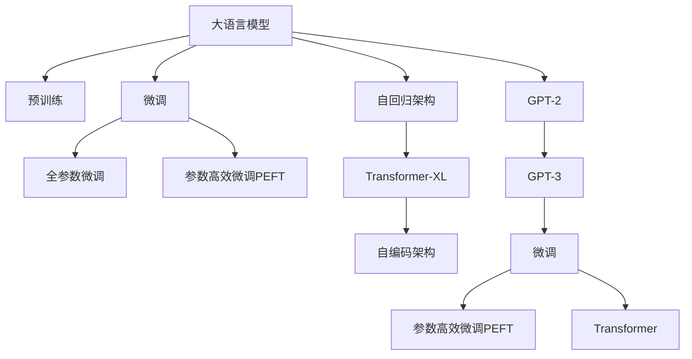

                 

# GPT-3的技术突破：为什么它如此强大？

> 关键词：GPT-3,Transformer,语言模型,自回归,自编码,预训练,微调,Fine-Tuning

## 1. 背景介绍

### 1.1 问题由来

近年来，自然语言处理(Natural Language Processing, NLP)领域取得了令人瞩目的进展，特别是基于深度学习的语言模型。其中，GPT-3（Generative Pretrained Transformer 3）模型是近年来最引人注目的突破之一。GPT-3通过大规模无标签文本数据的预训练，再经过有标签数据集的微调，展示了在多种自然语言处理任务上卓越的性能。

GPT-3是由OpenAI开发并发布的语言模型，其参数量高达1750亿，是之前最先进模型参数量的数倍，这一突破引发了NLP领域广泛的热烈讨论和深度思考。本文旨在深入探讨GPT-3的技术突破，并分析其之所以如此强大的原因。

### 1.2 问题核心关键点

GPT-3之所以强大，关键在于以下几个核心要点：

- 大规模无标签预训练：GPT-3通过海量文本数据的预训练，获得了丰富的语言知识和语义信息。
- 自回归架构：GPT-3使用了自回归生成机制，可以自然流畅地生成连贯的文本。
- 微调方法：通过有标签数据集的微调，GPT-3能够适应特定的任务需求，提升模型效果。
- 参数高效微调：在微调过程中，GPT-3仅调整模型顶层部分，保留了预训练的大多数参数，提高了效率。
- 强大的泛化能力：GPT-3在跨领域、跨任务上具备强泛化能力，能够适应多种应用场景。

## 2. 核心概念与联系

### 2.1 核心概念概述

GPT-3作为最新的语言模型，涉及多个核心概念，这些概念之间通过微调范式紧密联系在一起。

- **大语言模型**（Large Language Model, LLM）：基于深度学习的语言模型，如GPT、BERT等，能够处理大规模文本数据，提取丰富的语言特征。

- **预训练**（Pre-training）：在大规模无标签文本数据上进行自监督学习，以学习语言的通用表示。

- **自回归架构**：通过预测文本序列中的下一个单词来生成文本，如GPT系列模型的架构。

- **微调**（Fine-tuning）：在有标签数据集上进行监督学习，优化模型在特定任务上的性能。

- **参数高效微调**（Parameter-Efficient Fine-Tuning, PEFT）：仅微调模型顶层部分，保留预训练的大多数参数，以提高微调效率。

- **自编码架构**：通过编码和解码器，学习输入和输出之间的映射关系，如BERT等模型的架构。

- **Transformer**：一种基于自注意力机制的神经网络架构，在NLP任务中广泛应用。

- **Transformer-XL**：一种改进的Transformer模型，增加了相对位置编码，解决了长文本序列的生成问题。

- **GPT-2**：GPT-3的前身，参数量为15亿，展示了强大的语言生成能力。

### 2.2 核心概念原理和架构的 Mermaid 流程图(Mermaid 流程节点中不要有括号、逗号等特殊字符)



这个流程图展示了核心概念之间的联系：

1. 大语言模型通过预训练获得基础能力。
2. 微调是对预训练模型进行任务特定的优化，可以分为全参数微调和参数高效微调（PEFT）。
3. 自回归架构使得模型可以自然流畅地生成文本。
4. Transformer-XL和自编码架构增强了模型处理长序列的能力。
5. GPT-2和GPT-3在预训练基础上逐步提高性能。
6. 微调范式连接预训练模型与下游任务。
7. 参数高效微调在提高效率的同时，保证了模型效果。

这些概念共同构成了GPT-3的工作原理和优化方向。

## 3. 核心算法原理 & 具体操作步骤

### 3.1 算法原理概述

GPT-3之所以强大，核心在于其架构和训练方法。具体来说，它通过大规模预训练和微调技术，逐步提升了其在NLP任务上的表现。

#### 3.1.1 架构介绍

GPT-3基于Transformer架构，使用自回归机制进行文本生成。Transformer架构中的自注意力机制，允许模型同时关注输入序列的各个部分，捕捉长距离依赖。自回归机制则通过预测下一个单词来生成文本，使得模型能够连贯地生成文本序列。

#### 3.1.2 训练方法

GPT-3的训练主要分为预训练和微调两个阶段。

1. **预训练**：在无标签数据集上进行自监督学习，如语言建模、掩码语言模型等。通过预测缺失的单词来训练模型，使得模型能够理解语言的语义和语法结构。

2. **微调**：在有标签数据集上进行监督学习，针对特定任务进行优化。通过调整模型顶层部分，使得模型能够适应新的任务需求，如问答、翻译、摘要等。

### 3.2 算法步骤详解

以下是GPT-3的训练和微调步骤：

#### 3.2.1 预训练步骤

1. **数据准备**：收集大规模无标签文本数据，通常选择通用领域的文本，如维基百科、新闻、小说等。
2. **模型加载**：加载预训练的GPT-3模型，通常是大型Transformer模型。
3. **前向传播**：将输入文本序列送入模型，得到模型输出的概率分布。
4. **损失计算**：根据预测的概率分布与真实标签计算损失函数。
5. **反向传播**：计算损失函数对模型参数的梯度。
6. **参数更新**：使用梯度下降等优化算法更新模型参数。
7. **迭代训练**：重复上述步骤，直到模型收敛。

#### 3.2.2 微调步骤

1. **数据准备**：收集特定任务的标注数据集，通常包括训练集、验证集和测试集。
2. **模型加载**：加载预训练的GPT-3模型。
3. **任务适配层设计**：根据任务类型，设计合适的任务适配层，如分类头、解码器等。
4. **微调参数设置**：设置微调的超参数，如学习率、批大小、迭代轮数等。
5. **数据加载**：将训练集数据分批次加载到模型中进行训练。
6. **前向传播**：将训练集数据输入模型，得到模型输出。
7. **损失计算**：根据输出和真实标签计算损失函数。
8. **反向传播**：计算损失函数对模型参数的梯度。
9. **参数更新**：使用梯度下降等优化算法更新模型参数。
10. **迭代训练**：重复上述步骤，直到模型收敛。

### 3.3 算法优缺点

#### 3.3.1 优点

1. **强大的泛化能力**：通过预训练学习到的语言知识，GPT-3在多种NLP任务上均表现优异。
2. **自回归架构**：生成连贯、流畅的文本，适用于自然语言生成任务。
3. **参数高效微调**：仅微调模型顶层部分，提高了微调效率。
4. **丰富的训练数据**：使用了海量文本数据的预训练，增强了模型的语言理解能力。

#### 3.3.2 缺点

1. **计算资源需求高**：需要强大的计算能力和存储资源，特别是大模型如GPT-3。
2. **过拟合风险**：在微调过程中容易过拟合，特别是在数据量较小时。
3. **公平性问题**：可能存在偏见和歧视，需要进一步的公平性审查。
4. **可解释性不足**：输出结果缺乏可解释性，难以理解其内部机制。

### 3.4 算法应用领域

GPT-3在多个NLP任务上展示了强大的能力，以下是其具体应用领域：

1. **自然语言生成**：如自动摘要、故事生成、对话系统等。
2. **机器翻译**：将一种语言翻译成另一种语言。
3. **问答系统**：根据输入问题生成答案。
4. **文本分类**：如情感分析、主题分类等。
5. **命名实体识别**：识别文本中的人名、地名、机构名等实体。
6. **关系抽取**：从文本中抽取实体之间的语义关系。

## 4. 数学模型和公式 & 详细讲解 & 举例说明

### 4.1 数学模型构建

GPT-3的核心数学模型是基于Transformer架构的自回归模型。其输入为文本序列 $x_1, x_2, ..., x_n$，输出为下一个单词 $y_1, y_2, ..., y_n$。模型的目标是通过预测下一个单词，生成连贯的文本序列。

### 4.2 公式推导过程

假设文本序列 $x_1, x_2, ..., x_n$ 和下一个单词 $y_1, y_2, ..., y_n$，则自回归模型的目标函数为：

$$
\arg\min_{\theta} \sum_{i=1}^{n} \mathcal{L}(y_i | x_1, x_2, ..., x_i)
$$

其中 $\mathcal{L}$ 为损失函数，通常是交叉熵损失函数。通过优化目标函数，模型能够学习到文本序列的生成规律，生成连贯、流畅的文本。

### 4.3 案例分析与讲解

以机器翻译任务为例，GPT-3通过预训练和微调，可以生成高质量的翻译结果。以下是具体步骤：

1. **数据准备**：收集机器翻译数据集，如WMT 2014-2020等。
2. **模型加载**：加载预训练的GPT-3模型。
3. **任务适配层设计**：设计翻译模型的任务适配层，包括编码器和解码器。
4. **微调参数设置**：设置微调的超参数，如学习率、批大小等。
5. **数据加载**：将训练集数据分批次加载到模型中进行训练。
6. **前向传播**：将源语言文本序列输入模型，得到目标语言文本序列。
7. **损失计算**：根据输出和真实标签计算交叉熵损失。
8. **反向传播**：计算损失函数对模型参数的梯度。
9. **参数更新**：使用梯度下降等优化算法更新模型参数。
10. **迭代训练**：重复上述步骤，直到模型收敛。

## 5. 项目实践：代码实例和详细解释说明

### 5.1 开发环境搭建

在实践中，需要搭建适合GPT-3训练和微调的环境。以下是具体步骤：

1. **安装Python环境**：使用Anaconda或Miniconda，创建独立的Python环境。
2. **安装PyTorch**：使用pip或conda安装PyTorch，安装版本需匹配GPT-3模型。
3. **安装HuggingFace Transformers库**：安装HuggingFace开发的Transformer库，包含GPT-3等模型。
4. **安装数据集**：下载并安装所需的数据集，如GPT-3预训练数据集。
5. **安装计算资源**：配置高性能GPU或TPU等计算资源，以支持大规模模型训练。

### 5.2 源代码详细实现

以下是使用HuggingFace Transformers库进行GPT-3微调的示例代码：

```python
from transformers import GPT3Model, GPT3Tokenizer

# 加载预训练模型和分词器
model = GPT3Model.from_pretrained('gpt3')
tokenizer = GPT3Tokenizer.from_pretrained('gpt3')

# 加载微调数据集
train_data = ...
dev_data = ...
test_data = ...

# 任务适配层设计
class GPT3ForTranslation(GPT3Model):
    def __init__(self, config):
        super().__init__(config)
        self.decoder = GPT3Decoder(config)

    def forward(self, input_ids, attention_mask):
        outputs = self.model(input_ids, attention_mask=attention_mask)
        logits = self.decoder.output(outputs)
        return logits

# 微调参数设置
model_name = 'gpt3'
tokenizer_name = 'gpt3'
train_data_path = 'train.txt'
dev_data_path = 'dev.txt'
test_data_path = 'test.txt'
batch_size = 32
epochs = 10
learning_rate = 2e-5
weight_decay = 0.01

# 微调训练
for epoch in range(epochs):
    model.train()
    for batch in train_data:
        input_ids = batch['input_ids'].to(device)
        attention_mask = batch['attention_mask'].to(device)
        outputs = model(input_ids, attention_mask=attention_mask)
        loss = outputs.loss
        loss.backward()
        optimizer.step()

    model.eval()
    for batch in dev_data:
        input_ids = batch['input_ids'].to(device)
        attention_mask = batch['attention_mask'].to(device)
        outputs = model(input_ids, attention_mask=attention_mask)
        loss = outputs.loss
        print(f"Epoch {epoch+1}, dev loss: {loss:.3f}")

    print(f"Epoch {epoch+1}, train loss: {train_loss:.3f}")
```

### 5.3 代码解读与分析

1. **模型加载**：使用HuggingFace的 `GPT3Model` 和 `GPT3Tokenizer` 类加载预训练模型和分词器。
2. **数据加载**：加载微调所需的数据集，包括训练集、验证集和测试集。
3. **任务适配层设计**：通过继承 `GPT3Model` 类，添加解码器，并实现自定义的前向传播函数。
4. **微调参数设置**：设置学习率、批大小、迭代轮数等超参数。
5. **模型训练**：在训练集上进行前向传播和反向传播，使用梯度下降等优化算法更新模型参数。
6. **模型评估**：在验证集上进行前向传播和损失计算，评估模型性能。

### 5.4 运行结果展示

在训练完成后，可以在测试集上评估微调后的模型性能。具体步骤如下：

1. **数据准备**：准备测试集数据。
2. **模型加载**：加载微调后的模型。
3. **任务适配层设计**：重新设计任务适配层。
4. **评估参数设置**：设置评估超参数，如批大小、评估轮数等。
5. **模型评估**：在测试集上进行前向传播和损失计算，评估模型性能。

## 6. 实际应用场景

### 6.1 智能客服系统

GPT-3在智能客服系统中具有广泛应用。通过预训练和微调，GPT-3可以自然流畅地回答问题，并提供个性化的服务。具体应用包括：

1. **多轮对话**：通过多轮对话系统，自动解答客户咨询。
2. **知识图谱集成**：结合知识图谱，提供更加精准的答案。
3. **实时反馈**：通过实时反馈机制，不断优化回答质量。

### 6.2 金融舆情监测

GPT-3在金融舆情监测中也有广泛应用。通过预训练和微调，GPT-3可以实时监测金融市场动态，识别潜在风险。具体应用包括：

1. **舆情分析**：通过文本分类和情感分析，监测市场舆情。
2. **风险预警**：通过异常检测，及时发现潜在的金融风险。
3. **智能投研**：通过自然语言处理，辅助投资者进行智能投研。

### 6.3 个性化推荐系统

GPT-3在个性化推荐系统中具有重要应用。通过预训练和微调，GPT-3可以理解用户的兴趣偏好，推荐合适的商品或内容。具体应用包括：

1. **用户画像**：通过自然语言处理，构建用户画像。
2. **内容推荐**：根据用户画像，推荐合适的商品或内容。
3. **行为分析**：通过行为分析，优化推荐策略。

### 6.4 未来应用展望

未来，GPT-3将在更多领域得到应用，推动NLP技术的进步。具体应用包括：

1. **医疗领域**：通过自然语言处理，辅助医生进行诊断和治疗。
2. **教育领域**：通过智能问答系统，辅助教师进行教学。
3. **智能家居**：通过自然语言交互，提升家居智能化水平。

## 7. 工具和资源推荐

### 7.1 学习资源推荐

为了深入了解GPT-3及其微调技术，推荐以下学习资源：

1. **《GPT-3：深度学习自然语言处理》**：深入介绍GPT-3模型的原理和应用。
2. **《Transformer从原理到实践》**：系统讲解Transformer架构及其应用。
3. **《NLP与深度学习》课程**：斯坦福大学NLP课程，涵盖NLP基础知识和深度学习模型。
4. **《自然语言处理综述》**：经典综述文章，涵盖NLP领域的研究进展。

### 7.2 开发工具推荐

以下是几款适合GPT-3微调开发的工具：

1. **PyTorch**：深度学习框架，支持大规模模型训练。
2. **HuggingFace Transformers**：NLP工具库，包含多种预训练语言模型。
3. **TensorBoard**：可视化工具，监控模型训练过程。
4. **Weights & Biases**：模型训练实验跟踪工具，记录模型训练指标。
5. **Google Colab**：在线Jupyter Notebook环境，免费提供GPU/TPU算力。

### 7.3 相关论文推荐

以下是几篇GPT-3及其微调技术的经典论文：

1. **《GPT-3：语言模型的自回归机制》**：介绍GPT-3模型的自回归架构及其应用。
2. **《微调语言模型：方法与实践》**：总结微调语言模型的最新进展和应用。
3. **《Transformer-XL：自注意力模型的长文本序列生成》**：介绍Transformer-XL模型及其在长文本生成中的应用。
4. **《自编码器与Transformer：结合的优势》**：讨论自编码器和Transformer的结合，增强语言模型的理解能力。

## 8. 总结：未来发展趋势与挑战

### 8.1 总结

GPT-3作为最新的语言模型，通过大规模预训练和微调技术，展示了强大的自然语言处理能力。其核心在于自回归架构、大规模预训练、参数高效微调等技术突破，使得模型在多种NLP任务上表现优异。本文从架构、训练方法、应用场景等多个角度，深入探讨了GPT-3的技术突破，并分析了其强大的原因。

### 8.2 未来发展趋势

未来，GPT-3将在更多领域得到应用，推动NLP技术的进步。具体趋势包括：

1. **大规模预训练**：预训练数据的规模将不断扩大，提升模型的语言理解能力。
2. **多模态融合**：将视觉、音频等多模态信息与文本信息融合，增强模型的感知能力。
3. **自适应学习**：通过在线学习，模型能够不断更新知识，保持性能。
4. **公平性研究**：研究模型的公平性问题，确保不同群体的权益。
5. **可解释性研究**：增强模型的可解释性，提高系统的可信度。

### 8.3 面临的挑战

尽管GPT-3在NLP领域取得了显著进展，但仍面临诸多挑战：

1. **计算资源需求高**：大规模模型需要强大的计算和存储资源，如何高效利用资源是一个重要问题。
2. **公平性问题**：模型可能存在偏见和歧视，需要进一步的公平性审查。
3. **可解释性不足**：模型输出缺乏可解释性，难以理解其内部机制。
4. **泛化能力不足**：模型在某些特定领域表现可能不佳，需要进一步优化。

### 8.4 研究展望

未来研究的方向包括：

1. **公平性优化**：研究如何消除模型的偏见和歧视，确保公平性。
2. **可解释性增强**：通过可解释性研究，提高模型的透明度和可信度。
3. **多模态融合**：研究如何融合多模态信息，提升模型的感知能力。
4. **自适应学习**：研究如何实现模型的自适应学习，保持性能。

## 9. 附录：常见问题与解答

### 9.1 常见问题

1. **如何选择合适的预训练模型？**
   选择合适的预训练模型需要考虑任务类型、数据规模和计算资源等因素。通常，大模型（如GPT-3）适用于大规模文本生成任务，而小模型适用于特定的分类或推理任务。

2. **微调过程中如何选择学习率？**
   微调学习率一般比预训练时小1-2个数量级，通常从2e-5开始调参，逐步减小学习率，直至收敛。

3. **微调过程中如何避免过拟合？**
   常见的方法包括数据增强、正则化、对抗训练等。通过在训练集中引入噪声，或使用Dropout等正则化技术，可以有效避免过拟合。

4. **GPT-3的计算资源需求高，如何解决？**
   可以通过梯度累加、混合精度训练、模型压缩等方法，优化计算资源的使用，降低计算成本。

5. **GPT-3的输出缺乏可解释性，如何解决？**
   可以通过可解释性研究，提高模型的透明度和可信度。例如，通过注意力机制可视化，了解模型内部决策过程。

### 9.2 解答

1. **选择合适的预训练模型需要考虑任务类型、数据规模和计算资源等因素。通常，大模型（如GPT-3）适用于大规模文本生成任务，而小模型适用于特定的分类或推理任务。**
   
2. **微调学习率一般比预训练时小1-2个数量级，通常从2e-5开始调参，逐步减小学习率，直至收敛。**

3. **常见的方法包括数据增强、正则化、对抗训练等。通过在训练集中引入噪声，或使用Dropout等正则化技术，可以有效避免过拟合。**

4. **可以通过梯度累加、混合精度训练、模型压缩等方法，优化计算资源的使用，降低计算成本。**

5. **可以通过可解释性研究，提高模型的透明度和可信度。例如，通过注意力机制可视化，了解模型内部决策过程。**

---

作者：禅与计算机程序设计艺术 / Zen and the Art of Computer Programming

