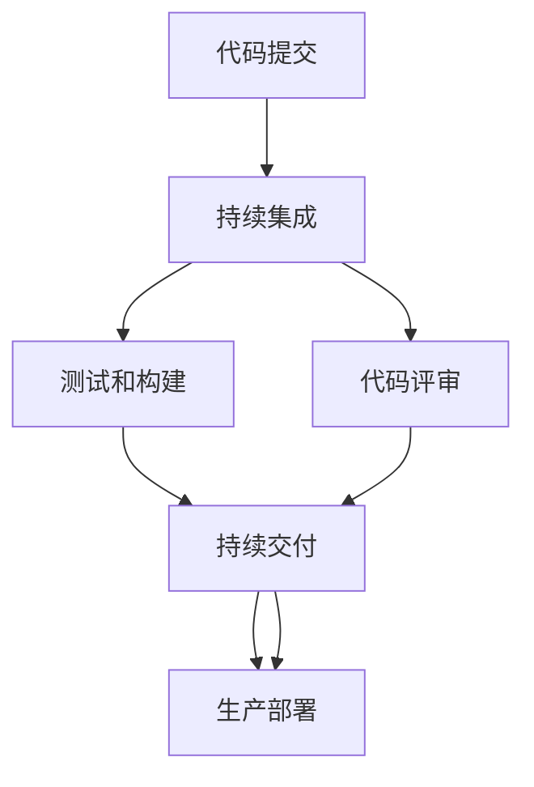

                 

# GitLab CI/CD流程配置

> 关键词：GitLab, CI/CD, 持续集成, 持续交付, 自动化部署, 管道流水线, 自动化测试, 版本控制

## 1. 背景介绍

### 1.1 问题由来
在现代软件开发过程中，构建、测试、部署等环节日益复杂，需要依赖于高度自动化和标准化的流程来确保代码的稳定性和可维护性。GitLab CI/CD作为一个集成化的解决方案，结合了GitLab版本控制系统的强大功能和CI/CD工具的灵活配置，能够高效地支持软件开发生命周期的自动化管理，提高团队的开发效率和交付质量。

### 1.2 问题核心关键点
本文将深入探讨GitLab CI/CD的原理、核心概念及其在实际项目中的应用，重点讲解其配置、使用以及优化技巧，帮助开发者全面掌握这一强大的工具，提升开发效率和产品质量。

## 2. 核心概念与联系

### 2.1 核心概念概述

GitLab CI/CD是GitLab内置的一项重要功能，基于成熟的GitLab平台和其强大的版本控制系统，提供了一整套自动化流水线解决方案，包括持续集成(CI)和持续交付(CD)两大模块。

- **持续集成**（Continuous Integration, CI）：指的是将代码提交到版本控制仓库时，自动触发一系列测试和构建过程，确保每次提交都是可用的。

- **持续交付**（Continuous Delivery, CD）：在CI的基础上，不仅进行测试，还能自动将通过测试的代码部署到生产环境或预览环境中，但需要人工干预。

- **持续部署**（Continuous Deployment, CD）：在CI和CD的基础上，完全自动化的部署过程，不需要人工干预。

以上三个环节构成了GitLab CI/CD的核心流程，通过自动化方式确保代码从提交到部署的全过程高效、稳定。

### 2.2 核心概念原理和架构的 Mermaid 流程图



这个流程图示意了GitLab CI/CD的基本架构：代码提交触发CI流程，包括测试和构建；代码通过评审后进入CD流程，将构建后的可执行文件部署到目标环境；最后进入CD流程，实现完全自动化的生产部署。

## 3. 核心算法原理 & 具体操作步骤

### 3.1 算法原理概述

GitLab CI/CD的工作原理是通过GitLab项目的`.gitlab-ci.yml`配置文件来定义和执行整个流水线流程。这个配置文件包含了所有需要自动化的步骤，从代码构建、测试到部署，每个步骤都清晰地定义在配置文件中，GitLab会自动执行这些步骤，确保代码质量。

### 3.2 算法步骤详解

一个典型的GitLab CI/CD配置文件`.gitlab-ci.yml`包含了以下几个关键部分：

1. **变量定义**：用于存储一些需要在多个阶段复用的配置信息，如项目名、测试服务器地址等。
2. **项目名称和默认分支**：指定了CI/CD流水线的名称和默认分支。
3. **环境配置**：定义了CI/CD流水线运行的各类环境，如测试环境、生产环境等。
4. **任务定义**：定义了具体的CI/CD任务，包括测试任务、构建任务、部署任务等。
5. **钩子(Hooks)**：定义了流水线执行前后需要触发的事件，如代码提交、合并请求通过等。

以下是一个示例`.gitlab-ci.yml`配置文件：

```yaml
# 定义变量
variables:
  MACHINE_NAME: "macOS"
  TEST_SERVER: "http://test.example.com"
  PRODUCTION_SERVER: "http://production.example.com"

# 项目名称和默认分支
project_name: "myapp"
default_branch: "main"

# 环境配置
stages:
  - test
  - build
  - deploy

# 任务定义
myapp:
  stage: build
  script:
    - echo "Running build"
    - make build

test:
  stage: test
  script:
    - echo "Running tests"
    - make test

deploy:
  stage: deploy
  script:
    - echo "Deploying to production"
    - make deploy

# 钩子
hooks:
  before_script:
    - echo "Starting build process"
  after_script:
    - echo "Build process complete"
```

### 3.3 算法优缺点

**优点**：

- **易于配置和管理**：使用`.gitlab-ci.yml`文件，一切配置都集中在一处，易于管理和维护。
- **高度自动化**：完全自动化地执行测试、构建和部署，提高了开发效率和代码质量。
- **灵活性**：支持多种构建工具、测试框架和部署方式，适用于各种不同的项目需求。
- **集成性**：与GitLab的其他功能无缝集成，如代码评审、管道历史记录、持续交付仪表板等。

**缺点**：

- **学习曲线**：初次配置CI/CD流水线需要一定的学习和适应过程。
- **复杂性**：对于大型项目或复杂流程，配置文件可能会变得非常复杂。
- **依赖GitLab**：完全依赖于GitLab平台，迁移至其他平台时可能存在障碍。

### 3.4 算法应用领域

GitLab CI/CD广泛应用在软件开发、DevOps、自动化测试、持续集成和持续交付等领域。

- **软件开发**：用于自动化构建、测试和部署，提高开发效率和代码质量。
- **DevOps**：结合CI/CD和CI/CD的集成和协作工具，支持DevOps的最佳实践。
- **自动化测试**：自动执行测试用例，快速发现和修复代码缺陷。
- **持续集成**：自动构建和测试新的代码提交，确保每次提交都是可用的。
- **持续交付**：自动将通过测试的代码部署到生产环境或预览环境中，减少人为错误。

## 4. 数学模型和公式 & 详细讲解 & 举例说明

### 4.1 数学模型构建

GitLab CI/CD的配置文件`.gitlab-ci.yml`本质上是一个YAML文件，用于描述和控制整个CI/CD流程。其基本语法结构和变量使用与YAML标准一致，用于存储和传递配置信息。

### 4.2 公式推导过程

由于GitLab CI/CD的配置文件基于YAML文件，其配置项的定义和组合方式遵循YAML的规则。以下是一个简单的例子：

```yaml
build:
  script:
    - echo "Running build"
    - make build
```

这个配置项定义了一个名为`build`的任务，其中`script`字段指定了要执行的命令。这个配置项会被执行在CI/CD流水线的`build`阶段。

### 4.3 案例分析与讲解

假设有一个简单的Web应用项目，使用Node.js和Express框架。以下是一个`.gitlab-ci.yml`配置文件的示例，包含持续集成和持续交付流程：

```yaml
# 定义变量
variables:
  NODE_ENV: "production"
  MACHINE_NAME: "macOS"
  TEST_SERVER: "http://test.example.com"
  PRODUCTION_SERVER: "http://production.example.com"

# 项目名称和默认分支
project_name: "myapp"
default_branch: "main"

# 环境配置
stages:
  - test
  - build
  - deploy

# 任务定义
test:
  stage: test
  script:
    - echo "Running tests"
    - npm test

build:
  stage: build
  script:
    - echo "Running build"
    - npm run build

deploy:
  stage: deploy
  script:
    - echo "Deploying to production"
    - npm run deploy

# 钩子
hooks:
  before_script:
    - echo "Starting build process"
  after_script:
    - echo "Build process complete"
```

这个配置文件定义了三个主要任务：

- `test`任务在`test`阶段执行，用于运行测试用例。
- `build`任务在`build`阶段执行，用于构建应用程序。
- `deploy`任务在`deploy`阶段执行，用于将构建后的应用程序部署到生产环境中。

每个任务都包含一个`script`字段，指定了要执行的命令。

## 5. 项目实践：代码实例和详细解释说明

### 5.1 开发环境搭建

为了使用GitLab CI/CD，首先需要搭建好GitLab环境和项目仓库。具体步骤如下：

1. **安装GitLab**：下载并安装GitLab社区版或付费版的安装程序，或通过Docker容器方式运行GitLab。
2. **配置GitLab**：设置数据库、Git服务、邮件服务等GitLab的核心组件。
3. **创建项目仓库**：在GitLab上创建一个新的项目仓库，确保`.gitlab-ci.yml`文件已存在并包含基本的配置。

### 5.2 源代码详细实现

以下是一个简单的GitLab CI/CD配置文件示例，用于测试一个使用Node.js的Web应用：

```yaml
# 定义变量
variables:
  NODE_ENV: "production"
  MACHINE_NAME: "macOS"
  TEST_SERVER: "http://test.example.com"
  PRODUCTION_SERVER: "http://production.example.com"

# 项目名称和默认分支
project_name: "myapp"
default_branch: "main"

# 环境配置
stages:
  - test
  - build
  - deploy

# 任务定义
test:
  stage: test
  script:
    - echo "Running tests"
    - npm test

build:
  stage: build
  script:
    - echo "Running build"
    - npm run build

deploy:
  stage: deploy
  script:
    - echo "Deploying to production"
    - npm run deploy

# 钩子
hooks:
  before_script:
    - echo "Starting build process"
  after_script:
    - echo "Build process complete"
```

### 5.3 代码解读与分析

配置文件中，`variables`部分定义了一些全局变量，用于存储项目相关的配置信息，如环境变量、服务器地址等。

`stages`部分定义了CI/CD流水线的阶段，按照`test`、`build`、`deploy`的顺序依次执行各个任务。

每个任务都包含一个`script`字段，指定了具体的命令或脚本。这些命令会在相应的阶段执行。

`hooks`部分定义了流水线执行前后的钩子函数，用于触发特定的操作或提示。

### 5.4 运行结果展示

在配置文件生效后，通过在GitLab项目上提交代码，会自动触发CI/CD流水线，执行测试、构建和部署任务。运行结果会在GitLab的CI/CD仪表板上显示，包括各个任务的执行状态、日志信息等。

## 6. 实际应用场景

### 6.1 软件项目管理

在软件开发过程中，通过GitLab CI/CD，团队可以高效地管理代码的构建、测试和部署，确保每次提交都是可用的，从而提升代码质量和开发效率。

### 6.2 持续集成与持续交付

GitLab CI/CD可以帮助团队实现持续集成和持续交付，确保代码能够快速、稳定地部署到生产环境，减少人为错误，提升交付速度和质量。

### 6.3 DevOps自动化

结合GitLab CI/CD和其强大的DevOps工具集，团队可以实现自动化的任务自动化、代码评审、自动化测试、安全扫描等，提升DevOps实践的效果。

### 6.4 云平台集成

GitLab CI/CD可以与各种云平台无缝集成，支持自动化地在云上部署应用程序，提高云资源的利用效率，降低部署成本。

## 7. 工具和资源推荐

### 7.1 学习资源推荐

为了帮助开发者更好地掌握GitLab CI/CD，以下是一些优质的学习资源：

1. **GitLab官方文档**：GitLab官方提供了详细的CI/CD文档，涵盖从基础配置到高级功能的全面介绍。
2. **GitLab社区博客**：GitLab社区的博客上有很多实战案例和最佳实践，值得深入阅读。
3. **《持续交付：软件开发生命周期自动化实践》**：一本全面介绍CI/CD实践的书籍，帮助开发者理解和应用CI/CD的最佳实践。
4. **《GitLab DevOps实践指南》**：一本关于GitLab DevOps实践的书籍，详细介绍如何在GitLab上实现自动化持续集成和持续交付。
5. **《CI/CD：持续集成和持续交付实战》**：一本实战导向的书籍，通过实例讲解如何使用CI/CD工具实现自动化流程。

### 7.2 开发工具推荐

GitLab CI/CD的配置和执行依赖于GitLab平台，以下是一些常用的开发工具：

1. **Docker**：用于构建和运行应用程序的容器化环境。
2. **Jenkins**：一个广泛使用的CI/CD工具，支持与GitLab的集成。
3. **Jenkins Pipeline**：基于Jenkins的流水线配置语言，支持复杂的自动化流程。
4. **Ansible**：用于自动化部署和管理云基础设施。
5. **Kubernetes**：用于自动化部署和管理容器化应用程序的编排工具。

### 7.3 相关论文推荐

GitLab CI/CD作为DevOps领域的实践工具，其原理和应用受到众多研究者的关注。以下是一些相关论文推荐：

1. **《CI/CD 实践中的自动化测试策略研究》**：探讨了自动化测试在CI/CD流程中的重要性，以及如何提高自动化测试的覆盖率。
2. **《基于GitLab的持续集成与持续交付实践》**：详细介绍了如何在GitLab上实现持续集成和持续交付。
3. **《云平台上的持续交付实践》**：介绍了在云平台上实现持续交付的最佳实践。

## 8. 总结：未来发展趋势与挑战

### 8.1 总结

本文系统介绍了GitLab CI/CD的基本原理、核心概念和配置方法，通过详细的实例演示，帮助开发者深入理解并应用这一强大的工具。GitLab CI/CD不仅能够提高软件开发和部署的效率和质量，还支持DevOps的最佳实践，提升团队的开发能力和交付水平。

### 8.2 未来发展趋势

未来，GitLab CI/CD将继续在DevOps实践中发挥重要作用，其发展趋势包括：

- **更加灵活的配置**：随着CI/CD需求的增加，GitLab将不断扩展配置项和插件，提供更加灵活和可扩展的配置选项。
- **与更多工具集成**：GitLab CI/CD将进一步集成更多的开发工具和云平台，提升开发效率和资源利用率。
- **智能化和自动化**：引入更多的AI和ML技术，实现更智能化的代码分析、故障预测和安全检测。
- **DevSecOps融合**：结合DevOps和Security，提升软件开发的安全性和合规性。

### 8.3 面临的挑战

尽管GitLab CI/CD在DevOps实践中表现优异，但仍面临一些挑战：

- **复杂性**：对于大型项目和复杂流程，配置文件可能变得非常复杂，需要更多的配置和管理。
- **性能瓶颈**：在处理大规模项目和海量数据时，可能出现性能瓶颈，需要优化和改进。
- **兼容性**：与其他工具和平台的兼容性问题，可能限制其应用范围。

### 8.4 研究展望

未来的研究方向包括：

- **配置自动化**：开发配置自动化工具，减少手动配置的复杂性和出错率。
- **性能优化**：提升GitLab CI/CD的处理能力和资源利用率，减少执行时间和成本。
- **跨平台支持**：进一步提升与其他工具和平台的兼容性，支持更多的开发环境。
- **社区扩展**：鼓励社区参与，拓展GitLab CI/CD的应用场景和功能。

## 9. 附录：常见问题与解答

**Q1：如何配置GitLab CI/CD流水线？**

A: 配置GitLab CI/CD流水线的步骤如下：
1. 在GitLab项目仓库中创建`.gitlab-ci.yml`文件。
2. 定义需要自动化的任务，包括测试、构建和部署等。
3. 配置变量、环境、钩子等关键参数。
4. 提交代码，GitLab会自动触发CI/CD流水线执行。

**Q2：如何设置并行任务？**

A: 可以使用`rules`字段和`parallel`参数来设置并行任务。例如：

```yaml
# 定义变量
variables:
  NODE_ENV: "production"

# 项目名称和默认分支
project_name: "myapp"
default_branch: "main"

# 环境配置
stages:
  - build
  - deploy

# 任务定义
build:
  stage: build
  script:
    - echo "Running build"
    - npm run build
  rules:
    - if: '$CI_COMMIT_BRANCH == "main"'
    - when: on_push
  parallel: true

deploy:
  stage: deploy
  script:
    - echo "Deploying to production"
    - npm run deploy
  rules:
    - if: '$CI_COMMIT_BRANCH == "main"'
    - when: on_push
  parallel: true
```

这个配置文件中的`build`和`deploy`任务都被设置为并行执行。

**Q3：如何设置依赖关系？**

A: 可以使用`needs`字段来设置任务的依赖关系。例如：

```yaml
# 定义变量
variables:
  NODE_ENV: "production"

# 项目名称和默认分支
project_name: "myapp"
default_branch: "main"

# 环境配置
stages:
  - test
  - build
  - deploy

# 任务定义
test:
  stage: test
  script:
    - echo "Running tests"
    - npm test
  needs:
    - build

build:
  stage: build
  script:
    - echo "Running build"
    - npm run build

deploy:
  stage: deploy
  script:
    - echo "Deploying to production"
    - npm run deploy
  needs:
    - build
  rules:
    - if: '$CI_COMMIT_BRANCH == "main"'
    - when: on_push
```

这个配置文件中的`test`任务依赖于`build`任务，必须在`build`任务完成后才能执行。

**Q4：如何监控CI/CD流水线的执行情况？**

A: 可以使用GitLab的CI/CD仪表板来监控流水线的执行情况。在GitLab项目中，进入CI/CD仪表板，可以看到每个任务的执行状态、时间、日志等信息。

```bash
# 定义变量
variables:
  NODE_ENV: "production"
  MACHINE_NAME: "macOS"
  TEST_SERVER: "http://test.example.com"
  PRODUCTION_SERVER: "http://production.example.com"

# 项目名称和默认分支
project_name: "myapp"
default_branch: "main"

# 环境配置
stages:
  - test
  - build
  - deploy

# 任务定义
test:
  stage: test
  script:
    - echo "Running tests"
    - npm test

build:
  stage: build
  script:
    - echo "Running build"
    - npm run build

deploy:
  stage: deploy
  script:
    - echo "Deploying to production"
    - npm run deploy

# 钩子
hooks:
  before_script:
    - echo "Starting build process"
  after_script:
    - echo "Build process complete"
```

## 9. 附录：常见问题与解答

**Q1：如何配置GitLab CI/CD流水线？**

A: 配置GitLab CI/CD流水线的步骤如下：
1. 在GitLab项目仓库中创建`.gitlab-ci.yml`文件。
2. 定义需要自动化的任务，包括测试、构建和部署等。
3. 配置变量、环境、钩子等关键参数。
4. 提交代码，GitLab会自动触发CI/CD流水线执行。

**Q2：如何设置并行任务？**

A: 可以使用`rules`字段和`parallel`参数来设置并行任务。例如：

```yaml
# 定义变量
variables:
  NODE_ENV: "production"

# 项目名称和默认分支
project_name: "myapp"
default_branch: "main"

# 环境配置
stages:
  - build
  - deploy

# 任务定义
build:
  stage: build
  script:
    - echo "Running build"
    - npm run build
  rules:
    - if: '$CI_COMMIT_BRANCH == "main"'
    - when: on_push
  parallel: true

deploy:
  stage: deploy
  script:
    - echo "Deploying to production"
    - npm run deploy
  rules:
    - if: '$CI_COMMIT_BRANCH == "main"'
    - when: on_push
  parallel: true
```

这个配置文件中的`build`和`deploy`任务都被设置为并行执行。

**Q3：如何设置依赖关系？**

A: 可以使用`needs`字段来设置任务的依赖关系。例如：

```yaml
# 定义变量
variables:
  NODE_ENV: "production"

# 项目名称和默认分支
project_name: "myapp"
default_branch: "main"

# 环境配置
stages:
  - test
  - build
  - deploy

# 任务定义
test:
  stage: test
  script:
    - echo "Running tests"
    - npm test
  needs:
    - build

build:
  stage: build
  script:
    - echo "Running build"
    - npm run build

deploy:
  stage: deploy
  script:
    - echo "Deploying to production"
    - npm run deploy
  needs:
    - build
  rules:
    - if: '$CI_COMMIT_BRANCH == "main"'
    - when: on_push
```

这个配置文件中的`test`任务依赖于`build`任务，必须在`build`任务完成后才能执行。

**Q4：如何监控CI/CD流水线的执行情况？**

A: 可以使用GitLab的CI/CD仪表板来监控流水线的执行情况。在GitLab项目中，进入CI/CD仪表板，可以看到每个任务的执行状态、时间、日志等信息。

---

作者：禅与计算机程序设计艺术 / Zen and the Art of Computer Programming

