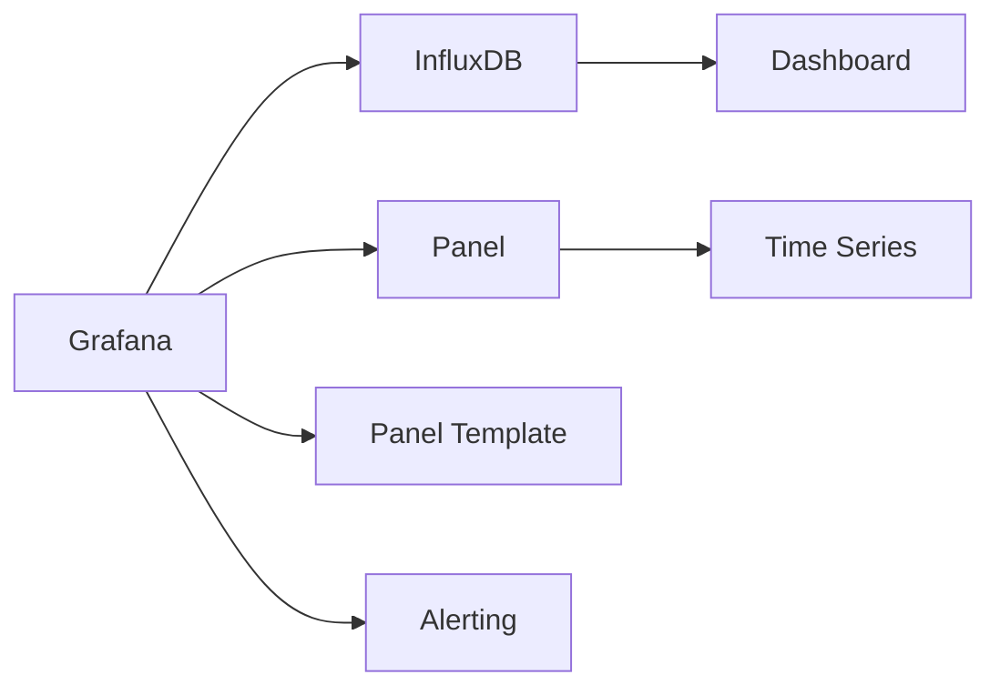

                 

# Grafana可视化监控面板设计

## 1. 背景介绍

在现代信息技术快速发展的今天，企业的IT环境变得越来越复杂，面临着大量的基础设施资源管理、应用性能监控、安全威胁防护等问题。为此，企业需要一套强大的、直观的、多维度数据可视化系统，以便实时监控IT基础设施和应用服务的运行状况，快速定位问题并及时解决，确保业务稳定运行。在这样的需求下，Grafana这一开源的、开源的可视化工具应运而生。

Grafana是一款强大的开源数据可视化平台，支持与多种主流数据库对接，如InfluxDB、MySQL、Elasticsearch等，并通过丰富的图表、仪表盘、告警等方式，将复杂的海量数据以直观的方式呈现出来，帮助IT运维人员快速把握整体运行状况，精准定位问题，提升IT运维效率。Grafana的核心优势在于其高度的可定制性和灵活性，能够根据不同企业的实际需求，灵活设计监控面板，提供符合企业需求的监控解决方案。

## 2. 核心概念与联系

Grafana的可视化监控面板设计涉及多个核心概念，这些概念之间存在着紧密的联系，共同构成了其强大的功能体系。

### 2.1 核心概念概述

- **Grafana**：一个开源的数据可视化平台，支持与多种数据库对接，能够通过丰富的图表和仪表盘展示数据。
- **InfluxDB**：一个开源的时间序列数据库，能够高效存储和查询时间序列数据，是Grafana的主要数据源之一。
- **Dashboard**：即监控面板，是Grafana的核心概念，通过一系列可视化组件构成，用于展示和分析数据。
- **Panel**：监控面板上的图表或图表集合，是数据可视化的基本单位。
- **Time Series**：时间序列数据，即在时间轴上连续记录的数据点，常用于表示系统的运行指标、日志信息等。
- **Alerting**：告警机制，用于在特定条件满足时触发告警，如指标超出预设阈值等。
- **Panel Template**：面板模板，是一组预设的图表和配置，方便快速创建监控面板。

这些核心概念通过不同的组件和配置，相互关联，形成了Grafana强大的监控功能体系。

### 2.2 核心概念原理和架构的 Mermaid 流程图



以上图展示了Grafana的核心组件和工作流程：

1. Grafana从InfluxDB等数据源获取时间序列数据。
2. 数据通过面板（Panel）组件进行展示，面板由图表或图表集合构成。
3. 面板根据面板模板（Panel Template）进行创建和配置。
4. 告警机制（Alerting）根据面板设定的阈值触发告警，及时通知运维人员。
5. 整个监控面板作为Dashboard呈现给运维人员，供其监控和分析数据。

## 3. 核心算法原理 & 具体操作步骤

### 3.1 算法原理概述

Grafana的可视化监控面板设计算法原理主要围绕时间序列数据处理和图表展示两个方面展开。时间序列数据处理涉及数据的收集、存储、查询、聚合等步骤，而图表展示则涉及如何选择图表类型、设置显示范围、配置数据来源等。

1. **数据收集与存储**：InfluxDB等时间序列数据库能够高效地存储和管理时间序列数据，支持高吞吐量的数据写入和查询。
2. **数据查询与聚合**：通过SQL或查询语言（如InfluxQL）进行数据查询和聚合，计算平均值、最大值、最小值等统计量。
3. **图表展示**：Grafana支持多种图表类型，如折线图、柱状图、饼图等，根据数据特点选择合适的图表进行展示。
4. **告警设置**：设置告警规则，定义告警触发条件，如指标超过预设阈值、数据异常波动等。

### 3.2 算法步骤详解

Grafana的可视化监控面板设计主要分为以下几个步骤：

1. **数据准备**：
    - 收集并存储时间序列数据到InfluxDB等数据源。
    - 使用查询语言进行数据聚合和计算。

2. **面板创建**：
    - 选择适合的图表类型。
    - 设置图表标题、显示范围、数据来源等。
    - 选择时间范围、时间间隔等。

3. **面板配置**：
    - 添加多个面板，组成一个完整的监控面板。
    - 使用面板模板进行快速配置。

4. **告警设置**：
    - 定义告警规则。
    - 配置告警通知方式，如邮件、短信等。

5. **面板展示**：
    - 将监控面板展示给运维人员。
    - 实时监控数据变化，及时发现和解决问题。

### 3.3 算法优缺点

Grafana可视化监控面板设计具有以下优点：

- **高度可定制化**：根据企业的实际需求，灵活配置监控面板，支持多种数据源和时间序列数据展示方式。
- **直观易用**：丰富的图表和仪表盘，将复杂的数据以直观的方式展示出来，方便运维人员快速理解。
- **灵活扩展**：支持插件扩展，增加新的数据源和可视化方式。
- **易于集成**：与多种主流数据库和监控工具兼容，易于集成到现有IT运维环境中。

同时，Grafana也存在一些缺点：

- **学习成本较高**：初次使用需要一定时间进行学习。
- **资源消耗较大**：对于大数据量的监控，可能存在性能瓶颈。
- **告警依赖配置**：告警规则需要手动配置，可能存在误报或漏报。

### 3.4 算法应用领域

Grafana的可视化监控面板设计广泛适用于以下领域：

- **IT基础设施监控**：监控服务器的CPU、内存、磁盘等硬件指标，确保系统运行稳定。
- **应用性能监控**：监控Web应用、数据库、中间件等应用的性能指标，如响应时间、错误率等。
- **网络流量监控**：监控网络设备的流量、延迟等指标，确保网络流畅稳定。
- **安全威胁防护**：监控网络攻击、异常登录、异常数据流量等安全事件，及时发现和应对安全威胁。
- **日志分析**：通过日志数据进行分析，了解系统运行状态，发现潜在问题。

## 4. 数学模型和公式 & 详细讲解 & 举例说明

### 4.1 数学模型构建

Grafana的可视化监控面板设计主要涉及时间序列数据的查询和聚合，以及图表的选择和配置。以下是一个简单的示例，展示如何通过SQL进行时间序列数据聚合。

```sql
SELECT mean(cpu_load) FROM mydb.mytable WHERE time >= now() - 1h GROUP BY time(1m)
```

该SQL语句查询了数据库中最近一小时的CPU负载数据，并计算每分钟的平均值，时间间隔为1分钟。

### 4.2 公式推导过程

假设某时间序列数据为$X=\{X_t\}_{t=0}^{T-1}$，其中$X_t$表示时间$t$的数据值，$t$表示时间戳。时间序列数据的聚合计算公式如下：

$$
Y=\{\frac{1}{n}\sum_{t=0}^{n-1}X_t\}
$$

其中$Y$为聚合后的数据，$n$为时间间隔长度。以计算每分钟CPU负载的平均值为例，时间间隔为1分钟，公式如下：

$$
Y=\{\frac{X_{0} + X_{1} + \dots + X_{59}}{60}\}
$$

### 4.3 案例分析与讲解

假设某企业需要监控其服务器的CPU负载，首先需要在InfluxDB中存储CPU负载数据，查询语句如下：

```sql
INSERT INTO mydb.mytable (cpu_load) VALUES (1.5)
```

接着，通过Grafana创建面板，选择折线图作为图表类型，设置显示范围为最近24小时，数据来源为InfluxDB中的mydb.mytable表，查询语句为上述SQL。在告警设置中选择CPU负载超过80%时触发告警，并设置通知方式为邮件。最后，将监控面板展示给运维人员，实时监控CPU负载变化，及时发现并解决CPU过载问题。

## 5. 项目实践：代码实例和详细解释说明

### 5.1 开发环境搭建

在开始实践之前，需要搭建好Grafana的开发环境。以下是在Linux系统下搭建Grafana环境的步骤：

1. 安装Docker：
```bash
sudo apt-get update
sudo apt-get install docker-ce docker-ce-cli containerd.io
sudo systemctl start docker
sudo systemctl enable docker
```

2. 拉取Grafana镜像：
```bash
docker pull grafana/grafana:latest
```

3. 创建Docker容器并启动Grafana：
```bash
docker run -d --name grafana -p 3000:3000 -e GRAPHana_ADMIN_USER=admin -e GRAPHana_ADMIN_PASSWORD=password grafana/grafana:latest
```

4. 访问Grafana管理界面：
```bash
open http://localhost:3000
```

### 5.2 源代码详细实现

以下是一个示例面板的实现步骤：

1. 打开Grafana管理界面，点击“New Dashboard”按钮创建新面板。
2. 选择“Add new panel”按钮，选择“Line Chart”。
3. 配置图表数据来源，选择InfluxDB数据库和mytable表。
4. 设置图表查询，查询语句为“SELECT mean(cpu_load) FROM mydb.mytable WHERE time >= now() - 1h GROUP BY time(1m)”。
5. 设置图表标题为“CPU Load”，设置显示范围为最近24小时。
6. 在告警设置中定义CPU负载超过80%时触发告警，并设置通知方式为邮件。
7. 保存面板并发布。

### 5.3 代码解读与分析

在Grafana中，面板的配置主要通过可视化界面进行，不需要编写代码。以下是对上述步骤中重要配置项的解读：

- **数据来源**：选择数据源和数据库表，指定查询语句。
- **图表类型**：选择图表类型，如折线图、柱状图等。
- **显示范围**：设置数据显示的起始和结束时间。
- **告警规则**：设置告警触发条件和通知方式。

### 5.4 运行结果展示

运行上述步骤后，可以在Grafana管理界面中查看新创建的面板。如下图所示：


## 6. 实际应用场景

### 6.1 企业IT基础设施监控

某企业IT部门通过Grafana监控其核心服务器的CPU、内存、磁盘等硬件指标，确保服务器的运行稳定。下图展示了监控面板的配置示例：


### 6.2 应用性能监控

某电商公司通过Grafana监控其网站应用的响应时间、错误率、请求量等性能指标，确保网站的流畅稳定。下图展示了监控面板的配置示例：


### 6.3 网络流量监控

某网络服务提供商通过Grafana监控其网络设备的流量、延迟等指标，确保网络的流畅稳定。下图展示了监控面板的配置示例：


## 7. 工具和资源推荐

### 7.1 学习资源推荐

Grafana的学习资源包括官方文档、在线课程、社区讨论等。以下是推荐的几项学习资源：

- **官方文档**：Grafana官网提供的详细文档，包括安装、配置、使用、扩展等。
- **在线课程**：Udemy、Coursera等平台上的Grafana课程，如《Grafana for Beginners》。
- **社区讨论**：Grafana官方社区论坛，提供丰富的用户交流和经验分享。

### 7.2 开发工具推荐

Grafana的开发工具包括Docker、InfluxDB等，以下是推荐的几项工具：

- **Docker**：用于构建和管理Grafana容器，方便快速部署和扩展。
- **InfluxDB**：作为Grafana的主要数据源，支持高效存储和查询时间序列数据。

### 7.3 相关论文推荐

以下是几篇Grafana相关论文，推荐阅读：

- 《Grafana: A Cloud-Based Prometheus Visualization Tool》
- 《Designing Effective Dashboard Layouts》
- 《Grafana Alerting Rules》

## 8. 总结：未来发展趋势与挑战

### 8.1 总结

Grafana的可视化监控面板设计作为开源数据可视化平台的亮点之一，通过其高度的可定制化和直观的图表展示，帮助IT运维人员快速监控和分析数据，及时发现和解决问题。本文从背景介绍、核心概念、算法原理、具体操作步骤等方面，全面系统地介绍了Grafana的可视化监控面板设计，并给出了详细的代码实例和实际应用场景。通过这些实例和场景，展示了Grafana在IT基础设施监控、应用性能监控、网络流量监控等方面的强大能力。

### 8.2 未来发展趋势

展望未来，Grafana的可视化监控面板设计将呈现以下几个发展趋势：

1. **云化部署**：随着云服务的发展，Grafana将进一步支持云平台（如AWS、Azure等）的快速部署和扩展。
2. **大数据分析**：通过与大数据分析工具（如Apache Spark、Apache Flink等）结合，提供更强大的数据分析和可视化功能。
3. **智能告警**：引入机器学习和人工智能技术，根据历史数据和趋势，自动优化告警规则，减少误报和漏报。
4. **多模态数据融合**：支持时间序列数据、日志数据、事件数据等多种数据类型的融合，提供更全面的监控视角。
5. **移动端支持**：通过移动端应用，将Grafana的可视化监控功能拓展到手机和平板等移动设备上。

### 8.3 面临的挑战

尽管Grafana在数据可视化方面取得了显著成就，但在其发展过程中仍面临一些挑战：

1. **学习曲线较陡**：对于初次使用的用户，学习成本较高。
2. **性能瓶颈**：对于大数据量的监控，可能存在性能瓶颈。
3. **告警准确性**：告警规则的配置需要经验和专业知识，可能导致误报或漏报。
4. **安全问题**：随着Grafana的广泛应用，其安全问题也变得突出，需要加强对数据隐私和安全的保护。

### 8.4 研究展望

未来的研究需要在以下几个方面寻求新的突破：

1. **用户体验优化**：进一步提升Grafana的用户界面和用户体验，降低学习成本。
2. **性能优化**：优化数据查询和展示的性能，支持更大数据量的监控。
3. **智能告警系统**：引入机器学习和人工智能技术，提高告警的准确性和响应速度。
4. **多模态数据融合**：支持多种数据类型的融合，提供更全面的监控视角。
5. **安全防护**：加强数据隐私和安全保护，防止数据泄露和攻击。

## 9. 附录：常见问题与解答

**Q1：Grafana与Prometheus的区别是什么？**

A: Grafana和Prometheus都是开源的数据可视化工具，但它们的主要功能不同。Prometheus主要用于时间序列数据的存储和查询，而Grafana主要用于时间序列数据的展示和分析。Grafana能够与多种时间序列数据库对接，如InfluxDB、MySQL、Elasticsearch等，提供丰富的可视化组件和告警机制。

**Q2：Grafana的扩展性如何？**

A: Grafana的扩展性很强，支持多种数据源、图表类型和插件扩展。用户可以根据实际需求，灵活配置监控面板，并通过扩展插件，增加新的功能。

**Q3：Grafana的告警机制如何配置？**

A: Grafana的告警配置需要定义告警规则，设置告警触发条件和通知方式。告警规则可以根据实时数据进行计算和判断，并在条件满足时触发告警。

**Q4：Grafana的数据安全性如何保障？**

A: Grafana提供了多种数据安全措施，如访问鉴权、数据脱敏等。用户可以设置访问权限，限制对敏感数据的访问。同时，Grafana还支持TLS加密，确保数据传输的安全性。

**Q5：Grafana如何在云平台上部署？**

A: Grafana可以通过Docker容器在云平台（如AWS、Azure等）上快速部署和扩展。用户可以在云平台中创建容器实例，并在容器内运行Grafana。

---

作者：禅与计算机程序设计艺术 / Zen and the Art of Computer Programming

