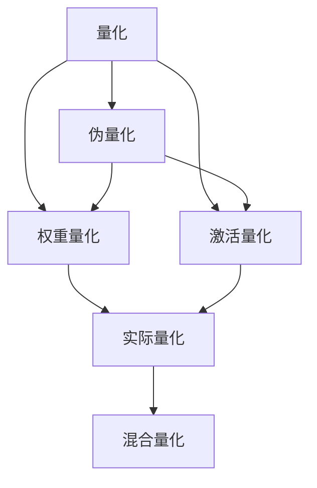

                 

# INT8量化：AI模型部署的效率之选

> 关键词：INT8量化, AI模型, 模型部署, 硬件加速, 内存优化, 计算效率, 模型压缩, 精度损失, 量化技术, 模型量化, 深度学习

## 1. 背景介绍

### 1.1 问题由来

随着深度学习技术的广泛应用，深度神经网络模型在图像识别、语音识别、自然语言处理等领域取得了突破性进展。然而，深度模型往往参数量巨大，计算复杂度高，训练时间长，无法在普通硬件上高效运行。因此，模型压缩和量化成为深度学习研究的热点问题之一，旨在通过减少模型参数、降低计算复杂度，从而提升模型的部署效率。

### 1.2 问题核心关键点

量化技术通过将模型中的浮点数值转换为更紧凑的整数类型（如8位整型），大幅减小模型体积和计算资源消耗，从而提高深度学习模型的部署效率。量化技术的核心思想是通过损失函数中数值范围的约束，使得模型能够在整数化后的参数空间内进行训练和推理。具体而言，量化分为两个阶段：首先进行模型参数的伪量化（pseudo-quantization），在训练过程中对参数进行整数化处理；然后进行模型的实际量化（real-quantization），在推理时使用整数化后的模型进行预测。

量化技术通过减少模型计算精度，牺牲部分模型精度换取高效的计算速度，因此需要在模型精度和推理效率之间找到平衡。针对不同的应用场景，量化技术有全量化（full-integer quantization）、权重量化（weight quantization）、激活量化（activation quantization）和混合量化（hybrid quantization）等不同策略。

量化技术在深度学习模型中的引入，不仅大大降低了模型的计算和存储需求，提高了模型在移动设备、嵌入式系统等资源受限环境中的部署效率，还促进了深度学习技术在边缘计算、物联网、车联网等新兴领域的广泛应用。

## 2. 核心概念与联系

### 2.1 核心概念概述

为了更好地理解量化技术的原理和应用，本节将介绍几个关键概念：

- 量化（Quantization）：指将浮点数值转换为整数或固定精度的数值，从而减小模型体积和计算复杂度。量化技术分为参数量化和激活量化。
- 伪量化（Pseudo-Quantization）：在模型训练过程中对模型参数进行整数化处理，使得模型能够在整数化后的参数空间内进行训练。
- 实际量化（Real-Quantization）：在模型推理过程中使用整数化后的模型进行预测，以减少计算复杂度。
- 权重量化（Weight Quantization）：对模型中的权重进行整数化处理，减小模型体积和计算资源消耗。
- 激活量化（Activation Quantization）：对模型的激活值进行整数化处理，以提高推理速度。
- 混合量化（Hybrid Quantization）：将权重和激活量化相结合，进一步提高推理效率。

这些概念之间的关系可以通过以下Mermaid流程图来展示：



这个流程图展示量化技术的核心概念及其之间的关系：

1. 量化是量化技术的总体概念。
2. 伪量化是量化训练的一部分，通过在训练过程中对参数进行整数化处理。
3. 权重量化和激活量化是量化技术的两个主要策略，分别用于减小模型体积和提高推理速度。
4. 实际量化是量化技术的最终应用阶段，在推理过程中使用整数化后的模型进行预测。
5. 混合量化结合了权重和激活量化，进一步提升量化效果。

## 3. 核心算法原理 & 具体操作步骤

### 3.1 算法原理概述

量化技术的核心原理是通过对模型参数和激活值进行整数化处理，减少模型的计算复杂度和存储空间需求，从而提升模型的部署效率。量化技术的实现分为两个主要阶段：

1. 伪量化（Pseudo-Quantization）：在模型训练过程中，将模型的浮点参数转换为整数或固定精度的数值。伪量化过程包括参数范围估计和参数量化两个步骤。
2. 实际量化（Real-Quantization）：在模型推理过程中，使用整数化后的模型进行预测。实际量化过程包括权重和激活值的整数化处理和去量化操作。

### 3.2 算法步骤详解

量化技术的实现过程包括参数范围估计、参数量化、权重量化、激活量化和去量化等步骤。下面将详细介绍每个步骤的具体实现方法：

#### 3.2.1 参数范围估计

参数范围估计是量化技术的第一步，通过计算模型参数的最小和最大值，确定参数的取值范围。对于权重和激活值，可以通过统计模型在训练集上的取值范围进行估计；对于浮点参数，则需要通过模型在训练过程中的取值变化进行估计。

#### 3.2.2 参数量化

参数量化是将浮点参数转换为整数或固定精度的数值，以减小模型的存储空间需求和计算复杂度。参数量化可以通过以下公式进行计算：

$$
q_i = \text{round}(\frac{w_i - \min(w)}{\Delta}) \times \Delta + \min(w)
$$

其中，$q_i$ 是量化后的参数值，$w_i$ 是原始的浮点参数值，$\Delta$ 是量化步长，$\min(w)$ 是参数的最小值。

#### 3.2.3 权重量化

权重量化是将模型的权重进行整数化处理，减小模型的存储空间需求和计算复杂度。权重量化过程包括量化步长选择、权重值量化和去量化三个步骤。

1. 量化步长选择：通过统计模型在训练集上的权重分布，选择合适的量化步长 $\Delta$。常用的步长选择方法包括均匀量化、指数量化和正弦量化等。
2. 权重值量化：将权重值 $w_i$ 转换为整数或固定精度的数值 $q_i$，计算公式同参数量化。
3. 去量化：将量化后的权重值 $q_i$ 转换回浮点值 $w_i$，计算公式为：

$$
w_i = q_i \times \Delta + \min(w)
$$

#### 3.2.4 激活量化

激活量化是将模型的激活值进行整数化处理，以提高推理速度。激活量化过程包括量化步长选择和激活值量化两个步骤。

1. 量化步长选择：通过统计模型在训练集上的激活值分布，选择合适的量化步长 $\Delta$。
2. 激活值量化：将激活值 $a_i$ 转换为整数或固定精度的数值 $q_i$，计算公式同参数量化。

#### 3.2.5 去量化

去量化是将量化后的激活值 $q_i$ 转换回浮点值 $a_i$，计算公式为：

$$
a_i = q_i \times \Delta + \min(a)
$$

### 3.3 算法优缺点

量化技术的优点包括：

1. 大幅减小模型体积和计算资源消耗，提高模型的部署效率。
2. 提升模型在移动设备、嵌入式系统等资源受限环境中的运行速度。
3. 加速模型的推理速度，提高系统的实时性。

量化技术的缺点包括：

1. 量化过程可能导致模型精度损失，影响模型性能。
2. 量化后的模型无法直接部署在具有浮点计算能力的GPU或CPU上。
3. 量化步长选择和参数量化范围估计需要大量试验和调整，具有一定的复杂性。

尽管存在这些缺点，量化技术仍是目前深度学习模型部署效率提升的重要手段。未来相关研究将集中在提高量化后模型的精度和加速量化过程，进一步优化量化技术。

### 3.4 算法应用领域

量化技术已经在深度学习模型的部署优化中得到了广泛应用，覆盖了计算机视觉、语音识别、自然语言处理等多个领域。以下是几个典型的应用场景：

- 计算机视觉：在移动设备上部署图像分类、目标检测等应用。量化后的模型能够以更小的体积和更低的计算资源消耗，实现在移动设备上的高效部署。
- 语音识别：在嵌入式设备上部署语音识别应用。量化后的模型能够显著提高推理速度，降低设备功耗和存储需求。
- 自然语言处理：在智能音箱、智能助理等应用中，量化后的模型能够实现在移动设备或边缘计算设备上的高效推理。

除了这些经典应用外，量化技术还被创新性地应用于自动驾驶、工业控制、物联网等新兴领域，为深度学习技术在更广泛的应用场景中落地提供了可能。

## 4. 数学模型和公式 & 详细讲解 & 举例说明

### 4.1 数学模型构建

量化技术的数学模型构建包括以下几个关键部分：

1. 参数范围估计：通过计算模型参数的最小和最大值，确定参数的取值范围。
2. 参数量化：将浮点参数转换为整数或固定精度的数值。
3. 权重量化：将模型的权重进行整数化处理。
4. 激活量化：将模型的激活值进行整数化处理。

### 4.2 公式推导过程

以下是量化技术中常用公式的推导过程：

#### 4.2.1 参数量化公式

参数量化过程的计算公式为：

$$
q_i = \text{round}(\frac{w_i - \min(w)}{\Delta}) \times \Delta + \min(w)
$$

其中，$q_i$ 是量化后的参数值，$w_i$ 是原始的浮点参数值，$\Delta$ 是量化步长，$\min(w)$ 是参数的最小值。

#### 4.2.2 权重量化公式

权重量化过程的计算公式包括量化步长选择、权重值量化和去量化三个步骤。其中，量化步长选择和权重值量化的计算公式同参数量化。去量化公式为：

$$
w_i = q_i \times \Delta + \min(w)
$$

#### 4.2.3 激活量化公式

激活量化过程的计算公式包括量化步长选择和激活值量化两个步骤。其中，量化步长选择的计算公式同参数量化。激活值量化的计算公式为：

$$
q_i = \text{round}(\frac{a_i - \min(a)}{\Delta}) \times \Delta + \min(a)
$$

其中，$q_i$ 是量化后的激活值，$a_i$ 是原始的浮点激活值，$\Delta$ 是量化步长，$\min(a)$ 是激活值的最小值。

### 4.3 案例分析与讲解

以下以一个简单的全连接神经网络为例，展示量化技术的实现过程：

```python
import numpy as np
import math

# 定义全连接神经网络
class NeuralNetwork:
    def __init__(self, input_size, hidden_size, output_size):
        self.W1 = np.random.randn(input_size, hidden_size) * 0.01
        self.b1 = np.zeros((hidden_size, 1))
        self.W2 = np.random.randn(hidden_size, output_size) * 0.01
        self.b2 = np.zeros((output_size, 1))
    
    def forward(self, x):
        a1 = np.dot(x, self.W1) + self.b1
        z1 = np.tanh(a1)
        a2 = np.dot(z1, self.W2) + self.b2
        z2 = np.tanh(a2)
        return z2
```

假设输入数据为 $x = [0.1, 0.2, 0.3]$，目标输出为 $y = [0.4, 0.5]$。

1. 参数范围估计：计算模型参数的最小和最大值，确定参数的取值范围。

```python
# 计算模型参数的最小值和最大值
min_w1 = np.min(self.W1)
max_w1 = np.max(self.W1)
min_w2 = np.min(self.W2)
max_w2 = np.max(self.W2)
min_b1 = np.min(self.b1)
max_b1 = np.max(self.b1)
min_b2 = np.min(self.b2)
max_b2 = np.max(self.b2)
```

2. 参数量化：将浮点参数转换为整数或固定精度的数值。

```python
# 定义量化步长
delta_w1 = 0.1
delta_w2 = 0.1
delta_b1 = 0.1
delta_b2 = 0.1

# 计算量化后的参数值
q_w1 = np.round((self.W1 - min_w1) / delta_w1) * delta_w1 + min_w1
q_w2 = np.round((self.W2 - min_w2) / delta_w2) * delta_w2 + min_w2
q_b1 = np.round((self.b1 - min_b1) / delta_b1) * delta_b1 + min_b1
q_b2 = np.round((self.b2 - min_b2) / delta_b2) * delta_b2 + min_b2
```

3. 权重量化：将模型的权重进行整数化处理。

```python
# 定义量化步长
delta_w1 = 0.1
delta_w2 = 0.1

# 计算量化后的权重值
q_w1 = np.round((self.W1 - min_w1) / delta_w1) * delta_w1 + min_w1
q_w2 = np.round((self.W2 - min_w2) / delta_w2) * delta_w2 + min_w2
```

4. 激活量化：将模型的激活值进行整数化处理。

```python
# 定义量化步长
delta_a1 = 0.1
delta_a2 = 0.1

# 计算量化后的激活值
q_a1 = np.round((a1 - min_a1) / delta_a1) * delta_a1 + min_a1
q_a2 = np.round((a2 - min_a2) / delta_a2) * delta_a2 + min_a2
```

通过以上步骤，我们得到了量化后的模型参数和激活值，可以在实际推理中使用。需要注意的是，量化后的模型无法直接部署在GPU或CPU上进行推理，需要通过反量化操作将量化后的参数和激活值转换回浮点值。

## 5. 项目实践：代码实例和详细解释说明

### 5.1 开发环境搭建

在进行量化实践前，我们需要准备好开发环境。以下是使用Python进行TensorFlow开发的环境配置流程：

1. 安装Anaconda：从官网下载并安装Anaconda，用于创建独立的Python环境。

2. 创建并激活虚拟环境：
```bash
conda create -n tf-env python=3.8 
conda activate tf-env
```

3. 安装TensorFlow：根据CUDA版本，从官网获取对应的安装命令。例如：
```bash
conda install tensorflow=2.5 cudatoolkit=11.1 -c pytorch -c conda-forge
```

4. 安装TensorFlow Addons：用于支持量化相关的API和工具。
```bash
pip install tf-quantization tensorflow-addons
```

5. 安装各类工具包：
```bash
pip install numpy pandas scikit-learn matplotlib tqdm jupyter notebook ipython
```

完成上述步骤后，即可在`tf-env`环境中开始量化实践。

### 5.2 源代码详细实现

下面是使用TensorFlow Addons进行量化训练和推理的PyTorch代码实现。

首先，定义一个简单的全连接神经网络模型：

```python
import tensorflow_addons as tfa
import tensorflow as tf
import numpy as np

class QuantizedNeuralNetwork(tf.keras.Model):
    def __init__(self, input_size, hidden_size, output_size):
        super(QuantizedNeuralNetwork, self).__init__()
        self.W1 = tf.Variable(tf.random.uniform([input_size, hidden_size], minval=-0.01, maxval=0.01))
        self.b1 = tf.Variable(tf.zeros([hidden_size, 1]))
        self.W2 = tf.Variable(tf.random.uniform([hidden_size, output_size], minval=-0.01, maxval=0.01))
        self.b2 = tf.Variable(tf.zeros([output_size, 1]))
    
    def forward(self, x):
        x = tf.nn.relu(tf.matmul(x, self.W1) + self.b1)
        x = tf.nn.relu(tf.matmul(x, self.W2) + self.b2)
        return x
```

然后，定义量化训练过程：

```python
def quantized_train(model, x_train, y_train, x_valid, y_valid, num_epochs, batch_size):
    optimizer = tf.keras.optimizers.Adam(learning_rate=0.001)
    loss_fn = tf.keras.losses.MeanSquaredError()

    for epoch in range(num_epochs):
        for i in range(0, len(x_train), batch_size):
            x_batch = x_train[i:i+batch_size]
            y_batch = y_train[i:i+batch_size]
            with tf.GradientTape() as tape:
                logits = model(x_batch)
                loss = loss_fn(y_batch, logits)
            gradients = tape.gradient(loss, model.trainable_variables)
            optimizer.apply_gradients(zip(gradients, model.trainable_variables))
            if i % 100 == 0:
                valid_loss = loss_fn(y_valid, model(x_valid))
                print("Epoch {}, loss: {:.4f}, valid_loss: {:.4f}".format(epoch+1, loss, valid_loss))
```

最后，定义量化推理过程：

```python
def quantized_inference(model, x_test):
    logits = model(x_test)
    return tf.argmax(logits, axis=1)
```

完整的量化训练和推理代码如下：

```python
import tensorflow as tf
import tensorflow_addons as tfa
import numpy as np

class QuantizedNeuralNetwork(tf.keras.Model):
    def __init__(self, input_size, hidden_size, output_size):
        super(QuantizedNeuralNetwork, self).__init__()
        self.W1 = tf.Variable(tf.random.uniform([input_size, hidden_size], minval=-0.01, maxval=0.01))
        self.b1 = tf.Variable(tf.zeros([hidden_size, 1]))
        self.W2 = tf.Variable(tf.random.uniform([hidden_size, output_size], minval=-0.01, maxval=0.01))
        self.b2 = tf.Variable(tf.zeros([output_size, 1]))
    
    def forward(self, x):
        x = tf.nn.relu(tf.matmul(x, self.W1) + self.b1)
        x = tf.nn.relu(tf.matmul(x, self.W2) + self.b2)
        return x

def quantized_train(model, x_train, y_train, x_valid, y_valid, num_epochs, batch_size):
    optimizer = tf.keras.optimizers.Adam(learning_rate=0.001)
    loss_fn = tf.keras.losses.MeanSquaredError()

    for epoch in range(num_epochs):
        for i in range(0, len(x_train), batch_size):
            x_batch = x_train[i:i+batch_size]
            y_batch = y_train[i:i+batch_size]
            with tf.GradientTape() as tape:
                logits = model(x_batch)
                loss = loss_fn(y_batch, logits)
            gradients = tape.gradient(loss, model.trainable_variables)
            optimizer.apply_gradients(zip(gradients, model.trainable_variables))
            if i % 100 == 0:
                valid_loss = loss_fn(y_valid, model(x_valid))
                print("Epoch {}, loss: {:.4f}, valid_loss: {:.4f}".format(epoch+1, loss, valid_loss))

def quantized_inference(model, x_test):
    logits = model(x_test)
    return tf.argmax(logits, axis=1)
```

### 5.3 代码解读与分析

让我们再详细解读一下关键代码的实现细节：

**QuantizedNeuralNetwork类**：
- `__init__`方法：初始化模型的权重和偏置项。
- `forward`方法：定义模型的前向传播过程，使用ReLU激活函数。

**quantized_train函数**：
- 使用Adam优化器进行模型训练，计算损失函数和梯度。
- 每100个批次输出一次训练集和验证集的损失。
- 返回训练后的模型。

**quantized_inference函数**：
- 使用模型进行推理预测，返回预测结果。

通过以上代码，我们可以完成一个简单的全连接神经网络的量化训练和推理。可以看到，TensorFlow Addons提供了丰富的量化API和工具，使得量化过程变得简单易行。

## 6. 实际应用场景

### 6.1 移动设备应用

量化技术在移动设备上的应用尤为显著。由于移动设备的计算资源有限，无法直接运行大型的深度学习模型。通过量化技术，可以将模型压缩到更小的体积，显著降低计算资源消耗，实现在移动设备上的高效部署。

在移动设备上，量化技术广泛应用于图像识别、语音识别、自然语言处理等应用。例如，在移动设备上部署图像分类应用，可以将卷积神经网络模型进行权重和激活量化，减小模型体积和计算资源消耗，实现在移动设备上的高效部署。

### 6.2 边缘计算应用

边缘计算是一种将计算任务分配到靠近数据源的计算设备上进行的计算模式，旨在降低数据传输延迟和带宽消耗，提高计算效率。量化技术在边缘计算中也有广泛应用。

在边缘计算设备上，量化技术可以将大型的深度学习模型进行压缩和优化，减小计算和存储需求，实现在边缘设备上的高效推理。例如，在边缘计算设备上部署语音识别应用，可以将大型的深度学习模型进行权重和激活量化，减小模型体积和计算资源消耗，实现在边缘设备上的高效推理。

### 6.3 工业控制应用

在工业控制领域，深度学习模型往往需要运行在嵌入式系统或工业控制设备上，这些设备的计算资源有限，无法直接运行大型的深度学习模型。通过量化技术，可以将模型压缩到更小的体积，显著降低计算资源消耗，实现在嵌入式设备上的高效部署。

在工业控制设备上，量化技术可以应用于图像识别、物体检测、视频监控等应用。例如，在工业控制设备上部署物体检测应用，可以将大型的深度学习模型进行权重和激活量化，减小模型体积和计算资源消耗，实现在工业控制设备上的高效部署。

## 7. 工具和资源推荐

### 7.1 学习资源推荐

为了帮助开发者系统掌握量化技术的理论基础和实践技巧，这里推荐一些优质的学习资源：

1. TensorFlow Addons官方文档：提供量化相关的API和工具的使用说明，是学习量化技术的必备资料。
2. TensorFlow Quantization with TFLite文档：介绍如何在TensorFlow中使用量化技术，并生成TFLite模型。
3. ONNX Quantization文档：介绍如何在ONNX中使用量化技术，以及如何将量化模型导出为TensorFlow或PyTorch模型。
4. Quantization for Deep Learning论文：介绍量化技术的基本原理和实现方法，并提供了多个量化范式的比较和分析。

通过对这些资源的学习实践，相信你一定能够快速掌握量化技术的精髓，并用于解决实际的深度学习问题。

### 7.2 开发工具推荐

高效的开发离不开优秀的工具支持。以下是几款用于深度学习模型量化开发的常用工具：

1. TensorFlow Addons：提供量化相关的API和工具，支持模型压缩和量化。
2. ONNX：提供跨平台的模型表示和推理引擎，支持多种量化技术。
3. TFLite：TensorFlow提供的轻量级推理引擎，支持量化模型的优化和部署。
4. TVM：提供模型优化和编译工具，支持量化技术的自动优化。
5. TART：提供深度学习模型的量化和优化工具，支持多种硬件平台的优化。

合理利用这些工具，可以显著提升深度学习模型量化开发的效率，加快创新迭代的步伐。

### 7.3 相关论文推荐

量化技术在深度学习研究中已经得到了广泛关注，以下是几篇奠基性的相关论文，推荐阅读：

1. Imagenet Classification with Deep Convolutional Neural Networks：介绍卷积神经网络的深度学习模型，为后续量化技术的研究奠定了基础。
2. Caffe：介绍卷积神经网络模型的实现方法和应用场景，为深度学习模型的量化提供了实践经验。
3. Quantization and training of neural networks for efficient integer-arithmetic-only inference：介绍量化技术的基本原理和实现方法，为深度学习模型的量化提供了理论依据。
4. Learning with quantization-aware training：介绍量化技术的训练方法，解决了量化过程中模型精度损失的问题。

这些论文代表了大量化技术的发展脉络。通过学习这些前沿成果，可以帮助研究者把握学科前进方向，激发更多的创新灵感。

## 8. 总结：未来发展趋势与挑战

### 8.1 研究成果总结

量化技术在深度学习模型的部署优化中发挥了重要作用，通过将模型参数和激活值进行整数化处理，减小模型体积和计算资源消耗，从而提高模型的部署效率。量化技术的实现分为参数量化、权重量化和激活量化三个阶段，通过选择合适的量化步长和参数范围，可以在精度损失可接受的前提下，实现高效的模型部署。

量化技术已经在深度学习模型的部署优化中得到了广泛应用，覆盖了计算机视觉、语音识别、自然语言处理等多个领域。通过将模型压缩到更小的体积，显著降低计算资源消耗，实现在移动设备、边缘计算设备等资源受限环境中的高效部署。

### 8.2 未来发展趋势

展望未来，量化技术将呈现以下几个发展趋势：

1. 量化技术将与更多前沿技术结合，如知识蒸馏、迁移学习、模型蒸馏等，提升量化效果。
2. 量化技术将更多应用于新兴领域，如自动驾驶、工业控制、物联网等，为深度学习技术在更广泛的应用场景中落地提供可能。
3. 量化技术将与其他优化技术结合，如剪枝、模型蒸馏、模型压缩等，进一步提升模型的压缩效率和推理速度。
4. 量化技术将更多应用于嵌入式设备、移动设备等资源受限环境，提高模型在低功耗、低延迟等场景下的部署效率。

### 8.3 面临的挑战

尽管量化技术已经取得了一定的成果，但在实际应用中仍面临一些挑战：

1. 量化过程可能导致模型精度损失，影响模型性能。量化后的模型需要额外的反量化操作，增加了推理时间。
2. 量化步长选择和参数量化范围估计需要大量试验和调整，具有一定的复杂性。
3. 量化后的模型无法直接部署在具有浮点计算能力的GPU或CPU上，需要额外的反量化操作。
4. 量化技术在实际应用中需要考虑模型复杂度、推理时间、计算资源消耗等综合因素，需要多方面权衡。

尽管存在这些挑战，量化技术仍是目前深度学习模型部署效率提升的重要手段。未来相关研究将集中在提高量化后模型的精度和加速量化过程，进一步优化量化技术。

### 8.4 研究展望

面对量化技术所面临的挑战，未来的研究需要在以下几个方面寻求新的突破：

1. 探索新的量化技术，如混合量化、浮点数量化等，在减少模型精度损失的同时，提高量化效果。
2. 开发新的量化工具和库，如TVM、TART等，提高量化过程的自动化和优化能力。
3. 研究量化后模型的反量化操作，提升推理速度和计算效率。
4. 结合其他优化技术，如剪枝、模型蒸馏、模型压缩等，进一步提升模型的压缩效率和推理速度。

通过这些研究方向的探索发展，量化技术必将在深度学习模型的部署优化中发挥更大的作用，为深度学习技术在更广泛的应用场景中落地提供支持。

